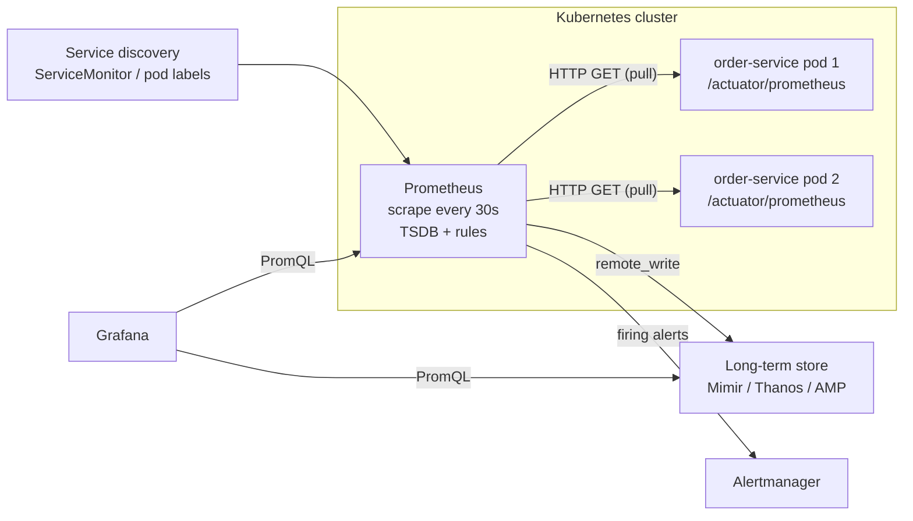

# Metrics with Micrometer/Prometheus & Dashboards (Grafana)

!!! abstract "Key takeaways"
    - **Micrometer** is the metrics facade for the JVM ("SLF4J for metrics"): you code against `MeterRegistry`/`Observation`, and a registry (Prometheus, OTLP, CloudWatch, Datadog) exports. Spring Boot Actuator auto-instruments HTTP, JVM, pools, Kafka and more.
    - **Prometheus pulls**: it scrapes `/actuator/prometheus` every 15–60 s, stores samples in a local TSDB and evaluates **recording** and **alerting rules**. Every unique label set is one **time series**, so labels must be bounded.
    - Query counters with **`rate()`**, never raw values; compute fleet percentiles with **`histogram_quantile()` over summed buckets**, never by averaging per-pod percentiles.
    - Good dashboards follow a hierarchy: **SLO and RED overview → per-service drill-down → resources (USE)**, with templated variables, deploy annotations and exemplars linking to traces.
    - At scale, single Prometheus servers are federated or remote-write into long-term stores (**Thanos, Mimir, Cortex, Amazon Managed Prometheus**).

## Why it matters

Metrics are the cheapest signal per question and the main source of alerts. A counter costs the same whether it counted ten requests or ten million, so metrics are how you watch traffic, error ratio, latency and saturation for every service all the time. Logs and traces then explain the anomalies metrics surface (see [Logs, metrics & traces](01-logs-metrics-and-traces.md)).

In Spring Boot 3 interviews, the questions are practical: which meter type for which job, why the p99 on your dashboard is wrong, why Prometheus ran out of memory, and how you would build a dashboard for a new service.

## Core concepts

### Micrometer's model

A **meter** has a name (dot-separated, e.g. `http.server.requests`), **tags** (key-value labels) and a type. The registry translates names to the backend's convention: `http.server.requests` becomes `http_server_requests_seconds_count`, `_sum` and `_bucket` in Prometheus.

| Meter | Records | Prometheus output | Example |
|---|---|---|---|
| `Counter` | Monotonic count | `_total` counter | Orders placed, retries |
| `Gauge` | Current value sampled on scrape | gauge | Queue depth, cache size |
| `Timer` | Count + total time + max (+ optional buckets) | `_seconds_count`, `_sum`, `_max`, `_bucket` | HTTP latency, DB call |
| `DistributionSummary` | Same as timer for non-time values | `_count`, `_sum`, `_bucket` | Payload bytes |
| `LongTaskTimer` | Duration of in-flight tasks | active count + duration | Batch jobs |

Since Boot 3, the **Observation API** is the preferred way to instrument: one `Observation` produces a timer metric *and* a span, and low-cardinality key-values become tags.

Actuator gives you, without code: `http.server.requests` and `http.client.requests`, `jvm.memory.*`, `jvm.gc.*`, `jvm.threads.*`, `process.cpu.usage`, HikariCP `hikaricp.connections.*`, Tomcat, Logback event counts, Kafka client metrics, cache metrics and more.

### Prometheus: pull, store, evaluate


*Notice that Prometheus pulls from targets it discovers; the app only exposes an endpoint. Alerting and long-term storage hang off Prometheus, and Grafana is only a query and display layer.*

**Why pull?** The scraper controls the rate, an unreachable target shows up immediately as `up == 0`, and apps don't need to know where monitoring lives. Short-lived batch jobs, which may finish before a scrape, push to a **Pushgateway** or use OTLP push instead.

Storage is a local time-series database: each series is a set of labels plus a stream of (timestamp, float) samples, compressed in 2-hour blocks. Local retention defaults to 15 days. Memory scales with the number of **active series**, which is why cardinality is the main operational risk.

### Cardinality

Series count for one metric is the product of distinct values of each label. `http_server_requests_seconds_bucket` with 5 URIs × 4 status codes × 3 methods × 2 outcomes × 12 buckets × 20 pods is already 57,600 series. Replace the templated URI with a raw path containing order IDs and it's millions.

Spring's HTTP instrumentation uses the **route template** (`/orders/{id}`) for the `uri` tag for this reason. Unknown paths collapse to `UNKNOWN` or `NOT_FOUND` rather than creating a series each.

{ loading=lazy }
*Every new label multiplies, it doesn't add. One unbounded label dwarfs everything else.*

### Histograms and percentiles

A timer exports count and sum by default, enough for rate and **average** latency. For percentiles you need either:

- **Client-side percentiles** (`publishPercentiles(0.95, 0.99)`): computed per instance, exported as gauges, **not aggregatable** across pods.
- **Percentile histograms** (`publishPercentileHistogram()` or `management.metrics.distribution.percentiles-histogram.<name>=true`): bucket counters (`le="0.1"`, `le="0.25"` …), **aggregatable**. PromQL estimates the quantile by linear interpolation within a bucket.

```promql
# Fleet-wide p99 for order-service: sum buckets first, then compute
histogram_quantile(0.99,
  sum by (le) (rate(http_server_requests_seconds_bucket{application="order-service"}[5m])))
```

The estimate is only as good as the bucket layout. Micrometer's default histogram has dozens of buckets; trim with `minimum-expected-value` and `maximum-expected-value`, or set explicit `service-level-objectives` buckets that match your SLO thresholds (e.g. 300 ms) so "percentage of requests under 300 ms" is exact. Prometheus 2.40+ also offers **native histograms** (sparse exponential buckets), which Micrometer does not emit by default; OTLP exponential histograms are the OTel equivalent.

{ loading=lazy }
*The p99 is interpolated inside one bucket, so a bucket boundary at your SLO threshold makes the answer exact where it matters.*

### PromQL essentials

| Need | Query |
|---|---|
| Requests per second | `sum by (application) (rate(http_server_requests_seconds_count[5m]))` |
| Error ratio | `sum(rate(...count{status=~"5.."}[5m])) / sum(rate(...count[5m]))` |
| Average latency | `rate(..._sum[5m]) / rate(..._count[5m])` |
| p99 latency | `histogram_quantile(0.99, sum by (le) (rate(..._bucket[5m])))` |
| Pool saturation | `hikaricp_connections_active / hikaricp_connections_max` |
| Target down | `up == 0` |
| Kafka consumer lag (exporter) | `sum by (consumergroup) (kafka_consumergroup_lag)` |

`rate()` handles counter resets when pods restart. Use a range at least 4× the scrape interval. **Recording rules** precompute expensive expressions (e.g. per-service error ratios) so dashboards and alerts stay fast.

### Dashboards in Grafana

A dashboard is good when an on-call engineer who didn't build it can answer "is it broken, where, since when?" in under a minute.

- **Hierarchy.** Top level: one row per service with SLO status and RED. Service level: RED by endpoint, dependencies (DB, Redis, Kafka, upstream HTTP), saturation. Resource level: JVM, pods, nodes (USE).
- **Template variables** (`$env`, `$service`, `$pod`) instead of copy-pasted dashboards.
- **Annotations** for deploys, feature flags and incidents: many spikes are explained by a change.
- **Exemplars** on latency panels link a point to its trace in Tempo or Jaeger.
- **Dashboards as code** (Grafana provisioning, Jsonnet/Grafonnet, Terraform provider) so they are reviewed and versioned.
- Avoid: averages without percentiles, pie charts of time series, 40 panels on one screen, y-axes without units, and "vanity" panels nobody acts on.

## In practice: code & configuration

```yaml
# application.yml, Spring Boot 3.x
management:
  endpoints.web.exposure.include: health,info,prometheus
  metrics:
    tags:
      application: ${spring.application.name}       # common tag on every meter
      region: ${REGION:local}
    distribution:
      percentiles-histogram:
        http.server.requests: true                  # aggregatable buckets
      slo:
        http.server.requests: 100ms,300ms,1s        # exact buckets at SLO thresholds
      minimum-expected-value:
        http.server.requests: 5ms
      maximum-expected-value:
        http.server.requests: 5s
  prometheus.metrics.export.enabled: true
```

=== "❌ Common mistake"
    ```java
    @RestController
    class ClaimController {
        private final MeterRegistry registry;
        ClaimController(MeterRegistry registry) { this.registry = registry; }

        @GetMapping("/claims/{id}")
        Claim get(@PathVariable String id, HttpServletRequest req) {
            // raw path + member id as tags: one series per claim and member
            registry.counter("claims.read", "path", req.getRequestURI(), "member", currentMemberId()).increment();
            // client-side percentiles: can't aggregate across pods
            Timer t = Timer.builder("claims.lookup").publishPercentiles(0.99).register(registry);
            return t.record(() -> service.find(id));
        }
    }
    ```

=== "✅ Correct approach"
    ```java
    @Service
    class ClaimLookup {
        private final Counter cacheMisses;
        private final ObservationRegistry observations;
        private final ClaimRepository repo;

        ClaimLookup(MeterRegistry registry, ObservationRegistry observations, ClaimRepository repo,
                    BlockingQueue<Claim> pending) {
            this.observations = observations;
            this.repo = repo;
            this.cacheMisses = Counter.builder("claims.cache.misses")        // register once, reuse
                    .description("Claim lookups that missed Redis")
                    .register(registry);
            Gauge.builder("claims.pending", pending, BlockingQueue::size)    // sampled on scrape
                    .register(registry);
        }

        Claim find(String id, ClaimSource source) {
            return Observation.createNotStarted("claims.lookup", observations)
                    .lowCardinalityKeyValue("source", source.name())          // bounded enum -> tag
                    .highCardinalityKeyValue("claim.id", id)                 // span only, never a tag
                    .observe(() -> repo.find(id));
        }
    }

    @Configuration
    class MetricsConfig {
        @Bean
        MeterFilter capUriTags() {   // safety net: cap distinct uri values per meter
            return MeterFilter.maximumAllowableTags("http.server.requests", "uri", 100, MeterFilter.deny());
        }
    }
    ```

A recording rule and a Kubernetes scrape config (Prometheus Operator):

```yaml
apiVersion: monitoring.coreos.com/v1
kind: ServiceMonitor
metadata: { name: order-service, labels: { release: kube-prometheus-stack } }
spec:
  selector: { matchLabels: { app: order-service } }
  endpoints:
    - port: http
      path: /actuator/prometheus
      interval: 30s
---
apiVersion: monitoring.coreos.com/v1
kind: PrometheusRule
metadata: { name: order-service-rules }
spec:
  groups:
    - name: order-service.recording
      rules:
        - record: service:http_requests:error_ratio_rate5m
          expr: |
            sum by (application) (rate(http_server_requests_seconds_count{status=~"5.."}[5m]))
            / sum by (application) (rate(http_server_requests_seconds_count[5m]))
```

## Real-world usage

- **Prometheus** came out of SoundCloud (2012), modelled on Google's Borgmon, and was the second project to graduate in the CNCF after Kubernetes. The `kube-prometheus-stack` Helm chart (Prometheus Operator, Alertmanager, Grafana, node-exporter, kube-state-metrics) is the common Kubernetes baseline.
- **Grafana Labs' Mimir**, **Thanos** and **Cortex** scale Prometheus horizontally with object-storage retention; **Amazon Managed Service for Prometheus** and **Azure Monitor managed Prometheus** are hosted equivalents with Amazon Managed Grafana / Azure Managed Grafana.
- **Netflix** built Atlas for in-memory dimensional metrics at very high volume; its design (and the Spectator client) influenced Micrometer's dimensional model.
- **Healthcare and banking:** metrics are aggregated, so they are the safest signal to share widely, as long as no member, account or claim identifiers become label values.

## Trade-offs & production gotchas

| Option | Pros | Cons | Use when |
|---|---|---|---|
| Prometheus pull + Actuator | Simple, standard, `up` health for free | Single-node TSDB, short retention | Most Kubernetes services |
| OTLP push to Collector/backend | One pipeline for all signals, works for short-lived jobs | Lose `up` semantics; need Collector | OTel-first platforms, serverless |
| CloudWatch / Azure Monitor native | Managed, integrates with cloud alarms | Cost per metric and per API call, weaker query language | Lambda, managed services |
| Client-side percentiles | Cheap, exact per instance | Not aggregatable | Single-instance apps only |
| Percentile histograms | Aggregatable, enable exemplars and SLO buckets | More series per meter | Anything with more than one pod |

!!! warning "Gotchas"
    - **Averaging percentiles**: `avg(p99)` across pods is mathematically meaningless. Sum buckets, then `histogram_quantile`.
    - **`rate()` then `sum()`**, not the other way round: summing raw counters across pods breaks reset detection.
    - **Gauge on a short-lived object**: Micrometer holds a weak reference, so a gauge on a temporary list silently reports `NaN`. Gauge a long-lived object or use `Gauge.builder(...).strongReference(true)`.
    - **Registering meters per call** with dynamic names or tags leaks memory in the app as well as in Prometheus.
    - **Scrape interval vs window**: `rate(x[30s])` with a 30 s scrape returns gaps. Use at least 4× the interval (`[2m]`) or Grafana's `$__rate_interval`.
    - **Exposing `/actuator/prometheus` publicly** leaks internals; serve management on a separate port or restrict by network policy.

!!! question "Interview angle"
    "Counter, gauge or timer for Kafka consumer lag?" Lag is a **gauge** (it goes up and down), usually taken from the broker side via an exporter or Kafka client metrics, not from your own counter. Then say you alert on lag growing (rate of change) or on time-based lag, not on a fixed message count.

## How this connects to my experience

- **Where I used it:** not a ★ resume claim. Bridges: Spring Boot microservices with Kafka, MongoDB and Redis on OptumRx Meteor; "Implemented Redis-based caching for frequently accessed queries and UI reference data" (cache hit ratio is the metric that proves it worked); EKS/AKS in the skills list.
- **Talking points:**
    - Which metrics stack was used (Prometheus/Grafana, a vendor APM, CloudWatch/Azure Monitor). *[confirm]*
    - Redis cache hit ratio and the latency improvement it produced. *[confirm the numbers, or say none were measured]*
    - Per-upstream latency/error metrics on the GraphQL Consumer Service for its 5 upstream systems. *[confirm]*
- **Likely follow-up chain:** "How did you know the cache helped?" → "Which percentile?" → "How was it computed across pods?" Answer with hit ratio and p95/p99 from histograms; if you only had averages then, say so and explain why histograms are better.

## Interview questions

### Fundamentals

??? question "Q1. What is Micrometer and why does Spring Boot use it?"
    **Answer:** A vendor-neutral metrics (and observation) facade for the JVM. Code uses `MeterRegistry` or the Observation API; a registry implementation exports to Prometheus, OTLP, Datadog, CloudWatch and others. Actuator auto-configures it and instruments HTTP, JVM, data sources, caches and messaging, so switching backends is a dependency change, not a code change.

    **Interviewer listens for:** facade analogy, Observation API, auto-instrumentation.

    **Common wrong answer:** "It's Spring's version of Prometheus."

??? question "Q2. Counter vs gauge vs timer: when do you use each?"
    **Answer:** Counter for things that only increase (requests, errors), queried with `rate()`. Gauge for a current value that goes up and down (queue size, active connections), sampled at scrape. Timer for durations and their count, with histogram buckets if you need percentiles.

    **Interviewer listens for:** `rate()` on counters, gauge sampled not accumulated.

    **Common wrong answer:** using a gauge for request counts.

??? question "Q3. Why does Prometheus pull instead of receiving pushes?"
    **Answer:** The server controls scrape load and timing, a dead target is detected immediately (`up == 0`), targets come from service discovery, and apps don't need to know the monitoring topology. Push is used for short-lived jobs via Pushgateway, or via OTLP into a Collector.

    **Interviewer listens for:** `up`, discovery, the batch-job exception.

    **Common wrong answer:** "Pull is faster."

### Intermediate

??? question "Q4. How do you compute p99 latency across 20 pods correctly?"
    **Answer:** Enable a percentile histogram, then `histogram_quantile(0.99, sum by (le) (rate(..._bucket[5m])))`. Summing bucket rates across pods first gives the fleet distribution; the quantile is interpolated within one bucket, so align bucket boundaries with SLO thresholds.

    **Interviewer listens for:** sum by `le` before the quantile.

    **Common wrong answer:** `avg(...{quantile="0.99"})`.

??? question "Q5. What is cardinality and how do you control it in Micrometer?"
    **Answer:** The number of distinct label combinations, each a series. Control: only bounded tag values (route templates, enums, status class), high-cardinality detail as span attributes, `MeterFilter.maximumAllowableTags` or `denyNameStartsWith` as a safety net, relabelling in Prometheus, and per-target `sample_limit`.

    **Interviewer listens for:** multiplicative growth and concrete controls.

    **Common wrong answer:** "Increase Prometheus memory."

??? question "Q6. What are recording rules and why use them?"
    **Answer:** Prometheus rules that evaluate an expression on a schedule and store the result as a new series. They make heavy dashboard and alert queries cheap and consistent, e.g. per-service error ratio over 5 m and 1 h used by SLO alerts.

    **Interviewer listens for:** precomputation, naming convention `level:metric:operations`.

    **Common wrong answer:** confusing them with alerting rules.

### Senior

??? question "Q7. How would you scale Prometheus for 300 services across several clusters?"
    **Answer:** One Prometheus (or agent) per cluster scraping locally, with `remote_write` to a horizontally scalable store (Mimir, Thanos, Cortex, AMP) for global queries and long retention; or Thanos sidecars and a querier. Add cardinality limits per tenant, recording rules for global views, and HA pairs with deduplication.

    **Interviewer listens for:** local scrape + global store, limits, HA.

    **Common wrong answer:** one giant central Prometheus scraping everything across clusters.

??? question "Q8. What makes a good service dashboard?"
    **Answer:** Answers is it broken, where and since when. Top: SLO status and RED; then per-endpoint RED, dependency health (DB, cache, Kafka lag, upstream calls), saturation (pools, threads, CPU, memory); deploy annotations; exemplars to traces; template variables; units on axes; dashboards as code.

    **Interviewer listens for:** hierarchy and links to the next signal.

    **Common wrong answer:** "All the JVM metrics on one page."

### Scenario-based

??? question "Q9. The dashboard shows average latency 80 ms but users complain. What's wrong?"
    **Answer:** Averages hide tails and mix fast cache hits with slow misses. Check p95/p99 by endpoint, status and pod from histograms; look for bimodal distributions (cache hit vs miss), one slow pod, or one upstream. Use an exemplar to open a slow trace.

    **Interviewer listens for:** percentiles, segmentation, exemplars.

    **Common wrong answer:** "80 ms is fine."

??? question "Q10. Prometheus is OOM-killed after a deploy. Walk through the response."
    **Answer:** Restore monitoring first (more memory temporarily or drop the target). Find the culprit with the TSDB status page (top series by metric and label) or `topk(10, count by (__name__)({__name__=~".+"}))`. Typically a new tag with unbounded values. Drop it with `metric_relabel_configs` or a `MeterFilter`, ship the fix, then add `sample_limit` per target and a review check for new tags.

    **Interviewer listens for:** restore, diagnose, fix, prevent.

    **Common wrong answer:** permanently scaling Prometheus.

## Cheat sheet

| Concept | Remember |
|---|---|
| Micrometer | Facade; `MeterRegistry`, Observation API; Actuator auto-instruments |
| Endpoint | `/actuator/prometheus`, expose via `management.endpoints.web.exposure.include` |
| Counter | `rate()`; `_total` suffix |
| Gauge | Current value; weak reference gotcha |
| Percentiles | Histogram buckets + `histogram_quantile`, sum by `le` first |
| SLO buckets | `management.metrics.distribution.slo.<meter>` |
| Cardinality | Product of label values; route templates; `MeterFilter` caps |
| Prometheus | Pull, 15 d default local retention, recording + alerting rules |
| Scale | remote_write to Mimir/Thanos/AMP |
| Dashboards | SLO/RED → service → USE; variables, annotations, exemplars, as code |

## Sources
1. [Micrometer: Concepts](https://docs.micrometer.io/micrometer/reference/concepts.html): meters, registries, naming, tags, gauges and weak references.
2. [Micrometer: Histograms and percentiles](https://docs.micrometer.io/micrometer/reference/concepts/histogram-quantiles.html): client-side percentiles vs aggregatable histograms.
3. [Spring Boot reference: Metrics](https://docs.spring.io/spring-boot/reference/actuator/metrics.html): auto-configured meters, `management.metrics.distribution.*`, Prometheus endpoint.
4. [Prometheus: Overview](https://prometheus.io/docs/introduction/overview/) and [Storage](https://prometheus.io/docs/prometheus/latest/storage/): pull model, TSDB, 15-day default retention.
5. [Prometheus: Histograms and summaries](https://prometheus.io/docs/practices/histograms/): aggregation, `histogram_quantile`, interpolation error.
6. [Prometheus: Recording rules](https://prometheus.io/docs/practices/rules/): naming and use.
7. [Grafana: Dashboard best practices](https://grafana.com/docs/grafana/latest/dashboards/build-dashboards/best-practices/): RED/USE, hierarchy, dashboards as code.
8. [Grafana Mimir documentation](https://grafana.com/docs/mimir/latest/): long-term horizontally scalable Prometheus storage.
