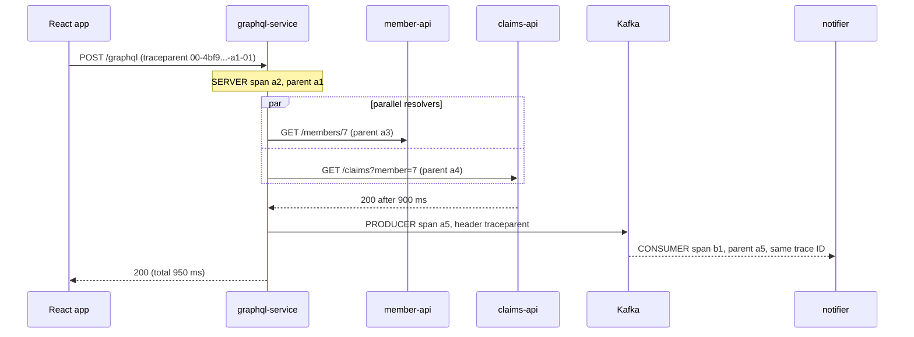
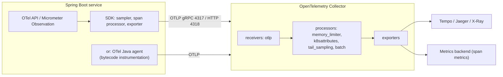

# Distributed Tracing with OpenTelemetry

!!! abstract "Key takeaways"
    - A **trace** is a tree of **spans** sharing one 16-byte **trace ID**; each span has its own 8-byte span ID, a parent, start/end times, attributes, events, links and a status. **Span kind** (server, client, producer, consumer, internal) tells the backend how spans connect.
    - **Context propagation** carries trace ID + parent span ID + sampled flag across process boundaries in the W3C **`traceparent`** header (and `tracestate`, `baggage`). One uninstrumented hop breaks the tree.
    - **OpenTelemetry** = API + SDK + instrumentation libraries + **OTLP** protocol + **Collector**. In Java you either use the zero-code **Java agent** or, in Spring Boot 3, **Micrometer Tracing** with the OTel bridge (Boot 4 adds a first-party OTel starter).
    - **Sampling** controls cost: **head sampling** (decide at the root, e.g. 10%, parent-based) is cheap but blind; **tail sampling** in the Collector keeps all errors and slow traces but needs all spans of a trace on one Collector instance.
    - Asynchronous hops (Kafka, thread pools, scheduled jobs) are where traces break; Kafka consumers in batch mode often need **span links** rather than parent-child.

## Why it matters

In a microservice request, latency and failures are spread across hops. Metrics say checkout p99 doubled; logs from six services say six different things. A trace shows the whole request as a timeline: which call was slow, which ran in sequence that could have run in parallel, which retried three times, which upstream returned the 500.

Tracing also exposes architecture problems that nothing else does: N+1 calls from a GraphQL resolver to an upstream, chatty service-to-service loops, a cache that is never hit. OpenTelemetry matters because it ended the vendor-agent era: you instrument once with an open standard and send the data to Jaeger, Tempo, X-Ray, Azure Monitor, Datadog or anything else that accepts OTLP.

## Core concepts

### Spans and the trace tree

| Field | Meaning |
|---|---|
| Trace ID | 128-bit ID shared by every span in the request |
| Span ID / parent ID | 64-bit ID of this operation and of its parent |
| Name | Low-cardinality operation name: `GET /orders/{id}`, `SELECT orders`, `orders publish` |
| Kind | `SERVER`, `CLIENT`, `PRODUCER`, `CONSUMER`, `INTERNAL` |
| Start / end | Wall-clock timestamps; duration is the difference |
| Attributes | Key-values following **semantic conventions** (`http.request.method`, `db.system`, `messaging.destination.name`) |
| Events | Timestamped points inside a span (exception recorded, retry) |
| Links | References to spans in other traces (batch consumers, fan-in) |
| Status | `UNSET`, `OK` or `ERROR` |

A **resource** describes the emitter (`service.name`, `service.version`, `deployment.environment`, `k8s.pod.name`) and is attached to every span, metric and log from that process.

### Context propagation

The W3C Trace Context header has four dash-separated fields:

```text
traceparent: 00-4bf92f3577b34da6a3ce929d0e0e4736-00f067aa0ba902b7-01
             │  │                                │                └ flags (01 = sampled)
             │  │                                └ parent span ID (the caller's client span)
             │  └ trace ID
             └ version
```

Inside a process, the current span lives in a **context** (thread-local in Java, Reactor `Context` in WebFlux). Instrumentation **injects** the context into outgoing carriers (HTTP headers, Kafka record headers, gRPC metadata) and **extracts** it on the way in, creating a child span. `baggage` carries user-defined key-values (tenant, claim ID) alongside; it is not added to spans automatically and is visible to every downstream service, so never put secrets in it.


*Notice that every hop carries the same trace ID; the parallel resolver calls appear as overlapping client spans, so the waterfall shows the claims call alone set the response time.*

{ loading=lazy }
*Watch the waterfall grow: the critical path is the longest child of each parallel group, not the sum of all spans.*

### OpenTelemetry components


*Notice the Collector in the middle: apps export once over OTLP, and the Collector handles enrichment, sampling, batching and fan-out to any backend, so changing vendors doesn't touch the apps.*

- **API**: what libraries and your code call. Safe no-op if no SDK is installed.
- **SDK**: implements sampling, batching (`BatchSpanProcessor`) and export.
- **Instrumentation**: the **Java agent** (`-javaagent:opentelemetry-javaagent.jar`) instruments 100+ libraries with zero code; Spring Boot's **Micrometer Tracing** instruments Spring components via the Observation API; the **OTel Spring Boot starter** is a third, agent-less option.
- **OTLP**: the wire protocol for traces, metrics and logs (gRPC on 4317, HTTP on 4318).
- **Collector**: deploy as an **agent** (DaemonSet or sidecar) near apps and/or a **gateway** tier. Processors add Kubernetes metadata, redact attributes, sample and batch.

### Sampling

| Strategy | Where | Keeps | Cost | Weakness |
|---|---|---|---|---|
| Always on | SDK | Everything | Highest | Only viable at low volume |
| Trace-ID ratio (head) | Root SDK | Fixed % chosen at start | Low | Misses rare errors |
| Parent-based | Every SDK | Follows caller's sampled flag | Low | Consistent, but inherits head blindness |
| Tail sampling | Collector | Errors, slow traces, % of the rest | Collector memory and CPU | All spans of a trace must reach the same Collector; decision wait (e.g. 10 s) |
| Rate-limiting / adaptive | SDK or backend | N traces/s per service | Predictable | Low-traffic endpoints may vanish |

Spring Boot samples **10%** by default (`management.tracing.sampling.probability`); the OTel SDK default is `parentbased_always_on`. Tail sampling usually sits behind a **load-balancing exporter** that routes by trace ID, so every span of a trace lands on the same Collector replica.

{ loading=lazy }
*Head sampling is a coin flip at the door; tail sampling decides after seeing the whole trace.*

### Asynchronous messaging

For Kafka, the producer creates a `PRODUCER` span and injects `traceparent` into record headers; the consumer extracts it and creates a `CONSUMER` span. With one record per poll this is a normal parent-child link. With **batch listeners**, one consumer span processes records from many traces, so OTel semantic conventions recommend **span links** to each producer context rather than picking one parent. Retries and DLQ topics should preserve headers so the dead-lettered record still points to its original trace.

## In practice: code & configuration

Option A, Spring Boot 3.x with Micrometer Tracing and the OTel bridge (as in [page 1](01-logs-metrics-and-traces.md)):

```yaml
management:
  tracing:
    sampling.probability: 0.1          # head sampling at the root; downstream follows parent
    propagation.type: w3c              # default; add b3 when talking to older Zipkin services
  otlp:
    tracing.endpoint: http://otel-collector:4318/v1/traces
spring.kafka:
  template.observation-enabled: true    # producer spans + header injection
  listener.observation-enabled: true    # consumer spans from headers
```

Option B, the OTel Java agent with no code changes (works for any JVM app):

```bash
java -javaagent:/otel/opentelemetry-javaagent.jar \
     -Dotel.service.name=claims-api \
     -Dotel.resource.attributes=deployment.environment=prod,service.version=2.3.1 \
     -Dotel.exporter.otlp.endpoint=http://otel-collector:4318 \
     -Dotel.traces.sampler=parentbased_traceidratio -Dotel.traces.sampler.arg=0.1 \
     -jar app.jar
```

Don't run both on one app; you'd get duplicate spans. Manual spans for business steps:

=== "❌ Common mistake"
    ```java
    @Service
    class EligibilityService {
        private final RestTemplate rest = new RestTemplate();   // not from the builder: no traceparent sent

        Eligibility check(String memberId) {
            Span span = tracer.nextSpan().name("eligibility " + memberId).start(); // ID in name: unbounded
            var result = rest.getForObject(URL, Eligibility.class, memberId);
            span.end();                                          // never ends if the call throws, no error recorded
            return result;
        }
    }
    ```

=== "✅ Correct approach"
    ```java
    @Service
    class EligibilityService {
        private final RestClient rest;
        private final Tracer tracer;

        EligibilityService(RestClient.Builder builder, Tracer tracer) {
            this.rest = builder.baseUrl("https://eligibility.internal").build(); // instrumented: injects traceparent
            this.tracer = tracer;
        }

        Eligibility check(String memberId, Plan plan) {
            Span span = tracer.nextSpan().name("eligibility.check").start();     // low-cardinality name
            try (Tracer.SpanInScope ws = tracer.withSpan(span)) {                // current span: MDC + child spans
                span.tag("plan.type", plan.type().name());                       // bounded attribute
                span.event("cache.miss");
                return rest.get().uri("/members/{id}", memberId).retrieve().body(Eligibility.class);
            } catch (RuntimeException e) {
                span.error(e);                                                   // status ERROR + exception event
                throw e;
            } finally {
                span.end();                                                      // always end
            }
        }
    }
    ```

For most code, prefer `Observation` (shown on page 1) or `@Observed`, which gives you a span *and* a timer metric from one wrapper.

A Collector gateway with tail sampling:

```yaml
processors:
  memory_limiter: { check_interval: 1s, limit_percentage: 80 }
  tail_sampling:
    decision_wait: 10s
    policies:
      - { name: errors,  type: status_code, status_code: { status_codes: [ERROR] } }
      - { name: slow,    type: latency,     latency: { threshold_ms: 1000 } }
      - { name: rest,    type: probabilistic, probabilistic: { sampling_percentage: 5 } }
  batch: {}
service:
  pipelines:
    traces:
      receivers: [otlp]
      processors: [memory_limiter, tail_sampling, batch]
      exporters: [otlp/tempo]
```

## Real-world usage

- **Google Dapper** (2010) established low-overhead sampled tracing; Twitter's **Zipkin** and Uber's **Jaeger** followed. **OpenTracing** and Google's **OpenCensus** merged into **OpenTelemetry** in 2019; it is the second most active CNCF project after Kubernetes.
- **Uber** reported Jaeger tracing thousands of microservices; its tracing data drives service dependency graphs and critical-path analysis.
- **AWS**: the AWS Distro for OpenTelemetry (ADOT) exports to X-Ray and CloudWatch; X-Ray itself recommends migrating instrumentation to OpenTelemetry. **Azure Monitor** Application Insights ships an OTel-based Java agent.
- **Grafana Tempo** stores traces in object storage indexed only by trace ID, relying on exemplars and log links to find IDs, which keeps costs low at 100% ingestion.
- **Healthcare and banking:** span attributes such as `url.full` and `db.query.text` can contain member IDs or SQL literals. Use the Collector's `attributes`/`redaction` processors and turn off statement capture where it isn't sanitised.

## Trade-offs & production gotchas

| Option | Pros | Cons | Use when |
|---|---|---|---|
| OTel Java agent | Zero code, broad library coverage, consistent semconv | Startup overhead, bytecode magic, version coupling | Polyglot fleets, legacy apps |
| Micrometer Tracing + OTel bridge | Native to Spring Boot 3, Observation gives metrics too | Covers Spring-managed components; others need manual work | Spring Boot 3 services |
| OTel Spring Boot starter | Agent-less OTel, works with native images | Narrower coverage than the agent | GraalVM native, no-agent policies |
| Head sampling 1–10% | Cheap, simple | Misses rare failures | High traffic, cost-sensitive |
| Tail sampling in Collector | Keeps what matters | Stateful tier, routing by trace ID | Errors and latency outliers matter (most prod) |

!!! warning "Gotchas"
    - **Broken traces**: a client built with `new RestTemplate()`/`WebClient.create()`, a non-instrumented proxy, a thread pool without context propagation, or a message bus that strips headers each start a new trace.
    - **High-cardinality span names** (`GET /orders/123`) wreck span-derived metrics and backend indexes. Names are templates; IDs go in attributes.
    - **Clock skew** makes child spans appear before parents; keep NTP healthy and trust durations within one host more than across hosts.
    - **Mixed propagators**: a B3-only legacy service drops W3C headers. Configure composite propagation (`w3c,b3`) during migration.
    - **Unbounded queues**: if the backend is down, the `BatchSpanProcessor` queue fills and drops spans; that's by design. Don't make export synchronous.

!!! question "Interview angle"
    "How does service B know it's part of the same trace as service A?" Strong answer: A's instrumentation injects the W3C `traceparent` header (trace ID, A's client span ID, sampled flag); B's server instrumentation extracts it and starts a server span whose parent is A's client span. Then name what breaks it.

## How this connects to my experience

- **Where I used it:** not a ★ resume claim. Strongest bridge: the GraphQL Consumer Service integrating 5 upstream systems on OptumRx Meteor; a GraphQL query fanning out to upstreams is the textbook case for a trace waterfall (parallel resolvers, N+1 calls, one slow upstream). Kafka retry/DLQ workflows are the async case.
- **Talking points:**
    - Whether tracing existed (OTel, an APM agent, X-Ray, Application Insights) and what it showed. *[confirm]*
    - How resolver-level latency per upstream was observed; if traces weren't available, how you found the slow upstream instead. *[confirm]*
    - Deloitte: AWS Lambda/ECS/EKS services, where ADOT or X-Ray would be the natural fit. *[confirm whether used]*
- **Likely follow-up chain:** "How would you trace a GraphQL request?" → "What about resolvers that call the same upstream 50 times?" → "How do you trace through Kafka?" Answer: one server span per operation named by operation name, child spans per resolver/upstream call, DataLoader batching visible as one client span instead of 50; Kafka via header propagation and links for batch consumers.

## Interview questions

### Fundamentals

??? question "Q1. What is a span and what is a trace?"
    **Answer:** A span is one timed operation (name, kind, start/end, attributes, events, status, parent). A trace is the tree of spans that share one trace ID and represents one end-to-end request across services.

    **Interviewer listens for:** parent-child, span kind, attributes vs name.

    **Common wrong answer:** "A trace is a log with timestamps."

??? question "Q2. What is the W3C traceparent header?"
    **Answer:** The standard propagation header: `version-traceId-parentSpanId-flags`, e.g. `00-<32 hex>-<16 hex>-01`, where the last byte's sampled bit says whether the caller recorded the trace. `tracestate` carries vendor data and `baggage` carries user key-values.

    **Interviewer listens for:** the four fields and the sampled flag.

    **Common wrong answer:** "It's the correlation ID header."

??? question "Q3. What are the OpenTelemetry components?"
    **Answer:** API, SDK, instrumentation (agent, libraries, Spring starter), the OTLP protocol and the Collector (receivers, processors, exporters). Plus semantic conventions that standardise attribute names.

    **Interviewer listens for:** Collector role and vendor neutrality.

    **Common wrong answer:** "OpenTelemetry is a tracing backend like Jaeger."

### Intermediate

??? question "Q4. Head vs tail sampling: trade-offs?"
    **Answer:** Head sampling decides at the root with no knowledge of outcome: cheap and stateless, consistent via parent-based sampling, but drops most errors at low rates. Tail sampling buffers spans in the Collector and decides after the trace completes (keep errors, slow traces, a % of others): far more useful, but stateful, needs routing by trace ID to one replica and adds memory and a decision delay.

    **Interviewer listens for:** routing by trace ID and decision wait.

    **Common wrong answer:** "Tail sampling samples the end of each trace."

??? question "Q5. How does tracing work across Kafka?"
    **Answer:** The producer creates a PRODUCER span and injects context into record headers; the consumer extracts it and creates a CONSUMER span as child (single record) or with span links (batch). In Spring Kafka enable observation on the template and listener; keep headers through retry and DLQ.

    **Interviewer listens for:** headers, links for batches.

    **Common wrong answer:** "You can't trace across Kafka."

??? question "Q6. Java agent or Micrometer Tracing in Spring Boot 3?"
    **Answer:** The agent gives broad zero-code coverage for many libraries and polyglot consistency; Micrometer Tracing is native to Boot, produces metrics and spans together via Observation, and avoids an agent. Choose one per service to avoid duplicates; many teams use Micrometer for Spring apps and the agent for everything else.

    **Interviewer listens for:** duplicate span risk and a reasoned choice.

    **Common wrong answer:** "Use both for more data."

### Senior

??? question "Q7. How would you roll out tracing across 60 services owned by 10 teams?"
    **Answer:** Collector platform first (agent + gateway, tail sampling, redaction). Shared Boot starter or agent image with service name, version, environment and W3C propagation defaults. Start with the edge and the busiest request paths so traces are end to end early; fix propagation gaps (proxies, pools, Kafka). Add exemplars and trace-to-logs links, then span metrics. Track coverage: % of traces with no orphan spans.

    **Interviewer listens for:** platform defaults and propagation-gap hunting.

    **Common wrong answer:** "Each team adds tracing when they have time."

??? question "Q8. A trace shows a 4 s gap with no spans. What could it be?"
    **Answer:** Uninstrumented work: a thread pool queue wait, a library without instrumentation, GC pause, a lock, a synchronous call through a client not built from the instrumented builder, or time spent in a message broker before consumption. Add spans or events around suspected sections and correlate with JVM metrics.

    **Interviewer listens for:** "missing instrumentation is also data".

    **Common wrong answer:** "The backend lost spans."

### Scenario-based

??? question "Q9. GraphQL queries are slow only for some users. How do traces help?"
    **Answer:** Filter traces by operation name and latency; compare waterfalls. Look for resolver fan-out (N+1 client spans to one upstream), sequential calls that could be parallel, one slow upstream, or cache misses. Fix with DataLoader batching, parallel resolution, caching, timeouts.

    **Interviewer listens for:** N+1 as a visual pattern.

    **Common wrong answer:** "Add more pods."

??? question "Q10. Traces from service C always start a new trace. Debug it."
    **Answer:** Check the request headers arriving at C for `traceparent`. If missing, the caller isn't injecting (client not instrumented, non-builder client, proxy stripping headers) or propagators mismatch (B3 vs W3C). If present, C isn't extracting (missing instrumentation or wrong propagator config). Fix and add a test that asserts header propagation.

    **Interviewer listens for:** inject vs extract, propagator mismatch.

    **Common wrong answer:** "Increase sampling."

## Cheat sheet

| Concept | Remember |
|---|---|
| IDs | Trace ID 16 bytes, span ID 8 bytes |
| traceparent | `00-traceId-parentId-flags` |
| Span kinds | SERVER, CLIENT, PRODUCER, CONSUMER, INTERNAL |
| Names | Low-cardinality templates; IDs in attributes |
| OTel parts | API, SDK, instrumentation, OTLP (4317/4318), Collector |
| Boot 3 | Micrometer Tracing + `micrometer-tracing-bridge-otel`, sampling 0.1 |
| Agent | `-javaagent`, `otel.*` properties, don't combine with Micrometer bridge |
| Sampling | Head (parent-based ratio) + tail in Collector (errors, slow) |
| Tail sampling | Route by trace ID; `decision_wait` |
| Kafka | Headers; links for batch consumers |

## Sources
1. [OpenTelemetry: Traces](https://opentelemetry.io/docs/concepts/signals/traces/): spans, kinds, attributes, events, links, status.
2. [OpenTelemetry: Sampling](https://opentelemetry.io/docs/concepts/sampling/): head vs tail sampling trade-offs.
3. [W3C Trace Context](https://www.w3.org/TR/trace-context/): `traceparent` and `tracestate` format.
4. [OpenTelemetry: Java agent](https://opentelemetry.io/docs/zero-code/java/agent/): zero-code instrumentation and configuration.
5. [OpenTelemetry Collector](https://opentelemetry.io/docs/collector/) and [tail sampling processor](https://github.com/open-telemetry/opentelemetry-collector-contrib/tree/main/processor/tailsamplingprocessor): pipelines, policies.
6. [OpenTelemetry semantic conventions for messaging](https://opentelemetry.io/docs/specs/semconv/messaging/messaging-spans/): producer/consumer spans, links for batches.
7. [Spring Boot reference: Tracing](https://docs.spring.io/spring-boot/reference/actuator/tracing.html): Micrometer Tracing, 10% default sampling, propagation, client builders.
8. [Dapper (Google, 2010)](https://research.google/pubs/dapper-a-large-scale-distributed-systems-tracing-infrastructure/): sampled tracing design.
9. [Grafana Tempo documentation](https://grafana.com/docs/tempo/latest/): trace-ID-indexed object storage, trace-to-logs.
