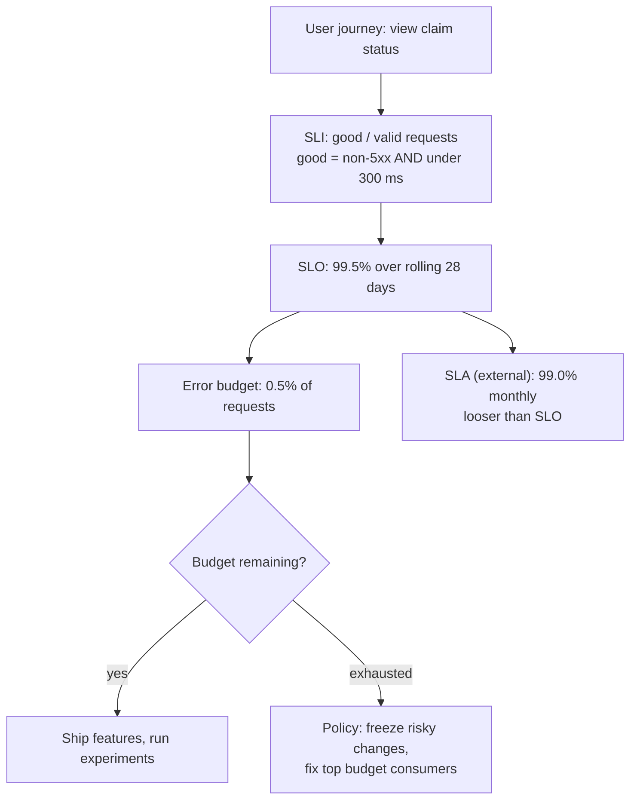

# SLIs, SLOs, SLAs & Error Budgets

!!! abstract "Key takeaways"
    - **SLI** = a measured ratio of good events to valid events (e.g. requests under 300 ms ÷ all requests). **SLO** = the target for that SLI over a window (99.9% over 28 days). **SLA** = a contract with consequences (credits, penalties), set **looser** than the SLO.
    - **Error budget** = 1 − SLO. At 99.9% over 30 days that's **43.2 minutes** of full outage, or 0.1% of requests. The budget is meant to be **spent** on releases and experiments, not hoarded.
    - Choose SLIs from the **user's point of view**: availability and latency at the load balancer or gateway, freshness for pipelines, correctness for data. Not CPU.
    - **100% is the wrong target**: users can't tell 99.99% from 100% through their own networks, and each extra nine costs roughly 10× more.
    - An **error budget policy** agreed in advance says what happens when the budget is exhausted (freeze risky releases, prioritise reliability work), so it's a decision rule, not a fight.

## Why it matters

"Is the service reliable enough?" is a negotiation between product (ship faster) and operations (change less). Without numbers it's settled by whoever shouts loudest after the last outage. SLOs make it a shared, measurable target: if users are happy at 99.9%, engineering time beyond that is better spent on features; if the service is below it, reliability work wins.

SLOs also fix alerting. Instead of paging on CPU or on every error, you page when the service is burning its error budget fast enough to miss the objective (see [Alerting & on-call](06-alerting-and-on-call.md)). Interviewers use this topic to check whether you can reason about reliability as a product decision, do the arithmetic, and tell an SLO from an SLA.

## Core concepts

### Definitions

| Term | What it is | Who cares | Example |
|---|---|---|---|
| **SLI** (indicator) | A quantitative measure of service level, best as good/valid events | Engineers | Proportion of `GET /claims` requests that return non-5xx in under 300 ms |
| **SLO** (objective) | Target value for an SLI over a time window | Engineering + product | 99.5% of those requests, rolling 28 days |
| **SLA** (agreement) | Contract with consequences if missed | Business, legal, customers | 99.0% monthly availability or 10% service credit |
| **Error budget** | 1 − SLO, the allowed unreliability | Everyone | 0.5% of requests ≈ 3.4 hours of full outage per 28 days |

The SRE book's ordering matters: the SLA should be **looser** than the SLO, so you get warned (SLO miss) before you owe money (SLA breach). Many internal services have SLOs but no SLA.


*Notice that the SLA hangs off the same SLI but sits below the SLO, and that the error budget turns the SLO into a decision about what to work on next.*

{ loading=lazy }
*The gap between SLO and SLA is your warning margin: you should miss the SLO long before you breach the contract.*

### Choosing SLIs

The SRE workbook's **SLI menu** by service type:

| Service type | SLI kinds | Measured where |
|---|---|---|
| Request-driven (API, GraphQL) | Availability, latency, (quality) | Load balancer / gateway logs or server metrics; synthetic probes for the client view |
| Pipeline / batch | Freshness, correctness, coverage | Timestamp of last good output; validation jobs |
| Storage | Durability, availability, latency | Read/write probes, replication checks |
| Async consumers (Kafka) | End-to-end latency or freshness, DLQ rate | Event timestamp vs processed time; consumer lag in seconds |

Rules of thumb:

- **Good / valid** ratio, not raw counts. Exclude invalid events explicitly (4xx from bad input usually isn't the service's fault; 429 from your own rate limiting arguably is).
- **Measure as close to the user as practical.** Server metrics miss requests that never arrive (DNS, LB failure). Load balancer metrics or synthetic probes catch them.
- **Latency SLIs use thresholds**, not averages: "99% of requests under 300 ms" counts good events directly from a histogram bucket at 300 ms.
- **Few SLIs per user journey.** One availability and one latency SLI for "view claim status" beats 30 per-endpoint SLOs nobody reads.

### Error budget arithmetic

| SLO | Budget | Per 30 days | Per 7 days | Per day |
|---|---|---|---|---|
| 99% | 1% | 7 h 12 min | 1 h 40.8 min | 14.4 min |
| 99.5% | 0.5% | 3 h 36 min | 50.4 min | 7.2 min |
| 99.9% | 0.1% | 43.2 min | 10.1 min | 1.44 min |
| 99.95% | 0.05% | 21.6 min | 5.04 min | 43.2 s |
| 99.99% | 0.01% | 4.32 min | 1.01 min | 8.64 s |

For request-based SLOs the budget is a **count**: 10 million requests a month at 99.9% allows 10,000 bad ones. A partial outage that fails 5% of requests for an hour uses the same budget as a full outage for 3 minutes.

**Burn rate** is how fast you're spending relative to plan: burn rate 1 spends exactly the budget over the window; burn rate 14.4 spends a 30-day budget's 2% in one hour (and all of it in about 2 days). Error rate = burn rate × (1 − SLO).

{ loading=lazy }
*Watch the slope, not the level: one bad hour can cost more budget than a fortnight of normal errors.*

### Windows and composition

- **Rolling windows** (last 28 days) match user memory and avoid "budget resets on the 1st". **Calendar windows** match business reporting and SLAs.
- **Dependencies multiply**: a service that synchronously needs three dependencies at 99.9% each can't promise better than about 99.7% (0.999³) without redundancy, caching or graceful degradation.
- **Critical vs non-critical paths**: the GraphQL field that shows a banner shouldn't fail the whole query; partial responses protect the SLO.

### The error budget policy

Written and agreed by engineering and product **before** it's needed. Typical content:

- While budget remains: normal release cadence; risky experiments allowed.
- Budget exhausted in the window: freeze non-critical releases (security and reliability fixes still go out), top budget consumers get a postmortem and priority fixes.
- Single incident consumes more than e.g. 20% of budget: mandatory postmortem with P0 action items.
- Escalation path if teams disagree (e.g. CTO decides).

Google's SRE workbook stresses that the policy must be enforceable and that SLOs should be **revisited** (quarterly is common) as user expectations and architecture change.

## In practice: code & configuration

Make the SLI exactly countable: a histogram bucket at the latency threshold (Spring Boot 3.x).

```yaml
management:
  metrics:
    distribution:
      slo:
        http.server.requests: 300ms      # adds le="0.3" bucket: "good latency" is an exact count
```

=== "❌ Common mistake"
    ```promql
    # "Availability" from CPU and pod restarts, latency from the average, 100% target
    avg(rate(process_cpu_usage[5m])) < 0.8
    avg(rate(http_server_requests_seconds_sum[5m]) / rate(http_server_requests_seconds_count[5m])) < 0.3
    # SLO: 100% (no budget, so every deploy is a "violation")
    ```

=== "✅ Correct approach"
    ```yaml
    # Recording rules: good/valid ratio for the "view claim status" journey
    groups:
      - name: slo.claims-status
        rules:
          - record: slo:sli_availability:ratio_rate5m
            expr: |
              sum(rate(http_server_requests_seconds_count{uri="/claims/{id}/status",status!~"5.."}[5m]))
              / sum(rate(http_server_requests_seconds_count{uri="/claims/{id}/status"}[5m]))
          - record: slo:sli_latency:ratio_rate5m
            expr: |
              sum(rate(http_server_requests_seconds_bucket{uri="/claims/{id}/status",le="0.3"}[5m]))
              / sum(rate(http_server_requests_seconds_count{uri="/claims/{id}/status"}[5m]))
          # Budget remaining over 28 days for a 99.5% availability SLO (1 = full, 0 = spent)
          - record: slo:error_budget_remaining:ratio
            expr: |
              1 - (
                (1 - sum_over_time(slo:sli_availability:ratio_rate5m[28d]) / count_over_time(slo:sli_availability:ratio_rate5m[28d]))
                / (1 - 0.995)
              )
    ```

The budget expression averages 5-minute ratios, which weights quiet and busy periods equally; for exact request-weighted results compute `increase(...[28d])` of good and total counters. Tools such as **Sloth** or **Pyrra** generate these rules (and the burn-rate alerts) from a short SLO spec, and Grafana, Datadog, Dynatrace and Google Cloud have SLO features built in.

A minimal SLO document, kept in the repo next to the service:

```yaml
service: claims-status
owner: team-claims
journey: "Member views claim status in the app"
slis:
  availability: "non-5xx responses / all responses at the API gateway, excluding 4xx"
  latency: "responses under 300 ms / all responses, measured at the service"
objectives:
  availability: 99.5% rolling 28d
  latency: 99% rolling 28d
sla: none (internal); external portal SLA 99.0% monthly
policy: docs/error-budget-policy.md
review: quarterly
```

## Real-world usage

- **Google** popularised SLOs and error budgets in the SRE book (2016) and workbook (2018); Google Cloud publishes SLAs (e.g. 99.99% for some multi-zone services) and runs internal SLOs tighter.
- **AWS** service SLAs (e.g. S3 Standard, EC2 regional) define monthly uptime percentages with service credits, a textbook SLA that is deliberately looser than internal targets.
- **Atlassian, Spotify and others** publish how error budget policies change release decisions; status pages (Atlassian Statuspage) communicate SLO-level health to customers.
- **Healthcare and banking:** SLOs differ by journey. A pharmacy refill submission or a payment posting deserves tighter availability and correctness SLOs than a marketing banner. Regulators (e.g. RBI and EBA outsourcing and ICT guidelines, DORA in the EU) increasingly expect defined service levels and incident reporting for critical services.

## Trade-offs & production gotchas

| Choice | Pros | Cons | Use when |
|---|---|---|---|
| Request-based SLO | Weights by traffic, precise | Low-traffic services get noisy ratios | Most APIs |
| Time-based (good minutes) | Intuitive "uptime" | A 1% partial failure counts as fully up or down | Low-traffic or SLA reporting |
| Rolling window | Smooth, matches users' memory | Harder to explain in monthly reports | Internal SLOs |
| Calendar window | Matches contracts | Budget resets encourage end-of-month risk | SLAs |
| Server-side SLI | Easy, detailed | Misses failures before the server | Starting point |
| LB / synthetic SLI | Closer to user | Less detail; probes are not real traffic | Critical journeys |

!!! warning "Gotchas"
    - **SLO = current performance** ("we're at 99.97%, so SLO 99.97%") leaves no budget and makes every release a breach. Set it at what users need.
    - **Too many SLOs** dilute attention. Start with 1–3 per critical journey.
    - **Excluding too much** ("4xx, timeouts from clients, maintenance windows…") produces a green SLO while users suffer.
    - **No policy** means the error budget is a dashboard, not a decision tool.
    - **Low traffic**: 100 requests a day at 99.9% means one failure breaches. Use longer windows, synthetic traffic or time-based SLIs.

!!! question "Interview angle"
    "What's the difference between an SLO and an SLA?" Give the one-line definitions, then the relationship: the SLA is a contract with penalties, set looser than the internal SLO so the SLO acts as an early warning. Then add the error budget and what the policy does.

## How this connects to my experience

- **Where I used it:** not a ★ resume claim. Bridges: OptumRx Meteor serving 750K+ users, "release management, and production support", and "stakeholder communication": the error budget is the tool for the release-vs-reliability conversation with stakeholders.
- **Talking points:**
    - Whether the platform had formal SLOs/SLAs (e.g. availability or response-time targets from the client), and their values. *[confirm]*
    - How a release decision was made after an incident: was there a freeze, or criteria like an error budget? *[confirm]*
    - What SLIs would fit the GraphQL Consumer Service: availability and latency per critical query, with partial-response handling for non-critical upstreams.
- **Likely follow-up chain:** "What SLO would you set for your GraphQL service?" → "How would you measure it?" → "What if one upstream is only 99.5%?" Answer with a user-journey SLI, request-based 28-day SLO, histogram buckets at the threshold, and dependency maths plus degradation (cache, partial responses, timeouts) to stay above the upstream's reliability.

## Interview questions

### Fundamentals

??? question "Q1. Define SLI, SLO and SLA."
    **Answer:** SLI: a measured indicator, ideally good events ÷ valid events (e.g. requests under 300 ms). SLO: an internal target for it over a window (99.9% over 28 days). SLA: an external agreement with consequences, normally looser than the SLO.

    **Interviewer listens for:** ratio form; SLA looser than SLO.

    **Common wrong answer:** using SLO and SLA interchangeably.

??? question "Q2. What is an error budget and how big is 99.9% over 30 days?"
    **Answer:** 1 − SLO, the allowed amount of unreliability. 0.1% of 30 days is 43.2 minutes; for request SLOs it's 0.1% of requests (10,000 of 10 million). It's spent on releases, experiments and incidents.

    **Interviewer listens for:** the arithmetic and "meant to be spent".

    **Common wrong answer:** "The time we're allowed to be down for maintenance."

??? question "Q3. Why not aim for 100%?"
    **Answer:** Users can't perceive the difference beyond the reliability of their own network and devices; each extra nine costs disproportionately more (redundancy, slower releases); and 100% leaves no room for change. Dependencies make it impossible anyway.

    **Interviewer listens for:** cost vs benefit, no room for change.

    **Common wrong answer:** "Because outages always happen" with no reasoning.

### Intermediate

??? question "Q4. Which SLIs would you choose for a REST API, a batch pipeline and a Kafka consumer?"
    **Answer:** API: availability (non-5xx ÷ valid) and latency (under threshold ÷ valid), measured at the gateway. Pipeline: freshness (time since last successful output) and correctness (validated records ÷ total). Kafka consumer: end-to-end latency or freshness (event time to processed), DLQ rate; lag in seconds rather than messages.

    **Interviewer listens for:** user-centric SLIs per service type.

    **Common wrong answer:** CPU and memory.

??? question "Q5. What is burn rate?"
    **Answer:** The rate of budget consumption relative to the rate that exactly exhausts it at the end of the window. Burn rate 1 = on track; 14.4 for an hour consumes 2% of a 30-day budget; error rate = burn rate × (1 − SLO). It's the basis of SLO alerting.

    **Interviewer listens for:** relative rate and the formula.

    **Common wrong answer:** "How many errors per second."

??? question "Q6. Rolling or calendar window?"
    **Answer:** Rolling (e.g. 28 days) for internal SLOs: matches user perception and avoids budget resets that invite end-of-month risk. Calendar months for SLAs and business reporting. 28 days keeps weekends constant.

    **Interviewer listens for:** reasoning about resets and consistency.

    **Common wrong answer:** no preference or reasoning.

### Senior

??? question "Q7. Your service depends on three synchronous dependencies at 99.9% each. What SLO can you offer?"
    **Answer:** If all three are needed per request, roughly 0.999³ ≈ 99.7% before your own failures. To offer more: remove hard dependencies from the critical path (cache, async, fallbacks, partial responses), add redundancy, set timeouts and circuit breakers, and negotiate upstream SLOs. Make the dependency SLOs explicit in the SLO doc.

    **Interviewer listens for:** multiplication and architectural mitigation.

    **Common wrong answer:** "99.9%, same as them."

??? question "Q8. How do you introduce SLOs in an organisation that has none?"
    **Answer:** Pick one or two critical user journeys, measure current SLIs for a few weeks, set an SLO slightly below current performance but at what users need, agree an error budget policy with product, move alerting to burn-rate, review monthly, then expand. Make it visible on dashboards and in planning.

    **Interviewer listens for:** start small, measure first, policy, iterate.

    **Common wrong answer:** "Set 99.99% for every service."

### Scenario-based

??? question "Q9. The budget is gone in week two, and product wants to ship a big feature. What do you do?"
    **Answer:** Apply the agreed policy: pause risky releases, ship reliability fixes for the top budget consumers (identified from postmortems and SLI breakdowns). Negotiate: if the feature is critical, ship behind a flag with canary and quick rollback, with explicit sign-off from whoever the policy names. If the SLO is unrealistic, revisit it formally, not ad hoc.

    **Interviewer listens for:** policy-driven, data on consumers, escalation path.

    **Common wrong answer:** "Ship anyway" or "freeze forever".

??? question "Q10. SLO dashboards are green but users complain. Why?"
    **Answer:** SLIs measure the wrong thing or the wrong place: server-side only (misses LB/DNS failures), averages, too many exclusions, wrong journey, or a slow-but-200 response. Validate with support tickets, RUM or synthetic probes; redefine SLIs closer to the user.

    **Interviewer listens for:** SLI validity, measurement point.

    **Common wrong answer:** "Users are wrong; the SLO is met."

## Cheat sheet

| Concept | Remember |
|---|---|
| SLI | good / valid events, user-centric |
| SLO | target over window; internal; 28-day rolling common |
| SLA | contract, penalties, looser than SLO |
| Budget | 1 − SLO; 99.9% / 30 d = 43.2 min |
| Nines | 99% 7.2 h, 99.5% 3.6 h, 99.9% 43 min, 99.99% 4.3 min (per 30 d) |
| Burn rate | error rate = burn × (1 − SLO); 14.4 for 1 h = 2% of 30 d budget |
| Dependencies | Serial availability multiplies |
| Policy | Agreed in advance; freeze, fix top consumers, escalation |
| Latency SLI | Histogram bucket at threshold (`management.metrics.distribution.slo`) |
| Tools | Sloth, Pyrra, Grafana/Datadog SLOs |

## Sources
1. [Google SRE book, ch. 4: Service Level Objectives](https://sre.google/sre-book/service-level-objectives/): SLI/SLO/SLA definitions, SLA looser than SLO, choosing targets.
2. [Google SRE book, ch. 3: Embracing Risk](https://sre.google/sre-book/embracing-risk/): error budgets, why not 100%.
3. [Google SRE workbook: Implementing SLOs](https://sre.google/workbook/implementing-slos/): SLI menu by service type, good/valid ratio, error budget policy.
4. [Google SRE workbook: Error budget policy example](https://sre.google/workbook/error-budget-policy/): freeze rules, escalation.
5. [Google SRE workbook: Alerting on SLOs](https://sre.google/workbook/alerting-on-slos/): burn rate definition and formula.
6. [Spring Boot reference: Metrics, histograms and SLO buckets](https://docs.spring.io/spring-boot/reference/actuator/metrics.html): `management.metrics.distribution.slo`.
7. [Sloth](https://sloth.dev/) and [Pyrra](https://github.com/pyrra-dev/pyrra): SLO-to-Prometheus-rule generators.
8. [AWS: Amazon S3 SLA](https://aws.amazon.com/s3/sla/): example of a contractual SLA with service credits.
