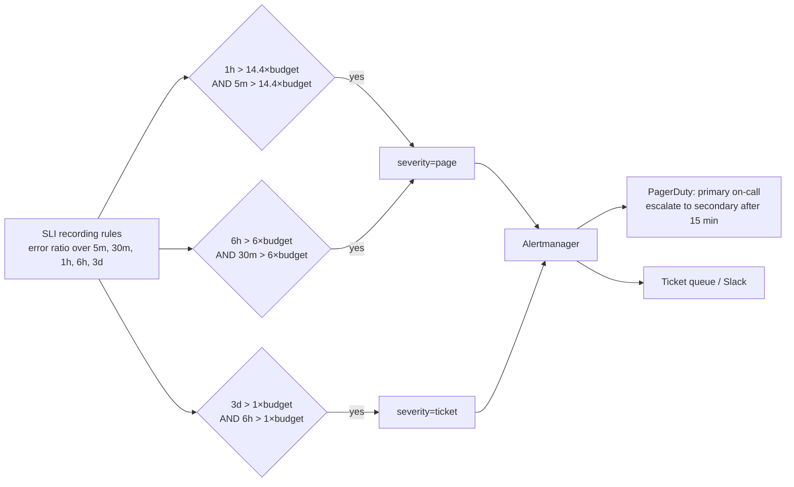

# Alerting & On-call

!!! abstract "Key takeaways"
    - **Page on symptoms, not causes.** Page when users are hurt (SLO burn, error ratio, latency), and send causes (CPU, disk, a pod restart) to tickets or dashboards. Every page must be **urgent, actionable and real**.
    - **Multi-window, multi-burn-rate** SLO alerts are the standard: page at burn rate **14.4 over 1 h (with a 5 m short window)** and **6 over 6 h (30 m)**; ticket at **1 over 3 days (6 h)**. Short windows make alerts reset quickly after recovery.
    - Judge alerts by **precision** (pages that mattered), **recall** (incidents that paged), **detection time** and **reset time**. Static thresholds trade these badly.
    - **Alertmanager** groups, deduplicates, silences and inhibits alerts, then routes by labels (team, severity) to PagerDuty, Opsgenie, Slack or email. Each alert links a **runbook** and a dashboard.
    - Sustainable on-call: primary + secondary, follow-the-sun or week-long rotations, a cap on pages per shift (Google SRE: at most **2 incidents per 12-hour shift** on average), handoffs and alert reviews that delete noisy alerts.

## Why it matters

Alerting is where observability meets people at 3 a.m. Bad alerting fails in two directions: **too noisy** (engineers ignore pages, miss the real one, and burn out) or **too quiet** (customers find the outage first). Both are common; the fix for both is to alert on what users experience and to measure alert quality.

Interviewers at senior level want to hear a philosophy (symptoms, SLOs, actionability), concrete mechanics (burn rates, `for:` durations, grouping, inhibition, escalation) and how you'd fix a team drowning in alerts. This page builds on [SLIs, SLOs & error budgets](05-slis-slos-slas-and-error-budgets.md) and leads into [incident management](07-incident-management-and-postmortems.md).

## Core concepts

### What deserves a page

The SRE book's test for every paging rule:

- Does it detect an otherwise undetected condition that is **urgent, actionable and actively or imminently user-visible**?
- Will I ever ignore it knowing it's benign? Then it shouldn't page.
- Does it definitely indicate users are being hurt? Can the response be automated instead?

| Severity | Channel | Response | Examples |
|---|---|---|---|
| Page (critical) | PagerDuty/Opsgenie phone + push | Acknowledge in minutes, act now | Fast SLO burn, checkout errors > budget, data loss risk |
| Ticket (warning) | Jira/queue, business hours | Days | Slow SLO burn, disk 80% and rising, cert expires in 14 days |
| Info | Dashboard, Slack channel | None required | Deploy finished, autoscaling event |

### Symptoms vs causes

**Symptom alerts** (error ratio, latency, freshness, SLO burn) have high precision: if they fire, users are affected. **Cause alerts** (CPU 90%, one pod restarted, GC time) fire often without user impact and miss failures they didn't anticipate. Keep cause signals on dashboards to speed up diagnosis after a symptom pages. Exceptions where cause-based paging is right: imminent, certain harm that symptoms will show too late, such as disk about to fill on a database or a certificate expiring in hours.

### Multi-window, multi-burn-rate alerts

A plain "error ratio > 0.1% for 5 minutes" fires on brief blips (poor precision) and misses slow, steady burns (poor recall). The SRE workbook evolves through several designs to this one, for a 30-day SLO:

| Severity | Long window | Short window | Burn rate | Budget consumed when it fires |
|---|---|---|---|---|
| Page | 1 h | 5 min | 14.4 | 2% |
| Page | 6 h | 30 min | 6 | 5% |
| Ticket | 3 days | 6 h | 1 | 10% |

Budget consumed = burn rate × long window ÷ SLO period (14.4 × 1 h ÷ 720 h = 2%). The alert fires only when **both** windows exceed the threshold: the long window gives significance, the short window (about 1/12 of the long one) proves it's **still happening**, so the alert resets within minutes of recovery instead of staying red for an hour.


*Notice that three rules on the same SLI cover fast and slow burns, and that the severity label, not the rule name, decides where the alert goes.*

{ loading=lazy }
*The long window decides whether it's serious; the short window decides whether it's still happening, which is why the page clears quickly.*

### Alertmanager: from alert to human

Prometheus evaluates rules and sends firing alerts; **Alertmanager** decides who hears about them:

- **Grouping** (`group_by: [alertname, service]`) turns 50 pod-level alerts into one notification.
- **Timing**: `group_wait` (initial batch delay, e.g. 30 s), `group_interval` (new alerts in an existing group, e.g. 5 m), `repeat_interval` (re-notify, e.g. 4 h).
- **Inhibition**: suppress dependent alerts while a root alert fires (e.g. silence service alerts when the whole cluster is unreachable).
- **Silences**: time-boxed mutes for maintenance, with an author and a comment.
- **Routing tree**: match labels (`team`, `severity`, `env`) to receivers.

The paging tool (PagerDuty, Opsgenie, Grafana OnCall, incident.io) then handles **schedules, escalation policies** (primary → secondary → manager), acknowledgement and phone/SMS/push delivery.

{ loading=lazy }
*Grouping and inhibition are what turn an alert storm into one actionable page.*

### Runbooks

Every paging alert carries a `runbook_url` annotation. A good runbook is short and operational: what the alert means for users, the dashboard and log/trace queries to open, common causes with checks, safe mitigations (roll back, scale, fail over, disable a feature flag), escalation contacts, and links to past incidents. If the runbook is a fixed sequence of commands, automate it.

### On-call that people can sustain

- **Rotation**: primary and secondary; one week is common, or follow-the-sun across time zones so nobody is paged at night routinely.
- **Load limits**: Google SRE aims for at most 25% of SRE time on on-call and, on average, no more than 2 incidents per 12-hour shift, so each one can be handled and followed up properly.
- **Handoff**: open issues, silences, risky changes in flight.
- **Compensation and time off** after rough nights; leadership on the rotation too.
- **Alert reviews** weekly or per rotation: for each page, was it actionable? Delete, demote or fix the ones that weren't. Track pages per week and the % that were actionable.

## In practice: code & configuration

Burn-rate alerts for the "view claim status" availability SLO (99.5%, so budget = 0.005), using recording rules like those on page 5 for each window:

=== "❌ Common mistake"
    ```yaml
    groups:
      - name: claims.alerts
        rules:
          - alert: HighCPU                                 # cause, not symptom: pages with no user impact
            expr: process_cpu_usage > 0.8
            labels: { severity: page }
          - alert: AnyError                                # one 500 at 3 a.m. pages someone
            expr: increase(http_server_requests_seconds_count{status=~"5.."}[1m]) > 0
            labels: { severity: page }
          - alert: PodRestarted                           # Kubernetes already handles this
            expr: increase(kube_pod_container_status_restarts_total[5m]) > 0
            labels: { severity: page }
            # no runbook, no dashboard, no team label
    ```

=== "✅ Correct approach"
    ```yaml
    groups:
      - name: slo.claims-status.alerts
        rules:
          - alert: ClaimsStatusErrorBudgetFastBurn
            expr: |
              (slo:sli_error:ratio_rate1h{service="claims-status"} > (14.4 * 0.005)
               and slo:sli_error:ratio_rate5m{service="claims-status"} > (14.4 * 0.005))
              or
              (slo:sli_error:ratio_rate6h{service="claims-status"} > (6 * 0.005)
               and slo:sli_error:ratio_rate30m{service="claims-status"} > (6 * 0.005))
            labels: { severity: page, team: claims, service: claims-status }
            annotations:
              summary: "Claim status errors are burning the 28d budget fast"
              description: "Error ratio {{ $value | humanizePercentage }}. Members may not see claim status."
              runbook_url: https://runbooks.internal/claims-status/error-budget-burn
              dashboard: https://grafana.internal/d/claims-status
          - alert: ClaimsStatusErrorBudgetSlowBurn
            expr: |
              slo:sli_error:ratio_rate3d{service="claims-status"} > 0.005
              and slo:sli_error:ratio_rate6h{service="claims-status"} > 0.005
            labels: { severity: ticket, team: claims, service: claims-status }
            annotations:
              runbook_url: https://runbooks.internal/claims-status/error-budget-burn
    ```

Alertmanager routing with grouping and inhibition:

```yaml
route:
  receiver: default-slack
  group_by: [alertname, service]
  group_wait: 30s
  group_interval: 5m
  repeat_interval: 4h
  routes:
    - matchers: [ 'severity="page"' ]
      receiver: pagerduty-claims
      continue: true                       # also post to the team channel
    - matchers: [ 'severity="ticket"' ]
      receiver: jira-claims
inhibit_rules:
  - source_matchers: [ 'alertname="KubernetesClusterUnreachable"' ]
    target_matchers: [ 'severity=~"page|ticket"' ]
    equal: [ cluster ]                     # mute downstream noise from the same cluster
receivers:
  - name: pagerduty-claims
    pagerduty_configs: [ { routing_key: "<secret>" } ]
  - name: jira-claims
    webhook_configs: [ { url: "https://jira-bridge.internal/alerts" } ]
  - name: default-slack
    slack_configs: [ { api_url: "<secret>", channel: "#claims-alerts" } ]
```

Also alert on the **monitoring itself**: a `Watchdog`/dead-man's-switch alert that always fires and pages if it *stops* arriving (Prometheus or Alertmanager is down), plus `up == 0` for scrape targets as a ticket.

## Real-world usage

- **Google SRE** documents symptom-based paging, the burn-rate design above and on-call load limits; many teams adopt them verbatim through tools like Sloth, Pyrra and the Grafana SLO app.
- **PagerDuty** publishes its incident response and on-call guides; its escalation policies and schedules are the de facto model (Opsgenie, now part of Atlassian, and Grafana OnCall follow the same concepts).
- **kube-prometheus-stack** ships hundreds of default alerts; teams that page on all of them suffer alert fatigue. A common first step is to demote all cause alerts to tickets and add SLO alerts on top.
- **Healthcare and banking:** some alerts are compliance-driven (failed audit log shipping, encryption key access anomalies, batch files to payers or banks missing a cut-off). These are often freshness or deadline SLIs and deserve pages because the consequence is regulatory.

## Trade-offs & production gotchas

| Approach | Precision | Recall | Detection | Reset | Notes |
|---|---|---|---|---|---|
| Static threshold, short `for:` | Low | High | Fast | Fast | Noisy on blips |
| Static threshold, long `for:` | Better | Lower | Slow | Fast | Misses brief severe outages |
| Single burn rate, long window | High | Low for slow burns | Medium | Slow | Stays red long after recovery |
| Multi-window multi-burn-rate | High | High | Fast for severe | Fast | More rules; generate them |
| Anomaly detection / ML | Varies | Varies | Varies | Varies | Hard to explain; use for tickets first |

!!! warning "Gotchas"
    - **Alert fatigue** is a safety problem: if more than a small share of pages are non-actionable, people stop trusting them. Track it.
    - **`for:` hides flapping** but delays detection; burn-rate windows are a better fix than long `for:` durations.
    - **Low-traffic services** produce huge ratios from a single failure (1 of 3 requests = 33%). Add a minimum request count to the expression, or use synthetic traffic.
    - **Alerts without owners** (no `team` label) go to a shared channel nobody reads.
    - **Monitoring the monitor**: if Prometheus dies, nothing pages. Use a dead-man's-switch.
    - **Silences that never expire** hide real outages later; always time-box with a reason.

!!! question "Interview angle"
    "Your team gets 40 pages a week. What do you do?" Measure first (which alerts, how many actionable), delete or demote cause alerts, group and inhibit, replace thresholds with SLO burn-rate alerts, write runbooks for what's left, automate repetitive mitigations, and review every rotation. Target a handful of actionable pages per week.

## How this connects to my experience

- **Where I used it:** not a ★ resume claim. Bridges: "Led ... production support" on OptumRx Meteor and owning the GraphQL Consumer Service "end-to-end", which implies being the escalation point when it misbehaved; Kafka DLQ handling, where DLQ growth is a classic ticket-level alert.
- **Talking points:**
    - The alerting and on-call setup used (PagerDuty/Opsgenie/ServiceNow, rotation shape, who was primary). *[confirm]*
    - An example of a noisy alert you removed or improved, if one exists. *[confirm]*
    - What would page for the GraphQL service: SLO burn on critical queries; tickets for one upstream's error ratio or DLQ growth.
- **Likely follow-up chain:** "What paged you?" → "Was it actionable?" → "How would you redesign it?" Answer with symptom vs cause, burn-rate alerts, runbooks and an alert review habit; don't claim a rotation size or page volume you can't back up.

## Interview questions

### Fundamentals

??? question "Q1. What makes a good alert?"
    **Answer:** It indicates urgent, user-visible impact (or imminent harm), it's actionable by the person paged, it's rarely a false positive, and it links to a runbook and dashboard. If it can be ignored or automated, it shouldn't page.

    **Interviewer listens for:** urgent, actionable, user impact; runbook.

    **Common wrong answer:** "Alert on everything so we don't miss anything."

??? question "Q2. Symptom-based vs cause-based alerting?"
    **Answer:** Symptoms are what users feel (errors, latency, freshness); causes are internal conditions (CPU, memory, restarts). Page on symptoms for precision and coverage of unknown causes; keep causes on dashboards and tickets, except imminent certain harm like a disk about to fill.

    **Interviewer listens for:** precision and unknown failure modes.

    **Common wrong answer:** "Cause-based is better because it's earlier."

??? question "Q3. What does Alertmanager do?"
    **Answer:** Receives alerts from Prometheus and handles grouping, deduplication (including from HA Prometheus pairs), inhibition, silences and routing by labels to receivers such as PagerDuty, Slack, email or webhooks, with timing controls (`group_wait`, `group_interval`, `repeat_interval`).

    **Interviewer listens for:** grouping and inhibition specifically.

    **Common wrong answer:** "It evaluates alert rules." (Prometheus does.)

### Intermediate

??? question "Q4. Explain multi-window, multi-burn-rate alerting."
    **Answer:** Alert when the error budget burns faster than a threshold over both a long and a short window: e.g. 14.4× over 1 h and 5 m (2% budget) or 6× over 6 h and 30 m (5%) to page, 1× over 3 days and 6 h to ticket. Long windows give significance and catch slow burns; short windows ensure the problem is ongoing so alerts reset fast.

    **Interviewer listens for:** the numbers or the reasoning, and the reset-time benefit.

    **Common wrong answer:** "Alert if errors exceed 1% for 5 minutes."

??? question "Q5. How do you measure alert quality?"
    **Answer:** Precision (% of alerts that were significant), recall (% of significant incidents that alerted), detection time and reset time. Operationally: pages per shift, % actionable, MTTA, incidents found by customers first.

    **Interviewer listens for:** precision/recall and customer-detected incidents.

    **Common wrong answer:** "Number of alerts configured."

??? question "Q6. What belongs in a runbook?"
    **Answer:** What the alert means and user impact, links to dashboards/log/trace queries, likely causes with checks, safe mitigations (rollback, scale, failover, feature flag), escalation contacts and related past incidents. Kept short, versioned, linked from the alert annotation.

    **Interviewer listens for:** mitigation first, linked from the alert.

    **Common wrong answer:** "A wiki page describing the architecture."

### Senior

??? question "Q7. Design an on-call rotation for a team of 8 across India and the US."
    **Answer:** Follow-the-sun: India covers its day, US its day, so no routine night pages; primary and secondary per region; weekly rotation with a handoff note; escalation primary → secondary → lead after 15 minutes; caps on page load with an alert review each rotation; time off after heavy nights; leads on the rotation. *(Illustrative design.)*

    **Interviewer listens for:** humane coverage, escalation, feedback loop.

    **Common wrong answer:** one person on call 24/7 for a month.

??? question "Q8. How do you alert on a Kafka consumer pipeline?"
    **Answer:** Symptom: end-to-end freshness or latency SLO (event time to processed) with burn-rate alerts. Supporting tickets: consumer lag in seconds growing, DLQ rate above baseline, rebalance storms, no messages processed for N minutes when producers are active. Page only on SLO burn or a hard deadline risk.

    **Interviewer listens for:** freshness over raw lag counts, DLQ as ticket.

    **Common wrong answer:** "Page when lag > 1000 messages."

### Scenario-based

??? question "Q9. Prometheus went down overnight and nobody noticed. How do you prevent that?"
    **Answer:** A dead-man's-switch: an always-firing `Watchdog` alert routed to an external service (PagerDuty heartbeat, Healthchecks, Grafana Cloud) that pages when the heartbeat stops. Run Prometheus/Alertmanager in HA pairs and monitor them from another cluster or a managed service.

    **Interviewer listens for:** external heartbeat, HA.

    **Common wrong answer:** "Add an alert for Prometheus being down" (in the same Prometheus).

??? question "Q10. A fast-burn alert fired at 2 a.m., and by the time you looked it had cleared. What now?"
    **Answer:** Check the SLI and how much budget was consumed; look at traces and logs for the window; check deploys, dependencies and traffic spikes. If real but self-healed, open a ticket with findings; if it recurs, investigate root cause. If it was a blip that shouldn't page, tune windows or add a minimum-traffic condition. Record it in the alert review.

    **Interviewer listens for:** investigate rather than dismiss; tune with data.

    **Common wrong answer:** "It cleared, so ignore it."

## Cheat sheet

| Concept | Remember |
|---|---|
| Page if | Urgent, actionable, user-visible; else ticket or dashboard |
| Symptoms | Errors, latency, freshness, SLO burn |
| Burn-rate page | 14.4× (1 h + 5 m) = 2%; 6× (6 h + 30 m) = 5% |
| Burn-rate ticket | 1× (3 d + 6 h) = 10% |
| Formula | budget consumed = burn × window ÷ period |
| Quality | Precision, recall, detection time, reset time |
| Alertmanager | Group, dedupe, inhibit, silence, route |
| Timing | `group_wait` 30 s, `group_interval` 5 m, `repeat_interval` 4 h (typical) |
| On-call load | ≤ 2 incidents per 12 h shift; ≤ 25% time on-call (Google SRE) |
| Must-have | Runbook URL, team label, dead-man's-switch |

## Sources
1. [Google SRE workbook: Alerting on SLOs](https://sre.google/workbook/alerting-on-slos/): burn-rate windows and thresholds, precision, recall, detection and reset time.
2. [Google SRE book, ch. 6: Monitoring Distributed Systems](https://sre.google/sre-book/monitoring-distributed-systems/): symptoms vs causes, questions for paging rules.
3. [Google SRE book, ch. 11: Being On-Call](https://sre.google/sre-book/being-on-call/): 25% on-call time, two incidents per 12-hour shift.
4. [Prometheus: Alerting rules](https://prometheus.io/docs/prometheus/latest/configuration/alerting_rules/) and [Alertmanager](https://prometheus.io/docs/alerting/latest/alertmanager/): `for`, labels, annotations, grouping, inhibition, silences, routing.
5. [Prometheus: Alerting practices](https://prometheus.io/docs/practices/alerting/): alert on symptoms, keep alerts simple, monitor the monitoring.
6. [PagerDuty Incident Response: On-call](https://response.pagerduty.com/oncall/being_oncall/): rotations, escalation, handoffs.
7. [Sloth](https://sloth.dev/): generates multi-window burn-rate alerts from SLO specs.
