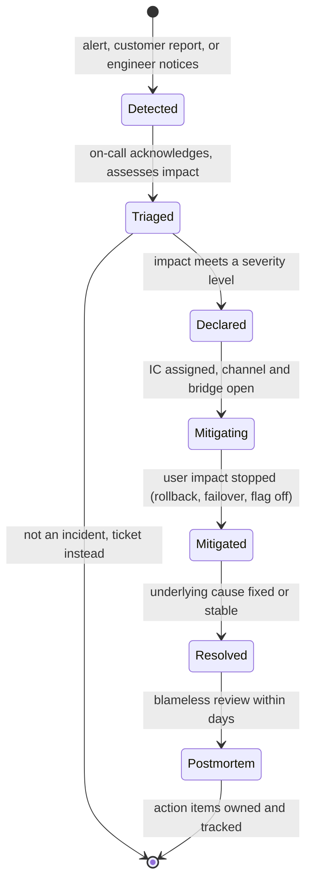

# Incident Management & Postmortems

!!! abstract "Key takeaways"
    - An incident has a **lifecycle**: detect → triage and declare (severity) → mobilise roles → **mitigate** → resolve → postmortem → follow-up actions. **Mitigate first, root-cause later**: roll back, fail over, disable the flag.
    - Use a small **Incident Command System**: an **Incident Commander** who coordinates and decides (and doesn't debug), **Ops/SMEs** who fix, a **Communications** lead for stakeholders and status pages, and a **Scribe** for the timeline.
    - **Severity levels** (SEV1–SEV4) agreed in advance decide who is paged, how often to update and whether a postmortem is mandatory.
    - Measure **MTTD, MTTA, MTTM/MTTR** and customer-detected incidents, but treat them as trends: averages over few, very different incidents are noisy.
    - Postmortems are **blameless**: focus on contributing causes in systems and processes, assume people acted reasonably with what they knew, and produce **owned, prioritised, tracked** action items. "Be more careful" is not an action item.

## Why it matters

Every system fails; what separates teams is how quickly they restore service and whether the same failure happens twice. Incident management is the coordination layer: who is in charge, who talks to customers, what gets tried and in what order. Postmortems are the learning layer that turns an outage into fixes.

For a lead engineer this is a core interview area because it tests behaviour under pressure, communication and judgement, not just technical depth. Expect a STAR question ("tell me about a production incident you handled") followed by probes on your role, the timeline, how you communicated and what changed afterwards. It ties together the signals ([logs, metrics, traces](01-logs-metrics-and-traces.md)), [SLOs](05-slis-slos-slas-and-error-budgets.md) and [alerting](06-alerting-and-on-call.md).

## Core concepts

### The lifecycle


*Notice that mitigation and resolution are separate states: the clock users care about stops at "mitigated", often long before the root cause is understood.*

### Severity levels

Define them by **user and business impact**, not by which component broke. A common shape (exact definitions vary by company):

| Level | Impact | Response | Updates | Postmortem |
|---|---|---|---|---|
| SEV1 | Critical journey down for many users, data loss or security breach, regulatory exposure | Page immediately, IC + comms, exec notified | Every 15–30 min | Mandatory |
| SEV2 | Major degradation or a critical journey down for a subset | Page on-call, IC assigned | Every 30–60 min | Mandatory |
| SEV3 | Minor degradation, workaround exists | Business hours | As needed | Optional |
| SEV4 | Cosmetic, no user impact | Ticket | None | No |

When in doubt, **declare higher and downgrade**: the cost of an unnecessary bridge call is small; the cost of a slow response to a real SEV1 is large.

### Roles (Incident Command System)

Borrowed from emergency services (FEMA's ICS) and adapted by Google SRE and PagerDuty:

| Role | Does | Does not |
|---|---|---|
| **Incident Commander (IC)** | Owns the incident, sets priorities, assigns work, decides (e.g. "roll back now"), keeps state | Debug hands-on |
| **Operations / SMEs** | Investigate and apply changes in their area, report findings concisely | Make unannounced changes |
| **Communications lead** | Stakeholder and customer updates, status page, support teams | Speculate on cause publicly |
| **Scribe** | Timeline of observations, decisions and actions with timestamps | Filter what seems unimportant |
| **Deputy** (larger incidents) | Tracks open tasks and timers, ready to take over as IC | Run a parallel incident |

The IC role **hands over** explicitly ("I'm handing IC to Priya, confirm?") and rotates for long incidents. In small teams one person may hold several roles, but IC and hands-on debugging should be split as soon as a second person joins.

{ loading=lazy }
*One person decides and keeps the picture; everyone else reports to them, so nobody makes conflicting changes.*

### Running the response

1. **Acknowledge and assess**: what is broken for users, since when, how many? Check SLO dashboards, recent deploys, dependency status.
2. **Declare** with a severity, open a dedicated channel (`#inc-2026-10-10-claims`) and a bridge; page the roles.
3. **Stabilise first**: the best mitigations are usually generic and reversible: **roll back** the last deploy, **fail over** to another region, **disable a feature flag**, **shed load**, **scale out**, **drain** a bad node. Ask "what changed?" before deep debugging.
4. **Communicate on a cadence** even when there's nothing new: impact, what's being done, next update time. Separate internal (technical) from external (customer-facing) messages.
5. **Confirm mitigation** with the same SLI that detected it, then decide whether to stay in incident mode until resolution.
6. **Close**: summary, owner for the postmortem, date for review.

### Metrics

| Metric | From → to | Improved by |
|---|---|---|
| **MTTD** (detect) | Impact start → detection | SLO burn-rate alerts, synthetic checks |
| **MTTA** (acknowledge) | Alert → human acknowledges | Paging setup, sane alert volume |
| **MTTM** (mitigate) | Detection → user impact stopped | Rollbacks, flags, runbooks, failover drills |
| **MTTR** (resolve/restore) | Impact start or detection → resolved | Everything above; definitions vary, state yours |
| **MTBF** | Between failures | Fixing action items, resilience patterns |

Define these precisely in your org; "MTTR" alone means different things in different places. Also track **customer-detected incidents** and **repeat incidents** (same cause twice), which say more about maturity than averages do. DORA's software delivery metrics include **failed deployment recovery time** for the same reason.

{ loading=lazy }
*Mitigation stops user pain long before resolution; status updates go out on a clock, not when there's news.*

### Postmortems

**When:** criteria agreed in advance, typically every SEV1/SEV2, any data loss, user-visible impact beyond a threshold, an on-call intervention such as a rollback, a long resolution, or a monitoring failure where humans found the incident first. Anyone can request one.

**Blameless** means the review "focuses on identifying the contributing causes of the incident without indicting any individual or team" (Google SRE). People who feel blamed hide information, and the next incident is worse. The question is "why did the system let a reasonable person do this?", not "who did this?".

**Contents** (Google, PagerDuty, Atlassian templates agree closely):

- Summary, impact (users, duration, SLO budget consumed, revenue or regulatory exposure), severity.
- Detailed timeline with timestamps and evidence (graphs, logs, trace links).
- Contributing causes and trigger. Use **5 whys** or a causal tree, but expect several causes, not one root.
- What went well, what went poorly, where we got lucky.
- Action items: each with an **owner, priority, ticket and due date**, classified as prevent, detect, mitigate or process.

**Review and follow-through:** a draft reviewed by senior engineers for depth ("was the root cause sufficiently deep?"), a meeting to agree actions, publication to a searchable repository, and tracking of action-item completion. Google's line: "an unreviewed postmortem might as well never have existed."

## In practice: code & configuration

Incident tooling is mostly process, but some code makes mitigation fast and safe. A kill switch around a risky upstream call in a Spring Boot 3 GraphQL resolver, so the IC can say "turn it off" without a deploy:

=== "❌ Common mistake"
    ```java
    @Controller
    class MemberGraphQlController {
        private final RecommendationClient recommendations;

        @SchemaMapping(typeName = "Member", field = "recommendations")
        List<Recommendation> recommendations(Member member) {
            // No timeout, no fallback, no switch: when the upstream hangs, the whole query hangs,
            // and the only mitigation during an incident is an emergency deploy.
            return recommendations.fetch(member.id());
        }
    }
    ```

=== "✅ Correct approach"
    ```java
    @Controller
    class MemberGraphQlController {
        private static final Logger log = LoggerFactory.getLogger(MemberGraphQlController.class);
        private final RecommendationClient recommendations;   // RestClient with 800 ms read timeout
        private final FeatureFlags flags;                       // e.g. OpenFeature / LaunchDarkly / config server

        MemberGraphQlController(RecommendationClient recommendations, FeatureFlags flags) {
            this.recommendations = recommendations;
            this.flags = flags;
        }

        @SchemaMapping(typeName = "Member", field = "recommendations")
        List<Recommendation> recommendations(Member member) {
            if (!flags.isEnabled("recommendations.enabled")) {          // kill switch: flip during an incident
                return List.of();                                       // non-critical field degrades, query survives
            }
            try {
                return recommendations.fetch(member.id());
            } catch (RestClientException e) {
                log.atWarn().addKeyValue("upstream", "recommendations")
                   .setCause(e).log("recommendations unavailable, returning empty");
                return List.of();                                       // partial response instead of failed query
            }
        }
    }
    ```

A postmortem skeleton kept in the repo (Markdown), so writing one is filling in blanks rather than starting from nothing:

```markdown
# PM-2026-031: Claim status errors after v2.3 release (SEV2)
**Status:** draft | **IC:** … | **Author:** … | **Review date:** …

## Impact
- 14:02–14:49 IST (47 min). ~18% of claim-status requests failed. 31% of the 28-day error budget used.

## Timeline (IST)
| Time | Event | Evidence |
|---|---|---|
| 13:55 | v2.3 deployed (canary skipped) | deploy log |
| 14:02 | Error ratio rises | SLO dashboard |
| 14:09 | Fast-burn page; on-call acks at 14:11 | PagerDuty |
| 14:20 | SEV2 declared, IC assigned | #inc channel |
| 14:41 | Rollback started | Argo CD |
| 14:49 | Error ratio back to baseline (mitigated) | SLO dashboard |

## Contributing causes
1. Connection pool max reduced from 50 to 10 in a shared config change.
2. Canary stage skipped for "config-only" changes.
3. No alert on pool saturation for this service.

## What went well / poorly / lucky
## Action items
| Action | Type | Owner | Priority | Ticket | Due |
|---|---|---|---|---|---|
| Canary required for config changes | Prevent | … | P1 | … | … |
| Pool saturation ticket alert | Detect | … | P2 | … | … |
| One-click rollback in runbook | Mitigate | … | P2 | … | … |
```

(The incident above is illustrative.)

## Real-world usage

- **Google SRE** describes incident management with IC, Ops, Comms and Planning roles and a living incident document; its postmortem culture chapter set the blameless norm.
- **PagerDuty** open-sourced its incident response process (response.pagerduty.com), including roles, severity, and the "IC doesn't fix" rule; **Atlassian's Incident Handbook** is another widely copied public reference.
- **Public postmortems** worth knowing: GitLab's 2017 database deletion (backups that didn't work), the AWS S3 us-east-1 outage in 2017 (a mistyped command removing more capacity than intended, leading to safeguards on the tool), Cloudflare's 2019 regex CPU outage (a WAF rule deployed globally at once) and the July 2024 CrowdStrike channel file update. Each shows contributing causes in tooling and process, not "human error".
- **Healthcare and banking:** incidents can trigger regulatory reporting deadlines (e.g. HIPAA breach notification, CERT-In requiring reporting of cyber incidents within 6 hours in India, DORA major ICT incident reporting in the EU). The comms lead's checklist should include compliance and legal for SEV1s involving data.

## Trade-offs & production gotchas

| Choice | Pros | Cons | Use when |
|---|---|---|---|
| Formal ICS roles | Clear ownership, scales to big incidents | Overhead for small ones | SEV1/SEV2, multiple teams |
| On-call engineer handles alone | Fast, no ceremony | Debugging and comms collide | SEV3/4, single-service issues |
| Roll back first | Fast, generic, reversible | Loses forward fix; data migrations may block it | Any recent change is suspect |
| Fix forward | Keeps new features | Slower and riskier under pressure | Rollback impossible or riskier |
| Public postmortem | Trust, transparency | Legal review time | Customer-facing outages |

!!! warning "Gotchas"
    - **IC who debugs** loses the overall picture; three people make conflicting changes. Split roles early.
    - **Silence is read as chaos** by stakeholders. Update on a fixed cadence even with "no change, next update 14:45".
    - **"Root cause: human error"** ends learning. Ask what made the error possible and easy (tooling, missing guardrails, unclear runbook).
    - **Action items that never close** make postmortems theatre. Track completion and review overdue ones.
    - **Rollback that isn't tested**, or a schema migration that isn't backward compatible, removes your fastest mitigation. Use expand-contract migrations.
    - **Evidence disappears**: logs roll over, pods restart. The scribe captures graphs and links during the incident.

!!! question "Interview angle"
    "Tell me about a production incident you handled." Structure: situation and impact (numbers), your role (IC? SME?), what you did first (mitigate), how you communicated, the cause, and what changed afterwards (action items that landed). Interviewers probe the role and the follow-through, so be exact about both.

## How this connects to my experience

- **Where I used it:** ★ resume claim. "Led sprint planning, estimation, stakeholder communication, release management, and production support" (Leadership highlights) and, on OptumRx Meteor, owning "the GraphQL Consumer Service end-to-end" between 5 upstream systems, plus "Kafka-based event-driven workflows with retry and DLQ handling". Also "Established engineering standards around testing, CI/CD, code quality, and deployment practices", which is where postmortem action items usually land.
- **Talking points:**
    - Your role in incidents: IC-like coordinator for the team of 8–10, hands-on SME for the GraphQL service, or both. *[confirm]*
    - The incident process at Publicis Sapient / the client: tooling (ServiceNow, PagerDuty, Opsgenie), severity scheme, who ran bridges. *[confirm]*
    - One concrete incident: what broke (an upstream outage, a Kafka consumer backlog or DLQ spike, a bad release), impact in users or minutes, the mitigation and the change afterwards. *[confirm all details; do not use the illustrative postmortem above as your story]*
    - Stakeholder communication during incidents with a healthcare client serving 750K+ users. *[confirm cadence and audience]*
- **STAR skeleton to fill in** *[confirm every element]*:
    - **Situation:** a production issue in the GraphQL layer or a Kafka workflow on OptumRx Meteor, with user-visible impact.
    - **Task:** your responsibility (coordinate the response as lead, restore service, keep stakeholders informed).
    - **Action:** how it was detected, the first mitigation (rollback, disabling a dependency, replaying DLQ messages after a fix), how the team was split, update cadence.
    - **Result:** time to mitigate, user impact, and the follow-up actions that landed (alerting, retry/DLQ changes, deployment standard, tests).
- **Likely follow-up chain:** "What was your role exactly?" → "How did you decide to roll back rather than fix forward?" → "What did the postmortem change, and did it stick?" Answer with your real role, the decision rule (impact + confidence in the fix + rollback safety), and one action item you can show landed (e.g. a standard in CI/CD *[confirm]*).

## Interview questions

### Fundamentals

??? question "Q1. What are the stages of incident management?"
    **Answer:** Detect, triage and declare with a severity, mobilise roles and channels, mitigate to stop user impact, resolve the underlying cause, run a blameless postmortem and track action items to completion.

    **Interviewer listens for:** mitigation before root cause; postmortem follow-through.

    **Common wrong answer:** "Find the root cause, fix it, deploy."

??? question "Q2. What does the Incident Commander do?"
    **Answer:** Owns the incident: establishes the picture, sets priorities, assigns tasks to SMEs, makes decisions such as rollback, ensures communication happens on cadence, and hands over explicitly. The IC coordinates rather than debugs.

    **Interviewer listens for:** "IC doesn't fix", decision authority, handover.

    **Common wrong answer:** "The most senior engineer who fixes the problem."

??? question "Q3. What is a blameless postmortem?"
    **Answer:** A written review of an incident focused on contributing causes in systems and processes, assuming people acted reasonably with the information they had. It records impact, timeline, causes, what went well and poorly, and owned action items. Blamelessness keeps people candid, which is what makes the analysis accurate.

    **Interviewer listens for:** why blameless works (information flow), and actions.

    **Common wrong answer:** "Nobody is held accountable."

### Intermediate

??? question "Q4. MTTD, MTTA, MTTR: what are they and what improves each?"
    **Answer:** Mean time to detect (impact → detection; better SLO alerts, synthetics), to acknowledge (alert → human; paging hygiene, low noise), to mitigate/resolve (detection → service restored; rollbacks, flags, runbooks, drills). State your definitions and treat them as trends, since few, varied incidents make averages noisy.

    **Interviewer listens for:** precise definitions and levers per metric.

    **Common wrong answer:** quoting MTTR without saying from when to when.

??? question "Q5. Roll back or fix forward?"
    **Answer:** Default to rollback when a recent change is suspect and rollback is safe (backward-compatible schema, no irreversible data changes); it's fast and generic. Fix forward when rollback is impossible or riskier (destructive migration, security fix) and the fix is small and well understood. Decide on time to mitigate, not pride.

    **Interviewer listens for:** rollback safety conditions, expand-contract migrations.

    **Common wrong answer:** "Always fix forward; rollback is admitting failure."

??? question "Q6. How do you communicate during a SEV1?"
    **Answer:** A comms lead (not the IC) sends updates on a fixed cadence (e.g. every 30 minutes) to stakeholders and the status page: impact, actions, next update time, avoiding speculation on cause. Separate internal technical chatter (incident channel) from external messages; include support, account managers, and compliance or legal where data or regulation is involved.

    **Interviewer listens for:** cadence, separation, audience-specific messages.

    **Common wrong answer:** "Update when it's fixed."

### Senior

??? question "Q7. How do you make sure postmortem action items actually get done?"
    **Answer:** Each action has an owner, priority, ticket and due date; P0/P1 items go into sprint planning ahead of features (supported by the error budget policy); overdue items are reviewed in a regular reliability meeting; repeat incidents are flagged; completion rate is a tracked metric; leadership reviews SEV1 follow-ups.

    **Interviewer listens for:** planning integration and visibility.

    **Common wrong answer:** "We put them in the document."

??? question "Q8. Your team keeps having incidents from the same causes. What do you change?"
    **Answer:** Look across postmortems for patterns (deploys without canary, config changes, a fragile dependency). Invest in systemic fixes: progressive delivery and automated rollback, config validation, circuit breakers and timeouts, load testing, chaos or game days, runbook drills. Tie the work to the error budget so it gets prioritised.

    **Interviewer listens for:** cross-incident analysis and systemic fixes.

    **Common wrong answer:** "Tell people to be more careful."

### Scenario-based

??? question "Q9. Five minutes into an outage, three engineers are each trying different fixes. What do you do?"
    **Answer:** Take or assign IC explicitly, freeze uncoordinated changes, get a quick status from each, agree one hypothesis and mitigation at a time (prefer a rollback if a change is suspect), assign a scribe and a comms owner, set the next update time.

    **Interviewer listens for:** command structure and one change at a time.

    **Common wrong answer:** joining as a fourth person debugging.

??? question "Q10. A Kafka consumer bug sent 20,000 claim events to the DLQ overnight. Walk through the incident and the follow-up."
    **Answer:** Assess impact (which members or claims, downstream delays, any data correctness issue) and declare a severity. Mitigate: stop the bleeding (pause the consumer or roll back the bad version), confirm the fix on a sample, then replay DLQ records idempotently in controlled batches while watching error rate and lag. Communicate delays to stakeholders. Postmortem: why the bug reached prod, why detection took hours (add a DLQ-rate ticket alert and a freshness SLO), whether replay tooling was ready. *(Illustrative scenario.)*

    **Interviewer listens for:** idempotent replay, detection gap, communication.

    **Common wrong answer:** "Replay all 20,000 immediately."

## Cheat sheet

| Concept | Remember |
|---|---|
| Lifecycle | Detect → declare → mitigate → resolve → postmortem → actions |
| First move | Mitigate: rollback, failover, flag off, shed load |
| Roles | IC (decides, doesn't debug), Ops/SMEs, Comms, Scribe, Deputy |
| Severity | By user/business impact; declare high, downgrade later |
| Comms | Fixed cadence; internal vs external; next update time |
| Metrics | MTTD, MTTA, MTTM, MTTR (define them), customer-detected, repeats |
| Blameless | Contributing causes, not culprits; "human error" is a start, not an end |
| Actions | Owner, priority, ticket, due date; prevent/detect/mitigate/process |
| Review | "An unreviewed postmortem might as well never have existed" |

## Sources
1. [Google SRE book, ch. 14: Managing Incidents](https://sre.google/sre-book/managing-incidents/): roles, incident document, handover, clear declaration.
2. [Google SRE book, ch. 15: Postmortem Culture](https://sre.google/sre-book/postmortem-culture/): triggers, blameless definition, review process.
3. [Google SRE workbook: Incident Response](https://sre.google/workbook/incident-response/): ICS adaptation and case studies.
4. [PagerDuty Incident Response: Roles](https://response.pagerduty.com/before/different_roles/): IC, deputy, scribe, SMEs, liaisons.
5. [Atlassian Incident Management Handbook](https://www.atlassian.com/incident-management/handbook): severity levels, communication, postmortem template.
6. [Summary of the Amazon S3 service disruption (2017)](https://aws.amazon.com/message/41926/): public postmortem example.
7. [GitLab.com database incident postmortem (2017)](https://about.gitlab.com/blog/2017/02/10/postmortem-of-database-outage-of-january-31/): backups and process failures.
8. [Cloudflare outage on July 2, 2019](https://blog.cloudflare.com/details-of-the-cloudflare-outage-on-july-2-2019/): global config deploy, regex CPU exhaustion.
9. [DORA: software delivery performance metrics](https://dora.dev/guides/dora-metrics-four-keys/): failed deployment recovery time.
