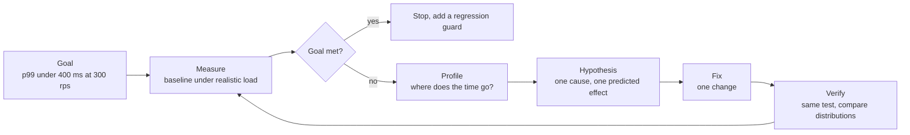
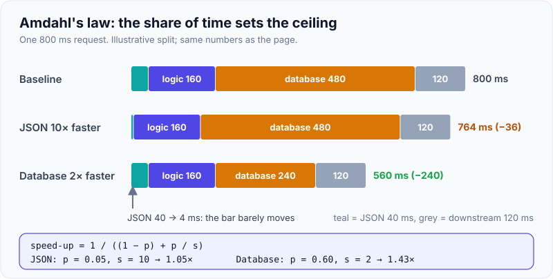
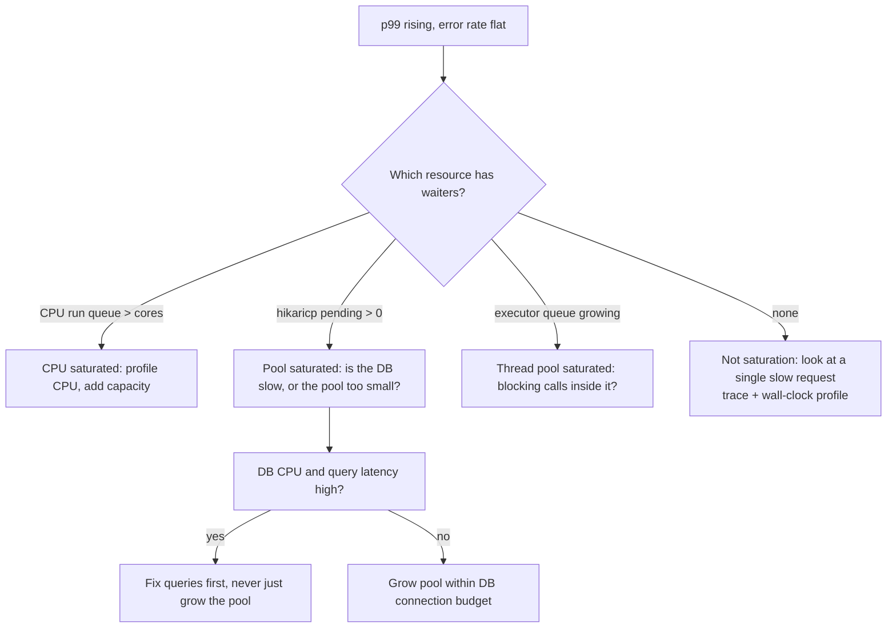

# Performance Methodology: Measure, Profile, Fix, Verify

!!! abstract "Key takeaways"
    - Performance work is a **loop**: state a goal → **measure** a baseline under realistic load → **profile** to find where time goes → **fix one thing** → **verify** with the *same* test → repeat until the goal is met, then stop.
    - Start from a **number someone cares about**: "p99 of `POST /claims` under 400 ms at 300 req/s", not "make it faster". Averages hide the slow requests users feel; use percentiles.
    - **Never guess the bottleneck.** Use a method (RED per service, USE per resource, then drill down and profile) instead of the *streetlight anti-method* of running whatever tool you know.
    - **Amdahl's law**: the speed-up from a fix is capped by the share of time that part takes. Making a 5% step 10× faster saves under 5%. **Little's law** (`concurrency = throughput × latency`) sizes pools and explains queueing.
    - Latency **explodes near saturation**: queueing time grows as `1 / (1 − utilisation)`, so a resource at 90% busy adds about 10× its service time in waiting. Plan to run below about 70–80%.

## Why it matters

Most performance "fixes" in real teams are guesses: someone adds a cache, grows a pool or switches the garbage collector because it worked last time. Without a before and after under the same load, nobody knows whether it helped, hid the problem or moved it. A method protects you from three expensive mistakes: **optimising the wrong thing** (people are bad at guessing where time goes), **declaring victory on noise** (an 8% "win" inside 10% run-to-run variance), and **fixing it in the wrong place** (database, downstream, locks, GC and pool saturation all need different fixes).

Interviewers ask "how would you approach a performance problem?" because the answer shows whether you work from evidence. A strong answer is a method with numbers, not a list of tricks.

## Core concepts

### 1. Define the goal before touching anything

A performance goal has four parts:

| Part | Example | Why it matters |
|---|---|---|
| **Metric** | p99 latency of `POST /claims` (server side) | Averages hide the tail; p50 hides the users who complain |
| **Target** | under 400 ms | You need a finish line, or the work never ends |
| **Load** | at 300 req/s with the production request mix | Latency at 10 req/s says nothing about 300 req/s |
| **Context** | 4 pods × 2 vCPU, warm caches, data set at production size | Results on a laptop with 100 rows don't transfer |

Tie the target to an SLO where one exists (see [SLIs, SLOs, SLAs & error budgets](../observability/05-slis-slos-slas-and-error-budgets.md)), and use percentiles rather than means: why the tail matters so much in fan-out systems is covered in [Latency: percentiles, tail latency](06-latency-percentiles-tail-latency.md).

Also decide which dimension you are optimising: **latency**, **throughput**, **efficiency** (cost per request) or **startup time**. They pull against each other: bigger batches raise throughput and hurt latency; caching cuts latency and costs memory.

### 2. The loop


*Notice the exit is "goal met", not "nothing left to optimise", and every pass returns to measurement. A change that wasn't measured with the same test hasn't been verified.*

- **Measure:** a repeatable load test or production telemetry; record the latency distribution, throughput, errors and resource usage, over at least three runs to see the noise ([Load testing & capacity planning](05-load-testing-and-capacity-planning.md)).
- **Profile:** traces for the slow hop, then a profiler inside the JVM ([JVM profiling](02-jvm-profiling.md)) or `EXPLAIN ANALYZE` in the database ([Database & query performance](04-database-and-query-performance.md)).
- **Hypothesis:** predict a number. "61% of wall time is waiting in `getConnection()`; a pool of 24 instead of 10 should cut p99 by a third."
- **Fix one thing**, or you can't tell which change helped and which hurt.
- **Verify** with the same test, data and environment. Compare percentiles *and* resource usage: did you just move the queue to the database?

{ loading=lazy }
*Watch the goal line: the first fix was real but not enough, so the loop runs again. It stops as soon as p99 crosses under 400 ms.*

### 3. Methods versus anti-methods

Brendan Gregg names the habits that waste time as **anti-methods**:

- **Streetlight anti-method:** run the tools you happen to know (`top`, a favourite dashboard) and look for anything obvious, like the drunk searching for his keys under the streetlight because the light is better there.
- **Random-change anti-method:** tweak settings until the problem goes away. Slow, and you may just have hidden it.
- **Blame-someone-else anti-method:** "It's the network" or "it's the database" without evidence.

Methods that actually converge:

| Method | Question it answers | Apply to |
|---|---|---|
| **Workload characterisation** | *Who* is calling, *what* operations, *how much*, and has it changed? | The input: traffic mix, payload sizes, a new client |
| **RED** (rate, errors, duration) | Which service or endpoint is slow or failing? | Request-driven services |
| **USE** (utilisation, saturation, errors) | Which resource is the bottleneck? | CPU, memory, disk, network, **and software resources**: thread pools, connection pools, queues, locks |
| **Drill-down analysis** | Where inside the slow component? | Trace → span → profiler → line of code or query |
| **Latency analysis** | Which step of one request adds the time? | Break end-to-end time into its parts, then recurse into the biggest |

Practical order: workload (did traffic change?) → RED for the slow service → a trace for the slow hop → USE on that hop's resources → profiler or query plan for the exact cause. The signals are covered in [Logs, metrics & traces](../observability/01-logs-metrics-and-traces.md).

!!! tip "Software resources count for USE"
    In Java services the saturated resource is often not hardware. A Hikari pool with 10 connections and 40 threads waiting, a Tomcat pool at `max` with a growing accept queue, or a single `synchronized` block are all resources with utilisation, saturation (waiters) and errors (timeouts). Spring Boot exposes most of these through Micrometer: `hikaricp.connections.pending`, `tomcat.threads.busy`, `executor.queued`.

### 4. Where effort pays: Amdahl's law

If a part of the work takes fraction **p** of total time and you make it **s** times faster, the overall speed-up is:

```text
speed-up = 1 / ((1 − p) + p / s)
```

The ceiling, even with an infinitely fast fix, is `1 / (1 − p)`. So the first job of profiling is to find the big **p**, not the code that looks inefficient.

{ loading=lazy }
*The cleverer optimisation (10× faster JSON) saves a seventh of what the boring one (halve the database time) saves. Profile first, then pick by share of time.*

Amdahl applies to parallelism as well: if 10% of a batch job is serial, no number of threads gets it more than 10× faster.

### 5. Concurrency, throughput and latency: Little's law

For any stable system, **L = λ × W**: the average number of requests in the system equals arrival rate times average time in the system. It needs no assumptions about distributions, which makes it a reliable sanity check.

- 300 req/s × 0.2 s average latency = **60 requests in flight**. If each holds a database connection for 50 ms of that time, the pool needs about 300 × 0.05 = **15 connections busy** on average, plus headroom for bursts.
- If a pool has 10 connections and each request holds one for 50 ms, the pool can sustain at most 10 / 0.05 = **200 req/s**. Above that, requests queue for `getConnection()`, and latency grows while the database itself looks idle.

The thread-pool sizing version of the same idea is in [Executors & thread pools](../java-concurrency-jvm/04-executors-and-thread-pools.md); rough capacity numbers are in [Back-of-the-envelope estimation](../system-design/02-back-of-the-envelope-estimation.md).

### 6. Utilisation and the queueing knee

A resource that is busy fraction **ρ** of the time makes new work wait. For the simplest queue model (M/M/1), average time in the system is `W = S / (1 − ρ)`, where **S** is the service time:

| Utilisation ρ | Time in system (× service time) |
|---|---|
| 50% | 2× |
| 70% | 3.3× |
| 80% | 5× |
| 90% | 10× |
| 95% | 20× |

Real systems aren't M/M/1, but the shape holds: flat at low load, steep near saturation, and the **tail** rises first. That is why capacity plans target about 60–75% at peak.


*Notice the pool branch: growing a pool in front of a slow database only moves the queue into the database. Check the resource behind the pool before resizing it.*

### 7. Measuring correctly

Bad measurements send the loop the wrong way:

- **No warm-up.** The JVM interprets first, then JIT-compiles hot methods (C1, then C2); pools and caches start cold. Discard warm-up unless startup is the goal.
- **Hand-rolled micro-benchmarks.** The JIT can delete unused results (dead-code elimination) and hoist work out of loops. Use **JMH**.
- **Coordinated omission.** A closed-loop load generator waits for each response, so when the server stalls it stops sending and under-samples exactly the bad periods; Gil Tene showed this can make p99 look many times better than reality. Use an **open, arrival-rate** model (Gatling `constantUsersPerSec`, k6 `constant-arrival-rate`, wrk2).
- **Averaging percentiles** across pods or minutes. Aggregate histogram buckets, then compute the percentile ([Micrometer & Prometheus](../observability/03-metrics-with-micrometer-prometheus-and-dashboards.md)).
- **Toy data and noisy hosts.** 100 rows fit in every cache; production has 40 million. Shared CI runners and CPU throttling add variance, so repeat runs and report the spread.

## In practice: code & configuration

### Micro-benchmarks: hand-rolled loop versus JMH

=== "❌ Common mistake"
    ```java
    // "Benchmark" in a main method or a unit test
    public static void main(String[] args) {
        var mapper = new ObjectMapper();
        var claim = sampleClaim();
        long start = System.currentTimeMillis();         // millisecond resolution, wall clock
        for (int i = 0; i < 100_000; i++) {
            mapper.writeValueAsString(claim);            // result unused: JIT may eliminate work
        }
        long ms = System.currentTimeMillis() - start;    // includes interpreter + JIT compilation time
        System.out.println("avg " + (ms * 1000.0 / 100_000) + " µs");   // one run, an average, no spread
    }
    ```

=== "✅ Correct approach"
    ```java
    // JMH: forks fresh JVMs, warms up, measures, reports error bars
    @BenchmarkMode(Mode.AverageTime)
    @OutputTimeUnit(TimeUnit.MICROSECONDS)
    @Warmup(iterations = 5, time = 1)                    // let C2 compile the hot path first
    @Measurement(iterations = 10, time = 1)
    @Fork(3)                                             // 3 separate JVMs: catches run-to-run variance
    @State(Scope.Benchmark)
    public class ClaimSerializationBench {

        private ObjectMapper mapper;
        private Claim claim;

        @Setup
        public void setUp() {
            mapper = new ObjectMapper().findAndRegisterModules();
            claim = Fixtures.realisticClaim();           // production-sized payload, not a toy object
        }

        @Benchmark
        public String serialize() throws Exception {
            return mapper.writeValueAsString(claim);     // returning the result defeats dead-code elimination
        }

        @Benchmark
        public void serializeToBlackhole(Blackhole bh) throws Exception {
            bh.consume(mapper.writeValueAsBytes(claim)); // or consume it explicitly
        }
    }
    // Run: java -jar target/benchmarks.jar ClaimSerialization -prof gc
    // -prof gc adds allocation per operation (gc.alloc.rate.norm), often the real cost.
    ```

Use JMH for a hot method you have **already** found with a profiler. It answers "which of these two implementations is faster?", not "why is my service slow?".

### Measuring the right thing in a Spring Boot service

Before load testing, make sure the service records the numbers the goal is written in: server-side latency histograms per endpoint, plus the saturation of every pool.

```yaml
# application.yml
management:
  endpoints.web.exposure.include: health,prometheus
  metrics:
    distribution:
      percentiles-histogram:
        http.server.requests: true          # aggregatable p95/p99 across pods
        http.client.requests: true          # per-downstream latency (RestClient/WebClient)
      slo:
        http.server.requests: 100ms,250ms,400ms   # extra buckets exactly at the goal
  observations:
    key-values:
      region: ${REGION:local}
# Hikari, Tomcat and executor metrics are auto-registered:
# hikaricp.connections.active / .pending / .acquire, tomcat.threads.busy, executor.queued
```

Then the four PromQL queries you need at every step of the loop:

```text
# p99 per endpoint (goal metric)
histogram_quantile(0.99, sum by (le, uri) (rate(http_server_requests_seconds_bucket{uri="/claims"}[5m])))
# throughput
sum(rate(http_server_requests_seconds_count{uri="/claims"}[5m]))
# saturation of the DB pool (USE: waiters)
max(hikaricp_connections_pending)
# share of time in each downstream (latency analysis)
sum by (client_name) (rate(http_client_requests_seconds_sum[5m]))
```

### Writing up a performance change

Keep a short record per loop iteration, in the PR or ticket. It turns a hunch into evidence and makes the work reviewable:

```text
Goal:        p99 POST /claims < 400 ms @ 300 rps (prod mix, 4 pods x 2 vCPU)
Baseline:    p50 180 ms, p99 820 ms, 0.1% errors, 3 runs, spread ±4%
Evidence:    trace: 61% of wall time in HikariPool.getConnection; pending peaks at 38
Hypothesis:  pool too small for 300 rps x 50 ms hold time (Little: ~15 busy, bursts 2-3x)
Change:      maximumPoolSize 10 -> 24 (DB max_connections budget allows 4 x 24 = 96 of 200)
Result:      p50 150 ms, p99 510 ms (-38%), DB CPU 45% -> 58%, no new errors
Next:        p99 still above goal; trace now shows N+1 on claim lines -> page 04
```

The numbers in this example are illustrative; they are the same ones the loop animation uses.

## Real-world usage

- **Netflix** is where Brendan Gregg applied and popularised the USE method and CPU flame graphs for Java services (including the JVM's `-XX:+PreserveFramePointer` flag, added so Linux profilers can walk Java stacks).
- **Google's SRE book** frames latency work around percentiles and the four golden signals, and warns that the tail of one backend becomes the median of a fan-out frontend.
- **Canary analysis** (Netflix's Kayenta, Spinnaker) automates the verify step: a new version takes a slice of traffic and its latency distribution is compared statistically with the baseline before rollout continues.
- **Healthcare and banking:** nightly claim adjudication and end-of-day settlement are throughput goals with a hard deadline; member portals have latency SLOs; regulated change control needs the evidence that the verify step produces.

A recurring failure mode in incident reviews: a fix was applied under pressure, latency improved because traffic dropped at the same time, and the real cause returned the next day. Comparing under the same load avoids that.

## Trade-offs & production gotchas

| Measurement approach | Pros | Cons | Use when |
|---|---|---|---|
| Production telemetry (metrics, traces) | Real traffic, real data, no test cost | Noisy, can't experiment freely, needs instrumentation in place | Finding the problem; verifying after rollout |
| Load test in a prod-like environment | Repeatable, safe to break, can push past peak | Expensive to build; realism depends on the workload model and data | Verifying a fix; capacity planning |
| Continuous profiling in production | Shows where CPU and allocation actually go, over time | Agent overhead (usually low), sampling only | Finding hot code; comparing versions |
| Micro-benchmark (JMH) | Precise, isolates one method | Says nothing about the system; easy to mislead | Choosing between two implementations of a known hot spot |

!!! warning "Gotcha: the fix that moves the bottleneck"
    Raising a thread or connection pool often "works" in a test, then pushes the queue into the database or a downstream service, which degrades for every caller. After every fix, re-check USE on the **next** resource in the path.

!!! warning "Gotcha: comparing different conditions"
    A before/after comparison is only valid if load, data size, code version (except the change), JVM flags and environment match. Record them with the result. A "regression" between two runs on different instance types is not a regression.

## How this connects to my experience

- **Where I used it:** not a ★ resume claim, so present it as transferable method. The closest bullet is OptumRx Meteor: "Implemented Redis-based caching for frequently accessed queries and UI reference data" in a GraphQL Consumer Service that integrates 5 upstream systems for 750K+ users. A cache is a performance fix, so the natural story is the loop: what was slow, how you knew, what the cache changed, and how you verified it.
- **Talking points:**
    - The goal and the baseline: which queries or reference-data calls were slow, and the latency before caching. *[confirm: endpoints and before/after numbers, or say "we measured with X" if numbers aren't remembered]*
    - How the slow upstream was identified (per-upstream latency metrics, traces or logs). *[confirm which tooling existed]*
    - How the improvement was verified: load test, production dashboards, cache hit ratio. *[confirm]*
    - The GraphQL-specific angle (N+1 resolvers, DataLoader, per-field cost) is covered in [GraphQL performance & observability](../graphql/09-performance-and-observability-of-graphql-services.md).
- **Likely follow-up chain:** "How did you know caching was the right fix?" → "What did you measure before and after?" → "What did the cache cost you (staleness, memory, invalidation)?" Answer with the loop: baseline, evidence that repeated reads of slowly changing data dominated, one change, the same measurement after, and the trade-off you accepted (TTL and staleness).

## Interview questions

### Fundamentals

??? question "Q1. How do you approach a performance problem in a service?"
    **Answer:** Turn it into a measurable goal (metric, target, load, environment), take a baseline under realistic load, then find where time goes: RED per service and endpoint, a trace for the slow hop, USE on that hop's resources (including pools and locks), then a profiler or query plan. Form one hypothesis, change one thing, re-run the same test, compare distributions and check the next resource in the path. Repeat until the goal is met, then add a regression guard.

    **Interviewer listens for:** goal first, evidence before change, one change at a time, verification with the same test, a stop condition.

    **Common wrong answer:** a list of tricks ("add caching, add indexes, increase the heap") with no measurement.

??? question "Q2. State Amdahl's law and give a practical consequence."
    **Answer:** Speed-up = 1 / ((1 − p) + p/s), where p is the share of time affected and s is the local speed-up. The limit is 1/(1 − p). Practically: profile first and attack the largest share. Making a 5% step 10× faster gives under 5% overall; halving a 60% step gives 30%. For parallelism, a 10% serial part caps speed-up at 10× regardless of cores.

    **Interviewer listens for:** the formula or its intuition, and "find the big p first".

    **Common wrong answer:** treating local speed-ups as global ones.

### Intermediate

??? question "Q3. What is Little's law and how do you use it?"
    **Answer:** L = λW: average items in the system equal arrival rate times average time in the system, for any stable system. Uses: concurrency needed (300 rps × 0.2 s = 60 in flight), pool sizing (300 rps × 50 ms connection hold = 15 busy connections), and maximum throughput of a fixed pool (10 connections / 50 ms = 200 rps). It also explains why latency rises when a pool caps concurrency.

    **Interviewer listens for:** correct units, applying it to pools, and its independence from distributions.

    **Common wrong answer:** sizing pools by "number of cores × 2" with no reference to latency or throughput.

??? question "Q4. Explain the USE and RED methods and when you use each."
    **Answer:** RED (rate, errors, duration) describes each request-driven service from the caller's view and finds *which* service is slow. USE (utilisation, saturation, errors) checks each resource to find *what* is the bottleneck: CPU, memory, disk, network, and software resources such as thread pools, connection pools, queues and locks. Use RED to locate, USE to explain.

    **Interviewer listens for:** saturation as waiters or queue length; software resources included.

    **Common wrong answer:** "USE means check CPU and memory." Pools and locks are the usual bottleneck in Java services.

??? question "Q5. Why are hand-written micro-benchmarks in Java unreliable, and what do you use instead?"
    **Answer:** The JVM interprets, then JIT-compiles with C1 and C2, so early iterations measure compilation. The JIT can eliminate unused results, hoist invariant work, and inline differently than in the real call site. GC and CPU frequency add noise, and one run hides variance. JMH forks JVMs, runs warm-up iterations, provides `Blackhole` to defeat dead-code elimination, and reports error bars; `-prof gc` adds allocation per operation.

    **Interviewer listens for:** warm-up, dead-code elimination, forks, variance, and that JMH is for known hot spots.

    **Common wrong answer:** "Run it in a loop a million times and divide."

??? question "Q6. What is coordinated omission?"
    **Answer:** A closed-loop load generator waits for each response before sending the next request, so when the server stalls, it stops sending and records only one slow sample instead of all the requests that real users would have sent during the stall. Percentiles then look far better than reality. Fix with an open (constant arrival rate) model, or tools that correct for it (wrk2, HdrHistogram's corrected recording, Gatling and k6 arrival-rate executors).

    **Interviewer listens for:** closed vs open workload, under-sampling of bad periods.

    **Common wrong answer:** confusing it with sampling or with client-side timeouts.

### Senior

??? question "Q7. Why does latency rise sharply before CPU reaches 100%?"
    **Answer:** Queueing. As utilisation ρ rises, the chance an arriving request finds the resource busy rises, and waiting time grows roughly as 1/(1 − ρ): about 2× service time at 50%, 5× at 80%, 10× at 90%. Bursty arrivals make it worse and the tail rises first. Hence capacity targets of about 60–75% at peak, and alerts on saturation (queue length, pending connections) not just utilisation.

    **Interviewer listens for:** the queueing curve, burstiness, tail first, saturation as the leading indicator.

    **Common wrong answer:** "We have 15% CPU headroom so we're fine."

??? question "Q8. How do you prove a performance change was an improvement and not noise?"
    **Answer:** Same test, same data, same environment and version except the change; several runs before and after to know the run-to-run spread; compare full distributions (p50, p95, p99, max) plus throughput, errors and resource usage. The difference must exceed the noise. In production, use a canary with statistical comparison against the baseline, and watch for side effects on the next resource.

    **Interviewer listens for:** variance awareness, controlled comparison, side-effect checks, canary analysis.

    **Common wrong answer:** "It was faster in one run after the deploy."

### Scenario-based

??? question "Q9. After a release, p99 of an endpoint doubled but CPU and memory look normal. What do you do?"
    **Answer:** Workload first: did traffic, payload size or caller mix change at release time? Then compare traces before and after for that endpoint to find the hop that grew. Low CPU with high latency points at waiting: check pool saturation (`hikaricp.connections.pending`, executor queues), downstream latency, lock contention, and new queries (an added N+1). A wall-clock profile (not CPU) shows where threads wait. Roll back if the SLO is burning, then fix forward with the evidence.

    **Interviewer listens for:** workload check, trace diff, "low CPU means waiting", wall-clock profiling, rollback as mitigation.

    **Common wrong answer:** "Add more pods." If the bottleneck is a shared database or lock, more pods make it worse.

??? question "Q10. A team proposes raising the DB connection pool from 10 to 50 to fix latency. How do you evaluate it?"
    **Answer:** Check where requests wait. If `pending` is high and the database is lightly loaded with fast queries, a moderate increase sized with Little's law (and within the database's `max_connections` across all pods) is reasonable. If database CPU or query latency is already high, a bigger pool sends more concurrent work into a saturated database and makes everyone slower; fix queries or add read replicas instead. Verify with the same load test and watch database metrics.

    **Interviewer listens for:** checking the resource behind the pool, total connection budget across pods, Little's law.

    **Common wrong answer:** "Bigger pool is always better" or a fixed formula without data.

## Cheat sheet

| Concept | Remember |
|---|---|
| The loop | Goal → measure → profile → hypothesis → one fix → verify (same test) → repeat or stop |
| Goal | Metric + target + load + environment, e.g. p99 < 400 ms at 300 rps |
| Anti-methods | Streetlight, random change, blame someone else |
| RED / USE | Find the slow service / find the saturated resource (pools and locks count) |
| Amdahl | Speed-up = 1 / ((1 − p) + p/s); ceiling 1/(1 − p) |
| Little | L = λW: in-flight = rate × latency; pool max rps = size / hold time |
| Queueing | W ≈ S / (1 − ρ): 80% busy = 5× service time; plan for 60–75% at peak |
| Measuring | Warm up, repeat runs, percentiles from histograms, prod-sized data |
| Micro-benchmarks | JMH: forks, warm-up, Blackhole, `-prof gc` |
| Load generators | Open arrival-rate model to avoid coordinated omission |

## Sources
1. [Brendan Gregg: Performance Analysis Methodology](https://www.brendangregg.com/methodology.html): anti-methods (streetlight, random change, blame someone else), workload characterisation, drill-down, latency analysis.
2. [Brendan Gregg: Thinking Methodically about Performance (ACM Queue)](https://queue.acm.org/detail.cfm?id=2413037): the case for methods over tools.
3. [Brendan Gregg: The USE Method](https://www.brendangregg.com/usemethod.html): utilisation, saturation and errors per resource, including software resources.
4. [Google SRE book, ch. 6: Monitoring Distributed Systems](https://sre.google/sre-book/monitoring-distributed-systems/): four golden signals, percentiles and the tail.
5. [OpenJDK: JMH (Java Microbenchmark Harness)](https://github.com/openjdk/jmh): warm-up, forks, `Blackhole`, profilers such as `-prof gc`.
6. [Gil Tene: How NOT to Measure Latency (InfoQ talk)](https://www.infoq.com/presentations/latency-response-time/): coordinated omission and percentile pitfalls.
7. [Spring Boot reference: Metrics](https://docs.spring.io/spring-boot/reference/actuator/metrics.html): `percentiles-histogram`, SLO buckets, Hikari and Tomcat metrics.
8. John D. C. Little, "A Proof for the Queuing Formula: L = λW", *Operations Research*, 1961; and Brendan Gregg, *Systems Performance*, 2nd ed. (2020), chapter 2 (methodologies, queueing theory).
