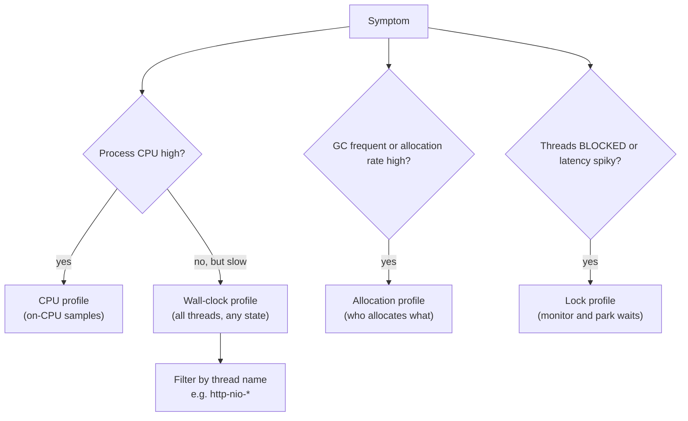
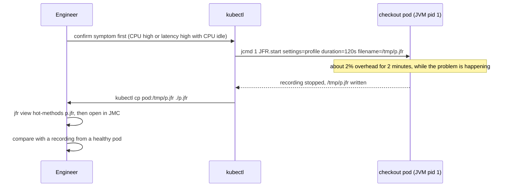

# JVM Profiling (JFR, async-profiler, VisualVM)

!!! abstract "Key takeaways"
    - Pick the **profiling mode from the symptom**: high CPU → **CPU** profile; slow but CPU idle → **wall-clock** (threads waiting on I/O, locks, pools); GC pressure → **allocation** profile; contention → **lock** profile. The wrong mode shows a misleading picture.
    - Production profilers **sample** stacks at intervals (low overhead, statistical) rather than **instrument** every method (exact counts, heavy distortion). Instrumentation belongs on a laptop, not in production.
    - Older samplers suffer **safepoint bias**: they can only see threads at safepoint polls, so time is blamed on the wrong frames. **JFR** and **async-profiler** sample asynchronously; add `-XX:+DebugNonSafepoints` for accurate frames in inlined code.
    - **JDK Flight Recorder** is built into the JDK (open-sourced in JDK 11), designed to stay on in production with the default settings at under about 1% overhead. **async-profiler** adds native and kernel frames and produces flame graphs directly. **VisualVM** is a GUI for local work and quick looks over JMX.
    - In a **flame graph**, width is the share of samples, the y-axis is stack depth, and colour carries no timing meaning. Look for wide **plateaus** at the top: that's where the time is actually spent.

## Why it matters

The [performance loop](01-performance-methodology-measure-profile-fix-verify.md) needs a "profile" step that tells you *where* inside one process the time goes. Metrics tell you an endpoint is slow; a trace tells you the time is inside `pricing-service`; only a profiler tells you it is in `BigDecimal.divide` called from a rule engine, or in threads parked on `HikariPool.getConnection`.

Guessing at that level is hopeless. A Spring Boot request passes through hundreds of frames (filters, proxies, Jackson, Hibernate, your code), and the JIT inlines and reorders them. Profilers give a statistical, whole-program view that you can't get from reading code.

Interviewers use profiling questions to check two things: that you've actually looked at a flame graph, and that you know the trap of choosing the wrong mode (CPU profiling a service that is slow because it waits).

## Core concepts

### Sampling versus instrumentation

| | Sampling profiler | Instrumenting profiler |
|---|---|---|
| **How** | Every N ms (or every N bytes allocated), record the current stack of each thread | Insert timing code at entry and exit of every method (bytecode rewriting) |
| **Output** | Share of samples per stack: "38% of CPU in `JsonGenerator`" | Exact call counts and per-method times |
| **Overhead** | Low and roughly fixed (about 1–5%, depends on rate) | High and uneven; tiny hot methods suffer most |
| **Distortion** | Statistical error; can miss very short events | Changes JIT inlining and timing, so the hot spot can move |
| **Production?** | Yes, with care | No |
| **Examples** | JFR, async-profiler, VisualVM sampler, IntelliJ profiler | VisualVM "Profiler" tab, JProfiler/YourKit tracing modes |

A sample is a guess weighted by probability: if 30% of samples land in a method, roughly 30% of the time was spent there. With 10 ms intervals over 60 seconds on 8 busy threads you get about 48,000 samples, plenty for the wide frames that matter.

### Which mode answers which question


*Notice the "CPU idle but slow" branch: a CPU profile there only shows the little work that was done, never the waiting that made requests slow.*

| Mode | Samples | Finds | JFR events | async-profiler |
|---|---|---|---|---|
| **CPU** | Threads running on a CPU | Hot loops, expensive serialisation, regex, crypto, GC threads | `jdk.ExecutionSample` | `-e cpu` (or `itimer`, `ctimer`) |
| **Wall-clock** | All threads, any state | Waiting on sockets, DB, pools, `sleep`, locks | `jdk.ThreadPark`, `jdk.SocketRead`, `jdk.JavaMonitorWait` (plus native samples) | `-e wall` with `-t` per thread |
| **Allocation** | Allocation sites, weighted by bytes | Garbage producers that drive GC | `jdk.ObjectAllocationSample` (JDK 16+) | `-e alloc` (TLAB-driven sampling) |
| **Lock** | Contended monitor enters and parks | `synchronized` hot spots, contended `ReentrantLock` | `jdk.JavaMonitorEnter`, `jdk.ThreadPark` | `-e lock` |
| **Native memory** | `malloc`/`free` calls | Off-heap growth, native leaks | (use NMT) | `-e nativemem` (4.x) |

Wall-clock profiles include idle pool threads that sit in `park` forever; always filter to the threads that serve requests (`http-nio-*`, `reactor-http-*`, your executor names).

### Safepoint bias

The JVM can only stop a thread for some operations at a **safepoint**: a point where every object reference's location is known, typically at method returns and loop back-edges in JIT-compiled code. A profiler built on the standard JVMTI `GetAllStackTraces` call has to wait until every thread reaches one, so a sample is recorded at the *next* safepoint poll, not where the thread really was.

The result: a long counted loop with no safepoint poll inside (the JIT removes them from some counted loops) gets no samples; the time is blamed on whatever frame contains the next poll. Nitsan Wakart's analysis shows such profilers pointing confidently at the wrong method.

{ loading=lazy }
*Watch where each sample lands: the biased profiler never sees the hot loop at all, because the loop has no safepoint poll inside it.*

How the modern tools avoid it:

- **async-profiler** uses Linux `perf_events` (or timer signals) to interrupt the thread wherever it is, then walks the Java stack with HotSpot's internal `AsyncGetCallTrace` API, and the native and kernel stack with frame pointers or DWARF. No safepoint needed.
- **JFR** samples threads from its own sampler thread, also without a safepoint.
- Both still need the JIT to keep debug information for non-safepoint code locations to name the right frame inside inlined code. Add `-XX:+UnlockDiagnosticVMOptions -XX:+DebugNonSafepoints` (small cost) whenever you profile.

### Reading a flame graph

A flame graph merges all sampled stacks: each box is a frame, its **width** is the share of samples that contained it, its children sit above it, and boxes at the same level are sorted alphabetically (not by time). Colour usually encodes frame type (Java, native, kernel, inlined) or is random; it never encodes duration.

{ loading=lazy }
*Read top edges first: a wide box with nothing above it is self time. The wide bottom frames (Tomcat, Spring) are on every stack and almost never the problem.*

Reading rules:

1. **Find the widest top edges** (plateaus): that's where the CPU (or wall time, or bytes) is actually spent.
2. **Walk down** from a plateau to the first frame in *your* code: that's the call to change.
3. **Ignore the base:** framework frames are wide because everything passes through them.
4. **Compare, don't stare:** a **differential flame graph** (before vs after, or v2.3 vs v2.4) shows what grew. Icicle graphs (inverted) and "reverse" views group by leaf method instead.

### The tools

#### JDK Flight Recorder (JFR) and JDK Mission Control (JMC)

JFR is an event recorder inside HotSpot. It writes binary events (GC, allocation samples, execution samples, lock waits, socket and file I/O, exceptions, class loading, safepoints, and your own custom events) into thread-local buffers, then to a repository on disk. It was a commercial Oracle feature until JEP 328 open-sourced it in JDK 11, and it was backported to OpenJDK 8u262.

- **Settings:** `default.jfc` is tuned for continuous production use (typically under 1% overhead); `profile.jfc` samples more often and records more, at around 2%. Copy and edit a `.jfc` rather than changing the shipped files.
- **Start it:** at launch with `-XX:StartFlightRecording`, or on a running JVM with `jcmd <pid> JFR.start`. A rolling recording (`maxage`, `maxsize`) acts as a black box you dump after an incident.
- **Read it:** JDK Mission Control (GUI with automated analysis), IntelliJ, or the `jfr` CLI. JDK 21 added `jfr view` with ready-made reports such as `hot-methods`, `allocation-by-site` and `contention-by-site`, so you can triage over SSH without a GUI.
- **Stream it:** JFR Event Streaming (JEP 349, JDK 14) lets code subscribe to events live, which is how some APM agents consume them.

#### async-profiler

An open-source low-overhead sampling profiler for HotSpot JVMs (Linux and macOS). It attaches to a running JVM (`asprof`) or starts as an agent, and supports CPU, wall-clock, allocation, lock, native-memory and hardware-counter modes. Output is an interactive HTML flame graph, collapsed stacks, or a JFR file you can open in JMC; `jfrconv` converts between formats. Its strength over JFR's CPU sampling is complete stacks: Java, JVM internals (GC, JIT compiler threads), native libraries and the kernel in one graph.

In containers, `perf_events` is often blocked by the default seccomp profile or `perf_event_paranoid`. Use `-e ctimer` or `-e itimer` (timer-based CPU sampling without perf), or run it from the host with the right privileges.

#### VisualVM

A free desktop GUI (originally bundled with the JDK, now a separate download) that connects to local JVMs or remote ones over JMX. It shows heap, threads, classes and CPU live, takes thread and heap dumps, and has two CPU tools: a **sampler** (periodic thread dumps, safepoint-biased, fine for a rough look) and a **profiler** (bytecode instrumentation, accurate counts but heavy). It can also open JFR files. Use it on your machine or in a test environment; exposing JMX from a production pod is a security and overhead question you usually don't want to answer.

| | JFR + JMC | async-profiler | VisualVM |
|---|---|---|---|
| Ships with JDK | Yes (JFR); JMC separate | No, add the binary | No, separate download |
| Production use | Designed for it, always-on | Yes, on demand or continuous | Rarely; local and test |
| Safepoint bias | No | No | Sampler: yes |
| Native / kernel frames | Limited | Yes | No |
| Beyond CPU | GC, I/O, locks, exceptions, custom events | Alloc, lock, wall, native memory, HW counters | Heap and thread views, dumps |
| Output | `.jfr` | Flame graph HTML, JFR, collapsed | GUI snapshots |

Commercial profilers (JProfiler, YourKit) and the IntelliJ IDEA profiler (built on async-profiler and JFR) cover the same ground with better UIs. **Continuous profiling** services (Grafana Pyroscope, Datadog, Elastic, Parca) run a sampler on every pod all the time and store profiles by service and version, so you can ask "what changed in CPU between yesterday and today?" OpenTelemetry is adding profiles as a signal alongside logs, metrics and traces.

## In practice: code & configuration

### Profiling a pod safely


*Notice that the recording is taken while the problem is happening and compared with a healthy pod: one profile alone shows where time goes, not what changed.*

```bash
# --- JFR: always-on black box, set at startup ------------------------------------
JAVA_TOOL_OPTIONS="-XX:StartFlightRecording=name=bb,settings=default,maxage=6h,maxsize=500m,disk=true,dumponexit=true,filename=/dumps/exit.jfr \
  -XX:+UnlockDiagnosticVMOptions -XX:+DebugNonSafepoints"

# --- JFR: on demand on a running JVM --------------------------------------------
jcmd 1 JFR.start name=cpu settings=profile duration=120s filename=/tmp/cpu.jfr
jcmd 1 JFR.dump name=bb filename=/tmp/last6h.jfr      # dump the black box after an incident
jfr summary /tmp/cpu.jfr                              # event counts
jfr view hot-methods /tmp/cpu.jfr                     # JDK 21+: top CPU methods in the terminal
jfr view allocation-by-site /tmp/cpu.jfr
jfr print --events jdk.JavaMonitorEnter /tmp/cpu.jfr | head

# --- async-profiler (asprof) -----------------------------------------------------
asprof -d 30 -f /tmp/cpu.html 1                       # 30 s CPU flame graph of pid 1
asprof -e wall -t -i 20ms -d 30 -f /tmp/wall.html 1   # wall-clock, split per thread
asprof -e alloc -d 30 -f /tmp/alloc.html 1            # who allocates the most bytes
asprof -e lock -d 30 -f /tmp/lock.html 1              # contended locks
asprof -e cpu,alloc,lock -d 60 -f /tmp/all.jfr 1      # several modes at once need JFR output
asprof -e ctimer -d 30 -f /tmp/cpu.html 1             # when perf_events is blocked in the container
```

### Choosing the mode: CPU profile of a waiting service

=== "❌ Common mistake"
    ```bash
    # p99 of /claims went from 300 ms to 2 s. CPU is at 15%.
    asprof -d 60 -f cpu.html 1
    # The flame graph shows Jackson and Hibernate. "Serialisation is slow, let's switch libraries."
    # Wrong mode: CPU samples only show the 15% of time threads were running.
    # The 85% they spent waiting for something is invisible.
    ```

=== "✅ Correct approach"
    ```bash
    # Latency up, CPU idle -> threads are waiting. Profile wall-clock, request threads only.
    asprof -e wall -t -i 20ms -d 60 -f wall.html 1
    # -t makes each thread a root frame: read the http-nio-* towers, ignore idle pool threads.
    # The widest plateau: HikariPool.getConnection -> ConcurrentBag.borrow -> park (68% of samples)
    # Confirms USE: hikaricp.connections.pending > 0. Next: are queries slow, or is the pool small?
    # Cross-check in JFR: jfr view contention-by-site, and jdk.ThreadPark events by stack.
    ```

### Custom JFR events for business operations

JFR events are cheap enough to add around domain operations. They line up with GC pauses, lock waits and I/O on the same timeline in JMC, which answers "was this slow claim slow because of a GC pause?".

```java
import jdk.jfr.*;

@Name("com.example.claims.ClaimPriced")       // stable event name for filtering
@Label("Claim priced")
@Category({"Claims", "Pricing"})
@StackTrace(false)                            // no stack per event: cheaper
@Threshold("20 ms")                           // default: record only slow ones (overridable in .jfc)
class ClaimPricedEvent extends Event {
    @Label("Claim ID") String claimId;        // an ID, never PHI or member data
    @Label("Line count") int lines;
    @Label("Rule set") String ruleSet;
}

@Service
class PricingService {
    PricedClaim price(Claim claim) {
        var event = new ClaimPricedEvent();
        event.begin();                                    // start timing
        try {
            return rules.apply(claim);
        } finally {
            event.end();
            if (event.shouldCommit()) {                   // false if disabled or under threshold: skip field work
                event.claimId = claim.id();
                event.lines = claim.lines().size();
                event.ruleSet = rules.version();
                event.commit();
            }
        }
    }
}
```

Spring Boot can also record **startup** steps (bean creation, context refresh) into JFR: `app.setApplicationStartup(new FlightRecorderApplicationStartup())` in `main`, then run with `-XX:StartFlightRecording`. Useful when the goal is startup time.

## Real-world usage

- **Netflix** used CPU flame graphs across Java services, and Brendan Gregg's work there led to `-XX:+PreserveFramePointer` (JDK 8u60), which lets Linux `perf` walk Java stacks for mixed-mode flame graphs.
- **APM vendors** (Datadog's Java profiler, for example) build on JFR and async-profiler techniques to offer continuous production profiling with low overhead, and show diff views between deployments.
- **Grafana Pyroscope** (open source) runs async-profiler in a Java agent and stores profiles over time; it links to traces so you can open the profile for one slow span.
- A classic production finding in banking and healthcare systems: a large share of CPU spent in logging (string building for disabled debug lines, JSON encoders) or in regular-expression validation on every request. Neither shows up in metrics; both are obvious in a flame graph.

## Trade-offs & production gotchas

| Option | Pros | Cons | Use when |
|---|---|---|---|
| JFR always-on (default.jfc) | Black box for every incident, built in | Disk space; CPU stacks lack native frames | Every production JVM |
| JFR profile.jfc on demand | More detail, still low overhead | About 2%; must be started during the problem | Investigating a live issue |
| async-profiler on demand | Best flame graphs, native + kernel frames, all modes | Extra binary in the image; perf permissions in containers | CPU, wall, alloc and lock deep dives |
| Continuous profiling service | History and diffs per version, no SSH | Cost, agent on every pod, data governance | Fleets where regressions slip in |
| VisualVM / instrumenting profiler | Exact counts, friendly GUI | Overhead and distortion; JMX exposure | Local reproduction only |

!!! warning "Gotcha: profiling at the wrong time"
    A profile taken after the incident shows a healthy JVM. Keep a rolling JFR recording running so you can dump the last few hours, and include JFR dumps in the incident runbook.

!!! warning "Gotcha: missing symbols and frames"
    Without `-XX:+DebugNonSafepoints`, time inside inlined code is attributed to the caller. Without debug symbols for `libjvm`, native frames show as addresses. In distroless images, `jcmd` may not exist: ship `asprof`, or use a `kubectl debug` ephemeral container that shares the process namespace.

!!! warning "Gotcha: sensitive data in recordings"
    JFR records system properties, environment variables (some may hold secrets), command-line arguments, and string values in custom events. Treat `.jfr` and flame graph files as sensitive, keep custom event fields to IDs, and in healthcare never put member data in them.

## How this connects to my experience

- **Where I used it:** not a ★ resume claim; position it as transferable knowledge. The natural bridges are the Java/Spring Boot microservices on OptumRx Meteor and ConvergeHealth, and "production support" in the leadership highlights.
- **Talking points:**
    - Which profiler, if any, was used in production support: JFR, an APM agent's profiler, or VisualVM locally. *[confirm]*
    - A concrete hot spot found and fixed (for example in the GraphQL Consumer Service: serialisation of large responses, resolver fan-out, or connection waits). *[confirm: only claim if it happened]*
    - If none: explain how you would add an always-on JFR recording and an async-profiler runbook to the services you owned.
- **Likely follow-up chain:** "Have you profiled a production JVM?" → "CPU or wall-clock, and why?" → "What did the flame graph show and what did you change?" If you haven't, say so and walk through the method on a realistic example (the wall-clock example above), which is a stronger answer than a vague claim.

## Interview questions

### Fundamentals

??? question "Q1. What is the difference between a sampling and an instrumenting profiler?"
    **Answer:** A sampling profiler records thread stacks at intervals and estimates time by the share of samples per frame; overhead is low and roughly constant, so it's usable in production. An instrumenting profiler injects timing code into methods and gives exact counts and durations, but adds heavy, uneven overhead that changes JIT inlining and can move the hot spot. Use sampling in production and instrumentation only for local, targeted investigation.

    **Interviewer listens for:** overhead, statistical vs exact, distortion of inlining.

    **Common wrong answer:** "Instrumentation is more accurate, so it's better."

??? question "Q2. What is JFR and why is it safe to run in production?"
    **Answer:** JDK Flight Recorder is an event recorder built into HotSpot (open source since JDK 11, backported to 8u262). It records GC, allocation samples, execution samples, lock waits, I/O, exceptions and custom events into thread-local buffers with low overhead; the default settings are designed for continuous use at under about 1%. You can run a rolling recording with `maxage`/`maxsize` and dump it after an incident.

    **Interviewer listens for:** built in, low overhead, black-box usage, `jcmd JFR.start/dump`.

    **Common wrong answer:** "It's a commercial Oracle tool" (true only before JDK 11).

??? question "Q3. How do you read a flame graph?"
    **Answer:** Each box is a stack frame; width is the share of samples containing it; parents are below children; x-order is alphabetical, not time; colour is not duration. Look for the widest top edges (self time), walk down to the first frame in your code, and ignore wide framework base frames. Compare two graphs (differential) to see what changed.

    **Interviewer listens for:** width = share, not time order; plateaus; differential graphs.

    **Common wrong answer:** reading the x-axis as a timeline, or focusing on the tallest stack.

### Intermediate

??? question "Q4. What is safepoint bias and how do JFR and async-profiler avoid it?"
    **Answer:** Profilers based on JVMTI `GetAllStackTraces` can only capture stacks at safepoints, so each sample is attributed to the next safepoint poll rather than where the thread really was; hot counted loops without polls look free and their time lands elsewhere. async-profiler interrupts threads with perf_events or timer signals and walks stacks with `AsyncGetCallTrace`; JFR samples from its own thread without a safepoint. Add `-XX:+DebugNonSafepoints` so inlined frames are named correctly.

    **Interviewer listens for:** safepoint polls at returns and loop back-edges, async stack walking, DebugNonSafepoints.

    **Common wrong answer:** "Safepoint bias is about GC pauses."

??? question "Q5. Latency is high but CPU is low. Which profiling mode do you use and why?"
    **Answer:** Wall-clock, filtered to request-serving threads. CPU profiling samples only running threads, so it can't show time spent waiting on sockets, locks, pools or sleeps. A wall-clock profile samples threads in every state; the widest plateau usually ends in `park`, `socketRead` or `getConnection`. Cross-check with JFR `ThreadPark`, `SocketRead` and `JavaMonitorEnter` events and pool metrics.

    **Interviewer listens for:** on-CPU vs off-CPU, thread filtering, cross-checking with metrics.

    **Common wrong answer:** CPU profiling and optimising the code it shows.

??? question "Q6. How do you find what is causing frequent young GCs?"
    **Answer:** Measure allocation rate (JFR `jdk.ObjectAllocationSample`, GC logs, `jvm.gc.memory.allocated`), then take an allocation profile (`asprof -e alloc` or `jfr view allocation-by-site`). The flame graph is weighted by bytes and shows which call paths allocate most: boxing, temporary collections, string concatenation in logging, large `byte[]` copies in serialisation. Reduce allocation at the top sites rather than tuning GC first.

    **Interviewer listens for:** allocation rate as the GC driver, allocation profiling, fix the code before the flags.

    **Common wrong answer:** "Increase the young generation."

### Senior

??? question "Q7. Compare JFR, async-profiler and VisualVM. When would you use each?"
    **Answer:** JFR: built in, always-on black box, broad event coverage (GC, I/O, locks, custom events), JMC analysis; first choice in production. async-profiler: best flame graphs with Java, native and kernel frames, CPU/wall/alloc/lock/native-memory modes, on demand or continuous; for deep dives. VisualVM: local GUI over JMX for live views, dumps and quick sampling or instrumented profiling; for development and test, not production.

    **Interviewer listens for:** production suitability, native frames, safepoint bias of the VisualVM sampler.

    **Common wrong answer:** "VisualVM for production because it's free and visual."

??? question "Q8. How would you set up profiling for a fleet of Spring Boot services in Kubernetes?"
    **Answer:** Always-on JFR with default settings and a rolling `maxage`/`maxsize` on a mounted volume, `DebugNonSafepoints` on, and a runbook to dump it with `jcmd` and copy it out. Ship `asprof` in the image (or use an ephemeral debug container) and use `ctimer`/`itimer` where perf_events is blocked. For regressions across versions, add continuous profiling (Pyroscope or the APM vendor) tagged with service and version, linked from traces. Treat recordings as sensitive data.

    **Interviewer listens for:** prepared before incidents, container constraints, versioned comparison, data sensitivity.

    **Common wrong answer:** "Expose JMX and connect VisualVM when needed."

### Scenario-based

??? question "Q9. After upgrading a library, CPU per request rose 30%. How do you find out why?"
    **Answer:** Reproduce under the same load test on both versions, take CPU profiles of each (same duration and rate) and build a differential flame graph, or compare the versions in a continuous profiler. The frames that grew point to the cause (a new default like reflection-based serialisation, extra validation, a logging change). Confirm with a targeted JMH benchmark if needed, then fix configuration or pin the version, and verify with the same test.

    **Interviewer listens for:** like-for-like comparison, differential flame graphs, verification.

    **Common wrong answer:** reading the release notes and guessing.

??? question "Q10. A flame graph shows 40% of CPU in `java.util.regex` under a request filter. What next?"
    **Answer:** Walk down to the calling frame in your code: likely a `Pattern.compile` per request or an expensive pattern (catastrophic backtracking) applied to every header or body. Fix by precompiling into a `static final Pattern`, simplifying the pattern, or validating with a cheaper check first. Verify that the plateau disappears and CPU per request drops in the same load test, and check that no ReDoS-prone pattern remains on user input.

    **Interviewer listens for:** walk to your frame, compile-once, backtracking awareness, verification.

    **Common wrong answer:** adding more pods to absorb the CPU.

## Cheat sheet

| Concept | Remember |
|---|---|
| Mode by symptom | CPU high → cpu; slow + CPU idle → wall (filter threads); GC → alloc; contention → lock |
| Sampling vs instrumentation | Sampling in prod; instrumentation distorts, local only |
| Safepoint bias | JVMTI samplers blame the next safepoint; JFR and async-profiler don't |
| Always add | `-XX:+UnlockDiagnosticVMOptions -XX:+DebugNonSafepoints` |
| JFR overhead | `default.jfc` under about 1%; `profile.jfc` about 2% |
| JFR commands | `jcmd <pid> JFR.start/dump/stop`, `jfr summary`, `jfr view hot-methods` (JDK 21+) |
| async-profiler | `asprof -e cpu/wall/alloc/lock -d 30 -f out.html <pid>`; `ctimer` in locked-down containers |
| Flame graph | Width = share of samples; read top plateaus; colour ≠ time; diff two graphs |
| VisualVM | Local GUI; sampler is safepoint-biased; profiler instruments |
| Sensitive data | JFR captures env vars, args and event fields |

## Sources
1. [Oracle: Flight Recorder configurations (JDK 23 docs)](https://docs.oracle.com/en/java/javase/23/jfapi/flight-recorder-configurations.html): `default.jfc` "typically less than 1% overhead", `profile.jfc`.
2. [JEP 328: Flight Recorder](https://openjdk.org/jeps/328) and [JEP 349: JFR Event Streaming](https://openjdk.org/jeps/349): open-sourcing in JDK 11; streaming API in JDK 14.
3. [Oracle: The `jfr` command (JDK 21)](https://docs.oracle.com/en/java/javase/21/docs/specs/man/jfr.html): `print`, `summary` and the new `view` command.
4. [async-profiler on GitHub](https://github.com/async-profiler/async-profiler) and its [profiling modes](https://github.com/async-profiler/async-profiler/blob/master/docs/ProfilingModes.md) and [container](https://github.com/async-profiler/async-profiler/blob/master/docs/ProfilingInContainer.md) docs: no safepoint bias, perf_events + AsyncGetCallTrace, cpu/wall/alloc/lock/nativemem modes, seccomp and ctimer.
5. [Nitsan Wakart: why most sampling Java profilers are terrible (Psychosomatic, Lobotomy, Saw blog, 2016)](https://psy-lob-saw.blogspot.com/2016/02/why-most-sampling-java-profilers-are.html): safepoint bias explained with examples.
6. [Brendan Gregg: Flame Graphs](https://www.brendangregg.com/flamegraphs.html) and [Java in Flames (Netflix Tech Blog)](https://netflixtechblog.com/java-in-flames-e763b3d32166): reading flame graphs; `PreserveFramePointer`.
7. [VisualVM documentation](https://visualvm.github.io/documentation.html): sampler versus profiler, JMX connections.
8. [Spring Framework: Application startup steps with JFR](https://docs.spring.io/spring-framework/reference/core/beans/context-introduction.html): `FlightRecorderApplicationStartup`.
9. [Grafana Pyroscope: Java profiling](https://grafana.com/docs/pyroscope/latest/configure-client/language-sdks/java/): continuous profiling built on async-profiler.
