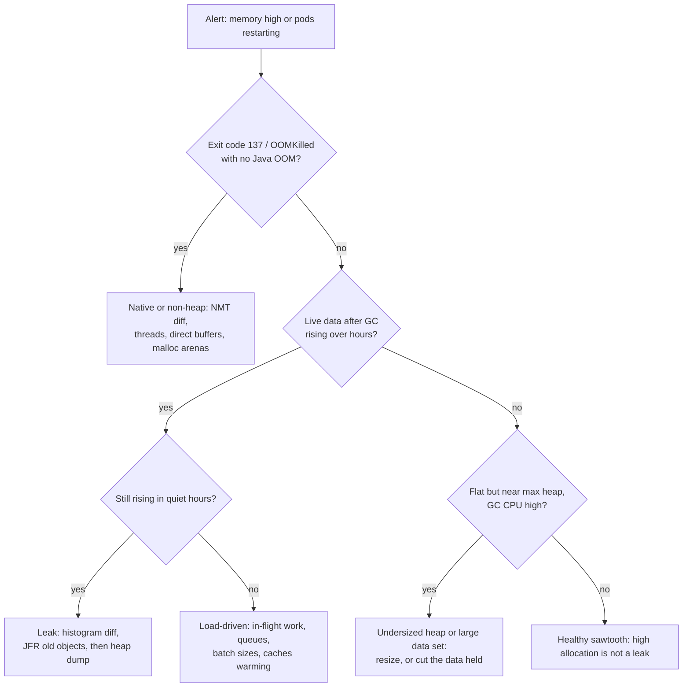
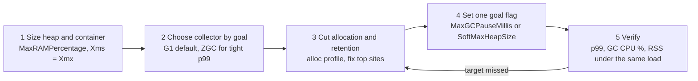

# Memory Leaks & GC Tuning in Practice

!!! abstract "Key takeaways"
    - Budget the **whole process**, not just the heap: heap + metaspace + thread stacks + code cache + GC structures + direct buffers + native allocations must fit under the **container limit**, or the kernel kills the pod (exit 137) without any Java error. Start from heap ≈ 50–75% of the limit.
    - Tell the cases apart with one chart: **live data after GC** over time. Rising across hours = **leak**. Flat but near the max = **undersized heap or a real data set**. Heap flat but **RSS** rising = **native** memory.
    - Most Spring Boot leaks are **unbounded holders**: the default `@Cacheable` cache manager (an unbounded map), high-cardinality Micrometer meters, Hibernate's persistence context in long batch loops, `ThreadLocal`/MDC on pooled threads, and clients created per request.
    - Find leaks with the least disruption: **class histogram diffs** and **JFR old-object samples** first, a **heap dump** (a stop-the-world pause, and a file full of possibly sensitive data) only when needed.
    - GC tuning is an **experiment** in the [performance loop](01-performance-methodology-measure-profile-fix-verify.md): size the heap, choose the collector by latency goal, **cut allocation**, then set a pause goal, and accept the change only if p99 latency, GC CPU share and memory all meet the target.

## Why it matters

The internals are covered elsewhere: how G1 and ZGC work and how to read their logs in [Garbage collection](../java-concurrency-jvm/09-garbage-collection.md), and thread dumps, heap dumps, NMT and the classic leak holders in [Diagnosing production issues](../java-concurrency-jvm/10-diagnosing-production-issues-thread-dumps-heap-dumps-memory.md). This page is the practice: the decisions you make on a real service running in Kubernetes, with the metrics you actually have.

Memory problems are expensive because they are slow. A leak of 20 MB an hour passes every test and every canary, then restarts pods every few days at 3 a.m. An oversized heap wastes money across hundreds of pods; an undersized one burns CPU in GC and adds latency at every peak. And the most common memory incident in containers isn't a Java `OutOfMemoryError` at all: it's an `OOMKilled` pod with no stack trace.

Interviewers ask "how would you find a memory leak?" and "how do you tune GC?" to see whether you reach for evidence or for flags.

## Core concepts

### 1. The process memory budget

The container limit applies to the **resident set** of the whole process. The heap is only the largest slice.

{ loading=lazy }
*The heap setting that looks safe (70% of the limit) is the one that gets the pod killed once 200 request threads and Netty buffers are added. Budget the non-heap slices from NMT, not from hope.*

Rules that hold up in production:

- Size the heap from the limit with `-XX:MaxRAMPercentage` (the default is only 25%). 50–75% is the usual range; the more threads, direct buffers and native libraries, the lower it goes.
- Set `-Xms` equal to the max (or `InitialRAMPercentage` = `MaxRAMPercentage`) for latency services, so the heap doesn't resize under load and the pod's real footprint is known from the start.
- Measure the non-heap slices once with **Native Memory Tracking** under load (`-XX:NativeMemoryTracking=summary`, then `jcmd 1 VM.native_memory summary`) and write the numbers down.
- Set requests equal to limits for memory, so the scheduler reserves what the JVM will use.

### 2. Leak, load, undersized or native?

Four different problems produce the same alert ("memory high" or "pods restarting"). The metrics Spring Boot already exports separate them:

| Signal | Metric (Micrometer / Kubernetes) | Leak | Load spike | Undersized heap | Native growth |
|---|---|---|---|---|---|
| Live data after GC | `jvm.gc.live.data.size` | Rises for hours, survives quiet periods | Rises with traffic, falls after | Flat, close to max | Flat |
| Heap used peaks | `jvm.memory.used{area="heap"}` | Peaks climb | Peaks follow traffic | Always near max | Normal |
| GC CPU share | `jvm.gc.pause` sum rate, `process.cpu.usage` | Grows over days | Grows at peak only | High all the time | Normal |
| Process RSS | `container_memory_working_set_bytes` | Follows heap | Follows heap | Stable | **Rises while heap is flat** |
| How it ends | logs, pod status | `OutOfMemoryError: Java heap space` | Recovers | Long GC pauses, timeouts | `OOMKilled`, exit 137 |


*Notice the quiet-hours check: a load-driven rise falls back when traffic drops, a leak doesn't. Look at a day of data before reaching for a heap dump.*

### 3. Finding the leak with the least disruption

Escalate from cheap to expensive:

1. **Class histogram diff.** `jcmd 1 GC.class_histogram` lists instance counts and bytes per class (it triggers a full GC to count only live objects, a short pause on small heaps). Take one now and one an hour later; the classes that only grow are your suspects. Usually it's `HashMap$Node`, `String` and `byte[]` plus one of *your* classes that gives the game away.
2. **JFR old-object samples.** The `jdk.OldObjectSample` event tracks a sample of allocations that stay alive; with `path-to-gc-roots=true` on the dump, JMC shows the reference chain that keeps them alive. Often enough to name the holder without a heap dump.
3. **Heap dump** of one instance taken out of the load balancer first. `jcmd 1 GC.heap_dump /dumps/app.hprof` pauses the JVM for seconds on multi-GB heaps and writes a file the size of the live heap. Open it in **Eclipse MAT**: *Leak Suspects*, then the **dominator tree** (sort by retained size), then *Path to GC Roots* (excluding weak and soft references) on the biggest dominator.
4. **Reproduce and fix**, then verify with a **soak test**: hours at steady load, with live data after GC flat at the end.

!!! warning "Heap dumps contain everything"
    A heap dump holds every string in memory: tokens, passwords, member names, prescriptions, card numbers. In healthcare and banking, treat it as regulated data: write it to an encrypted volume, restrict access, never attach it to a ticket, and delete it after analysis.

### 4. Leak sources typical of Spring Boot services

The generic holders (static maps, listeners, class loaders) are listed in [Diagnosing production issues](../java-concurrency-jvm/10-diagnosing-production-issues-thread-dumps-heap-dumps-memory.md#what-a-memory-leak-means-in-java). These are the ones that show up in Spring services specifically:

| Source | How it leaks | Fix |
|---|---|---|
| `@Cacheable` with no cache library | Boot falls back to `ConcurrentMapCacheManager`: unbounded, no expiry, keyed by every argument seen | Caffeine with `maximumSize` + `expireAfterWrite`, or Redis with TTL |
| Micrometer meters with unbounded tags | Every new tag combination registers a `Meter` that lives forever (user ID, raw URI, exception message as a tag) | Bounded tags; `MeterFilter.maximumAllowableTags` as a safety net ([cardinality](../observability/03-metrics-with-micrometer-prometheus-and-dashboards.md)) |
| Hibernate persistence context in a batch | Every entity loaded or saved in one transaction stays in the first-level cache until it ends | `flush()` + `clear()` every N rows, stateless session or JDBC batch, or chunked transactions |
| `ThreadLocal` / MDC on pooled threads | Values set on Tomcat or executor threads are never removed | `try/finally remove()`, `MDC.clear()`, context-propagation decorators |
| Clients built per request | New `WebClient`/`HttpClient`/`ObjectMapper` each call: connection pools, threads and caches accumulate | One shared, configured bean |
| Unbounded queues and buffers | Executor with an unbounded `LinkedBlockingQueue`; reactive `.cache()` or `collectList()` over a large stream | Bounded queues with back-pressure; stream instead of collect |
| Netty direct buffers | `DataBuffer` or `ByteBuf` not released in custom WebFlux/Netty code → off-heap growth | `DataBufferUtils.release`; run tests with `-Dio.netty.leakDetection.level=paranoid` |

{ loading=lazy }
*Both caches look identical for the first day. Only the bounded one has a ceiling, and the hit ratio barely changes, because the evicted keys were rarely reused.*

### 5. GC tuning as an experiment

Most GC problems are allocation or retention problems wearing a GC costume. Tune in this order and measure after each step:


*Notice that step 3 sits inside the loop: every pass returns to allocation before touching more flags, because less garbage helps every collector.*

What to measure, and typical acceptance criteria for a request-serving service (agree your own from the SLO):

| Metric | Source | Healthy target (typical) |
|---|---|---|
| GC pause p99 | `jvm.gc.pause` histogram, GC log | Well under the latency SLO (e.g. under 50 ms with G1 for a 400 ms SLO) |
| GC CPU share | GC log total pause and concurrent time, or JFR | Under about 5% of CPU |
| Allocation rate | `jvm.gc.memory.allocated` rate, JFR | Stable per request; lower after fixes |
| Live data after GC | `jvm.gc.live.data.size` | Under about 50–60% of max heap, flat over a day |
| Full GCs (G1) | GC log `Pause Full` | Zero in normal operation |
| Process RSS | container metrics | Below about 85–90% of the limit at peak |

The knobs that matter in practice, and when to touch them:

| Flag | Effect | Touch when |
|---|---|---|
| `-XX:MaxRAMPercentage` / `InitialRAMPercentage` | Heap size from the container limit | Always; first step |
| `-XX:+UseG1GC` / `-XX:+UseZGC` | Collector | Always set explicitly; ZGC when G1 pauses break the p99 SLO and CPU/memory headroom exists |
| `-XX:MaxGCPauseMillis` (G1, default 200) | Pause goal; G1 shrinks the young generation to meet it | p99 SLO needs shorter pauses; too low means more frequent GCs and lower throughput |
| `-XX:G1HeapRegionSize` | Region size; objects of half a region or more are **humongous** | GC log shows frequent "G1 Humongous Allocation" from large arrays |
| `-XX:SoftMaxHeapSize` (ZGC) | Soft target below `-Xmx`, headroom for spikes | Running ZGC in a container |
| `-XX:ActiveProcessorCount` | CPU count the JVM uses for GC and JIT threads and pool defaults | No CPU limit set (recent JDKs ignore CPU requests), so the JVM sees every host core |
| `-XX:MaxDirectMemorySize`, `-XX:MaxMetaspaceSize` | Cap off-heap areas | To turn silent RSS growth into a clear Java error |

Things that usually *don't* help: setting `NewRatio`/`SurvivorRatio` by hand with G1 (it overrides the adaptive sizing that meets the pause goal), calling `System.gc()`, and copying flag lists from blog posts written for Java 8 and CMS.

## In practice: code & configuration

### Caches: unbounded default versus bounded Caffeine

=== "❌ Common mistake"
    ```java
    @SpringBootApplication
    @EnableCaching                                  // no cache library on the classpath...
    public class FormularyApp { }

    @Service
    class FormularyService {
        @Cacheable("drugPrice")                     // ...so Boot uses ConcurrentMapCacheManager:
        public Price price(String ndc, String planId, LocalDate date) {   // unbounded, never expires
            return pricingClient.lookup(ndc, planId, date);               // key space: drugs × plans × days
        }
    }
    // Live data after GC climbs a little every day; pods are OOMKilled after about a week.
    ```

=== "✅ Correct approach"
    ```yaml
    # pom: com.github.ben-manes.caffeine:caffeine -> Boot auto-configures CaffeineCacheManager
    spring:
      cache:
        cache-names: drugPrice
        caffeine:
          spec: maximumSize=10000,expireAfterWrite=15m,recordStats   # bound, TTL, hit-ratio metrics
    ```
    ```java
    @Service
    class FormularyService {
        @Cacheable(cacheNames = "drugPrice", key = "#ndc + ':' + #planId")   // drop the date: smaller key space
        public Price price(String ndc, String planId, LocalDate date) {
            return pricingClient.lookup(ndc, planId, date);
        }
    }
    // Micrometer exports cache.gets{result=hit|miss}, cache.evictions, cache.size:
    // size the bound from the hit ratio, not from a guess.
    ```

### Batch writes: the growing persistence context

=== "❌ Common mistake"
    ```java
    @Transactional
    public void importClaims(Stream<ClaimRecord> records) {
        records.map(Claim::from).forEach(claimRepository::save);
        // 2 million entities stay managed in one persistence context until commit:
        // heap fills, dirty checking on flush gets slower with every row.
    }
    ```

=== "✅ Correct approach"
    ```java
    // application.yml: spring.jpa.properties.hibernate.jdbc.batch_size: 500
    //                  spring.jpa.properties.hibernate.order_inserts: true
    @Transactional
    public void importClaims(Stream<ClaimRecord> records) {
        var i = new AtomicInteger();
        records.map(Claim::from).forEach(claim -> {
            entityManager.persist(claim);
            if (i.incrementAndGet() % 500 == 0) {   // match the JDBC batch size
                entityManager.flush();              // send the batch
                entityManager.clear();              // detach: memory stays flat
            }
        });
    }
    // For very large imports, commit per chunk (Spring Batch, or a transaction per 10k rows)
    // so a failure doesn't roll back hours of work. Use a sequence-based ID generator:
    // IDENTITY columns disable Hibernate's insert batching.
    ```

### Finding the growing class without a heap dump

```bash
# Two histograms an hour apart, top growers by bytes
kubectl exec claims-7d9f -- jcmd 1 GC.class_histogram > h1.txt
sleep 3600
kubectl exec claims-7d9f -- jcmd 1 GC.class_histogram > h2.txt
# columns: rank, instances, bytes, class
join -1 4 -2 4 <(awk 'NR>3{print}' h1.txt | sort -k4) <(awk 'NR>3{print}' h2.txt | sort -k4) \
  | awk '{d=$6-$3; if (d>0) print d, $1}' | sort -rn | head -15

# JFR old-object sampling with reference chains, then open in JMC (Memory > Old Object Sample)
kubectl exec claims-7d9f -- jcmd 1 JFR.start name=leak settings=profile
kubectl exec claims-7d9f -- jcmd 1 JFR.dump name=leak path-to-gc-roots=true filename=/dumps/leak.jfr
```

### Container settings that survive production

```yaml
# Deployment excerpt
resources:
  requests: { memory: "2Gi", cpu: "2" }
  limits:   { memory: "2Gi", cpu: "2" }          # memory request = limit: no surprise evictions
env:
  - name: JAVA_TOOL_OPTIONS
    value: >-
      -XX:+UseG1GC -XX:MaxGCPauseMillis=100
      -XX:InitialRAMPercentage=60 -XX:MaxRAMPercentage=60
      -XX:MaxDirectMemorySize=128m -XX:MaxMetaspaceSize=256m
      -XX:+HeapDumpOnOutOfMemoryError -XX:HeapDumpPath=/dumps -XX:+ExitOnOutOfMemoryError
      -Xlog:gc*:file=/dumps/gc.log:time,uptime,level,tags:filecount=5,filesize=20m
      -XX:NativeMemoryTracking=summary
  - name: MALLOC_ARENA_MAX                       # glibc: fewer malloc arenas, lower native RSS
    value: "2"
```

## Real-world usage

- **Unbounded caches** are the most reported Spring leak: the simple cache manager is fine for a demo and a slow-motion `OutOfMemoryError` in production. Caffeine is the default recommendation in the Spring Boot docs once a cache library is on the classpath.
- **Metric cardinality leaks** take down two systems at once: the service (meters held in memory) and the metrics backend (series explosion). Micrometer's `MeterFilter.maximumAllowableTags` and Spring Boot's cap on distinct URI tags (`max-uri-tags`, default 100) exist for exactly this.
- **Native RSS growth with a flat heap** is a known pattern on glibc-based images: many threads each get their own malloc arena, and fragmentation grows RSS. Setting `MALLOC_ARENA_MAX`, or using jemalloc, is a common fix; NMT confirms whether the growth is inside the JVM's own accounting first.
- **ZGC adoption**: services with tight p99 targets and large heaps move from G1 to generational ZGC (production-ready in JDK 21) for sub-millisecond pauses, paying with somewhat more CPU and memory headroom.
- In **healthcare and banking**, the heap-dump handling rules matter as much as the analysis: dumps are full of PHI and card data, so they belong to the same controls as the database.

## Trade-offs & production gotchas

| Option | Pros | Cons | Use when |
|---|---|---|---|
| Bigger heap | Fewer GCs, room for spikes | Higher cost; longer full GCs and heap dumps; hides leaks for longer | Live set is genuinely large |
| Smaller heap, more pods | Cheaper per pod, faster restarts | More GC frequency; more connections to shared databases | Stateless services with small live sets |
| G1 with pause goal | Balanced, default, low overhead | Pauses grow with live set and humongous objects | Most services |
| Generational ZGC | Sub-ms pauses regardless of heap | More CPU and memory headroom needed; allocation stalls if it falls behind | Tight p99 SLO, large heaps |
| Heap dump in prod | Definitive answer | Seconds-long pause, huge sensitive file | Histogram and JFR didn't name the holder |
| Restart on a schedule | Hides a slow leak | Treats the symptom; leak grows with traffic | Only as a stop-gap with a ticket to fix |

!!! warning "Gotcha: `-XX:+ExitOnOutOfMemoryError` without a dump path"
    Exiting on OOM is right (a half-dead JVM is worse than a restart), but if `HeapDumpPath` points into the container's own filesystem, the dump vanishes with the pod. Mount a volume, or ship dumps to storage on exit.

!!! warning "Gotcha: no CPU limit"
    Since JDK 19 (and backports), the JVM sizes itself from the CPU **limit** only, not the request. With no limit, it sees all host cores (say 64), creates dozens of GC threads and sizes `ForkJoinPool.commonPool()` to match, on a pod that was scheduled for 2 cores. Set a limit or `-XX:ActiveProcessorCount`.

!!! warning "Gotcha: tuning on a test with no live data"
    GC behaviour depends on the live set and the allocation rate. A load test against an empty cache and a 100-row database shows short pauses that production will never have. Tune with production-sized data and a soak test.

## How this connects to my experience

- **Where I used it:** not a ★ resume claim. The closest bullets: OptumRx Meteor, "Implemented Redis-based caching for frequently accessed queries and UI reference data" (cache sizing and expiry are exactly the leak-versus-bounded-cache decision), and Kafka-based workflows with MongoDB, where consumer batch sizes and payload sizes drive heap usage. Services ran on Kubernetes (EKS/AKS per the skills list), so the container memory budget applies. *[confirm which cluster the Meteor services ran on]*
- **Talking points:**
    - Whether any in-process caches (Caffeine, Spring cache) sat in front of Redis, and how they were bounded. *[confirm]*
    - Any memory incident seen in production support: OOMKilled pods, slow leaks, GC pauses, and how it was found. *[confirm: only use a real story]*
    - JVM container settings used in the team's base image (`MaxRAMPercentage`, GC choice). *[confirm]*
- **Likely follow-up chain:** "Why Redis rather than an in-memory cache?" → "If you added a local cache, how would you stop it leaking?" → "How would you detect a leak before it causes an outage?" Answer: shared state and size limits favour Redis; a local cache must have a maximum size and TTL with hit-ratio metrics; detect leaks by alerting on live data after GC trending up over a day and running soak tests before release.

## Interview questions

### Fundamentals

??? question "Q1. What is a memory leak in Java, given that it has a garbage collector?"
    **Answer:** An object that is still reachable from a GC root but will never be used again. The collector only frees unreachable objects, so anything held by a long-lived structure (static map, unbounded cache, `ThreadLocal` on a pooled thread, registered listener, meter registry) stays forever. In Spring services the usual holders are unbounded caches, high-cardinality meters and long persistence contexts.

    **Interviewer listens for:** reachable but unused; long-lived holders; concrete examples.

    **Common wrong answer:** "Java can't leak memory because of GC," or "forgetting to call free."

??? question "Q2. A pod is OOMKilled with exit code 137 but there is no OutOfMemoryError in the logs. Why?"
    **Answer:** The kernel killed the process because its total resident memory exceeded the container limit. The heap may be fine; the excess is non-heap: thread stacks, metaspace, code cache, GC structures, direct buffers, native allocations. Fix by budgeting: lower `MaxRAMPercentage`, cap direct memory and metaspace, reduce threads, check NMT, and consider `MALLOC_ARENA_MAX`.

    **Interviewer listens for:** RSS vs heap, kernel OOM killer, non-heap components, NMT.

    **Common wrong answer:** "Increase `-Xmx`," which makes it worse.

??? question "Q3. How do you size the heap for a JVM in a container?"
    **Answer:** From the container limit with `MaxRAMPercentage` (default only 25%), typically 50–75% depending on threads and off-heap use, with `InitialRAMPercentage` equal for latency services. Measure non-heap use with NMT under load and leave headroom. Set memory requests equal to limits, and check that live data after GC stays under about half the heap.

    **Interviewer listens for:** percentage-based sizing, non-heap headroom, Xms = Xmx reasoning.

    **Common wrong answer:** "Set `-Xmx` to the container limit."

### Intermediate

??? question "Q4. How do you tell a memory leak from high load or an undersized heap?"
    **Answer:** Look at live data after GC (`jvm.gc.live.data.size`) over at least a day. A leak keeps rising, including in quiet hours. Load-driven growth follows traffic and falls back. An undersized heap is flat but close to max with high GC CPU. A flat heap with rising RSS is native memory.

    **Interviewer listens for:** after-GC baseline, time window, quiet hours, RSS vs heap.

    **Common wrong answer:** "Heap usage is at 90%, so it's a leak."

??? question "Q5. How would you find a leak in production without taking the service down?"
    **Answer:** Compare class histograms an hour apart to find classes that only grow; take a JFR recording with old-object sampling and dump it with `path-to-gc-roots=true` to see what holds them. If that's not enough, remove one instance from the load balancer and take a heap dump, then analyse the dominator tree and path to GC roots in MAT. Handle the dump as sensitive data. Verify the fix with a soak test.

    **Interviewer listens for:** escalation from cheap to expensive, pause awareness, dump sensitivity.

    **Common wrong answer:** "Take a heap dump of the busiest production pod right away."

??? question "Q6. Name three leak sources specific to Spring Boot applications and their fixes."
    **Answer:** (1) `@Cacheable` with no cache library: Boot uses an unbounded `ConcurrentMapCacheManager`; use Caffeine with `maximumSize` and `expireAfterWrite`. (2) Micrometer tags with unbounded values: each combination is a meter kept forever; use bounded tags and `MeterFilter.maximumAllowableTags`. (3) Large batches in one transaction: Hibernate's persistence context keeps every entity; `flush()` and `clear()` every N rows, or chunk transactions.

    **Interviewer listens for:** specific framework behaviour, not generic advice.

    **Common wrong answer:** only "static collections."

### Senior

??? question "Q7. Walk me through how you would tune GC for a latency-sensitive service."
    **Answer:** Define the target (p99 latency, GC CPU share, memory). Size heap and container first. Choose the collector by the goal: G1 by default, generational ZGC if G1 pauses break the p99 and headroom exists. Profile allocation and fix the top sites, since less garbage helps every collector. Only then set one goal flag (`MaxGCPauseMillis` for G1, `SoftMaxHeapSize` for ZGC). Verify each step under the same load with GC logs and latency percentiles; reject changes that don't move the target.

    **Interviewer listens for:** order of operations, allocation first, one change at a time, measurable acceptance.

    **Common wrong answer:** a list of flags (`NewRatio`, `SurvivorRatio`, `ParallelGCThreads`) set up front.

??? question "Q8. G1 logs show frequent 'G1 Humongous Allocation' and occasional Full GCs. What does it mean and what do you do?"
    **Answer:** Objects of at least half a region are allocated directly in contiguous old regions, which fragments the heap, can trigger early marking and, when contiguous space runs out, a full GC. Find the large allocations (allocation profile; often big `byte[]` or `char[]` from buffering whole payloads or large collections). Prefer streaming or chunking them; if they're legitimate, raise `G1HeapRegionSize` so they're no longer humongous, and confirm Full GCs disappear.

    **Interviewer listens for:** half-region rule, fragmentation, fix the allocation before the flag.

    **Common wrong answer:** "Increase the heap."

### Scenario-based

??? question "Q9. Pods of a Spring Boot service restart every 5–6 days. Heap after GC rises about 15 MB an hour. How do you investigate and fix it?"
    **Answer:** That pattern is a leak, not load. Confirm the rise continues overnight. Take class histograms a few hours apart; look for growing domain or framework classes (cache entries, `Meter` instances, entities). Use JFR old-object samples or one heap dump from an instance out of rotation to find the holder. Typical results: unbounded `@Cacheable` map, a meter per user, a static registry. Fix with a bound and TTL or bounded tags; add an alert on live data after GC trending up and a soak test in the release pipeline.

    **Interviewer listens for:** trend reasoning, low-impact evidence first, prevention.

    **Common wrong answer:** "Schedule a nightly restart" as the fix.

??? question "Q10. After moving from VMs to Kubernetes, the same service shows higher p99 and more GC time. What would you check?"
    **Answer:** Heap sizing: `MaxRAMPercentage` defaults to 25% of the container limit, often far smaller than the old `-Xmx`. CPU: with a low limit the JVM may get few GC threads, and CFS throttling stretches pauses; with no limit it sees every host core and oversizes GC threads and pools. Collector: with under 2 CPUs and under about 1.8 GB the JVM may pick Serial GC. Fix by setting the collector, heap percentage, CPU limits or `ActiveProcessorCount` explicitly, then compare GC logs and p99 under the same load.

    **Interviewer listens for:** container ergonomics, default 25%, CPU throttling, explicit flags.

    **Common wrong answer:** "Kubernetes adds network latency."

## Cheat sheet

| Concept | Remember |
|---|---|
| Budget | Heap + metaspace + stacks + code cache + GC + direct + native ≤ limit; heap 50–75% |
| Defaults | `MaxRAMPercentage` 25%; G1 `MaxGCPauseMillis` 200; humongous ≥ half a region |
| Exit 137 | Kernel OOM kill: non-heap or RSS, not `-Xmx` |
| Leak test | Live data after GC rises over hours, including quiet ones |
| Find it | Histogram diff → JFR OldObjectSample (`path-to-gc-roots=true`) → heap dump + MAT dominator tree |
| Spring leaks | Default cache manager, meter tags, persistence context, ThreadLocal/MDC, per-request clients |
| Tuning order | Size → collector → cut allocation → one goal flag → verify |
| Accept when | GC pause p99 well under SLO, GC CPU < ~5%, live set < ~60% heap, RSS < ~90% limit |
| Containers | Set CPU limit or `ActiveProcessorCount`; `MALLOC_ARENA_MAX=2` for native RSS |
| Dumps | Sensitive data: encrypted volume, restricted access, delete after |

## Sources
1. [Oracle: HotSpot Virtual Machine Garbage Collection Tuning Guide (JDK 21)](https://docs.oracle.com/en/java/javase/21/gctuning/): G1 pause goal default, humongous objects, ergonomics, ZGC.
2. [Oracle: Troubleshooting Guide, Native Memory Tracking](https://docs.oracle.com/en/java/javase/21/troubleshoot/diagnostic-tools.html): NMT and `jcmd VM.native_memory`.
3. [Spring Boot reference: Caching](https://docs.spring.io/spring-boot/reference/io/caching.html): provider detection order and the simple `ConcurrentMap` fallback; Caffeine spec properties.
4. [Micrometer: Meter filters](https://docs.micrometer.io/micrometer/reference/concepts/meter-filters.html): `maximumAllowableTags` and denying high-cardinality meters.
5. [Hibernate ORM User Guide: Batching](https://docs.jboss.org/hibernate/orm/6.6/userguide/html_single/Hibernate_User_Guide.html#batch): `flush()`/`clear()` per batch, IDENTITY disables insert batching.
6. [Eclipse Memory Analyzer (MAT)](https://eclipse.dev/mat/): dominator tree, retained size, leak suspects.
7. [JDK-8281181: Do not use CPU shares to compute active processor count](https://bugs.openjdk.org/browse/JDK-8281181): container CPU detection uses limits, not requests (JDK 19, backported).
8. [JEP 439: Generational ZGC](https://openjdk.org/jeps/439): generational ZGC in JDK 21.
9. [Netty: Reference counted objects and leak detection](https://netty.io/wiki/reference-counted-objects.html): `ByteBuf` release and `leakDetection.level`.
