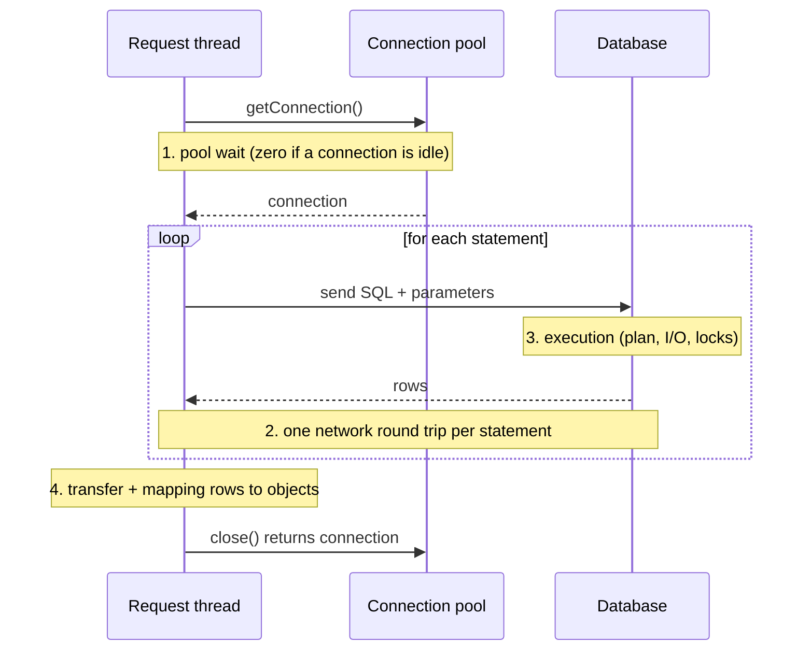
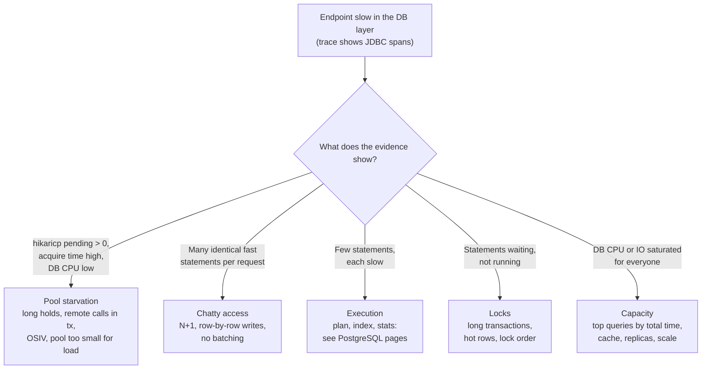

# Database & Query Performance

!!! abstract "Key takeaways"
    - A request's database time is **pool wait + round trips × network latency + server execution + result transfer and mapping**. Slow-query tuning only fixes the third term; most application-side problems live in the other three.
    - **Count queries per request before tuning any of them.** N+1 reads and row-by-row writes turn a 1 ms round trip into hundreds of milliseconds. Batch reads with joins or `IN`/`ANY`, batch writes with JDBC batching (and avoid `IDENTITY` ids, which disable Hibernate insert batching).
    - **A bigger connection pool is usually slower, not faster.** Size it with Little's law (busy connections ≈ queries per second × time each connection is held) and keep `pool × instances` well under the database's limit. HikariCP's pool-sizing guide starts from `(cores × 2) + effective spindles` on the database server.
    - **Hold a connection only while you use the database.** Remote calls inside `@Transactional`, Open Session in View and long transactions make the pool the bottleneck long before the database is busy.
    - After access paths are right, reduce load on the primary: cache hot reads, send stale-tolerant reads to replicas, precompute expensive aggregates, and move non-urgent writes off the request path.

## Why it matters

"The database is slow" is the most common explanation for a slow service, and it's often wrong in an interesting way. The database may be idle while requests wait for a connection; or every query may be fast but there are 300 of them per request; or the query is fast but holds row locks while the code calls another service. Interviewers ask about database performance to see whether you can **locate** the time before you change anything, which is the [measure, profile, fix, verify loop](01-performance-methodology-measure-profile-fix-verify.md) applied to the data layer.

This page is the application-side view. The database-side detail is covered elsewhere and linked, not repeated: reading plans and choosing indexes in [indexes and EXPLAIN ANALYZE](../postgresql-sql/02-indexes-and-explain-analyze.md), the usual slow-SQL culprits in [query optimisation](../postgresql-sql/06-query-optimisation-and-common-performance-issues.md), pooling and replicas in [partitioning, replication and connection pooling](../postgresql-sql/07-partitioning-replication-and-connection-pooling.md), ORM fetch strategies in [N+1 problem and solutions](../jpa-hibernate/03-n-plus-1-problem-and-solutions.md), and MongoDB in [indexing and explain plans](../mongodb/03-indexing-and-explain-plans.md).

## Core concepts

### Where a request's database time goes


*Notice that the connection is held from `getConnection()` to `close()`, including any time the thread spends doing something else in between. That holding time, not query time, is what fills a pool.*

A useful budget, with illustrative numbers for an order-details endpoint:

| Term | Formula | Example |
|---|---|---|
| Pool wait | queueing for a free connection | 0 ms when healthy, seconds when exhausted |
| Round trips | statements × network RTT | 51 statements × 1 ms = 51 ms |
| Execution | sum of server time per statement | 51 × 0.2 ms = 10 ms |
| Transfer and mapping | rows × width, entity hydration | 5 ms for a few hundred rows |

In that example the slowest single query takes 0.2 ms, so a slow-query log shows nothing, yet the endpoint spends 66 ms in the database layer. **The query count is the bug.** The same data in 2 statements costs about 2 ms of round trips.

{ loading=lazy }
*Each query is fast; the gaps between them are the cost. Count statements per request before tuning any one of them.*

### Triage: which term is hurting?


*Notice that only one branch leads to classic query tuning. The trace (JDBC spans per request), the pool metrics and the database's own statistics together tell you which branch you're on.*

The evidence comes from three places:

- **Traces:** one span per JDBC statement (OpenTelemetry's JDBC instrumentation or Micrometer Observation on the data source). A waterfall of 50 identical spans is N+1 at a glance. See [distributed tracing](../observability/04-distributed-tracing-with-opentelemetry.md).
- **Pool metrics:** HikariCP publishes `hikaricp.connections.active`, `.idle`, `.pending`, `.acquire` (time to get a connection) and `.usage` (time held) through Micrometer. **Pending above zero for long stretches** is the starvation signal.
- **Database statistics:** `pg_stat_statements` ranked by total time, wait events in `pg_stat_activity`, MongoDB's profiler and `explain("executionStats")`.

### Fewer round trips

**Reads.** Replace "load parent, then one query per child" with a join, an `IN`/`= ANY(?)` query for all children, `@EntityGraph`/`JOIN FETCH`, or Hibernate batch fetching (`@BatchSize`, `hibernate.default_batch_fetch_size`) as a safety net. For list screens, a DTO projection that selects only the columns shown is usually the biggest single win, because it removes both extra queries and entity hydration. The trade-offs between those options are on the [N+1 page](../jpa-hibernate/03-n-plus-1-problem-and-solutions.md).

**Writes.** Saving 1,000 entities in a loop sends 1,000 `INSERT`s unless batching is on:

- Set `hibernate.jdbc.batch_size` (e.g. 50) and `hibernate.order_inserts` / `order_updates` so statements for the same table are grouped.
- **`GenerationType.IDENTITY` disables insert batching** in Hibernate, because it must execute each insert to learn the generated id. Use a sequence with a pooled optimizer (`allocationSize` 50 is the JPA default) so ids are allocated in memory.
- With PostgreSQL's JDBC driver, `reWriteBatchedInserts=true` rewrites a batch of single-row inserts into multi-row `INSERT … VALUES (…), (…)` statements, cutting server work further.
- For bulk loads (tens of thousands of rows and up), skip the ORM: `JdbcTemplate.batchUpdate`, PostgreSQL `COPY`, or MongoDB `bulkWrite` with `ordered=false`.

**Large reads.** By default the PostgreSQL driver fetches the whole result set into memory. For exports, set a fetch size (it only streams when auto-commit is off, i.e. inside a transaction) or page with keyset pagination, so memory stays flat and the first rows arrive early.

### Connection pools: smaller is usually faster

A database can only run as many statements truly in parallel as it has cores (plus some overlap while waiting on disk). Beyond that, extra connections add context switching, lock contention and memory, and every query gets slower. HikariCP's *About Pool Sizing* page reports an Oracle demonstration where cutting the pool from 2,048 to 96 connections, with nothing else changed, took response times from about 100 ms to about 2 ms, and starts from the formula `connections = (core_count × 2) + effective_spindle_count`, where the spindle count is zero when the working set is fully cached.

Size from the application side with **Little's law** (in-flight = arrival rate × time in system):

- 400 requests/s × 2 statements × 3 ms held each ≈ **2.4 connections busy on average**. A pool of 10 (Hikari's default) has plenty of headroom.
- The same service with a 200 ms remote call inside the transaction holds each connection ~203 ms: 400 × 0.203 ≈ **81 connections busy**. The pool of 10 is exhausted, and requests queue for up to `connectionTimeout` (30 s by default) before failing.
- Total connections = pool size × instances. Twenty pods with a pool of 20 is 400 connections against a PostgreSQL default `max_connections` of 100. Use a smaller pool per pod, or a server-side pooler such as PgBouncer or RDS Proxy.

{ loading=lazy }
*Past the knee, more connections add queueing inside the database instead of throughput. Illustrative curve for an 8-core database server.*

!!! warning "Virtual threads don't add database capacity"
    With [virtual threads](../java-concurrency-jvm/07-virtual-threads-and-structured-concurrency.md) a service can have 10,000 concurrent requests, but still only 10 pooled connections. The pool becomes the limiter, which is correct: keep it bounded and let the excess wait or be shed, rather than raising the pool to match the thread count.

### Hold connections and locks briefly

- **No remote calls inside a transaction.** Fetch from other services first, then open a short transaction to write. While a transaction waits on HTTP it holds a connection and any row locks it took.
- **Turn off Open Session in View** (`spring.jpa.open-in-view=false`). Spring Boot enables it by default and logs a warning at startup: it keeps the persistence context, and in practice the connection, open until the view is rendered, and lazy loads during serialisation become hidden N+1 queries.
- **Read-only transactions** (`@Transactional(readOnly = true)`) skip Hibernate's dirty checking and can route to a replica with a routing data source.
- Long transactions also hurt the database itself: in PostgreSQL they hold back vacuum, so dead rows pile up and every query reads more pages. See [MVCC and locking](../postgresql-sql/04-mvcc-locking-and-deadlocks.md).

### Take read load off the primary

Once queries are efficient, the next lever is **not asking the primary at all**:

| Technique | Good for | Cost |
|---|---|---|
| Cache-aside in Redis or in-process | Hot, read-mostly data (reference data, profiles) | Staleness, invalidation, stampedes; see [caching patterns](../redis-caching/02-caching-patterns-cache-aside-read-write-through-write-behind.md) and [stampede](../redis-caching/04-cache-stampede-penetration-and-avalanche.md) |
| Read replicas | Reports, search pages, anything tolerating seconds of lag | Replication lag, read-your-writes problems |
| Precomputed views (materialized views, summary tables, CQRS read models) | Expensive aggregates read often | Refresh cost, eventual consistency |
| Denormalised documents (MongoDB) | Read patterns known up front | Write amplification, duplication |
| Async writes (queue, outbox) | Audit logs, counters, notifications | Delay, ordering, failure handling |

## In practice: code & configuration

=== "❌ Common mistake"
    ```java
    @Service
    class RefillService {
        private final RxRepository rxRepository;
        private final RefillEventRepository events; // RefillEvent: @GeneratedValue(strategy = IDENTITY)
        private final PricingClient pricing;        // HTTP call, ~200 ms

        @Transactional                              // connection held for the whole method
        public void refillAll(List<RefillRequest> requests) {
            for (RefillRequest r : requests) {
                Rx rx = rxRepository.findById(r.rxId()).orElseThrow();  // 1 SELECT per item: N+1
                Price p = pricing.quote(rx.drugCode());                 // remote call while holding the connection
                rx.refill(p);
                events.save(new RefillEvent(rx.getId(), p));           // IDENTITY: 1 INSERT per row, no batching
            }
        }
    }
    ```

=== "✅ Correct approach"
    ```java
    @Service
    class RefillService {
        private final RxRepository rxRepository;
        private final RefillEventRepository events; // RefillEvent ids from a pooled sequence (allocationSize = 50)
        private final PricingClient pricing;
        private final TransactionTemplate tx;

        public void refillAll(List<RefillRequest> requests) {
            List<Long> ids = requests.stream().map(RefillRequest::rxId).toList();

            // 1. Read in one round trip, outside any write transaction
            Map<Long, RxView> rxs = rxRepository.findViewsByIdIn(ids).stream()
                    .collect(Collectors.toMap(RxView::id, v -> v));

            // 2. Remote calls with no connection held (one bulk call if the API allows it)
            Map<String, Price> prices = pricing.quoteAll(
                    rxs.values().stream().map(RxView::drugCode).distinct().toList());

            // 3. Short write transaction; Hibernate groups INSERTs into JDBC batches of 50
            tx.executeWithoutResult(status -> {
                for (RefillRequest r : requests) {
                    RxView v = rxs.get(r.rxId());
                    events.save(new RefillEvent(v.id(), prices.get(v.drugCode())));
                }
            });
        }
    }
    ```

```yaml
# application.yml (Spring Boot 3.x)
spring:
  datasource:
    url: jdbc:postgresql://db:5432/rx?reWriteBatchedInserts=true
    hikari:
      maximum-pool-size: 10          # from Little's law, not from "max threads"
      connection-timeout: 2000       # fail fast (ms) instead of queueing for 30 s
      leak-detection-threshold: 20000  # log a stack trace if a connection is held > 20 s
  jpa:
    open-in-view: false              # no lazy loading during JSON serialisation
    properties:
      hibernate:
        jdbc.batch_size: 50
        order_inserts: true
        order_updates: true
        default_batch_fetch_size: 32 # safety net for lazy collections
```

Guard the fix with a test that counts statements, so a later change can't quietly reintroduce N+1. Hibernate's `Statistics#getPrepareStatementCount()` or a datasource-proxy wrapper both work:

```java
@Test
void orderDetailsUsesAtMostTwoQueries() {
    Statistics stats = sessionFactory.getStatistics();   // hibernate.generate_statistics=true in the test profile
    stats.clear();
    orderService.details(orderId);
    assertThat(stats.getPrepareStatementCount()).isLessThanOrEqualTo(2);
}
```

## Real-world usage

- **Pool sizing:** the HikariCP guide's Oracle demonstration (2,048 → 96 connections, ~100 ms → ~2 ms) is the standard citation for "smaller pools are faster". Managed poolers (RDS Proxy, PgBouncer in transaction mode) exist because fleets of autoscaled pods or Lambdas each opening their own pool can exhaust `max_connections`.
- **ORM chattiness:** N+1 is the most common production finding in Spring/JPA services, usually discovered from a trace waterfall or a sudden drop when a collection grows. Teams add query-count assertions to CI to stop regressions.
- **Read scaling:** read replicas and caches are the usual first step for read-heavy domains such as pharmacy benefit lookups or product catalogues, with the consistency trade-off made explicit (a member who just changed an address must see it; a formulary list can be minutes old).
- **Healthcare and banking:** audit and history tables grow without bound, so writes are batched or moved async and old data is partitioned; see [partitioning](../postgresql-sql/07-partitioning-replication-and-connection-pooling.md).

## Trade-offs & production gotchas

| Option | Pros | Cons | Use when |
|---|---|---|---|
| `JOIN FETCH` / entity graph | One query, entities managed | Row explosion with several collections, breaks paging | One collection, detail views |
| `IN` / `ANY` batch query | Two queries total, simple | Parameter limits, very long lists | Loading children for a page of parents |
| DTO projection | Least data, no dirty checking | Not managed entities | List and read endpoints |
| JDBC batching | Far fewer round trips | Needs non-IDENTITY ids, delayed errors | Writing many rows in one transaction |
| Larger pool | More concurrency if DB has spare cores | More DB contention, connection limits | Measured idle DB with pool waits |
| Cache | Removes load entirely | Staleness, invalidation | Hot, read-mostly data |
| Read replica | Scales reads | Lag, routing complexity | Stale-tolerant reads |

!!! warning "Gotcha: the pool hides the real error"
    When a pool is exhausted, the error you see is `SQLTransientConnectionException: Connection is not available, request timed out after 30000ms` in an unrelated endpoint. The cause is somewhere else: a slow remote call inside a transaction, a leaked connection, a lock wait. Look at `hikaricp.connections.usage` (time held) and turn on `leakDetectionThreshold` before raising the pool size.

!!! warning "Gotcha: fast in dev, slow in prod"
    A dev database with 50 rows, on localhost, hides both bad plans (everything fits in memory) and round-trip costs (RTT of microseconds instead of a millisecond across availability zones). Test with production-shaped data volumes and a realistic network, e.g. [Testcontainers](../testing/04-testcontainers.md) seeded with representative data, and a [load test](05-load-testing-and-capacity-planning.md).

## How this connects to my experience

- **Where I used it:** not a specific resume claim, so position it as working knowledge from the data layers I've built: the GraphQL Consumer Service on OptumRx Meteor (Spring Boot with MongoDB, plus **Redis caching for frequently accessed queries and UI reference data**), and AWS RDS and DynamoDB services at Deloitte ConvergeHealth.
- **Talking points:**
    - The Redis cache on Meteor is a "take load off the primary" decision: describe what was cached, the TTL or invalidation rule, and what you measured before and after *[confirm hit rate and latency numbers]*.
    - Aggregating 5 upstream systems makes round-trip discipline familiar: batch where an upstream allows it, parallelise independent calls, and never hold a database resource while waiting on a remote one (see [aggregating upstreams](../graphql/05-aggregating-multiple-upstream-systems-orchestration-timeouts.md)).
    - With MongoDB, the equivalents are `explain("executionStats")`, the ESR index rule, the profiler, and the driver's connection pool (default max 100 per client) *[confirm any specific slow-query fix]*.
- **Likely follow-up chain:** "How would you find a slow endpoint's cause?" → trace, count statements, check pool metrics, then the plan → "The pool keeps running out. Do you raise it?" → no, find who holds connections and for how long, Little's law, leak detection → "What if the database is genuinely saturated?" → rank queries by total time, cache, replicas, precompute, then scale up.

## Interview questions

### Fundamentals

??? question "Q1. An endpoint spends 300 ms in the database, but no query takes more than 2 ms. What's going on?"
    **Answer:** The time is in round trips, not execution: probably hundreds of small statements per request (N+1 reads or row-by-row writes), each costing a network round trip plus driver and ORM overhead. Or the time is pool wait before the first query. I'd open a trace to count JDBC spans per request and look at `hikaricp.connections.pending`. Fixes: joins or `IN` queries, entity graphs, projections, JDBC batching, and a test asserting the statement count.

    **Interviewer listens for:** decomposing DB time into pool wait, round trips, execution; counting queries; evidence from traces.

    **Common wrong answer:** "Add indexes" or "scale up the database", when no single query is slow.

??? question "Q2. Why can a bigger connection pool make things slower?"
    **Answer:** The database can only execute about as many statements in parallel as it has cores (plus some overlap for I/O). More connections beyond that mean more context switching, lock and latch contention, and memory per connection, so each query gets slower and throughput flattens or drops. HikariCP's pool-sizing guide cites an Oracle demo where shrinking the pool from 2,048 to 96 cut response times from ~100 ms to ~2 ms. Size with Little's law and keep the total across instances under the database's connection limit.

    **Interviewer listens for:** cores as the real parallelism limit, contention, total connections across pods.

    **Common wrong answer:** "Pool size should match the number of request threads."

??? question "Q3. How do you size a connection pool?"
    **Answer:** Start from demand with Little's law: busy connections ≈ statements per second × average time a connection is held. Add headroom for bursts (say 2×), then check the supply side: the database server's cores (Hikari's starting point is `cores × 2 + effective spindles`) and `max_connections` divided across all instances. Then load test and watch `pending`, acquire time and DB CPU. If demand exceeds what the database can serve, the answer is to shorten hold times or reduce queries, not a bigger pool.

    **Interviewer listens for:** Little's law, hold time, fleet-wide total, verification under load.

    **Common wrong answer:** a fixed number like "100, to be safe".

### Intermediate

??? question "Q4. Why doesn't Hibernate batch my inserts even though I set jdbc.batch_size?"
    **Answer:** Most often the entity uses `GenerationType.IDENTITY`. Hibernate must execute each insert immediately to get the database-generated id, so it disables JDBC insert batching for that entity. Switch to a sequence with a pooled optimizer (`allocationSize` 50), enable `order_inserts`, and for PostgreSQL add `reWriteBatchedInserts=true`. Other causes: flushing after every save, or mixing entity types without `order_inserts`.

    **Interviewer listens for:** IDENTITY, sequence allocation, order_inserts, verification via logs or statistics.

    **Common wrong answer:** "The database doesn't support batching."

??? question "Q5. What's wrong with calling another service inside a @Transactional method?"
    **Answer:** The transaction holds a pooled connection, and any row locks it has taken, for the whole remote call. With a 200 ms call at 400 requests/s, Little's law says ~80 connections are busy, so a pool of 10 is exhausted and unrelated endpoints time out waiting. Locks held that long also block other writers. Do the remote call first, then open a short transaction; if both must be consistent, use an outbox or a saga rather than a long transaction.

    **Interviewer listens for:** connection hold time, locks, Little's law, outbox/saga alternative.

    **Common wrong answer:** "It's fine as long as the remote call is fast."

??? question "Q6. What is Open Session in View and why do many teams disable it?"
    **Answer:** OSIV keeps the Hibernate session open for the whole web request so lazy associations can load while the response is rendered or serialised. Spring Boot enables it by default and warns about it at startup. The costs: the connection is held longer, and lazy loads during JSON serialisation become hidden N+1 queries outside any service-layer control. Disable it (`spring.jpa.open-in-view=false`) and fetch what each use case needs explicitly with entity graphs or DTO projections.

    **Interviewer listens for:** hidden lazy loading, connection hold time, explicit fetch plans.

    **Common wrong answer:** "It's needed to avoid LazyInitializationException", which treats the symptom.

??? question "Q7. How do you export 5 million rows from a Spring service without running out of memory?"
    **Answer:** Don't load them into a `List`. Stream: `JdbcTemplate` with a `RowCallbackHandler` or a `Stream` from a repository, a fetch size (e.g. 1,000) inside a read-only transaction, since the PostgreSQL driver only uses a cursor when auto-commit is off, and write each row to the output as it arrives. Alternatively page with keyset pagination, or use `COPY … TO STDOUT` for raw exports. Detach or avoid entities so the persistence context doesn't grow.

    **Interviewer listens for:** fetch size and its auto-commit condition, streaming, no persistence-context growth, keyset.

    **Common wrong answer:** "Use OFFSET/LIMIT pages of 1,000", which gets slower on every page.

### Senior

??? question "Q8. Twenty pods each have a Hikari pool of 30. The database's max_connections is 200. What happens, and what do you change?"
    **Answer:** 600 possible connections against 200 allowed: during scale-out or a burst, new connections are refused and pods fail health checks, and even below the limit hundreds of active connections overload the database's cores. Options: shrink each pool to what Little's law says a pod needs (often 5–10), put a server-side pooler such as PgBouncer (transaction mode) or RDS Proxy in front, cap autoscaling with the database in mind, and reduce hold times. Raising `max_connections` is the last resort because each PostgreSQL connection is a process with its own memory.

    **Interviewer listens for:** fleet-wide arithmetic, autoscaling interaction, server-side pooling, why not just raise the limit.

    **Common wrong answer:** "Increase max_connections to 1,000."

??? question "Q9. The database CPU is at 90% and all queries have decent plans. How do you buy headroom?"
    **Answer:** First rank by **total** time (`pg_stat_statements`: calls × mean) because the biggest consumer is often a cheap query called very often. Then, in rough order: cache that hot query's result (or the whole response), remove redundant calls (the same lookup repeated per request), move stale-tolerant reads to replicas, precompute aggregates into summary tables or materialized views, move non-urgent writes async, and only then scale the instance or partition the data. Verify each change with the same metric.

    **Interviewer listens for:** total-time ranking, caching and replicas with consistency caveats, precomputation, scaling last, verification.

    **Common wrong answer:** "Shard the database", as the first step.

### Scenario-based

??? question "Q10. Every morning at 9:00 the API's p99 goes from 150 ms to 4 s for ten minutes. The database looks fine. Walk me through it."
    **Answer:** "Database looks fine" plus a time-based spike suggests the pool or a lock, not execution. Check `hikaricp.connections.pending` and acquire time at 9:00, then what's holding connections: a scheduled batch job sharing the same pool (separate pools or a separate service), a cache expiring for everyone at 9:00 and stampeding the database (jittered TTL, single-flight), or a report holding row locks. Correlate with traces of slow requests: is the time before the first JDBC span (pool wait) or inside it? Fix the cause, add an alert on pending connections, and add a load test that reproduces the 9:00 pattern.

    **Interviewer listens for:** pool wait vs execution, shared pools, cache stampede, locks, evidence from traces, regression test.

    **Common wrong answer:** "Increase the pool and the instance size."

??? question "Q11. A GraphQL query for 50 members, each with prescriptions and pharmacy, takes 2 seconds. How do you make it fast?"
    **Answer:** Classic per-field N+1: 1 query for members, 50 for prescriptions, up to 50 × k for pharmacies. Use a DataLoader per request so each field batches its keys into one `IN` query (3 statements total), select only requested columns via projections, cache stable reference data like pharmacy details in Redis, and assert the statement count in a test. Also cap query depth and page sizes so a client can't ask for 5,000 members.

    **Interviewer listens for:** DataLoader batching, statement count, caching reference data, query limits.

    **Common wrong answer:** "Add an index on member_id", which fixes one query out of hundreds.

## Cheat sheet

| Concept | Remember |
|---|---|
| DB time | pool wait + statements × RTT + execution + transfer/mapping |
| First measurement | Statements per request (trace) and pool `pending` |
| N+1 | Join, `IN`/`ANY`, entity graph, projection, batch fetch size |
| Write batching | `jdbc.batch_size`, `order_inserts`, sequence ids (not IDENTITY), `reWriteBatchedInserts` |
| Large reads | Fetch size inside a transaction, stream, keyset |
| Pool size | Little's law on hold time; Hikari start `cores × 2 + spindles`; default 10 |
| Pool total | pool × instances < `max_connections`; pooler for big fleets |
| Hold time | No remote calls in transactions; `open-in-view: false` |
| Signals | `hikaricp.connections.pending`, `.acquire`, `.usage`; leak detection |
| Off the primary | Cache, replicas, precompute, async writes |
| Plans and indexes | See the PostgreSQL and MongoDB pages |

## Sources
1. [HikariCP: About Pool Sizing](https://github.com/brettwooldridge/HikariCP/wiki/About-Pool-Sizing): pool-size formula, Oracle demo (2,048 → 96 connections, ~100 ms → ~2 ms).
2. [HikariCP README: configuration](https://github.com/brettwooldridge/HikariCP#gear-configuration-knobs-baby): defaults for `maximumPoolSize` (10), `connectionTimeout` (30 s), `leakDetectionThreshold`.
3. [Hibernate ORM User Guide: Batching](https://docs.jboss.org/hibernate/orm/6.4/userguide/html_single/Hibernate_User_Guide.html#batch): `jdbc.batch_size`, `order_inserts`, and IDENTITY disabling insert batching.
4. [pgJDBC: connection parameters](https://jdbc.postgresql.org/documentation/use/): `reWriteBatchedInserts`, `defaultRowFetchSize`; [getting results based on a cursor](https://jdbc.postgresql.org/documentation/query/#getting-results-based-on-a-cursor): fetch size requires auto-commit off.
5. [Spring Boot reference: Open EntityManager in View](https://docs.spring.io/spring-boot/reference/data/sql.html#data.sql.jpa-and-spring-data.open-entity-manager-in-view) and [Spring Boot metrics: data source and Hikari metrics](https://docs.spring.io/spring-boot/reference/actuator/metrics.html#actuator.metrics.supported.jdbc).
6. [PostgreSQL 16: Connections and authentication (max_connections)](https://www.postgresql.org/docs/16/runtime-config-connection.html).
7. [MongoDB: Connection pool overview](https://www.mongodb.com/docs/manual/administration/connection-pool-overview/) and [Database profiler](https://www.mongodb.com/docs/manual/tutorial/manage-the-database-profiler/).
8. Vlad Mihalcea, *High-Performance Java Persistence*: batching, fetching and connection management in JPA.
