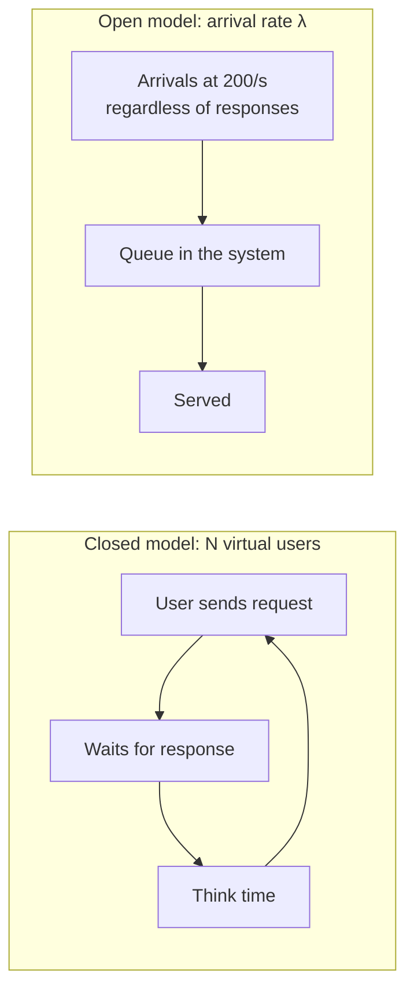
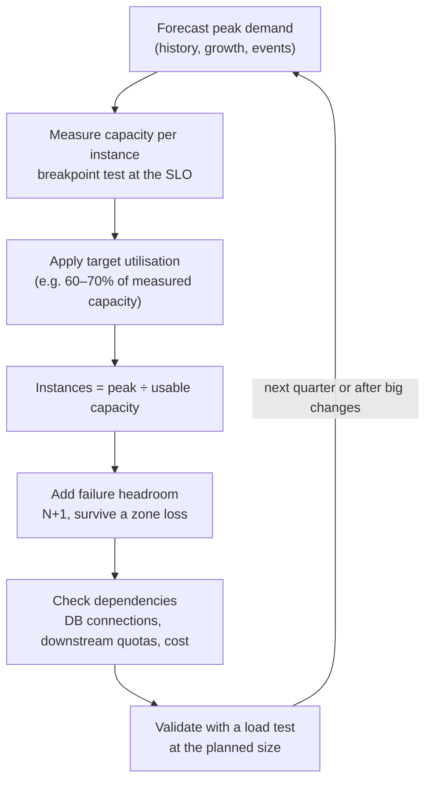

# Load Testing (JMeter, Gatling, k6) & Capacity Planning

!!! abstract "Key takeaways"
    - Each test type answers a different question: **smoke** (does the script work?), **average load** (do we meet the SLO at normal peak?), **stress** (what breaks above it?), **spike** (sudden surges), **soak** (leaks and drift over hours), **breakpoint** (where is the limit?).
    - Choose the **workload model** deliberately. A **closed** model (fixed virtual users, each waits for its response) slows down when the system slows down and under-reports latency, the effect Gil Tene named **coordinated omission**. Real internet traffic is **open**: requests keep arriving at a rate. Use arrival-rate executors (`constant-arrival-rate` in k6, `injectOpen` in Gatling, JMeter's Open Model Thread Group).
    - A test is only as good as its realism: production **request mix**, realistic **data cardinality** (not one cached user), warm-up, a production-like environment, and a load generator that isn't itself the bottleneck. Encode the SLO as **pass/fail thresholds** (e.g. p99 < 800 ms, errors < 1%) so CI can fail the build.
    - **Capacity planning** turns measured per-instance capacity into a fleet size: forecast peak × safety margin ÷ (capacity per instance at the SLO × target utilisation), then add headroom to survive losing a node or a zone.
    - Throughput doesn't scale linearly with instances or threads. **Little's law** (L = λW) relates concurrency, rate and latency; the **Universal Scalability Law** models the contention and coherency costs that make throughput flatten or fall.

## Why it matters

Most performance surprises happen on launch day, at month-end, or after a marketing email: traffic the system has never seen. Load testing is how you see it first, and capacity planning is how you turn what you saw into a number of pods, a database size and a budget. Interviewers probe both because they separate engineers who "ran JMeter once" from those who can say what the test proved, why its numbers can be trusted, and how many instances to run for next quarter.

It's the **verify** step of the [performance methodology](01-performance-methodology-measure-profile-fix-verify.md), and it relies on correct latency measurement from [percentiles and tail latency](06-latency-percentiles-tail-latency.md). The back-of-envelope arithmetic for design interviews is on [estimation](../system-design/02-back-of-the-envelope-estimation.md); this page is about measuring real systems.

## Core concepts

### Test types

| Type | Question it answers | Shape | Typical duration |
|---|---|---|---|
| Smoke | Does the script and environment work? | 1–5 users | 1–2 min |
| Average load | Do we meet the SLO at expected peak? | Ramp to expected peak, hold | 15–60 min |
| Stress | How does it behave above peak? Does it degrade gracefully? | Ramp to 1.5–3× peak, hold | 15–60 min |
| Spike | Do we survive a sudden surge (autoscaling lag, cold caches)? | Jump to many × peak in seconds, drop | Minutes |
| Soak (endurance) | Leaks, pool exhaustion, log or disk growth, GC drift | Average load for hours | 2–24 h |
| Breakpoint (capacity) | Where is the limit, and what fails first? | Slow continuous ramp until SLO breaks | Until failure |

{ loading=lazy }
*Each shape answers one question. A team that only runs "the load test" usually runs average load and learns nothing about spikes or leaks.*

### Open vs closed workload models


*Notice that in the closed model a slow response delays the next request, so load drops exactly when the system struggles. In the open model arrivals don't care, so a slowdown builds a queue, as it does in production.*

**Closed** models fit systems with a fixed population that waits, such as a call-centre app with 200 agents or a batch worker pool. **Open** models fit public APIs and websites, where new users arrive whether or not earlier ones finished.

**Coordinated omission** is what goes wrong when a closed-model tool measures an open-model system. Gil Tene's example: a system serves 100 requests/s at 1 ms for 100 seconds, then freezes for 100 seconds. A tester sending requests back-to-back records 10,000 results at 1 ms and **one** result of 100 s, so it reports p99 = 1 ms and an average of about 11 ms. But a real user population arriving at 100/s would have sent ~10,000 requests during the freeze, waiting on average 50 s, so the true average is about 25 s and the true p99 is close to 100 s. The tool "coordinated" with the system by not sending the requests that would have been slow.

{ loading=lazy }
*Watch the arrivals stop on the closed side during the stall. Those missing requests are the ones that would have shown the real tail.*

Defences: use an **arrival-rate** executor; if you must use a closed model, set the expected interval and correct for it (HdrHistogram's `recordValueWithExpectedInterval`, wrk2); and always compare with **server-side** latency histograms from production metrics.

### Designing a realistic test

1. **Workload mix from production.** Take endpoint ratios from access logs or APM (e.g. 70% search, 20% detail, 8% claim submit, 2% admin) and the arrival pattern at peak. Weight scenarios accordingly.
2. **Data with real cardinality.** Thousands of distinct users, members and products, drawn with a realistic skew. One test user means one hot cache line and one database row, which hides both cache misses and lock contention.
3. **Think time and pacing** for user journeys, so a session's requests are spaced as in reality. For pure API arrival-rate tests, the rate already encodes it.
4. **Warm-up.** The JVM's JIT, connection pools and caches need minutes to settle; discard or ramp through that period (see [JVM profiling](02-jvm-profiling.md) on warm-up effects).
5. **Production-like environment.** Same instance types, limits, pool sizes, database size and network hops (gateway, service mesh, TLS). Scaled-down environments give scaled-down confidence; say so in the report.
6. **Load generator health.** Watch its CPU, network and dropped iterations. If the generator saturates, you measured the generator.
7. **Watch the system, not just the client.** Collect server-side RED metrics, saturation (CPU, pool `pending`, GC pause, queue depth), and database statistics during the run, so a failed threshold comes with a reason.
8. **Pass/fail criteria from the SLO.** "p99 < 800 ms and error rate < 1% at 300 requests/s for 30 minutes" is a test; "let's see how it goes" isn't. See [SLOs and error budgets](../observability/05-slis-slos-slas-and-error-budgets.md).

### JMeter vs Gatling vs k6

| | JMeter | Gatling | k6 |
|---|---|---|---|
| Scripts | XML test plans built in a GUI; Groovy for logic | Code: Java, Kotlin, Scala or JavaScript DSL | Code: JavaScript/TypeScript |
| Engine | Thread per virtual user | Asynchronous, non-blocking (Netty) | Go runtime, goroutine per VU |
| Load model | Thread groups are closed; Open Model Thread Group (5.5+) and throughput timers for rate | `injectOpen` (rate) and `injectClosed` (concurrency) | Arrival-rate executors (open) and VU executors (closed) |
| Protocols | Very broad: HTTP, JDBC, JMS, LDAP, FTP, plugins | HTTP, WebSocket, SSE, JMS, gRPC, MQTT | HTTP, WebSocket, gRPC, browser module, extensions |
| Pass/fail | Assertions; plugins or report thresholds | `assertions` on percentiles and errors | `thresholds` with optional abort-on-fail |
| Version control and CI | Possible, but XML diffs poorly | Good: code in the repo, Maven/Gradle plugin | Good: single binary, JS in the repo |
| Best for | Mixed protocols, teams with existing JMeter assets | JVM teams who want tests as code | Developer-owned API tests in CI |

All three can produce correct results; the tool matters less than the workload model, data and thresholds.

### Capacity planning


*Notice the last two boxes. The fleet size is only valid if the database, connection limits and downstream services can take the extra instances, and if a test at that size confirms it.*

**Little's law (L = λW)** holds for any stable system: average items in the system = arrival rate × average time in the system. At 500 requests/s and 120 ms average latency, about 60 requests are in flight; if latency doubles at the same rate, 120 are in flight, so thread pools, connection pools and memory must stretch or requests queue. It's how you size pools (see [database performance](04-database-and-query-performance.md) and [thread pools](../java-concurrency-jvm/04-executors-and-thread-pools.md)).

**Utilisation targets.** Queueing delay grows sharply as utilisation approaches 100% (for a simple M/M/1 queue, wait ≈ ρ/(1−ρ) × service time: 4× at 80%, 9× at 90%). That's why plans use 60–70% of measured capacity, not 100%; see [backpressure and load shedding](../distributed-systems/09-backpressure-and-load-shedding.md).

**Universal Scalability Law.** Neil Gunther's model for throughput at N workers (or nodes):

`X(N) = λN / (1 + σ(N − 1) + κN(N − 1))`

σ (contention) is the serial fraction, as in Amdahl's law, and makes throughput flatten; κ (coherency) is the cost of keeping shared state in sync (locks, cache coherence, cross-node chatter) and makes throughput **fall** past a peak. Fit σ and κ to a handful of load-test points (e.g. 1, 2, 4, 8 instances) to predict where adding instances stops paying.

**Worked example (illustrative).** Forecast peak: 1,200 requests/s. A breakpoint test shows one pod meets the SLO (p99 < 300 ms) up to 250 requests/s.

- Usable capacity at 70%: 250 × 0.7 = 175 requests/s per pod.
- Pods for peak: 1,200 ÷ 175 = 6.9 → **7 pods**.
- Survive losing one of three availability zones: the remaining two zones must carry 7 pods' worth, so 7 × 3/2 = 10.5 → **11 pods** (4/4/3 across zones).
- Dependencies: 11 pods × pool of 10 = 110 database connections; check `max_connections` and database CPU at 1,200 requests/s.
- Validate: run an average-load test at 1,200/s against 11 pods, and a test with one zone's pods removed.

## In practice: code & configuration

=== "❌ Common mistake"
    ```javascript
    // k6: closed model, one user, no thresholds
    import http from 'k6/http';
    import { sleep } from 'k6';

    export const options = { vus: 50, duration: '5m' };  // load drops when the API slows down

    export default function () {
      http.get('https://api.test/members/123/claims');    // same member every time: one hot cache entry
      sleep(1);
    }
    // Output is a summary with an average. Nothing fails the build.
    ```

=== "✅ Correct approach"
    ```javascript
    // k6: open model at a target rate, realistic data, SLO thresholds
    import http from 'k6/http';
    import { check } from 'k6';
    import { SharedArray } from 'k6/data';

    const members = new SharedArray('members', () => JSON.parse(open('./members.json'))); // 50k ids

    export const options = {
      scenarios: {
        peak: {
          executor: 'ramping-arrival-rate',     // open model: arrivals don't wait for responses
          startRate: 50, timeUnit: '1s',
          preAllocatedVUs: 200, maxVUs: 1000,   // enough VUs to sustain the rate
          stages: [
            { target: 300, duration: '5m' },    // ramp (also warms JIT and caches)
            { target: 300, duration: '30m' },   // hold at forecast peak
          ],
        },
      },
      thresholds: {
        http_req_failed: ['rate<0.01'],                                   // < 1% errors
        http_req_duration: ['p(95)<300', { threshold: 'p(99)<800', abortOnFail: true }],
        dropped_iterations: ['count<100'],     // the generator kept up with the rate
      },
    };

    export default function () {
      const id = members[Math.floor(Math.random() * members.length)];
      const res = http.get(`https://api.test/members/${id}/claims`, {
        tags: { name: 'GET /members/{id}/claims' },   // one metric series, not 50k URLs
      });
      check(res, { 'status 200': (r) => r.status === 200 });
    }
    ```

The same test in Gatling's Java DSL, for teams who keep tests next to Spring Boot code:

```java
public class ClaimsSimulation extends Simulation {
    HttpProtocolBuilder http = HttpDsl.http.baseUrl("https://api.test");
    FeederBuilder<String> members = csv("members.csv").random();

    ScenarioBuilder browse = scenario("Browse claims")
        .feed(members)
        .exec(HttpDsl.http("GET claims").get("/members/#{memberId}/claims")
              .check(HttpDsl.status().is(200)));

    {
        setUp(browse.injectOpen(
                rampUsersPerSec(50).to(300).during(Duration.ofMinutes(5)),    // open model
                constantUsersPerSec(300).during(Duration.ofMinutes(30))))
            .protocols(http)
            .assertions(
                global().responseTime().percentile4().lt(800),   // percentile4 = p99 by default
                global().failedRequests().percent().lt(1.0));
    }
}
```

Run a short smoke test on every pull request and the full average-load test nightly or before release against a production-like environment; keep results (HTML reports, Prometheus data) so you can compare runs.

## Real-world usage

- **Retail and ticketing peaks** (Black Friday, launches) are planned with load tests at forecast peak plus margin weeks in advance, plus spike tests for the first minutes when caches are cold and autoscaling lags.
- **Healthcare and banking** have calendar-driven peaks: open enrolment, month-end statements, payroll days. Capacity plans name them explicitly; regulators expect resilience testing for critical services.
- **Production load testing:** some large companies replay or shadow real traffic, or run tests in production at low-traffic hours with synthetic accounts, because no staging environment matches production. That needs kill switches, tagging of test traffic and care with side effects.
- **Autoscaling is not a capacity plan.** Scaling takes minutes (new nodes, image pulls, JVM warm-up), so spike tests often show the SLO broken before new pods are ready. Minimum replicas and pre-scaling for known events fill the gap.

## Trade-offs & production gotchas

| Option | Pros | Cons | Use when |
|---|---|---|---|
| Closed model (fixed VUs) | Simple, mirrors fixed populations | Under-reports latency under stress (coordinated omission) | Call-centre style apps, worker pools |
| Open model (arrival rate) | Matches internet traffic, exposes queues | Needs enough VUs, can overload quickly | Public APIs, websites |
| Dedicated perf environment | Safe, repeatable | Costly, drifts from production | Regular regression testing |
| Testing in production | Real data, real topology | Risk to users, side effects | Mature teams with safeguards |
| Replaying captured traffic | Realistic mix and data | PII handling, stateful requests | Read-heavy services |
| Scaled-down environment | Cheap | Results don't extrapolate linearly | Smoke and relative comparisons only |

!!! warning "Gotcha: averages and percentiles from the wrong place"
    A load tool's summary is client-side and per-run. Don't average p99s across load-generator instances or across test runs; merge histograms. And cross-check with server-side histograms, because client numbers include the generator's own queuing. See [percentiles and tail latency](06-latency-percentiles-tail-latency.md).

!!! warning "Gotcha: the test passed because the cache did all the work"
    Hitting the same few IDs measures the cache, not the system. Draw IDs from a production-shaped distribution, and run at least one test with caches cold to see what happens after a deploy or a cache flush.

## How this connects to my experience

- **Where I used it:** not a resume claim. Position it as part of owning services end-to-end and release management on OptumRx Meteor (applications serving **750K+ users**) and of the testing and CI/CD standards I established there.
- **Talking points:**
    - Before a release or a known peak, the questions I'd answer are: expected peak rate, the SLO, the per-pod capacity at that SLO, and what fails first *[confirm whether Meteor ran load tests, with which tool, and any numbers]*.
    - The GraphQL Consumer Service depends on 5 upstreams, so capacity planning includes their limits and quotas, not just our pods; a load test needs realistic upstream latency (stubs with latency distributions or a shared performance environment).
    - Kafka consumers are a closed-ish system (a fixed number of consumers pulling), so their capacity is about throughput and lag, while the GraphQL API is an open system measured with arrival rates.
- **Likely follow-up chain:** "How would you load test the GraphQL service?" → production query mix by operation name, realistic member IDs, open model at peak, thresholds from the SLO → "Your test passes but production falls over at peak. Why?" → cache-hot data, closed model, scaled-down environment, upstreams stubbed too fast, missing spike → "How many pods for next year?" → forecast, measured capacity per pod, 70% target, zone headroom, check the database.

## Interview questions

### Fundamentals

??? question "Q1. What's the difference between load, stress, spike and soak tests?"
    **Answer:** Load (average-load) tests check the SLO at expected peak. Stress tests push beyond peak to see how the system degrades and what breaks first. Spike tests apply a sudden surge to test autoscaling, cold caches and rate limiting. Soak tests run normal load for hours to find leaks, pool exhaustion, disk or log growth and GC drift. A breakpoint test ramps until the SLO fails to find the capacity limit.

    **Interviewer listens for:** a distinct question per type, especially soak for leaks and spike for autoscaling.

    **Common wrong answer:** treating them as the same test with different user counts.

??? question "Q2. What is coordinated omission?"
    **Answer:** A measurement error where the load generator waits for slow responses before sending the next request, so it sends fewer requests exactly when the system is slow and records far fewer slow samples than real users would experience. In Gil Tene's example, a 100-second freeze shows up as one slow sample and a p99 of 1 ms, while users arriving at the planned rate would see a p99 close to 100 s. Fix it with an open (arrival-rate) model, or by correcting for the expected interval, and by checking server-side histograms.

    **Interviewer listens for:** closed loop, missing samples, effect on tail percentiles, arrival-rate fix.

    **Common wrong answer:** "It's when requests are dropped by the server."

??? question "Q3. What's Little's law and how do you use it?"
    **Answer:** L = λW: the average number of items in a stable system equals the arrival rate times the average time each spends in it. At 500 requests/s and 120 ms, about 60 requests are in flight. I use it to size thread pools, connection pools and in-flight limits, and to sanity-check a load test (in a closed test, rate ≈ VUs ÷ (latency + think time); if the measured rate is lower, the generator is the bottleneck or the script waits somewhere I didn't expect).

    **Interviewer listens for:** formula, units, pool sizing, checking a test.

    **Common wrong answer:** confusing throughput with concurrency.

### Intermediate

??? question "Q4. Open vs closed workload model: which do you use and why?"
    **Answer:** Closed (fixed VUs that wait for responses) models a fixed population, e.g. 200 agents in a call centre. Open (arrival rate) models internet traffic, where new requests arrive regardless of how slow the system is. For public APIs I use open models (k6 `constant-arrival-rate` / `ramping-arrival-rate`, Gatling `injectOpen`, JMeter Open Model Thread Group), because closed models reduce load when the system slows and hide queues and tail latency.

    **Interviewer listens for:** matching model to reality, feedback loop of closed models, tool-specific names.

    **Common wrong answer:** "More virtual users means more load", ignoring that VU throughput depends on latency.

??? question "Q5. How do you make a load test realistic?"
    **Answer:** Production request mix and arrival pattern from logs or APM; realistic data cardinality and skew so caches and indexes behave as in production; warm-up; think time for journeys; a production-like environment including gateway, TLS and database size; realistic upstream latencies; a generator that isn't saturated; and SLO-based thresholds. I also watch server-side saturation signals during the run so a failure has a cause.

    **Interviewer listens for:** mix, data, environment, generator health, thresholds, server-side metrics.

    **Common wrong answer:** "Record a browser session and replay it with 1,000 users."

??? question "Q6. JMeter, Gatling or k6: how would you choose?"
    **Answer:** All can produce valid results; I'd choose by team and workflow. k6 suits developer-owned API tests in CI (JavaScript, single binary, thresholds that fail the build). Gatling suits JVM teams who want tests as code in Java or Kotlin with an async engine and percentile assertions. JMeter suits broad protocol needs (JDBC, JMS, LDAP) and teams with existing test plans, run in non-GUI mode for real load. The workload model, data and thresholds matter more than the tool.

    **Interviewer listens for:** criteria rather than brand loyalty, CI integration, workload model support.

    **Common wrong answer:** "JMeter is outdated" or "k6 is always best".

### Senior

??? question "Q7. How do you produce a capacity plan for the next 12 months?"
    **Answer:** Forecast peak demand from history plus business growth and known events. Measure capacity per instance at the SLO with a breakpoint test. Plan for 60–70% of that capacity, divide forecast peak by usable capacity, then add headroom to survive a node or zone loss (e.g. ×3/2 for three zones). Check dependencies: database connections and CPU, downstream quotas, licences, cost. Validate with a test at the planned size, and revisit quarterly or after big changes.

    **Interviewer listens for:** forecast, measured per-instance capacity, utilisation target, failure headroom, dependencies, validation.

    **Common wrong answer:** "Autoscaling handles it."

??? question "Q8. Doubling instances gave only 30% more throughput. Why, and how do you reason about it?"
    **Answer:** Some shared resource limits scaling: a database, a lock, a downstream quota, cache coherence or cross-node chatter. The Universal Scalability Law captures this: σ (contention, serial work) flattens throughput and κ (coherency) makes it fall past a peak. Fit σ and κ from tests at 1, 2, 4 and 8 instances to predict the ceiling, then find the shared resource with saturation metrics (DB CPU, pool waits, lock waits) and remove or partition it.

    **Interviewer listens for:** shared bottleneck, Amdahl/USL, measuring at several sizes, finding the resource.

    **Common wrong answer:** "The load balancer isn't distributing evenly", without evidence.

### Scenario-based

??? question "Q9. The load test passed at 2× expected peak, but production fell over on launch day. What could explain it?"
    **Answer:** Unrealistic test conditions: hot caches from a few test IDs; closed model hiding queueing; a smaller dataset; stubs for upstreams that responded faster than reality; no spike, so autoscaling lag wasn't tested; a different traffic mix (an expensive endpoint used more than expected); or production-only components (WAF, gateway limits, third-party quotas). I'd compare production traces and metrics with the test's, fix the test to reproduce the failure, then fix the system.

    **Interviewer listens for:** specific realism gaps, autoscaling lag, reproduce before fixing.

    **Common wrong answer:** "Production is just different; you can't predict it."

??? question "Q10. You have one week to prove a new claims service can handle open-enrolment peak. Plan it."
    **Answer:** Day 1: agree the peak rate (from last year's enrolment plus growth) and the SLO; extract the request mix. Day 2: build test data (thousands of synthetic members, no PHI) and a k6 or Gatling script with an open model; smoke test. Day 3: average-load at peak in a production-like environment, collecting server metrics. Day 4: breakpoint and spike tests; fix what breaks first. Day 5: soak for several hours overnight; final run at the planned fleet size with one zone removed; write up capacity numbers, risks and assumptions (e.g. upstream stub latency).

    **Interviewer listens for:** agreed SLO and peak first, synthetic data for PHI, test types in order, report with caveats.

    **Common wrong answer:** "Run JMeter with 10,000 users and see what happens."

## Cheat sheet

| Concept | Remember |
|---|---|
| Test types | Smoke, average load, stress, spike, soak, breakpoint |
| Closed model | Fixed VUs, waits for responses; slows when system slows |
| Open model | Arrival rate; k6 `*-arrival-rate`, Gatling `injectOpen`, JMeter Open Model TG |
| Coordinated omission | Missing slow samples; 100 s freeze looks like p99 = 1 ms |
| Realism | Prod mix, data cardinality, warm-up, prod-like env, upstream latency |
| Thresholds | From the SLO: p95/p99 and error rate; fail CI |
| Little's law | L = λW: 500/s × 120 ms = 60 in flight |
| Utilisation | Plan at 60–70%; M/M/1 wait 4× at 80%, 9× at 90% |
| USL | σ flattens, κ makes throughput fall; fit from 1/2/4/8 nodes |
| Fleet size | peak ÷ (capacity × 0.7), then zone headroom, then check DB |

## Sources
1. [Grafana k6: Open and closed models](https://grafana.com/docs/k6/latest/using-k6/scenarios/concepts/open-vs-closed/) and [Load test types](https://grafana.com/docs/k6/latest/testing-guides/test-types/).
2. [Grafana k6: Thresholds](https://grafana.com/docs/k6/latest/using-k6/thresholds/) and [ramping-arrival-rate executor](https://grafana.com/docs/k6/latest/using-k6/scenarios/executors/ramping-arrival-rate/).
3. [Gatling: Injection profiles (open and closed)](https://docs.gatling.io/concepts/injection/) and [Assertions](https://docs.gatling.io/concepts/assertions/).
4. [Apache JMeter user manual: Thread Groups and Open Model Thread Group](https://jmeter.apache.org/usermanual/component_reference.html#Open_Model_Thread_Group).
5. Gil Tene, [How NOT to Measure Latency](https://www.infoq.com/presentations/latency-response-time/) (coordinated omission) and [HdrHistogram](https://github.com/HdrHistogram/HdrHistogram).
6. Neil J. Gunther, *Guerrilla Capacity Planning* (Universal Scalability Law).
7. John D. C. Little, "A Proof for the Queuing Formula: L = λW", *Operations Research*, 1961.
8. Brendan Gregg, *Systems Performance*, 2nd ed.: methodologies, capacity planning and benchmarking pitfalls.
