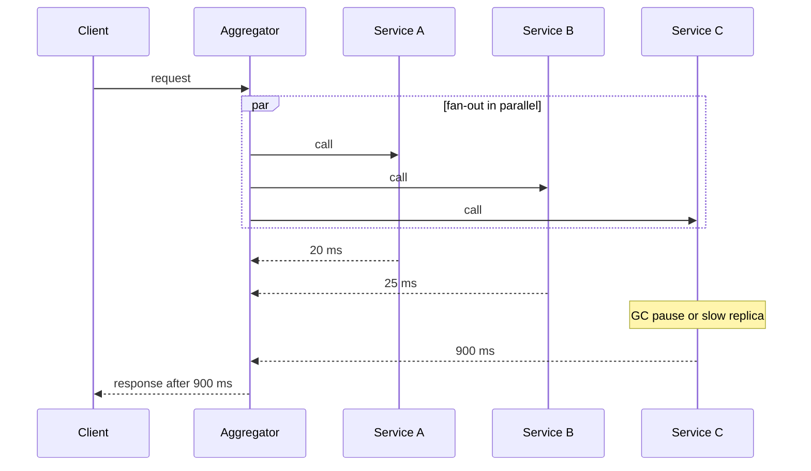
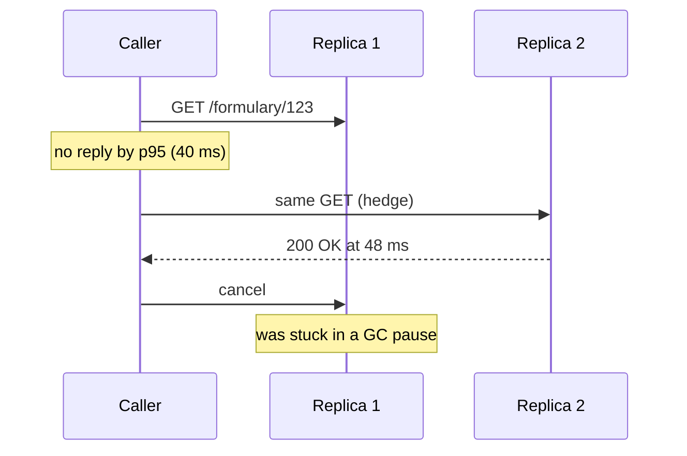

# Latency: Percentiles & Tail Latency

!!! abstract "Key takeaways"
    - Latency distributions are **skewed and often multi-modal** (cache hit vs miss, GC pause, retry). The average describes nobody; report **p50, p95, p99 (and p99.9 for high-volume or fan-out services)** plus the maximum, over a stated window.
    - **Percentiles can't be averaged.** Averaging per-pod p99s, or p99s over time, gives a meaningless number. Record **histograms** (HdrHistogram, Prometheus buckets), merge them, then compute the percentile.
    - **Fan-out amplifies the tail.** If each backend is slow 1% of the time, a request that waits for 100 of them is slow `1 − 0.99¹⁰⁰ ≈ 63%` of the time. A user session of many requests also sees "the p99" often. So the tail of a component is the typical experience of the system.
    - Tail latency comes from **variability**: queueing near saturation, GC pauses, CPU throttling, lock contention, cold caches and JIT, retries and TCP retransmits, background work. Remove sources first; then tolerate the rest.
    - Tail-tolerant techniques from Google's *The Tail at Scale*: **hedged requests** (send a backup after the p95 delay; ~5% extra load), **tied requests**, micro-partitioning, selective replication, putting slow machines on probation, and "good enough" partial results. Combine with **deadlines and timeout budgets** and **load shedding**.

## Why it matters

Users experience individual requests, not averages. A dashboard showing "average latency 120 ms" can coexist with 1 request in 50 taking 3 seconds, and the users who hit those requests are often the most valuable ones (the biggest accounts have the most data, so the slowest queries). In microservice and GraphQL architectures, where one user action touches many services, those rare slow calls stop being rare.

Interviewers use this topic to check statistical literacy (what a percentile is, why you can't average them) and senior judgement (why p99 matters more than p50 for fan-out systems, and what you can do about it). SLOs are usually written as percentiles, so this is also the bridge to [SLOs and error budgets](../observability/05-slis-slos-slas-and-error-budgets.md); the Prometheus mechanics are on [metrics with Micrometer and Prometheus](../observability/03-metrics-with-micrometer-prometheus-and-dashboards.md).

## Core concepts

### Why averages lie

Suppose 98% of requests take 50 ms (cache hit) and 2% take 2,000 ms (cache miss plus a slow query). The mean is 0.98 × 50 + 0.02 × 2,000 = **89 ms**, a value that **no request** actually took. The median (p50) is 50 ms, also blind to the problem. Only the upper percentiles show it: p99 = 2,000 ms.

| Statistic | Meaning | Use |
|---|---|---|
| Mean | Sum ÷ count | Capacity maths (Little's law uses the mean), not user experience |
| p50 (median) | Half of requests are faster | The "typical" request |
| p95 / p99 | 5% / 1% of requests are slower | SLO targets, user-visible slowness |
| p99.9 | 1 in 1,000 is slower | High-volume and fan-out services |
| Max | Worst observed | Reveals pauses and outliers; noisy but never ignore it |

A percentile is only meaningful with its **window and population**: "p99 of `GET /claims` over 5 minutes, server-side, successful and failed requests" is a fact; "p99 is 300 ms" isn't.

**Include failures and timeouts.** If timed-out requests are dropped from the latency metric, a worsening tail can look like an improving one. Either record them at the timeout value or track them alongside (the error rate).

### How many users see the p99?

Percentiles describe requests, not people. If a page load makes 20 backend requests, the chance that at least one is slower than the p99 is `1 − 0.99²⁰ ≈ 18%`. Over a session of 5 pages, about 63% of users see it at least once. "Only 1% of requests" often means "most users, at some point".

### Fan-out amplifies the tail


*Notice that the aggregator's latency is the **maximum** of its parallel calls, not the average. One slow dependency sets the response time.*

For N parallel calls that each exceed a threshold with probability p, the chance that the response does is `1 − (1 − p)^N`:

| Fan-out N | p = 1% (component p99) | p = 0.1% (component p99.9) |
|---|---|---|
| 1 | 1% | 0.1% |
| 5 | 4.9% | 0.5% |
| 10 | 9.6% | 1.0% |
| 50 | 39.5% | 4.9% |
| 100 | 63.4% | 9.5% |

*The Tail at Scale* (Dean and Barroso, 2013) gives the measured version from a Google service: one leaf server's p99 was 10 ms, but the p99 for waiting on **all** leaves was 140 ms, and the p95 for all leaves was 70 ms. Waiting for the slowest 5% of leaves accounted for half of the total p99. That's why services that fan out set component targets at p99.9, not p99.

{ loading=lazy }
*Each backend is fast 99% of the time. Watch how quickly "rarely slow" becomes "usually slow" once a request waits for all of them.*

Sequential calls add up instead: three dependencies on the critical path with p99s of 100, 150 and 200 ms don't give a p99 of 450 ms (the slow cases rarely coincide), but the sum is a safe upper bound for a **timeout budget**. Parallelise independent calls; see [aggregating upstream systems](../graphql/05-aggregating-multiple-upstream-systems-orchestration-timeouts.md).

### Measuring percentiles correctly

- **Use histograms.** Record every latency into buckets: HdrHistogram (constant memory, configurable precision, mergeable) in-process, or Prometheus bucket counters via Micrometer's `percentiles-histogram`. Merge buckets across pods and time, then compute the quantile (`histogram_quantile` in PromQL). Micrometer's client-side `percentiles` are computed per instance and **can't be aggregated**.
- **Put a bucket boundary at the SLO threshold** (e.g. 300 ms) so "fraction of requests under 300 ms" is exact rather than interpolated.
- **Measure where users feel it.** Server-side timers miss time queued before the server accepted the request (load balancer, accept queue, thread pool queue). Client-side, gateway or real-user monitoring catches it.
- **Avoid coordinated omission.** Load tools that wait for each response under-record slow periods; see [load testing](05-load-testing-and-capacity-planning.md#open-vs-closed-workload-models).
- **Look at heatmaps** (latency distribution over time). Bimodal bands such as a fast band and a band at 200 ms + reveal distinct causes (cache misses, retransmits) that a single percentile line blends together.

### Where tail latency comes from

| Source | Mechanism | Typical fix |
|---|---|---|
| Queueing near saturation | Wait time grows as ρ/(1−ρ); bursts create queues | Lower target utilisation, bounded queues, [load shedding](../distributed-systems/09-backpressure-and-load-shedding.md) |
| GC pauses | Stop-the-world pauses add directly to in-flight requests | Allocation reduction, G1 pause goal, ZGC; see [GC tuning](03-memory-leaks-and-gc-tuning-in-practice.md) |
| CPU throttling in containers | CFS quota exhausted mid-period: threads stall until the next 100 ms period | Right-size CPU limits or remove them for latency-critical pods; watch `container_cpu_cfs_throttled_periods_total` |
| Cold starts | JIT not warmed, empty caches, new connections after deploy or scale-out | Warm-up traffic, readiness gates, pre-scaled pools, CRaC or AOT where it fits |
| Lock and pool contention | Requests wait for a lock or a pooled connection | Shorter critical sections, [right-sized pools](04-database-and-query-performance.md#connection-pools-smaller-is-usually-faster) |
| Shared and background work | Compaction, vacuum, backups, batch jobs, noisy neighbours | Schedule, throttle or isolate background work |
| Retries and timeouts | A retry after a 1 s timeout makes a request at least 1 s | Retry budgets, shorter adaptive timeouts, [backoff and jitter](../distributed-systems/05-retries-backoff-jitter-timeouts.md) |
| Network | Packet loss → TCP retransmit after a minimum RTO (200 ms on Linux), DNS lookups | Connection reuse, keep-alive, DNS caching, investigate loss |
| Skewed data | Big tenants or members with huge histories hit slow paths | Pagination, per-tenant limits, precomputation |

Dean and Barroso's point is that at scale you can't remove all of these, so systems must also **tolerate** variability, the way fault-tolerant systems tolerate failures.

### Tail-tolerant techniques

**Hedged requests.** Send the request to one replica; if it hasn't answered within the p95 latency, send the same request to another replica and use whichever answers first, cancelling the other. Deferring the hedge to the p95 limits extra load to about 5%. The paper reports a Google benchmark reading 1,000 keys from BigTable across 100 servers where hedging after 10 ms cut the p99.9 from 1,800 ms to 74 ms while sending only 2% more requests. **Only for idempotent reads.**


*Notice that the hedge is sent only after the p95 delay, so 95% of requests never send one. The slow replica's work is cancelled to limit wasted load.*

{ loading=lazy }
*The backup costs one extra request in twenty, and it turns a 600 ms outlier into a 48 ms response.*

**Tied requests.** Enqueue the request on two servers at once, each knowing about the other; when one starts executing it tells the other to cancel. This avoids the hedge's wait and attacks queueing delay directly. The paper reports tied requests reduced median latency by 16% and the p99.9 by nearly 40% in a BigTable benchmark.

**Other techniques from the paper:**

- **Micro-partitions:** many more partitions than machines, so load can be rebalanced in small pieces.
- **Selective replication:** extra replicas for hot or important items.
- **Latency-induced probation:** temporarily stop sending traffic to a slow server, keep probing it, readmit when healthy (outlier detection in Envoy and service meshes does this).
- **Good-enough results:** return a partial answer when a few slow leaves haven't answered (e.g. search results from 98% of shards), with the omission visible to the caller.
- **Canary requests:** send a new or risky query to one or two leaves first, so a query that crashes or stalls servers doesn't hit all of them.

**Deadlines and budgets.** Give each request an end-to-end deadline and pass the remaining budget downstream (gRPC deadlines do this natively). A dependency should not keep working on a request whose caller has already given up. Combine with circuit breakers and bulkheads from [resilience patterns](../microservices/06-resilience-circuit-breaker-retry-bulkhead-timeout-rate-limit.md).

## In practice: code & configuration

=== "❌ Common mistake"
    ```yaml
    # Spring Boot: client-side percentiles, computed per pod
    management:
      metrics:
        distribution:
          percentiles:
            http.server.requests: 0.5, 0.99
    ```
    ```promql
    # Averages per-pod p99 gauges: mathematically meaningless
    avg(http_server_requests_seconds{quantile="0.99", uri="/claims"})
    ```

=== "✅ Correct approach"
    ```yaml
    # Spring Boot 3.x: publish histogram buckets, aggregatable across pods
    management:
      metrics:
        distribution:
          percentiles-histogram:
            http.server.requests: true
          slo:
            http.server.requests: 100ms, 300ms, 800ms   # exact boundaries at SLO thresholds
          minimum-expected-value:
            http.server.requests: 5ms
          maximum-expected-value:
            http.server.requests: 10s
    ```
    ```promql
    # Merge buckets from all pods first, then estimate the quantile
    histogram_quantile(0.99,
      sum by (le) (rate(http_server_requests_seconds_bucket{uri="/claims"}[5m])))

    # Fraction of requests under the 300 ms SLO threshold (exact, no interpolation)
    sum(rate(http_server_requests_seconds_bucket{uri="/claims", le="0.3"}[5m]))
      / sum(rate(http_server_requests_seconds_count{uri="/claims"}[5m]))
    ```

A hedged read in plain Java 21, for an idempotent call to replicated backends:

```java
static <T> CompletableFuture<T> hedged(Supplier<CompletableFuture<T>> call, Duration hedgeAfter) {
    CompletableFuture<T> primary = call.get();
    Executor delayed = CompletableFuture.delayedExecutor(hedgeAfter.toMillis(), TimeUnit.MILLISECONDS);

    // After the delay, send a backup only if the primary hasn't finished (≈5% of calls at p95)
    CompletableFuture<T> backup = CompletableFuture.supplyAsync(() -> null, delayed)
            .thenCompose(ignored -> primary.isDone() ? primary : call.get());

    CompletableFuture<T> winner = primary.applyToEither(backup, Function.identity());
    winner.whenComplete((v, e) -> { primary.cancel(true); backup.cancel(true); }); // best-effort cancel of the loser
    return winner;
}

// Usage: hedge at the observed p95 of this dependency, never for writes
CompletableFuture<Formulary> f = hedged(() -> formularyClient.get(planId), Duration.ofMillis(40));
```

Production versions add a hedge budget (e.g. at most 5% of requests), route the backup to a different replica, and make sure the HTTP client really aborts the cancelled request. `applyToEither` also completes on the first **failure**; a stricter version waits for the first success.

## Real-world usage

- **Google** (*The Tail at Scale*): hedged and tied requests, micro-partitions and probation across search and BigTable; the 1,800 ms → 74 ms p99.9 result for hedged BigTable reads.
- **Amazon** (Dynamo paper, 2007): service-level agreements were expressed and measured at the **99.9th percentile**, because averages and medians hid the experience of the customers with the most history.
- **Service meshes and load balancers**: Envoy outlier detection ejects slow or failing hosts (probation), and least-request or peak-EWMA load balancing sends traffic away from slow instances, which reduces the tail without code changes.
- **Healthcare and banking**: member and account lookups have long tails driven by data skew (a member with 15 years of prescriptions). Pagination, precomputed summaries and per-request deadlines keep those from dominating p99.

## Trade-offs & production gotchas

| Technique | Pros | Cons | Use when |
|---|---|---|---|
| Lower utilisation target | Simple, cuts queueing tail | More hardware | Latency-critical services |
| Hedged requests | Big tail cut for ~2–5% extra load | Only idempotent reads; needs replicas; wasted work | Read fan-out to replicated stores |
| Tied requests | Attacks queueing delay, little waste | Servers must coordinate cancellation | Systems you control end to end |
| Aggressive timeouts + retry | Bounds worst case | Retry storms, more load at the worst time | With retry budgets and jitter |
| Good-enough responses | Bounded latency | Incomplete results, must be visible | Search, recommendations, dashboards |
| GC change (e.g. ZGC) | Sub-millisecond pauses | More CPU and memory | Pauses visible in the tail |
| Remove CPU limits | No CFS throttling stalls | Noisy-neighbour risk | Latency-critical JVM pods with requests set |

!!! warning "Gotcha: p99 of a low-traffic endpoint"
    With 50 requests in a 5-minute window, the p99 is essentially the maximum of a handful of samples, and it jumps around. Use longer windows, report counts next to percentiles, or alert on "fraction of requests slower than X" instead.

!!! warning "Gotcha: percentiles over time"
    A daily p99 is not the average of 288 five-minute p99s, and the p99 over a month is not the max of daily p99s. Recompute from merged histograms over the window you care about.

## How this connects to my experience

- **Where I used it:** not a specific resume claim. The closest fit is the **GraphQL Consumer Service** on OptumRx Meteor, the integration layer over **5 upstream systems**: a resolver that calls several upstreams is a fan-out, so its p99 is set by the slowest upstream at that moment.
- **Talking points:**
    - With 5 upstreams each slow 1% of the time, a query touching all 5 is slow about 4.9% of the time. That's why per-upstream timeouts, parallel resolution and partial results matter more than average latency *[confirm the actual timeouts and SLOs used]*.
    - **Redis caching for frequently accessed queries and reference data** removes slow upstream calls from the critical path, which cuts the tail more than the median.
    - On the Kafka side, the same thinking applies to end-to-end processing latency and consumer lag percentiles, not averages *[confirm what was monitored]*.
- **Likely follow-up chain:** "Why is p99 more important than average?" → skew, fan-out maths, users see it → "How do you measure it across 20 pods?" → histograms, merge then quantile, never average p99s → "One upstream has a bad tail, what do you do?" → timeout budget, parallelise, cache, hedge if idempotent and replicated, partial response, then fix the upstream's root cause with the owning team.

## Interview questions

### Fundamentals

??? question "Q1. Why use percentiles instead of the average for latency?"
    **Answer:** Latency distributions are skewed and often multi-modal, so the mean describes no real request and is dragged by outliers while still hiding how many requests are slow. Percentiles state what fraction of requests are faster than a value: p50 for the typical case, p95/p99 for user-visible slowness, p99.9 for fan-out and high-volume services. I'd still keep the mean for capacity maths such as Little's law.

    **Interviewer listens for:** skew, multi-modal, what a percentile means, where the mean is still useful.

    **Common wrong answer:** "Percentiles are just more accurate averages."

??? question "Q2. Can you average p99 values across instances?"
    **Answer:** No. Percentiles aren't additive: the average of per-pod p99s isn't the fleet p99 (a pod with little traffic counts as much as a busy one, and the shapes differ). Record histograms (Prometheus buckets, HdrHistogram), sum the buckets across pods and time, then compute the quantile, e.g. `histogram_quantile(0.99, sum by (le)(rate(..._bucket[5m])))`.

    **Interviewer listens for:** non-additivity, histograms, merge then compute.

    **Common wrong answer:** "Yes, or take the max of them."

??? question "Q3. What is tail latency and why does it matter more in microservices?"
    **Answer:** Tail latency is the slow end of the distribution (p99, p99.9). When a request fans out to many services in parallel, its latency is the maximum of their latencies, so rare slowness in each becomes common slowness overall: with 100 backends each slow 1% of the time, 63% of requests are slow. Users making many requests per session also hit the tail often.

    **Interviewer listens for:** max of parallel calls, `1 − (1 − p)^N`, sessions.

    **Common wrong answer:** "It only affects 1% of users."

### Intermediate

??? question "Q4. What causes tail latency in a Spring Boot service on Kubernetes?"
    **Answer:** Queueing as utilisation rises; GC pauses; CPU throttling from container CPU limits (CFS quota exhausted, threads stall until the next period); cold JIT, caches and connections after deploys or scale-out; connection-pool or lock waits; slow dependencies and retries; background work such as batch jobs; TCP retransmits; and data skew where a few large accounts take slow paths. I'd confirm with heatmaps, GC logs, throttling metrics, pool metrics and traces of slow requests.

    **Interviewer listens for:** several distinct sources including CPU throttling and GC, and how to confirm each.

    **Common wrong answer:** "The network."

??? question "Q5. What are hedged requests, and when should you not use them?"
    **Answer:** Send a request to one replica; if no reply arrives within, say, the p95 latency, send a duplicate to another replica and take the first answer, cancelling the other. Deferring to p95 bounds the extra load to about 5%; Google reported cutting a BigTable p99.9 from 1,800 ms to 74 ms with 2% more requests. Don't hedge non-idempotent writes, calls to a single non-replicated backend, or when the system is overloaded (hedges add load); budget them.

    **Interviewer listens for:** delay at a percentile, cancellation, idempotency, load budget.

    **Common wrong answer:** "Always send two requests in parallel."

??? question "Q6. How do you choose timeout values for a chain of dependencies?"
    **Answer:** Start from the end-to-end SLO and the user's patience, then allocate a budget along the critical path. Set each dependency timeout a bit above its observed p99 (or p99.9) so normal slow requests succeed but stuck ones fail fast, and make sure the caller's timeout exceeds the callee's plus retries. Propagate deadlines so downstream work stops when the caller gives up. Retries need budgets and jitter, or they multiply load during incidents.

    **Interviewer listens for:** budget from the SLO, percentile-based timeouts, deadline propagation, retry budgets.

    **Common wrong answer:** "30 seconds everywhere" or "1 second everywhere".

### Senior

??? question "Q7. Your p50 is flat but p99 doubled after a release. How do you investigate?"
    **Answer:** A tail-only change means a subset of requests or moments got slow. Slice the p99 by endpoint, pod, zone, tenant and status; look at a latency heatmap for a new band. Compare GC logs and allocation rate (a new allocation-heavy path), CPU throttling, pool waits, and traces of slow requests versus fast ones to see which span grew. Check whether the release added a dependency call, a retry, a lock, or changed a query for large accounts. Roll back if it breaks the SLO, then fix with a profile or trace as evidence.

    **Interviewer listens for:** slicing, heatmaps, comparing slow vs fast traces, GC and throttling, rollback decision.

    **Common wrong answer:** "Scale up", without locating the cause.

??? question "Q8. You aggregate results from 40 shards. How do you keep p99 under 200 ms when individual shards sometimes take a second?"
    **Answer:** Fan-out maths says even 1% slow shards make most requests slow, so I'd reduce variability and tolerate the rest: replicate shards and hedge reads after the shard p95, or use tied requests; put slow shards on probation; micro-partition so hot data can move; set a per-request deadline and return good-enough results from the shards that answered, with the omission flagged; and cache hot queries. Then fix shard-level causes (GC, compaction, hot partitions).

    **Interviewer listens for:** fan-out maths, hedging/tied requests, partial results, deadlines, probation, root causes.

    **Common wrong answer:** "Increase the timeout to 1 second."

### Scenario-based

??? question "Q9. The SLO says p99 < 500 ms for the claims API. The dashboard shows p99 = 300 ms, but users complain about slowness. What could be wrong?"
    **Answer:** The measurement may not cover what users feel: server-side timers miss queueing in the gateway or accept queue; timeouts and errors may be excluded; the p99 may be averaged across pods or computed from client-side percentiles; the window may hide short bad periods; or the page makes 20 API calls, so most page loads include a slow call. I'd compare gateway and real-user metrics, check how the metric is computed, include failures, and look at per-page (not per-request) latency.

    **Interviewer listens for:** measurement point, excluded failures, aggregation errors, per-page vs per-request.

    **Common wrong answer:** "The users are on slow networks."

??? question "Q10. A GraphQL query resolves fields from 5 upstreams in parallel. One upstream has p99 = 2 s while the others are under 100 ms. What do you do?"
    **Answer:** That upstream sets the query's tail. Short term: give it a timeout budget below the query's SLO and return a partial response with a typed error for that field; cache its stable data in Redis; if it's replicated and the call is an idempotent read, hedge after its p95. Make sure resolvers run in parallel so the other four don't add to it. Longer term: share the traces with the owning team, agree an SLO for the dependency, and find the cause (slow query, GC, cold path).

    **Interviewer listens for:** partial results, timeout budget, caching, hedging conditions, working with the owning team.

    **Common wrong answer:** "Wait for all five; correctness first", without considering partial results.

## Cheat sheet

| Concept | Remember |
|---|---|
| Report | p50, p95, p99, p99.9, max; with window, scope, count |
| Averages | Describe nobody; keep only for capacity maths |
| Aggregation | Merge histograms, then quantile; never average p99s |
| Prometheus | `percentiles-histogram`, `slo` buckets, `histogram_quantile(sum by (le)(rate(...)))` |
| Fan-out | `1 − (1 − p)^N`: 100 × 1% → 63% |
| Sessions | 20 calls per page → 18% of pages see a p99 |
| Sources | Queueing, GC, CPU throttling, cold starts, locks/pools, retries, background work, skew |
| Hedging | After p95 delay, idempotent reads, ~5% load; 1,800 → 74 ms p99.9 at Google |
| Tied requests | Enqueue on two, cancel on start |
| Also | Probation, micro-partitions, selective replication, good-enough results, deadlines |

## Sources
1. Jeffrey Dean and Luiz André Barroso, ["The Tail at Scale"](https://research.google/pubs/the-tail-at-scale/), *Communications of the ACM*, 2013: fan-out maths, 10 ms vs 140 ms leaf numbers, hedged and tied requests, other techniques.
2. DeCandia et al., ["Dynamo: Amazon's Highly Available Key-value Store"](https://www.allthingsdistributed.com/files/amazon-dynamo-sosp2007.pdf), SOSP 2007: SLAs at the 99.9th percentile.
3. [Prometheus: Histograms and summaries](https://prometheus.io/docs/practices/histograms/): aggregation, `histogram_quantile`, bucket choice.
4. [Spring Boot reference: Metrics customisation (percentiles-histogram, slo)](https://docs.spring.io/spring-boot/reference/actuator/metrics.html#actuator.metrics.customizing.per-meter-properties) and [Micrometer: Timers and histograms](https://docs.micrometer.io/micrometer/reference/concepts/histogram-quantiles.html).
5. Gil Tene, [How NOT to Measure Latency](https://www.infoq.com/presentations/latency-response-time/) and [HdrHistogram](https://github.com/HdrHistogram/HdrHistogram).
6. [Kubernetes: Resource management for pods and containers (CPU limits and CFS quota)](https://kubernetes.io/docs/concepts/configuration/manage-resources-containers/).
7. [Envoy: Outlier detection](https://www.envoyproxy.io/docs/envoy/latest/intro/arch_overview/upstream/outlier).
8. [Google SRE Book: Service Level Objectives](https://sre.google/sre-book/service-level-objectives/): percentiles over averages for latency SLIs.
