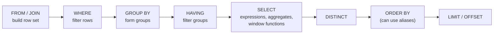

# SQL Essentials: Joins, GROUP BY, Window Functions, CTEs

!!! abstract "Key takeaways"
    - SQL is evaluated **logically** in this order: `FROM`/`JOIN` → `WHERE` → `GROUP BY` → `HAVING` → `SELECT` (including window functions) → `DISTINCT` → `ORDER BY` → `LIMIT`. That explains why you can't use a `SELECT` alias in `WHERE` or a window function in `WHERE`.
    - **Joins:** `INNER` keeps matches only; `LEFT` keeps every left row (NULLs for missing right side); filtering the right table in **`WHERE` turns a LEFT JOIN back into an INNER JOIN**, so put that condition in `ON`. Use `EXISTS` / `NOT EXISTS` for semi/anti joins.
    - **NULL is "unknown":** `NULL = NULL` is NULL (not true), aggregates skip NULLs (`COUNT(col)` vs `COUNT(*)`), and **`NOT IN` with a NULL in the subquery returns no rows**. Prefer `NOT EXISTS`.
    - **Window functions** compute over related rows without collapsing them: `ROW_NUMBER` (always unique), `RANK` (gaps after ties), `DENSE_RANK` (no gaps), `LAG`/`LEAD`, running totals with `SUM() OVER (PARTITION BY … ORDER BY …)`. Classic use: top-N per group.
    - **CTEs** (`WITH`) name subqueries for readability; `WITH RECURSIVE` walks hierarchies. Since PostgreSQL 12, non-recursive CTEs referenced once are **inlined** by the planner (use `MATERIALIZED` to force an optimisation fence).

## Why it matters

Almost every backend loop includes SQL, even for lead roles: "top 3 claims per member", "members with no claims", "running balance", "second highest salary". ORMs hide SQL until something is slow or wrong, and then you need to read and write it fluently. Interviewers also use SQL to probe precision: NULL handling, LEFT JOIN filters and duplicate rows are where confident candidates slip.

All examples below use this small dataset (PostgreSQL 16):

| member | id | name | plan_code | manager_id |
|---|---|---|---|---|
| | 1 | Asha | GOLD | NULL |
| | 2 | Ben | GOLD | 1 |
| | 3 | Chen | SILV | 1 |
| | 4 | Dev | NULL | 2 |
| | 5 | Eva | SILV | 2 |

`claim(id, member_id, amount, status, service_date)`: Asha has 3 claims (120 PAID, 80 DENIED, 200 PAID), Ben 2 (50 PAID, 50 PENDING), Chen 2 (300 PAID, NULL amount PENDING), Eva 1 (75 PAID), Dev none.

## Core concepts

### Logical query processing order


*Notice that `WHERE` runs before `SELECT`, so aliases and window functions defined in `SELECT` aren't visible there. Wrap the query in a subquery or CTE to filter on them. `ORDER BY` runs last, so it can use aliases.*

This is the *logical* order; the planner may physically reorder operations (pushing filters down, choosing join order), but results must match this model.

### Joins

| Join | Returns | Example question |
|---|---|---|
| `INNER JOIN` | Rows with a match on both sides | Claims with their member's name |
| `LEFT [OUTER] JOIN` | All left rows; right columns NULL when no match | All members with their claim count, including zero |
| `RIGHT JOIN` | Mirror of LEFT (rarely used; swap tables instead) | |
| `FULL [OUTER] JOIN` | All rows from both, NULLs where no match | Reconcile two systems' records |
| `CROSS JOIN` | Cartesian product | Generate every member × month combination |
| Self join | A table joined to itself | Employee with manager name |
| Semi join (`EXISTS`) | Left rows that have at least one match, no duplication | Members who have a denied claim |
| Anti join (`NOT EXISTS`) | Left rows with no match | Members with no claims |

Measured row counts: `member JOIN claim` → **8** rows; `member LEFT JOIN claim` → **9** (Dev appears once with NULL claim columns).

**The LEFT JOIN filter trap:**

```sql
-- WRONG: condition on the right table in WHERE removes members without PAID claims (Dev disappears)
SELECT m.name, count(c.id)
FROM member m LEFT JOIN claim c ON c.member_id = m.id
WHERE c.status = 'PAID'
GROUP BY m.name;                    -- 4 rows: Asha 2, Ben 1, Chen 1, Eva 1

-- RIGHT: put it in ON, so non-matching members survive with count 0
SELECT m.name, count(c.id)
FROM member m LEFT JOIN claim c ON c.member_id = m.id AND c.status = 'PAID'
GROUP BY m.name;                    -- 5 rows: ... Dev 0 ...
```

For Dev, `c.status` is NULL, and `NULL = 'PAID'` is not true, so the `WHERE` version filters Dev out.

**Joins multiply rows.** Joining members to claims *and* prescriptions produces claims × prescriptions rows per member, so `SUM(claim.amount)` over that join is inflated. Aggregate each child table separately (in subqueries or CTEs), then join the aggregates.

### Aggregation: GROUP BY, HAVING, FILTER

```sql
SELECT count(*)                                AS all_rows,          -- 8
       count(amount)                           AS non_null_amounts,  -- 7 (Chen's pending claim has NULL)
       sum(amount)                             AS total,             -- 875.00 (NULL ignored)
       avg(amount)                             AS avg_amt,           -- 125.00 = 875 / 7, not / 8
       count(*) FILTER (WHERE status = 'PAID') AS paid               -- 5
FROM claim;
```

- `WHERE` filters **rows** before grouping; `HAVING` filters **groups** after aggregation:

```sql
SELECT member_id, sum(amount) AS total
FROM claim
WHERE status = 'PAID'               -- rows
GROUP BY member_id
HAVING sum(amount) > 100            -- groups: member 1 (320), member 3 (300)
ORDER BY total DESC;
```

- Every non-aggregated column in `SELECT` must be in `GROUP BY` (PostgreSQL allows omitting columns functionally dependent on a grouped primary key).
- `FILTER (WHERE …)` (PostgreSQL, SQL standard) or `SUM(CASE WHEN … THEN 1 ELSE 0 END)` gives conditional aggregates in one pass, the basis of pivot-style reports.

### NULL semantics

| Expression | Result |
|---|---|
| `NULL = NULL` | NULL (unknown), so `WHERE x = NULL` matches nothing |
| `NULL IS NULL` | true |
| `1 + NULL` | NULL |
| `coalesce(NULL, 0)` | 0 |
| `NULL IS DISTINCT FROM NULL` | false (NULL-safe comparison) |
| `count(col)`, `sum`, `avg` | Ignore NULLs |
| `count(*)` | Counts rows |

**The NOT IN trap:**

```sql
-- Members who don't manage anyone. manager_id contains a NULL (Asha has no manager).
SELECT count(*) FROM member WHERE id NOT IN (SELECT manager_id FROM member);         -- 0 (!)
SELECT count(*) FROM member m
WHERE NOT EXISTS (SELECT 1 FROM member x WHERE x.manager_id = m.id);                 -- 3 (Chen, Dev, Eva)
```

`id NOT IN (1, 2, NULL)` means `id <> 1 AND id <> 2 AND id <> NULL`; the last term is unknown, so the whole condition is never true. **Use `NOT EXISTS`** (or filter NULLs out of the subquery). Similarly, `plan_code NOT IN ('SILV','BRNZ')` silently excludes Dev, whose `plan_code` is NULL.

### Window functions

A window function computes a value for each row from a **window** of related rows, **without collapsing them** like `GROUP BY` does.

```sql
function(...) OVER (PARTITION BY <group> ORDER BY <order> [frame])
```

```sql
SELECT member_id, id, amount,
       ROW_NUMBER() OVER w AS rn,      -- 1,2,3 unique even for ties
       RANK()       OVER w AS rnk,     -- ties share a rank, then a gap
       DENSE_RANK() OVER w AS drnk     -- ties share a rank, no gap
FROM claim
WHERE amount IS NOT NULL
WINDOW w AS (PARTITION BY member_id ORDER BY amount DESC);
```

| member_id | id | amount | rn | rnk | drnk |
|---|---|---|---|---|---|
| 1 | 103 | 200.00 | 1 | 1 | 1 |
| 1 | 101 | 120.00 | 2 | 2 | 2 |
| 1 | 102 | 80.00 | 3 | 3 | 3 |
| 2 | 104 | 50.00 | 1 | 1 | 1 |
| 2 | 105 | 50.00 | 2 | **1** | **1** |

Ben's two 50.00 claims tie: `ROW_NUMBER` still gives 1 and 2 (arbitrarily, unless you add a tiebreaker to `ORDER BY`), while `RANK` and `DENSE_RANK` give both 1.

**Running totals and comparisons with previous rows:**

```sql
SELECT id, service_date, amount,
       sum(amount)  OVER (PARTITION BY member_id ORDER BY service_date) AS running,
       amount - lag(amount) OVER (PARTITION BY member_id ORDER BY service_date) AS diff
FROM claim WHERE member_id = 1;
```

| id | service_date | amount | running | diff |
|---|---|---|---|---|
| 101 | 2026-01-05 | 120.00 | 120.00 | NULL |
| 102 | 2026-01-20 | 80.00 | 200.00 | -40.00 |
| 103 | 2026-02-11 | 200.00 | 400.00 | 120.00 |

- With `ORDER BY` and no explicit frame, the default frame is `RANGE BETWEEN UNBOUNDED PRECEDING AND CURRENT ROW`, which treats rows with equal ordering values as peers (they get the same running total). Use `ROWS BETWEEN UNBOUNDED PRECEDING AND CURRENT ROW` when you need strictly row-by-row behaviour, and for moving averages: `ROWS BETWEEN 6 PRECEDING AND CURRENT ROW`.
- Other useful functions: `LEAD`, `FIRST_VALUE`, `LAST_VALUE` (watch the frame), `NTILE(4)` for quartiles, `PERCENT_RANK`, aggregates like `avg() OVER (PARTITION BY plan)` to compare each row with its group.
- **Filtering on a window result** needs a subquery or CTE because windows are computed after `WHERE`.

**Top-N per group** (the most common window question):

```sql
-- Highest claim per member: window version (portable)
SELECT member_id, id, amount
FROM (SELECT member_id, id, amount,
             ROW_NUMBER() OVER (PARTITION BY member_id ORDER BY amount DESC, id) AS rn
      FROM claim WHERE amount IS NOT NULL) t
WHERE rn = 1;

-- PostgreSQL shortcut: DISTINCT ON keeps the first row per member_id in ORDER BY order
SELECT DISTINCT ON (member_id) member_id, id, amount
FROM claim WHERE amount IS NOT NULL
ORDER BY member_id, amount DESC, id;      -- 1→103 (200), 2→104 (50), 3→106 (300), 5→108 (75)
```

Use `RANK()` instead of `ROW_NUMBER()` if ties should all be returned ("all claims tied for the highest amount").

### CTEs and recursive CTEs

```sql
WITH paid AS (
    SELECT member_id, sum(amount) AS paid_total
    FROM claim WHERE status = 'PAID'
    GROUP BY member_id
)
SELECT m.name, coalesce(p.paid_total, 0) AS paid_total
FROM member m LEFT JOIN paid p ON p.member_id = m.id
ORDER BY paid_total DESC;
```

- CTEs make multi-step queries readable and let you aggregate child tables separately before joining (avoiding row multiplication).
- **PostgreSQL 12+** inlines non-recursive CTEs that are referenced once and have no side effects, so they optimise like subqueries. `WITH x AS MATERIALIZED (…)` forces the old behaviour (compute once, act as an optimisation fence); `NOT MATERIALIZED` forces inlining.
- **Data-modifying CTEs** (`WITH moved AS (DELETE … RETURNING *) INSERT INTO archive SELECT * FROM moved`) move rows atomically in one statement.

**Recursive CTE for hierarchies** (org charts, category trees, bill of materials):

```sql
WITH RECURSIVE chain AS (
    SELECT id, name, manager_id, 0 AS depth
    FROM member WHERE manager_id IS NULL                 -- anchor: top of the tree
    UNION ALL
    SELECT m.id, m.name, m.manager_id, c.depth + 1
    FROM member m JOIN chain c ON m.manager_id = c.id    -- recursive step
)
SELECT * FROM chain ORDER BY depth, id;
-- Asha 0; Ben 1; Chen 1; Dev 2; Eva 2
```

Guard against cycles in real data (track a path array and stop when an id repeats, or use PostgreSQL 14's `CYCLE` clause) and against runaway depth.

### Set operations and other essentials

- `UNION` (removes duplicates, costs a sort/hash), `UNION ALL` (keeps duplicates, cheaper: use it unless you need de-duplication), `INTERSECT`, `EXCEPT`.
- `CASE WHEN … THEN … ELSE … END` for conditional values; `coalesce`, `nullif(x, 0)` to avoid division by zero.
- Dates: `date_trunc('month', service_date)` for monthly buckets (Jan: 4 claims, 550.00; Feb: 4 claims, 325.00), `now()` vs `current_date`, `interval '30 days'`, and always store timestamps as `timestamptz`.
- `LIMIT`/`OFFSET` (or standard `FETCH FIRST n ROWS ONLY`); always with an `ORDER BY`, otherwise the rows returned are arbitrary.

## In practice: code & configuration

=== "❌ Common mistake"
    ```sql
    -- 1. Alias in WHERE: error, SELECT runs after WHERE
    SELECT amount * 0.8 AS covered FROM claim WHERE covered > 100;

    -- 2. Summing across two child joins: inflated totals
    SELECT m.id, sum(c.amount) AS claimed, count(r.id) AS rx_count
    FROM member m
    JOIN claim c ON c.member_id = m.id
    JOIN prescription r ON r.member_id = m.id     -- claims × prescriptions rows per member
    GROUP BY m.id;

    -- 3. NOT IN with a nullable subquery: returns nothing
    SELECT * FROM member WHERE id NOT IN (SELECT manager_id FROM member);
    ```

=== "✅ Correct approach"
    ```sql
    -- 1. Compute in a subquery/CTE, filter outside (or repeat the expression)
    SELECT * FROM (SELECT id, amount * 0.8 AS covered FROM claim) t WHERE covered > 100;

    -- 2. Aggregate each child separately, then join the aggregates
    WITH c AS (SELECT member_id, sum(amount) AS claimed FROM claim GROUP BY member_id),
         r AS (SELECT member_id, count(*) AS rx_count FROM prescription GROUP BY member_id)
    SELECT m.id, coalesce(c.claimed, 0) AS claimed, coalesce(r.rx_count, 0) AS rx_count
    FROM member m
    LEFT JOIN c ON c.member_id = m.id
    LEFT JOIN r ON r.member_id = m.id;

    -- 3. Anti join with NOT EXISTS: NULL-safe
    SELECT * FROM member m
    WHERE NOT EXISTS (SELECT 1 FROM member x WHERE x.manager_id = m.id);
    ```

**From Java:** with Spring's `JdbcClient` (Spring Framework 6.1+) these queries map directly to records, which is often clearer than forcing reporting SQL through JPA:

```java
record MemberPaidTotal(String name, BigDecimal paidTotal) {}

List<MemberPaidTotal> totals = jdbcClient.sql("""
        WITH paid AS (SELECT member_id, sum(amount) AS paid_total
                      FROM claim WHERE status = 'PAID' GROUP BY member_id)
        SELECT m.name, coalesce(p.paid_total, 0) AS paid_total
        FROM member m LEFT JOIN paid p ON p.member_id = m.id
        WHERE m.plan_code = :plan
        ORDER BY paid_total DESC
        """)
        .param("plan", "GOLD")                      // bound parameter, never string concatenation
        .query(MemberPaidTotal.class)
        .list();
```

## Real-world usage

- **Reporting and analytics** queries in healthcare and banking lean heavily on window functions: running balances, month-over-month changes, rankings of providers by cost, deduplicating the latest record per patient (`DISTINCT ON` / `ROW_NUMBER`).
- **Recursive CTEs** model org charts, referral chains, product category trees and approval hierarchies.
- **Data migrations and backfills** use CTEs with `UPDATE … FROM` and data-modifying CTEs to move or transform rows in one atomic statement.
- **Incident pattern:** a "members without claims" report used `NOT IN` against a nullable column and returned zero rows for months before anyone noticed. NULL semantics bugs fail silently.

## Trade-offs & production gotchas

| Option | Pros | Cons | Use when |
|---|---|---|---|
| `NOT EXISTS` | NULL-safe, planner turns it into an anti join | Slightly more verbose | Default for "rows without a match" |
| `NOT IN` | Short | Wrong with NULLs | Only with non-null literal lists |
| `LEFT JOIN … IS NULL` | Classic anti join | Easy to get the filter wrong | When you need other columns too |
| Window `ROW_NUMBER` | Portable top-N per group | Subquery needed to filter | Top-N per group anywhere |
| `DISTINCT ON` | Concise top-1 per group | PostgreSQL-only | PostgreSQL top-1 per group |
| CTE | Readable, reusable steps | Pre-12 PostgreSQL: optimisation fence | Multi-step logic |
| `UNION` vs `UNION ALL` | De-duplicates | Sort/hash cost | `UNION ALL` unless duplicates must go |

!!! warning "Gotcha: ROW_NUMBER without a deterministic ORDER BY"
    With ties, `ROW_NUMBER()` picks an arbitrary order that can change between executions. Add a unique tiebreaker (`ORDER BY amount DESC, id`) whenever results must be stable, the same rule as for pagination.

!!! warning "Gotcha: COUNT(*) vs COUNT(column) vs AVG"
    `COUNT(*)` counts rows, `COUNT(col)` counts non-NULL values, and `AVG` divides by the non-NULL count (875 / 7 = 125 here, not 875 / 8). Decide whether a missing amount should mean "unknown" or "zero" and use `coalesce` explicitly if it means zero.

## How this connects to my experience

- **Where I used it:** not ★. PostgreSQL and MySQL are listed skills; Deloitte's ConvergeHealth platform used RDS with Liquibase migrations, and analytics workflows there involved SQL over healthcare data. *[confirm the queries you wrote]* At OptumRx the equivalent work in MongoDB uses the aggregation pipeline (`$group`, `$setWindowFields`, `$lookup`).
- **Talking points:**
    - "I write reporting queries directly in SQL with `JdbcClient` rather than forcing them through JPA, using CTEs for readability and window functions for rankings and running totals."
    - "I watch for the classic silent bugs: LEFT JOIN filters in WHERE, NOT IN with NULLs, and sums inflated by joining two child tables."
- **Likely follow-up chain:** "Write top 3 claims per member" → window function or `DISTINCT ON` → "What if two claims tie?" (RANK vs ROW_NUMBER) → "Members without claims?" (NOT EXISTS, NOT IN trap) → "How would you make it fast?" (indexes: next page).

## Interview questions

### Fundamentals

??? question "Q1. What is the logical order of execution of a SELECT statement?"
    **Answer:** FROM and JOINs, then WHERE, GROUP BY, HAVING, SELECT (expressions, aggregates, window functions), DISTINCT, ORDER BY and finally LIMIT/OFFSET. So `WHERE` can't use `SELECT` aliases or window functions, `HAVING` can use aggregates, and `ORDER BY` can use aliases.

    **Interviewer listens for:** correct order and the consequences for aliases and window functions.

    **Common wrong answer:** "SELECT runs first, then the clauses below it."

??? question "Q2. INNER JOIN vs LEFT JOIN?"
    **Answer:** INNER JOIN returns only rows that match on both sides. LEFT JOIN returns every row from the left table, with NULLs in the right table's columns when there's no match. In the sample data the inner join of members and claims gives 8 rows, the left join 9 (Dev with NULLs).

    **Interviewer listens for:** match semantics, NULL filling, an example.

    **Common wrong answer:** "LEFT JOIN returns all rows from both tables."

??? question "Q3. WHERE vs HAVING?"
    **Answer:** WHERE filters individual rows before grouping and can't use aggregates; HAVING filters groups after aggregation and can. Put row conditions in WHERE so fewer rows are grouped.

    **Interviewer listens for:** before vs after grouping, aggregates, efficiency.

    **Common wrong answer:** "They're the same; HAVING is for complex conditions."

??? question "Q4. What's the difference between COUNT(*), COUNT(col) and COUNT(DISTINCT col)?"
    **Answer:** `COUNT(*)` counts rows; `COUNT(col)` counts rows where `col` is not NULL; `COUNT(DISTINCT col)` counts distinct non-NULL values. With one NULL amount among 8 claims, `COUNT(*)` = 8 and `COUNT(amount)` = 7.

    **Interviewer listens for:** NULL handling, distinct counting.

    **Common wrong answer:** "COUNT(1) is faster than COUNT(*)." They're equivalent in PostgreSQL.

### Intermediate

??? question "Q5. Why does adding `WHERE right_table.col = 'X'` change a LEFT JOIN's results?"
    **Answer:** For left rows without a match, the right columns are NULL, and `NULL = 'X'` isn't true, so WHERE removes them; the LEFT JOIN behaves like an INNER JOIN. Put conditions on the right table in the `ON` clause to keep unmatched left rows.

    **Interviewer listens for:** NULL comparison, ON vs WHERE.

    **Common wrong answer:** "It doesn't change anything."

??? question "Q6. Why can NOT IN return no rows, and what do you use instead?"
    **Answer:** If the subquery returns any NULL, `x NOT IN (…, NULL)` evaluates to unknown for every row (the `x <> NULL` part is never true), so nothing qualifies. Use `NOT EXISTS`, which is NULL-safe and planned as an anti join, or exclude NULLs in the subquery.

    **Interviewer listens for:** three-valued logic, NOT EXISTS.

    **Common wrong answer:** "NOT IN is just slower than NOT EXISTS."

??? question "Q7. ROW_NUMBER vs RANK vs DENSE_RANK?"
    **Answer:** All number rows within a partition by an order. ROW_NUMBER is always unique (ties broken arbitrarily unless you add a tiebreaker). RANK gives tied rows the same rank and leaves gaps (1, 1, 3). DENSE_RANK gives tied rows the same rank without gaps (1, 1, 2).

    **Interviewer listens for:** tie behaviour, gaps, determinism.

    **Common wrong answer:** "They're the same with different names."

??? question "Q8. How do you get the top 3 claims per member?"
    **Answer:** A window function in a subquery: `ROW_NUMBER() OVER (PARTITION BY member_id ORDER BY amount DESC, id)` and filter `rn <= 3` outside. Use `RANK()` if ties at the boundary should all be included. In PostgreSQL, `DISTINCT ON` handles the top-1 case; `LATERAL` with `LIMIT 3` is another option that can use an index per member.

    **Interviewer listens for:** partition + order, filter in an outer query, tie handling, alternatives.

    **Common wrong answer:** `GROUP BY member_id ORDER BY amount DESC LIMIT 3` (gives 3 rows total).

### Senior

??? question "Q9. What is the default window frame, and when does it matter?"
    **Answer:** With an ORDER BY in the window and no frame clause, the frame is `RANGE BETWEEN UNBOUNDED PRECEDING AND CURRENT ROW`, so rows with equal ordering values are peers and get the same running total. Use `ROWS BETWEEN UNBOUNDED PRECEDING AND CURRENT ROW` for strictly per-row running totals, and explicit `ROWS` frames for moving averages. `LAST_VALUE` with the default frame returns the current row, a common surprise.

    **Interviewer listens for:** RANGE vs ROWS, peers, LAST_VALUE gotcha.

    **Common wrong answer:** "The frame is always the whole partition."

??? question "Q10. Are CTEs optimisation fences in PostgreSQL?"
    **Answer:** Before PostgreSQL 12, yes: every CTE was materialised, so filters couldn't be pushed into it. Since 12, non-recursive, side-effect-free CTEs referenced once are inlined like subqueries. `MATERIALIZED` forces materialisation (useful to compute an expensive result once or to stop a bad plan), `NOT MATERIALIZED` forces inlining.

    **Interviewer listens for:** version change in 12, MATERIALIZED keywords.

    **Common wrong answer:** "CTEs are always slower than subqueries."

??? question "Q11. Why can a query that joins two child tables return wrong totals, and how do you fix it?"
    **Answer:** Joining a parent to two independent child tables produces a Cartesian product per parent (claims × prescriptions), so sums and counts are multiplied. Aggregate each child table separately in subqueries or CTEs grouped by the parent key, then join the aggregates to the parent (LEFT JOIN with `coalesce`).

    **Interviewer listens for:** fan-out explanation, aggregate-then-join.

    **Common wrong answer:** "Add DISTINCT." `COUNT(DISTINCT)` can fix counts but not sums.

### Scenario-based

??? question "Q12. Write a query for each member's monthly claim total and the change from the previous month."
    **Answer:** Aggregate first, then window: `WITH monthly AS (SELECT member_id, date_trunc('month', service_date) AS month, sum(amount) AS total FROM claim GROUP BY 1, 2) SELECT member_id, month, total, total - lag(total) OVER (PARTITION BY member_id ORDER BY month) AS change FROM monthly ORDER BY member_id, month;`. Mention that months with no claims are missing; generate a calendar with `generate_series` and LEFT JOIN if gaps must show as zero.

    **Interviewer listens for:** aggregate then LAG, partition by member, handling gaps.

    **Common wrong answer:** Applying LAG directly over individual claims instead of monthly totals.

??? question "Q13. A 'members without claims' report suddenly returns zero rows. What do you check?"
    **Answer:** Whether it uses `NOT IN (SELECT member_id FROM claim)` and a NULL `member_id` has appeared in `claim` (for example from a migration or orphaned rows). Rewrite with `NOT EXISTS`, add a `NOT NULL` constraint and foreign key on `claim.member_id`, and add a test with NULL data.

    **Interviewer listens for:** NOT IN + NULL diagnosis, NOT EXISTS, constraints.

    **Common wrong answer:** "The data must really have no such members."

??? question "Q14. Find each employee's management chain up to the CEO."
    **Answer:** A recursive CTE: anchor on the employee (or on the CEO and walk down), join each row to its manager in the recursive part, accumulate depth and a path array, and stop on cycles (`CYCLE` clause in PostgreSQL 14+ or a check that the id isn't already in the path). Return the chain ordered by depth.

    **Interviewer listens for:** anchor + recursive member, UNION ALL, cycle protection.

    **Common wrong answer:** "Self-join the table five times."

## Cheat sheet

| Concept | Remember |
|---|---|
| Logical order | FROM → WHERE → GROUP BY → HAVING → SELECT/window → DISTINCT → ORDER BY → LIMIT |
| LEFT JOIN filters | Right-table conditions go in `ON`, not `WHERE` |
| Semi / anti join | `EXISTS` / `NOT EXISTS` |
| NULL | `= NULL` never true; `IS [NOT] NULL`; `IS DISTINCT FROM`; aggregates skip NULLs |
| NOT IN | Breaks with a NULL in the list → use NOT EXISTS |
| Conditional aggregates | `count(*) FILTER (WHERE …)` / `sum(CASE …)` |
| Window functions | `fn() OVER (PARTITION BY … ORDER BY … [ROWS …])`; filter in an outer query |
| Ranking | ROW_NUMBER unique; RANK gaps; DENSE_RANK no gaps |
| Prev/next | `LAG` / `LEAD`; running total `sum() OVER (… ORDER BY …)` |
| Top-N per group | ROW_NUMBER subquery; PostgreSQL `DISTINCT ON` for top-1; LATERAL + LIMIT |
| CTE | Readable steps; PG 12+ inlined unless `MATERIALIZED`; `WITH RECURSIVE` for trees |
| Fan-out | Aggregate each child table separately, then join |

## Sources
1. [PostgreSQL 16: SELECT](https://www.postgresql.org/docs/16/sql-select.html) and [Table expressions (joins, GROUP BY, HAVING)](https://www.postgresql.org/docs/16/queries-table-expressions.html).
2. [PostgreSQL 16: Window functions tutorial](https://www.postgresql.org/docs/16/tutorial-window.html) and [window function calls and frames](https://www.postgresql.org/docs/16/sql-expressions.html#SYNTAX-WINDOW-FUNCTIONS).
3. [PostgreSQL 16: WITH queries (CTEs), MATERIALIZED and recursive queries](https://www.postgresql.org/docs/16/queries-with.html).
4. [PostgreSQL 16: Comparison functions and operators (IS DISTINCT FROM, NULL)](https://www.postgresql.org/docs/16/functions-comparison.html) and [subquery expressions (NOT IN, EXISTS)](https://www.postgresql.org/docs/16/functions-subquery.html).
5. [Spring Framework: JdbcClient](https://docs.spring.io/spring-framework/reference/data-access/jdbc/core.html#jdbc-JdbcClient).
6. Markus Winand, *SQL Performance Explained* and [modern-sql.com](https://modern-sql.com/): window functions, FILTER, LATERAL.
7. All query outputs on this page: PostgreSQL 16.14, run while writing this page.
