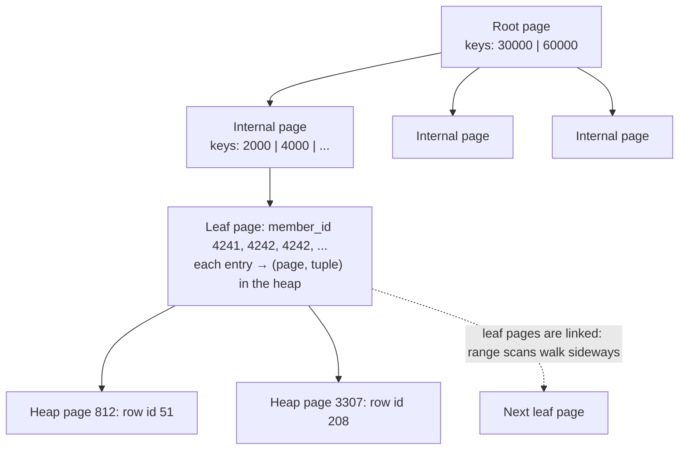

# Indexes (B-tree, Hash, GIN, Partial, Covering) & EXPLAIN ANALYZE

!!! abstract "TL;DR"
    - An index is a separate sorted structure (usually a **B-tree**) that lets PostgreSQL find rows without reading the whole table. Measured on 1 M rows: `WHERE member_id = 4242` went from a **129 ms sequential scan** to **0.15 ms** with a B-tree index.
    - The planner uses an index only when it's cheaper: for **selective** predicates. For `status = 'PAID'` (90 % of rows) it ignored the index and scanned the table; for `status = 'PENDING'` (1 %) it used it.
    - **Composite index order matters:** `(member_id, service_date)` serves `WHERE member_id = ?` and `WHERE member_id = ? ORDER BY service_date`, but not efficiently `WHERE service_date = ?` alone (leading-column rule; PostgreSQL 18 adds skip scan for some cases).
    - Special indexes: **covering** (`INCLUDE`) for index-only scans, **partial** (`WHERE status = 'PENDING'`) for hot subsets (88 kB vs 9 MB), **expression** (`lower(email)`) when queries apply functions, **GIN** for arrays/JSONB/full-text, **BRIN** for huge naturally ordered tables (24 kB vs 43 MB), **GiST** for ranges/geometry, **hash** for equality only.
    - Read plans with **`EXPLAIN (ANALYZE, BUFFERS)`**: node types (Seq/Index/Index Only/Bitmap scans, Nested Loop/Hash/Merge joins), **estimated vs actual rows** (big gaps mean bad statistics), buffers read vs hit, and where the time goes. Every index slows writes and uses space: index for real query patterns, and drop unused ones.

## Why it matters

Most "the database is slow" incidents are a missing, wrong or unused index, or a query written so the index can't be used. Interviewers ask about indexes to check whether you can reason about **access paths**: why a query scanned a million rows, which index would help, what it costs on writes, and how to prove it with `EXPLAIN ANALYZE` rather than guess.

All plans below come from a PostgreSQL 16 table `claim` with **1,000,000 rows** (166 MB): `member_id` (100,000 distinct values, ~10 rows each), `status` (90 % PAID, 9 % DENIED, 1 % PENDING), `service_date`, a `text[]` of diagnosis codes, a `jsonb` payload and an email. Parallel query was disabled to keep plans simple.

## Core concepts

### How a B-tree index finds rows


*Notice that the index stores keys in sorted order plus pointers (TIDs) to rows in the table (the heap). A lookup is a few page reads down the tree, then one heap read per matching row, which is why low-selectivity predicates make index access more expensive than a sequential scan.*

- Depth is small (3–4 levels for millions of rows), so a lookup costs a handful of page reads.
- Sorted keys support `=`, `<`, `>`, `BETWEEN`, `IN`, `IS NULL`, prefix `LIKE 'abc%'` (with the right collation or `text_pattern_ops`) and **`ORDER BY` without a sort**.
- The index entry points to a heap tuple; PostgreSQL usually still visits the heap to check visibility (MVCC) and fetch other columns, except in index-only scans.

### Scan types you'll see in plans

| Plan node | What it does | When the planner picks it |
|---|---|---|
| **Seq Scan** | Reads every page of the table | No usable index, or many rows match |
| **Index Scan** | Walks the index, fetches each matching heap row in index order | Few rows, or ordered output needed (`ORDER BY … LIMIT`) |
| **Bitmap Index Scan + Bitmap Heap Scan** | Collects matching TIDs into a bitmap, then reads heap pages in physical order | Medium number of rows; can combine several indexes (BitmapAnd/Or) |
| **Index Only Scan** | Answers from the index alone (plus visibility map) | All needed columns are in the index and pages are all-visible |

### Measured: when indexes help and when they don't

| Query (1 M rows) | Plan | Time |
|---|---|---|
| `member_id = 4242`, no index | Seq Scan, 999,990 rows removed by filter, 21,266 buffers | 129 ms |
| `member_id = 4242`, B-tree on `member_id` | Bitmap Index Scan + Bitmap Heap Scan, 13 buffers | **0.15 ms** |
| `status = 'PAID'` (900,000 rows), index on `status` | **Seq Scan** (index ignored: cheaper to read everything) | 156 ms |
| `status = 'PENDING'` (10,000 rows), same index | Index Scan | 40 ms |
| `member_id = 4242 ORDER BY service_date DESC LIMIT 5`, index `(member_id, service_date DESC)` | Index Scan, no sort, stops after 5 rows | **0.08 ms** |
| `service_date = '2024-03-01'` with only that composite index | Bitmap scan of the **whole** composite index | 37 ms |
| `amount, status WHERE member_id = 4242`, covering index `(member_id) INCLUDE (amount, status)` | **Index Only Scan, Heap Fetches: 0** | 0.06 ms |
| `lower(email) = '…'`, plain index on `email` | Seq Scan (function hides the column) | 531 ms |
| Same, with expression index on `lower(email)` | Index Scan | **0.14 ms** |
| `status = 'PENDING' AND service_date > …`, partial index `(service_date) WHERE status = 'PENDING'` | Bitmap scan of an 88 kB index | 3 ms |
| `member_id::text = '4242'` | Seq Scan (cast on the column) | — |

### Selectivity and the planner

The planner estimates how many rows each condition matches using **statistics** (`pg_stats`: most common values, histograms, distinct counts, correlation) gathered by `ANALYZE` / autovacuum, and picks the plan with the lowest estimated cost.

- **High selectivity** (few rows) → index. **Low selectivity** (large fraction of the table) → sequential scan, because random heap reads for most of the table cost more than reading it sequentially.
- Indexing a low-cardinality column (`status`, `gender`, boolean flags) alone rarely helps, unless queries target the **rare** values, in which case a **partial index** on those values is smaller and better.
- **Stale or poor statistics** produce bad plans: estimates of 10 rows when 500,000 come back lead to nested loops over huge inputs. Fix with `ANALYZE`, a higher statistics target for skewed columns, or **extended statistics** (`CREATE STATISTICS … (dependencies)`) for correlated columns like `city` and `zip`.

### Composite indexes and column order

An index on `(a, b, c)` is sorted by `a`, then `b` within `a`, then `c`.

- Efficient for: `a = ?`; `a = ? AND b = ?`; `a = ? AND b > ?`; `a = ? ORDER BY b`; `a = ? AND b = ? AND c = ?`.
- Not efficient for: `b = ?` or `c = ?` alone (the leading column isn't constrained, so PostgreSQL 16 must scan the whole index, as measured: 37 ms vs 0.08 ms). PostgreSQL 18 adds **skip scan**, which helps when the leading column has few distinct values.
- **Rule of thumb:** equality columns first, then the range or sort column. Put the column you `ORDER BY` last in the matching direction to avoid a sort, which makes `ORDER BY … LIMIT` queries stop after N rows.
- One composite index often replaces several single-column ones; don't create `(a)` if you have `(a, b)`.

### Covering indexes and index-only scans

```sql
CREATE INDEX claim_member_cov_idx ON claim (member_id) INCLUDE (amount, status);
```

- `INCLUDE` columns are stored in leaf pages but aren't part of the key (not sorted, can't be searched), so queries selecting only `member_id`, `amount`, `status` can be answered from the index.
- Index-only scans also need the **visibility map** to say the page is all-visible; otherwise PostgreSQL checks the heap (`Heap Fetches` in the plan). Frequent updates and lagging vacuum reduce the benefit.
- Trade-off: bigger index (31 MB vs 9 MB here) and more write cost.

### Expression and partial indexes

- **Expression index:** queries that wrap a column in a function (`lower(email)`, `date(created_at)`, `(payload->>'pharmacy')`) can't use a plain index on that column. Index the exact expression the query uses.
- **Partial index:** `CREATE INDEX … WHERE status = 'PENDING'` indexes only matching rows. Tiny (88 kB vs 9 MB for a full single-column index), cheap to maintain, and perfect for queue-like queries ("pending items", "unprocessed outbox rows", "soft-deleted = false"). The query's WHERE must imply the index predicate.
- Partial **unique** indexes enforce conditional uniqueness: `CREATE UNIQUE INDEX ON member (email) WHERE deleted_at IS NULL`.

### Other index types

| Type | Good for | Example | Notes |
|---|---|---|---|
| **B-tree** (default) | Equality, ranges, sorting, prefix LIKE | `(member_id, service_date)` | Use for almost everything |
| **Hash** | Equality only | `USING hash (session_token)` | WAL-logged since PG 10; rarely better than B-tree |
| **GIN** | "Contains" queries on composite values: arrays, JSONB, full-text, trigrams | `USING gin (payload jsonb_path_ops)`, `USING gin (diagnosis_codes)` | Measured: JSONB containment over 1 M rows in 6 ms; slower to update (fastupdate pending list) |
| **GiST** | Ranges, geometric/nearest-neighbour, exclusion constraints | `EXCLUDE USING gist (room WITH =, during WITH &&)` | Prevent overlapping bookings |
| **SP-GiST** | Partitioned search spaces (IP ranges, quadtrees) | `inet` columns | Niche |
| **BRIN** | Huge tables where values follow physical order (append-only time series) | `USING brin (created_at)` | Measured: 24 kB vs 43 MB B-tree, range query 2.6 ms; useless when correlation is low (`service_date` here had correlation 0.003) |
| `pg_trgm` + GIN/GiST | `LIKE '%term%'`, fuzzy search | `USING gin (name gin_trgm_ops)` | Extension; for real search use Elasticsearch/OpenSearch |

### The cost of indexes

- Every `INSERT` updates every index on the table; `UPDATE`s that change an indexed column (or can't use a HOT update) update indexes too. Write-heavy tables with 10 indexes pay for it in latency, WAL volume and replication lag.
- Indexes use disk and **memory** (cache). Unused indexes are pure cost.
- Find unused indexes: `pg_stat_user_indexes.idx_scan = 0` over a representative period (check replicas too). Find missing ones: `pg_stat_statements` for slow/frequent queries plus `EXPLAIN`.
- Create indexes on live tables with `CREATE INDEX CONCURRENTLY` (see [Schema migration](../jpa-hibernate/06-schema-migration-with-liquibase-flyway.md)).
- **Foreign keys aren't indexed automatically** in PostgreSQL: index the referencing column (`claim.member_id`) or deletes on the parent scan the child table and joins suffer.

### Reading EXPLAIN ANALYZE

```text
Bitmap Heap Scan on claim (actual rows=10 loops=1)
  Recheck Cond: (member_id = 4242)
  Heap Blocks: exact=10
  Buffers: shared hit=4 read=9          <- pages from cache (hit) vs disk/OS (read)
  ->  Bitmap Index Scan on claim_member_idx (actual rows=10 loops=1)
        Index Cond: (member_id = 4242)  <- condition evaluated using the index
Planning Time: 0.196 ms
Execution Time: 0.153 ms
```

| Look for | Meaning |
|---|---|
| `EXPLAIN` vs `EXPLAIN ANALYZE` | Estimated plan vs actually executing it (careful with INSERT/UPDATE/DELETE: wrap in a transaction and roll back) |
| `cost=startup..total` | Planner's estimate in arbitrary units |
| `rows=` estimated vs `actual rows=` | Large mismatches (10× or more) point to stale or missing statistics, correlated columns, or functions the planner can't estimate |
| `loops=` | Node executed N times (inner side of a nested loop): multiply actual rows/time by loops |
| `Rows Removed by Filter` | Rows read and thrown away: a candidate for an index or better predicate |
| `Index Cond` vs `Filter` | Conditions using the index vs applied after fetching |
| `Heap Fetches` | Index-only scan had to visit the heap (visibility map not set) |
| `Buffers: shared hit/read` | Cache hits vs reads; high reads mean I/O-bound |
| Sort `Method: external merge Disk` | Sort spilled to disk: raise `work_mem` for that query or add an index providing the order |
| Join type | Nested Loop (small outer side, indexed inner), Hash Join (large unsorted inputs), Merge Join (both sorted) |

Use `EXPLAIN (ANALYZE, BUFFERS, FORMAT TEXT)` locally, and `auto_explain` plus `pg_stat_statements` in production to catch slow plans as they happen.

## In practice: code & configuration

=== "❌ Common mistake"
    ```sql
    -- One index per column "just in case": slows every write, most never used
    CREATE INDEX ON claim (status);
    CREATE INDEX ON claim (member_id);
    CREATE INDEX ON claim (service_date);
    CREATE INDEX ON claim (member_id, service_date);   -- makes the (member_id) index redundant

    -- Query hides the indexed column behind a function / cast
    SELECT * FROM claim WHERE lower(email) = :email;          -- plain index on email unused
    SELECT * FROM claim WHERE date(service_date) = :d;        -- unnecessary function
    SELECT * FROM claim WHERE member_id::text = :memberId;    -- cast on the column: Seq Scan
    ```

=== "✅ Correct approach"
    ```sql
    -- Index the access patterns the application actually uses
    CREATE INDEX CONCURRENTLY claim_member_date_idx
        ON claim (member_id, service_date DESC);                -- "member's latest claims" + member lookups

    CREATE INDEX CONCURRENTLY claim_pending_idx
        ON claim (service_date) WHERE status = 'PENDING';       -- work queue: tiny partial index

    CREATE INDEX CONCURRENTLY claim_email_lower_idx
        ON claim (lower(email));                                -- matches the query expression

    CREATE INDEX CONCURRENTLY claim_payload_gin
        ON claim USING gin (payload jsonb_path_ops);            -- payload @> '{"pharmacy":"PH7"}'

    -- Keep the column bare in predicates; convert the parameter instead
    SELECT id, amount FROM claim WHERE member_id = CAST(:memberId AS int);

    -- Verify with the real plan
    EXPLAIN (ANALYZE, BUFFERS)
    SELECT id FROM claim WHERE member_id = 4242 ORDER BY service_date DESC LIMIT 5;
    ```

```sql
-- Unused indexes (since stats reset): candidates to drop after checking replicas
SELECT schemaname, relname, indexrelname, idx_scan, pg_size_pretty(pg_relation_size(indexrelid)) AS size
FROM pg_stat_user_indexes
WHERE idx_scan = 0
ORDER BY pg_relation_size(indexrelid) DESC;
```

In JPA, declare important indexes in migrations (Flyway/Liquibase), not only in `@Table(indexes = …)`, which Hibernate applies only when it generates the schema.

## Real-world usage

- **Composite indexes on `(tenant_id, …)`** are standard in multi-tenant SaaS: every query filters by tenant first.
- **Partial indexes** power job queues and outbox tables (`WHERE processed_at IS NULL`), keeping the index tiny even when the table holds millions of processed rows.
- **GIN on JSONB** lets teams store flexible attributes (FHIR-like resources, feature flags, payloads) while still querying them efficiently.
- **BRIN** is popular for append-only audit and event tables (billions of rows, timestamps follow insert order), often combined with time partitioning.
- **Incident pattern:** an ORM sent `WHERE CAST(member_id AS varchar) = ?` because the entity mapped the id as a String; every lookup became a sequential scan. Fixing the type mapping restored index use.

## Trade-offs & production gotchas

| Option | Pros | Cons | Use when |
|---|---|---|---|
| Single-column B-tree | Simple | Often superseded by a composite | One-column lookups |
| Composite B-tree | Serves filters + order + LIMIT | Order-sensitive | Main query patterns |
| Covering (`INCLUDE`) | Index-only scans | Larger, more write cost | Hot read queries with few columns |
| Partial | Tiny, fast, cheap to maintain | Only for queries matching the predicate | Rare values, queues, soft deletes |
| Expression | Indexes function results | Must match the expression exactly | Case-insensitive lookups, JSON fields |
| GIN | Arrays, JSONB, full-text | Slower writes, larger | Containment and search queries |
| BRIN | Tiny for huge ordered tables | Useless without physical correlation; lossy | Append-only time series |
| No index | Fastest writes | Scans | Small tables, write-heavy logs |

!!! warning "Gotcha: an index exists, so the query must use it"
    The planner may correctly prefer a sequential scan (low selectivity), or be unable to use the index (function or cast on the column, leading column missing, type mismatch, `LIKE '%x'`, OR across different columns without a bitmap). Always check the plan.

!!! warning "Gotcha: EXPLAIN ANALYZE executes the statement"
    `EXPLAIN ANALYZE DELETE …` really deletes. Wrap data-changing statements in `BEGIN; … ROLLBACK;`.

!!! warning "Gotcha: unindexed foreign keys"
    PostgreSQL indexes primary keys and unique constraints, not foreign key columns. A `DELETE FROM member` then scans `claim` for references, and joins on `claim.member_id` can't use an index.

## How this connects to my experience

- **Where I used it:** not ★. PostgreSQL/MySQL on RDS (Deloitte) and relational services elsewhere; the same reasoning applies to MongoDB indexes at OptumRx (compound index order, covered queries, `explain()`), covered on the [MongoDB indexing page](../mongodb/03-indexing-and-explain-plans.md). *[confirm a concrete query you tuned]*
- **Talking points:**
    - "I design indexes from the query patterns: equality columns first, then range or sort columns, and I check plans with `EXPLAIN (ANALYZE, BUFFERS)` before and after."
    - "Partial indexes for queue-like tables and expression indexes for case-insensitive lookups are my go-to tools; I avoid indexing every column because of write cost."
    - "In production I use `pg_stat_statements` to find the expensive queries and `pg_stat_user_indexes` to find unused indexes."
- **Likely follow-up chain:** "How does a B-tree index work?" → "Why didn't the query use my index?" (selectivity, functions, leading column) → "Composite index order?" → "Read this plan" (estimates vs actuals, buffers) → "What do indexes cost?"

## Interview questions

### Fundamentals

??? question "Q1. What is an index and why does it speed up queries?"
    **Answer:** A separate data structure, usually a B-tree, holding column values in sorted order with pointers to table rows. The database can find matching rows with a few page reads instead of scanning the whole table: on 1 M rows, a lookup by `member_id` went from 129 ms (sequential scan) to 0.15 ms.

    **Interviewer listens for:** sorted structure, pointers to rows, scan vs lookup.

    **Common wrong answer:** "It caches the table in memory."

??? question "Q2. Why might PostgreSQL not use an index that exists?"
    **Answer:** The predicate isn't selective (the planner estimates a sequential scan is cheaper, as with `status = 'PAID'` matching 90 % of rows); the query wraps the column in a function or cast; the index's leading column isn't constrained; types don't match; `LIKE '%term'`; or statistics are stale so estimates are wrong.

    **Interviewer listens for:** selectivity, functions/casts, leading column, statistics.

    **Common wrong answer:** "Indexes are always used when they exist."

??? question "Q3. What's the difference between EXPLAIN and EXPLAIN ANALYZE?"
    **Answer:** `EXPLAIN` shows the planner's chosen plan with estimated costs and row counts without running the query. `EXPLAIN ANALYZE` executes it and adds actual row counts, loops and timings (and `BUFFERS` shows cache hits and reads). Because it executes, data-changing statements must be wrapped in a rolled-back transaction.

    **Interviewer listens for:** estimate vs actual, execution side effects, BUFFERS.

    **Common wrong answer:** "ANALYZE updates statistics." That's the separate `ANALYZE` command.

??? question "Q4. Does PostgreSQL index foreign keys automatically?"
    **Answer:** No. It indexes primary keys and unique constraints only. Index referencing columns yourself, otherwise joins on them and deletes/updates on the parent (which must check for referencing rows) scan the child table.

    **Interviewer listens for:** no automatic FK index, impact on deletes and joins.

    **Common wrong answer:** "Yes, like MySQL InnoDB." InnoDB does; PostgreSQL doesn't.

### Intermediate

??? question "Q5. How do you choose the column order in a composite index?"
    **Answer:** Put columns used with equality first, then the range or sort column. `(member_id, service_date DESC)` serves `WHERE member_id = ? ORDER BY service_date DESC LIMIT 5` with no sort and stops after five rows (0.08 ms measured), but doesn't efficiently serve `WHERE service_date = ?` alone, because the leading column isn't constrained.

    **Interviewer listens for:** equality then range/sort, leading-column rule, ORDER BY + LIMIT benefit.

    **Common wrong answer:** "Order doesn't matter; the database figures it out."

??? question "Q6. What is an index-only scan and what does it require?"
    **Answer:** A scan that answers the query from the index without visiting table rows. All selected and filtered columns must be in the index (key or `INCLUDE` columns), and the visibility map must mark the pages all-visible (kept up to date by VACUUM); otherwise PostgreSQL fetches heap rows (`Heap Fetches` in the plan).

    **Interviewer listens for:** covering columns, visibility map, vacuum.

    **Common wrong answer:** "Any index scan is index-only."

??? question "Q7. When would you use a partial index?"
    **Answer:** When queries target a small, well-defined subset: pending jobs, unprocessed outbox rows, active (not soft-deleted) records, rare statuses. The index contains only those rows, so it's tiny (88 kB vs 9 MB measured) and cheap to maintain. Also for conditional uniqueness, such as unique email among non-deleted users.

    **Interviewer listens for:** small subset, size and maintenance benefit, conditional uniqueness.

    **Common wrong answer:** "Partial indexes are for partitioned tables."

??? question "Q8. What are GIN and BRIN indexes for?"
    **Answer:** GIN indexes the elements inside composite values, so it supports containment queries on arrays, JSONB (`@>`), full-text and trigram search; it is slower to update. BRIN stores min/max summaries per block range, making it tiny for huge tables whose values follow physical order (24 kB vs 43 MB B-tree for an append-only timestamp), but useless when values aren't correlated with storage order.

    **Interviewer listens for:** containment for GIN, block-range summaries and correlation for BRIN.

    **Common wrong answer:** "GIN is a faster B-tree."

### Senior

??? question "Q9. Estimated rows say 12, actual rows say 480,000. What does that tell you and what do you do?"
    **Answer:** The planner's statistics don't match reality, so it likely chose the wrong plan (for example a nested loop over a huge input). Run `ANALYZE` (check autovacuum is keeping up), raise the statistics target for skewed columns, add extended statistics for correlated predicates, avoid expressions the planner can't estimate, and re-check the plan.

    **Interviewer listens for:** statistics, ANALYZE, extended statistics, plan consequence.

    **Common wrong answer:** "Add more indexes."

??? question "Q10. What does an index cost, and how do you manage index sprawl?"
    **Answer:** Every insert updates all indexes; updates touching indexed columns do too (and prevent HOT updates); indexes add WAL, replication lag, disk and cache pressure. Manage it by indexing real query patterns, preferring composite indexes over many single-column ones, removing redundant prefixes, and dropping indexes with `idx_scan = 0` over a representative period (checking replicas).

    **Interviewer listens for:** write amplification, HOT, monitoring usage, consolidation.

    **Common wrong answer:** "Indexes only cost disk space."

??? question "Q11. How do you make case-insensitive email lookups fast?"
    **Answer:** Either an expression index on `lower(email)` and queries using `lower(email) = lower(:email)` (measured 531 ms → 0.14 ms), or the `citext` type with a normal index, or a nondeterministic case-insensitive collation (PostgreSQL 12+). Store normalised emails and enforce uniqueness on the same expression.

    **Interviewer listens for:** expression index matching the query, citext/collation alternatives, unique constraint.

    **Common wrong answer:** "Use ILIKE." It doesn't use a B-tree index.

### Scenario-based

??? question "Q12. A member's claim history page takes 2 seconds. How do you investigate?"
    **Answer:** Get the actual SQL (logs or `pg_stat_statements`), run `EXPLAIN (ANALYZE, BUFFERS)` with real parameters, and look for sequential scans with many rows removed by filter, sorts on large inputs, and estimate/actual mismatches. Typical fix: a composite index `(member_id, service_date DESC)` so the query seeks the member's rows in order and stops at the page limit; then verify the new plan and measure.

    **Interviewer listens for:** measure first, read the plan, targeted composite index, verify.

    **Common wrong answer:** "Add an index on every column used in the query."

??? question "Q13. After adding three indexes, insert throughput on the claims table dropped 40 %. What do you do?"
    **Answer:** Each insert now maintains more indexes, adding I/O and WAL. Check which of the new indexes are actually used (`pg_stat_user_indexes`), consolidate overlapping ones into one composite or partial index, consider covering only hot queries, and test write throughput as part of index changes. If writes dominate, move heavy read patterns to a replica or a separate read model.

    **Interviewer listens for:** write amplification, usage data, consolidation, read model option.

    **Common wrong answer:** "Increase the server size."

??? question "Q14. A query filters on `payload->>'pharmacy' = 'PH7'` over 50 million rows and is slow. Options?"
    **Answer:** An expression B-tree index on `(payload->>'pharmacy')` matching the query exactly, or a GIN index with `jsonb_path_ops` and rewriting the predicate as `payload @> '{"pharmacy":"PH7"}'`. If the field is queried constantly, promote it to a real column (possibly generated: `GENERATED ALWAYS AS (payload->>'pharmacy') STORED`) with a normal index and proper statistics.

    **Interviewer listens for:** expression index vs GIN containment, promoting hot JSON fields to columns.

    **Common wrong answer:** "JSONB can't be indexed."

## Cheat sheet

| Concept | Remember |
|---|---|
| B-tree | Default; `=`, ranges, ORDER BY, prefix LIKE |
| Selectivity | Few rows → index; many rows → Seq Scan is cheaper (PAID 90 % ignored the index) |
| Composite | Equality columns first, then range/sort; leading column rule |
| Covering | `INCLUDE (…)` → Index Only Scan if pages are all-visible |
| Partial | `WHERE status = 'PENDING'`: tiny index for hot subsets |
| Expression | Index exactly the function the query uses (`lower(email)`) |
| GIN / BRIN / GiST / hash | Containment & JSONB / huge ordered tables / ranges & exclusion / equality only |
| Defeats indexes | Functions or casts on the column, missing leading column, `%term`, type mismatch |
| EXPLAIN | `(ANALYZE, BUFFERS)`; estimated vs actual rows; Rows Removed by Filter; loops |
| Costs | Slower writes, WAL, space; drop `idx_scan = 0` indexes |
| FKs | Not indexed automatically in PostgreSQL |
| Measured | 129 ms → 0.15 ms (B-tree); 531 ms → 0.14 ms (expression); BRIN 24 kB vs B-tree 43 MB |

## Sources
1. [PostgreSQL 16: Indexes (types, multicolumn, partial, expression, index-only scans)](https://www.postgresql.org/docs/16/indexes.html).
2. [PostgreSQL 16: Using EXPLAIN](https://www.postgresql.org/docs/16/using-explain.html) and [EXPLAIN command](https://www.postgresql.org/docs/16/sql-explain.html).
3. [PostgreSQL 16: Planner statistics and extended statistics](https://www.postgresql.org/docs/16/planner-stats.html).
4. [PostgreSQL 16: GIN](https://www.postgresql.org/docs/16/gin.html), [BRIN](https://www.postgresql.org/docs/16/brin.html) and [JSONB indexing](https://www.postgresql.org/docs/16/datatype-json.html#JSON-INDEXING).
5. [PostgreSQL 18 release notes: B-tree skip scan](https://www.postgresql.org/docs/18/release-18.html).
6. Markus Winand, [Use The Index, Luke!](https://use-the-index-luke.com/): concatenated indexes, functions, index-only scans.
7. [pg_stat_statements](https://www.postgresql.org/docs/16/pgstatstatements.html) and [auto_explain](https://www.postgresql.org/docs/16/auto-explain.html).
8. All plans and sizes on this page: PostgreSQL 16.14, 1,000,000-row and 2,000,000-row test tables, run while writing this page.
