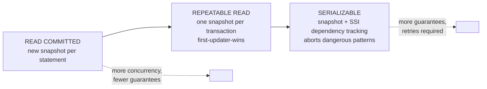

# Transactions, ACID & Isolation Levels

!!! abstract "Key takeaways"
    - A transaction groups statements into one unit: **Atomic** (all or nothing), **Consistent** (constraints hold), **Isolated** (concurrent transactions don't see each other's partial work, to a configurable degree), **Durable** (committed data survives a crash, via the write-ahead log).
    - Isolation is a **trade-off between correctness and concurrency**. The SQL standard defines anomalies; each level allows some. PostgreSQL's levels: **READ COMMITTED** (default), **REPEATABLE READ** (snapshot isolation), **SERIALIZABLE** (serializable snapshot isolation, SSI). READ UNCOMMITTED behaves like READ COMMITTED (no dirty reads ever).
    - Reproduced on PostgreSQL 16: under READ COMMITTED a second read in the same transaction saw another transaction's commit (**non-repeatable read**) and a new row (**phantom**); under REPEATABLE READ neither happened.
    - **Lost updates** (read-modify-write) commit silently under READ COMMITTED; under REPEATABLE READ the second writer fails with *"could not serialize access due to concurrent update"*. **Write skew** (two doctors both going off call) slips through REPEATABLE READ; only **SERIALIZABLE** catches it (SQLSTATE `40001`).
    - Higher isolation means **transactions can fail and must be retried**. Keep transactions short, never hold one open across network calls or user think-time, and retry `40001`/`40P01` with backoff.

## Why it matters

Transactions are the main tool for correctness under concurrency, and isolation levels are widely misunderstood. Many developers believe that wrapping code in `@Transactional` makes it safe against concurrent requests; at the default READ COMMITTED level it doesn't stop lost updates or write skew. Interviewers ask about isolation to see whether you can name the anomalies, know what your database actually guarantees (PostgreSQL differs from the SQL standard and from MySQL), and handle the failures stronger levels introduce.

## Core concepts

### ACID and how PostgreSQL provides it

| Property | Meaning | PostgreSQL mechanism |
|---|---|---|
| **Atomicity** | All statements commit or none do | Transaction status in the commit log; aborted rows simply never become visible |
| **Consistency** | Constraints and invariants hold after commit | PK, FK, UNIQUE, CHECK, NOT NULL, exclusion constraints, deferrable constraints, triggers |
| **Isolation** | Concurrent transactions don't interfere beyond the chosen level | **MVCC** snapshots (readers don't block writers), row locks, SSI predicate tracking |
| **Durability** | Committed data survives crashes | **Write-ahead log (WAL)** flushed at commit (`synchronous_commit = on`), replicas, checkpoints |

`synchronous_commit = off` trades durability of the last few hundred milliseconds of commits for speed; acceptable for some logging workloads, not for claims or payments.

### The anomalies

| Anomaly | What happens | Example |
|---|---|---|
| **Dirty read** | Read another transaction's uncommitted changes | See a claim amount that is later rolled back |
| **Non-repeatable read** | Same row read twice in one transaction gives different values | Balance 100, then 50 after another commit |
| **Phantom read** | Same query returns a different *set* of rows | Count of claims goes from 2 to 3 |
| **Lost update** | Two read-modify-write cycles; one overwrites the other | Two debits, only one applied |
| **Write skew** | Two transactions read overlapping data, each writes a different row based on what it read; together they break an invariant | Both on-call doctors go off call |
| **Read skew** | Reading related rows at different points in time gives an inconsistent view | Sum of two accounts mid-transfer |

### What each level prevents (PostgreSQL)

| Level | Dirty read | Non-repeatable read | Phantom | Lost update | Write skew |
|---|---|---|---|---|---|
| READ UNCOMMITTED (= READ COMMITTED in PG) | Prevented | Possible | Possible | Possible | Possible |
| **READ COMMITTED** (default) | Prevented | Possible | Possible | Possible | Possible |
| **REPEATABLE READ** (snapshot isolation) | Prevented | Prevented | **Prevented** (PG is stricter than the standard) | Prevented (second writer errors) | **Possible** |
| **SERIALIZABLE** (SSI) | Prevented | Prevented | Prevented | Prevented | Prevented (one transaction aborted) |


*Notice what changes between levels: READ COMMITTED takes a fresh snapshot for every statement, REPEATABLE READ keeps one snapshot for the whole transaction and refuses to overwrite rows changed since, and SERIALIZABLE also tracks read/write dependencies between transactions and aborts one when they could form a non-serialisable cycle.*

### Reproduced on PostgreSQL 16 (two concurrent sessions A and B)

| Scenario | READ COMMITTED | REPEATABLE READ | SERIALIZABLE |
|---|---|---|---|
| A reads balance; B updates it to 50 and commits; A reads again | 100 → **50** (non-repeatable read) | 100 → **100** | 100 → 100 |
| A counts member 1's claims; B inserts one and commits; A counts again | 2 → **3** (phantom) | 2 → **2** | 2 → 2 |
| A and B both read 100 and write `read - 10`; A commits first | B commits, final **90** (lost update) | B fails: *could not serialize access due to concurrent update*; final 90, B must retry | B fails (same) |
| Same, but each runs `UPDATE … SET balance = balance - 10` | Final **80**: B waits for A's row lock, then re-reads the row; correct | — | — |
| Two doctors on call; each checks "≥ 2 on call" and takes themselves off | — | Both commit: **0** on call (write skew) | B fails with `40001`; **1** still on call |

The atomic-update row is the important practical lesson: at READ COMMITTED, an `UPDATE` that blocks on a locked row re-evaluates its `WHERE` and uses the **latest committed** row version, so single-statement updates like `balance = balance - 10` are safe. The lost update only happens when the application reads, computes in Java, and writes back.

{ loading=lazy }
*Watch session B's write: it's computed from a value that changed after B read it. READ COMMITTED lets it overwrite A's debit, while REPEATABLE READ rejects it and forces a retry.*

### How READ COMMITTED updates behave

When an `UPDATE` or `DELETE` under READ COMMITTED finds a row that a concurrent transaction is modifying, it waits for that transaction. If it commits, PostgreSQL re-checks the `WHERE` clause against the **new** row version and applies the update to it (the "EvalPlanQual" recheck). That's why conditional updates such as `UPDATE refill SET status = 'APPROVED' WHERE id = ? AND status = 'REQUESTED'` work correctly at the default level: the second approver re-checks, finds `status = 'APPROVED'`, and updates 0 rows.

### REPEATABLE READ = snapshot isolation

- The transaction sees a snapshot taken at its **first statement**; other commits stay invisible until it ends. Long reports get a consistent view.
- **First-updater-wins:** if it tries to update or delete a row changed by a transaction that committed after the snapshot, it gets SQLSTATE `40001` *could not serialize access due to concurrent update*, and must be retried.
- **Write skew is still possible**, because the two transactions update *different* rows. Fix by locking the rows you read (`SELECT … FOR UPDATE`), materialising the conflict (a row both must update), using a constraint, or SERIALIZABLE.
- Note the naming confusion: **MySQL InnoDB's default is REPEATABLE READ**, with different semantics (gap/next-key locking, and its plain SELECTs don't error on concurrent updates). Don't assume portability.

{ loading=lazy }
*Notice that the two sessions never touch the same row, so first-updater-wins has nothing to catch. Only SERIALIZABLE (or locking the rows that were read) sees that the combined result breaks the rule.*

### SERIALIZABLE = serializable snapshot isolation (SSI)

- Since PostgreSQL 9.1, SERIALIZABLE runs on snapshots but tracks **read-write dependencies** (using predicate "SIRead" locks, which never block). If committing would create a dangerous cycle, one transaction is aborted with `40001` *could not serialize access due to read/write dependencies among transactions*.
- Guarantee: the outcome equals *some* serial order of the committed transactions. No anomaly checks needed in application code.
- Costs: memory for dependency tracking, false positives (aborts that a perfect algorithm wouldn't need, more likely with sequential scans), and **mandatory retries**. Works best with short transactions; declare read-only ones `READ ONLY` (and `DEFERRABLE` for long reports, which then can't fail).

### Retrying

| SQLSTATE | Meaning | Action |
|---|---|---|
| `40001` serialization_failure | REPEATABLE READ/SERIALIZABLE conflict | Retry the **whole** transaction from the start |
| `40P01` deadlock_detected | Lock cycle, PostgreSQL aborted one side | Retry, and fix lock ordering |
| `55P03` lock_not_available | `NOWAIT` / `lock_timeout` hit | Retry later or fail fast |
| `57014` query_canceled | `statement_timeout` hit | Investigate the query |

The retry must re-run the reads, because the decision depended on data that changed. Spring maps these to `CannotAcquireLockException`/`PessimisticLockingFailureException` subclasses (and `ConcurrencyFailureException` as a common parent), which retry libraries can match.

### Transaction hygiene

- **Short transactions.** Locks and snapshots are held until the end. A long transaction blocks DDL, holds row locks, and stops VACUUM from removing dead rows anywhere in the database (table bloat).
- **No network calls inside transactions** (HTTP, Kafka sends waiting for acks). Use the transactional outbox instead.
- **Timeouts:** `statement_timeout`, `lock_timeout`, `idle_in_transaction_session_timeout` (kills sessions left "idle in transaction" by bugs), and Spring's `@Transactional(timeout = …)`.
- **Savepoints** (`SAVEPOINT s; … ROLLBACK TO s`) allow partial rollback inside a transaction; Spring's `NESTED` propagation uses them.
- **Read-only transactions** (`SET TRANSACTION READ ONLY`) reject writes and let SSI skip some tracking; Spring's `readOnly = true` sets it on the connection.

## In practice: code & configuration

=== "❌ Common mistake"
    ```java
    @Transactional                                    // READ COMMITTED by default
    public void goOffCall(String doctor) {
        long onCall = repo.countByOnCallTrue();       // both doctors see 2
        if (onCall >= 2) {
            repo.setOnCall(doctor, false);            // both commit -> nobody on call (write skew)
        }
    }

    @Transactional(isolation = Isolation.SERIALIZABLE)
    public void transfer(...) {
        ...                                           // no retry: users see random 40001 errors
        paymentGateway.call();                        // network call inside the transaction
    }
    ```

=== "✅ Correct approach"
    ```java
    // Option 1: SERIALIZABLE + retry the whole transaction on serialization failures
    @Retryable(retryFor = ConcurrencyFailureException.class,          // covers 40001 / 40P01 mappings
               maxAttempts = 5, backoff = @Backoff(delay = 20, multiplier = 2, random = true))
    @Transactional(isolation = Isolation.SERIALIZABLE)
    public void goOffCall(String doctor) {
        long onCall = repo.countByOnCallTrue();
        if (onCall < 2) throw new WouldLeaveNoDoctorOnCall();
        repo.setOnCall(doctor, false);
    }

    // Option 2: stay at READ COMMITTED but lock the rows the decision depends on
    @Transactional
    public void goOffCallLocked(String doctor) {
        List<Doctor> onCall = repo.lockOnCallDoctors();               // SELECT ... FOR UPDATE
        if (onCall.size() < 2) throw new WouldLeaveNoDoctorOnCall();
        repo.setOnCall(doctor, false);
    }

    // Option 3: single atomic statement, safe at READ COMMITTED
    @Modifying
    @Query(value = """
           UPDATE on_call SET on_call = false
           WHERE doctor = :doctor
             AND (SELECT count(*) FROM on_call WHERE on_call) >= 2
           """, nativeQuery = true)
    int goOffCallAtomic(String doctor);   // still a write skew risk under concurrency: prefer 1 or 2
    ```

Option 3 is shown because it looks safe and isn't: each statement still reads a snapshot that doesn't include the other transaction's uncommitted update, so two concurrent executions can both succeed. Verified at READ COMMITTED: two sessions ran it for alice and bob, each updated 1 row, both committed, and **0** doctors were left on call. Atomic statements protect a **single row's** invariant (like a balance); invariants **across rows** need locks, a constraint, or SERIALIZABLE.

The retry proxy must wrap the transactional proxy (each attempt is a new transaction); with Spring Retry put `@Retryable` on a caller bean or order the advisors accordingly.

```properties
# Protect the database from stuck transactions (postgresql.conf or per role)
idle_in_transaction_session_timeout = 60s
statement_timeout = 30s          # per role/service, not globally for batch users
lock_timeout = 5s
```

## Real-world usage

- **Banking and payments** often run critical money movement at SERIALIZABLE (or with explicit row locks plus constraints) and design for retries; reporting uses REPEATABLE READ or read replicas for consistent snapshots.
- **Healthcare scheduling** (on-call rotas, appointment slots, bed allocation) is the textbook write-skew domain; teams use exclusion constraints (`EXCLUDE USING gist` for overlapping bookings), unique constraints, or SERIALIZABLE.
- **CockroachDB** runs SERIALIZABLE by default and requires client retries; **MySQL** defaults to REPEATABLE READ with locking reads; **Oracle and SQL Server** default to READ COMMITTED. Defaults differ, so read the documentation for the database you use.
- **Incident pattern:** a transaction kept open across a call to a slow partner API left sessions "idle in transaction" for minutes; VACUUM couldn't clean up, tables bloated, and lock waits piled up. `idle_in_transaction_session_timeout` and moving the call out of the transaction fixed it.

## Trade-offs & production gotchas

| Option | Pros | Cons | Use when |
|---|---|---|---|
| READ COMMITTED | Max concurrency, no serialization failures | Lost updates and write skew possible in app logic | Default; with atomic updates, locks or versions |
| REPEATABLE READ | Consistent snapshot, lost-update detection | Write skew; must retry 40001 | Reports, multi-step reads, read-modify-write with retry |
| SERIALIZABLE | No anomalies to reason about | Retries required, overhead, false positives | Complex invariants across rows |
| `SELECT … FOR UPDATE` | Precise, works at RC | Blocking, deadlock risk | Invariants over a known set of rows |
| Constraints (UNIQUE, EXCLUDE, CHECK) | Database enforces always | Only for expressible invariants | Whenever an invariant can be a constraint |

!!! warning "Gotcha: @Transactional is not a concurrency control"
    At READ COMMITTED it guarantees atomicity, not isolation from concurrent requests. Read-modify-write and "check then act" logic still needs a version column, a lock, an atomic statement, a constraint or a stronger level.

!!! warning "Gotcha: retries must replay the reads"
    Retrying only the failed `UPDATE` reuses stale decisions. Retry the whole transactional method, in a fresh transaction.

!!! warning "Gotcha: long transactions hurt everyone"
    An open transaction (even idle) holds back VACUUM's cleanup horizon for the whole cluster, keeps locks, and can block migrations. Monitor `pg_stat_activity` for `idle in transaction` and old `xact_start`.

## How this connects to my experience

- **Where I used it:** not ★. Spring `@Transactional` services with relational databases (Deloitte RDS services, Coriolis CCKM, Johnson Controls user management), and MongoDB multi-document transactions at OptumRx, whose snapshot semantics are similar to REPEATABLE READ. *[confirm where non-default isolation or retries were used]*
- **Talking points:**
    - "I don't rely on `@Transactional` alone for concurrent updates: I use atomic conditional updates, `@Version`, row locks, or constraints depending on the invariant."
    - "For invariants across several rows I either lock the rows the decision depends on or use SERIALIZABLE with a retry wrapper."
    - "Transactions stay short and never span HTTP or Kafka calls; we used the outbox pattern for events."
- **Likely follow-up chain:** "What does ACID mean?" → "Isolation levels and anomalies?" → "What's PostgreSQL's default and what does it allow?" (lost update, write skew) → "How do you prevent write skew?" (locks, constraints, SERIALIZABLE + retry) → "How do you retry correctly?"

## Interview questions

### Fundamentals

??? question "Q1. What does ACID stand for?"
    **Answer:** Atomicity (all statements in a transaction commit or none do), Consistency (constraints and invariants hold after each transaction), Isolation (concurrent transactions don't interfere beyond what the isolation level allows), Durability (once committed, data survives crashes; PostgreSQL uses the write-ahead log).

    **Interviewer listens for:** each property with a mechanism, isolation as configurable.

    **Common wrong answer:** "Consistency means replicas agree." That's the CAP meaning, a different concept.

??? question "Q2. Name the read phenomena and which isolation levels prevent them."
    **Answer:** Dirty read (never possible in PostgreSQL), non-repeatable read and phantom (prevented by REPEATABLE READ and SERIALIZABLE in PostgreSQL), lost update (prevented at REPEATABLE READ by the first-updater-wins rule), write skew (only SERIALIZABLE prevents it). READ COMMITTED allows all but dirty reads.

    **Interviewer listens for:** the anomalies, PostgreSQL-specific behaviour, write skew.

    **Common wrong answer:** "SERIALIZABLE is the only level that prevents phantoms." In PostgreSQL, REPEATABLE READ does too.

??? question "Q3. What is PostgreSQL's default isolation level?"
    **Answer:** READ COMMITTED: each statement sees a snapshot of data committed before it started. READ UNCOMMITTED is accepted but behaves the same. MySQL InnoDB defaults to REPEATABLE READ, with different semantics.

    **Interviewer listens for:** READ COMMITTED, per-statement snapshots, difference from MySQL.

    **Common wrong answer:** "REPEATABLE READ, like MySQL."

??? question "Q4. What is a lost update and does READ COMMITTED prevent it?"
    **Answer:** Two transactions read the same value, compute new values and write them; the second overwrites the first. READ COMMITTED doesn't prevent it for read-modify-write in the application (reproduced: two debits, final 90). A single statement `balance = balance - 10` is safe at READ COMMITTED because the second update waits and re-reads the row (final 80).

    **Interviewer listens for:** read-modify-write vs atomic statement, re-check behaviour.

    **Common wrong answer:** "Transactions prevent lost updates."

### Intermediate

??? question "Q5. What does REPEATABLE READ mean in PostgreSQL?"
    **Answer:** Snapshot isolation: one snapshot for the whole transaction, so repeated reads and repeated queries return the same data (no non-repeatable reads or phantoms). Updating a row changed by a transaction that committed after the snapshot fails with `40001` (first-updater-wins). Write skew is still possible.

    **Interviewer listens for:** transaction-wide snapshot, 40001 on concurrent update, write skew remains.

    **Common wrong answer:** "It locks every row you read."

??? question "Q6. What is write skew? Give an example."
    **Answer:** Two transactions read overlapping data, each decides based on it, and each updates a different row, so no row-level conflict occurs, yet together they break an invariant. Example: two on-call doctors each see "2 on call" and take themselves off; both commit and nobody is on call (reproduced under REPEATABLE READ). Prevent with SERIALIZABLE, `SELECT … FOR UPDATE` on the rows read, a materialised conflict row, or a constraint.

    **Interviewer listens for:** different rows, invariant across rows, fixes.

    **Common wrong answer:** "It's the same as a lost update."

??? question "Q7. How does PostgreSQL implement SERIALIZABLE?"
    **Answer:** Serializable Snapshot Isolation (since 9.1): transactions run on snapshots like REPEATABLE READ, and PostgreSQL tracks read/write dependencies with non-blocking predicate locks. When a dependency pattern could make the result non-serialisable, it aborts one transaction with `40001`. Readers don't block writers, but applications must retry.

    **Interviewer listens for:** SSI, dependency tracking, non-blocking, aborts and retries.

    **Common wrong answer:** "It runs transactions one at a time" or "it locks whole tables."

??? question "Q8. How should an application handle serialization failures?"
    **Answer:** Treat `40001` (and deadlocks `40P01`) as retryable: roll back and re-run the whole transaction, including its reads, with a limited number of attempts and jittered backoff. In Spring, put the retry outside the `@Transactional` boundary so each attempt gets a new transaction. Keep transactions short to make conflicts rare.

    **Interviewer listens for:** whole-transaction retry, backoff, Spring proxy ordering.

    **Common wrong answer:** "Show the user an error and ask them to try again."

### Senior

??? question "Q9. Why is an atomic UPDATE safe at READ COMMITTED but read-modify-write isn't?"
    **Answer:** An `UPDATE` that finds a row locked by another transaction waits; when that commits, PostgreSQL re-evaluates the `WHERE` clause and the expression against the newest committed row version, so `balance = balance - 10` applies on top of the other update. Read-modify-write computes the new value in the application from an old read, and the write just overwrites whatever is there.

    **Interviewer listens for:** waiting, re-evaluation on the latest version, application-side staleness.

    **Common wrong answer:** "Single statements run at SERIALIZABLE automatically."

??? question "Q10. Why are long-running transactions harmful in PostgreSQL?"
    **Answer:** They hold locks (blocking writers and DDL), keep their snapshot, and hold back the cluster-wide xmin horizon so VACUUM can't remove dead tuples anywhere, causing bloat and slower queries; under SERIALIZABLE they increase conflicts. Use timeouts (`idle_in_transaction_session_timeout`, `statement_timeout`), keep network calls out of transactions, and monitor `pg_stat_activity`.

    **Interviewer listens for:** locks, VACUUM horizon and bloat, timeouts, monitoring.

    **Common wrong answer:** "They only affect their own session."

??? question "Q11. How do you choose an isolation level for a new service?"
    **Answer:** Start with READ COMMITTED and protect invariants explicitly: atomic conditional updates for single rows, `@Version` for user edits, constraints wherever an invariant can be declared, and `FOR UPDATE` for multi-row decisions. Use REPEATABLE READ for consistent multi-query reads (reports), and SERIALIZABLE for complex cross-row invariants when the team builds in retries. Document the choice per use case.

    **Interviewer listens for:** default + explicit protection, per-use-case reasoning, retries.

    **Common wrong answer:** "Use SERIALIZABLE everywhere to be safe."

### Scenario-based

??? question "Q12. A clinic booking system sometimes double-books a room. Fix it."
    **Answer:** That's a cross-row invariant (no overlapping bookings for a room). Best: let the database enforce it with an exclusion constraint, `EXCLUDE USING gist (room_id WITH =, during WITH &&)` (needs `btree_gist`), so the second insert fails and is reported as a conflict. Verified: an overlapping booking failed with SQLSTATE `23P01` (*conflicting key value violates exclusion constraint*), while an adjacent `[10:00, 11:00)` booking succeeded. Alternatives: lock the room row (`SELECT … FOR UPDATE`) before checking overlaps, or SERIALIZABLE with retries.

    **Interviewer listens for:** recognising write skew, exclusion constraint, locking or SERIALIZABLE alternatives.

    **Common wrong answer:** "Check for overlaps in Java before inserting."

??? question "Q13. After switching a service to REPEATABLE READ, users see 'could not serialize access' errors. What do you do?"
    **Answer:** That's the expected first-updater-wins behaviour on concurrent updates to the same rows. Add a retry of the whole transaction for `40001` with backoff, shorten transactions, and check whether REPEATABLE READ was needed: if it was only to prevent lost updates on one row, an atomic update or `@Version` at READ COMMITTED may be simpler.

    **Interviewer listens for:** expected behaviour, retry, reconsider the level.

    **Common wrong answer:** "Switch back to READ COMMITTED and ignore it."

??? question "Q14. A monthly report reads several tables over 10 minutes and the totals don't add up because data changes during the run. How do you fix it?"
    **Answer:** Run it in a single REPEATABLE READ (or `SERIALIZABLE READ ONLY DEFERRABLE`) transaction so every query sees the same snapshot, ideally on a read replica to avoid holding back VACUUM on the primary. Alternatively export from a consistent snapshot (`pg_export_snapshot`) or compute from an immutable ledger/event table up to a cutoff timestamp.

    **Interviewer listens for:** consistent snapshot, replica, deferrable read-only, cutoff design.

    **Common wrong answer:** "Lock all the tables during the report."

## Cheat sheet

| Concept | Remember |
|---|---|
| ACID in PG | Commit log, constraints, MVCC/SSI, WAL |
| PG default | READ COMMITTED (snapshot per statement); READ UNCOMMITTED = RC |
| REPEATABLE READ | Snapshot per transaction; no phantoms in PG; first-updater-wins → 40001; write skew possible |
| SERIALIZABLE | SSI: dependency tracking, aborts with 40001; retries mandatory |
| Lost update | Read-modify-write; atomic UPDATE safe at RC (reproduced 80 vs 90) |
| Write skew | Different rows, shared invariant → locks, constraints, SERIALIZABLE |
| Retry | Whole transaction; 40001, 40P01; backoff + jitter; retry outside `@Transactional` |
| Hygiene | Short transactions, no network calls inside, timeouts, monitor idle in transaction |
| Spring | `@Transactional(isolation = …, readOnly = …, timeout = …)` |
| Constraints | UNIQUE, CHECK, FK, EXCLUDE (gist) beat application checks |

## Sources
1. [PostgreSQL 16: Transaction isolation](https://www.postgresql.org/docs/16/transaction-iso.html): levels, anomalies, READ COMMITTED update behaviour, serialization failures.
2. [PostgreSQL 16: Serializable Snapshot Isolation and the SSI wiki](https://wiki.postgresql.org/wiki/SSI).
3. [PostgreSQL 16: Reliability and the WAL](https://www.postgresql.org/docs/16/wal-intro.html) and [synchronous_commit](https://www.postgresql.org/docs/16/runtime-config-wal.html).
4. [PostgreSQL 16: Error codes (40001, 40P01, 55P03)](https://www.postgresql.org/docs/16/errcodes-appendix.html).
5. Berenson et al., [A Critique of ANSI SQL Isolation Levels (1995)](https://www.microsoft.com/en-us/research/publication/a-critique-of-ansi-sql-isolation-levels/): snapshot isolation and write skew.
6. Ports & Grittner, [Serializable Snapshot Isolation in PostgreSQL (VLDB 2012)](https://drkp.net/papers/ssi-vldb12.pdf).
7. Martin Kleppmann, *Designing Data-Intensive Applications*, ch. 7 (Transactions).
8. [Spring Framework: Transaction management and isolation](https://docs.spring.io/spring-framework/reference/data-access/transaction/declarative/annotations.html).
9. All anomalies on this page reproduced on PostgreSQL 16.14 with two concurrent sessions (Python/psycopg2), run while writing this page.
