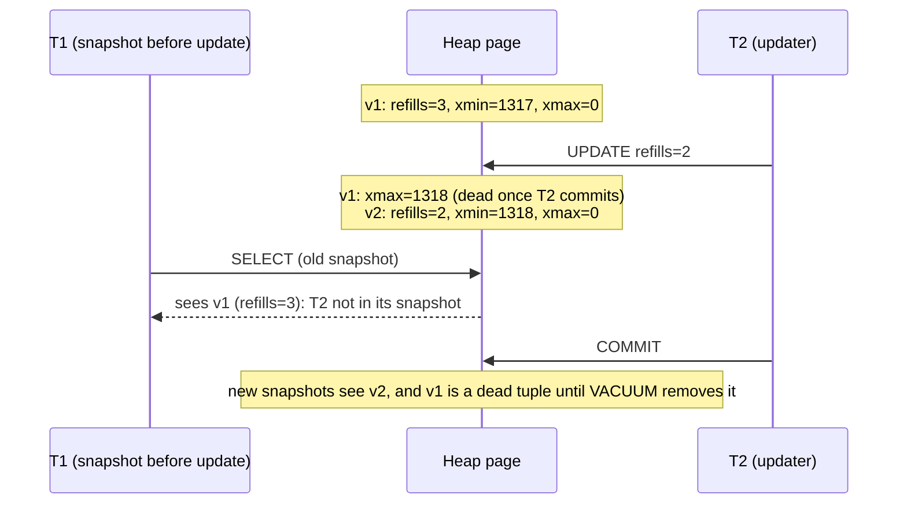
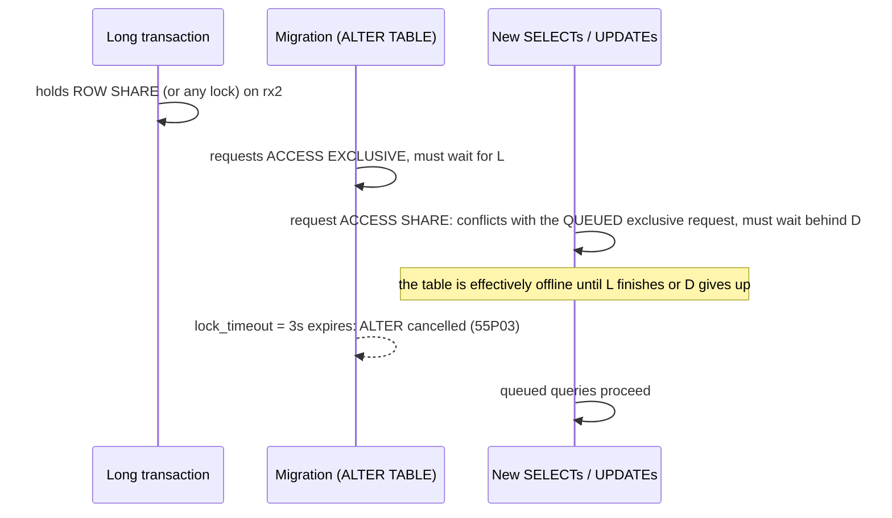
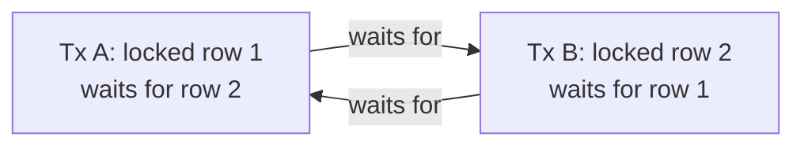

# MVCC, Locking & Deadlocks

!!! abstract "TL;DR"
    - **MVCC:** an `UPDATE` doesn't overwrite a row; it writes a **new row version** and marks the old one dead (`xmax`). Each transaction reads the versions visible to its **snapshot**, so **readers never block writers and writers never block readers**.
    - The price is **dead tuples**: updating all 100,000 rows of a table left 100,000 dead tuples and grew it from 5.6 MB to 10 MB. **VACUUM** makes dead space reusable (size stayed 10 MB); only `VACUUM FULL`/`pg_repack` give space back (5.6 MB). **Autovacuum** must keep up, or tables bloat and queries slow down.
    - **HOT updates** (heap-only tuples) avoid touching indexes when no indexed column changes and the page has room: 44 % HOT for updates to an unindexed column with `fillfactor = 70`, **0 %** for updates to an indexed column.
    - **Locks still exist** for writes and DDL: row locks (`FOR UPDATE`, `FOR NO KEY UPDATE`, `FOR SHARE`, implicit on UPDATE/DELETE) and eight table lock modes. `ALTER TABLE` needs `ACCESS EXCLUSIVE`, and while it **waits**, every new query on the table queues behind it (demonstrated: a plain `SELECT` waited 2.5 s behind a blocked `ALTER`). Always use `lock_timeout` for DDL.
    - **Deadlocks** are detected (after `deadlock_timeout`, 1 s) and one transaction fails with `40P01`. Prevent them by locking in a consistent order; diagnose blocking with `pg_stat_activity` + `pg_blocking_pids()` / `pg_locks`.

## Why it matters

MVCC explains a lot of PostgreSQL behaviour that otherwise looks mysterious: why tables grow after updates, why a forgotten "idle in transaction" session slows the whole database, why `COUNT(*)` scans the table, why index-only scans sometimes visit the heap, and why a one-second migration took the site down. Interviewers use this topic to see whether you understand the engine well enough to run it in production, not just query it.

## Core concepts

### Row versions and visibility

Every row version (tuple) carries hidden system columns:

| Column | Meaning |
|---|---|
| `xmin` | ID of the transaction that created this version |
| `xmax` | ID of the transaction that deleted or updated it (0 if live), or that locked it |
| `ctid` | Physical location `(page, item)` |

Demonstrated on PostgreSQL 16: a row at `ctid (0,1)` created by transaction 1317 was updated by transaction 1318; afterwards the visible version had `xmin = 1318` and `ctid (0,142)`, a **new physical row**, while the old version stayed on page 0 as a dead tuple until VACUUM.


*Notice that the reader and the writer never waited for each other. Each version is visible only to snapshots whose rules say so, which is exactly what powers READ COMMITTED and REPEATABLE READ (see [isolation levels](03-transactions-acid-and-isolation-levels.md)).*

A **snapshot** records which transactions were in progress when it was taken; a tuple is visible if its `xmin` committed before the snapshot and its `xmax` didn't. Commit status lives in the commit log (`pg_xact`), and hint bits on tuples cache it.

### Dead tuples, VACUUM and bloat

| Measured on a 100,000-row table (autovacuum disabled) | Result |
|---|---|
| Table size after initial load | 5,712 kB |
| `UPDATE rx SET refills = refills - 1` (every row) | `n_dead_tup = 100,000`, size **10 MB** |
| `VACUUM rx` | `n_dead_tup = 0`, size still **10 MB** (space reusable, not returned) |
| `VACUUM FULL rx` | size **5,688 kB** (table rewritten, exclusive lock) |

- **VACUUM** removes dead tuples that no snapshot can still see, records free space (free space map) for reuse, updates the **visibility map** (enabling index-only scans), and **freezes** old tuples. It runs without blocking reads or writes.
- **VACUUM FULL** rewrites the table compactly but takes an `ACCESS EXCLUSIVE` lock for the whole time. In production use **`pg_repack`** (online) if you must shrink.
- **Autovacuum** triggers per table when dead tuples exceed `autovacuum_vacuum_threshold + autovacuum_vacuum_scale_factor × rows` (defaults 50 + 20 %). For big, hot tables lower the scale factor per table (`ALTER TABLE … SET (autovacuum_vacuum_scale_factor = 0.02)`), and make sure enough workers and I/O budget exist.
- **What stops cleanup:** VACUUM can only remove tuples older than the **oldest running snapshot** in the cluster. Long transactions, sessions `idle in transaction`, forgotten replication slots and `hot_standby_feedback` on lagging replicas hold that horizon back, so dead tuples pile up everywhere.

### HOT updates

A **heap-only tuple** update is possible when (1) no indexed column changes and (2) the new version fits on the **same page**. Then indexes keep pointing at the old line pointer, which redirects to the new version, so no index entries are written.

| Measured (100,000 rows, `fillfactor = 70`) | Updates | HOT |
|---|---|---|
| Update an **unindexed** column (`note`) on 10,000 rows | 10,000 | 4,368 (44 %) |
| Update an **indexed** column (`status`) on 10,000 rows | 10,000 | **0** |

- Don't index columns you update often unless queries need it; each such index turns every update into index maintenance plus bloat.
- A lower **fillfactor** (e.g. 80–90 for update-heavy tables) leaves room on each page for new versions, raising the HOT ratio. Monitor `n_tup_hot_upd / n_tup_upd` in `pg_stat_user_tables`.

### Transaction ID wraparound and freezing

Transaction IDs are 32-bit and compared modulo 2³². To stay correct, VACUUM **freezes** old tuples (marks them visible to everyone). If freezing falls far behind, PostgreSQL forces aggressive anti-wraparound vacuums and, in the extreme, stops accepting writes to protect data. Monitor `age(datfrozenxid)` per database and `age(relfrozenxid)` for the largest tables; never disable autovacuum.

### Table-level lock modes

| Lock mode | Taken by | Conflicts with (most important) |
|---|---|---|
| `ACCESS SHARE` | `SELECT` | `ACCESS EXCLUSIVE` only |
| `ROW SHARE` | `SELECT … FOR UPDATE/SHARE` | `EXCLUSIVE`, `ACCESS EXCLUSIVE` |
| `ROW EXCLUSIVE` | `INSERT`, `UPDATE`, `DELETE`, `MERGE` | `SHARE` and stronger |
| `SHARE UPDATE EXCLUSIVE` | `VACUUM`, `ANALYZE`, `CREATE INDEX CONCURRENTLY`, some `ALTER TABLE` | Itself and stronger |
| `SHARE` | `CREATE INDEX` (non-concurrent) | Writes (`ROW EXCLUSIVE`) |
| `SHARE ROW EXCLUSIVE` | `CREATE TRIGGER`, some `ALTER TABLE` | Writes |
| `EXCLUSIVE` | `REFRESH MATERIALIZED VIEW CONCURRENTLY` | Everything except reads |
| `ACCESS EXCLUSIVE` | Most `ALTER TABLE`, `DROP`, `TRUNCATE`, `VACUUM FULL`, `CLUSTER` | **Everything, including SELECT** |

**Row-level locks** are stored in the tuple (`xmax` plus info bits), not in shared memory, so locking millions of rows doesn't exhaust lock memory. Modes from strongest: `FOR UPDATE` (taken by `DELETE` and updates of key columns), `FOR NO KEY UPDATE` (taken by other `UPDATE`s), `FOR SHARE`, `FOR KEY SHARE` (taken by foreign-key checks). That's why inserting a child row (FK check takes `FOR KEY SHARE` on the parent) doesn't block ordinary updates of the parent (`FOR NO KEY UPDATE`).

### The lock queue: why a quick ALTER can stall everything


*Notice that the SELECTs aren't blocked by the long transaction but by the ALTER waiting in the queue. Demonstrated: with a `FOR UPDATE` transaction open, an `ALTER TABLE` waited, a plain `SELECT count(*)` queued behind it for 2.5 s, and both resumed when the ALTER hit its 3 s `lock_timeout`.*

Rule: every DDL migration starts with `SET lock_timeout = '…'` (a few seconds) and is retried, rather than waiting indefinitely and taking the table down.

### Deadlocks


*Notice the cycle. Neither can proceed; after `deadlock_timeout` (1 s) PostgreSQL checks the wait graph and aborts one transaction. Demonstrated: A failed with `40P01 deadlock detected`, B committed.*

- **Prevention:** lock rows in a consistent order (sort ids before updating several rows; process batches in primary-key order); keep transactions short; avoid lock upgrades (read with `FOR UPDATE` up front if you'll update).
- **Handling:** retry the aborted transaction; log details (`log_lock_waits = on` logs waits longer than `deadlock_timeout`).
- Foreign keys and triggers can create less obvious lock orders; deadlocks between a batch job and online traffic are common when both touch the same rows in different orders.

### Advisory locks

Application-defined locks keyed by a number: `pg_advisory_lock(key)` (session-level), `pg_advisory_xact_lock(key)` (released at transaction end), and `pg_try_advisory_lock` (non-blocking). Uses: making sure only one instance runs a scheduled job, serialising work per entity (`hashtext('member:42')`), and migration tools (Flyway uses one). They live in the database's lock table, so they vanish when the session dies, which is safer than lock rows that can be left behind.

### Diagnosing blocking

```sql
-- Who is waiting, and who blocks them?
SELECT pid,
       state,
       wait_event_type,
       wait_event,
       pg_blocking_pids(pid) AS blocked_by,
       now() - xact_start     AS xact_age,
       left(query, 60)        AS query
FROM pg_stat_activity
WHERE datname = current_database() AND (wait_event_type = 'Lock' OR state LIKE 'idle in transaction%')
ORDER BY xact_age DESC;

-- Kill the blocker if justified (prefer cancel first)
SELECT pg_cancel_backend(12108);     -- cancel the running query
SELECT pg_terminate_backend(12108);  -- end the session
```

Demonstrated output: the `ALTER` session showed `blocked_by = {12108}` (the long transaction) and the `SELECT` showed `blocked_by = {12109}` (the waiting `ALTER`), a blocking chain in two hops.

## In practice: code & configuration

=== "❌ Common mistake"
    ```java
    @Transactional
    public void processBatch(List<Long> rxIds) {
        for (Long id : rxIds) {                       // arbitrary order: two batches overlapping -> deadlocks
            Rx rx = repo.findById(id).orElseThrow();
            rx.decrementRefills();
            pharmacyClient.notify(rx);                // HTTP call while holding row locks
        }
    }                                                 // transaction open for minutes: blocks VACUUM cleanup
    ```

=== "✅ Correct approach"
    ```java
    public void processBatch(List<Long> rxIds) {
        List<Long> sorted = rxIds.stream().sorted().toList();       // consistent lock order
        for (List<Long> chunk : Lists.partition(sorted, 200)) {     // short transactions
            tx.executeWithoutResult(status -> {
                repo.decrementRefills(chunk);                       // one UPDATE ... WHERE id IN (...)
                outbox.saveAll(RefillChanged.of(chunk));            // notify after commit via outbox
            });
        }
    }
    ```

```sql
-- Update-heavy table: room for HOT updates, more aggressive autovacuum
ALTER TABLE rx SET (fillfactor = 85,
                    autovacuum_vacuum_scale_factor = 0.02,
                    autovacuum_analyze_scale_factor = 0.02);

-- Guard rails for every service role
ALTER ROLE claims_service SET idle_in_transaction_session_timeout = '60s';
ALTER ROLE claims_service SET lock_timeout = '5s';

-- Bloat / vacuum health
SELECT relname, n_live_tup, n_dead_tup, last_autovacuum, n_tup_hot_upd, n_tup_upd
FROM pg_stat_user_tables ORDER BY n_dead_tup DESC LIMIT 10;
```

## Real-world usage

- **Uber's** 2016 post on moving from PostgreSQL to MySQL cited write amplification from PostgreSQL's MVCC design (every update touching every index) and replication behaviour; HOT updates, fillfactor tuning and careful indexing are the standard mitigations, and the post remains a common interview discussion point.
- **Transaction ID wraparound** outages (Sentry, Mailchimp/Mandrill and others have published post-mortems) happened when autovacuum couldn't keep up on very large, busy tables; monitoring `age(datfrozenxid)` is now standard practice.
- **Lock-queue incidents** during migrations are why GitLab, Shopify and others mandate `lock_timeout` plus retries for every DDL statement.
- **Idle-in-transaction sessions** from connection leaks (or debuggers paused mid-transaction) are a classic cause of bloat and blocked migrations; `idle_in_transaction_session_timeout` is the safety net.

## Trade-offs & production gotchas

| Option | Pros | Cons | Use when |
|---|---|---|---|
| MVCC (PostgreSQL) | Readers and writers don't block; consistent snapshots | Dead tuples, vacuum needed, update write amplification | Always (it's the engine) |
| `VACUUM` (auto) | Online, reclaims space for reuse | Doesn't shrink files | Continuous maintenance |
| `VACUUM FULL` | Shrinks the table | `ACCESS EXCLUSIVE` for the duration | Maintenance windows only |
| `pg_repack` | Online shrink | Extension, extra space during rebuild | Severe bloat in production |
| Lower fillfactor | More HOT updates | Larger table | Update-heavy tables |
| Advisory locks | Lightweight, auto-released | Application must use them consistently | Singleton jobs, per-key serialisation |

!!! warning "Gotcha: COUNT(*) is not O(1)"
    Because visibility depends on each transaction's snapshot, PostgreSQL can't keep a single row count; `COUNT(*)` scans the table or an index (index-only scans help if the visibility map is current). Use estimates (`pg_class.reltuples`) where exact counts aren't needed.

!!! warning "Gotcha: disabling autovacuum"
    Turning it off "for performance" leads to bloat, stale statistics, failing index-only scans and eventually wraparound protection stopping writes. Tune it per table instead.

!!! warning "Gotcha: replication slots and standbys hold back cleanup"
    An abandoned logical replication slot (for example from a CDC connector like Debezium that was removed) keeps WAL and the xmin horizon pinned; disk fills and dead tuples accumulate. Monitor `pg_replication_slots`.

## How this connects to my experience

- **Where I used it:** not ★. Relational databases on RDS at Deloitte and Spring services elsewhere; at OptumRx, MongoDB's WiredTiger engine also uses MVCC snapshots internally. *[confirm any incident you handled around locks or bloat]*
- **Talking points:**
    - "I keep transactions short and never hold them across remote calls, because in PostgreSQL an open transaction blocks vacuum cleanup and holds locks."
    - "Batch jobs lock rows in primary-key order and commit in chunks, which avoids deadlocks with online traffic."
    - "Every migration sets `lock_timeout`, since a waiting `ALTER` blocks every query behind it."
- **Likely follow-up chain:** "How does MVCC work?" → row versions and snapshots → "What's the downside?" (dead tuples, vacuum, bloat) → "What blocks vacuum?" (long transactions, slots) → "Why did a quick ALTER take the site down?" (lock queue) → "How do you debug blocking?" (`pg_blocking_pids`).

## Interview questions

### Fundamentals

??? question "Q1. What is MVCC?"
    **Answer:** Multi-version concurrency control: writes create new row versions instead of overwriting, and each transaction reads the versions visible to its snapshot. Readers don't block writers and writers don't block readers. In PostgreSQL old versions stay in the table as dead tuples until VACUUM removes them.

    **Interviewer listens for:** versions, snapshots, non-blocking reads, dead tuples.

    **Common wrong answer:** "It keeps a copy of the database per user."

??? question "Q2. What happens physically when you UPDATE a row in PostgreSQL?"
    **Answer:** A new tuple version is written (possibly on another page) with `xmin` = the updating transaction, the old version's `xmax` is set, and indexes get new entries unless it's a HOT update. Demonstrated: the row moved from `ctid (0,1)` to `(0,142)`. The old version becomes a dead tuple once the update commits and no snapshot needs it.

    **Interviewer listens for:** new version, xmin/xmax, index entries, dead tuple.

    **Common wrong answer:** "The row is updated in place."

??? question "Q3. What does VACUUM do, and how is VACUUM FULL different?"
    **Answer:** VACUUM removes dead tuples no snapshot can see, marks the space reusable, updates the visibility map and freezes old tuples, without blocking normal traffic; the file doesn't shrink. VACUUM FULL rewrites the table to return space to the OS, but holds an ACCESS EXCLUSIVE lock throughout. Measured: 10 MB stayed 10 MB after VACUUM, dropped to 5.7 MB after VACUUM FULL.

    **Interviewer listens for:** reuse vs shrink, locking difference, visibility map, freezing.

    **Common wrong answer:** "VACUUM deletes old data you no longer need."

??? question "Q4. Do reads block writes in PostgreSQL?"
    **Answer:** No. Plain SELECTs take only an ACCESS SHARE table lock and read snapshot-visible versions, so they don't block INSERT/UPDATE/DELETE and aren't blocked by them. Reads conflict only with ACCESS EXCLUSIVE locks (most ALTER TABLE, DROP, TRUNCATE, VACUUM FULL), and `SELECT … FOR UPDATE` takes row locks.

    **Interviewer listens for:** snapshot reads, ACCESS SHARE, the DDL exception.

    **Common wrong answer:** "Yes, readers take shared locks on rows."

### Intermediate

??? question "Q5. What is a HOT update and why does it matter?"
    **Answer:** A heap-only tuple update: when no indexed column changes and the new version fits on the same page, PostgreSQL doesn't add index entries; the old line pointer redirects to the new version. It reduces index writes, WAL and bloat. Measured: 0 % HOT when updating an indexed column; 44 % when updating an unindexed column with fillfactor 70.

    **Interviewer listens for:** two conditions, fewer index writes, fillfactor.

    **Common wrong answer:** "HOT means the row is cached in memory."

??? question "Q6. What can stop VACUUM from cleaning up dead tuples?"
    **Answer:** Anything holding back the oldest snapshot horizon: long-running transactions, sessions idle in transaction, prepared transactions, abandoned replication slots, and standbys with `hot_standby_feedback` and long queries. Dead tuples newer than that horizon must be kept for them, so tables bloat cluster-wide.

    **Interviewer listens for:** xmin horizon, examples, cluster-wide effect.

    **Common wrong answer:** "VACUUM always removes all deleted rows."

??? question "Q7. How does PostgreSQL detect and resolve deadlocks?"
    **Answer:** When a lock wait exceeds `deadlock_timeout` (1 s by default), the backend checks the wait-for graph for a cycle and aborts one transaction with SQLSTATE 40P01; the others proceed. Applications should retry the aborted transaction and fix the root cause by locking in a consistent order.

    **Interviewer listens for:** deadlock_timeout, cycle detection, 40P01, retry + ordering.

    **Common wrong answer:** "Both transactions wait forever."

??? question "Q8. Why can a fast ALTER TABLE cause an outage?"
    **Answer:** It needs ACCESS EXCLUSIVE. If any transaction holds a conflicting lock, the ALTER waits in the lock queue, and every subsequent query on the table (even SELECT) queues behind the ALTER's pending request. Demonstrated: a SELECT waited 2.5 s behind a blocked ALTER. Use `lock_timeout` so the migration gives up quickly and retry it.

    **Interviewer listens for:** lock queue, ACCESS EXCLUSIVE, lock_timeout.

    **Common wrong answer:** "Only long-running ALTERs are risky."

### Senior

??? question "Q9. What is transaction ID wraparound and how do you prevent problems?"
    **Answer:** Transaction IDs are 32-bit and compared circularly, so very old tuples must be frozen (marked visible to all) before their xmin would appear to be in the future. Autovacuum does this; if it falls far behind, PostgreSQL runs aggressive anti-wraparound vacuums and ultimately refuses writes to avoid data loss. Prevent it by keeping autovacuum healthy, avoiding long transactions and abandoned slots, and alerting on `age(datfrozenxid)`.

    **Interviewer listens for:** 32-bit circular IDs, freezing, protective write stop, monitoring.

    **Common wrong answer:** "It's a theoretical problem that never happens."

??? question "Q10. How do row-level lock modes interact with foreign keys?"
    **Answer:** Inserting or updating a child row takes `FOR KEY SHARE` on the referenced parent row. That conflicts only with `FOR UPDATE` (deletes and key changes), not with `FOR NO KEY UPDATE`, which ordinary parent updates take. So child inserts don't block normal parent updates, but deleting a parent waits for in-flight child inserts, and unindexed FK columns make parent deletes scan the child table.

    **Interviewer listens for:** KEY SHARE vs NO KEY UPDATE, delete conflicts, FK indexing.

    **Common wrong answer:** "Foreign keys lock the whole parent table."

??? question "Q11. When would you use advisory locks?"
    **Answer:** For application-level mutual exclusion that should live and die with a database session: ensuring a scheduled job runs on only one instance (`pg_try_advisory_lock`), serialising operations per business key, or coordinating migrations. Prefer transaction-scoped ones so they release automatically on commit or rollback.

    **Interviewer listens for:** singleton jobs, per-key serialisation, auto-release.

    **Common wrong answer:** "They're the same as row locks."

### Scenario-based

??? question "Q12. A table grew from 20 GB to 80 GB with no new data. What happened and what do you do?"
    **Answer:** Bloat: updates and deletes left dead tuples that VACUUM couldn't reclaim fast enough, or couldn't reclaim at all because something held back the xmin horizon. Check `n_dead_tup` and `last_autovacuum`, look for long or idle-in-transaction sessions and replication slots, tune per-table autovacuum thresholds and workers, and reclaim space online with `pg_repack` (not VACUUM FULL during business hours).

    **Interviewer listens for:** bloat diagnosis, xmin horizon, autovacuum tuning, online repack.

    **Common wrong answer:** "Run VACUUM FULL right away."

??? question "Q13. Requests start timing out and you see many sessions waiting on locks. How do you investigate?"
    **Answer:** Query `pg_stat_activity` with `pg_blocking_pids(pid)` to find the head of the blocking chain (often a long transaction or an idle-in-transaction session, or a migration waiting for ACCESS EXCLUSIVE). Decide whether to cancel or terminate it, then fix the cause: add timeouts (`idle_in_transaction_session_timeout`, `lock_timeout`, `statement_timeout`), shorten transactions, and enable `log_lock_waits`.

    **Interviewer listens for:** blocking chain, head blocker, cancel vs terminate, preventive settings.

    **Common wrong answer:** "Restart the database."

??? question "Q14. A nightly job and online traffic deadlock several times a night. Fix it."
    **Answer:** They lock the same rows in different orders. Make the job process rows in primary-key order (the same order online code uses, or update via single set-based statements), commit in small batches to shorten lock duration, and retry on 40P01. If both must lock several rows per operation, sort the keys before locking everywhere.

    **Interviewer listens for:** consistent ordering, small batches, retry.

    **Common wrong answer:** "Increase deadlock_timeout."

## Cheat sheet

| Concept | Remember |
|---|---|
| MVCC | UPDATE = new version + old dead; snapshots decide visibility; readers/writers don't block |
| System columns | `xmin` creator, `xmax` deleter/locker, `ctid` location |
| Dead tuples | VACUUM makes space reusable; VACUUM FULL / pg_repack shrink |
| Autovacuum | 50 + 20 % threshold default; lower scale factor on big hot tables; never disable |
| Horizon | Long/idle transactions, slots, standby feedback block cleanup |
| HOT | No indexed column changed + room on page → no index writes; fillfactor helps |
| Wraparound | Freezing; monitor `age(datfrozenxid)` |
| Table locks | SELECT = ACCESS SHARE; writes = ROW EXCLUSIVE; most ALTER = ACCESS EXCLUSIVE |
| Row locks | FOR UPDATE / NO KEY UPDATE / SHARE / KEY SHARE (FK checks) |
| Lock queue | Waiting DDL blocks everyone behind it → `lock_timeout` |
| Deadlocks | Detected after 1 s, `40P01`; consistent lock order; retry |
| Diagnose | `pg_stat_activity`, `pg_blocking_pids()`, `pg_locks`, `log_lock_waits` |
| Advisory locks | `pg_try_advisory_xact_lock` for singleton jobs |

## Sources
1. [PostgreSQL 16: Concurrency control (MVCC intro)](https://www.postgresql.org/docs/16/mvcc-intro.html) and [Explicit locking](https://www.postgresql.org/docs/16/explicit-locking.html).
2. [PostgreSQL 16: Routine vacuuming (dead tuples, visibility map, wraparound)](https://www.postgresql.org/docs/16/routine-vacuuming.html).
3. [PostgreSQL 16: Heap-only tuples (HOT)](https://www.postgresql.org/docs/16/storage-hot.html) and [fillfactor storage parameter](https://www.postgresql.org/docs/16/sql-createtable.html#RELOPTION-FILLFACTOR).
4. [PostgreSQL 16: System columns](https://www.postgresql.org/docs/16/ddl-system-columns.html) and [pg_blocking_pids and system information functions](https://www.postgresql.org/docs/16/functions-info.html).
5. [PostgreSQL 16: Advisory lock functions](https://www.postgresql.org/docs/16/functions-admin.html#FUNCTIONS-ADVISORY-LOCKS).
6. [Uber Engineering: Why Uber Engineering switched from Postgres to MySQL (2016)](https://www.uber.com/blog/postgres-to-mysql-migration/).
7. [pg_repack](https://reorg.github.io/pg_repack/).
8. All demonstrations on this page: PostgreSQL 16.14 (tuple versions, bloat and VACUUM, HOT ratios, deadlock, lock queue), run while writing this page.
