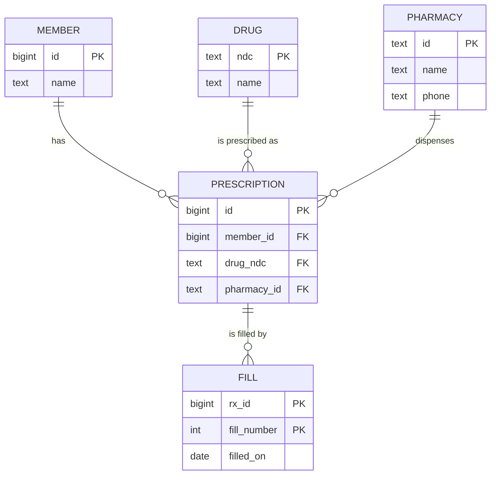

# Normalisation vs Denormalisation

!!! abstract "TL;DR"
    - **Normalisation** stores each fact **once**, so it can't become inconsistent. It removes **update anomalies** (change a pharmacy's phone in 10,000 rows), **insert anomalies** (can't add a pharmacy until it has a prescription) and **delete anomalies** (deleting the last prescription loses the pharmacy).
    - Normal forms in one line each: **1NF** atomic values, no repeating groups; **2NF** no attribute depends on part of a composite key; **3NF** no attribute depends on another non-key attribute; **BCNF** every determinant is a candidate key. For OLTP, aim for **3NF/BCNF** by default.
    - **Denormalisation** deliberately duplicates or pre-computes data to make **reads** cheaper: copied columns, summary/counter tables, **materialized views**, JSONB documents, read models fed by events. Every copy needs a **sync mechanism** and a defined staleness.
    - Denormalise **after measuring**: with the right index, a live per-member aggregate over 1 M rows took **0.56 ms**, while refreshing a materialized view of all members took **4.5 s**. Pre-compute when the aggregate spans many rows per request, not as a reflex.
    - Analytics uses deliberately denormalised **star schemas** (facts + dimensions) in a separate warehouse; OLTP stays normalised. Constraints (PK, FK, UNIQUE, CHECK, NOT NULL) are the cheapest way to keep data correct either way.

## Why it matters

Schema design decisions are expensive to undo. A schema that duplicates facts leads to records that disagree ("which address is right?"), painful migrations and bugs that only appear in reports. A schema normalised past the point of usefulness leads to 12-way joins for every screen. Interviewers ask about normalisation to see whether you can **name the anomalies**, explain the normal forms without jargon, and justify denormalisation with numbers and a plan for consistency.

## Core concepts

### Anomalies in an unnormalised table

| rx_id | member_id | member_name | drug_ndc | drug_name | pharmacy_id | pharmacy_name | pharmacy_phone | fills |
|---|---|---|---|---|---|---|---|---|
| 501 | 42 | Asha Rao | 0002-3227 | Amoxicillin 500mg | PH7 | Main St Pharmacy | 555-0101 | 1, 2 |
| 502 | 42 | Asha Rao | 0093-7146 | Atorvastatin 20mg | PH7 | Main St Pharmacy | 555-0101 | 1 |
| 503 | 77 | Ben Ode | 0002-3227 | Amoxicillin 500mg | PH9 | Oak Ave Pharmacy | 555-0199 | 1 |

| Anomaly | In this table |
|---|---|
| **Update** | Main St's phone changes: update every row that mentions PH7, miss one and the data disagrees |
| **Insert** | A new pharmacy with no prescriptions yet can't be recorded without fake rx data |
| **Delete** | Deleting prescription 503 loses everything we knew about Oak Ave Pharmacy |
| **Repeating group** | `fills` holds a list in one column: can't query or constrain individual fills |

### The normal forms, applied


*Notice that each fact now lives in exactly one place: a pharmacy's phone in `PHARMACY`, a drug's name in `DRUG`, each fill as its own row. Changing the phone is a one-row update, and pharmacies can exist without prescriptions.*

| Normal form | Rule | Violation in the original | Fix |
|---|---|---|---|
| **1NF** | Atomic values; no repeating groups; rows identifiable by a key | `fills = "1, 2"` | Separate `FILL(rx_id, fill_number, …)` table |
| **2NF** | 1NF + no non-key attribute depends on **part** of a composite key | In `FILL(rx_id, fill_number, drug_name)`, `drug_name` depends on `rx_id` alone | Keep drug info with the prescription/drug, not the fill |
| **3NF** | 2NF + no non-key attribute depends on another **non-key** attribute (no transitive dependency) | `pharmacy_name` depends on `pharmacy_id`, not on `rx_id` | Move pharmacy attributes to `PHARMACY` |
| **BCNF** | Every determinant (left side of a functional dependency) is a candidate key | A table where a non-key column determines part of the key, e.g. `(pharmacist, shift) → store` but `pharmacist → store` | Split so each determinant is a key |
| 4NF/5NF | No independent multi-valued facts in one table / no join dependencies | A member's allergies and languages stored as combinations in one table | Separate tables per independent fact |

The informal test for 3NF: *every non-key column describes the key, the whole key, and nothing but the key.*

### Keys and constraints

- **Natural key** (NDC drug code, ISO currency) vs **surrogate key** (`bigint` identity, UUID). Use surrogate primary keys for most entities (natural keys change: emails, phone numbers) and add **UNIQUE** constraints on natural keys to keep them unique.
- **Constraints are part of the design**, not an afterthought: `NOT NULL`, `UNIQUE`, `CHECK (quantity BETWEEN 1 AND 90)`, `FOREIGN KEY … ON DELETE RESTRICT`, exclusion constraints. They enforce invariants for every writer: your service, other services, scripts and future code.
- UUIDv4 primary keys scatter inserts across the B-tree (page splits, cache misses); time-ordered **UUIDv7** keeps them sequential (built into PostgreSQL 18 as `uuidv7()`; available via libraries before that).

### When to denormalise

Denormalise when **measurements** show reads are too expensive and the cost of keeping copies consistent is acceptable.

| Technique | Example | Keeps in sync by | Staleness |
|---|---|---|---|
| **Copied column** | `claim.member_plan_code` copied from `member` at claim time | Written once (a historical fact) or updated by trigger/event | None if it's a snapshot "as of" the claim |
| **Summary / counter table** | `member_stats(member_id, claim_count, total_paid)` | Same transaction as the write, trigger, or async consumer | None (same TX) to seconds (async) |
| **Materialized view** | `member_claim_summary` aggregated from `claim` | `REFRESH MATERIALIZED VIEW [CONCURRENTLY]` on a schedule | Until the next refresh |
| **Generated column** | `pharmacy text GENERATED ALWAYS AS (payload->>'pharmacy') STORED` | Database, on every write | None |
| **JSONB document** | Store a FHIR-like resource or flexible attributes in one column | Application writes the document | None, but weaker constraints |
| **Read model / CQRS** | Member dashboard document in Redis or Elasticsearch | Events / CDC from the source tables | Seconds |

**Copied columns that are really history aren't denormalisation bugs.** The price a member paid, their plan at the time of the claim, the pharmacy address on the dispensing label: these are facts **as of a moment** and should be stored with the transaction, precisely so later changes don't rewrite history.

### Measured: denormalise only where it pays

On the 1-million-row `claim` table (PostgreSQL 16):

| Approach | Query | Time |
|---|---|---|
| Live aggregate with index on `member_id` | `count(*), sum(amount)` for one member (10 rows) | **0.56 ms** |
| Materialized view `member_claim_summary` with unique index | Same values, one row lookup | 0.58 ms |
| Refreshing that materialized view | `REFRESH MATERIALIZED VIEW CONCURRENTLY` (all 100,000 members) | **4.5 s** |
| `REFRESH … CONCURRENTLY` without a unique index | Error: *cannot refresh materialized view concurrently* (needs a unique index) | — |
| Generated column from JSONB | `payload->>'pharmacy'` stored and indexable | Computed on write |

For a per-member screen the normalised query with the right index is as fast as the pre-computed one, and always current. A materialized view pays off when each request aggregates **many** rows (dashboards across all members, monthly reports), and only if its staleness is acceptable.

### OLTP vs analytics schemas

| | OLTP (operational) | Analytics (warehouse) |
|---|---|---|
| Workload | Many small reads/writes by key | Few large scans and aggregations |
| Schema | Normalised (3NF/BCNF) | Denormalised **star/snowflake**: fact tables (claims, fills) + dimension tables (member, drug, date) |
| Updates | Constant, row by row | Batch or streaming loads (ELT) |
| Storage | Row-oriented (PostgreSQL heap) | Column-oriented (Redshift, BigQuery, Snowflake, ClickHouse) |
| History | Current state + audit tables | Slowly changing dimensions (SCD type 2) keep history |

Running heavy reports on the OLTP primary competes with transactions; send them to a replica or a warehouse fed by CDC (Debezium) or batch exports.

### Normalisation in microservices and document stores

- Each service owns its own normalised schema; **cross-service duplication** (a claims service keeping member names) is a deliberate, event-fed copy, not a join.
- Document databases (MongoDB) push towards **embedding** data that is read together and owned by one aggregate, and **referencing** data that is shared or unbounded: the same trade-off as normalisation, decided per access pattern. See [MongoDB schema design](../mongodb/01-document-model-and-schema-design.md).

## In practice: code & configuration

=== "❌ Common mistake"
    ```sql
    -- Pharmacy facts repeated on every prescription; fills packed into a string
    CREATE TABLE prescription (
        id             BIGINT PRIMARY KEY,
        member_id      BIGINT,
        drug_name      TEXT,
        pharmacy_name  TEXT,
        pharmacy_phone TEXT,             -- update anomaly waiting to happen
        fill_dates     TEXT              -- '2026-01-05,2026-02-04': not queryable or constrainable
    );

    -- "Denormalised for speed" counter updated from application code in a separate transaction
    UPDATE member SET claim_count = claim_count + 1 WHERE id = :id;   -- drifts when the claim insert fails
    ```

=== "✅ Correct approach"
    ```sql
    CREATE TABLE pharmacy (
        id    TEXT PRIMARY KEY,
        name  TEXT NOT NULL,
        phone TEXT NOT NULL
    );

    CREATE TABLE prescription (
        id          BIGINT GENERATED ALWAYS AS IDENTITY PRIMARY KEY,
        member_id   BIGINT NOT NULL REFERENCES member (id),
        drug_ndc    TEXT   NOT NULL REFERENCES drug (ndc),
        pharmacy_id TEXT   NOT NULL REFERENCES pharmacy (id),
        refills_authorised INT NOT NULL CHECK (refills_authorised BETWEEN 0 AND 11)
    );
    CREATE INDEX ON prescription (member_id);          -- FK columns aren't indexed automatically

    CREATE TABLE fill (
        rx_id       BIGINT NOT NULL REFERENCES prescription (id),
        fill_number INT    NOT NULL CHECK (fill_number >= 1),
        filled_on   DATE   NOT NULL,
        copay_paid  NUMERIC(10, 2) NOT NULL,           -- historical fact: stored as of the fill
        PRIMARY KEY (rx_id, fill_number)
    );

    -- Deliberate denormalisation for a cross-member dashboard, refreshed every 15 minutes
    CREATE MATERIALIZED VIEW member_claim_summary AS
        SELECT member_id, count(*) AS claims, sum(amount) AS total, max(service_date) AS last_service
        FROM claim GROUP BY member_id;
    CREATE UNIQUE INDEX ON member_claim_summary (member_id);    -- required for CONCURRENTLY
    -- scheduled: REFRESH MATERIALIZED VIEW CONCURRENTLY member_claim_summary;
    ```

When a counter must be exact, update it **in the same transaction** as the change it counts (or with a trigger), never in a separate call that can fail independently.

## Real-world usage

- **Banking ledgers** keep normalised, append-only entries as the source of truth and maintain denormalised balances in the same transaction for fast reads, reconciling them regularly.
- **E-commerce and healthcare portals** use normalised OLTP schemas plus read models (Elasticsearch, Redis, materialized views) for search and dashboards, accepting seconds of staleness.
- **FHIR and claims data** often arrive as nested documents; teams store the raw document (JSONB) for fidelity and extract key fields into normalised columns (or generated columns) for querying and constraints.
- **Data warehouses** (Redshift, Snowflake, BigQuery) deliberately denormalise into star schemas with SCD type 2 dimensions so analysts can query history without joins across 20 operational tables.
- **Failure mode:** a team copied member addresses into the claims table "for speed" and updated them from three services; after a year, the same member had four different addresses across tables and mail went to the wrong place.

## Trade-offs & production gotchas

| Option | Pros | Cons | Use when |
|---|---|---|---|
| Normalised (3NF/BCNF) | One source of truth, small writes, strong constraints | More joins | Default for OLTP |
| Copied historical columns | Correct history, simpler reads | Must be clearly "as of" | Prices, plan at claim time, addresses on documents |
| Summary table (same TX) | Exact, fast reads | Write contention on hot rows | Counters, balances |
| Materialized view | Simple, fast reads | Stale between refreshes; refresh cost | Dashboards, reports |
| JSONB | Flexible schema, fewer tables | Weak constraints, harder updates | Variable attributes, raw payloads |
| Read model (CQRS) | Scales reads independently | Eventual consistency, more infrastructure | High-traffic read screens across services |

!!! warning "Gotcha: denormalising without an owner"
    Every copy needs one writer and one sync path (same transaction, trigger, CDC or events) plus a reconciliation job. Copies updated "wherever convenient" drift silently.

!!! warning "Gotcha: hot counter rows"
    A single `stats` row updated by every insert becomes a lock hotspot. Use per-entity counters, sharded counters (N rows summed on read), or compute asynchronously.

!!! tip "Measure before denormalising"
    Many "joins are slow" problems are missing indexes or N+1 queries. Fix those first; a well-indexed normalised schema handles far more than most teams expect.

## How this connects to my experience

- **Where I used it:** not ★. Relational schemas on RDS/PostgreSQL/MySQL (Deloitte, Coriolis, Johnson Controls) and document modelling in MongoDB at OptumRx, where embed-vs-reference is the same trade-off; Elasticsearch at Deloitte is a classic denormalised read model fed from the system of record. *[confirm specific schemas you designed]*
- **Talking points:**
    - "I start normalised with real constraints, then denormalise only where measurements show a read problem, with a defined sync mechanism and staleness."
    - "Historical facts like the copay paid or the plan at claim time are stored with the transaction on purpose."
    - "Search and dashboards read from purpose-built models (Elasticsearch, Redis, materialized views), so the OLTP schema stays clean." *[confirm]*
- **Likely follow-up chain:** "What is normalisation?" → anomalies → "Explain 2NF vs 3NF" → "When would you denormalise?" (measured read cost, sync and staleness) → "How do you keep a denormalised copy correct?" (same TX, trigger, events + reconciliation).

## Interview questions

### Fundamentals

??? question "Q1. What problems does normalisation solve?"
    **Answer:** It stores each fact once, eliminating update anomalies (the same fact in many rows getting out of sync), insert anomalies (can't record a fact without unrelated data) and delete anomalies (deleting a row loses an unrelated fact). It also makes constraints easier to express.

    **Interviewer listens for:** the three anomalies with examples.

    **Common wrong answer:** "It makes queries faster." Often it makes writes and consistency better at the cost of joins.

??? question "Q2. Explain 1NF, 2NF and 3NF."
    **Answer:** 1NF: atomic values, no repeating groups or lists in columns, rows identified by a key. 2NF: in a table with a composite key, no non-key column depends on only part of the key. 3NF: no non-key column depends on another non-key column (no transitive dependencies). Informally: every column depends on the key, the whole key, and nothing but the key.

    **Interviewer listens for:** correct definitions with examples, especially partial vs transitive dependencies.

    **Common wrong answer:** "2NF means two tables, 3NF means three tables."

??? question "Q3. What is denormalisation and why would you do it?"
    **Answer:** Deliberately duplicating or pre-computing data (copied columns, summary tables, materialized views, documents, read models) to make specific reads cheaper or simpler. You accept extra storage, write complexity and possible staleness in exchange for faster reads, and you need a mechanism to keep copies in sync.

    **Interviewer listens for:** deliberate, read-driven, cost of sync and staleness.

    **Common wrong answer:** "Denormalisation means not designing the schema properly."

??? question "Q4. Surrogate or natural primary keys?"
    **Answer:** Usually a surrogate key (identity bigint or a time-ordered UUID) as the primary key, because natural keys can change or be reused (emails, phone numbers) and are often wide. Keep natural keys unique with a `UNIQUE` constraint. Use natural keys as PKs only when they're truly stable and compact (ISO codes, NDC drug codes in reference tables).

    **Interviewer listens for:** stability, UNIQUE on natural keys, sensible exceptions.

    **Common wrong answer:** "Always use the email as the user's primary key."

### Intermediate

??? question "Q5. Give an example of a transitive dependency and how to remove it."
    **Answer:** In `prescription(id, pharmacy_id, pharmacy_phone)`, `pharmacy_phone` depends on `pharmacy_id`, which depends on `id`, so the phone depends on the key only transitively. Move pharmacy attributes into a `pharmacy` table keyed by `pharmacy_id` and keep only the foreign key in `prescription`.

    **Interviewer listens for:** correct chain, extraction into its own table.

    **Common wrong answer:** Giving a partial-key dependency (that's 2NF).

??? question "Q6. When is duplicating data not a normalisation violation?"
    **Answer:** When the copy is a historical fact as of a point in time: the price paid, the plan in effect on the claim date, the address printed on a label. Those values must not change when the master data changes later, so storing them with the transaction is correct design.

    **Interviewer listens for:** "as of" semantics, historical correctness.

    **Common wrong answer:** "All duplication is bad."

??? question "Q7. Materialized view vs summary table maintained in the same transaction?"
    **Answer:** A materialized view is simple to define and refresh, but stale between refreshes and each refresh recomputes everything (4.5 s for 1 M claims here; `CONCURRENTLY` needs a unique index and avoids blocking readers). A summary table updated in the same transaction (or by trigger) is always exact, but adds write cost and possible lock contention on hot rows. Choose by required freshness and write volume.

    **Interviewer listens for:** freshness vs write cost, CONCURRENTLY requirement, contention.

    **Common wrong answer:** "Materialized views update automatically when data changes."

??? question "Q8. Why should constraints live in the database rather than only in application code?"
    **Answer:** Every writer (other services, scripts, migrations, future code, manual fixes) is checked, including concurrent writers that application checks can't coordinate (check-then-insert races). Constraints are declarative documentation of invariants and are cheap to enforce. Application validation is still useful for friendly errors.

    **Interviewer listens for:** all writers, concurrency races, documentation.

    **Common wrong answer:** "Constraints slow the database down, so validate in Java."

### Senior

??? question "Q9. How do you keep a denormalised copy consistent across services?"
    **Answer:** One owning service is the source of truth; others hold read-only copies fed by events (outbox) or CDC, with idempotent consumers and versioning to discard stale events. Define acceptable staleness, provide a rebuild path (replay or bulk export), and run reconciliation jobs that compare copies with the source and alert on drift.

    **Interviewer listens for:** single owner, outbox/CDC, idempotency and versions, rebuild and reconciliation.

    **Common wrong answer:** "Each service updates all copies directly."

??? question "Q10. Why are analytics schemas deliberately denormalised?"
    **Answer:** Analytics queries scan and aggregate huge volumes; star schemas (a central fact table with foreign keys to small dimension tables) minimise joins, suit columnar storage and are easy for analysts. History is kept with slowly changing dimensions. Loads are batched or streamed, so update anomalies are handled by the pipeline rather than by live transactions.

    **Interviewer listens for:** facts and dimensions, columnar storage, SCD, pipeline-managed consistency.

    **Common wrong answer:** "Because analysts don't know SQL joins."

??? question "Q11. A team wants to store prescriptions as one JSONB document per member to avoid joins. What do you advise?"
    **Answer:** JSONB fits variable or nested data read as a whole, but here it loses constraints (no FKs to drugs or pharmacies, weak type checks), makes concurrent updates to one member's document contend, grows documents without bound, and complicates queries across members. Keep the core normalised; use JSONB for genuinely flexible attributes, or build a per-member read model if the screen needs one document.

    **Interviewer listens for:** constraints, contention, unbounded growth, hybrid approach.

    **Common wrong answer:** "Yes, JSONB is always faster than joins."

### Scenario-based

??? question "Q12. A report shows a member with three different addresses. Investigate and fix."
    **Answer:** The address is duplicated across tables or services and updated inconsistently. Find every copy and its writer, choose one source of truth (the member service), make other copies either historical snapshots (correct as of their transaction) or event-fed read-only replicas, backfill them from the source, and add reconciliation checks.

    **Interviewer listens for:** finding copies, single source, history vs current distinction, reconciliation.

    **Common wrong answer:** "Pick the most recent one in the report query."

??? question "Q13. The member dashboard is slow and someone proposes denormalising everything into one wide table. What do you do first?"
    **Answer:** Measure: capture the queries and plans. Usually the cause is missing indexes, N+1 queries or over-fetching, which fix cheaply (here an indexed per-member aggregate took 0.56 ms). If cross-entity aggregation is genuinely expensive, add a targeted summary table or materialized view with a defined refresh, or a read model, rather than a wide table everyone must keep in sync.

    **Interviewer listens for:** measure first, targeted denormalisation, sync plan.

    **Common wrong answer:** "Agree: joins are slow."

??? question "Q14. A `member_stats.claim_count` column is often wrong. Why, and how do you fix it?"
    **Answer:** It's probably updated outside the transaction that inserts claims (or by multiple code paths), so failures and retries make it drift. Fix: update it in the same transaction as the claim insert (or with a trigger), or compute it on read with an index if that's fast enough, or maintain it asynchronously from events with idempotent processing. Recompute it once to repair existing data and add a reconciliation check.

    **Interviewer listens for:** same-transaction updates or triggers, compute-on-read option, repair + reconciliation.

    **Common wrong answer:** "Run a nightly job to fix the counts."

## Cheat sheet

| Concept | Remember |
|---|---|
| Anomalies | Update, insert, delete; repeating groups |
| 1NF | Atomic values, no lists in columns |
| 2NF | No partial dependency on a composite key |
| 3NF | No transitive dependency: "the key, the whole key, nothing but the key" |
| BCNF | Every determinant is a candidate key |
| Keys | Surrogate PK + UNIQUE natural key; UUIDv7 over v4 for insert locality |
| Constraints | NOT NULL, UNIQUE, CHECK, FK, EXCLUDE: enforced for every writer |
| Denormalise | After measuring; one owner; sync path; defined staleness; reconciliation |
| Techniques | Copied/historical columns, summary tables, materialized views, generated columns, JSONB, read models |
| Matview | `REFRESH … CONCURRENTLY` needs a unique index; full recompute (4.5 s for 1 M rows) |
| OLTP vs OLAP | Normalised row store vs star schema in a columnar warehouse |
| Measured | Indexed live aggregate 0.56 ms ≈ matview lookup 0.58 ms for one member |

## Sources
1. E. F. Codd, *A Relational Model of Data for Large Shared Data Banks* (1970), and C. J. Date, *Database Design and Relational Theory*: normal forms and dependencies.
2. [PostgreSQL 16: Constraints](https://www.postgresql.org/docs/16/ddl-constraints.html).
3. [PostgreSQL 16: Materialized views](https://www.postgresql.org/docs/16/rules-materializedviews.html) and [REFRESH MATERIALIZED VIEW](https://www.postgresql.org/docs/16/sql-refreshmaterializedview.html).
4. [PostgreSQL 16: Generated columns](https://www.postgresql.org/docs/16/ddl-generated-columns.html) and [JSON types](https://www.postgresql.org/docs/16/datatype-json.html).
5. [PostgreSQL 18 release notes: uuidv7()](https://www.postgresql.org/docs/18/release-18.html).
6. Ralph Kimball & Margy Ross, *The Data Warehouse Toolkit*: star schemas and slowly changing dimensions.
7. Martin Kleppmann, *Designing Data-Intensive Applications*, ch. 2 and 11: data models, derived data.
8. Measurements on this page: PostgreSQL 16.14, 1,000,000-row claim table, run while writing this page.
