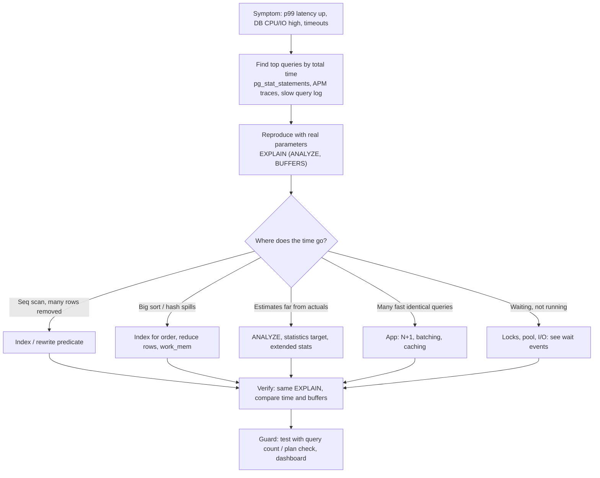
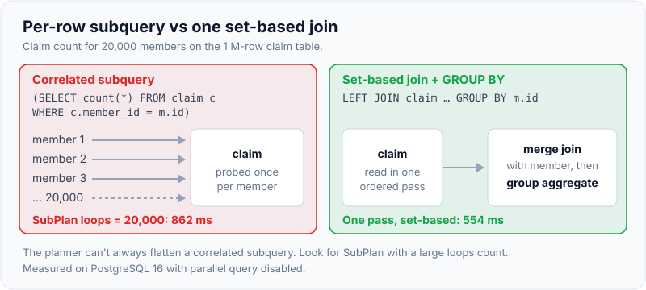

# Query Optimisation & Common Performance Issues

!!! abstract "Key takeaways"
    - **Method:** find the queries that cost the most in total (`pg_stat_statements`: calls × mean time), reproduce with real parameters, read `EXPLAIN (ANALYZE, BUFFERS)`, change one thing, verify, and add a regression guard. Don't guess.
    - **Most fixes are access-path fixes:** the right composite/partial/expression index, keeping columns bare in predicates, and letting an index provide order for `ORDER BY … LIMIT`. Measured: top-10 by amount went from **308 ms** (scan + top-N sort) to **0.085 ms** with an index on `amount DESC`.
    - **Shape the query:** select only needed columns, replace per-row correlated subqueries with joins/aggregates (862 ms → 554 ms here), use `EXISTS` for existence, keyset instead of deep `OFFSET`, and a trigram GIN index for `LIKE '%term%'` (257 ms → 6 ms).
    - **Plans depend on statistics and parameters:** stale stats or skewed data cause wrong estimates; a **generic plan** for a prepared statement on a skewed column ran **44.8 ms vs 9.4 ms** for the custom plan. Know `ANALYZE`, extended statistics and `plan_cache_mode`.
    - Many "database problems" start in the application: **N+1** queries, chatty round trips, missing batching, long transactions and connection storms. Fix those before tuning the server.

## Why it matters

When a service slows down, the database is often where the time goes, and the fix is usually a query or an index rather than a bigger instance. Interviewers want to hear a **method**, not a list of tips: how you find the expensive query, how you read the plan, what you change and how you prove it helped. Senior candidates also connect database symptoms to application causes (ORM N+1, missing batching, pool exhaustion).

All measurements below come from the same 1-million-row `claim` table used on the [indexes page](02-indexes-and-explain-analyze.md), PostgreSQL 16, parallel query disabled.

## Core concepts

### The method


*Notice that the first step is ranking by **total** time (calls × mean). A 2 ms query called 50,000 times a minute usually matters more than a 3-second report that runs once an hour.*

```sql
-- Requires shared_preload_libraries = 'pg_stat_statements' and CREATE EXTENSION pg_stat_statements
SELECT queryid,
       calls,
       round(total_exec_time)                       AS total_ms,
       round(mean_exec_time, 2)                     AS mean_ms,
       round(100 * total_exec_time / sum(total_exec_time) OVER (), 1) AS pct,
       rows,
       left(query, 80)                              AS query
FROM pg_stat_statements
ORDER BY total_exec_time DESC
LIMIT 15;
```

Also useful: `auto_explain` (logs plans of slow statements with `log_min_duration`), `log_min_duration_statement`, wait events in `pg_stat_activity` (is it running, or waiting on locks/IO/the client?), and APM traces that show which endpoint issues which SQL.

### Measured fixes

| Problem | Before | After | Fix |
|---|---|---|---|
| `ORDER BY amount DESC LIMIT 10` | Seq scan + top-N heapsort, **308 ms** | Index scan, **0.085 ms** | Index `(amount DESC)` provides the order; stops after 10 rows |
| Sorting all 1 M rows | `external merge Disk: 24 MB` at `work_mem = 4MB` (1.6 s); in-memory quicksort at 256 MB (2.1 s) | — | The real fix is not sorting a million rows (index order, filter first, keyset) rather than raising `work_mem` |
| `LIKE '%ber4242@%'` | Seq scan, **257 ms** | Bitmap scan on trigram GIN, **5.9 ms** | `CREATE INDEX … USING gin (email gin_trgm_ops)` |
| Count per member via correlated subquery (20,000 members) | SubPlan executed 20,000 times, **862 ms** | Merge join + group aggregate, **554 ms** | Rewrite as `LEFT JOIN … GROUP BY` (or aggregate first) |
| `member_id = ? OR lower(email) = ?` | — | `BitmapOr` of two indexes, **0.26 ms** | Each OR branch needs its own usable index |
| Prepared `status = $1`, skewed column, generic plan | Bitmap heap scan, **44.8 ms** for the rare value | Custom plan: index-only scan, **9.4 ms** | `plan_cache_mode`, or avoid generic plans for skewed predicates |
| Lookup with function on the column (`lower(email)`) | Seq scan, 531 ms | Expression index, 0.14 ms | Index the expression (from the indexes page) |

Note the `work_mem` row: spilling to disk wasn't slower than the in-memory sort in this run. `work_mem` matters when many sorts or hashes spill under load, but the bigger win is almost always avoiding the large sort entirely.

{ loading=lazy }
*Notice that the top-N heapsort still reads every row. The index wins because it already returns rows in `amount DESC` order, so the Limit node can stop after ten.*

### The usual culprits

**1. Missing or unusable indexes.** Sequential scans with `Rows Removed by Filter` in the hundreds of thousands. Causes and fixes are on the [indexes page](02-indexes-and-explain-analyze.md): composite order, functions or casts on columns, type mismatches from ORMs, leading wildcards.

**2. Fetching too much.**

- `SELECT *` pulls wide columns (JSONB, text) you don't use, prevents index-only scans and wastes network and memory. Select the columns the use case needs (DTO projections in JPA).
- Missing `LIMIT`, or deep `OFFSET` pagination that reads and discards rows (OFFSET 190,000 read 190,020 index entries in 45 ms vs 0.04 ms for keyset; see [pagination](../api-design/03-pagination-filtering-and-sorting.md)).

**3. Expensive sorts and aggregations.**

- `ORDER BY … LIMIT` without an index providing the order sorts the whole filtered set.
- `DISTINCT` or `UNION` (instead of `UNION ALL`) add sorts or hashes to remove duplicates you may not have.
- `COUNT(*)` over big tables for pagination totals: make totals optional or approximate.

**4. Row-by-row logic.**

- Correlated subqueries executed once per outer row (`SubPlan … loops=20000`). The planner can't always flatten them; rewrite as joins or pre-aggregate in a CTE.
- Application loops issuing one query per item (N+1): batch with `IN (…)`/`ANY(:ids)`, join, or ORM fetch strategies (see [N+1](../jpa-hibernate/03-n-plus-1-problem-and-solutions.md)).

{ loading=lazy }
*Notice the shape of the work: one probe per outer row on the left, one set-based pass on the right. `SubPlan` with a large `loops` count in `EXPLAIN` is the signal.*

**5. Predicates the planner can't use well.**

- `OR` across different columns works only if each branch has an index (BitmapOr); otherwise rewrite as `UNION ALL` of two indexed queries.
- `NOT IN` with NULLs is wrong and slow; use `NOT EXISTS`.
- Functions on columns (`date(created_at) = …`); write ranges instead: `created_at >= :d AND created_at < :d + interval '1 day'`.
- Implicit casts from wrongly typed parameters (`varchar` id compared to `bigint` column) can block index use.

**6. Bad estimates.**

- Stale statistics after bulk loads: run `ANALYZE` (autovacuum does it, but not instantly).
- Skewed or correlated columns: raise `ALTER TABLE … ALTER COLUMN … SET STATISTICS 1000`, or `CREATE STATISTICS … (dependencies, ndistinct, mcv)` for correlated predicates such as `(state, city)`.
- Symptoms: `rows=12` estimated vs `actual rows=480000`, nested loops over huge inputs, hash joins that spill.

**7. Generic plans for prepared statements.**

- JDBC (`PreparedStatement`, used by JPA/Spring) uses server-side prepared statements after `prepareThreshold` executions (5 by default in pgJDBC). PostgreSQL plans the first five executions with the actual values (custom plans), then may switch to a **generic plan** if it isn't estimated as worse on average.
- On skewed columns a generic plan can be wrong for rare or common values (measured 44.8 ms vs 9.4 ms). Options: `plan_cache_mode = force_custom_plan` for that role or session, partial indexes for the rare values, or splitting queries by value class.

**8. Locking and waiting, not computing.** If `pg_stat_activity` shows `wait_event_type = Lock`, the query is blocked by another transaction, not slow. See [MVCC, locking & deadlocks](04-mvcc-locking-and-deadlocks.md).

### Server settings that matter (and the ones that don't)

| Setting | What it does | Guidance |
|---|---|---|
| `shared_buffers` | PostgreSQL's page cache | ~25 % of RAM is the usual starting point; the OS cache does the rest |
| `effective_cache_size` | Planner's assumption about total cache | ~50–75 % of RAM; affects index vs seq scan choice |
| `work_mem` | Memory per sort/hash operation (per node, per connection) | Raise per session for reports; globally high × many connections = OOM |
| `maintenance_work_mem` | VACUUM, CREATE INDEX | Higher speeds index builds and vacuum |
| `random_page_cost` | Planner's cost of random I/O | Lower to ~1.1 on SSD/NVMe so indexes are preferred appropriately |
| `max_connections` | Hard limit on sessions | Keep modest and use a pooler (see [connection pooling](07-partitioning-replication-and-connection-pooling.md)) |
| `statement_timeout` | Kill runaway queries | Set per role/service |

Most performance problems are not solved by tuning these; they are solved by better queries and indexes. On managed services (RDS, Aurora, Cloud SQL) the defaults are already reasonable.

## In practice: code & configuration

=== "❌ Common mistake"
    ```sql
    -- Everything, for everyone, sorted in the database, filtered in Java
    SELECT * FROM claim ORDER BY service_date DESC;                    -- 1 M rows to the app

    -- Function on the column + correlated subquery per row
    SELECT m.id, m.name,
           (SELECT count(*) FROM claim c WHERE c.member_id = m.id AND date(c.service_date) = current_date)
    FROM member m;

    -- Contains search on a plain column
    SELECT * FROM claim WHERE email LIKE '%' || :fragment || '%';
    ```

=== "✅ Correct approach"
    ```sql
    -- Only needed columns, filtered and limited in SQL, index provides the order
    SELECT id, status, amount, service_date
    FROM claim
    WHERE member_id = :memberId
    ORDER BY service_date DESC, id DESC
    LIMIT 20;                                          -- index (member_id, service_date DESC, id DESC)

    -- Range predicate on the bare column + aggregate-then-join
    WITH today AS (
        SELECT member_id, count(*) AS claims_today
        FROM claim
        WHERE service_date >= current_date AND service_date < current_date + 1
        GROUP BY member_id
    )
    SELECT m.id, m.name, coalesce(t.claims_today, 0) AS claims_today
    FROM member m LEFT JOIN today t ON t.member_id = m.id;

    -- Contains search backed by a trigram index (or a search engine for real full-text needs)
    CREATE INDEX CONCURRENTLY claim_email_trgm ON claim USING gin (email gin_trgm_ops);
    SELECT id, email FROM claim WHERE email LIKE '%' || :fragment || '%' LIMIT 50;
    ```

```properties
# Spring Boot / pgJDBC: control prepared-statement behaviour if generic plans hurt
spring.datasource.hikari.data-source-properties.prepareThreshold=5        # default; 0 disables server-side prepare
# Or per role, in the database:
#   ALTER ROLE claims_service SET plan_cache_mode = 'force_custom_plan';
spring.datasource.hikari.data-source-properties.options=-c statement_timeout=5000
```

**Regression guard:** for critical endpoints, add integration tests against PostgreSQL (Testcontainers) that assert query counts (Hibernate statistics) and, for key queries, that `EXPLAIN` doesn't contain `Seq Scan` on large tables.

## Real-world usage

- **pg_stat_statements** is enabled by default on Amazon RDS/Aurora and most managed services, and is the standard first stop; AWS **Performance Insights** and similar tools rank queries by load and show wait events.
- **Trigram indexes** back admin "search by partial email or name" screens before teams invest in Elasticsearch.
- **Generic-plan regressions** are a known class of incidents after traffic shifts: a query that ran with custom plans in testing switches to a generic plan in production after five executions and becomes slow for one class of values.
- **Typical incident:** a new dashboard query with `ORDER BY created_at DESC LIMIT 50` on a 300-million-row table ran a full sort on every request; one composite index turned it into a sub-millisecond index scan.

## Trade-offs & production gotchas

| Fix | Pros | Cons | Use when |
|---|---|---|---|
| New index | Big read wins | Write cost, space, build time | Frequent, selective access paths |
| Query rewrite | No storage cost | Needs code changes and testing | Correlated subqueries, OR, functions on columns |
| Higher `work_mem` (per session) | Fewer spills | Memory × connections | Reports, batch jobs |
| Materialized view / summary | Very fast reads | Staleness, refresh cost | Heavy aggregates read often |
| Read replica | Offloads reads | Replication lag | Reports, analytics, read-heavy APIs |
| Caching (Redis) | Removes queries entirely | Invalidation, staleness | Hot, rarely changing results |
| `force_custom_plan` | Correct plans on skewed data | Planning cost per execution | Skewed predicates in prepared statements |

!!! warning "Gotcha: optimising the wrong query"
    The slowest single query is often not the biggest cost. Rank by total time and by calls; fix the query that dominates load.

!!! warning "Gotcha: testing with toy data"
    Plans change with data size and distribution. A query that uses an index on 1,000 rows may sequential-scan on 10 million (or vice versa). Test with production-like volumes and statistics.

!!! warning "Gotcha: raising work_mem globally"
    It's per sort/hash node per connection. A complex query can use several multiples, times hundreds of connections. Raise it per role or per session for the queries that need it.

## How this connects to my experience

- **Where I used it:** not ★. Relational databases at Deloitte (RDS, plus Elasticsearch for search) and elsewhere; at OptumRx the same method applies to MongoDB (`explain()`, profiler, compound indexes) and to the GraphQL layer's upstream calls (N+1 batching with DataLoader). *[confirm a performance issue you diagnosed end to end]*
- **Talking points:**
    - "My order is: rank by total time, reproduce with real parameters, read the plan, fix the access path, verify with the same plan, then add a guard test."
    - "Half of database load problems I've seen came from the application side: N+1 queries, missing batching, or fetching whole entities for list screens."
    - "For search-like features I use trigram indexes for small cases and a search engine (Elasticsearch, as at Deloitte) for real full-text needs."
- **Likely follow-up chain:** "An endpoint is slow, what do you do?" → method → "The plan shows a seq scan" → index / predicate rewrite → "It still picks the wrong plan" (statistics, generic plans) → "What server settings matter?" → "How do you stop regressions?"

## Interview questions

### Fundamentals

??? question "Q1. How do you find which queries to optimise?"
    **Answer:** Rank queries by total time (calls × mean) with `pg_stat_statements` or APM, also look at the slow-query log and `auto_explain` for outliers, and check wait events to separate slow execution from waiting on locks. Then reproduce the top ones with real parameters.

    **Interviewer listens for:** total time not just slowest, pg_stat_statements, wait events.

    **Common wrong answer:** "Look for the query that takes the longest once."

??? question "Q2. What's wrong with SELECT *?"
    **Answer:** It reads and transfers columns you don't need (often wide JSONB/text), blocks index-only scans, breaks when columns are added or reordered in code that depends on positions, and in ORMs loads full entities when a projection would do.

    **Interviewer listens for:** I/O and network, index-only scans, fragility, projections.

    **Common wrong answer:** "It's only a style issue."

??? question "Q3. How can an index make ORDER BY … LIMIT fast?"
    **Answer:** If an index stores rows in the requested order (matching columns and direction, after any equality filters), PostgreSQL walks the index and stops after N rows instead of sorting the whole set. Measured: 308 ms (scan + top-N sort) → 0.085 ms with an index on `amount DESC`.

    **Interviewer listens for:** order provided by the index, early stop, column order and direction.

    **Common wrong answer:** "LIMIT always makes queries fast."

??? question "Q4. How do you speed up LIKE '%term%'?"
    **Answer:** B-tree indexes can't help with a leading wildcard. Use the `pg_trgm` extension with a GIN (or GiST) trigram index, which supports `LIKE`/`ILIKE` with wildcards and similarity searches (measured 257 ms → 5.9 ms). For relevance-ranked full-text search use PostgreSQL full-text search (`tsvector`) or a search engine.

    **Interviewer listens for:** trigram index, full-text alternatives.

    **Common wrong answer:** "Add a normal index on the column."

### Intermediate

??? question "Q5. Why are correlated subqueries sometimes slow, and how do you rewrite them?"
    **Answer:** A correlated subquery references the outer row, so it may execute once per outer row (`SubPlan … loops=20000`). Rewrite as a join with `GROUP BY`, or aggregate the inner table first in a CTE and join the result, letting the planner use hash or merge joins (measured 862 ms → 554 ms).

    **Interviewer listens for:** per-row execution, aggregate-then-join.

    **Common wrong answer:** "Subqueries are always slower than joins." Sometimes the planner flattens them; check the plan.

??? question "Q6. What causes estimated rows to be far from actual rows, and why does it matter?"
    **Answer:** Stale statistics, skewed distributions beyond what the histogram captures, correlated columns (the planner assumes independence), and expressions it can't estimate. Wrong estimates lead to wrong join methods and orders (nested loops over huge inputs, under-sized hashes). Fix with `ANALYZE`, higher statistics targets, extended statistics, or simpler predicates.

    **Interviewer listens for:** causes, impact on plan choice, fixes.

    **Common wrong answer:** "Estimates don't matter; the database adapts at run time."

??? question "Q7. What are generic and custom plans?"
    **Answer:** For prepared statements, PostgreSQL first builds custom plans using the actual parameter values (five times by default), then may switch to a cached generic plan that ignores the specific values if its estimated cost isn't worse. On skewed data a generic plan can be poor for some values (measured 44.8 ms vs 9.4 ms). `plan_cache_mode` (`auto`, `force_custom_plan`, `force_generic_plan`) controls the behaviour.

    **Interviewer listens for:** five custom executions, switch to generic, skew problem, plan_cache_mode.

    **Common wrong answer:** "Prepared statements always use the best plan for each value."

??? question "Q8. When does raising work_mem help, and what's the risk?"
    **Answer:** When sorts or hash operations spill to disk (`external merge Disk:`), raising `work_mem` for that session or role keeps them in memory. The risk: it applies per operation per connection, so a high global value with many connections and complex plans can exhaust RAM. Prefer per-session settings for reports, and avoid huge sorts with indexes and filters.

    **Interviewer listens for:** spills, per-node per-connection, scoped settings.

    **Common wrong answer:** "Set work_mem to several GB globally."

### Senior

??? question "Q9. A query is fast in staging but slow in production. What do you check?"
    **Answer:** Data volume and distribution (plans change with size and skew), statistics freshness, parameter values hitting skewed data, generic plans after repeated executions, different indexes or settings (`random_page_cost`, `work_mem`), bloat, cache warmth, and concurrency (locks, I/O contention). Reproduce with production-like data and the actual parameters, and compare `EXPLAIN (ANALYZE, BUFFERS)`.

    **Interviewer listens for:** data and stats differences, parameters, generic plans, environment differences.

    **Common wrong answer:** "Production hardware is slower."

??? question "Q10. How do you stop performance regressions from reaching production?"
    **Answer:** Integration tests on real PostgreSQL with production-like data volumes for critical queries, assertions on query counts (catching N+1) and on plans for key queries, migration review for index changes, dashboards on `pg_stat_statements` per release, and alerting on p99 latency and database load with release markers.

    **Interviewer listens for:** realistic tests, query-count and plan checks, monitoring tied to releases.

    **Common wrong answer:** "Code review is enough."

??? question "Q11. When is the right fix outside the database query itself?"
    **Answer:** When the problem is call patterns: N+1 queries from an ORM, chatty request-per-item APIs, recomputing the same expensive result on every request (cache it), heavy reports on the primary (replica or warehouse), long transactions holding locks, or too many connections (pooling). Database tuning can't fix an application issuing 10,000 queries per request.

    **Interviewer listens for:** application patterns, caching, replicas, pooling.

    **Common wrong answer:** "Scale up the database instance."

### Scenario-based

??? question "Q12. p99 latency of a claims API doubled after a release. Walk through your investigation."
    **Answer:** Correlate with the release in APM; compare `pg_stat_statements` before and after for new or changed queries (calls and mean time); check for added N+1 patterns (calls per request jumped), new queries without indexes, or changed ORM fetch plans. Reproduce the worst query with `EXPLAIN (ANALYZE, BUFFERS)`, fix (index, projection, batch), verify, and add a guard test.

    **Interviewer listens for:** release correlation, query diff, N+1 check, verify and guard.

    **Common wrong answer:** "Restart the database to clear caches."

??? question "Q13. A search box filtering claims by partial member name times out. Options?"
    **Answer:** Short term: a trigram GIN index on the name column with `ILIKE '%term%'`, a minimum search length, and `LIMIT`. If users need relevance ranking, typo tolerance or many fields, move search to PostgreSQL full-text search or Elasticsearch/OpenSearch fed by CDC, keeping the OLTP query path simple.

    **Interviewer listens for:** trigram index, guard rails, search engine for richer needs.

    **Common wrong answer:** "Cache all names in the browser."

??? question "Q14. A prepared query on a skewed `status` column is fast for most calls but takes seconds for some. Explain and fix."
    **Answer:** After five executions the plan may become generic, chosen for an average value; for rare (or very common) values it's the wrong plan. Confirm by comparing `EXPLAIN EXECUTE` under `force_custom_plan` and `force_generic_plan`. Fix with `plan_cache_mode = force_custom_plan` for that role/session, a partial index for the rare values, or separate queries per value class.

    **Interviewer listens for:** generic plan diagnosis, comparison method, targeted fixes.

    **Common wrong answer:** "Disable prepared statements everywhere."

## Cheat sheet

| Concept | Remember |
|---|---|
| Method | Rank by total time → reproduce → `EXPLAIN (ANALYZE, BUFFERS)` → one change → verify → guard |
| Tools | `pg_stat_statements`, `auto_explain`, slow query log, wait events, APM |
| Access paths | Composite/partial/expression indexes; bare columns in predicates |
| Order + limit | Index in the right order → stops early (308 ms → 0.085 ms) |
| Contains search | `pg_trgm` GIN (257 ms → 5.9 ms) or a search engine |
| Row-by-row | Correlated subqueries → joins/aggregates; N+1 → batching |
| OR | Each branch indexed (BitmapOr) or `UNION ALL` |
| Estimates | `ANALYZE`, statistics target, extended statistics |
| Generic plans | 5 custom then maybe generic; skew → `force_custom_plan` (44.8 ms vs 9.4 ms) |
| Settings | shared_buffers ~25 % RAM, effective_cache_size, scoped work_mem, random_page_cost ~1.1 on SSD |
| App side | N+1, chatty calls, caching, replicas, pooling, short transactions |

## Sources
1. [PostgreSQL 16: Performance tips and Using EXPLAIN](https://www.postgresql.org/docs/16/performance-tips.html).
2. [PostgreSQL 16: pg_stat_statements](https://www.postgresql.org/docs/16/pgstatstatements.html) and [auto_explain](https://www.postgresql.org/docs/16/auto-explain.html).
3. [PostgreSQL 16: Resource consumption settings (work_mem, shared_buffers)](https://www.postgresql.org/docs/16/runtime-config-resource.html) and [planner cost constants](https://www.postgresql.org/docs/16/runtime-config-query.html).
4. [PostgreSQL 16: PREPARE and plan_cache_mode](https://www.postgresql.org/docs/16/sql-prepare.html).
5. [pgJDBC: server-side prepared statements and prepareThreshold](https://jdbc.postgresql.org/documentation/server-prepare/).
6. [PostgreSQL 16: pg_trgm](https://www.postgresql.org/docs/16/pgtrgm.html) and [extended statistics](https://www.postgresql.org/docs/16/planner-stats.html#PLANNER-STATS-EXTENDED).
7. Markus Winand, *SQL Performance Explained*.
8. All measurements on this page: PostgreSQL 16.14, 1,000,000-row test table, run while writing this page.
