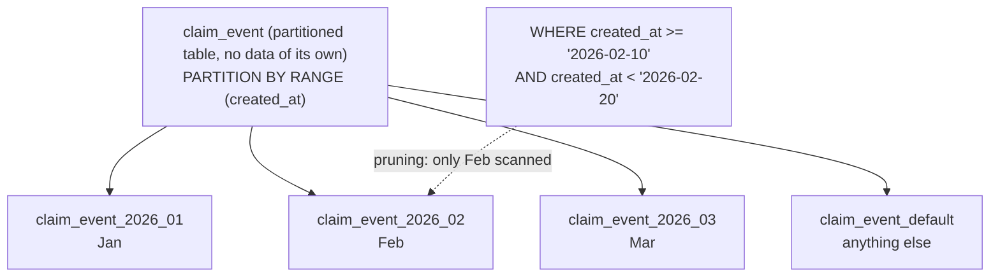
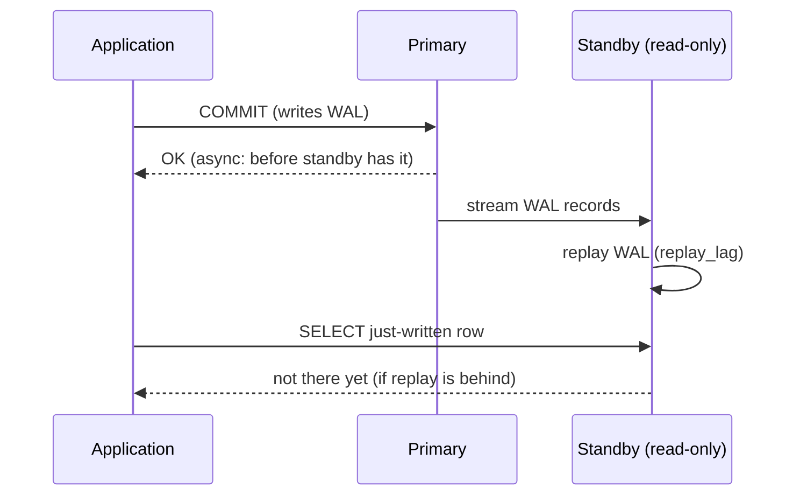
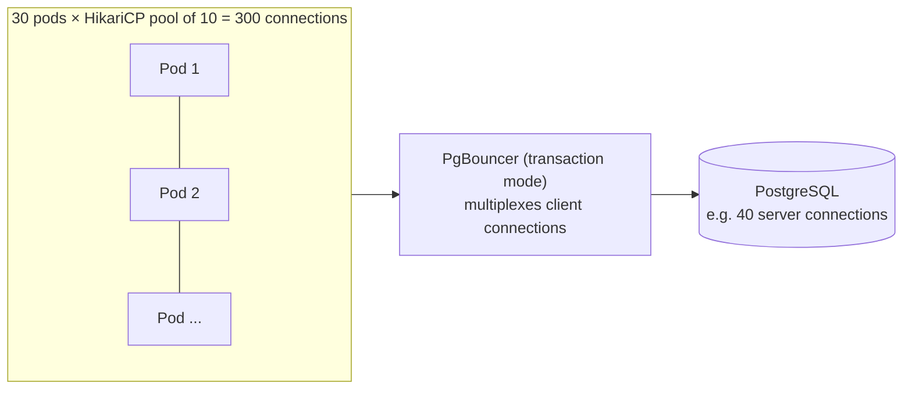

# Partitioning, Replication & Connection Pooling

!!! abstract "TL;DR"
    - **Partitioning** splits one logical table into child tables by a key (range by month, list by region, hash). Wins: **partition pruning** (a query for 10 days of February scanned only the February partition), **instant retention** (detach + drop a month in ~10 ms instead of a huge `DELETE`), smaller indexes, per-partition maintenance. Costs: queries without the partition key touch **every** partition, and **unique constraints must include the partition key**.
    - **Streaming replication** ships WAL to standbys that stay read-only (`25006 cannot execute INSERT in a read-only transaction`). It provides HA (failover) and **read scaling**, but async replicas **lag**: an immediate read after a write missed **198 of 200** rows on a local replica, and a bulk insert put it **30 MB / 360 ms** behind.
    - Route reads that need **read-your-writes** to the primary (or wait for the replica to reach the write's LSN); send reports and tolerant reads to replicas. Synchronous replication trades write latency for zero data loss on failover.
    - **Logical replication** (publications/subscriptions) copies selected tables at row level: zero-downtime major upgrades, data distribution, and CDC (Debezium uses logical decoding).
    - **Connections are expensive** in PostgreSQL (a process each). Keep app pools small (HikariCP default 10; start near `cores × 2`), and put **PgBouncer** (transaction mode) or **RDS Proxy** in front when many services/pods connect. Transaction pooling breaks session state (session advisory locks, `SET`, `LISTEN`; prepared statements need PgBouncer 1.21+).

## Why it matters

A single PostgreSQL instance goes a long way, but three problems show up as systems grow: tables with billions of rows (slow maintenance, huge indexes, painful retention deletes), read load and high-availability needs (one server is a single point of failure), and too many connections from autoscaled pods. Interviewers ask about partitioning, replicas and pooling to see whether you know what each solves, what it costs, and how lag and connection limits show up in application behaviour.

## Core concepts

### Declarative partitioning


*Notice that the parent holds no rows. Rows are routed to children by the partition key, and the planner (and executor, for parameters) skips partitions that can't match.*

| Strategy | Example | Good for |
|---|---|---|
| **RANGE** | `created_at` by month | Time series, events, logs, claims by service date: retention by dropping old partitions |
| **LIST** | `region IN ('EU')`, `tenant_tier` | Data residency, separating big tenants |
| **HASH** | `hash(member_id) % 16` | Spreading write load evenly when there's no natural range |

**Demonstrated on PostgreSQL 16** (600,000 events over three monthly partitions plus a default):

| Action | Result |
|---|---|
| Query 10 days of February | Plan scanned **only** `claim_event_2026_02` (16 ms) |
| Query `WHERE member_id = 42` (no partition key) | Plan appended scans of **all four** partitions |
| `PRIMARY KEY (id)` on a table partitioned by `created_at` | Error: *unique constraint on partitioned table must include all partitioning columns* |
| A row for 2027 with no matching partition | Landed in the `DEFAULT` partition |
| Retire January: `DETACH PARTITION` + `DROP TABLE` | **~1 ms + 9 ms**, versus a `DELETE` of 200,000 rows that would bloat the table and need vacuuming |

**Rules of thumb:**

- Partition when a table is very large (hundreds of millions of rows or more) **and** most queries or maintenance align with the partition key. Partitioning a 5-million-row table usually just adds planning overhead.
- Choose the key from **access patterns and retention**, not just size. Every hot query should filter by it.
- Keep partition counts reasonable (tens to a few thousand); create future partitions ahead of time (cron job or `pg_partman`), and keep a `DEFAULT` partition for safety.
- Indexes defined on the parent are created on every partition. Global uniqueness across partitions is only possible when the partition key is part of the constraint.
- `DETACH PARTITION … CONCURRENTLY` (PostgreSQL 14+) detaches without blocking queries on the parent.

### Partitioning vs sharding

Partitioning splits a table **inside one server**. **Sharding** splits data **across servers** (each holds a subset), which scales writes and storage beyond one machine but makes cross-shard queries, transactions and rebalancing hard. PostgreSQL itself doesn't shard; extensions and products do (Citus, which distributes tables across nodes; managed offerings built on it). See [database scaling in system design](../system-design/05-database-scaling-replication-sharding-partitioning-consisten.md).

### Streaming replication


*Notice that with asynchronous replication the commit is acknowledged before the standby has replayed it. That gap is replication lag, and it's why reading from a replica right after a write can miss the write.*

- **Physical streaming replication** sends the WAL byte stream; the standby is an exact copy of the whole cluster, read-only (hot standby). Set up with `pg_basebackup -R` (as done here: state `streaming`, `sync_state async`).
- **Asynchronous** (default): no extra commit latency, but a failover can lose the last transactions not yet received.
- **Synchronous** (`synchronous_standby_names`, `synchronous_commit = on | remote_apply`): the commit waits for the standby, so no committed data is lost on failover (and with `remote_apply`, reads on that standby see the commit), at the cost of write latency and availability if the standby is down (use `ANY 1 (s1, s2)` quorum).
- **Monitoring:** `pg_stat_replication` on the primary (`write_lag`, `flush_lag`, `replay_lag`, LSN difference) and `now() - pg_last_xact_replay_timestamp()` on the standby.
- **Replication slots** stop the primary from removing WAL a standby still needs, but an abandoned slot fills the primary's disk.

**Demonstrated:** writing to the standby failed with `25006 cannot execute INSERT in a read-only transaction`; inserting 200 rows on the primary and immediately reading each one on the standby missed **198/200** (even on the same machine); after a bulk insert of 400,000 wide rows the standby was **30 MB / 360 ms** behind.

### Using replicas from an application

| Read type | Where | Why |
|---|---|---|
| Read right after the user's own write (profile update confirmation, "my orders") | **Primary** | Read-your-writes |
| Reads inside a write transaction | Primary | Same transaction |
| Dashboards, search pages, reports, exports | Replica | Tolerates seconds of lag |
| Cross-checks before money movement | Primary | Must be current |

Techniques: route by transaction type (Spring `AbstractRoutingDataSource` keyed on `@Transactional(readOnly = true)`, wrapped in a `LazyConnectionDataSourceProxy` so routing happens after the transaction is known), **sticky-to-primary for a few seconds after a user writes**, or record the write's LSN and only use a replica once `pg_last_wal_replay_lsn()` has passed it. Aurora's reader endpoint and RDS read replicas follow the same model (Aurora replicas share storage, so lag is typically tens of milliseconds, but still not zero).

### Failover and HA

- Promotion: `pg_ctl promote` / `pg_promote()` makes a standby the new primary; clients must reconnect to it (DNS/VIP/proxy change).
- Orchestrators: **Patroni** (with etcd/Consul for leader election), repmgr, or managed services (RDS Multi-AZ with synchronous standby, Aurora with shared storage and fast failover).
- **Split brain** (two primaries) is the main danger; orchestrators fence the old primary using a consensus store.
- Applications need reconnect logic and short connection lifetimes so pools don't keep sockets to a dead primary (HikariCP `maxLifetime`, DNS TTLs, AWS JDBC wrapper for fast failover).

### Logical replication and CDC

- Publications (`CREATE PUBLICATION … FOR TABLE claim`) and subscriptions copy **row changes** for chosen tables between databases, even across major versions.
- Uses: zero-downtime major-version upgrades (replicate to the new cluster, switch over), consolidating or splitting databases, feeding analytics.
- **Logical decoding** is also how CDC tools (Debezium, AWS DMS) stream changes into Kafka for the outbox pattern and read models. Requires `wal_level = logical` and careful slot monitoring.

### Connection pooling


*Notice what the pooler buys: hundreds of mostly idle client connections share a few dozen busy server connections, because a server connection is only assigned for the duration of a transaction.*

- **Why connections are expensive:** each PostgreSQL connection is a separate OS process with its own memory (several MB, more with large `work_mem` usage); thousands of them waste RAM, increase context switching and snapshot overhead, and `max_connections` (default 100) caps them.
- **Application pool (HikariCP)**: Spring Boot's default pool, `maximumPoolSize` default **10**. Bigger isn't faster: the database can only run about as many queries in parallel as it has cores (plus some I/O wait). HikariCP's guidance: start around `(cores × 2) + effective spindles` **for the database server's cores**, then measure. Set `connectionTimeout` (default 30 s; lower it so callers fail fast), `maxLifetime` below any network/DB idle timeout, and `leakDetectionThreshold` in non-production.
- **Total connections = pods × pool size.** With autoscaling, 50 pods × 10 = 500 connections can exceed `max_connections` during a scale-out. Size per pod accordingly or add a proxy.
- **PgBouncer** modes: **session** (one server connection per client connection, little benefit), **transaction** (server connection held only during a transaction, the common choice), **statement** (per statement, no multi-statement transactions). Transaction mode breaks anything that relies on session state between transactions: session-level advisory locks, `SET` without `LOCAL`, `LISTEN/NOTIFY`, temporary tables across transactions, and server-side prepared statements on PgBouncer < 1.21 (1.21+ supports them with `max_prepared_statements`; older setups use `prepareThreshold=0` in pgJDBC).
- **RDS Proxy** (AWS) is a managed pooler with IAM auth and faster failover; it "pins" sessions that use session state, reducing multiplexing.

## In practice: code & configuration

=== "❌ Common mistake"
    ```yaml
    spring:
      datasource:
        hikari:
          maximum-pool-size: 200        # per pod; 20 pods = 4,000 connections to a 16-core database
          connection-timeout: 30000      # requests hang 30 s when the pool is exhausted
    # Every read goes to the replica, including "show me what I just saved"
    ```

=== "✅ Correct approach"
    ```yaml
    spring:
      datasource:
        hikari:
          maximum-pool-size: 10                 # measure; total = pods × size must fit the DB (or the proxy)
          minimum-idle: 10                      # fixed-size pool, recommended by HikariCP
          connection-timeout: 2000              # fail fast instead of piling up requests
          max-lifetime: 1500000                 # 25 min, below network/DB idle timeouts
          leak-detection-threshold: 0           # enable (e.g. 20000) in test environments
          data-source-properties:
            ApplicationName: claims-service     # visible in pg_stat_activity
    ```

    ```java
    // Route readOnly transactions to a replica; everything else to the primary.
    public class ReadWriteRoutingDataSource extends AbstractRoutingDataSource {
        @Override
        protected Object determineCurrentLookupKey() {
            return TransactionSynchronizationManager.isCurrentTransactionReadOnly() ? "replica" : "primary";
        }
    }

    @Bean
    @Primary
    DataSource dataSource(DataSource primary, DataSource replica) {
        var routing = new ReadWriteRoutingDataSource();
        routing.setTargetDataSources(Map.of("primary", primary, "replica", replica));
        routing.setDefaultTargetDataSource(primary);
        routing.afterPropertiesSet();
        return new LazyConnectionDataSourceProxy(routing);   // pick the target when the first statement runs
    }

    @Transactional(readOnly = true)   // -> replica: dashboard, tolerates lag
    public DashboardView dashboard(Long memberId) { ... }

    @Transactional                    // -> primary: write, then read-your-writes in the same transaction
    public ProfileView updateProfile(Long memberId, ProfileUpdate update) { ... }
    ```

```sql
-- Monthly range partitions with a default; create next months ahead of time (cron/pg_partman)
CREATE TABLE claim_event (
    id         BIGINT GENERATED ALWAYS AS IDENTITY,
    member_id  INT         NOT NULL,
    created_at TIMESTAMPTZ NOT NULL,
    kind       TEXT,
    PRIMARY KEY (id, created_at)                 -- must include the partition key
) PARTITION BY RANGE (created_at);
CREATE TABLE claim_event_2026_10 PARTITION OF claim_event FOR VALUES FROM ('2026-10-01') TO ('2026-11-01');
CREATE TABLE claim_event_default PARTITION OF claim_event DEFAULT;
CREATE INDEX ON claim_event (member_id, created_at);   -- created on every partition

-- Retention: instant, no bloat
ALTER TABLE claim_event DETACH PARTITION claim_event_2024_09 CONCURRENTLY;
DROP TABLE claim_event_2024_09;                        -- or archive it to cold storage first
```

## Real-world usage

- **Time-partitioned event and audit tables** (monthly or daily) are standard in healthcare and finance, where retention rules (keep 7 years, then purge) map directly to dropping partitions.
- **Read replicas** behind a reader endpoint (RDS, Aurora, Cloud SQL) carry reporting and read-heavy API traffic; teams that route "my latest data" reads to replicas get support tickets about saves that "didn't work".
- **PgBouncer** is the default answer for Kubernetes deployments with many pods; GitLab, Heroku and others run it in front of PostgreSQL. **RDS Proxy** fills the same role on AWS, especially for Lambda functions that would otherwise open a connection per invocation.
- **Logical replication** powers zero-downtime major upgrades and the CDC pipelines (Debezium → Kafka) behind outbox patterns and search indexes.
- **Incident pattern:** an autoscaling event doubled pods, the total pool size exceeded `max_connections`, new pods failed with *too many clients already*, health checks failed, and the deployment rolled back in a loop. A proxy and smaller per-pod pools fixed it.

## Trade-offs & production gotchas

| Option | Pros | Cons | Use when |
|---|---|---|---|
| Range partitioning | Pruning, instant retention | Queries without the key scan all partitions; PK must include the key | Large time-series tables |
| Hash partitioning | Even spread | No pruning for ranges; no retention benefit | Write hot spots without a natural range |
| Async replica | No write latency | Lag; possible data loss on failover | Read scaling, DR |
| Sync replica | No data loss on failover | Write latency; availability depends on standby | Financial/clinical primary data |
| Logical replication | Selective, cross-version | Doesn't replicate DDL or sequences automatically | Upgrades, CDC, distribution |
| Larger app pools | Fewer waits at low load | DB overload, more contention | Rarely the right fix |
| PgBouncer transaction mode | Many clients, few server connections | Session features break | Many pods/services |
| RDS Proxy | Managed, IAM, failover help | Cost, pinning | AWS, Lambda, many clients |

!!! warning "Gotcha: reading your own write from a replica"
    Async replicas are behind by design (198/200 immediate reads missed here). Route read-your-writes paths to the primary or wait for the LSN.

!!! warning "Gotcha: bigger pools make things slower"
    More connections than the database can execute in parallel means more queuing inside the database, more lock contention and more memory. A pool of 10–30 per service against a modest server usually beats 200.

!!! warning "Gotcha: partitioning without the key in queries"
    If the main queries don't filter on the partition key, every query fans out to all partitions and partitioning makes things slower. Choose the key from the queries.

## How this connects to my experience

- **Where I used it:** not ★. AWS RDS/Aurora-style deployments at Deloitte (ConvergeHealth, with DynamoDB and S3 alongside), HikariCP in every Spring Boot service, and at OptumRx MongoDB replica sets, whose read preferences and replication lag are the same concepts (see [MongoDB replica sets](../mongodb/04-replica-sets-read-write-concerns.md)). *[confirm whether read replicas or partitioning were used]*
- **Talking points:**
    - "Pool size is a database-capacity decision: total connections across pods must fit, so I keep pools small, fail fast on acquisition, and add a proxy when pods autoscale."
    - "Replica reads are for lag-tolerant views; anything that must reflect the user's last write goes to the primary."
    - "Time-based partitioning makes retention a metadata operation instead of a massive delete, which matters in healthcare with fixed retention periods."
- **Likely follow-up chain:** "How do you scale reads?" → replicas + lag + routing → "How do you handle read-your-writes?" → "Too many connections from pods?" (pool sizing, PgBouncer modes and caveats) → "When would you partition?" (size + access pattern + retention) → "Partitioning vs sharding?"

## Interview questions

### Fundamentals

??? question "Q1. What is table partitioning and what are its benefits?"
    **Answer:** Splitting a large logical table into child tables by a partition key (range, list or hash). Queries filtering on the key scan only relevant partitions (pruning); old data can be removed by detaching and dropping a partition instantly; indexes and vacuum work on smaller units. Demonstrated: a February-only query scanned one partition; dropping a month took about 10 ms.

    **Interviewer listens for:** key types, pruning, retention, maintenance.

    **Common wrong answer:** "It spreads data across multiple servers." That's sharding.

??? question "Q2. What's the difference between partitioning and sharding?"
    **Answer:** Partitioning divides a table within one database server; sharding divides data across multiple servers, each owning a subset. Sharding scales writes and storage beyond a single machine but makes cross-shard queries, transactions and rebalancing hard. PostgreSQL partitions natively; sharding needs Citus or application-level routing.

    **Interviewer listens for:** one server vs many, trade-offs, tooling.

    **Common wrong answer:** "They're the same thing."

??? question "Q3. What does a read replica give you, and what's the catch?"
    **Answer:** A read-only copy kept up to date by streaming WAL: it offloads reads and provides a failover target. The catch is replication lag with async replication: recent writes may not be visible yet (198 of 200 immediate reads missed in the demo), and a failover can lose the last unreplicated transactions.

    **Interviewer listens for:** read scaling + HA, lag, data loss window.

    **Common wrong answer:** "Replicas are always in sync."

??? question "Q4. Why do applications use a connection pool?"
    **Answer:** Opening a PostgreSQL connection is expensive (authentication, a new backend process with its own memory), so pools reuse a fixed set of open connections. They also cap concurrency against the database, which protects it from overload. HikariCP is Spring Boot's default.

    **Interviewer listens for:** connection cost, reuse, concurrency cap.

    **Common wrong answer:** "Pools make queries run faster."

### Intermediate

??? question "Q5. How do you choose a partition key?"
    **Answer:** From the dominant access patterns and lifecycle: most queries should filter on it (so pruning applies) and retention should align with it (time ranges for events and claims). Avoid keys most queries don't use, and remember unique constraints must include the key. Use hash partitioning only when you need even spreading and there's no natural range.

    **Interviewer listens for:** query alignment, retention, unique-constraint rule.

    **Common wrong answer:** "Partition by primary key."

??? question "Q6. How do you guarantee read-your-writes when using replicas?"
    **Answer:** Send reads that must see the user's own writes to the primary (same transaction, or sticky-to-primary for a short window after a write), or track the commit LSN and use a replica only after `pg_last_wal_replay_lsn()` passes it, or use synchronous replication with `remote_apply` for that standby. Route lag-tolerant reads to replicas.

    **Interviewer listens for:** primary routing, sticky window, LSN waiting, remote_apply.

    **Common wrong answer:** "Add a sleep before reading."

??? question "Q7. How big should a HikariCP pool be?"
    **Answer:** Smaller than most people think: roughly the number of queries the database can run in parallel, often starting near `(database cores × 2) + effective spindles` total, divided across all application instances. Measure with realistic load. Bigger pools add queuing inside the database rather than throughput, and total connections (pods × pool size) must stay below `max_connections` or go through a proxy.

    **Interviewer listens for:** database-side capacity, total across pods, measurement.

    **Common wrong answer:** "Match the number of HTTP threads (200)."

??? question "Q8. What breaks with PgBouncer in transaction mode?"
    **Answer:** Anything relying on session state across transactions, because consecutive transactions may run on different server connections: session-level advisory locks, `SET` without `LOCAL`, `LISTEN/NOTIFY`, temporary tables spanning transactions, and server-side prepared statements on PgBouncer versions before 1.21 (newer versions support them with `max_prepared_statements`).

    **Interviewer listens for:** session vs transaction state, specific features, prepared-statement version detail.

    **Common wrong answer:** "Nothing; it's transparent."

### Senior

??? question "Q9. Synchronous vs asynchronous replication: how do you choose?"
    **Answer:** Async gives the lowest write latency and keeps the primary available if standbys fail, but a failover can lose recent commits. Sync makes commits wait for a standby (`on` waits for WAL flush, `remote_apply` for replay), giving zero data loss and read-after-write on that standby, at the cost of latency and dependence on standby health (mitigate with quorum `ANY 1 (s1, s2)`). Money and clinical records usually justify sync (or managed Multi-AZ); analytics replicas stay async.

    **Interviewer listens for:** RPO trade-off, latency, quorum, use-case split.

    **Common wrong answer:** "Always synchronous for safety."

??? question "Q10. What's logical replication used for, and how is it different from streaming?"
    **Answer:** Streaming (physical) replication copies the whole cluster byte-for-byte to read-only standbys of the same major version. Logical replication copies row changes for selected tables via publications and subscriptions, works across major versions, and the target is a normal writable database. Uses: zero-downtime upgrades, splitting or consolidating databases, and CDC (Debezium reads logical decoding output).

    **Interviewer listens for:** physical vs row-level, cross-version, use cases, CDC link.

    **Common wrong answer:** "Logical replication is just a slower streaming replication."

??? question "Q11. How should an application behave during a database failover?"
    **Answer:** Expect failed connections and transactions for some seconds: retry idempotent operations with backoff, keep transactions short, make sure the pool discards dead connections (validation, reasonable `maxLifetime`), use DNS/endpoints with short TTLs or a failover-aware driver/proxy, and avoid caching the primary's IP. Writes that were in flight may or may not have committed, so idempotency keys matter.

    **Interviewer listens for:** retries, pool hygiene, endpoint resolution, uncertain in-flight writes.

    **Common wrong answer:** "The database handles failover; the app doesn't need to do anything."

### Scenario-based

??? question "Q12. Users say their profile change 'didn't save', but it's in the database. What's happening?"
    **Answer:** The update went to the primary and the follow-up read was routed to a lagging async replica, which didn't have the change yet. Route that read to the primary (read-only routing only for lag-tolerant views), or use a sticky-to-primary window after writes, or return the updated data from the write call itself.

    **Interviewer listens for:** replica lag diagnosis, routing fix, returning data from the write.

    **Common wrong answer:** "Increase replica instance size."

??? question "Q13. After scaling to 60 pods, the service fails with 'too many clients already'. What do you do?"
    **Answer:** Total connections (60 × pool size) exceeded `max_connections`. Immediately reduce per-pod pool size and cap autoscaling; then put PgBouncer (transaction mode) or RDS Proxy in front so client connections are multiplexed onto a fixed number of server connections, and check for long transactions holding connections. Raising `max_connections` alone wastes memory and increases contention.

    **Interviewer listens for:** total connection math, smaller pools, proxy, root causes.

    **Common wrong answer:** "Set max_connections to 5,000."

??? question "Q14. A claims_event table has 4 billion rows; deleting data older than 7 years takes days and bloats the table. Redesign."
    **Answer:** Range-partition by event date (monthly), migrate data into partitions (new data to partitions immediately, old data in batches), make the retention job detach and drop (or archive) partitions older than the cutoff, include the date in primary keys and keep hot queries filtering on it. Pre-create future partitions automatically and keep a default partition.

    **Interviewer listens for:** range partitions, DETACH/DROP retention, migration plan, key requirements.

    **Common wrong answer:** "Run the DELETE at night."

## Cheat sheet

| Concept | Remember |
|---|---|
| Partitioning | RANGE / LIST / HASH; parent holds no rows; DEFAULT partition |
| Pruning | Only when queries filter on the key (Feb query → Feb partition) |
| Constraints | Unique/PK must include the partition key |
| Retention | `DETACH PARTITION … CONCURRENTLY` + `DROP` (~10 ms) |
| Sharding | Across servers (Citus); partitioning is within one |
| Streaming replication | WAL to read-only standbys; `pg_basebackup -R`; monitor `pg_stat_replication` |
| Lag | Async: 198/200 immediate reads missed; bulk insert → 30 MB behind |
| Sync | `synchronous_standby_names`, `remote_apply`, quorum `ANY 1 (…)` |
| Routing | `readOnly` → replica via `AbstractRoutingDataSource` + `LazyConnectionDataSourceProxy`; read-your-writes → primary |
| Logical replication | Publications/subscriptions; upgrades; CDC (Debezium) |
| HikariCP | Default 10; small fixed pools; fail fast; total = pods × size |
| PgBouncer | Transaction mode; breaks session state; prepared statements need 1.21+ |

## Sources
1. [PostgreSQL 16: Table partitioning](https://www.postgresql.org/docs/16/ddl-partitioning.html) and [ALTER TABLE DETACH PARTITION CONCURRENTLY](https://www.postgresql.org/docs/16/sql-altertable.html).
2. [PostgreSQL 16: High availability, log-shipping and streaming replication](https://www.postgresql.org/docs/16/warm-standby.html) and [pg_basebackup](https://www.postgresql.org/docs/16/app-pgbasebackup.html).
3. [PostgreSQL 16: Synchronous replication and synchronous_commit](https://www.postgresql.org/docs/16/warm-standby.html#SYNCHRONOUS-REPLICATION).
4. [PostgreSQL 16: Logical replication](https://www.postgresql.org/docs/16/logical-replication.html).
5. [HikariCP: About pool sizing](https://github.com/brettwooldridge/HikariCP/wiki/About-Pool-Sizing) and [configuration](https://github.com/brettwooldridge/HikariCP#gear-configuration-knobs-baby).
6. [PgBouncer: pooling modes and features](https://www.pgbouncer.org/features.html) and [1.21 release notes (prepared statements)](https://www.pgbouncer.org/changelog.html).
7. [Amazon RDS Proxy](https://docs.aws.amazon.com/AmazonRDS/latest/UserGuide/rds-proxy.html) and [Patroni](https://patroni.readthedocs.io/).
8. [Spring Framework: AbstractRoutingDataSource](https://docs.spring.io/spring-framework/docs/current/javadoc-api/org/springframework/jdbc/datasource/lookup/AbstractRoutingDataSource.html) and [LazyConnectionDataSourceProxy](https://docs.spring.io/spring-framework/docs/current/javadoc-api/org/springframework/jdbc/datasource/LazyConnectionDataSourceProxy.html).
9. Demonstrations on this page: PostgreSQL 16.14 partitioned table and a local streaming replica (pg_basebackup), run while writing this page.
