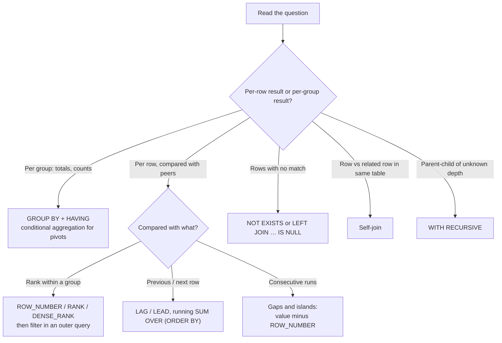
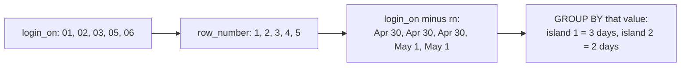

# Common SQL Interview Queries

!!! abstract "Key takeaways"
    - Almost every "tricky" SQL question is one of about eight patterns: **rank and filter** (Nth highest, top-N per group), **aggregate and filter** (`GROUP BY … HAVING`), **anti-join** (rows with no match), **self-join** (employee vs manager), **window over order** (running totals, `LAG`/`LEAD`), **gaps and islands** (streaks, missing ranges), **conditional aggregation** (pivot) and **recursion** (hierarchies).
    - Say out loud how you handle **ties**: `ROW_NUMBER` picks one arbitrarily, `RANK` leaves gaps, `DENSE_RANK` doesn't. "Second highest salary" usually means the second highest *distinct* value.
    - Watch the **NULL traps**: `NOT IN` against a subquery that contains a NULL returns no rows (measured: 0 rows instead of 5). Use `NOT EXISTS`. `COUNT(col)` skips NULLs, while `COUNT(*)` doesn't.
    - A filter on the outer table of a `LEFT JOIN` belongs in `ON`, not `WHERE`, or the join quietly becomes an inner join (measured: 3 customers instead of 5).
    - Talk through the approach first, write it in readable CTE steps, check it against edge cases (empty groups, ties, NULLs, duplicates), then mention the index that makes it fast.

## Why it matters

Most backend interviews include a live SQL exercise, usually in the first technical round. The questions are well known, so interviewers aren't testing whether you've seen them. They're testing whether you **reason about the data's shape**: what happens with ties, NULLs, empty groups and duplicate rows, and whether you can explain why one formulation is correct and another only looks correct. For a senior candidate the follow-up is almost always "how would this perform on 100 million rows?", so connect each query to the index or plan that supports it ([indexes and EXPLAIN](02-indexes-and-explain-analyze.md), [query optimisation](06-query-optimisation-and-common-performance-issues.md)).

Every query on this page was run on PostgreSQL 16 against the small dataset below. The results shown are the real output. Window functions and CTEs are standard SQL and work the same in MySQL 8+, SQL Server and Oracle, apart from the PostgreSQL-only syntax flagged along the way.

## Core concepts

### The sample schema

```sql
CREATE TABLE department(id int PRIMARY KEY, name text NOT NULL);
CREATE TABLE employee(
  id int PRIMARY KEY, name text NOT NULL,
  dept_id int REFERENCES department, manager_id int REFERENCES employee,
  salary numeric(10,2) NOT NULL, hired_on date NOT NULL);
CREATE TABLE customer(id int PRIMARY KEY, email text NOT NULL, name text);
CREATE TABLE orders(id int PRIMARY KEY, customer_id int REFERENCES customer,
  ordered_on date NOT NULL, amount numeric(10,2) NOT NULL, status text NOT NULL);
CREATE TABLE login(user_id int, login_on date, PRIMARY KEY(user_id, login_on));
```

| employee | dept | manager | salary |
|---|---|---|---|
| Asha | Engineering | (none) | 250,000 |
| Dev | Engineering | Ben | 185,000 |
| Ben, Chen | Engineering | Asha | 180,000 each (a tie) |
| Eva | Sales | Asha | 140,000 |
| Gita, Farid | Sales | Eva | 95,000 / 90,000 |
| Hiro | HR | Asha | 85,000 |
| Ines | HR | Hiro | 60,000 |

Department 4 (Legal) has no employees. Customers 1/3 and 2/5 share an email address. Customers 3 and 5 have no orders.

### Picking the pattern


*Notice that the first decision is the grain of the output. Most wrong answers come from aggregating when the question wanted rows, or the reverse.*

### Logical evaluation order

Window functions are evaluated after `WHERE`, `GROUP BY` and `HAVING`, which is why you can't filter on a window result in the same query level. Wrap it in a subquery or CTE.


*Notice that `WHERE rn = 1` can't see `rn` because `WHERE` runs before the window function exists. The same goes for column aliases defined in `SELECT`.*

### Ranking functions on ties

```sql
SELECT name, salary,
       row_number() OVER w AS rn, rank() OVER w AS rk, dense_rank() OVER w AS drk
FROM employee WINDOW w AS (ORDER BY salary DESC) LIMIT 5;
```

| name | salary | row_number | rank | dense_rank |
|---|---|---|---|---|
| Asha | 250000 | 1 | 1 | 1 |
| Dev | 185000 | 2 | 2 | 2 |
| Ben | 180000 | 3 | 3 | 3 |
| Chen | 180000 | 4 | 3 | 3 |
| Eva | 140000 | 5 | **5** | **4** |

`ROW_NUMBER` breaks the Ben/Chen tie arbitrarily unless you add a tie-breaker column. `RANK` skips 4. `DENSE_RANK` doesn't skip, so "Nth highest distinct value" is `DENSE_RANK = N`.

## In practice: the classic queries

### 1. Second (or Nth) highest salary

```sql
-- Portable, readable: Nth distinct value
SELECT DISTINCT salary
FROM (SELECT salary, dense_rank() OVER (ORDER BY salary DESC) AS dr FROM employee) t
WHERE dr = 3;                                         -- 180000.00

-- Second highest without window functions
SELECT max(salary) FROM employee
WHERE salary < (SELECT max(salary) FROM employee);   -- 185000.00

-- LIMIT/OFFSET version: DISTINCT is essential
SELECT DISTINCT salary FROM employee ORDER BY salary DESC OFFSET 1 LIMIT 1;
```

Edge cases to mention: if fewer than N distinct salaries exist, these return no row (LeetCode's version wants `NULL`, so wrap it as a scalar subquery: `SELECT (SELECT … ) AS second_highest`). Without `DISTINCT`, `OFFSET 2 LIMIT 1` returns Ben's 180,000 as the "third highest" for the wrong reason, and it breaks as soon as the tie moves.

### 2. Top-N per group

=== "❌ Common mistake"

    ```sql
    -- Fails: window results can't be filtered at the same level
    SELECT name, dept_id, salary,
           rank() OVER (PARTITION BY dept_id ORDER BY salary DESC) AS r
    FROM employee
    WHERE r = 1;          -- ERROR: column "r" does not exist

    -- Also wrong: returns the max per dept but the name is arbitrary/invalid
    SELECT dept_id, name, max(salary) FROM employee GROUP BY dept_id;
    -- ERROR: column "employee.name" must appear in the GROUP BY clause
    -- (MySQL with ONLY_FULL_GROUP_BY off returns a random name instead)
    ```

=== "✅ Better"

    ```sql
    -- Highest paid per department, keeping ties (RANK)
    SELECT d.name AS dept, e.name, e.salary
    FROM (SELECT *, rank() OVER (PARTITION BY dept_id ORDER BY salary DESC) AS r
          FROM employee) e
    JOIN department d ON d.id = e.dept_id
    WHERE r = 1;
    -- Engineering | Asha | 250000 ; HR | Hiro | 85000 ; Sales | Eva | 140000

    -- PostgreSQL shortcut: exactly one row per group
    SELECT DISTINCT ON (dept_id) dept_id, name, salary
    FROM employee ORDER BY dept_id, salary DESC, id;

    -- Top 2 per department with LATERAL: uses an index on (dept_id, salary DESC)
    SELECT d.name, t.name, t.salary
    FROM department d
    CROSS JOIN LATERAL (SELECT name, salary FROM employee e
                        WHERE e.dept_id = d.id ORDER BY salary DESC LIMIT 2) t;
    ```

Choose the ranking function to match the requirement: `ROW_NUMBER` for "exactly N rows", `RANK`/`DENSE_RANK` to include ties. On big tables, the `LATERAL … LIMIT` form with a composite index reads only N index entries per group, while the window version ranks every row.

### 3. Compare with the group average

```sql
SELECT name, dept_id, salary, round(avg_dept, 2)
FROM (SELECT *, avg(salary) OVER (PARTITION BY dept_id) AS avg_dept FROM employee) t
WHERE salary > avg_dept;
-- Asha 250000 > 198750 ; Eva 140000 > 108333.33 ; Hiro 85000 > 72500
```

The window version scans once. The correlated subquery (`WHERE salary > (SELECT avg(salary) FROM employee x WHERE x.dept_id = e.dept_id)`) is also correct, and the planner may run it per row.

### 4. Self-join: employees who earn more than their manager

```sql
SELECT e.name, e.salary, m.name AS manager, m.salary AS manager_salary
FROM employee e
JOIN employee m ON m.id = e.manager_id
WHERE e.salary > m.salary;
-- Dev | 185000 | Ben | 180000
```

An inner join drops Asha, who has no manager, which is what you want here. If the question is "list every employee with their manager's name", use a `LEFT JOIN` so the CEO still appears.

### 5. Rows with no match (anti-join) and the NOT IN trap

=== "❌ Common mistake"

    ```sql
    -- "Employees who manage nobody"
    SELECT count(*) FROM employee
    WHERE id NOT IN (SELECT manager_id FROM employee);
    -- 0   ← wrong: Asha's manager_id is NULL, so every comparison is UNKNOWN
    ```

=== "✅ Better"

    ```sql
    SELECT count(*) FROM employee e
    WHERE NOT EXISTS (SELECT 1 FROM employee x WHERE x.manager_id = e.id);
    -- 5   (Dev, Chen, Farid, Gita, Ines)

    -- Departments with no employees
    SELECT d.name FROM department d
    WHERE NOT EXISTS (SELECT 1 FROM employee e WHERE e.dept_id = d.id);   -- Legal

    -- LEFT JOIN … IS NULL form: customers with no orders
    SELECT c.id, c.name FROM customer c
    LEFT JOIN orders o ON o.customer_id = c.id
    WHERE o.id IS NULL;                                                   -- 3, 5
    ```

`x NOT IN (1, 2, NULL)` expands to `x <> 1 AND x <> 2 AND x <> NULL`. The last term is `UNKNOWN`, so the whole predicate is never `TRUE`. `NOT EXISTS` has no such problem, and PostgreSQL plans it as an anti-join.

### 6. LEFT JOIN with a filter: ON vs WHERE

```sql
-- ❌ "Paid order count per customer, including zero"
SELECT c.id, count(o.id) FROM customer c
LEFT JOIN orders o ON o.customer_id = c.id
WHERE o.status = 'PAID' GROUP BY c.id;
-- 3 rows: customers 3 and 5 vanish because o.status is NULL for them

-- ✅ filter in ON keeps unmatched customers
SELECT c.id, count(o.id) FROM customer c
LEFT JOIN orders o ON o.customer_id = c.id AND o.status = 'PAID'
GROUP BY c.id;
-- 5 rows: 1→3, 2→2, 3→0, 4→2, 5→0
```

Also note `count(o.id)`, not `count(*)`. `count(*)` would count the NULL-extended row and report 1 for customers who have no orders.

### 7. Find and delete duplicates

```sql
-- Find
SELECT email, count(*) FROM customer GROUP BY email HAVING count(*) > 1;
-- a@x.com 2 ; b@x.com 2

-- Delete, keeping the lowest id (PostgreSQL DELETE … USING)
DELETE FROM customer c USING customer d
WHERE c.email = d.email AND c.id > d.id
RETURNING c.id;                                      -- 3, 5

-- Portable version with ROW_NUMBER (also lets you choose "keep newest")
DELETE FROM customer
WHERE id IN (SELECT id FROM (
        SELECT id, row_number() OVER (PARTITION BY email ORDER BY id) AS rn
        FROM customer) t
      WHERE rn > 1);
```

In production: run it in a transaction with `RETURNING` (or a `SELECT` first), re-point foreign keys from the duplicates to the survivor before deleting, then add a `UNIQUE` constraint (or a unique index on `lower(email)`) so duplicates can't come back. When there's no key at all, PostgreSQL's `ctid` can tell otherwise identical rows apart.

### 8. Running totals, moving averages, period-over-period

```sql
SELECT id, ordered_on, amount,
       sum(amount) OVER (ORDER BY ordered_on, id)                        AS running,
       round(avg(amount) OVER (ORDER BY ordered_on, id
                               ROWS BETWEEN 2 PRECEDING AND CURRENT ROW), 2) AS mov3
FROM orders WHERE status = 'PAID';
```

| id | ordered_on | amount | running | mov3 |
|---|---|---|---|---|
| 1 | 2026-01-03 | 120 | 120 | 120.00 |
| 2 | 2026-01-20 | 80 | 200 | 100.00 |
| 3 | 2026-01-21 | 200 | 400 | 133.33 |
| 5 | 2026-02-14 | 300 | 700 | 193.33 |
| … | … | … | … | … |
| 8 | 2026-03-09 | 500 | 1335 | 211.67 |

```sql
WITH m AS (SELECT date_trunc('month', ordered_on)::date AS mon, sum(amount) AS rev
           FROM orders WHERE status = 'PAID' GROUP BY 1)
SELECT mon, rev, lag(rev) OVER (ORDER BY mon) AS prev,
       round(100 * (rev - lag(rev) OVER (ORDER BY mon)) / lag(rev) OVER (ORDER BY mon), 1) AS pct
FROM m;
-- 2026-01 400 | null | null ; 2026-02 375 | 400 | -6.3 ; 2026-03 560 | 375 | 49.3
```

!!! warning "The default frame"
    With `ORDER BY` and no frame clause, the frame is `RANGE BETWEEN UNBOUNDED PRECEDING AND CURRENT ROW`, so rows with **equal** order keys are summed together (peers). Add a unique tie-breaker (`ORDER BY ordered_on, id`) or use `ROWS` when you want strictly row-by-row totals. Months with no sales also disappear from a `GROUP BY`. Join to `generate_series` if the report must show zero months.

### 9. Gaps and islands: consecutive-day streaks

```sql
SELECT user_id, min(login_on) AS start_on, max(login_on) AS end_on, count(*) AS days
FROM (SELECT *, login_on - (row_number() OVER (PARTITION BY user_id ORDER BY login_on))::int AS grp
      FROM login) t
GROUP BY user_id, grp
HAVING count(*) >= 3;
-- user 1: 05-01..05-03 (3 days) ; user 3: 05-02..05-05 (4 days)
```


*Notice that within a run of consecutive dates both the date and the row number go up by 1, so their difference stays constant. A gap changes it. That constant is the island's id.*

The same trick finds consecutive IDs, seats or statuses. For "the same status N times in a row", compute `row_number() OVER (ORDER BY ts) - row_number() OVER (PARTITION BY status ORDER BY ts)`.

### 10. Missing numbers and ranges

```sql
-- Individual missing ids
SELECT g FROM generate_series((SELECT min(id) FROM seat), (SELECT max(id) FROM seat)) g
EXCEPT SELECT id FROM seat ORDER BY 1;           -- 4, 5, 9

-- Gap ranges with LEAD (scales without generating every number)
SELECT id + 1 AS gap_start, next_id - 1 AS gap_end
FROM (SELECT id, lead(id) OVER (ORDER BY id) AS next_id FROM seat) t
WHERE next_id > id + 1;                          -- 4..5 ; 9..9
```

### 11. Median and percentiles

```sql
SELECT percentile_cont(0.5) WITHIN GROUP (ORDER BY salary) AS median,       -- 140000
       percentile_disc(0.5) WITHIN GROUP (ORDER BY salary) AS median_disc   -- 140000.00
FROM employee;

SELECT dept_id, percentile_cont(0.5) WITHIN GROUP (ORDER BY salary)
FROM employee GROUP BY dept_id;   -- 1: 182500 (average of 185000 and 180000), 2: 95000, 3: 72500
```

`percentile_cont` interpolates between the two middle values. `percentile_disc` returns an actual value from the set. In MySQL, which lacks these aggregates, number the rows with `ROW_NUMBER` and `COUNT(*) OVER ()` and average the middle one or two.

### 12. Pivot with conditional aggregation

```sql
SELECT c.name,
       sum(o.amount) FILTER (WHERE o.ordered_on <  '2026-02-01')                          AS jan,
       sum(o.amount) FILTER (WHERE o.ordered_on >= '2026-02-01' AND o.ordered_on < '2026-03-01') AS feb,
       sum(o.amount) FILTER (WHERE o.ordered_on >= '2026-03-01')                          AS mar
FROM orders o JOIN customer c ON c.id = o.customer_id
WHERE o.status = 'PAID'
GROUP BY c.name;
-- Ann 200 | 300 | null ; Bob 200 | null | 60 ; Cy null | 75 | 500
```

`FILTER` is standard SQL and supported by PostgreSQL. The portable form is `sum(CASE WHEN … THEN amount END)`. Wrap the expression in `coalesce(…, 0)` if the report needs zeros instead of NULLs. If the set of columns isn't known in advance, pivot in the application, or use PostgreSQL's `crosstab` from `tablefunc`.

### 13. Hierarchies with a recursive CTE

```sql
WITH RECURSIVE chain AS (
  SELECT id, name, manager_id, 0 AS depth, name::text AS path
  FROM employee WHERE manager_id IS NULL               -- anchor: the root
  UNION ALL
  SELECT e.id, e.name, e.manager_id, c.depth + 1, c.path || ' > ' || e.name
  FROM employee e JOIN chain c ON e.manager_id = c.id  -- step: direct reports
)
SELECT name, depth, path FROM chain ORDER BY path;
-- Asha 0 ; Ben 1 Asha > Ben ; Dev 2 Asha > Ben > Dev ; … ; Ines 2 Asha > Hiro > Ines
```

Guard against cycles in dirty data with a depth limit or PostgreSQL 14+'s `CYCLE id SET is_cycle USING path` clause.

### 14. Other one-liners worth knowing

```sql
-- Share of total
SELECT customer_id, sum(amount) AS total,
       round(100 * sum(amount) / sum(sum(amount)) OVER (), 1) AS pct
FROM orders WHERE status = 'PAID' GROUP BY customer_id;   -- 4: 43.1 ; 1: 37.5 ; 2: 19.5

-- Customers active in every one of the three months (relational division via HAVING)
SELECT customer_id FROM orders
GROUP BY customer_id HAVING count(DISTINCT date_trunc('month', ordered_on)) = 3;   -- 1, 2

-- Days since the previous order
SELECT customer_id, ordered_on,
       ordered_on - lag(ordered_on) OVER (PARTITION BY customer_id ORDER BY ordered_on) AS gap_days
FROM orders;

-- NULL behaviour of aggregates
SELECT count(*), count(manager_id), count(DISTINCT dept_id) FROM employee;  -- 9, 8, 3

-- Upsert
INSERT INTO department VALUES (4, 'Legal & Compliance')
ON CONFLICT (id) DO UPDATE SET name = EXCLUDED.name;
```

Note `sum(sum(amount)) OVER ()`: the inner `sum` is the `GROUP BY` aggregate, and the outer one is a window over the grouped rows. It's legal because windows run after grouping.

## Real-world usage

These patterns aren't only interview puzzles:

- **Top-N per group:** the latest status per claim, the current price per product, the most recent address per member. In production it's typically `DISTINCT ON` or `LATERAL … LIMIT 1` backed by an index on `(entity_id, created_at DESC)`.
- **Anti-joins:** reconciliation jobs ("payments with no matching invoice"), orphan clean-up and data-quality checks before a migration.
- **Gaps and islands:** session-isation of clickstreams, SLA breach windows, user streaks, and detecting missing sequence numbers in event feeds.
- **Running totals and `LAG`:** balances, cumulative usage against a quota, churn and retention dashboards.
- **De-duplication:** cleaning data before adding a unique constraint, and merging duplicate customer or patient records (with foreign keys re-pointed first).

## Trade-offs & production gotchas

!!! warning "Correct on 9 rows, slow on 90 million"
    - **Window over the whole table:** `rank() OVER (PARTITION BY dept_id …)` sorts every row. For top-1 or top-few per group with many rows per group, prefer `LATERAL … LIMIT n` or `DISTINCT ON` with a matching composite index.
    - **`OFFSET`-based Nth:** reads and discards N rows. That's fine for small N, but the same problem as deep pagination.
    - **`generate_series` for gaps:** materialises the full range. Prefer `LEAD` when the range is huge and sparse.
    - **Correlated subqueries:** can run once per outer row. Check `EXPLAIN` for `SubPlan`.
    - **Functions on columns** in `WHERE` (`date_trunc('month', ordered_on) = …`) prevent a plain index from being used. Rewrite as a range (`ordered_on >= '2026-02-01' AND ordered_on < '2026-03-01'`).

- **Dialect differences:** `DISTINCT ON`, `FILTER`, `DELETE … USING`, `ON CONFLICT` and `percentile_cont` as an aggregate are PostgreSQL (or partly standard). MySQL uses `ON DUPLICATE KEY UPDATE` and lacks `FILTER`. SQL Server uses `TOP`, `OFFSET … FETCH` and `MERGE`. If the interviewer's dialect is unknown, ask, then write portable SQL.
- **Ties and determinism:** any `ORDER BY` without a unique key can return rows in a different order between runs. Add `id` as a tie-breaker in windows and pagination.
- **Integer division:** in PostgreSQL `5 / 2 = 2`. Multiply by `100.0` or cast to `numeric` for percentages.
- **Time zones:** `date_trunc` on a `timestamptz` depends on the session time zone, so the same query can produce different "days" for different users.

## How this connects to my experience

- **Where I used it:** not ★. SQL across Spring Boot/JPA services (relational stores at Deloitte and Johnson Controls, alongside MongoDB at OptumRx), plus Elasticsearch aggregations that answer the same "top-N per group" and "time-bucketed totals" questions. *[confirm which relational database each project used and any reporting queries you wrote by hand]*
- **Talking points:**
    - "Before writing, I check the grain of the output and how ties and NULLs should behave. That's where most bugs in reports come from."
    - "For 'latest row per entity' I use `DISTINCT ON` or `LATERAL … LIMIT 1` with a composite index, not a window over the whole table."
    - "I never use `NOT IN` with a subquery. `NOT EXISTS` is NULL-safe and plans as an anti-join."
- **Likely follow-up chain:** the second highest salary → "what if there are ties?" → "make it the Nth, per department" → "how would it perform on 100M rows?" (index on `(dept_id, salary DESC)`, LATERAL) → "now delete duplicate employees safely" (transaction, FKs, unique constraint).

## Interview questions

### Fundamentals

??? question "Q1. Write a query for the second highest salary. What if there are ties?"
    **Answer:** `SELECT max(salary) FROM employee WHERE salary < (SELECT max(salary) FROM employee);`, or `DENSE_RANK() OVER (ORDER BY salary DESC)` filtered to 2 in an outer query, or `SELECT DISTINCT salary … ORDER BY salary DESC OFFSET 1 LIMIT 1`. All three return the second highest *distinct* salary. If two people share the top salary, the answer is the next lower value, not the top value again. If there's no second value, return NULL by wrapping it in a scalar subquery.

    **Interviewer listens for:** asking or stating the tie semantics, using `DISTINCT` or `DENSE_RANK`, and the empty case.

    **Common wrong answer:** `ORDER BY salary DESC LIMIT 1 OFFSET 1` without `DISTINCT`. It returns the top salary again when two people share it.

??? question "Q2. Difference between ROW_NUMBER, RANK and DENSE_RANK?"
    **Answer:** All three number rows in window order. `ROW_NUMBER` gives unique consecutive numbers and breaks ties arbitrarily (1, 2, 3, 4). `RANK` gives tied rows the same number and then skips (1, 2, 3, 3, 5). `DENSE_RANK` gives ties the same number without skipping (1, 2, 3, 3, 4). Use `ROW_NUMBER` for "exactly N rows" or de-duplication, `RANK` for competition-style ranking, and `DENSE_RANK` for "Nth distinct value".

    **Interviewer listens for:** the tie behaviour of each, and matching the function to the requirement.

    **Common wrong answer:** "RANK and DENSE_RANK are the same", or using `ROW_NUMBER` for "Nth highest" without a deterministic tie-breaker.

??? question "Q3. Find customers who have never placed an order."
    **Answer:** `SELECT c.* FROM customer c WHERE NOT EXISTS (SELECT 1 FROM orders o WHERE o.customer_id = c.id);`, or `LEFT JOIN orders o ON … WHERE o.id IS NULL`. Both are anti-joins, and PostgreSQL plans them the same way. Avoid `NOT IN (SELECT customer_id FROM orders)`: if any `customer_id` in orders is NULL, the query returns nothing.

    **Interviewer listens for:** an anti-join, and awareness of the NULL problem with `NOT IN`.

    **Common wrong answer:** `NOT IN` with a nullable subquery column, or `INNER JOIN … WHERE o.id IS NULL`, which always returns nothing.

??? question "Q4. Find duplicate emails and delete the duplicates, keeping one row each."
    **Answer:** Find: `GROUP BY email HAVING count(*) > 1`. Delete: `DELETE FROM customer c USING customer d WHERE c.email = d.email AND c.id > d.id`, or the portable `ROW_NUMBER() OVER (PARTITION BY email ORDER BY id)` and delete where `rn > 1`. Do it in a transaction with `RETURNING`, re-point child foreign keys to the surviving row first, and add a unique constraint afterwards so duplicates can't return.

    **Interviewer listens for:** `HAVING` (not `WHERE`) on the count, a deterministic "keep" rule, and production safety.

    **Common wrong answer:** `WHERE count(*) > 1`, which is invalid because aggregates can't be used in `WHERE`.

### Intermediate

??? question "Q5. Highest-paid employee in each department, including ties."
    **Answer:** `rank() OVER (PARTITION BY dept_id ORDER BY salary DESC)` in a subquery or CTE, then `WHERE r = 1` outside. Use `ROW_NUMBER` if exactly one row is wanted (with a tie-breaker), and in PostgreSQL consider `DISTINCT ON (dept_id) … ORDER BY dept_id, salary DESC`. An alternative without window functions joins to `SELECT dept_id, max(salary) … GROUP BY dept_id` on both columns.

    **Interviewer listens for:** filtering the window result in an outer query, and the tie decision.

    **Common wrong answer:** `SELECT dept_id, name, max(salary) … GROUP BY dept_id`. It's invalid in standard SQL, and MySQL in permissive mode returns an arbitrary name.

??? question "Q6. Why can't you write WHERE rn = 1 in the same query that computes ROW_NUMBER?"
    **Answer:** Logical order of evaluation: `FROM` → `WHERE` → `GROUP BY` → `HAVING` → window functions → `SELECT` → `DISTINCT` → `ORDER BY` → `LIMIT`. When `WHERE` runs, `rn` doesn't exist yet. Wrap the query in a subquery or CTE and filter outside. Some engines (Snowflake, BigQuery, DuckDB, Teradata) add `QUALIFY` for this; PostgreSQL doesn't have it.

    **Interviewer listens for:** knowing the evaluation order, and the subquery/CTE fix.

    **Common wrong answer:** "Use HAVING rn = 1." `HAVING` also runs before window functions.

??? question "Q7. Compute a running total, and explain the default window frame."
    **Answer:** `sum(amount) OVER (ORDER BY ordered_on, id)`. With `ORDER BY` and no frame clause, the frame is `RANGE BETWEEN UNBOUNDED PRECEDING AND CURRENT ROW`, which includes all *peers* (rows with an equal sort key). So two orders on the same date both show the total including each other. Add a unique tie-breaker or specify `ROWS BETWEEN UNBOUNDED PRECEDING AND CURRENT ROW`. Use `PARTITION BY customer_id` to restart the total per customer.

    **Interviewer listens for:** `ROWS` vs `RANGE`, peers, and partitioning.

    **Common wrong answer:** a self-join summing all earlier rows (O(n²)), or not knowing why duplicate dates produce identical running totals.

??? question "Q8. Find employees who earn more than their manager."
    **Answer:** A self-join: `FROM employee e JOIN employee m ON m.id = e.manager_id WHERE e.salary > m.salary`. The inner join excludes employees without a manager, which is correct for this question. For "every employee with their manager's name" use a `LEFT JOIN` so the root of the hierarchy isn't lost.

    **Interviewer listens for:** aliasing the same table twice, the correct join direction, and inner vs left.

    **Common wrong answer:** joining `m.manager_id = e.id`, which reverses the relationship.

??? question "Q9. You LEFT JOIN customers to orders and filter on order status, and customers with no orders disappear. Why?"
    **Answer:** The filter is in `WHERE`, which runs after the join. Unmatched customers have NULL in every order column, and `NULL = 'PAID'` is not true, so the rows are removed. The `LEFT JOIN` effectively becomes an inner join. Move the condition into the `ON` clause (`ON o.customer_id = c.id AND o.status = 'PAID'`) and count `o.id` rather than `*`.

    **Interviewer listens for:** `ON` vs `WHERE` semantics with outer joins, and `count(col)` vs `count(*)`.

    **Common wrong answer:** adding `OR o.status IS NULL` to the `WHERE`. It brings back customers with no orders, but still drops customers whose orders are all cancelled, so their zero count is lost.

### Senior

??? question "Q10. Find users with 3 or more consecutive login days."
    **Answer:** Gaps and islands. For each user, compute `login_on - row_number() OVER (PARTITION BY user_id ORDER BY login_on)`. Within a consecutive run the date and the row number both go up by one, so the difference is constant, and that constant identifies the island. Then `GROUP BY user_id, grp HAVING count(*) >= 3`, returning `min`/`max` dates for the streak. De-duplicate multiple logins per day first (`DISTINCT user_id, login_on::date`). An alternative is `LAG` to flag where a new island starts, then a running `SUM` of the flags as the island id.

    **Interviewer listens for:** the difference trick or the LAG+SUM method, handling duplicates per day, and explaining why it works.

    **Common wrong answer:** joining the table to itself three times for day+1 and day+2. It works only for exactly 3 and doesn't return streak lengths.

??? question "Q11. Top 3 products per category on a 200-million-row table: how do you make it fast?"
    **Answer:** A `ROW_NUMBER() OVER (PARTITION BY category …)` query sorts or hashes all 200M rows. If there are relatively few categories, iterate them with `LATERAL (SELECT … WHERE category_id = c.id ORDER BY sales DESC LIMIT 3)` backed by an index on `(category_id, sales DESC)`, so each category reads three index entries. For a single top row per group, `DISTINCT ON` with the same index works too. If it's a dashboard query, precompute it in a materialized view or rollup table refreshed on a schedule. Verify with `EXPLAIN (ANALYZE, BUFFERS)`.

    **Interviewer listens for:** the cost of full-table windows, LATERAL + composite index, precomputation, and measuring.

    **Common wrong answer:** "Add an index on sales." It doesn't help per-group ranking without the group column leading.

??? question "Q12. Explain the NOT IN NULL problem precisely."
    **Answer:** `x NOT IN (a, b, NULL)` means `x <> a AND x <> b AND x <> NULL`. `x <> NULL` is `UNKNOWN`, so the conjunction can only be `FALSE` or `UNKNOWN`, never `TRUE`. Rows are kept only when the predicate is `TRUE`, so the query returns zero rows. On this page's data, "employees who manage nobody" returned 0 with `NOT IN` and 5 with `NOT EXISTS`. Fixes: `NOT EXISTS`, or add `WHERE manager_id IS NOT NULL` inside the subquery. `NOT EXISTS` is also plannable as an anti-join, which `NOT IN` often isn't (it becomes a hashed subplan).

    **Interviewer listens for:** three-valued logic, the concrete consequence, and the fix.

    **Common wrong answer:** "NOT IN is just slower than NOT EXISTS." The real issue is correctness.

??? question "Q13. Show an employee's full management chain, and the total headcount under each manager."
    **Answer:** `WITH RECURSIVE`: the anchor selects the root (or the given employee), and the recursive step joins `employee e ON e.manager_id = chain.id`, carrying `depth` and a `path`. For headcount, recurse from each manager to all descendants and `GROUP BY` the starting manager. Protect against cycles with a depth limit or PostgreSQL 14+'s `CYCLE` clause, and index `manager_id`. For very deep or hot hierarchies, consider a closure table or `ltree` materialised path.

    **Interviewer listens for:** anchor + recursive member with `UNION ALL`, termination, cycles, and alternative models.

    **Common wrong answer:** a fixed number of self-joins, which assumes a known maximum depth.

### Scenario-based

??? question "Q14. A finance report shows month-over-month revenue change, but March is missing and some months show the wrong percentage. What do you check?"
    **Answer:** (1) Months with no sales vanish from `GROUP BY`: generate the month series with `generate_series` and `LEFT JOIN` the aggregates, using `coalesce(rev, 0)`. Then `LAG` compares with the true previous month instead of the last month that had sales. (2) Integer division truncates percentages: cast to `numeric`. (3) Division by zero when the previous month is 0: `NULLIF(prev, 0)`. (4) Time zones: `date_trunc` on `timestamptz` uses the session time zone, so set it explicitly (`AT TIME ZONE 'UTC'` or the business time zone). (5) Status filters: are refunds and cancellations excluded consistently?

    **Interviewer listens for:** dense date series, LAG semantics over missing rows, numeric types, and time zones.

    **Common wrong answer:** "The data must be missing", without checking how `GROUP BY` and `LAG` behave on gaps.

??? question "Q15. You need to merge duplicate patient records in a live system. How do you approach it in SQL?"
    **Answer:** Define the matching rule with the business (exact normalised email, or name + date of birth + member id) and pick a survivor rule (oldest id, or most complete record). Build a mapping table `(duplicate_id, survivor_id)` using `ROW_NUMBER() OVER (PARTITION BY match_key ORDER BY …)`. Review it, ideally with sign-off for regulated data. Then, in batches inside transactions: update child tables' foreign keys to the survivor, merge fields as agreed, soft-delete or delete the duplicates, and write an audit record. Finally add a unique constraint or index on the normalised key and fix the ingestion path that created the duplicates.

    **Interviewer listens for:** a mapping table, foreign keys, batching, auditability, and preventing recurrence.

    **Common wrong answer:** a single `DELETE … USING` on the live table, which orphans or cascades child data and leaves no audit trail.

## Cheat sheet

| Problem | Pattern |
|---|---|
| Nth highest distinct | `DENSE_RANK() OVER (ORDER BY x DESC) = N` in an outer query |
| Top-N per group | `ROW_NUMBER`/`RANK` `OVER (PARTITION BY g ORDER BY x DESC)`; big tables: `LATERAL … LIMIT N` + index `(g, x DESC)`; PG: `DISTINCT ON` |
| Filter on a window result | Subquery/CTE (no `QUALIFY` in PostgreSQL) |
| Above group average | `avg(x) OVER (PARTITION BY g)` then compare |
| No match | `NOT EXISTS` / `LEFT JOIN … IS NULL`; never `NOT IN` on a nullable column |
| Outer join + filter | Put the inner-side filter in `ON`; `count(col)` not `count(*)` |
| Duplicates | `GROUP BY … HAVING count(*) > 1`; delete with `ROW_NUMBER() > 1` or `DELETE … USING` |
| Running total | `sum(x) OVER (ORDER BY t, id)`; default frame is `RANGE` (peers) |
| Previous/next | `LAG`/`LEAD`, `NULLIF(prev, 0)` for percentages |
| Streaks | `date - row_number()` → group id |
| Missing values | `generate_series EXCEPT`, or `LEAD(id) > id + 1` |
| Median | `percentile_cont(0.5) WITHIN GROUP (ORDER BY x)` |
| Pivot | `sum(x) FILTER (WHERE …)` / `sum(CASE WHEN …)` |
| Hierarchy | `WITH RECURSIVE` anchor `UNION ALL` step; `CYCLE` clause (PG 14+) |
| Upsert | PG `ON CONFLICT … DO UPDATE`; MySQL `ON DUPLICATE KEY UPDATE` |

## Sources
1. [PostgreSQL 16: Window functions tutorial](https://www.postgresql.org/docs/16/tutorial-window.html) and [window function calls (frames)](https://www.postgresql.org/docs/16/sql-expressions.html#SYNTAX-WINDOW-FUNCTIONS).
2. [PostgreSQL 16: Aggregate functions (ordered-set: percentile_cont/disc)](https://www.postgresql.org/docs/16/functions-aggregate.html) and [FILTER clause](https://www.postgresql.org/docs/16/sql-expressions.html#SYNTAX-AGGREGATES).
3. [PostgreSQL 16: Subquery expressions (NOT IN and NULL)](https://www.postgresql.org/docs/16/functions-subquery.html).
4. [PostgreSQL 16: SELECT (DISTINCT ON, LATERAL)](https://www.postgresql.org/docs/16/sql-select.html) and [WITH queries (recursive, CYCLE)](https://www.postgresql.org/docs/16/queries-with.html).
5. [PostgreSQL 16: DELETE … USING](https://www.postgresql.org/docs/16/sql-delete.html) and [INSERT … ON CONFLICT](https://www.postgresql.org/docs/16/sql-insert.html).
6. Itzik Ben-Gan, *T-SQL Window Functions* (2nd ed.): gaps and islands, frames.
7. Markus Winand, [Modern SQL](https://modern-sql.com/) (FILTER, LATERAL, window frames across databases).
8. Demonstrations on this page: every query and result was run on PostgreSQL 16.14 against the sample schema above while writing this page.
