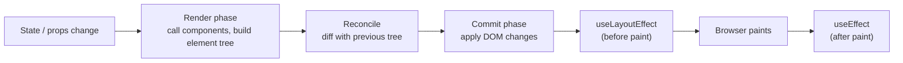
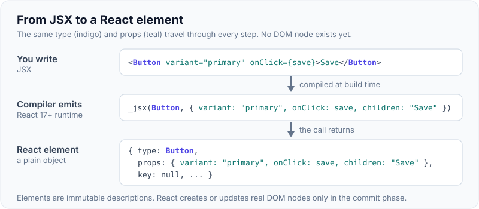
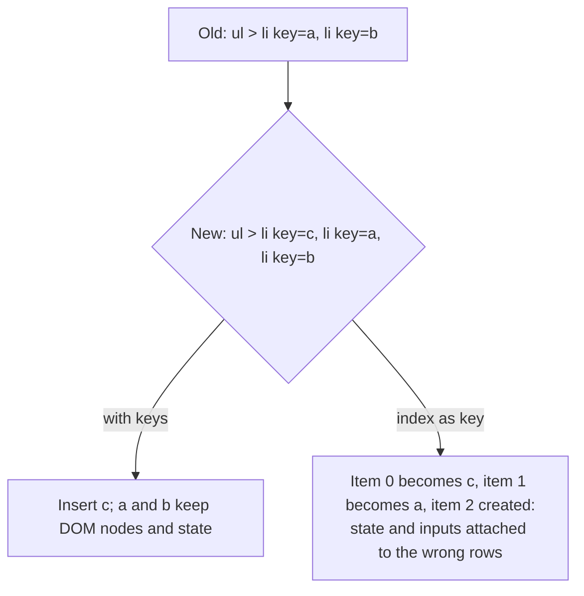

# JSX, Components, Props vs State, Reconciliation & Virtual DOM

!!! abstract "Key takeaways"
    - **JSX** is syntax for creating React elements: `<Card title="x"/>` compiles to a `jsx(Card, { title: "x" })` call (automatic runtime since React 17). Elements are plain, immutable object descriptions of UI, not DOM nodes.
    - A **component** is a function from props (and state) to elements. It must be **pure** during render: same inputs, same output, no side effects.
    - **Props** are inputs owned by the parent (read-only in the child). **State** is memory owned by the component, changed only through its setter, which **schedules a re-render**.
    - Rendering has two phases: **render** (call components, build the new element tree, diff it) and **commit** (apply the minimal DOM changes, run layout effects, then effects). Rendering is not the same as updating the DOM.
    - **Reconciliation** diffs the new tree against the previous one with two heuristics: **different element type → replace the subtree**; **same type → update props and recurse**, with **keys** identifying children in lists. The "virtual DOM" is this in-memory tree plus the Fiber data structure that schedules the work.

## Why it matters

Before React, UI code mutated the DOM imperatively: find the node, change its text, add a class, remove a row, and keep all of that in sync with data by hand. Bugs came from the DOM and the data disagreeing. React's idea: describe what the UI should look like for the current data, and let React work out the DOM operations. That only works if components are pure and state changes go through React. Almost every React interview question (why did this re-render, why did state reset, why is my value stale) comes back to this model.


*Notice that render is pure calculation and can be thrown away or repeated (Strict Mode, concurrent rendering). Only the commit touches the DOM, and effects run after it.*

## Core concepts

### JSX and elements

```jsx
// What you write
const el = <Button variant="primary" onClick={save}>Save</Button>;

// What the compiler emits (automatic runtime, React 17+)
import { jsx as _jsx } from "react/jsx-runtime";
const el = _jsx(Button, { variant: "primary", onClick: save, children: "Save" });

// What the element is: a plain object
// { type: Button, props: { variant: "primary", onClick: save, children: "Save" }, key: null, ... }
```

- Lowercase tags (`div`) are host components (DOM); capitalised names are your components.
- `{expression}` embeds JavaScript; JSX is an expression, so it can be returned, stored, mapped.
- Attributes use camelCase (`className`, `onClick`, `htmlFor`); `style` takes an object.
- Text in `{}` is escaped by default, which prevents XSS; `dangerouslySetInnerHTML` bypasses that.

{ loading=lazy }
*Notice that nothing in this chain is a DOM node. The element is just data that React reads later when it renders and commits.*

### Components

- Function components are the standard; class components are legacy (still supported, needed only for error boundaries without a library).
- A component returns elements, strings, numbers, `null`, arrays, or fragments (`<>...</>`).
- **Purity rule:** don't mutate props, state, or variables created outside during render; don't call APIs or set timers in render. Side effects go in event handlers or effects.
- **Strict Mode** in development calls components (and effects' setup/cleanup) twice to surface impurities.

### Props vs state

| | Props | State |
|---|---|---|
| Owner | Parent | The component itself |
| Changed by | Parent re-rendering with new values | The component's setter (`setX`) |
| Mutable in the child? | No (read-only) | Only via setter, never mutate directly |
| Triggers re-render | When parent re-renders | When set to a new value (`Object.is` comparison) |
| Use for | Configuration, data passed down, callbacks | Values that change over time and affect output |

Rules of thumb:

- If it can be **computed from props or other state, don't store it**: compute it during render.
- **Lift state up** to the closest common parent when two components need the same data.
- Data flows down via props; changes flow up via callback props (one-way data flow).

### State updates

- `setCount(count + 1)` doesn't change `count` immediately: it schedules a re-render with the new value. Inside the current render, `count` is a **snapshot**.
- Multiple updates in one event are **batched** into one render (React 18 batches everywhere, including promises and timeouts).
- Use the **updater form** `setCount(c => c + 1)` when the next value depends on the previous one.
- Objects and arrays must be replaced, not mutated: `setUser({...user, name})`, `setItems([...items, x])`. React compares with `Object.is`; a mutated object is the same reference, so nothing re-renders.

### Reconciliation (diffing)

A full tree diff is O(n³); React uses O(n) heuristics:

1. **Different element type at the same position** (`<div>` → `<span>`, `<A/>` → `<B/>`): unmount the old subtree (state lost), mount the new one.
2. **Same type:** keep the DOM node or component instance, update changed props, recurse into children.
3. **Lists:** children are matched by **key**. Without keys, React matches by index, so inserting at the top shifts every item's identity.


*Notice that keys are about identity, not uniqueness for its own sake. Stable keys from data keep each row's DOM node and state attached to the right item.*

{ loading=lazy }
*Watch the right-hand list: the rows never move, only their text changes, so the tick stays with position 0 and lands on Cara.*

Consequences interviewers like:

- Rendering a component **type defined inside another component** creates a new type every render → its state resets each time.
- Changing a component's `key` forces a remount: a clean way to reset state (`<Profile key={userId} />`).
- State belongs to a **position in the tree**, not to the component function.

### Virtual DOM and Fiber

- The "virtual DOM" is React's in-memory representation of the UI (elements and fibers), diffed to compute minimal DOM mutations.
- **Fiber** (React 16) is the internal data structure: one fiber per component instance with links to child, sibling and return (parent), plus pending work and priority. It lets React split rendering into units, pause and resume, and prioritise urgent updates (the basis of concurrent rendering in React 18).
- The virtual DOM isn't "faster than the DOM"; it's a way to write declarative code with acceptable performance. Frameworks like Svelte and Solid skip it with compile-time or fine-grained reactivity.

## In practice: code & configuration

### Derived state and immutable updates

=== "❌ Common mistake"
    ```tsx
    function Cart({ items }: { items: Item[] }) {
      const [total, setTotal] = useState(0);            // derived data copied into state
      useEffect(() => {
        setTotal(items.reduce((s, i) => s + i.price, 0)); // extra render, can go stale
      }, [items]);

      const [selected, setSelected] = useState<Item[]>([]);
      const select = (i: Item) => { selected.push(i); setSelected(selected); }; // mutation: no re-render
      return <p>{total}</p>;
    }
    ```

=== "✅ Correct approach"
    ```tsx
    function Cart({ items }: { items: Item[] }) {
      const total = items.reduce((s, i) => s + i.price, 0);   // compute during render

      const [selectedIds, setSelectedIds] = useState<string[]>([]);
      const select = (id: string) => setSelectedIds(prev => [...prev, id]); // new array, updater form
      return <p>{total}</p>;
    }
    ```

### Component defined inside a component

=== "❌ Common mistake"
    ```tsx
    function Form() {
      const [name, setName] = useState("");
      function Field() {                                  // new component type every render
        return <input value={name} onChange={e => setName(e.target.value)} />;
      }
      return <Field />;                                   // input remounts: focus lost on every keystroke
    }
    ```

=== "✅ Correct approach"
    ```tsx
    function Field({ value, onChange }: { value: string; onChange: (v: string) => void }) {
      return <input value={value} onChange={e => onChange(e.target.value)} />;
    }
    function Form() {
      const [name, setName] = useState("");
      return <Field value={name} onChange={setName} />;  // stable type: state and focus preserved
    }
    ```

### Resetting state with a key

```tsx
// When the selected member changes, reset the whole editor (draft text, validation) cleanly.
<MemberEditor key={memberId} memberId={memberId} />
```

## Real-world usage

- Meta built React (2013) for Facebook's newsfeed and Instagram, where many independent UI parts update from changing data. Fiber (2017) made rendering interruptible for responsiveness on large trees.
- Most large SPAs (dashboards, portals) are React; frameworks like Next.js and React Router (framework mode) add routing, data loading and server rendering on top.
- **Healthcare portals:** pure, predictable rendering makes it easier to guarantee that what a member sees matches the data (e.g. prescription status). XSS-safe escaping by default matters when displaying data from many upstream systems.

## Trade-offs & production gotchas

| Approach | Pros | Cons | Use when |
|---|---|---|---|
| Local state | Simple, colocated | Hard to share | One component needs it |
| Lifted state | Shared, single source of truth | Prop drilling, wider re-renders | Siblings need it |
| Context / external store | Avoids drilling | Re-render scope, indirection | App-wide data (see Context page) |
| Server state library (React Query) | Caching, refetching | Another dependency | Data from APIs |

!!! warning "Gotcha: index as key"
    Fine for static lists that never reorder; wrong for lists that insert, delete or sort. Inputs and component state stay attached to positions, not items.

!!! warning "Gotcha: mutating state"
    `arr.push(x); setArr(arr)` passes the same reference; `Object.is` says nothing changed, so no re-render (or a stale one later). Always create new objects/arrays.

!!! warning "Gotcha: side effects in render"
    Fetching or logging in the component body runs on every render, twice in Strict Mode, and may run for renders React throws away in concurrent mode.

!!! question "Interview angle"
    Expect: props vs state, what happens when state changes (render → reconcile → commit), why keys matter, why state resets, and what the virtual DOM really is.

## How this connects to my experience

Not ★ on its own, but the foundation for "Built the ReactJS application from the ground up and established a micro-frontend architecture" (Publicis Sapient, OptumRx Meteor). Skills list: ReactJS, Redux, React Query, Material UI, Storybook.

- **Where I used it:** the OptumRx React application and its micro-frontends, rendering member and prescription data from the GraphQL Consumer Service. *[confirm: React version, and whether the app used function components and hooks throughout]*
- **Talking points:**
    - "I set component conventions for the team: pure components, derived values computed not stored, stable keys from domain ids (prescription id), no components defined inside components." *[confirm these were team standards]*
    - "Server data lived in React Query rather than component state, so local state stayed small and UI-only." *[confirm React Query usage pattern]*
    - "Storybook made components' props contracts explicit, which helped across micro-frontend teams." *[confirm]*
- **Likely follow-up chain:** "What happens when you call setState?" → "Why didn't my component re-render after push?" → "Why did my input lose focus?" → "What's Fiber for?" → "How do you decide where state lives in a large app?"

## Interview questions

### Fundamentals

??? question "Q1. What does JSX compile to?"
    **Answer:** Function calls that create React elements: `jsx(type, props)` with the automatic runtime (React 17+), `React.createElement` before that. Elements are plain objects describing UI.

    **Interviewer listens for:** elements are descriptions, not DOM nodes.

    **Common wrong answer:** "JSX compiles to HTML" or "JSX creates DOM nodes." It creates plain JavaScript objects.

??? question "Q2. Props vs state?"
    **Answer:** Props are read-only inputs from the parent; state is the component's own memory, changed via its setter, which schedules a re-render.

    **Interviewer listens for:** ownership (parent vs component), read-only props, setter schedules a render.

    **Common wrong answer:** "Props can be changed by the child if needed." Mutating props breaks one-way data flow.

??? question "Q3. Why must components be pure?"
    **Answer:** React may call them multiple times, discard renders, or render out of order (Strict Mode, concurrent rendering). Same inputs must give the same output with no side effects, or the UI becomes unpredictable.

    **Interviewer listens for:** React can call render many times or throw renders away; Strict Mode and concurrent rendering depend on purity.

    **Common wrong answer:** "Purity is a style preference." Side effects in render cause double requests and inconsistent UI.

??? question "Q4. Why is `count` unchanged right after `setCount(count + 1)`?"
    **Answer:** State is a snapshot per render; the setter schedules a new render with the new value. Read it in the next render or use the updater form.

    **Interviewer listens for:** state snapshot per render, setter schedules a new render, updater form.

    **Common wrong answer:** "setState is asynchronous, so wait for it with await." It is not a promise; the value changes in the next render.

### Intermediate

??? question "Q5. What happens when state changes?"
    **Answer:** React schedules a render of that component (and its children by default), builds a new element tree, reconciles it against the previous one, commits minimal DOM changes, then runs layout effects and effects.

    **Interviewer listens for:** render phase, reconciliation, commit phase, then layout effects and effects.

    **Common wrong answer:** "React re-renders the whole page and replaces the DOM." It re-runs components but commits only the differences.

??? question "Q6. Why do lists need keys?"
    **Answer:** Keys give children stable identity across renders so React can match, move, insert and remove correctly and keep each item's state. Index keys break when items are inserted, removed or reordered.

    **Interviewer listens for:** stable identity, matching moves and deletions, state attached to the right item, index pitfalls.

    **Common wrong answer:** "Keys are for performance only." Wrong keys cause wrong state, not just slower renders.

??? question "Q7. What are the reconciliation heuristics?"
    **Answer:** Different type at the same position → replace subtree (state lost). Same type → keep instance, update props, recurse. Children matched by key.

    **Interviewer listens for:** type comparison at the same position, recursion, keyed children, O(n) heuristics.

    **Common wrong answer:** "React does a full tree diff." A general tree diff is O(n³); React uses heuristics to stay O(n).

??? question "Q8. Why does `setCount(count + 1)` three times only add 1?"
    **Answer:** All three use the same snapshot value. Use `setCount(c => c + 1)` to queue updates based on the latest value.

    **Interviewer listens for:** same snapshot used three times, updater form queues on latest value.

    **Common wrong answer:** "React only runs the last setState." All three run; they just set the same value.

### Senior

??? question "Q9. What is Fiber?"
    **Answer:** React's reconciler data structure (since 16): a linked tree of units of work with priorities, allowing rendering to be split, paused, resumed or abandoned. It enables concurrent features like transitions.

    **Interviewer listens for:** units of work, priorities, interruptible rendering, basis for concurrent features.

    **Common wrong answer:** "Fiber is the virtual DOM." It is the reconciler's work structure.

??? question "Q10. Is the virtual DOM faster than the real DOM?"
    **Answer:** Not inherently. It adds work (diffing). It makes declarative UI practical by batching and minimising DOM writes. Fine-grained reactive frameworks avoid it entirely.

    **Interviewer listens for:** diffing cost vs batched minimal writes, declarative model, fine-grained alternatives.

    **Common wrong answer:** "Yes, the virtual DOM is always faster." Hand-written DOM updates are faster; React trades speed for a simpler model.

??? question "Q11. How can you reset a component's state?"
    **Answer:** Change its `key` (forces remount), or render it at a different position/type. Avoid syncing props into state with effects.

    **Interviewer listens for:** key change forces remount, position/type change, avoid prop-to-state syncing effects.

    **Common wrong answer:** Copying props into state with a `useEffect` and resetting manually.

### Scenario-based

??? question "Q12. An input loses focus on every keystroke. Why?"
    **Answer:** Its component type is recreated each render (defined inside another component) or its key changes each render, so React remounts it. Move the component out and keep keys stable.

    **Interviewer listens for:** component defined inside another component, unstable key, remount on every render.

    **Common wrong answer:** "It is a CSS or browser focus bug." It is a remount caused by a new component type.

??? question "Q13. A list shows wrong checkbox states after deleting a row. Why?"
    **Answer:** Index keys: after deletion, remaining items shift indices and inherit the deleted row's state. Use stable ids as keys.

    **Interviewer listens for:** index keys shift after deletion, state moves to the wrong row, stable ids.

    **Common wrong answer:** "Use `Math.random()` as the key." That remounts every row on every render.

??? question "Q14. A component shows a stale total after items change. What do you fix?"
    **Answer:** It stores derived data in state synced by an effect. Compute the total during render (memoise only if expensive).

    **Interviewer listens for:** derived data computed in render, not stored in state; memoise only if expensive.

    **Common wrong answer:** Adding more effects to keep the stored total in sync.

## Cheat sheet

| Concept | Remember |
|---|---|
| JSX | → `jsx()` calls → plain element objects |
| Component | Pure function of props and state |
| Props | Read-only, from parent |
| State | Own memory; setter schedules a re-render; snapshot per render |
| Updates | Batched; updater form for previous-value logic; never mutate |
| Phases | Render (pure, can repeat) → commit (DOM) → layout effects → paint → effects |
| Reconciliation | Different type → replace; same type → update; keys for lists |
| Keys | Stable ids from data; changing key = remount |
| Derived data | Compute, don't store |
| Fiber | Interruptible, prioritised rendering (React 16+) |
| Strict Mode | Double render and effect setup/cleanup in dev |

## Sources

1. [react.dev: Writing Markup with JSX](https://react.dev/learn/writing-markup-with-jsx) and [Your First Component](https://react.dev/learn/your-first-component).
2. [react.dev: Keeping Components Pure](https://react.dev/learn/keeping-components-pure).
3. [react.dev: State as a Snapshot](https://react.dev/learn/state-as-a-snapshot) and [Queueing a Series of State Updates](https://react.dev/learn/queueing-a-series-of-state-updates).
4. [react.dev: Render and Commit](https://react.dev/learn/render-and-commit).
5. [react.dev: Preserving and Resetting State](https://react.dev/learn/preserving-and-resetting-state).
6. [Legacy docs: Reconciliation](https://legacy.reactjs.org/docs/reconciliation.html): diffing heuristics and keys.
7. [Introducing the new JSX Transform (React blog, 2020)](https://legacy.reactjs.org/blog/2020/09/22/introducing-the-new-jsx-transform.html).
8. [Andrew Clark: React Fiber Architecture](https://github.com/acdlite/react-fiber-architecture).
