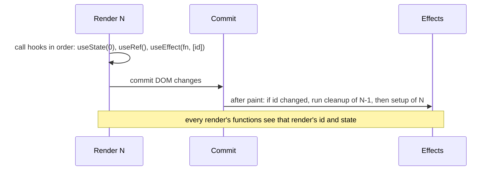
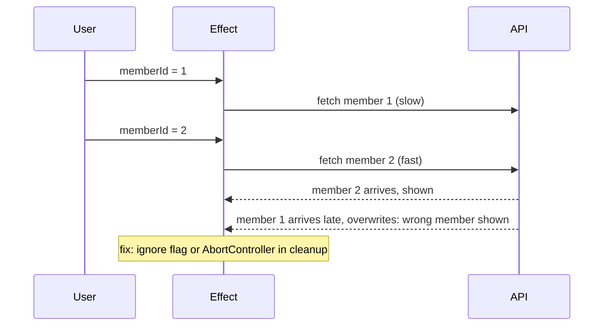

# Hooks Deep Dive: useState, useEffect, useRef, useMemo, useCallback, Custom Hooks

!!! abstract "TL;DR"
    - Hooks store per-component data in a **list indexed by call order**. That's why the **Rules of Hooks** exist: call them at the top level of components or custom hooks, never in conditions, loops or after early returns.
    - Each render's functions **close over that render's props and state** (snapshots). Stale closures come from effects, intervals or callbacks that captured an old render.
    - **`useEffect` synchronises with external systems** (subscriptions, timers, DOM APIs, network). It runs after paint; its cleanup runs before the next run and on unmount. List every reactive value it uses in the dependency array. If it's not syncing with something external, you probably don't need an effect.
    - **`useRef`** holds a mutable value that survives renders without triggering one (DOM nodes, timer ids, latest values). **`useMemo`/`useCallback`** cache a value/function between renders for performance or referential stability; with **React Compiler 1.0** most manual memoisation becomes unnecessary.
    - **`useEffectEvent`** (stable in React 19.2) lets an effect call logic that always sees the latest values without making those values dependencies. **Custom hooks** share stateful logic (not state) between components.

## Why it matters

Hooks (React 16.8, 2019) replaced class lifecycle methods and higher-order components for state and side effects. They're simpler to compose but have sharp edges: dependency arrays, stale closures, effects that loop, and over-memoisation. Interviewers use them to test whether you understand React's render model or just copy patterns.


*Notice the effect from render N sees render N's values. Cleanup of the previous effect runs first, so subscriptions never overlap.*

## Core concepts

### How hooks are stored

React keeps, per component instance (fiber), a linked list of hook slots. On each render the n-th hook call reads the n-th slot. Calling a hook conditionally shifts all later slots, so state ends up in the wrong hook. The ESLint plugin (`eslint-plugin-react-hooks`) enforces the rules and, since v6, includes React Compiler-powered checks.

### useState

- `const [value, setValue] = useState(initial)`; lazy initialiser `useState(() => expensive())` runs once.
- Setter compares with `Object.is`; same value → React may bail out.
- Updater form `setValue(v => v + 1)` for updates based on previous value.
- State is a snapshot per render; updates are batched.
- `useReducer(reducer, init)` for complex state with many transitions (and testable pure reducers).

### useEffect

- **Purpose:** synchronise with an external system, not to compute derived data or respond to events.
- **Timing:** after the browser paints (`useLayoutEffect` runs before paint, for measuring layout).
- **Dependencies:** `[]` = after mount (and cleanup on unmount); `[a, b]` = when `a` or `b` change (`Object.is`); none = after every render.
- **Cleanup:** returned function runs before the next effect and on unmount. Strict Mode in development runs setup → cleanup → setup once on mount to expose missing cleanups.
- **You might not need an effect** for: derived data (compute in render), resetting state on prop change (use a `key`), responding to a user event (do it in the event handler), fetching that a framework/data library handles.

### Fetching in effects: race conditions


*Notice the late response overwrites the newer one. Cleanup must cancel or ignore stale requests, which is why most teams use React Query or a framework loader instead.*

### useRef

- `const ref = useRef(initial)`: `ref.current` is mutable and persists; changing it doesn't re-render.
- Uses: DOM access (`<input ref={ref}>`), storing timer/subscription ids, latest value for callbacks, previous value.
- Don't read or write `ref.current` during render (except lazy init); it breaks purity. React 19: refs can be passed as a normal `ref` prop to function components (no `forwardRef`), and ref callbacks can return a cleanup function.

### useMemo and useCallback

- `useMemo(() => compute(a, b), [a, b])` caches a value; `useCallback(fn, [deps])` caches a function (= `useMemo(() => fn, deps)`).
- Use for: **expensive calculations**, or **referential stability** when passing to `memo` children or as effect dependencies.
- Not free: comparison cost, memory, and code noise. Measure.
- **React Compiler** (v1.0, Oct 2025; works with React 17+) memoises components and values automatically at build time, including after early returns, and validates the Rules of React. With it, manual `useMemo`/`useCallback`/`memo` is mostly unnecessary.

### useEffectEvent (React 19.2)

Separates "event-like" logic from the effect's reactive dependencies:

```tsx
const onConnected = useEffectEvent(() => {
  showToast("Connected", theme);     // always reads the latest theme
});
useEffect(() => {
  const conn = connect(roomId);
  conn.on("connected", onConnected);
  return () => conn.disconnect();
}, [roomId]);                        // theme is not a dependency; no reconnect on theme change
```

Effect Events must only be called from effects and are not listed as dependencies.

### Other hooks to know

| Hook | Purpose |
|---|---|
| `useContext` / `use(Context)` | Read context (`use` can be called conditionally, React 19) |
| `useReducer` | Complex state transitions |
| `useLayoutEffect` | Measure/mutate layout before paint (blocks paint) |
| `useId` | Stable unique ids for accessibility attributes, SSR-safe |
| `useTransition` / `useDeferredValue` | Concurrent: non-urgent updates (see React 18/19 page) |
| `useSyncExternalStore` | Subscribe to external stores safely with concurrent rendering |
| `useImperativeHandle` | Customise what a ref exposes |
| `useActionState` / `useOptimistic` / `useFormStatus` | React 19 Actions (forms page) |

### Custom hooks

- A function starting with `use` that calls other hooks; shares **logic**, each caller gets **its own state**.
- Good custom hooks have a clear purpose (`useOnlineStatus`, `useDebouncedValue`, `useMemberQuery`), take inputs as arguments, and return values/callbacks.
- Avoid "lifecycle" hooks (`useMount`) that hide dependencies.

## In practice: code & configuration

### Effects: fetch with cleanup vs derived state

=== "❌ Common mistake"
    ```tsx
    function Member({ id }: { id: string }) {
      const [member, setMember] = useState<Member | null>(null);
      const [fullName, setFullName] = useState("");
      useEffect(() => {
        fetch(`/api/members/${id}`).then(r => r.json()).then(setMember); // race, no cleanup
      });                                                                  // no deps: runs every render → loop
      useEffect(() => {
        if (member) setFullName(`${member.first} ${member.last}`);         // derived state via effect
      }, [member]);
      return <h1>{fullName}</h1>;
    }
    ```

=== "✅ Correct approach"
    ```tsx
    function Member({ id }: { id: string }) {
      const [member, setMember] = useState<Member | null>(null);
      useEffect(() => {
        const controller = new AbortController();
        fetch(`/api/members/${id}`, { signal: controller.signal })
          .then(r => r.json())
          .then(setMember)
          .catch(e => { if (e.name !== "AbortError") throw e; });
        return () => controller.abort();          // cancel stale request when id changes/unmount
      }, [id]);
      const fullName = member ? `${member.first} ${member.last}` : "";   // derived in render
      return <h1>{fullName}</h1>;
    }
    // In real apps: const { data } = useQuery({ queryKey: ["member", id], queryFn: ... })
    ```

### Stale closure in an interval

=== "❌ Common mistake"
    ```tsx
    useEffect(() => {
      const t = setInterval(() => setSeconds(seconds + 1), 1000);  // captures seconds = 0 forever
      return () => clearInterval(t);
    }, []);
    ```

=== "✅ Correct approach"
    ```tsx
    useEffect(() => {
      const t = setInterval(() => setSeconds(s => s + 1), 1000);   // updater: no stale value
      return () => clearInterval(t);
    }, []);
    ```

### A custom hook

```tsx
export function useDebouncedValue<T>(value: T, delayMs = 300): T {
  const [debounced, setDebounced] = useState(value);
  useEffect(() => {
    const t = setTimeout(() => setDebounced(value), delayMs);
    return () => clearTimeout(t);                  // reset timer on each change
  }, [value, delayMs]);
  return debounced;
}

// usage: search pharmacies only after typing pauses
const q = useDebouncedValue(search);
const { data } = useQuery({ queryKey: ["pharmacies", q], queryFn: () => findPharmacies(q), enabled: q.length > 2 });
```

### Linting

```js
// eslint.config.js
import reactHooks from "eslint-plugin-react-hooks";
export default [reactHooks.configs.flat.recommended];   // rules-of-hooks, exhaustive-deps, compiler rules
```

## Real-world usage

- Data fetching moved from hand-written effects to libraries (TanStack Query, SWR, Apollo/Relay) and framework loaders (React Router, Next.js) because of race conditions, caching and deduping.
- Meta reports React Compiler in production with faster interactions and fewer manual memoisation bugs; teams adopting it typically remove most `useMemo`/`useCallback` noise.
- **Healthcare UI:** effects that subscribe (websocket status updates, session timeout timers) must clean up reliably; a leaked timer can log a member out unexpectedly or keep PHI on screen after logout.

## Trade-offs & production gotchas

| Tool | Use for | Avoid for |
|---|---|---|
| `useState` | Local UI state | Derived data |
| `useReducer` | Many related transitions | Simple toggles |
| `useEffect` | Syncing with external systems | Derived data, event responses |
| `useLayoutEffect` | Measuring layout before paint | Anything else (blocks paint) |
| `useRef` | Mutable values without re-render, DOM | Values that should update UI |
| `useMemo`/`useCallback` | Proven expensive work, stable references | Everything by default (or use the Compiler) |

!!! warning "Gotcha: exhaustive-deps suppression"
    Disabling the lint rule to "fix" a loop hides stale closures. Fix the cause: move logic into the effect, use updater functions, `useEffectEvent`, or move objects out of the component.

!!! warning "Gotcha: objects and functions in dependency arrays"
    A new object/function each render makes the effect run every render. Create them inside the effect, memoise them, or depend on primitive fields.

!!! warning "Gotcha: Strict Mode double effects"
    Development runs setup → cleanup → setup once. If that breaks your app (double requests with side effects, duplicate subscriptions), your cleanup is missing.

!!! question "Interview angle"
    Expect: Rules of Hooks and why; dependency arrays; stale closures; useEffect vs useLayoutEffect; when not to use an effect; useMemo vs useCallback; custom hooks; React Compiler.

## How this connects to my experience

- **Where I used it:** OptumRx React application built "from the ground up" with Redux and React Query (skills list). Hooks are the standard API there. *[confirm: React version; React Query for server state vs Redux for client state; any React Compiler adoption]*
- **Talking points:**
    - "Server data lived in React Query hooks, so components didn't hand-write fetching effects with race conditions; effects were reserved for real synchronisation like session timeout timers." *[confirm]*
    - "We wrote custom hooks per domain (e.g. a member query hook) so micro-frontends shared logic without sharing state." *[confirm]*
    - "Our lint config enforced rules-of-hooks and exhaustive-deps as errors." *[confirm]*
- **Likely follow-up chain:** "Why can't hooks be conditional?" → "Explain the dependency array" → "Stale closure example?" → "When don't you need useEffect?" → "Do you still use useMemo with the compiler?"

## Interview questions

### Fundamentals

??? question "Q1. What are the Rules of Hooks and why do they exist?"
    **Answer:** Call hooks only at the top level of function components or custom hooks, never conditionally or in loops. React identifies hook state by call order; changing the order mismatches state between renders.

??? question "Q2. What does the dependency array do?"
    **Answer:** Tells React when to re-run the effect: when any listed value changes (`Object.is`). Omit → every render; `[]` → mount/unmount only. List every reactive value the effect reads.

??? question "Q3. useMemo vs useCallback?"
    **Answer:** `useMemo` caches a computed value; `useCallback` caches a function. `useCallback(fn, d)` equals `useMemo(() => fn, d)`.

??? question "Q4. useRef vs useState?"
    **Answer:** Both persist across renders; changing a ref doesn't re-render and is mutable; state changes schedule a render. Use refs for values not shown in UI (DOM nodes, timer ids).

### Intermediate

??? question "Q5. useEffect vs useLayoutEffect?"
    **Answer:** useEffect runs after paint (non-blocking); useLayoutEffect runs after DOM mutations but before paint (blocking), for measuring layout or preventing flicker.

??? question "Q6. What is a stale closure? Give an example."
    **Answer:** A function captured an old render's values, e.g. an interval created with `[]` deps reading `count` sees the initial value forever. Fix with updater functions, correct deps, refs, or `useEffectEvent`.

??? question "Q7. How do you avoid race conditions when fetching in an effect?"
    **Answer:** AbortController or an "ignore" flag in cleanup so stale responses don't set state; better, use a data library or framework loader.

??? question "Q8. When don't you need an effect?"
    **Answer:** Derived data (compute in render), resetting state on prop change (key), handling user events (event handler), sharing data between components (lift state), data fetching handled by a library.

### Senior

??? question "Q9. Why does Strict Mode run effects twice?"
    **Answer:** In development React mounts, unmounts and remounts once to verify effects clean up properly and are resilient, preparing for features that preserve state while unmounting (Activity).

??? question "Q10. What is useEffectEvent?"
    **Answer:** A hook (stable in 19.2) creating a non-reactive function that reads the latest props/state, called from effects. It removes values from dependency arrays that shouldn't re-trigger the effect.

??? question "Q11. Do you still need useMemo/useCallback with React Compiler?"
    **Answer:** Mostly not: the compiler memoises automatically and more precisely. Keep manual memoisation for escape hatches (effect dependencies with specific semantics) or code not compiled.

??? question "Q12. What makes a good custom hook?"
    **Answer:** One clear purpose, a `use` name, explicit inputs and outputs, shares logic not state, no hidden lifecycle semantics, testable with `renderHook`.

### Scenario-based

??? question "Q13. A component re-fetches in an infinite loop. Why?"
    **Answer:** The effect sets state and depends on an object/function recreated each render (or has no deps). Fix dependencies (primitives, memoised values, create inside effect) or move fetching to a data library.

??? question "Q14. A chat reconnects every time the theme changes. Fix it."
    **Answer:** The effect depends on theme only to show a notification. Move that into `useEffectEvent` so the effect depends only on roomId.

## Cheat sheet

| Concept | Remember |
|---|---|
| Rules of Hooks | Top level only; same order every render |
| useState | Snapshot; updater form; lazy init; `Object.is` bail-out |
| useEffect | Sync with external systems; after paint; cleanup before next run + unmount |
| Deps | All reactive values; objects/functions cause re-runs |
| useLayoutEffect | Before paint; blocks |
| useRef | Mutable, no re-render; not in render |
| useMemo / useCallback | Cache value / function; measure first |
| React Compiler 1.0 | Auto memoisation (Oct 2025), React 17+, Babel plugin |
| useEffectEvent | Latest values without deps (19.2) |
| Strict Mode | Setup → cleanup → setup in dev |
| Fetching | Abort/ignore stale; prefer React Query / loaders |
| Lint | `eslint-plugin-react-hooks` recommended (v6 flat config) |

## Sources

1. [react.dev: Rules of Hooks](https://react.dev/reference/rules/rules-of-hooks).
2. [react.dev: Synchronizing with Effects](https://react.dev/learn/synchronizing-with-effects) and [You Might Not Need an Effect](https://react.dev/learn/you-might-not-need-an-effect).
3. [react.dev: Separating Events from Effects](https://react.dev/learn/separating-events-from-effects) and [useEffectEvent](https://react.dev/reference/react/useEffectEvent).
4. [react.dev: useMemo](https://react.dev/reference/react/useMemo), [useCallback](https://react.dev/reference/react/useCallback), [useRef](https://react.dev/reference/react/useRef).
5. [React 19.2 release (Oct 2025)](https://react.dev/blog/2025/10/01/react-19-2): Activity, useEffectEvent, eslint-plugin-react-hooks v6.
6. [React Compiler v1.0 (Oct 2025)](https://react.dev/blog/2025/10/07/react-compiler-1): automatic memoisation, requirements, lint rules.
7. [react.dev: Reusing Logic with Custom Hooks](https://react.dev/learn/reusing-logic-with-custom-hooks).
