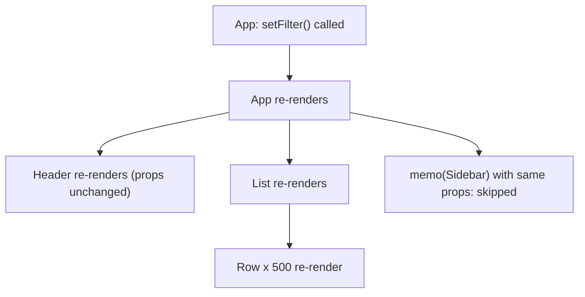
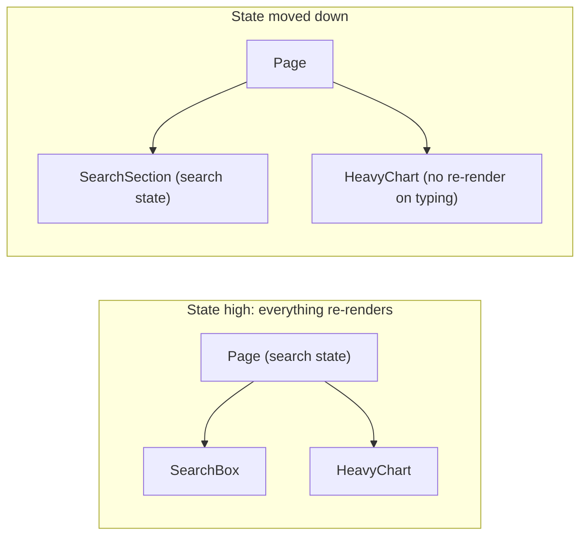

# Rendering Behaviour: Re-render Triggers, Keys, Batching

!!! abstract "TL;DR"
    - A component re-renders when **its state changes**, **its parent re-renders**, or **a context it reads changes** (plus external store subscriptions). **Props changing is not a trigger by itself**: props change because the parent re-rendered.
    - By default **a re-render cascades to all children**, whether or not their props changed. `memo` lets a child skip if its props are shallowly equal; stable references (or React Compiler) make that work.
    - **Re-rendering is not DOM updating.** Render is cheap calculation; commit only touches what changed. Unnecessary renders matter only when they're expensive or very frequent.
    - **Identity = type + position (+ key).** Same type at the same position keeps state; a different type or key remounts. Keys must be stable and unique among siblings.
    - **React 18 batches all updates automatically** (events, promises, timeouts, native handlers) into one render. `flushSync` opts out when you must read the DOM immediately.

## Why it matters

Performance and correctness bugs in React apps usually come from misunderstanding when renders happen: whole pages re-rendering on each keystroke, context providers re-rendering every consumer, `memo` that never works because a callback is new every time, or state that unexpectedly resets. Interviewers ask "what causes a re-render?" to see if you know the model or just sprinkle `useMemo`.


*Notice that every descendant re-renders by default even if its props didn't change. Only memoised children with shallow-equal props are skipped.*

## Core concepts

### What triggers a render

1. **Initial render** (`createRoot().render`).
2. **State update** in the component (`useState`/`useReducer` setter with a different value per `Object.is`).
3. **Parent re-render** (all children re-render unless memoised and props are equal).
4. **Context value change** for components that read that context (they re-render even if memoised).
5. **External store change** via `useSyncExternalStore` (Redux `useSelector`, Zustand) when the selected value changes.

Not triggers: mutating a ref, mutating an object in place, a prop "changing" without the parent rendering.

### Bail-outs

- Setting state to the same value (`Object.is`) lets React skip re-rendering the children (it may still call the component once).
- `memo(Component)` skips rendering when all props are shallowly equal to the previous ones.
- `memo` is defeated by new object/array/function props created each render: `style={{...}}`, `onClick={() => ...}`, `items={data.filter(...)}`.

### Composition beats memoisation

Move state down or pass expensive children as props so they're created by a component that doesn't re-render:


*Notice the cheapest optimisation is structural: put state in the smallest component that needs it, so typing doesn't re-render unrelated heavy siblings.*

The "children as props" trick: `<ScrollTracker><HeavyContent/></ScrollTracker>`. When `ScrollTracker`'s state changes, `HeavyContent` is the same element object (created by the parent), so React skips it.

### Keys and identity

- React identifies each child by **type + position**, or **type + key** in lists.
- Same identity → preserved state and DOM; different → unmount + mount.
- Keys must be **stable** (from data, not `Math.random()` or index for dynamic lists) and **unique among siblings** (not globally).
- Deliberately change a key to reset state (`<Form key={recordId} />`).
- Conditional rendering at the same position: `{isA ? <Counter/> : <Counter/>}` keeps state (same type, same position); give them different keys to separate them.

### Batching

- **React 17:** batched only inside React event handlers; updates in promises/timeouts rendered once per `setState`.
- **React 18+ (`createRoot`):** **automatic batching everywhere**: multiple updates in the same tick produce one render.
- `flushSync(() => setX(...))` forces a synchronous render (e.g. scroll to a newly added item). Use sparingly.

### Render vs commit cost

- Render: calling component functions + diffing. Usually cheap; expensive for big trees or heavy computations in render.
- Commit: DOM mutations, layout, paint. Only changed nodes.
- Measure with the **React DevTools Profiler** ("Highlight updates", why-did-this-render) and Chrome **Performance Tracks** (React 19.2) before optimising.

### React Compiler

React Compiler (1.0) automatically memoises components, props and JSX so unchanged children skip rendering without manual `memo`/`useCallback`. Structural fixes (state placement) still matter for clarity.

## In practice: code & configuration

### memo defeated by new props

=== "❌ Common mistake"
    ```tsx
    const Row = memo(function Row({ rx, onSelect }: { rx: Rx; onSelect: (id: string) => void }) {
      return <li onClick={() => onSelect(rx.id)}>{rx.drug}</li>;
    });

    function RxList({ rxs }: { rxs: Rx[] }) {
      const [selected, setSelected] = useState<string | null>(null);
      return (
        <ul>
          {rxs.map((rx, i) => (
            <Row key={i}                                    // index key
                 rx={{ ...rx }}                             // new object every render
                 onSelect={id => setSelected(id)} />        // new function every render
          ))}
        </ul>
      );                                                     // memo never skips; every row re-renders
    }
    ```

=== "✅ Correct approach"
    ```tsx
    function RxList({ rxs }: { rxs: Rx[] }) {
      const [selected, setSelected] = useState<string | null>(null);
      const onSelect = useCallback((id: string) => setSelected(id), []);  // stable (or let the Compiler do it)
      return (
        <ul>
          {rxs.map(rx => <Row key={rx.id} rx={rx} onSelect={onSelect} />)}   {/* stable key + same object */}
        </ul>
      );
    }
    ```

### Batching and flushSync

```tsx
async function save() {
  const res = await api.save(form);
  setSaving(false);      // React 18: these three updates
  setResult(res);        // are batched into
  setToast("Saved");     // a single render
}

function addAndScroll(item: Item) {
  flushSync(() => setItems(prev => [...prev, item]));   // DOM updated synchronously
  listRef.current?.lastElementChild?.scrollIntoView();
}
```

### Same position, different meaning

```tsx
// Both branches render <Counter/> at the same position: state is shared.
{isPrimary ? <Counter label="Primary" /> : <Counter label="Secondary" />}

// Separate state by giving each its own key.
{isPrimary ? <Counter key="p" label="Primary" /> : <Counter key="s" label="Secondary" />}
```

## Real-world usage

- Large dashboards (trading, analytics, healthcare portals) usually fix render performance by restructuring state (colocation), virtualising long lists, and selective subscriptions to stores, not by memoising everything.
- Redux's `useSelector` re-renders only when the selected slice changes, which is why selecting small primitives matters; Zustand and Jotai use similar selector-based subscriptions.
- Meta's React Compiler rollout aims to make "why did this re-render" mostly a non-issue in compiled code.

## Trade-offs & production gotchas

| Technique | Pros | Cons | Use when |
|---|---|---|---|
| Colocate state | Simple, fewer renders | Lifting later if shared | Default |
| Children as props | No memo needed | Less obvious pattern | Wrapper with frequently changing state |
| `memo` + stable props | Skips subtrees | Easy to defeat, extra comparisons | Proven expensive children |
| React Compiler | Automatic, precise | Build step, must follow Rules of React | New/maintained codebases |
| Virtualisation | Renders only visible rows | Complexity, a11y considerations | Long lists (see Performance page) |

!!! warning "Gotcha: context re-renders bypass memo"
    A memoised component that reads a context re-renders whenever that context value changes. Split contexts or memoise the provider value (see Context page).

!!! warning "Gotcha: random keys"
    `key={Math.random()}` or `key={uuid()}` in render remounts every item every render: lost state, lost focus, slow.

!!! warning "Gotcha: assuming props changes trigger renders"
    Mutating an object passed as a prop does nothing visible until something re-renders the parent, and then React may miss the change because the reference is the same.

!!! question "Interview angle"
    "What causes a re-render?" → state, parent, context, external store. Then: memo and its pitfalls, keys and identity, batching changes in React 18, and how you measure before optimising.

## How this connects to my experience

- **Where I used it:** OptumRx React application and micro-frontends; Redux and React Query (skills). Prescription and claims lists are typical render-heavy screens. *[confirm the screens and any performance work]*
- **Talking points:**
    - "When a screen was slow, I profiled first; most fixes were moving state down or selecting smaller slices from Redux, not adding memo everywhere." *[confirm a concrete example]*
    - "Stable keys from prescription ids, never indices, because rows had inline actions and state." *[confirm]*
    - "Upgrading to React 18 removed a class of double renders thanks to automatic batching." *[confirm whether you upgraded]*
- **Likely follow-up chain:** "What causes a re-render?" → "How do you stop a child re-rendering?" → "Why doesn't memo work here?" → "What changed with batching in React 18?" → "How did you find the slow component?"

## Interview questions

### Fundamentals

??? question "Q1. What causes a component to re-render?"
    **Answer:** Its own state change, its parent re-rendering, a context it consumes changing, or a subscribed external store value changing.

    **Common wrong answer:** "When its props change" (props change because the parent re-rendered).

??? question "Q2. Does re-rendering mean the DOM is updated?"
    **Answer:** No. Render computes the new tree; commit only applies the differences. A re-render with identical output changes nothing in the DOM.

??? question "Q3. What does memo do?"
    **Answer:** Skips re-rendering a component when its props are shallowly equal to the previous render's props.

### Intermediate

??? question "Q4. Why might memo not help?"
    **Answer:** New object/array/function props each render, children passed as JSX created fresh, or the component reads a context that changes.

??? question "Q5. What is automatic batching?"
    **Answer:** React 18 groups multiple state updates in the same tick into one render everywhere (promises, timeouts, native events), not only in React event handlers.

??? question "Q6. When would you use flushSync?"
    **Answer:** When you must read or act on the updated DOM immediately after a state change, e.g. scrolling to a newly added item. It's a performance escape hatch.

??? question "Q7. How does React decide whether to keep a component's state?"
    **Answer:** By identity: same type at the same position (and same key) keeps state; otherwise it remounts.

### Senior

??? question "Q8. How do you prevent re-renders without memo?"
    **Answer:** Move state down to where it's used, lift expensive content up and pass it as children/props, split components, and use selector-based store subscriptions.

??? question "Q9. Why does setting the same state value sometimes still call the component?"
    **Answer:** React may render the component once to confirm before bailing out of its children; the result is discarded if nothing changed.

??? question "Q10. How do you find unnecessary renders?"
    **Answer:** React DevTools Profiler (flame graph, why it rendered, highlight updates), Chrome Performance Tracks, and measuring interaction latency (INP) before and after.

### Scenario-based

??? question "Q11. Typing in a search box makes the whole page lag."
    **Answer:** Search state is too high, re-rendering heavy siblings. Move state into the search component, defer the expensive part with `useDeferredValue`, and virtualise long lists.

??? question "Q12. After toggling between two forms, the second shows the first's values."
    **Answer:** Same component type at the same position keeps state. Give each a different key (or render at different positions).

## Cheat sheet

| Concept | Remember |
|---|---|
| Triggers | State, parent render, context change, external store |
| Not triggers | Mutations, refs, "props changing" alone |
| Cascade | Children re-render by default |
| memo | Shallow props compare; defeated by new objects/functions |
| Identity | Type + position + key |
| Keys | Stable, unique among siblings; change to reset |
| Batching | Automatic everywhere in React 18 (`createRoot`) |
| flushSync | Synchronous render escape hatch |
| Measure | DevTools Profiler, Performance Tracks |
| Compiler | Auto-memoises; reduces manual memo |
| Cheapest fix | Colocate state; children as props |

## Sources

1. [react.dev: Render and Commit](https://react.dev/learn/render-and-commit).
2. [react.dev: memo](https://react.dev/reference/react/memo): skipping re-renders and pitfalls.
3. [react.dev: Preserving and Resetting State](https://react.dev/learn/preserving-and-resetting-state).
4. [react.dev: Rendering Lists (keys)](https://react.dev/learn/rendering-lists).
5. [React 18: Automatic batching (React blog)](https://react.dev/blog/2022/03/29/react-v18#new-feature-automatic-batching) and [flushSync](https://react.dev/reference/react-dom/flushSync).
6. [Dan Abramov: Before You memo()](https://overreacted.io/before-you-memo/): moving state down and lifting content up.
7. [React Compiler v1.0](https://react.dev/blog/2025/10/07/react-compiler-1).
