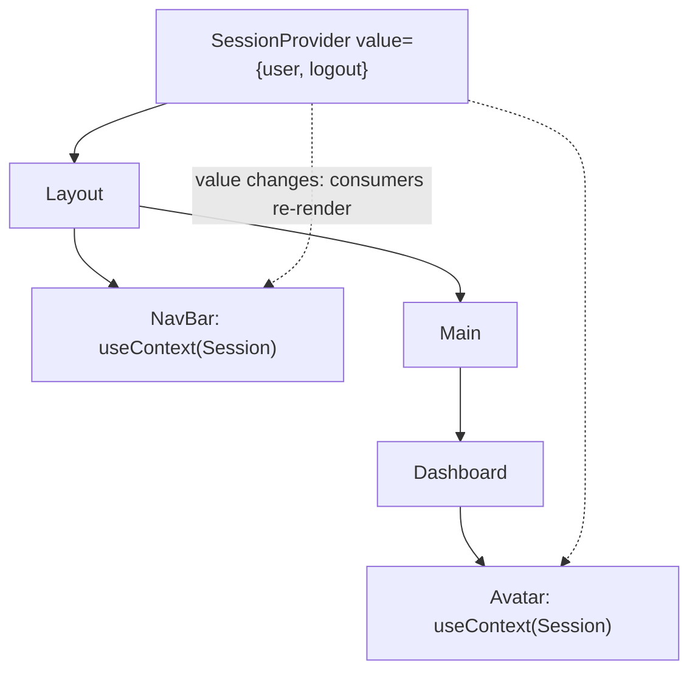
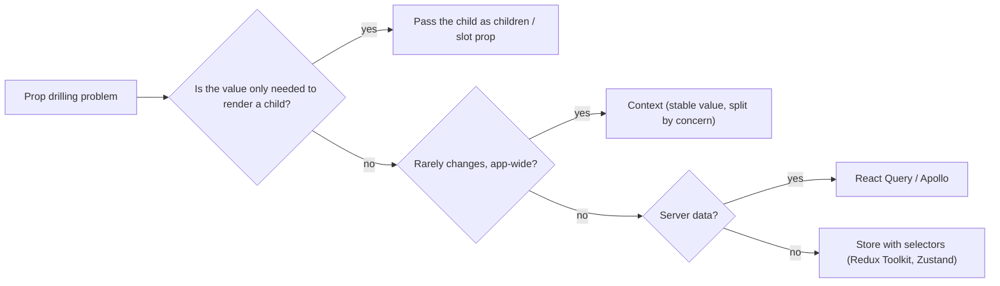

# Context API & Component Composition Patterns

!!! abstract "Key takeaways"
    - **Context** passes a value deep into the tree without prop drilling. It's a **dependency injection** mechanism, not a state manager: the state still lives in a component (or store) that provides it.
    - Every component that reads a context **re-renders when the provider's value changes** (by `Object.is`), even if wrapped in `memo`. Keep values stable (`useMemo`), **split** contexts by update frequency, and put state close to where it's used.
    - Good fits: theme, locale, authenticated user/session, feature flags, design-system internals (compound components). Poor fit: frequently changing app-wide state (use a store with selectors) and **server data** (use React Query/Apollo).
    - React 19: render `<ThemeContext value={...}>` directly (no `.Provider`), and read with `use(ThemeContext)` (can be conditional).
    - **Composition first:** often prop drilling disappears by passing components as `children` or slot props. Other patterns: compound components (context inside), render props, custom hooks, and higher-order components (legacy).

## Why it matters

Prop drilling (passing a value through five components that don't use it) makes code brittle. Context fixes that, but overusing it causes app-wide re-renders and hidden coupling. Interviewers ask "Context vs Redux?" and "why is my whole app re-rendering?" to see if you can choose the right tool and structure components well.


*Notice Layout, Main and Dashboard don't need the user at all. Context lets NavBar and Avatar read it directly, and they are the ones that re-render when it changes.*

{ loading=lazy }
*Watch the middle components: with drilling they re-render just to pass the user along; with context they are skipped.*

## Core concepts

### API

```tsx
const SessionContext = createContext<Session | null>(null);     // default when no provider above

function App() {
  const [user, setUser] = useState<User | null>(null);
  const value = useMemo(() => ({ user, logout: () => setUser(null) }), [user]); // stable reference
  return <SessionContext value={value}><Routes /></SessionContext>;            // React 19 (was .Provider)
}

function Avatar() {
  const session = use(SessionContext);          // or useContext(SessionContext)
  if (!session?.user) return null;
  return ;
}
```

- Consumers read the value from the **closest provider above** them; nested providers override.
- Without a provider, consumers get the default value; a custom hook can throw a helpful error instead.

### Re-render behaviour

- When the provider's `value` changes (`Object.is`), **all consumers re-render**, regardless of `memo`.
- An object literal `value={{ user, logout }}` is new every render → consumers re-render every time the provider's parent renders. Memoise it.
- Consumers can't subscribe to part of a context; there are no selectors. Split into multiple contexts (e.g. `SessionStateContext` and `SessionActionsContext`) or use an external store with selectors.

{ loading=lazy }
*Notice Logout and IdleTimer: once the actions live in their own memoised context, a new user no longer re-renders them.*

### Context vs state management

| Need | Tool |
|---|---|
| Rarely changing, app-wide values (theme, locale, session, flags) | Context |
| Frequently changing shared client state, many consumers, fine-grained subscriptions | Redux Toolkit, Zustand, Jotai (selectors) |
| Server data (fetching, caching, invalidation) | TanStack Query, Apollo, RTK Query |
| Form state | React Hook Form / Actions (see Forms page) |
| URL state (filters, pagination) | Router search params |

### Composition patterns

**1. Children and slots (often removes the need for context):**

```tsx
// Instead of drilling `user` through Layout into NavBar:
<Layout nav={<NavBar user={user} />} sidebar={<Filters />}>
  <Dashboard user={user} />
</Layout>
```

**2. Compound components:** a parent shares implicit state with its parts via context; consumers compose freely.

```tsx
<Tabs defaultValue="rx">
  <Tabs.List>
    <Tabs.Trigger value="rx">Prescriptions</Tabs.Trigger>
    <Tabs.Trigger value="claims">Claims</Tabs.Trigger>
  </Tabs.List>
  <Tabs.Panel value="rx"><RxList /></Tabs.Panel>
  <Tabs.Panel value="claims"><Claims /></Tabs.Panel>
</Tabs>
```

**3. Custom hooks:** share stateful logic (`useSession`, `useFeatureFlag`), often wrapping a context with a clear error if the provider is missing.

**4. Render props:** a component calls a function child to render (`<DataTable renderRow={row => ...}/>`). Mostly replaced by hooks but useful for headless UI and virtualised lists.

**5. Higher-order components:** `withAuth(Component)`; legacy, hard to type and compose; hooks preferred.

**6. Headless components:** logic and accessibility without markup (Radix, React Aria, TanStack Table), styled by the consumer.


*Notice context is one branch of four. Composition is the first thing to try, and server data has its own tools.*

### Micro-frontends and context

Context does not cross separately mounted React roots or different React copies. Micro-frontends sharing session or theme need a shared singleton (module federation `shared` React), a host-provided API, events, or URL/storage, not just a provider in the shell.

## In practice: code & configuration

=== "❌ Common mistake"
    ```tsx
    // One giant context with fast-changing state and a new object every render.
    const AppContext = createContext<any>(null);
    function AppProvider({ children }: { children: React.ReactNode }) {
      const [user, setUser] = useState<User | null>(null);
      const [cart, setCart] = useState<Item[]>([]);
      const [mousePos, setMousePos] = useState({ x: 0, y: 0 });   // changes 60 times a second
      return (
        <AppContext.Provider value={{ user, setUser, cart, setCart, mousePos, setMousePos }}>
          {children}                                               {/* every consumer re-renders on mouse move */}
        </AppContext.Provider>
      );
    }
    ```

=== "✅ Correct approach"
    ```tsx
    const SessionContext = createContext<SessionState | null>(null);
    const SessionActionsContext = createContext<SessionActions | null>(null);

    export function SessionProvider({ children }: { children: React.ReactNode }) {
      const [user, setUser] = useState<User | null>(null);
      const actions = useMemo(() => ({                 // stable: never changes
        login: (u: User) => setUser(u),
        logout: () => setUser(null),
      }), []);
      const state = useMemo(() => ({ user }), [user]); // changes only when user changes
      return (
        <SessionActionsContext value={actions}>
          <SessionContext value={state}>{children}</SessionContext>
        </SessionActionsContext>
      );
    }

    export function useSession() {
      const ctx = use(SessionContext);
      if (!ctx) throw new Error("useSession must be used inside <SessionProvider>");
      return ctx;
    }
    // Cart lives in a store with selectors; mouse position stays local to the component that needs it.
    ```

## Real-world usage

- Design systems (MUI, Radix, Chakra) use context internally for themes and compound components (Tabs, Menu, Select).
- Redux and React Query themselves use context only to pass the **store/client instance** (stable), then subscribe with selectors; that's why they don't cause context re-render storms.
- **Healthcare portals:** session/identity, permissions and feature flags are classic context values; member data and prescriptions are server state in React Query/Apollo with cache keys per member.

## Trade-offs & production gotchas

| Option | Pros | Cons | Use when |
|---|---|---|---|
| Props | Explicit, typed, traceable | Drilling | A few levels |
| Composition (children/slots) | No coupling, no re-render issues | Needs restructuring | Value only used to render a child |
| Context | Built-in, no drilling | All consumers re-render, no selectors | Low-frequency app-wide values |
| Store (Redux/Zustand) | Selectors, devtools, middleware | Boilerplate/dependency | High-frequency shared client state |
| Server-state library | Caching, dedupe, refetch | Another library | API data |

!!! warning "Gotcha: unstable provider value"
    `value={{ a, b }}` creates a new object each render; every consumer re-renders whenever the provider's parent renders. Memoise or split.

!!! warning "Gotcha: context as a global store"
    Putting everything in one context couples the app and causes broad re-renders. Use several focused contexts or a store.

!!! warning "Gotcha: missing provider"
    Consumers silently get the default value. Use `null` default plus a custom hook that throws a clear error.

!!! question "Interview angle"
    "Context vs Redux?", "why does everything re-render?", "how do you avoid prop drilling?", "explain compound components". Lead with composition, then context for low-frequency values, stores for high-frequency state, server-state libraries for API data.

## How this connects to my experience

- **Where I used it:** OptumRx React app with Redux and React Query (skills), micro-frontend architecture, Material UI (theming via context). *[confirm: what was in context (session, theme, flags), what was in Redux, what was in React Query]*
- **Talking points:**
    - "We kept server data in React Query, client UI state local or in Redux slices with selectors, and only identity, theme and feature flags in context." *[confirm]*
    - "Across micro-frontends, context didn't cross roots, so the shell exposed session and theme through a shared module / events." *[confirm the actual mechanism]*
    - "Material UI's ThemeProvider is context; we defined one theme for all micro-frontends so they looked consistent." *[confirm]*
- **Likely follow-up chain:** "When do you use Context vs Redux?" → "How did micro-frontends share the logged-in user?" → "Your context caused re-renders, how did you fix it?" → "Explain compound components."

## Interview questions

### Fundamentals

??? question "Q1. What problem does Context solve?"
    **Answer:** Passing values deep into the tree without threading them through intermediate components (prop drilling).

    **Interviewer listens for:** prop drilling, deep tree access.

    **Common wrong answer:** "Context is for global state management." It is for passing values down.

??? question "Q2. Who re-renders when a context value changes?"
    **Answer:** Every component that reads that context (useContext/use), even if memoised, plus the normal cascade from the provider's parent.

    **Interviewer listens for:** every consumer re-renders, memo does not stop it, provider parent cascade.

    **Common wrong answer:** "Only components that use the changed field re-render." Context has no field-level selectors.

??? question "Q3. Is Context a state management library?"
    **Answer:** No; it's dependency injection. State lives in a component or store; context only distributes it.

    **Interviewer listens for:** dependency injection, state lives elsewhere.

    **Common wrong answer:** "Context replaces Redux." It distributes state; it does not add selectors, middleware or devtools.

### Intermediate

??? question "Q4. How do you prevent unnecessary consumer re-renders?"
    **Answer:** Memoise the value, split contexts by concern and update frequency (state vs actions), keep fast-changing state local, or use a store with selectors.

    **Interviewer listens for:** memoised value, split by concern and frequency, local state, store with selectors.

    **Common wrong answer:** Putting everything in one big `AppContext` with a new object value every render.

??? question "Q5. Context vs Redux?"
    **Answer:** Context for low-frequency app-wide values; Redux (or Zustand) for frequently changing shared state needing selectors, middleware and devtools; neither for server data.

    **Interviewer listens for:** update frequency, selectors, middleware/devtools, server data belongs in a query library.

    **Common wrong answer:** "Redux is outdated, use Context for everything." Frequently changing shared state performs badly in context.

??? question "Q6. What changed for context in React 19?"
    **Answer:** Render `<Ctx value>` directly instead of `<Ctx.Provider>`, and read with `use(Ctx)`, which can be called conditionally.

    **Interviewer listens for:** `<Ctx value>` as provider, `use(Ctx)` can be conditional.

    **Common wrong answer:** "React 19 removed Context." It simplified the provider and added `use`.

??? question "Q7. What are compound components?"
    **Answer:** A family of components (Tabs, Tabs.List, Tabs.Panel) sharing implicit state through a context from the parent, giving flexible composition with a simple API.

    **Interviewer listens for:** shared implicit state via context, flexible composition, simple API.

    **Common wrong answer:** Confusing it with HOCs. Compound components share state through context, not wrappers.

### Senior

??? question "Q8. How can composition remove the need for context?"
    **Answer:** If intermediate components only pass a value down to render a child, let the owner create that child and pass it as children or a slot prop; the intermediates no longer need the value.

    **Interviewer listens for:** owner creates the child, pass as children or slot props, intermediates stop forwarding.

    **Common wrong answer:** "Composition and context are the same thing." Composition often removes the need for context entirely.

??? question "Q9. Render props vs hooks vs HOCs?"
    **Answer:** Hooks are the default for sharing logic; render props still useful for render customisation (headless UI, virtualised rows); HOCs are legacy, with wrapper hell and typing issues.

    **Interviewer listens for:** hooks default, render props for render control, HOCs legacy.

    **Common wrong answer:** "HOCs are the recommended way to share logic." Hooks replaced them for most cases.

??? question "Q10. Does context work across micro-frontends?"
    **Answer:** Only within one React root and one React instance. Separate roots or React copies need a shared singleton module, events, or host APIs.

    **Interviewer listens for:** one root and one React instance, shared module or events across roots.

    **Common wrong answer:** "Context is global, so every micro-frontend can read it."

### Scenario-based

??? question "Q11. The whole app re-renders on every keystroke in the header search. Cause?"
    **Answer:** Search text stored in an app-level context (or provider value recreated). Keep it local to the search component, or move it into the URL/store with selectors.

    **Interviewer listens for:** fast-changing value in app-level context, local state or store selectors.

    **Common wrong answer:** "Wrap all children in memo." Context consumers still re-render.

??? question "Q12. Design how the logged-in user, theme and feature flags reach components."
    **Answer:** Separate contexts (session, theme, flags) with stable values and custom hooks that throw without providers; member data via React Query keyed by member id.

    **Interviewer listens for:** separate stable contexts, custom hooks guarding missing providers, server data in React Query.

    **Common wrong answer:** One context holding user, theme, flags and member data together.

## Cheat sheet

| Concept | Remember |
|---|---|
| Context | DI, not state management |
| Re-render | All consumers on value change; bypasses memo |
| Stable value | `useMemo`; split state vs actions |
| React 19 | `<Ctx value>`; `use(Ctx)` conditional |
| Good for | Theme, locale, session, flags, compound components |
| Not for | High-frequency state, server data |
| Composition first | children / slot props |
| Patterns | Compound components, custom hooks, render props, headless UI; HOCs legacy |
| Micro-frontends | Context doesn't cross roots/React copies |

## Sources

1. [react.dev: Passing Data Deeply with Context](https://react.dev/learn/passing-data-deeply-with-context).
2. [react.dev: useContext](https://react.dev/reference/react/useContext) (optimising re-renders when passing objects and functions).
3. [react.dev: use](https://react.dev/reference/react/use) and [React 19: Context as a provider](https://react.dev/blog/2024/12/05/react-19).
4. [react.dev: Scaling Up with Reducer and Context](https://react.dev/learn/scaling-up-with-reducer-and-context).
5. [Kent C. Dodds: How to use React Context effectively](https://kentcdodds.com/blog/how-to-use-react-context-effectively).
6. [Redux FAQ: When should I use Redux? / Context vs Redux](https://redux.js.org/faq/general#when-should-i-use-redux).
7. [Dan Abramov: Before You memo()](https://overreacted.io/before-you-memo/).
