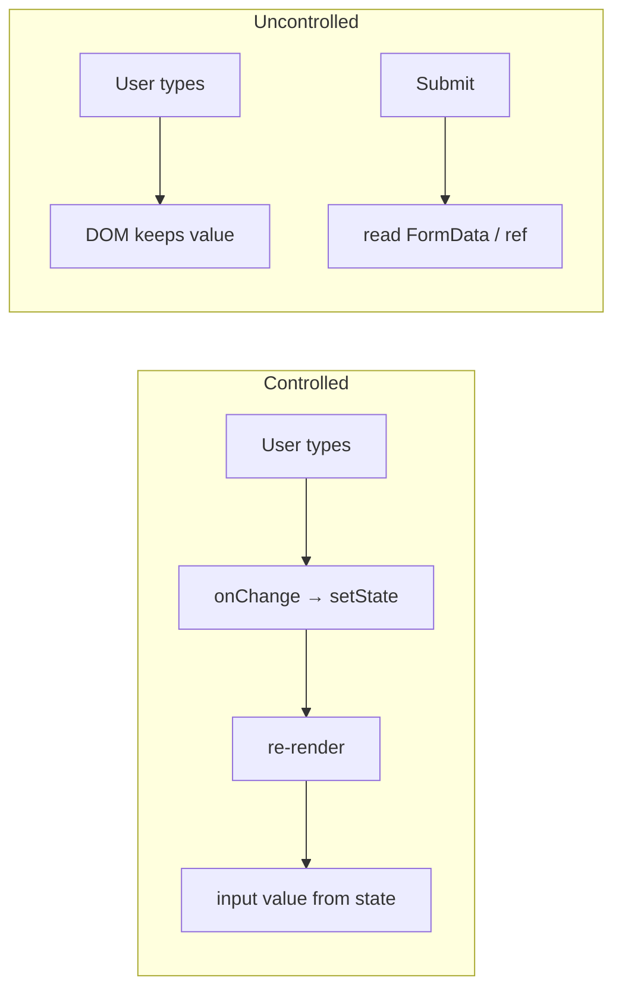
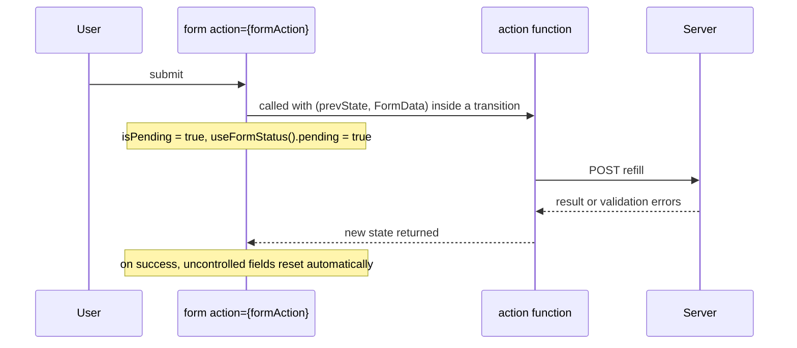

# Forms & Controlled vs Uncontrolled Components

!!! abstract "Key takeaways"
    - **Controlled input:** React state is the source of truth (`value` + `onChange`). Easy to validate, format and derive UI from, but re-renders on every keystroke.
    - **Uncontrolled input:** the DOM holds the value (`defaultValue`, read via ref or `FormData` on submit). Fewer renders, simpler for large forms and file inputs, but less instant control.
    - Never switch an input between controlled and uncontrolled (`value` going from `undefined` to a string triggers a warning). Initialise with `""`, not `undefined`.
    - **React 19 Actions:** pass a function to `<form action={fn}>`; `useActionState` gives result + pending state, `useFormStatus` reads the parent form's pending status, `useOptimistic` shows optimistic UI. Forms reset automatically after a successful action.
    - For complex forms, **React Hook Form** (uncontrolled by default, minimal re-renders) with **schema validation** (Zod/Yup) is the common choice. Always validate again on the server; client validation is UX, not security.

## Why it matters

Forms are where most user input enters a system. In healthcare that's refill requests, addresses, consent and payment details: they must validate clearly, be accessible, avoid double submission and never leak sensitive data. The controlled vs uncontrolled question is a classic interview opener; React 19 Actions are the current answer to "how do forms work in modern React?".


*Notice where the value lives. Controlled routes every keystroke through React state; uncontrolled leaves it in the DOM until you read it.*

## Core concepts

### Controlled

```tsx
const [email, setEmail] = useState("");
<input type="email" value={email} onChange={e => setEmail(e.target.value)} />
```

- Validation and formatting on every change, conditional UI (enable button when valid), single source of truth.
- Cost: render per keystroke (fine for most forms; expensive if the form is huge or the component is heavy).
- Checkboxes use `checked`; selects use `value` on `<select>`; textareas use `value`.

### Uncontrolled

```tsx
<form onSubmit={e => {
  e.preventDefault();
  const data = new FormData(e.currentTarget);
  submit(Object.fromEntries(data));
}}>
  <input name="email" type="email" defaultValue={user.email} required />
</form>
```

- Value read on submit (FormData, refs). Native validation attributes (`required`, `pattern`, `type`) work.
- File inputs are always uncontrolled (`<input type="file">` value is read-only).

### Comparison

| | Controlled | Uncontrolled |
|---|---|---|
| Source of truth | React state | DOM |
| Re-renders | Every change | None until submit (unless you subscribe) |
| Instant validation / formatting | Easy | Via events or libraries |
| Large forms | Can be slow | Efficient |
| Integration with non-React widgets | Harder | Easier |
| Default value | `value` from state | `defaultValue` |

### React 19 Actions


*Notice the action runs inside a transition: pending state, errors and form reset are handled by React instead of hand-written loading flags.*

- `useActionState(action, initialState)` → `[state, formAction, isPending]`. The action receives `(prevState, formData)`.
- `useFormStatus()` (from `react-dom`) in a child of the form → `{ pending, data, method, action }`, e.g. for a submit button.
- `useOptimistic(state, updateFn)` shows the expected result immediately and reverts if the action fails.
- With frameworks (React Router actions, Next.js Server Actions), the same form can post to the server and work before JavaScript loads (progressive enhancement).

### Validation

- **Layers:** HTML constraints (fast, native), client schema validation (UX), server validation (authoritative).
- **Schema libraries:** Zod/Yup/Valibot schemas shared between client and server (TypeScript types inferred from the schema).
- **When to show errors:** on blur or submit, not on first keystroke; clear on correction.
- **Accessibility:** `<label htmlFor>`, `aria-invalid`, `aria-describedby` pointing at the error, focus the first invalid field on submit, don't rely on colour alone.

### React Hook Form

- Registers inputs as uncontrolled with refs; tracks state without re-rendering the whole form on each keystroke.
- `zodResolver(schema)` for validation; `Controller` for controlled third-party components (MUI, date pickers).
- `formState` (errors, isSubmitting, isDirty) subscribed selectively.

### Security and UX

- Prevent **double submission**: disable submit while pending, plus server-side idempotency keys.
- Don't put sensitive values (SSN, card numbers) in URLs, logs or analytics; use `autocomplete` correctly (`one-time-code`, `cc-number`, `new-password`).
- CSRF protection if the API uses cookies (see Spring Security page).

## In practice: code & configuration

### Controlled vs uncontrolled pitfalls

=== "❌ Common mistake"
    ```tsx
    function Address({ initial }: { initial?: Address }) {
      const [zip, setZip] = useState(initial?.zip);   // undefined → uncontrolled, then controlled: warning
      return (
        <form onSubmit={e => submit({ zip })}>        {/* no preventDefault: full page reload */}
          <input value={zip} onChange={e => setZip(e.target.value)} />
          <button>Save</button>                        {/* double clicks submit twice */}
        </form>
      );
    }
    ```

=== "✅ Correct approach (React 19 Actions)"
    ```tsx
    type State = { error?: string; saved?: boolean };

    async function saveAddress(prev: State, formData: FormData): Promise<State> {
      const parsed = AddressSchema.safeParse(Object.fromEntries(formData));     // Zod
      if (!parsed.success) return { error: parsed.error.issues[0].message };
      const res = await api.saveAddress(parsed.data, { idempotencyKey: crypto.randomUUID() });
      return res.ok ? { saved: true } : { error: "Could not save address. Try again." };
    }

    function SubmitButton() {
      const { pending } = useFormStatus();                    // reads the parent form
      return <button disabled={pending}>{pending ? "Saving…" : "Save"}</button>;
    }

    export function AddressForm({ initial }: { initial?: Address }) {
      const [state, formAction] = useActionState(saveAddress, {});
      return (
        <form action={formAction} noValidate>
          <label htmlFor="zip">ZIP code</label>
          <input id="zip" name="zip" defaultValue={initial?.zip ?? ""} inputMode="numeric"
                 aria-invalid={!!state.error} aria-describedby="zip-error" />
          {state.error && <p id="zip-error" role="alert">{state.error}</p>}
          <SubmitButton />
        </form>
      );
    }
    ```

### React Hook Form + Zod

```tsx
const RefillSchema = z.object({
  rxId: z.string().min(1, "Choose a prescription"),
  pickupDate: z.coerce.date().min(new Date(), "Pick a future date"),
  pharmacyId: z.string().min(1),
});
type Refill = z.infer<typeof RefillSchema>;

function RefillForm() {
  const { register, handleSubmit, formState: { errors, isSubmitting } } =
    useForm<Refill>({ resolver: zodResolver(RefillSchema) });
  const onSubmit = handleSubmit(data => requestRefill(data));
  return (
    <form onSubmit={onSubmit}>
      <input {...register("rxId")} aria-invalid={!!errors.rxId} />
      {errors.rxId && <span role="alert">{errors.rxId.message}</span>}
      <button disabled={isSubmitting}>Request refill</button>
    </form>
  );
}
```

## Real-world usage

- React Hook Form and Formik are the most used form libraries; React Hook Form's uncontrolled approach became popular for performance on large forms.
- React 19 Actions plus framework actions (React Router, Next.js) are pushing forms back towards native `<form>` semantics with progressive enhancement.
- **Healthcare and banking:** strict server-side validation, idempotent submission, accessible error messages (WCAG 2.2), and no sensitive data in client logs or analytics are compliance expectations.

## Trade-offs & production gotchas

| Approach | Pros | Cons | Use when |
|---|---|---|---|
| Controlled with useState | Full control, simple | Renders per keystroke | Small/medium forms, live formatting |
| Uncontrolled + FormData | Minimal renders, native | Less instant control | Simple submit-only forms |
| React 19 Actions | Built-in pending/errors/reset, progressive enhancement | New API, needs React 19 | Modern apps, framework actions |
| React Hook Form + Zod | Performant, schema types, rich features | Library to learn | Large or complex forms |

!!! warning "Gotcha: undefined → defined value"
    `value={undefined}` makes an input uncontrolled; switching later to a string warns and behaves oddly. Initialise with `""`.

!!! warning "Gotcha: client validation only"
    Anyone can bypass the UI. Validate everything on the server and return field errors.

!!! warning "Gotcha: losing user input"
    Remounting a form (key change, conditional render) discards uncontrolled values. Persist drafts if forms are long.

!!! question "Interview angle"
    "Controlled vs uncontrolled?", "how do you validate?", "how do you prevent double submit?", "what do React 19 form Actions add?", plus accessibility.

## How this connects to my experience

- **Where I used it:** OptumRx React application ("Built the ReactJS application from the ground up"), Material UI form components, healthcare forms (refills, addresses, preferences) for 750K+ users. *[confirm: form library (React Hook Form, Formik, custom), validation library, examples of forms you built]*
- **Talking points:**
    - "We used React Hook Form with schema validation so large forms didn't re-render per keystroke, and MUI inputs via Controller." *[confirm]*
    - "Server validation was authoritative; the GraphQL mutation returned typed userErrors that mapped onto fields." *[confirm, links to the GraphQL schema design page]*
    - "Submit buttons disabled while pending, and mutations carried idempotency keys to avoid duplicate refills." *[confirm]*
- **Likely follow-up chain:** "Controlled or uncontrolled?" → "How did you validate and show errors?" → "How did server errors map to fields?" → "How did you stop duplicate submissions?" → "Would you use React 19 Actions now?"

## Interview questions

### Fundamentals

??? question "Q1. Controlled vs uncontrolled component?"
    **Answer:** Controlled: value comes from React state and changes through onChange. Uncontrolled: the DOM holds the value (defaultValue), read via ref or FormData.

    **Interviewer listens for:** source of truth (React state vs DOM), value/onChange vs defaultValue/ref/FormData.

    **Common wrong answer:** "Uncontrolled inputs are bad practice." They are often the better choice for large or simple forms.

??? question "Q2. Why is file input always uncontrolled?"
    **Answer:** Its value is read-only for security; you can't set it programmatically, only read the selected files.

    **Interviewer listens for:** read-only value for security, files list only.

    **Common wrong answer:** Trying to set `value` on a file input to reset or prefill it.

??? question "Q3. What causes 'changing an uncontrolled input to be controlled'?"
    **Answer:** The `value` prop starts as undefined/null and later becomes defined. Initialise with an empty string.

    **Interviewer listens for:** undefined to defined value, initialise to empty string.

    **Common wrong answer:** Fixing it by switching `value` to `defaultValue` in the middle of the component's life.

### Intermediate

??? question "Q4. When would you choose uncontrolled inputs?"
    **Answer:** Large forms where per-keystroke renders are costly, simple submit-only forms, file inputs, integration with non-React widgets, and progressive-enhancement forms.

    **Interviewer listens for:** render cost, submit-only forms, file inputs, non-React widgets, progressive enhancement.

    **Common wrong answer:** "Only when you do not need validation." Uncontrolled forms can still be validated on submit or blur.

??? question "Q5. What does useActionState do?"
    **Answer:** Wraps an action to return its latest result state, a form action to pass to `<form action>`, and an isPending flag; the action receives the previous state and FormData.

    **Interviewer listens for:** result state, action for the form, isPending, previous state + FormData.

    **Common wrong answer:** "It replaces useState for all form fields." It manages the action result, not every field value.

??? question "Q6. What is useFormStatus for?"
    **Answer:** Lets a component inside a form (like a submit button) read the form's pending status and submitted data without prop drilling.

    **Interviewer listens for:** pending status from the parent form, no prop drilling, must be inside the form.

    **Common wrong answer:** Calling useFormStatus in the component that renders the `<form>`. It only works in a child of the form.

??? question "Q7. How do you validate forms well?"
    **Answer:** HTML constraints, a shared schema (Zod) on client and server, show errors on blur/submit, focus the first invalid field, accessible messages, server as the authority.

    **Interviewer listens for:** HTML constraints, shared schema client and server, timing of errors, focus, accessibility, server authority.

    **Common wrong answer:** "Client-side validation is enough." Any client check can be bypassed.

??? question "Q8. How do you make a form accessible?"
    **Answer:** Every input needs a **visible `<label>`** linked with `htmlFor`/`id` (placeholders are not labels). Group related inputs with `<fieldset>` and `<legend>`. Show errors as text linked with `aria-describedby`, set `aria-invalid` on the invalid field, and **move focus** to the first invalid field (or an error summary) on submit. Don't rely on colour alone. Make the whole form usable with a keyboard, and announce async results ("Saved") with a polite live region.

    **Interviewer listens for:** real labels, fieldset/legend, aria-describedby + aria-invalid, focus management, keyboard use, live regions.

    **Common wrong answer:** "Add aria-label to everything." Native elements with visible labels are better than ARIA added on top.

### Senior

??? question "Q9. How does React Hook Form avoid re-renders?"
    **Answer:** Inputs are registered uncontrolled via refs; form state is held outside React state and components subscribe only to what they use (e.g. specific errors).

    **Interviewer listens for:** uncontrolled registration via refs, state outside React, field-level subscriptions.

    **Common wrong answer:** "It uses memo on each field." It avoids re-renders by not storing values in React state.

??? question "Q10. What is useOptimistic?"
    **Answer:** Shows an optimistic version of state while an action is in progress, automatically reverting to the real state when it completes or fails.

    **Interviewer listens for:** temporary optimistic state, auto-revert, used with actions.

    **Common wrong answer:** "useOptimistic updates the server faster." It only changes what the UI shows until the real result arrives.

??? question "Q11. How do you prevent double submissions end to end?"
    **Answer:** Disable while pending (useFormStatus/isSubmitting), idempotency key per submission sent to the server, and server-side dedupe.

    **Interviewer listens for:** disable while pending, idempotency key, server dedupe.

    **Common wrong answer:** "Disable the button" alone. Double-clicks, retries and slow networks still create duplicates.

### Scenario-based

??? question "Q12. A 60-field enrollment form lags when typing. Fix it."
    **Answer:** Move to uncontrolled registration (React Hook Form), split into sections/steps, avoid lifting all values into one parent state, and validate on blur.

    **Interviewer listens for:** uncontrolled registration, sections/steps, no giant parent state, validate on blur.

    **Common wrong answer:** "Add useMemo to every field."

??? question "Q13. How do you show server validation errors next to fields?"
    **Answer:** Server returns field-level errors (e.g. GraphQL userErrors with field paths); map them into form state (`setError` or action state) and render with aria-describedby.

    **Interviewer listens for:** field-level error contract, map to form errors, aria-describedby.

    **Common wrong answer:** Showing one generic toast with "Validation failed".

## Cheat sheet

| Concept | Remember |
|---|---|
| Controlled | `value` + `onChange`; state is truth |
| Uncontrolled | `defaultValue`; read FormData/ref |
| Init | `""`, never `undefined` |
| File input | Always uncontrolled |
| React 19 | `<form action>`, `useActionState`, `useFormStatus`, `useOptimistic`, auto reset |
| Library | React Hook Form + Zod resolver; Controller for MUI |
| Validation | HTML → client schema → server (authoritative) |
| A11y | label, aria-invalid, aria-describedby, focus first error |
| Double submit | Disable while pending + idempotency key |

## Sources

1. [react.dev: input (controlled vs uncontrolled)](https://react.dev/reference/react-dom/components/input).
2. [react.dev: form (Actions)](https://react.dev/reference/react-dom/components/form) and [React 19 release: Actions](https://react.dev/blog/2024/12/05/react-19).
3. [react.dev: useActionState](https://react.dev/reference/react/useActionState), [useFormStatus](https://react.dev/reference/react-dom/hooks/useFormStatus), [useOptimistic](https://react.dev/reference/react/useOptimistic).
4. [React Hook Form documentation](https://react-hook-form.com/docs).
5. [Zod documentation](https://zod.dev/).
6. [W3C WAI: Forms tutorial](https://www.w3.org/WAI/tutorials/forms/): labels, validation, error notification.
