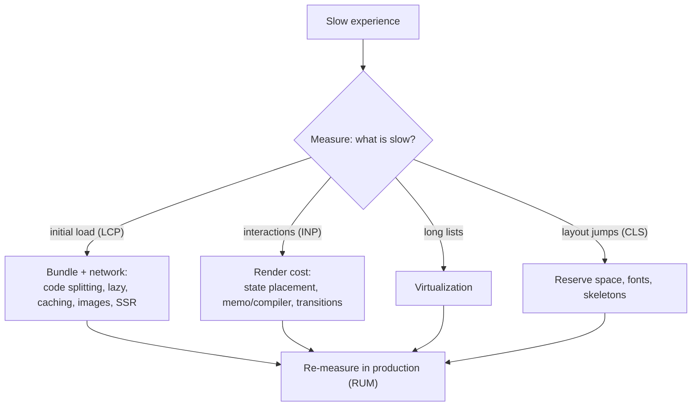
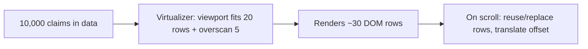

# Performance Optimisation: Memoization, Code Splitting, Lazy Loading, Virtualization

!!! abstract "Key takeaways"
    - **Measure first:** React DevTools Profiler for render cost, Chrome Performance panel (with React Performance Tracks in 19.2), Lighthouse and real-user **Core Web Vitals** (LCP, **INP**, CLS).
    - **Render cost:** colocate state, keep components pure, `memo` + stable props for proven hot spots, or let **React Compiler** memoise automatically; `useDeferredValue`/`useTransition` keep typing responsive during heavy updates.
    - **Bundle cost:** route-level **code splitting** with `lazy()` + `Suspense` (or the router's lazy routes), tree shaking, avoiding huge dependencies, analysing the bundle.
    - **List cost:** **virtualise** long lists and tables (TanStack Virtual, react-window): render only visible rows.
    - **Network cost:** cache server data (React Query), prefetch on hover/route intent, image optimisation, avoid request waterfalls (fetch in parallel, loaders).

## Why it matters

Slow UIs lose users and, in healthcare, frustrate members who just want to refill a prescription on a cheap phone. Since March 2024, **INP** (Interaction to Next Paint) replaced FID as a Core Web Vital, which puts render cost of interactions directly in the metrics Google and product teams watch. Interviewers want a method, not a list of tricks: measure, find the bottleneck, apply the right fix, verify.


*Notice each symptom maps to a different family of fixes. Memoisation doesn't help a slow initial load, and code splitting doesn't help a slow keystroke.*

## Core concepts

### Metrics

| Metric | Measures | Good (p75) |
|---|---|---|
| LCP (Largest Contentful Paint) | Load: main content visible | ≤ 2.5 s |
| INP (Interaction to Next Paint) | Responsiveness of interactions | ≤ 200 ms |
| CLS (Cumulative Layout Shift) | Visual stability | ≤ 0.1 |
| TTFB, FCP | Server/network, first paint | Diagnostic |

Lab tools (Lighthouse) for debugging; **RUM** (web-vitals library, analytics) for truth.

### Render performance

1. **State placement:** colocate state; lift expensive content up as children (see Rendering page).
2. **Avoid expensive work in render:** precompute, memoise with `useMemo` when measurably slow.
3. **`memo`** for expensive children with stable props (`useCallback` for handlers).
4. **React Compiler 1.0:** build-time automatic memoisation; Meta reported up to 12% faster loads/navigations and some interactions over 2.5× faster.
5. **Concurrent features:** `useTransition` marks updates as non-urgent; `useDeferredValue` renders a lagging version of a value so input stays responsive.
6. **Stores with selectors** (Redux `useSelector`, Zustand) so components re-render only for their slice.

### Bundle performance

```tsx
const Claims = lazy(() => import("./routes/Claims"));    // separate chunk

<Suspense fallback={<PageSkeleton />}>
  <Claims />
</Suspense>
```

- **Route-level splitting** first (biggest win), then heavy widgets (charts, editors, PDF viewers).
- React Router data/framework modes support lazy route modules; frameworks split automatically.
- **Tree shaking:** ES modules, named imports (`import debounce from "lodash-es/debounce"`), `sideEffects: false`.
- **Analyse:** `vite-bundle-visualizer`, `source-map-explorer`; set budgets in CI.
- **Preload** likely next routes (on hover, `<link rel="modulepreload">`); React 19 `preload`/`preinit` APIs.
- Micro-frontends: share React and design-system libraries as singletons (module federation) to avoid shipping them N times.

### Lists: virtualization


*Notice DOM size stays constant regardless of data size. That fixes both render time and memory, at the cost of find-in-page and some accessibility handling.*

- Libraries: TanStack Virtual (headless), react-window, react-virtuoso.
- Alternatives: pagination, infinite scroll with virtualization, server-side filtering.
- Accessibility: keep semantic roles, `aria-rowcount`/`aria-rowindex`, keyboard navigation.

### Network and data

- **Server-state caching** with React Query (stale-while-revalidate, dedupe, background refetch).
- **Avoid waterfalls:** parent fetch → child fetch → grandchild fetch. Fetch in parallel, hoist to route loaders, or use GraphQL to get the screen's data in one request.
- **Prefetch** on hover/visibility (`queryClient.prefetchQuery`).
- **Images:** correct sizes (`srcset`), modern formats, lazy-loading below the fold, explicit width/height to avoid CLS.

### Rendering strategy

CSR (client-side rendering) vs SSR/SSG/streaming (Next.js, React Router framework mode): server rendering improves LCP and SEO; hydration cost affects INP. Partial pre-rendering (React 19.2) prerenders static parts and resumes dynamic ones.

## In practice: code & configuration

### Responsive filtering with useDeferredValue

=== "❌ Common mistake"
    ```tsx
    function ClaimsSearch({ claims }: { claims: Claim[] }) {
      const [q, setQ] = useState("");
      const filtered = claims.filter(c => matches(c, q));        // 10k items, every keystroke
      return (
        <>
          <input value={q} onChange={e => setQ(e.target.value)} />  {/* typing lags (poor INP) */}
          <ul>{filtered.map(c => <ClaimRow key={c.id} claim={c} />)}</ul>   {/* 10k DOM rows */}
        </>
      );
    }
    ```

=== "✅ Correct approach"
    ```tsx
    function ClaimsSearch({ claims }: { claims: Claim[] }) {
      const [q, setQ] = useState("");
      const deferredQ = useDeferredValue(q);                         // input stays urgent
      const filtered = useMemo(() => claims.filter(c => matches(c, deferredQ)), [claims, deferredQ]);
      const parentRef = useRef<HTMLDivElement>(null);
      const rows = useVirtualizer({
        count: filtered.length,
        getScrollElement: () => parentRef.current,
        estimateSize: () => 48,
        overscan: 5,
      });
      return (
        <>
          <input value={q} onChange={e => setQ(e.target.value)} aria-label="Search claims" />
          <div ref={parentRef} style={{ height: 600, overflow: "auto" }}>
            <div style={{ height: rows.getTotalSize(), position: "relative" }}>
              {rows.getVirtualItems().map(v => (
                <div key={filtered[v.index].id}
                     style={{ position: "absolute", top: 0, transform: `translateY(${v.start}px)`, width: "100%" }}>
                  <ClaimRow claim={filtered[v.index]} />
                </div>
              ))}
            </div>
          </div>
        </>
      );
    }
    ```

### Route-level code splitting (React Router data mode)

```tsx
const router = createBrowserRouter([
  { path: "/", Component: Home },
  { path: "/claims", lazy: () => import("./routes/claims") },        // chunk loaded on navigation
  { path: "/prescriptions", lazy: () => import("./routes/prescriptions") },
]);
```

### Measuring in the field

```ts
import { onINP, onLCP, onCLS } from "web-vitals";
onINP(m => analytics.track("web_vital", { name: m.name, value: m.value, route: location.pathname }));
onLCP(m => analytics.track("web_vital", { name: m.name, value: m.value }));
onCLS(m => analytics.track("web_vital", { name: m.name, value: m.value }));
```

## Real-world usage

- Google's Core Web Vitals (INP since March 2024) made interaction latency a product metric; many teams track p75 INP per route.
- Large SPAs routinely cut initial JavaScript by 30–60% with route-level splitting and removing heavy dependencies (moment → date-fns/Temporal, full lodash → per-method imports).
- Virtualization is standard for data grids (AG Grid, MUI DataGrid, TanStack Table + Virtual).
- **Healthcare:** members use low-end devices and slow networks; claims/prescription lists can be long; lazy-loading heavy features (document viewers, charts) keeps the core flows fast.

## Trade-offs & production gotchas

| Technique | Fixes | Cost | Use when |
|---|---|---|---|
| State colocation | Unneeded renders | Refactoring | Always first |
| memo/useMemo/useCallback | Expensive re-renders | Complexity, can be defeated | Profiled hot spots (or use Compiler) |
| React Compiler | Most memoisation | Build step, Rules of React | New/maintained apps |
| useTransition/useDeferredValue | Input responsiveness | Slightly stale UI | Heavy updates from typing/clicking |
| Code splitting | Initial load | Loading states, more requests | Routes and heavy widgets |
| Virtualization | Long lists | A11y/find-in-page complexity | Hundreds+ rows |
| SSR/streaming | LCP, SEO | Server cost, hydration | Content-heavy/public pages |

!!! warning "Gotcha: memoising everything"
    Adds comparisons and memory and is easily defeated by unstable props. Profile first; prefer structural fixes or the compiler.

!!! warning "Gotcha: lazy without Suspense boundary placement"
    One top-level Suspense means the whole page flashes a spinner on every lazy load. Place boundaries around the parts that load.

!!! warning "Gotcha: request waterfalls hidden by code splitting"
    A lazy route that then fetches its data adds a second round trip. Start data loading in the route loader or prefetch in parallel with the chunk.

!!! question "Interview angle"
    Expect "how would you speed up a slow React app?" Answer with measurement, then the right fix per symptom (render, bundle, list, network), then verification with RUM.

## How this connects to my experience

- **Where I used it:** OptumRx React application for 750K+ users with micro-frontends; React Query for server state; Material UI; GraphQL to fetch screen data in one request. *[confirm: performance work done (code splitting, virtualization, bundle size), tooling (Lighthouse CI, web-vitals), metrics]*
- **Talking points:**
    - "Route-level splitting per micro-frontend plus shared singletons for React and MUI kept initial bundles small." *[confirm the micro-frontend mechanism, e.g. module federation]*
    - "GraphQL let each screen fetch its data in one request, avoiding client-side waterfalls; React Query cached it." *[confirm]*
    - "For long prescription/claims lists we used pagination or virtualization." *[confirm which]*
- **Likely follow-up chain:** "The app is slow; what do you do?" → "How do you know if it's render or bundle?" → "How did you split code across micro-frontends?" → "When would you virtualize?" → "What's INP and how did you track it?"

## Interview questions

### Fundamentals

??? question "Q1. How do you approach a slow React app?"
    **Answer:** Measure (Profiler, Performance panel, Web Vitals), classify (load, interaction, lists, layout), fix the bottleneck with the matching technique, re-measure in production.

    **Interviewer listens for:** measure first, classify the problem, targeted fix, re-measure with real-user data.

    **Common wrong answer:** "Add useMemo and React.memo everywhere." That guesses before measuring.

??? question "Q2. What is code splitting and how do you do it in React?"
    **Answer:** Splitting the bundle into chunks loaded on demand: `lazy(() => import(...))` with `Suspense`, or router lazy routes; start at route level.

    **Interviewer listens for:** lazy + Suspense, route-level first, on-demand chunks.

    **Common wrong answer:** Splitting every small component, which creates many tiny requests and loading flashes.

??? question "Q3. What is virtualization?"
    **Answer:** Rendering only the visible part of a long list (plus overscan), keeping DOM size constant.

    **Interviewer listens for:** visible window + overscan, constant DOM size, libraries (TanStack Virtual, react-window).

    **Common wrong answer:** "Use memo on rows instead." 5,000 memoised rows still means 5,000 DOM nodes.

### Intermediate

??? question "Q4. What are Core Web Vitals?"
    **Answer:** LCP (≤ 2.5 s), INP (≤ 200 ms; replaced FID in March 2024), CLS (≤ 0.1), measured at the 75th percentile of real users.

    **Interviewer listens for:** LCP, INP, CLS thresholds, p75 of real users, INP replaced FID in 2024.

    **Common wrong answer:** Still quoting FID as a Core Web Vital.

??? question "Q5. useTransition vs useDeferredValue?"
    **Answer:** useTransition wraps the state update you control as non-urgent and gives isPending; useDeferredValue defers a value you receive (e.g. a prop or input) so dependent rendering lags behind urgent updates.

    **Interviewer listens for:** you own the setter vs you receive the value, isPending, both mark work non-urgent.

    **Common wrong answer:** "They make code run in a background thread." Rendering still happens on the main thread; it is just interruptible.

??? question "Q6. Why might memo not improve performance?"
    **Answer:** Unstable props (new objects/functions), context changes, cheap components where comparison costs more than rendering, or the real bottleneck is elsewhere.

    **Interviewer listens for:** unstable props, context, cheap components, bottleneck elsewhere.

    **Common wrong answer:** "memo always helps a little." The comparison has a cost and can make things slower.

??? question "Q7. How do you reduce bundle size?"
    **Answer:** Route/component splitting, tree shaking with ES modules, replace heavy libraries, analyse bundles, share dependencies across micro-frontends, compress and cache.

    **Interviewer listens for:** splitting, tree shaking, replacing heavy libraries, bundle analysis, shared deps, compression and caching.

    **Common wrong answer:** "Minify the code." Minification is already on by default and is not where large wins come from.

### Senior

??? question "Q8. What does React Compiler change for performance work?"
    **Answer:** It memoises components and values automatically at build time, so most manual memo/useMemo/useCallback becomes unnecessary; focus shifts to architecture, data fetching and bundle size.

    **Interviewer listens for:** build-time automatic memoisation, less manual memo, focus moves to architecture and data.

    **Common wrong answer:** "The compiler makes React apps fast automatically." It fixes re-render waste only.

??? question "Q9. What is a request waterfall and how do you avoid it?"
    **Answer:** Sequential fetches where each depends on rendering the previous level. Fetch in parallel at the route level (loaders), prefetch, or aggregate with GraphQL/BFF.

    **Interviewer listens for:** sequential render-then-fetch chains, route loaders, prefetch, aggregation.

    **Common wrong answer:** Fixing waterfalls by adding loading spinners at each level.

??? question "Q10. SSR vs CSR for performance?"
    **Answer:** SSR/streaming improves LCP and SEO by sending HTML first; hydration can hurt INP. CSR is simpler but slower to first content. Choose per page type.

    **Interviewer listens for:** first content and SEO vs hydration cost, per-page choice.

    **Common wrong answer:** "SSR is always faster." It improves first paint but can delay interactivity.

### Scenario-based

??? question "Q11. A claims table with 5,000 rows freezes the browser."
    **Answer:** Virtualize rows (or paginate server-side), memoise row components, avoid heavy cell renderers, and filter/sort on the server or in a worker.

    **Interviewer listens for:** virtualise or paginate, cheap rows, server-side filter/sort, workers.

    **Common wrong answer:** "Use pagination on the client after loading all 5,000 rows." The network and parsing cost remain.

??? question "Q12. LCP is 5 s on mobile. What do you look at?"
    **Answer:** JS bundle size and splitting, render-blocking resources, server/API latency (TTFB), image sizes and priorities, whether SSR or prerendering would help.

    **Interviewer listens for:** bundle, render-blocking resources, TTFB, image priority, SSR/prerender.

    **Common wrong answer:** Only looking at React render times. LCP is often dominated by network and images.

## Cheat sheet

| Concept | Remember |
|---|---|
| Method | Measure → classify → fix → re-measure (RUM) |
| CWV | LCP ≤ 2.5 s · INP ≤ 200 ms · CLS ≤ 0.1 (p75) |
| Render | Colocate state, memo hot spots, Compiler, transitions |
| Bundle | `lazy` + `Suspense`, route splitting, tree shaking, analyser |
| Lists | Virtualize (TanStack Virtual, react-window) |
| Data | React Query cache, prefetch, no waterfalls, GraphQL per screen |
| Images | srcset, lazy below fold, explicit size |
| Tools | DevTools Profiler, Performance Tracks, Lighthouse, web-vitals |

## Sources

1. [react.dev: memo](https://react.dev/reference/react/memo), [useMemo](https://react.dev/reference/react/useMemo), [lazy](https://react.dev/reference/react/lazy).
2. [react.dev: useTransition](https://react.dev/reference/react/useTransition) and [useDeferredValue](https://react.dev/reference/react/useDeferredValue).
3. [React Compiler v1.0](https://react.dev/blog/2025/10/07/react-compiler-1): automatic memoization, production results at Meta.
4. [web.dev: Web Vitals](https://web.dev/articles/vitals) and [INP becomes a Core Web Vital (March 2024)](https://web.dev/blog/inp-cwv-march-12).
5. [TanStack Virtual](https://tanstack.com/virtual/latest).
6. [React Router: lazy routes](https://reactrouter.com/start/data/route-object#lazy).
7. [React 19.2 release: Performance Tracks](https://react.dev/blog/2025/10/01/react-19-2).
