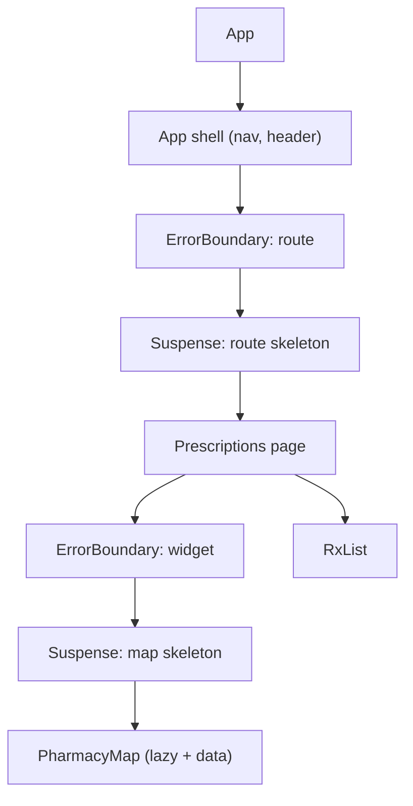
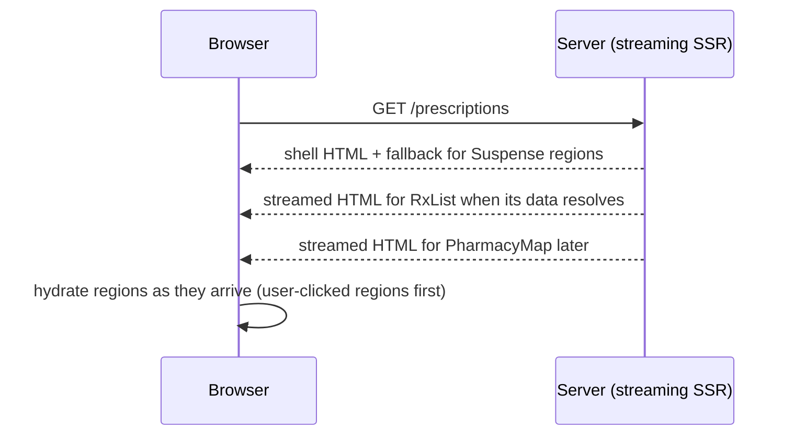

# Error Boundaries & Suspense

!!! abstract "Key takeaways"
    - An **error boundary** catches errors thrown **during rendering, in lifecycle methods and in constructors** of its children, and shows a fallback instead of unmounting the whole app. It does **not** catch errors in event handlers, async code (`setTimeout`, promises outside render), SSR, or in the boundary itself.
    - Error boundaries are still **class components** (`static getDerivedStateFromError` + `componentDidCatch`); most teams use `react-error-boundary` (`<ErrorBoundary FallbackComponent onReset resetKeys>`).
    - React 19 adds root options **`onCaughtError`** / **`onUncaughtError`** / `onRecoverableError` for central reporting, and no longer re-throws caught errors in production logs twice.
    - **Suspense** shows a fallback while children are **suspended**: waiting for lazy code (`lazy`), data from a Suspense-enabled source (`use(promise)`, React Query `useSuspenseQuery`, framework loaders), or other resources. Nested boundaries reveal UI progressively.
    - Pair them: **Suspense for loading, ErrorBoundary for failures**, placed per independent region (route, widget), not just once at the root.

## Why it matters

Without boundaries, one component throwing during render unmounts the entire React tree: a blank white page. In a healthcare portal that means a member can't reach anything because a single widget (say, a pharmacy map) failed. Suspense replaces hand-written loading flags with declarative loading states and enables streaming server rendering. Interviewers ask what boundaries catch (and don't), and how to design loading and error UX.


*Notice the nesting: if the map fails, only the map shows its fallback; the prescriptions list and the app shell keep working. If the whole route fails, the shell still lets the member navigate away.*

## Core concepts

### What error boundaries catch

| Error source | Caught? | What to do instead |
|---|---|---|
| Throw during render of a child | ✅ | |
| Lifecycle methods / constructors of children | ✅ | |
| Errors thrown from `use(promise)` rejection / Suspense data sources | ✅ (rethrown during render) | |
| Event handlers (`onClick`) | ❌ | try/catch, set error state, or `showBoundary` from react-error-boundary |
| Async code (timeouts, promise callbacks outside render) | ❌ | Catch and set state / rethrow into render |
| Server-side rendering | ❌ | Framework error handling |
| The boundary itself | ❌ | A parent boundary |

### Writing one

```tsx
class ErrorBoundary extends React.Component<{ fallback: React.ReactNode; children: React.ReactNode }, { hasError: boolean }> {
  state = { hasError: false };
  static getDerivedStateFromError() { return { hasError: true }; }        // render phase: switch to fallback
  componentDidCatch(error: Error, info: React.ErrorInfo) {                 // commit phase: side effects
    reportError(error, info.componentStack);
  }
  render() { return this.state.hasError ? this.props.fallback : this.props.children; }
}
```

`react-error-boundary` adds function-component ergonomics: `FallbackComponent` with `resetErrorBoundary`, `resetKeys` (auto-reset when e.g. the route or id changes), `onError`, and `useErrorBoundary().showBoundary(error)` to push event-handler/async errors into the nearest boundary.

### Central reporting (React 19)

```tsx
createRoot(container, {
  onUncaughtError: (error, info) => monitor.capture(error, { componentStack: info.componentStack, fatal: true }),
  onCaughtError: (error, info) => monitor.capture(error, { componentStack: info.componentStack }),
  onRecoverableError: (error) => monitor.capture(error, { level: "warning" }),   // e.g. hydration mismatches
}).render(<App />);
```

### Suspense

- A component **suspends** when it can't render yet. Supported sources: `lazy()` code, `use(promise)` with a cached promise, Suspense-enabled data libraries (React Query `useSuspenseQuery`, Relay, Apollo `useSuspenseQuery`), framework loaders, and `use(browser())`-style APIs.
- The **closest** `<Suspense fallback>` above shows its fallback until all suspended children are ready.
- **Not** triggered by data fetched in `useEffect`; that pattern needs manual loading state.
- **Transitions:** updates wrapped in `startTransition` keep showing the old UI instead of re-showing a fallback for already revealed content (avoids flashing spinners on navigation).
- **Nested boundaries** give progressive reveal; **sibling** content inside one boundary is revealed together.
- **Streaming SSR:** the server sends the shell, then streams each Suspense boundary's HTML as it resolves; selective hydration prioritises what the user interacts with.


*Notice the user sees the shell immediately and content fills in per boundary. Boundaries are both a UX and a delivery unit.*

### Designing loading and error UX

- Boundary per independent region: route, panel, widget.
- Fallbacks with the same layout as content (skeletons) to avoid layout shift.
- Error fallbacks that explain and offer recovery ("Try again" → reset), not stack traces.
- Avoid "spinner soup": group related content into one boundary; use transitions for navigation.
- Retry: reset the boundary and refetch/invalidate the failed query.

## In practice: code & configuration

=== "❌ Common mistake"
    ```tsx
    function App() {
      return <Routes />;                       // no boundary: one render error = blank page
    }

    function RefillButton() {
      const onClick = async () => {
        await api.refill();                    // rejected promise: not caught by any boundary
      };
      return <button onClick={onClick}>Refill</button>;
    }
    ```

=== "✅ Correct approach"
    ```tsx
    import { ErrorBoundary, useErrorBoundary } from "react-error-boundary";

    function RouteFallback({ error, resetErrorBoundary }: FallbackProps) {
      return (
        <div role="alert">
          <h2>Something went wrong loading this page.</h2>
          <button onClick={resetErrorBoundary}>Try again</button>
        </div>
      );                                        // no error.message to users (may leak internals/PHI)
    }

    function PrescriptionsRoute() {
      const { pathname } = useLocation();
      const qc = useQueryClient();
      return (
        <ErrorBoundary FallbackComponent={RouteFallback} resetKeys={[pathname]}
                       onReset={() => qc.resetQueries({ queryKey: ["rx"] })}>
          <Suspense fallback={<RxListSkeleton />}>
            <RxList />                             {/* useSuspenseQuery inside */}
          </Suspense>
          <ErrorBoundary fallback={<p>Map unavailable.</p>}>
            <Suspense fallback={<MapSkeleton />}><PharmacyMap /></Suspense>
          </ErrorBoundary>
        </ErrorBoundary>
      );
    }

    function RefillButton() {
      const { showBoundary } = useErrorBoundary();
      const m = useMutation({ mutationFn: api.refill, onError: e => toast.error("Refill failed. Try again.") });
      return <button onClick={() => m.mutate()}>Refill</button>;   // expected errors handled locally
    }
    ```

```tsx
// RxList with Suspense data
function RxList() {
  const { data } = useSuspenseQuery({ queryKey: ["rx"], queryFn: fetchPrescriptions }); // suspends until ready, throws on error
  return <ul>{data.map(rx => <li key={rx.id}>{rx.drug}</li>)}</ul>;
}
```

## Real-world usage

- Frameworks make boundaries per route the default: React Router's `ErrorBoundary` route export and `HydrateFallback`; Next.js `error.tsx` and `loading.tsx` per route segment.
- Sentry/Datadog RUM integrate with error boundaries and React 19 root callbacks to capture component stacks.
- **Healthcare:** isolate non-critical widgets (maps, recommendations, chat) so failures never block critical flows (view prescriptions, request refill); never show raw error messages that might contain PHI or internal details.

## Trade-offs & production gotchas

| Approach | Pros | Cons | Use when |
|---|---|---|---|
| Single root boundary | Simple | Whole app replaced on any error | Last-resort only |
| Per-route boundaries | Navigation survives failures | Some duplication | Always |
| Per-widget boundaries | Isolated failures | More fallbacks to design | Independent/optional widgets |
| Suspense + data library | Declarative loading, streaming | Needs Suspense-enabled source | New code, React Query/Relay/router loaders |
| Effect-based loading flags | Works everywhere | Boilerplate, waterfalls, races | Legacy code |

!!! warning "Gotcha: event handler errors"
    Boundaries don't catch them. Handle expected errors locally (toast, inline message) and use `showBoundary` for unexpected ones you want the boundary to display.

!!! warning "Gotcha: boundary never resets"
    After an error the fallback stays forever unless you reset (button, `resetKeys` on route/id change) and clear the failing cache entry.

!!! warning "Gotcha: Suspense fallback flashing"
    Revealed content replaced by a spinner on every navigation feels broken. Use transitions (routers do this) and keep previous data while refetching.

!!! question "Interview angle"
    "What do error boundaries catch and not catch?", "why are they classes?", "where do you put boundaries?", "how does Suspense know to show a fallback?", "Suspense with data fetching?".

## How this connects to my experience

- **Where I used it:** OptumRx React app and micro-frontends: each micro-frontend is a natural boundary so one team's failure doesn't break the shell. GraphQL partial results map onto per-widget error UI. *[confirm: boundary placement, library (react-error-boundary?), monitoring tool, Suspense usage with React Query or lazy routes]*
- **Talking points:**
    - "Each micro-frontend was wrapped in an error boundary in the shell, so a failing remote showed a fallback and the rest kept working." *[confirm]*
    - "GraphQL returned partial data with field errors, and the UI showed those sections as unavailable instead of failing the page." *[confirm]*
    - "Errors were reported with component stacks to our monitoring tool, without PHI." *[confirm tool]*
- **Likely follow-up chain:** "What happens if a component throws?" → "Where did you put boundaries?" → "How did you handle API errors?" → "Did you use Suspense for data?" → "How did micro-frontend failures stay isolated?"

## Interview questions

### Fundamentals

??? question "Q1. What is an error boundary?"
    **Answer:** A component that catches errors thrown while rendering its subtree (render, lifecycle, constructors), logs them and renders a fallback instead of unmounting the app.

    **Interviewer listens for:** catches render-time errors in subtree, logs, fallback UI.

    **Common wrong answer:** "It works like try/catch for all errors in the component." It catches only rendering-phase errors.

??? question "Q2. What don't error boundaries catch?"
    **Answer:** Errors in event handlers, async callbacks outside render, SSR, and in the boundary itself.

    **Interviewer listens for:** event handlers, async code, SSR, the boundary itself.

    **Common wrong answer:** "It catches API errors." A rejected fetch in a handler is never seen by a boundary.

??? question "Q3. What is Suspense?"
    **Answer:** A component that shows a fallback while its children are waiting for something (code via lazy, Suspense-enabled data), then reveals them when ready.

    **Interviewer listens for:** declarative loading state, lazy code, Suspense-enabled data, reveal when ready.

    **Common wrong answer:** "Suspense is a data fetching library." It only coordinates waiting; something must actually suspend.

### Intermediate

??? question "Q4. Why are error boundaries class components?"
    **Answer:** They rely on `getDerivedStateFromError` and `componentDidCatch`, which have no hook equivalents yet; libraries wrap them for function-component use.

    **Interviewer listens for:** getDerivedStateFromError and componentDidCatch have no hook equivalent; libraries wrap them.

    **Common wrong answer:** "Function components can be error boundaries with useErrorBoundary." That is a library hook built on a class.

??? question "Q5. getDerivedStateFromError vs componentDidCatch?"
    **Answer:** The first runs in the render phase to update state and show the fallback; the second runs in the commit phase for side effects like logging.

    **Interviewer listens for:** render phase state update vs commit phase side effects.

    **Common wrong answer:** Logging inside getDerivedStateFromError, which runs during render and must stay pure.

??? question "Q6. Does fetching in useEffect trigger Suspense?"
    **Answer:** No. Only Suspense-enabled sources (lazy, `use` with cached promises, libraries like React Query's suspense hooks, framework loaders) suspend.

    **Interviewer listens for:** only Suspense-enabled sources suspend.

    **Common wrong answer:** "Any fetch inside a Suspense boundary shows the fallback."

??? question "Q7. How do you recover from an error boundary?"
    **Answer:** Reset it (button calling reset, or resetKeys tied to route/params) and clear or refetch the failing data.

    **Interviewer listens for:** reset function or resetKeys, clear or refetch the failing data.

    **Common wrong answer:** "Reload the page." That throws away all user state.

??? question "Q8. How do you handle errors from data fetching in a React app?"
    **Answer:** Separate **expected** errors from **unexpected** ones. Expected (404, validation, permission) are part of the UI: render an inline message or empty state from the query's `error` state. Unexpected errors (bugs, 500s you can't recover from) can be thrown to the nearest **error boundary** (React Query's `throwOnError`, or `useErrorBoundary().showBoundary`). Add retries for transient errors only, a retry button, and report to monitoring with the request id or trace id so backend logs can be found.

    **Interviewer listens for:** expected vs unexpected, inline UI vs boundary, throwOnError/showBoundary, retries for transient only, correlation id.

    **Common wrong answer:** Sending every error to one global boundary, which replaces the whole screen for a simple 404.

### Senior

??? question "Q9. Where do you place boundaries in a large app?"
    **Answer:** Root as last resort, per route so navigation survives, per independent widget or micro-frontend for isolation; Suspense boundaries matching meaningful loading regions.

    **Interviewer listens for:** root, route and widget layers; loading regions that match the UI.

    **Common wrong answer:** One boundary at the root only, so any widget error blanks the whole app.

??? question "Q10. How do transitions interact with Suspense?"
    **Answer:** Updates inside startTransition keep already visible content instead of falling back to a spinner while the new content suspends, giving stable navigation.

    **Interviewer listens for:** transitions keep visible content, no fallback flash on navigation.

    **Common wrong answer:** "Transitions disable Suspense." The new content still suspends; old content just stays on screen.

??? question "Q11. What do onCaughtError and onUncaughtError do?"
    **Answer:** React 19 root options to centrally report errors caught by a boundary vs errors that reached the root, with component stacks.

    **Interviewer listens for:** central reporting hooks on the root, caught vs uncaught, component stacks.

    **Common wrong answer:** Thinking they replace error boundaries. They report; boundaries render the fallback.

### Scenario-based

??? question "Q12. A broken pharmacy map widget blanks the whole page."
    **Answer:** Wrap the widget in its own error boundary (and Suspense) with a small fallback, report the error, and keep critical content outside it.

    **Interviewer listens for:** widget-level boundary + Suspense, small fallback, reporting, critical content outside.

    **Common wrong answer:** "Add try/catch in the map component's render."

??? question "Q13. Clicking refill fails silently."
    **Answer:** The async error in the handler isn't caught by boundaries. Handle mutation errors (toast/inline message, retry), and use showBoundary only for unexpected failures.

    **Interviewer listens for:** handler errors bypass boundaries, explicit mutation error UI and retry, showBoundary for unexpected cases.

    **Common wrong answer:** "Wrap the button in an error boundary." The boundary never sees the async error.

## Cheat sheet

| Concept | Remember |
|---|---|
| Catches | Render, lifecycles, constructors of children; rejected `use()` promises |
| Doesn't catch | Event handlers, async outside render, SSR, itself |
| API | `getDerivedStateFromError` (fallback) + `componentDidCatch` (log) |
| Library | react-error-boundary: FallbackComponent, resetKeys, onReset, showBoundary |
| React 19 | `onCaughtError`, `onUncaughtError`, `onRecoverableError` |
| Suspense sources | lazy, `use(promise)`, suspense data libs, loaders |
| Not Suspense | useEffect fetching |
| Placement | Route + widget; skeleton fallbacks |
| Transitions | Keep old UI instead of fallback |
| SSR | Streaming per boundary, selective hydration |

## Sources

1. [react.dev: Catching rendering errors with an error boundary](https://react.dev/reference/react/Component#catching-rendering-errors-with-an-error-boundary).
2. [react.dev: Suspense](https://react.dev/reference/react/Suspense) and [use](https://react.dev/reference/react/use).
3. [react.dev: createRoot options (onCaughtError, onUncaughtError)](https://react.dev/reference/react-dom/client/createRoot#parameters).
4. [React 19 release: improved error handling](https://react.dev/blog/2024/12/05/react-19#error-handling).
5. [react-error-boundary](https://github.com/bvaughn/react-error-boundary).
6. [TanStack Query: Suspense](https://tanstack.com/query/latest/docs/framework/react/guides/suspense).
7. [React Router: Error boundaries](https://reactrouter.com/how-to/error-boundary).
