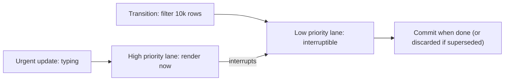

# React 18/19: Concurrent Rendering, Transitions, Actions, use, React Compiler

!!! abstract "Key takeaways"
    - **React 18 (March 2022):** `createRoot` enables **concurrent rendering** (interruptible, prioritised renders), **automatic batching** everywhere, **transitions** (`useTransition`, `startTransition`, `useDeferredValue`), `useId`, `useSyncExternalStore`, streaming SSR with Suspense and selective hydration. Strict Mode double-invokes effects in dev.
    - **React 19 (December 2024):** **Actions** (`<form action>`, `useActionState`, `useFormStatus`, `useOptimistic`), the **`use`** API (read promises and context, conditionally), **`ref` as a prop** (forwardRef deprecated), ref cleanup, `<Context>` as provider, document metadata and stylesheet support, resource preloading, **Server Components and Server Functions** stable, better error reporting. Removed: `ReactDOM.render`, string refs, legacy context, `propTypes`, function `defaultProps`.
    - **19.2 (Oct 2025):** `<Activity>`, `useEffectEvent`, Performance Tracks, partial pre-rendering. **19.3 (Sep 2026):** `<ViewTransition>`, Fragment refs, `browser()`, Trusted Types.
    - **React Compiler 1.0 (Oct 2025):** build-time automatic memoisation (React 17+), lint rules in `eslint-plugin-react-hooks`.
    - Ecosystem: **Create React App was deprecated (Feb 2025)**; start with a framework (Next.js, React Router framework mode) or a build tool (Vite).

## Why it matters

"What's new in React 18/19?" is the version question for a lead frontend role. More importantly, concurrent rendering changes guarantees: renders can be interrupted, repeated or thrown away, which is why purity, effect cleanup and external-store subscriptions matter. React 19 changes how forms and data mutations are written. Knowing what moved where (forwardRef → ref prop, CRA → Vite/frameworks) shows current practice.


*Notice the core idea of concurrency: urgent updates can interrupt a long, non-urgent render. That's why renders must be pure. React may start one and throw it away.*

{ loading=lazy }
*Watch the second keystroke: in the top lane it waits behind the long render; in the bottom lane it runs at once and the stale list work is discarded.*

## Core concepts

### React 18

| Feature | What it does |
|---|---|
| `createRoot` | New root API; enables concurrent features (old `ReactDOM.render` = legacy mode, removed in 19) |
| Concurrent rendering | Rendering can be paused, resumed, abandoned; updates get priorities (lanes) |
| Automatic batching | All updates in the same tick → one render (promises, timeouts too) |
| `startTransition` / `useTransition` | Mark updates as non-urgent; `isPending` flag; previous UI stays during transition |
| `useDeferredValue` | Defer a value so expensive dependent rendering lags behind urgent updates |
| `useId` | Stable unique ids across server and client |
| `useSyncExternalStore` | Tear-free subscriptions to external stores under concurrent rendering |
| `useInsertionEffect` | For CSS-in-JS libraries to inject styles before layout |
| Streaming SSR | `renderToPipeableStream`/`renderToReadableStream` with Suspense; selective hydration |
| Strict Mode | Dev: mount → unmount → mount to test effect cleanup |

**Tearing:** with concurrent rendering, an external store changing mid-render could make different components show different values; `useSyncExternalStore` prevents that (Redux, Zustand use it).

### React 19

- **Actions:** async functions used in transitions; pending state, errors, optimistic updates and form reset handled by React.
    - `useActionState(action, initial)` → `[state, formAction, isPending]`
    - `useFormStatus()` → pending status of the parent `<form>`
    - `useOptimistic(state, update)` → optimistic value during the action
    - `<form action={fn}>`, `<button formAction={fn}>`
- **`use(resource)`**: read a promise (suspends until resolved; rejected → nearest error boundary) or a context; may be called conditionally and in loops (unlike hooks).
- **Refs:** `ref` is a regular prop for function components; ref callbacks can return cleanup; `forwardRef` deprecated.
- **`<Context value>`** instead of `<Context.Provider>`.
- **Document metadata:** `<title>`, `<meta>`, `<link>` rendered anywhere are hoisted to `<head>`; stylesheets with `precedence`; async scripts deduplicated; `preload`, `preinit`, `prefetchDNS`, `preconnect`.
- **Server Components (RSC):** components that run only on the server (or at build), can be async and access data directly, send serialized output to the client; client components marked `'use client'`. **Server Functions** (`'use server'`) callable from the client. Used through frameworks (Next.js App Router, React Router RSC support).
- **Errors:** `onCaughtError`/`onUncaughtError`, clearer hydration mismatch diffs.
- **Removals:** `ReactDOM.render`/`hydrate`, `unmountComponentAtNode`, string refs, legacy context, `propTypes` checks, `defaultProps` on function components, `react-test-renderer/shallow`.
- **Security note:** critical RSC vulnerabilities were disclosed in December 2025 (remote code execution, then DoS/source exposure), fixed in patched 19.0.x/19.1.x/19.2.x releases. Keep React and frameworks patched.

### React 19.2 and 19.3

- **`<Activity mode="visible" | "hidden">`** (19.2): hide a subtree while preserving its state; effects unmount when hidden and updates are deferred. Good for tabs and pre-rendering likely next screens.
- **`useEffectEvent`** (19.2): latest-value logic inside effects without dependencies.
- **Performance Tracks** (19.2): Scheduler and Components tracks in Chrome DevTools.
- **Partial pre-rendering** (19.2): `prerender` static shell, `resume` dynamic parts later.
- **`<ViewTransition>`** (19.3, stable): animate enter/exit/update/shared elements using the browser View Transition API, triggered by transitions, Suspense and deferred values; `addTransitionType`.
- **Fragment refs** (19.3): a ref on `<Fragment>` gives a `FragmentInstance` (focus, event listeners, observers on the group).
- **`browser()`** (19.3, react-dom): `use(browser())` opts a component out of SSR (suspends on the server).
- **Trusted Types** support (19.3).

### React Compiler 1.0

- Build-time Babel plugin (`babel-plugin-react-compiler`), compatible with React 17+ (with `react-compiler-runtime` for 17/18).
- Automatically memoises components, values and JSX, including conditionally after early returns.
- Validates the **Rules of React**; compiler lint rules ship in `eslint-plugin-react-hooks` (e.g. `set-state-in-render`, `set-state-in-effect`, `refs`).
- Meta reported up to 12% faster loads/navigations and some interactions over 2.5× faster.

### Tooling and ecosystem changes

- **Create React App** deprecated for new apps (Feb 2025): use a framework (Next.js, React Router framework mode, Expo) or Vite/Parcel/Rsbuild.
- **React Router v8** requires React 19.2+ (see Routing page).
- **The React Foundation** under the Linux Foundation (2026) governs React.

## In practice: code & configuration

### Upgrading the root and removing legacy APIs

=== "❌ Legacy (React 17 style)"
    ```tsx
    import ReactDOM from "react-dom";
    ReactDOM.render(<App />, document.getElementById("root"));      // removed in React 19

    const Input = React.forwardRef<HTMLInputElement, Props>((props, ref) => <input ref={ref} {...props} />);
    Input.defaultProps = { size: "md" };                           // removed for function components

    <ThemeContext.Provider value={theme}>{children}</ThemeContext.Provider>
    ```

=== "✅ React 19"
    ```tsx
    import { createRoot } from "react-dom/client";
    createRoot(document.getElementById("root")!, {
      onUncaughtError: (e, info) => monitor.capture(e, info),
    }).render(<StrictMode><App /></StrictMode>);

    function Input({ ref, size = "md", ...props }: Props & { ref?: React.Ref<HTMLInputElement> }) {
      return <input ref={ref} data-size={size} {...props} />;       // ref is a prop; default via destructuring
    }

    <ThemeContext value={theme}>{children}</ThemeContext>
    ```

### Transition for a slow update

```tsx
function TabSwitcher() {
  const [tab, setTab] = useState<"rx" | "claims">("rx");
  const [isPending, startTransition] = useTransition();
  return (
    <>
      <button onClick={() => startTransition(() => setTab("claims"))}>Claims</button>
      {isPending && <Spinner size="sm" />}                  {/* old tab stays visible meanwhile */}
      <Activity mode={tab === "rx" ? "visible" : "hidden"}><RxTab /></Activity>       {/* keeps state */}
      <Activity mode={tab === "claims" ? "visible" : "hidden"}><ClaimsTab /></Activity>
    </>
  );
}
```

### Optimistic update with an Action

```tsx
function Favourite({ pharmacy }: { pharmacy: Pharmacy }) {
  const [optimistic, setOptimistic] = useOptimistic(pharmacy.isFavourite);
  async function toggle() {
    setOptimistic(!optimistic);                     // UI updates immediately
    await api.setFavourite(pharmacy.id, !pharmacy.isFavourite);   // reverts automatically on failure
  }
  return <form action={toggle}><button>{optimistic ? "★" : "☆"}</button></form>;
}
```

{ loading=lazy }
*Notice step 3: the user already sees the filled star while the request is still in flight. Step 4 shows the real state again.*

### Enabling React Compiler (Vite)

```ts
// vite.config.ts
import react from "@vitejs/plugin-react";
export default defineConfig({
  plugins: [react({ babel: { plugins: ["babel-plugin-react-compiler"] } })],
});
```

## Real-world usage

- Meta runs React 19 features and React Compiler across its apps; Instagram and Quest Store were early compiler adopters.
- Next.js App Router made Server Components mainstream; React Router added framework mode and RSC support.
- Teams upgrading 17 → 18 → 19 mostly hit: `createRoot` migration, effects double-running in Strict Mode (missing cleanups), third-party libraries using removed APIs (string refs, `findDOMNode`, legacy context), and test renderer changes.
- **Healthcare:** transitions keep large data views (claims, prescriptions) responsive on low-end devices; Actions + `useOptimistic` simplify refill/favourite flows with honest failure handling; patching RSC vulnerabilities quickly matters for regulated apps.

## Trade-offs & production gotchas

| Feature | Benefit | Watch out |
|---|---|---|
| Concurrent rendering | Responsive UI under load | Renders can repeat: purity, cleanup |
| Transitions | Keep UI responsive, no spinner flash | Only for state updates, not controlled input value itself |
| Actions | Less boilerplate for mutations/forms | React 19 only; learn new hooks |
| `use` | Conditional context, Suspense data | Promise must be cached/stable (not created in render) |
| Server Components | Less JS, direct data access | Framework required, new mental model, security patches |
| Activity | Preserve hidden state | Hidden trees still use memory |
| Compiler | Automatic memoisation | Must follow Rules of React; build step |

!!! warning "Gotcha: creating promises in render for `use`"
    `use(fetch(...))` in a client component creates a new promise every render → infinite suspend. Promises must come from a cache, a loader, a parent, or a Server Component.

!!! warning "Gotcha: transitions for input value"
    The input's own `value` update must stay urgent; put the expensive consequence in a transition or use `useDeferredValue`.

!!! warning "Gotcha: libraries on removed APIs"
    Old libraries using `findDOMNode`, string refs or legacy context break on React 19. Check dependencies before upgrading.

!!! question "Interview angle"
    "What's new in React 18 and 19?", "what is concurrent rendering?", "useTransition vs useDeferredValue?", "what are Actions?", "what's `use`?", "Server Components vs SSR?", "what does the React Compiler do?".

## How this connects to my experience

- **Where I used it:** OptumRx React app "from the ground up" (Jan 2023 onwards), so likely React 18 with createRoot; micro-frontends; React Query. *[confirm: React version, whether you upgraded to 19, any use of transitions, Suspense or Server Components, and whether the app was Vite/CRA/webpack]*
- **Talking points:**
    - "We started on React 18: createRoot, automatic batching, and Strict Mode surfaced missing effect cleanups early." *[confirm]*
    - "For an upgrade to 19 I'd audit dependencies for removed APIs, replace forwardRef and defaultProps, adopt Actions for forms, and try the compiler on one micro-frontend first."
    - "CRA is deprecated; new micro-frontends would use Vite or a framework." *[confirm what the build tool was]*
- **Likely follow-up chain:** "What changed in React 18?" → "Explain concurrent rendering" → "useTransition example?" → "What's new in 19 you'd use?" → "RSC vs SSR?" → "How would you upgrade a large app?"

## Interview questions

### Fundamentals

??? question "Q1. What is concurrent rendering?"
    **Answer:** React can prepare multiple versions of the UI, interrupt a render for a more urgent update, and discard or resume work, based on priorities. Enabled by createRoot.

    **Interviewer listens for:** interruptible, prioritised rendering, discarded work, createRoot.

    **Common wrong answer:** "Concurrent means multi-threaded." React still renders on one thread; it can pause and resume.

??? question "Q2. What is automatic batching?"
    **Answer:** React 18 batches state updates from any source in the same tick into one render, not only in React event handlers.

    **Interviewer listens for:** batching from any source in React 18.

    **Common wrong answer:** "Batching changes the final state." It only reduces the number of renders.

??? question "Q3. What are Actions in React 19?"
    **Answer:** Async functions run in transitions, usable as form actions, with built-in pending state (useActionState, useFormStatus), optimistic updates (useOptimistic), error handling and form reset.

    **Interviewer listens for:** async functions in transitions, pending state, optimistic updates, error handling, form reset.

    **Common wrong answer:** "Actions are a Redux concept." In React 19 they are built-in async transition functions.

### Intermediate

??? question "Q4. useTransition vs useDeferredValue?"
    **Answer:** useTransition wraps state updates you trigger, marking them non-urgent and giving isPending. useDeferredValue gives a deferred copy of a value you receive, so dependent rendering lags.

    **Interviewer listens for:** who owns the update, isPending, lagging dependent rendering.

    **Common wrong answer:** Using useDeferredValue on a value you set yourself when useTransition would be clearer.

??? question "Q5. What does `use` do and how is it different from hooks?"
    **Answer:** Reads a promise (suspending until resolved) or context. Unlike hooks it can be called conditionally and in loops, but must be called during render.

    **Interviewer listens for:** promise or context, conditional call allowed, must be in render, cached promises.

    **Common wrong answer:** "use() can fetch data directly." Creating the promise inside render makes a new request every render.

??? question "Q6. What happened to forwardRef?"
    **Answer:** In React 19, function components receive `ref` as a normal prop; forwardRef is deprecated (still works).

    **Interviewer listens for:** ref as a prop in React 19, forwardRef deprecated.

    **Common wrong answer:** "forwardRef was removed." It still works; it is deprecated.

??? question "Q7. What is tearing and how is it prevented?"
    **Answer:** Different parts of the UI showing different values of an external store during an interruptible render. `useSyncExternalStore` forces consistent reads.

    **Interviewer listens for:** inconsistent reads of external stores during interruptible renders, useSyncExternalStore.

    **Common wrong answer:** "Tearing is a CSS layout bug."

### Senior

??? question "Q8. Server Components vs SSR?"
    **Answer:** SSR renders client components to HTML on the server, then hydrates them on the client (all JS still shipped). Server Components run only on the server and send serialized output; their code never ships to the client. They combine: RSC output can be SSR'd.

    **Interviewer listens for:** SSR = HTML + hydration with full JS; RSC = server-only code, no client bundle; they combine.

    **Common wrong answer:** "Server Components are just SSR." RSC code never ships to the browser; SSR components do.

??? question "Q9. What does React Compiler do?"
    **Answer:** At build time, analyses components and hooks and inserts fine-grained memoisation automatically, validates the Rules of React, and reduces the need for manual memo/useMemo/useCallback.

    **Interviewer listens for:** build-time memoisation, Rules of React validation, less manual memo.

    **Common wrong answer:** "It is a new runtime." It is a Babel/build plugin; the runtime is the same React.

??? question "Q10. What is <Activity>?"
    **Answer:** React 19.2 component that hides a subtree (mode hidden) while preserving its state; effects are cleaned up when hidden and updates deferred, so you can keep tabs alive or pre-render next screens.

    **Interviewer listens for:** hides subtree while keeping state, effects cleaned up, deferred updates, pre-rendering.

    **Common wrong answer:** "It is just `display: none`." Activity also unmounts effects and lowers update priority.

??? question "Q11. Which APIs were removed in React 19?"
    **Answer:** ReactDOM.render/hydrate, unmountComponentAtNode, string refs, legacy context, propTypes checking, defaultProps for function components, shallow test renderer.

    **Interviewer listens for:** render/hydrate, string refs, legacy context, propTypes checks, function defaultProps, test renderer.

    **Common wrong answer:** "React 19 removed class components." Class components are still supported.

### Scenario-based

??? question "Q12. Plan an upgrade of a large app from React 17 to 19."
    **Answer:** Move to createRoot on 18 first, fix Strict Mode effect issues, audit third-party libraries for removed APIs, run codemods (ref as prop, Context provider), upgrade tests (RTL), then 19; canary per micro-frontend; add the compiler later.

    **Interviewer listens for:** 18 first with createRoot, Strict Mode fixes, library audit, codemods, tests, staged rollout, compiler later.

    **Common wrong answer:** Jumping straight from 17 to 19 in one release across all teams.

??? question "Q13. Switching tabs with heavy content freezes typing."
    **Answer:** Wrap the tab change in startTransition (or defer the heavy value), keep previous content visible with isPending, and consider Activity to keep tab state instead of remounting.

    **Interviewer listens for:** startTransition for the tab switch, isPending, Activity to keep state.

    **Common wrong answer:** "Debounce the tab click."

## Cheat sheet

| Version | Key items |
|---|---|
| 18 (Mar 2022) | createRoot, concurrent, auto batching, transitions, useDeferredValue, useId, useSyncExternalStore, streaming SSR |
| 19 (Dec 2024) | Actions, useActionState, useFormStatus, useOptimistic, use, ref prop, ref cleanup, `<Context>` provider, metadata, preload APIs, RSC stable |
| 19 removed | ReactDOM.render, string refs, legacy context, propTypes, function defaultProps |
| 19.2 (Oct 2025) | Activity, useEffectEvent, Performance Tracks, partial pre-rendering |
| 19.3 (Sep 2026) | ViewTransition, Fragment refs, browser(), Trusted Types |
| Compiler 1.0 (Oct 2025) | Auto memoisation; React 17+; lint in react-hooks plugin |
| Tooling | CRA deprecated (Feb 2025) → Vite / frameworks |

## Sources

1. [React v18.0 (March 2022)](https://react.dev/blog/2022/03/29/react-v18).
2. [React v19 (December 2024)](https://react.dev/blog/2024/12/05/react-19) and [React 19 Upgrade Guide](https://react.dev/blog/2024/04/25/react-19-upgrade-guide).
3. [React 19.2 (October 2025)](https://react.dev/blog/2025/10/01/react-19-2).
4. [React 19.3 (September 2026)](https://react.dev/blog/2026/09/09/react-19-3).
5. [React Compiler v1.0 (October 2025)](https://react.dev/blog/2025/10/07/react-compiler-1).
6. [Sunsetting Create React App (February 2025)](https://react.dev/blog/2025/02/14/sunsetting-create-react-app).
7. [react.dev: Server Components](https://react.dev/reference/rsc/server-components).
8. [React blog: Critical Security Vulnerability in React Server Components (December 2025)](https://react.dev/blog).
