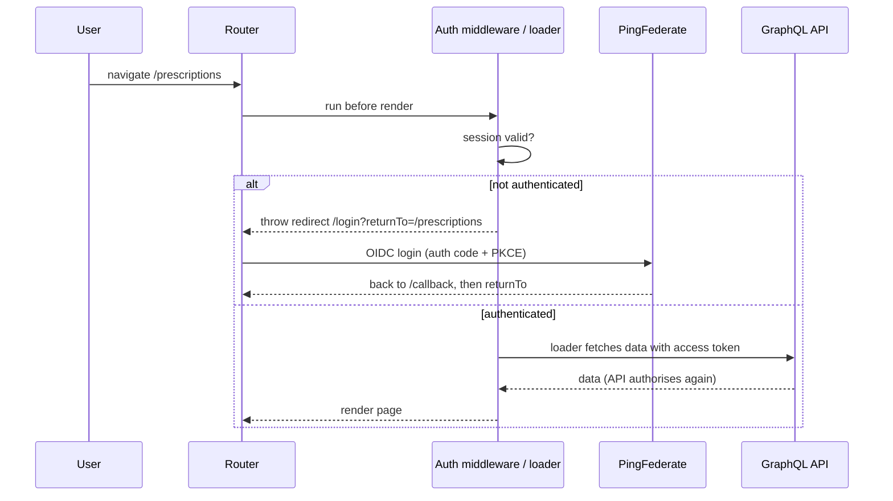
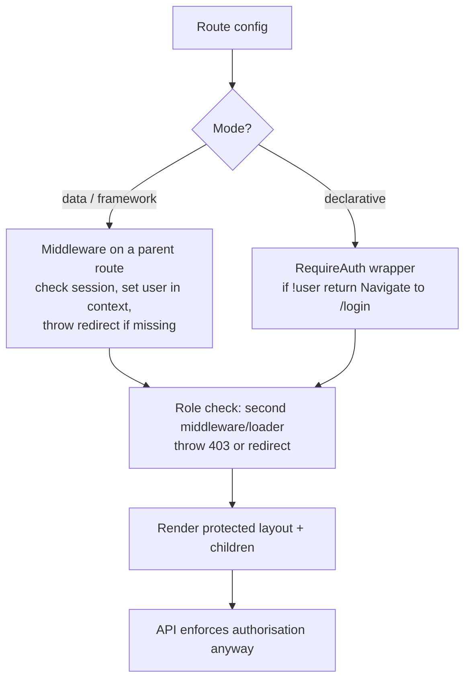

# Routing (React Router) & Auth-Protected Routes

!!! abstract "Key takeaways"
    - **Client-side routing** maps URLs to components without full page reloads using the History API. React Router is the de facto library; **v8** (current) ships everything from the `react-router` package (`react-router-dom` removed) and requires React 19.2+.
    - Three modes: **declarative** (`<BrowserRouter>`, `<Routes>`), **data** (`createBrowserRouter` with loaders, actions, error boundaries, lazy routes) and **framework** (Vite plugin, file routes, SSR, type-safe route modules).
    - **Nested routes + `<Outlet>`** give shared layouts; URL **params** and **search params** hold navigational state (filters, pagination).
    - **Protecting routes:** in data/framework mode, use **middleware** (stable in v8) or a loader that checks the session and `throw redirect("/login?returnTo=…")` **before rendering**; in declarative mode, a `<RequireAuth>` guard component with `<Navigate replace>`. Preserve the return URL.
    - **Client-side guards are UX, not security.** The API must authorise every request; the UI only hides what the user can't use. Handle token expiry (silent refresh or re-login), logout across tabs, and role/permission-based routes.

## Why it matters

Every SPA needs routing, and every healthcare portal needs authenticated and role-restricted areas. This is ★ on your resume through "Built the ReactJS application from the ground up and established a micro-frontend architecture" plus OAuth2/PingFederate login. Interviewers ask how you protected routes, handled login redirects and expired sessions, and how routing worked across micro-frontends.


*Notice the check happens before rendering, so protected content never flashes, and the API still authorises every call: the router check is for UX.*

## Core concepts

### Client-side routing basics

- History API (`pushState`, `popstate`) changes the URL without reloading; the router re-renders the matching route.
- The server must serve `index.html` for all app routes (SPA fallback) or render them (SSR).
- `<Link>`/`<NavLink>` for navigation (accessible anchors), `useNavigate()` for programmatic navigation, `useParams()`, `useSearchParams()`, `useLocation()`.

### Modes in React Router v8

| Mode | Setup | Gives you |
|---|---|---|
| Declarative | `<BrowserRouter><Routes><Route/></Routes>` | URL matching, nested routes, navigation |
| Data | `createBrowserRouter([...])` + `<RouterProvider>` | Loaders, actions, `<Form>`, error boundaries, lazy routes, pending UI, middleware |
| Framework | `@react-router/dev` Vite plugin, `routes.ts` | Data mode + SSR/SSG, file-based route modules, type safety, code splitting |

v8 changes to remember: imports from `react-router` (DOM-specific from `react-router/dom`), `loaderData` instead of `data` in `meta`/`useMatches`, Node 22+, React 19.2+, Vite 7+ for framework mode; middleware and split route modules (formerly v7 future flags) are default.

### Nested routes and layouts

```tsx
const router = createBrowserRouter([
  {
    path: "/",
    Component: AppLayout,                 // header, nav, <Outlet/>
    ErrorBoundary: RootError,
    children: [
      { index: true, Component: Home },
      {
        path: "members/:memberId",
        Component: MemberLayout,          // tabs + <Outlet/>
        loader: memberLoader,
        children: [
          { path: "prescriptions", lazy: () => import("./routes/prescriptions") },
          { path: "claims", lazy: () => import("./routes/claims") },
        ],
      },
    ],
  },
]);
```

{ loading=lazy }
*Watch the coloured boxes: when the URL changes to /claims, only the innermost Outlet gets new content.*

### Loaders and actions

- **Loader:** runs before the route renders (in parallel for all matched routes, avoiding waterfalls); returns data read with `useLoaderData()`.
- **Action:** handles `<Form method="post">` submissions; after an action, loaders revalidate automatically.
- **Errors** thrown in loaders/actions/rendering go to the route's `ErrorBoundary` (`useRouteError()`).
- **Pending UI:** `useNavigation().state` (`idle`/`loading`/`submitting`), `useFetcher` for non-navigation mutations.

{ loading=lazy }
*Watch the red bars step down and to the right: each request waits for its parent component to render, while the green bars all start at zero.*

### Protecting routes


*Notice the guard sits on a parent layout route so every child is protected in one place, and the API is the real enforcement point.*

- **Middleware** (v8, data and framework modes): runs parent → child before loaders, can `throw redirect()`, set typed values in `context` (`createContext<User>()`, `context.set/get`), and run code after the response. In data mode the route property is `middleware` (runs in the browser); in framework mode route modules export `middleware` (server) and `clientMiddleware` (browser). `getContext` on `createBrowserRouter` can seed a `RouterContextProvider` up front.
- **Loader guard:** older pattern in data mode: `if (!session) throw redirect(...)`.
- **Declarative guard:** `<RequireAuth>` that renders `<Navigate to="/login" replace state={{ from: location }}/>`. Risk: content can flash if auth state loads asynchronously; render a loading state until auth is known.
- **Return URL:** pass `returnTo` and validate it's a same-origin path (avoid open redirects).
- **Roles/permissions:** route `handle` metadata or nested middleware checking claims (from the ID token or a `/me` endpoint); hide nav links for unavailable routes, but rely on the API for enforcement.

### Tokens and sessions in the SPA

- Best practice: a **BFF** holds tokens server-side; the browser has an HttpOnly session cookie (see Spring Security sessions page). The router checks a `/me` or session endpoint.
- If the SPA holds tokens: in memory (not localStorage), short-lived access token, refresh via the IdP library (oidc-client-ts, MSAL), redirect to login on refresh failure.
- **Session expiry:** idle timeout warning, logout on 401 from the API (global handler), redirect with `returnTo`.
- **Logout across tabs:** BroadcastChannel/storage event to log out every tab; RP-initiated logout at the IdP.

### Micro-frontends and routing

- The **shell** owns top-level routes and auth; each micro-frontend owns routes under a prefix (`/claims/*`) and is lazy-loaded.
- One router instance in the shell (micro-frontends use relative routes) or one per micro-frontend under a basename; avoid two routers fighting over the URL.
- Share auth state through the shell (shared module, events), not by each micro-frontend logging in again.

## In practice: code & configuration

### Middleware-based protection (data mode, v8)

=== "❌ Common mistake"
    ```tsx
    function Prescriptions() {
      const user = useAuth();
      const [rx, setRx] = useState([]);
      useEffect(() => { fetchRx().then(setRx); }, []);   // fetches before auth check, content flashes
      if (!user) { window.location.href = "/login"; }    // full reload, return URL lost
      if (user.role !== "pharmacist") return null;        // UI-only "security"
      return <RxList rx={rx} />;
    }
    ```

=== "✅ Correct approach"
    ```tsx
    import { createBrowserRouter, createContext, redirect } from "react-router";
    import { RouterProvider } from "react-router/dom";

    export const userContext = createContext<User>();

    const requireAuth = async ({ request, context }: LoaderFunctionArgs) => {
      const user = await session.currentUser();              // e.g. GET /me via BFF cookie
      if (!user) {
        const url = new URL(request.url);
        throw redirect(`/login?returnTo=${encodeURIComponent(url.pathname + url.search)}`);
      }
      context.set(userContext, user);
    };

    const requireRole = (role: Role) => ({ context }: LoaderFunctionArgs) => {
      if (!context.get(userContext).roles.includes(role)) throw new Response("Forbidden", { status: 403 });
    };

    const router = createBrowserRouter([
      { path: "/login", Component: Login },
      {
        path: "/",
        Component: AppLayout,
        ErrorBoundary: RootError,                          // renders 403/404/500 nicely
        middleware: [requireAuth],                         // data mode: route `middleware` runs in the browser
        children: [
          {
            path: "prescriptions",
            loader: ({ context }) => fetchRx(context.get(userContext).id),   // user guaranteed here
            Component: Prescriptions,
          },
          {
            path: "admin",
            middleware: [requireRole("admin")],
            lazy: () => import("./routes/admin"),
          },
        ],
      },
    ]);

    createRoot(el).render(<RouterProvider router={router} />);
    ```

### Declarative-mode guard (when not using data APIs)

```tsx
function RequireAuth({ children }: { children: React.ReactNode }) {
  const { user, status } = useSession();          // status: "loading" | "authenticated" | "anonymous"
  const location = useLocation();
  if (status === "loading") return <FullPageSpinner />;          // no flash of protected content
  if (!user) return <Navigate to="/login" replace state={{ from: location }} />;
  return children;
}

<Routes>
  <Route path="/login" element={<Login />} />
  <Route element={<RequireAuth><AppLayout /></RequireAuth>}>
    <Route path="prescriptions" element={<Prescriptions />} />
  </Route>
</Routes>
```

### Safe return URL

```ts
function safeReturnTo(raw: string | null): string {
  if (!raw || !raw.startsWith("/") || raw.startsWith("//")) return "/";   // same-origin paths only
  return raw;
}
```

## Real-world usage

- React Router (Remix merged into it) and Next.js are the two dominant routing solutions; React Router v7 introduced framework mode, v8 made middleware and split route modules default.
- Enterprise SSO apps typically use an OIDC library (oidc-client-ts, MSAL, Okta/Ping SDKs) or a BFF for login, with the router guarding layouts.
- **Healthcare:** role-based areas (member vs pharmacist vs admin), idle-timeout logout (HIPAA session controls), no PHI in URLs or query strings (they end up in logs and analytics), and audit of access is on the server.

## Trade-offs & production gotchas

| Approach | Pros | Cons | Use when |
|---|---|---|---|
| Declarative guard component | Simple, works everywhere | Fetch-then-check, flashes, waterfalls | Small apps, declarative mode |
| Loader guard | Before render, data mode | Repeated in each loader without middleware | Data mode pre-middleware |
| Middleware | Central, before loaders, typed context | Data/framework mode only | v8 apps |
| BFF session | Tokens off the browser, simple guard | Server component needed | Recommended for sensitive apps |

!!! warning "Gotcha: UI guards as security"
    Hiding a route doesn't stop anyone calling the API. The backend must authenticate and authorise every request (object-level too).

!!! warning "Gotcha: open redirect via returnTo"
    `?returnTo=https://evil.example` after login sends users to an attacker. Allow only same-origin relative paths.

!!! warning "Gotcha: PHI in URLs"
    `/members/123-45-6789` or `?name=...` leak into browser history, logs, analytics and referrers. Use opaque ids; keep sensitive data in bodies.

!!! warning "Gotcha: two routers in micro-frontends"
    Shell and micro-frontend both owning the history causes double navigation and broken back buttons. One owner, with basenames for the rest.

!!! question "Interview angle"
    "How did you protect routes?", "what happens when the token expires?", "where do you check roles?", "how does routing work with micro-frontends?", "what's new in React Router 7/8?". Always add: the API enforces it anyway.

## How this connects to my experience

★ **Resume claim:** "Built the ReactJS application from the ground up and established a micro-frontend architecture" and "Built secure enterprise APIs using OAuth2, PingFederate, and Active Directory integration" (OptumRx Meteor).

- **Where I used it:** routing and authenticated areas in the OptumRx React app, across micro-frontends, with login via PingFederate. *[confirm: React Router version and mode, how routes were protected (guard component, loaders), whether a BFF or the SPA held tokens, OIDC library used, role-based routes, how micro-frontends shared routing and auth]*
- **Talking points:**
    - "The shell owned top-level routing and authentication; each micro-frontend was lazy-loaded under its own path prefix and received the session from the shell." *[confirm]*
    - "Protected layouts checked the session before rendering and redirected to PingFederate login with a validated return URL; the GraphQL API authorised every request regardless." *[confirm]*
    - "Session expiry: a 401 from the API triggered re-login with returnTo; idle timeout logged members out across tabs." *[confirm]*
    - "Role-based screens (e.g. member vs staff) were hidden in navigation and guarded in routes, but the API enforced roles and object-level access." *[confirm roles]*
- **Likely follow-up chain:** "How did you protect routes?" → "Where were tokens stored?" → "What happens when the token expires mid-session?" → "How did micro-frontends know who was logged in?" → "How would you do it with React Router 8 middleware?"

## Interview questions

### Fundamentals

??? question "Q1. How does client-side routing work?"
    **Answer:** The router listens to the History API, matches the URL to a route config and renders the matching components without reloading; links push new history entries. The server must return the app for deep links.

    **Interviewer listens for:** History API, route matching, no reload, server fallback for deep links.

    **Common wrong answer:** Forgetting the server rewrite, so refreshing `/claims/42` returns a 404.

??? question "Q2. What are nested routes and Outlet?"
    **Answer:** Child routes render inside a parent layout at the `<Outlet/>` position, so layouts (nav, tabs) are shared and only the inner part changes.

    **Interviewer listens for:** layout reuse, Outlet placement, only inner part changes.

    **Common wrong answer:** Repeating the nav and layout inside every page component.

??? question "Q3. How do you protect a route?"
    **Answer:** Check authentication before rendering (middleware or loader with redirect in data mode, a guard component in declarative mode), redirect to login with a return URL, and rely on the API for real authorisation.

    **Interviewer listens for:** check before render, redirect with return URL, API is the real authority.

    **Common wrong answer:** "Hiding the route is enough security." The API must enforce authorisation.

### Intermediate

??? question "Q4. What are loaders and actions?"
    **Answer:** Route-level functions: loaders fetch data before render (in parallel across matched routes); actions handle form submissions and trigger loader revalidation.

    **Interviewer listens for:** route-level data before render, parallel loading, actions with revalidation.

    **Common wrong answer:** Fetching in useEffect inside each nested route, which creates waterfalls.

??? question "Q5. What is React Router middleware?"
    **Answer:** Functions on routes that run parent-to-child before loaders/actions (and after for responses), can redirect, and pass typed values via context. Stable in v8; client and server variants.

    **Interviewer listens for:** parent-to-child order, runs before loaders/actions, redirect, typed context, v8 stable.

    **Common wrong answer:** Thinking middleware runs on the API server only. Client middleware runs in the browser.

??? question "Q6. Why put state in search params?"
    **Answer:** Filters, sorting and pagination become shareable, bookmarkable, survive refresh and back/forward navigation.

    **Interviewer listens for:** shareable, bookmarkable, survives refresh, back/forward.

    **Common wrong answer:** Keeping filters only in component state, so refresh or a shared link loses them.

??? question "Q7. How do you avoid flashing protected content?"
    **Answer:** Decide auth before rendering (middleware/loader), or show a loading state until session status is known in a guard component.

    **Interviewer listens for:** decide before render, loading state until session known.

    **Common wrong answer:** Rendering the page and redirecting in useEffect, which flashes protected content.

### Senior

??? question "Q8. What changed in React Router v7 and v8?"
    **Answer:** v7 merged Remix (framework mode, type-safe route modules) and offered future flags; v8 removed `react-router-dom`, made middleware and split route modules default, requires React 19.2+, Node 22+, Vite 7+ for framework mode, and renamed `data` to `loaderData` in meta/matches.

    **Interviewer listens for:** Remix merge, framework mode, type-safe modules, v8 requirements and removals.

    **Common wrong answer:** "React Router 7 is a rewrite with a new API." Library (declarative) mode is still largely compatible with v6.

??? question "Q9. Where should tokens live in an SPA?"
    **Answer:** Preferably not in the browser (BFF with HttpOnly cookie). Otherwise in memory with short lifetimes and refresh via the IdP library; never localStorage.

    **Interviewer listens for:** BFF + HttpOnly cookie, in-memory fallback, short lifetimes, XSS exposure of localStorage.

    **Common wrong answer:** "localStorage is fine with HTTPS." HTTPS does not stop XSS from reading it.

??? question "Q10. How do you route across micro-frontends?"
    **Answer:** Shell owns top-level routes and history; each micro-frontend lazy-loads under a prefix with relative routes; one history owner; shared auth via the shell.

    **Interviewer listens for:** shell owns history, prefix per micro-frontend, relative routes, shared auth.

    **Common wrong answer:** Each micro-frontend creating its own BrowserRouter, which fights over history.

### Scenario-based

??? question "Q11. A member's session expires while filling a form."
    **Answer:** Warn before idle timeout; on 401 save the draft locally (no PHI in persistent storage if policy forbids), re-authenticate silently if possible, otherwise redirect to login with returnTo and restore.

    **Interviewer listens for:** idle warning, draft preservation within PHI policy, silent re-auth, returnTo.

    **Common wrong answer:** Redirecting to login on 401 and losing everything the member typed.

??? question "Q12. A pharmacist-only page is reachable by members typing the URL."
    **Answer:** Add a role check in the route middleware/loader (403 page), hide the link, and, most importantly, ensure the API rejects member tokens for pharmacist operations.

    **Interviewer listens for:** route-level role check, hidden link, API rejects the token.

    **Common wrong answer:** "Hide the menu item." Typing the URL or calling the API still works.

## Cheat sheet

| Concept | Remember |
|---|---|
| Package (v8) | `react-router` (+ `react-router/dom`); no `react-router-dom` |
| Modes | Declarative, data, framework |
| Layouts | Nested routes + `<Outlet/>` |
| Data | `loader` / `useLoaderData`, `action` / `<Form>`, revalidation |
| Errors | Route `ErrorBoundary`, `useRouteError` |
| Lazy | `lazy: () => import(...)` |
| Protect | Route `middleware` (data mode) / `middleware` + `clientMiddleware` exports (framework) or loader `throw redirect()`; `<Navigate replace>` in declarative |
| Context | `createContext<T>()`, `context.set/get` |
| Return URL | Same-origin paths only |
| Tokens | BFF cookie > memory; never localStorage |
| Security | API authorises everything; no PHI in URLs |
| v8 requires | React 19.2+, Node 22+, Vite 7+ (framework) |

## Sources

1. [React Router home and modes](https://reactrouter.com/home).
2. [React Router: Middleware](https://reactrouter.com/how-to/middleware): stable in v8, context API, redirect example.
3. [React Router: Upgrading from v7 to v8](https://reactrouter.com/upgrading/v7): requirements, removed `react-router-dom`, future flags.
4. [React Router: Data mode route object (loader, action, lazy)](https://reactrouter.com/start/data/route-object).
5. [React Router: Error boundaries](https://reactrouter.com/how-to/error-boundary).
6. [OAuth 2.0 for Browser-Based Applications (IETF draft)](https://datatracker.ietf.org/doc/draft-ietf-oauth-browser-based-apps/): BFF and token storage guidance.
7. [OWASP: Unvalidated Redirects and Forwards](https://cheatsheetseries.owasp.org/cheatsheets/Unvalidated_Redirects_and_Forwards_Cheat_Sheet.html).
