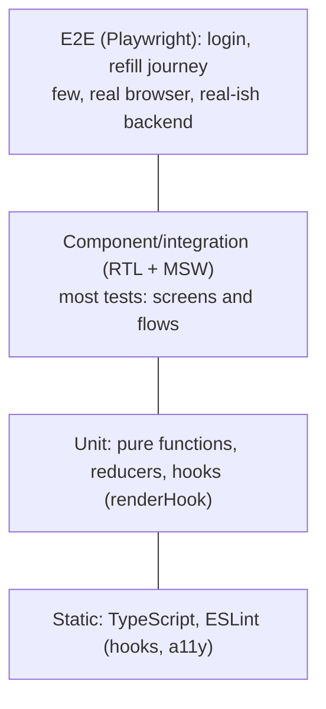

# Testing React (Jest, React Testing Library)

!!! abstract "TL;DR"
    - **React Testing Library (RTL)** tests components through the DOM the way users do: find elements by **role, label and text**, interact with **`@testing-library/user-event`**, assert visible outcomes. Avoid testing implementation details (state, internal methods, CSS classes).
    - **Query priority:** `getByRole` (with `name`) > `getByLabelText` > `getByPlaceholderText` > `getByText` > `getByDisplayValue` > `getByAltText`/`getByTitle` > `getByTestId` (last resort). `getBy` throws, `queryBy` returns null (for absence), `findBy` waits (async).
    - **Runner:** Jest (with jsdom) or **Vitest** (Vite-native, Jest-compatible API, faster in Vite projects). Use `jest-dom` matchers (`toBeInTheDocument`, `toBeDisabled`, `toHaveAccessibleName`).
    - **Mock at the network boundary with MSW** (Mock Service Worker) instead of mocking fetch/axios or hooks; the same handlers work in tests, Storybook and the browser.
    - **Layers:** unit tests for pure logic and hooks (`renderHook`), component/integration tests with RTL for most UI behaviour, a few **E2E** tests (Playwright) for critical journeys, plus accessibility checks (jest-axe, Playwright axe) and visual tests (Storybook) where valuable.

## Why it matters

UI tests that check internal state or snapshot huge trees break on every refactor and miss real bugs. Tests written from the user's point of view survive refactors (including React upgrades and the compiler) and catch broken behaviour and accessibility issues. "Established engineering standards around testing" is on your resume, so expect "how do you test React components?" and "what's your testing strategy for the frontend?".


*Notice the "testing trophy" shape: the biggest layer is integration-style component tests through the DOM, sitting on top of static checks. E2E stays small and focused on critical journeys.*

## Core concepts

### Guiding principle

"The more your tests resemble the way your software is used, the more confidence they can give you." (Kent C. Dodds). Test behaviour: what the user sees and does, and what the component sends to the network. Don't assert on state values, hook calls or component internals.

### Queries

| Variant | No match | Multiple matches | Async |
|---|---|---|---|
| `getBy...` | Throws | Throws | No |
| `queryBy...` | Returns `null` | Throws | No |
| `findBy...` | Rejects (after timeout) | Rejects | Yes (polls until found) |
| `getAllBy` / `queryAllBy` / `findAllBy` | Arrays | — | — |

- Use `screen` (`screen.getByRole(...)`) rather than destructuring from `render`.
- `getByRole("button", { name: /request refill/i })` also checks accessibility: if you can't find it by role and name, neither can a screen reader user.
- `within(row).getByRole(...)` scopes queries.

### Interactions

- `@testing-library/user-event` v14: `const user = userEvent.setup(); await user.click(...); await user.type(...)`. Simulates full event sequences (pointer, keyboard, focus), unlike `fireEvent` which dispatches a single event.
- All user-event calls are async; `await` them.

### Async UI

- `await screen.findByText(...)` for things that appear later.
- `await waitFor(() => expect(...))` for assertions that become true; keep one assertion inside, no side effects.
- `waitForElementToBeRemoved` for loaders.
- Avoid arbitrary `setTimeout` sleeps; fake timers (`vi.useFakeTimers()` / `jest.useFakeTimers()`) for debounce/timeouts, with `userEvent.setup({ advanceTimers })`.
- `act()` warnings usually mean an async update wasn't awaited; RTL wraps render and user-event in act.

### Mocking

- **Network:** MSW intercepts requests (fetch, XHR, GraphQL) at the network layer; tests use real data-fetching code (React Query, Apollo).
- **Modules:** `vi.mock`/`jest.mock` sparingly (e.g. analytics, date).
- **Providers:** a custom `render` that wraps components in QueryClientProvider (fresh client per test, retries off), Router (MemoryRouter or `createMemoryRouter`), theme and session providers.

### Hooks

`renderHook(() => useDebouncedValue(v))` from `@testing-library/react` for custom hooks with logic not tied to a component; otherwise test hooks through components that use them.

### Snapshots

Large component snapshots are brittle and reviewed blindly. Prefer explicit assertions; use small inline snapshots for serialized data, or visual regression (Storybook/Chromatic, Playwright screenshots) for appearance.

### Accessibility and visual

- `jest-axe`/`vitest-axe` for component a11y checks; `@axe-core/playwright` for pages.
- Storybook stories double as test fixtures (interaction tests, visual tests).

### E2E

- **Playwright** (or Cypress) for a few critical journeys across real browsers: login via test IdP, request refill, view claims.
- Stable selectors by role/label (Playwright `getByRole`), test data seeded per run, no shared mutable environments.

## In practice: code & configuration

### Testing a component that fetches data

=== "❌ Common mistake"
    ```tsx
    jest.mock("../api", () => ({ fetchRx: jest.fn(() => Promise.resolve([{ id: "1", drug: "Atorvastatin" }])) }));

    test("renders", () => {
      const { container } = render(<RxList />);
      expect(container.querySelector(".rx-item")).toBeTruthy();   // implementation detail + no await
      expect(container).toMatchSnapshot();                          // brittle
    });
    ```

=== "✅ Correct approach"
    ```tsx
    // test/server.ts
    import { setupServer } from "msw/node";
    import { http, HttpResponse, graphql } from "msw";
    export const server = setupServer(
      graphql.query("Prescriptions", () =>
        HttpResponse.json({ data: { prescriptions: [{ id: "1", drug: "Atorvastatin", status: "READY" }] } })),
    );
    // setupTests.ts: beforeAll(() => server.listen()); afterEach(() => server.resetHandlers()); afterAll(() => server.close());

    // test/render.tsx
    export function renderWithProviders(ui: React.ReactElement, { route = "/" } = {}) {
      const client = new QueryClient({ defaultOptions: { queries: { retry: false } } });
      const router = createMemoryRouter([{ path: "*", element: ui }], { initialEntries: [route] });
      return render(<QueryClientProvider client={client}><RouterProvider router={router} /></QueryClientProvider>);
    }

    // RxList.test.tsx
    test("shows prescriptions and lets the member request a refill", async () => {
      const user = userEvent.setup();
      renderWithProviders(<RxList />);

      const row = await screen.findByRole("row", { name: /atorvastatin/i });   // waits for data
      await user.click(within(row).getByRole("button", { name: /request refill/i }));

      expect(await screen.findByRole("status")).toHaveTextContent(/refill requested/i);
    });

    test("shows an error message when prescriptions fail to load", async () => {
      server.use(graphql.query("Prescriptions", () => HttpResponse.json({ errors: [{ message: "x" }] })));
      renderWithProviders(<RxList />);
      expect(await screen.findByRole("alert")).toHaveTextContent(/couldn.t load prescriptions/i);
    });
    ```

### Vitest configuration

```ts
// vitest.config.ts
import { defineConfig } from "vitest/config";
import react from "@vitejs/plugin-react";
export default defineConfig({
  plugins: [react()],
  test: {
    environment: "jsdom",
    setupFiles: ["./src/test/setupTests.ts"],   // jest-dom matchers, MSW server
    globals: true,
    coverage: { provider: "v8", reporter: ["text", "lcov"] },
  },
});
```

### Testing a hook with fake timers

```tsx
test("useDebouncedValue updates after the delay", () => {
  vi.useFakeTimers();
  const { result, rerender } = renderHook(({ v }) => useDebouncedValue(v, 300), { initialProps: { v: "a" } });
  rerender({ v: "ab" });
  expect(result.current).toBe("a");
  act(() => vi.advanceTimersByTime(300));
  expect(result.current).toBe("ab");
  vi.useRealTimers();
});
```

### Playwright E2E

```ts
test("member requests a refill", async ({ page }) => {
  await page.goto("/prescriptions");
  await page.getByRole("row", { name: /atorvastatin/i }).getByRole("button", { name: /request refill/i }).click();
  await expect(page.getByRole("status")).toHaveText(/refill requested/i);
});
```

## Real-world usage

- RTL replaced Enzyme as the standard (Enzyme never supported React 18 officially); React's own docs recommend RTL-style testing.
- Vitest is widely adopted in Vite projects; Jest remains common in older and Next.js setups.
- MSW is the common approach for network mocking across unit tests, Storybook and local development.
- **Healthcare:** synthetic test data only (no PHI in fixtures, snapshots or screenshots), accessibility tests for WCAG compliance, E2E coverage of critical flows (refill, payment) with a test identity provider.

## Trade-offs & production gotchas

| Approach | Pros | Cons | Use when |
|---|---|---|---|
| RTL + MSW component tests | Realistic, refactor-proof | Slower than pure unit tests | Most UI behaviour |
| Unit tests of pure logic | Fast, precise | Don't prove UI works | Reducers, formatters, utils |
| Snapshot tests | Cheap to write | Brittle, rubber-stamped | Small serialized outputs only |
| E2E (Playwright) | Real browser, full stack | Slow, flakier, env cost | Few critical journeys |
| Visual regression | Catches styling changes | Baseline management | Design systems |

!!! warning "Gotcha: testing implementation details"
    Asserting on state, class names, or mocked hook calls breaks on refactors and misses user-visible bugs. Query by role and assert outcomes.

!!! warning "Gotcha: shared QueryClient between tests"
    Cached data leaks between tests and retries slow failures. Create a fresh client per test with `retry: false`.

!!! warning "Gotcha: not awaiting user-event"
    v14 APIs are async; missing `await` gives act warnings and flaky tests.

!!! question "Interview angle"
    "How do you test React components?", "getBy vs queryBy vs findBy?", "how do you mock API calls?", "what's your frontend testing strategy?", "unit vs integration vs E2E for UI?".

## How this connects to my experience

- **Where I used it:** OptumRx: "Established engineering standards around testing, CI/CD, code quality, and deployment practices"; React app with micro-frontends; Storybook (skills list). *[confirm: Jest or Vitest, RTL, MSW or other mocking, E2E tool (Playwright/Cypress), coverage gates, accessibility testing]*
- **Talking points:**
    - "Our standard was RTL tests through roles and labels, MSW for GraphQL responses, and a handful of Playwright journeys for login and refill." *[confirm tools]*
    - "Storybook stories were reused as test fixtures and for visual review across micro-frontend teams." *[confirm]*
    - "Code review checklist: no implementation-detail assertions, no PHI in fixtures, a11y queries first." *[confirm]*
- **Likely follow-up chain:** "How do you test components?" → "How do you mock GraphQL?" → "How do you test async UI?" → "What did your CI run?" → "How do you keep E2E tests stable?"

## Interview questions

### Fundamentals

??? question "Q1. What is React Testing Library's philosophy?"
    **Answer:** Test components the way users use them: query the DOM by accessible roles, labels and text, interact like a user, assert on visible results, not implementation details.

    **Interviewer listens for:** user perspective, accessible queries, visible results, no implementation details.

    **Common wrong answer:** "Test component state and props." Those tests break on refactors that do not change behaviour.

??? question "Q2. getBy vs queryBy vs findBy?"
    **Answer:** getBy throws if not found (use when it must exist), queryBy returns null (assert absence), findBy returns a promise and waits (async appearance).

    **Interviewer listens for:** throws vs null vs promise; presence, absence, async.

    **Common wrong answer:** Using getBy to assert absence, which throws before the assertion runs.

??? question "Q3. Why prefer getByRole?"
    **Answer:** It matches how assistive technologies see the page, so tests also verify accessibility (role and accessible name).

    **Interviewer listens for:** accessible role and name, mirrors assistive technology, accessibility checked for free.

    **Common wrong answer:** "getByTestId is the most reliable query." It is a last resort that skips accessibility.

### Intermediate

??? question "Q4. user-event vs fireEvent?"
    **Answer:** user-event simulates full interactions (focus, pointer, keyboard sequences, input events) and is async; fireEvent dispatches a single DOM event. Prefer user-event.

    **Interviewer listens for:** full interaction sequences, async API, prefer user-event.

    **Common wrong answer:** Calling user-event without `await` in v14, which causes act warnings and flaky tests.

??? question "Q5. How do you mock API calls?"
    **Answer:** MSW at the network layer with handlers per test (override with server.use), keeping real fetching code; module mocks only for non-network dependencies.

    **Interviewer listens for:** network-level mocking with MSW, per-test overrides, real fetch code.

    **Common wrong answer:** Mocking `fetch` or `axios` with jest.fn in every test, which skips request building and parsing.

??? question "Q6. How do you test async UI correctly?"
    **Answer:** findBy queries and waitFor with a single assertion, fake timers for debounce/timeouts, await all user-event calls; no fixed sleeps.

    **Interviewer listens for:** findBy and waitFor, fake timers, await interactions, no sleeps.

    **Common wrong answer:** Adding `setTimeout(…, 1000)` waits.

??? question "Q7. How do you test a custom hook?"
    **Answer:** Through a component that uses it, or renderHook for logic-heavy hooks, wrapping required providers.

    **Interviewer listens for:** through a component, renderHook for logic-heavy hooks, providers wrapper.

    **Common wrong answer:** Calling the hook directly as a function outside React.

??? question "Q8. How do you test accessibility in a React app?"
    **Answer:** Use layers. **Role-based RTL queries** already fail when elements lack roles or accessible names. Add **jest-axe / vitest-axe** (axe-core) in component tests to catch missing labels, bad ARIA and contrast issues detectable in the DOM. Run **Playwright with @axe-core/playwright** on key pages in CI. Add lint rules (`eslint-plugin-jsx-a11y`). Automated tools find only part of the problems, so keep periodic **manual keyboard and screen-reader checks** (NVDA, VoiceOver) on critical journeys.

    **Interviewer listens for:** role queries, axe in unit and E2E tests, lint, the limits of automation, manual screen-reader passes.

    **Common wrong answer:** "Lighthouse gives 100 so we are accessible." Automated checks miss focus order, meaning and many interaction issues.

### Senior

??? question "Q9. What's your frontend testing strategy?"
    **Answer:** Static checks (TypeScript, lint) → unit tests for pure logic → most coverage as RTL + MSW integration tests per screen → a few Playwright E2E journeys → a11y and visual tests where valuable; CI gates on all.

    **Interviewer listens for:** static checks, unit, integration-heavy RTL + MSW, few E2E, a11y/visual, CI gates.

    **Common wrong answer:** "100% unit test coverage." Coverage of implementation details does not prove the screens work.

??? question "Q10. Why avoid big snapshot tests?"
    **Answer:** They fail on any markup change, get updated without review, and don't express intent. Use explicit assertions or visual regression tools.

    **Interviewer listens for:** brittle, rubber-stamped updates, no intent.

    **Common wrong answer:** "Snapshots catch everything." They catch change, not correctness.

??? question "Q11. Jest vs Vitest?"
    **Answer:** Same API style. Vitest is Vite-native (shares config/transforms), fast with ESM and watch mode; Jest is mature and common in non-Vite setups.

    **Interviewer listens for:** same API, Vite-native, ESM speed, maturity.

    **Common wrong answer:** "Vitest cannot run React Testing Library." It supports it with jsdom or happy-dom.

### Scenario-based

??? question "Q12. Tests are flaky with act warnings."
    **Answer:** Async updates not awaited (user-event, findBy), shared state between tests (query cache, MSW handlers not reset), or real timers in debounce logic. Fix awaits, reset per test, fake timers.

    **Interviewer listens for:** unawaited updates, shared cache/handlers, real timers; awaits, per-test reset, fake timers.

    **Common wrong answer:** Wrapping everything in `act()` manually to silence the warning.

??? question "Q13. How do you test that a pharmacist-only button is hidden for members?"
    **Answer:** Render with a member session provider and assert `queryByRole("button", { name: /approve/i })` is null; render with a pharmacist session and assert it's present. The API authorisation is tested in the backend.

    **Interviewer listens for:** render with each role, queryByRole null vs present, API tested separately.

    **Common wrong answer:** Asserting a CSS class like `hidden` instead of checking the accessible element is absent.

## Cheat sheet

| Concept | Remember |
|---|---|
| Principle | Test like a user; avoid implementation details |
| Query priority | Role > Label > Placeholder > Text > DisplayValue > Alt/Title > TestId |
| Variants | getBy (throws), queryBy (null), findBy (async) |
| Interact | `userEvent.setup()` + `await user.click/type` |
| Async | findBy, waitFor (one assertion), fake timers |
| Network | MSW handlers; `server.use` per test; reset after each |
| Providers | Custom render: fresh QueryClient (retry off), memory router |
| Hooks | `renderHook` |
| Runner | Jest or Vitest + jsdom + jest-dom |
| E2E | Playwright for few critical journeys |
| A11y | jest-axe / axe-core Playwright |
| Data | Synthetic only, no PHI |

## Sources

1. [Testing Library: Guiding Principles](https://testing-library.com/docs/guiding-principles) and [Queries priority](https://testing-library.com/docs/queries/about#priority).
2. [Testing Library: user-event](https://testing-library.com/docs/user-event/intro).
3. [Testing Library: Async methods](https://testing-library.com/docs/dom-testing-library/api-async).
4. [MSW documentation](https://mswjs.io/docs/).
5. [Vitest documentation](https://vitest.dev/guide/).
6. [Kent C. Dodds: Common mistakes with React Testing Library](https://kentcdodds.com/blog/common-mistakes-with-react-testing-library).
7. [Playwright: Locators (getByRole)](https://playwright.dev/docs/locators).
8. [react.dev: Testing recommendations (act, test utilities)](https://react.dev/reference/react/act).
