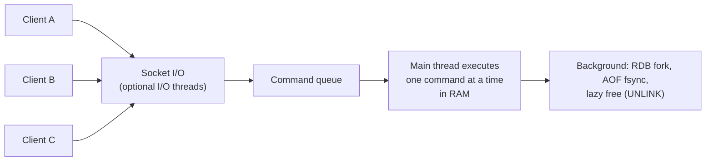
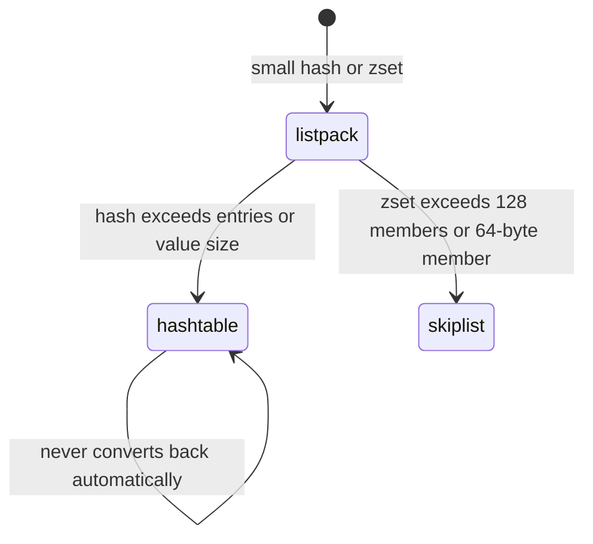

# Redis Data Structures & Use Cases

!!! abstract "TL;DR"
    - Redis is an **in-memory data-structure server**. Commands run one at a time on a single main thread (I/O threads only help with sockets), so each command is atomic, and a slow command blocks everyone.
    - Pick the type by the **operation you need**: string (cache value, counter with `INCR`), hash (object fields), list (queue, recent-N), set (membership, dedupe), sorted set (leaderboard, priority, sliding window), stream (durable log with consumer groups), bitmap/HyperLogLog (compact counting), geo (radius search).
    - Small collections use **compact encodings** (listpack, intset) and switch to hash tables or skiplists past a threshold. Measured: 10,000 users stored as hashes used **1.41 MB** vs **2.78 MB** as three string keys each.
    - Approximate structures save huge amounts of memory: **1M unique visitors** in a HyperLogLog took **14 KB** (0.5% error) vs **48 MB** in a set.
    - Never run `KEYS *`, `HGETALL`/`SMEMBERS` on huge keys, or big `DEL`s in production: `KEYS` on 1M keys blocked the server for **175 ms**. Use `SCAN`, `UNLINK` and bounded collections.

## Why it matters

Redis appears in almost every modern backend: as a cache, a session store, a rate limiter, a leaderboard, a lightweight queue or a distributed lock. Interviewers use it to check two things: that you choose the right data structure for an access pattern (rather than serialising everything into a string), and that you understand the single-threaded execution model well enough to avoid commands that freeze production.

The numbers below come from Redis 7.0.15 running locally, driven by `redis-py` while writing this page.

## Core concepts

### Why Redis is fast, and what that costs


*Notice that command execution is serial. That gives atomicity for free (an `INCR` can't interleave with another), but one O(N) command on a large key delays every other client.*

- **In memory:** a lookup is a hash-table probe in RAM, typically well under a millisecond. Network round trips usually dominate, so **pipelining** and batching matter more than server speed.
- **Single-threaded execution:** no locks inside the data structures. Redis 6 added I/O threads for reading and writing sockets, but commands still execute on one thread. Scale CPU by sharding (Redis Cluster) rather than by bigger cores.
- **Durability is optional:** RDB snapshots and the AOF log are covered in [persistence and replication](06-persistence-replication-sentinel-and-cluster.md). Treat a cache as losable unless you configure otherwise.

### The data types

| Type | Shape | Key commands (complexity) | Typical use |
|---|---|---|---|
| **String** | Binary-safe value up to 512 MB | `GET`/`SET` O(1), `INCR`, `SET NX EX`, `MGET` | Cached JSON, counters, flags, simple locks |
| **Hash** | Field → value map | `HGET`/`HSET` O(1), `HINCRBY`, `HGETALL` O(N) | Object with fields (user profile, cart) |
| **List** | Linked list of strings | `LPUSH`/`RPOP` O(1), `LRANGE` O(S+N), `BLMOVE` | Queue, recent-N items (`LPUSH` + `LTRIM`) |
| **Set** | Unordered unique strings | `SADD`/`SISMEMBER` O(1), `SINTER` | Tags, unique visitors (small), dedupe |
| **Sorted set** | Unique members with a score | `ZADD` O(log N), `ZRANGE` O(log N + M), `ZRANK` | Leaderboards, priority queues, time windows |
| **Stream** | Append-only log of entries | `XADD`, `XREADGROUP`, `XACK`, `XPENDING` | Event log with consumer groups |
| **Bitmap** | Bit operations on a string | `SETBIT`/`GETBIT` O(1), `BITCOUNT` | Daily active flags per user id |
| **HyperLogLog** | Probabilistic cardinality | `PFADD`, `PFCOUNT`, `PFMERGE` | Unique counts at scale (~0.81% error) |
| **Geo** | Sorted set of geohashes | `GEOADD`, `GEOSEARCH` | Nearby stores, drivers |
| **Pub/Sub** | Fire-and-forget channels | `PUBLISH`, `SUBSCRIBE` | Cache-invalidation broadcast (no persistence) |

Redis Stack modules (JSON, search and query, time series, Bloom filters) were folded into the core distribution in Redis 8. Redis 7.4 also added per-field expiry on hashes (`HEXPIRE`).

### Encodings: small is compact

Redis stores small collections in a compact contiguous format and converts to a general structure once a size or value-length threshold is crossed. Measured on this server with `OBJECT ENCODING`:

| Value | Encoding |
|---|---|
| `SET n 12345` | `int` |
| `SET s hello` (≤ 44 bytes) | `embstr` |
| 50-byte string | `raw` |
| Hash with short fields (≤ `hash-max-listpack-entries`, which was 512 here) | `listpack` |
| Hash with one value > 64 bytes | `hashtable` |
| Set of 512 integers | `intset`, then `hashtable` as soon as a non-integer is added |
| Sorted set ≤ 128 members | `listpack`, then `skiplist` at 129 |
| List | `quicklist` (a linked list of listpacks) |

Thresholds are configurable and differ between versions, so check them with `CONFIG GET *-max-listpack-*`. The practical consequence: many small hashes are far cheaper than many small keys, because every top-level key carries overhead (a dictionary entry, a key object, expiry metadata).


*Notice that conversion is one-way. A collection that grows once stays in the bigger encoding even after it shrinks, until it's rewritten.*

### Measured numbers

| Experiment | Result |
|---|---|
| 10k users × 3 fields as separate string keys | 2.78 MB |
| Same data as 10k hashes | **1.41 MB** (about half) |
| Sorted set of 100k players, top 10 (`ZREVRANGE 0 9`) | 0.9 ms round trip, 9.7 MB |
| Rank of one player (`ZREVRANK`) | 0.3 ms round trip |
| 1M unique ids in a HyperLogLog | **14 KB**, count 1,005,024 (0.5% off) |
| Same 1M ids in a set | **48.4 MB** |
| Bitmap of 1M user ids (every third active) | 128 KB, `BITCOUNT` = 333,334 |
| `KEYS k:9999*` over 1M keys | **175 ms blocking** the server |
| `SCAN` with `COUNT 1000` over the same keys | 885 ms total, in about 1,000 short non-blocking steps |

## In practice: code & configuration

### Key naming and modelling

Use colon-separated namespaces (`app:entity:id[:sub]`), keep keys short but readable, and include a version when the value's shape may change (`v2:user:42`), so a deploy can switch to new keys rather than read stale formats.

=== "❌ Common mistake"

    ```java
    // One big JSON blob for a mutable object: every update rewrites it
    String json = redis.opsForValue().get("user:42");
    User user = mapper.readValue(json, User.class);
    user.setLoginCount(user.getLoginCount() + 1);   // read-modify-write race
    redis.opsForValue().set("user:42", mapper.writeValueAsString(user));

    // Listing keys in production
    Set<String> keys = redis.keys("session:*");     // O(N), blocks the server
    ```

=== "✅ Better"

    ```java
    // Hash: update one field atomically on the server
    redis.opsForHash().increment("user:42", "loginCount", 1);  // HINCRBY
    redis.opsForHash().put("user:42", "lastLogin", Instant.now().toString());

    // Iterate incrementally; SCAN never blocks for long
    try (Cursor<String> c = redis.scan(ScanOptions.scanOptions()
            .match("session:*").count(1000).build())) {
        c.forEachRemaining(this::inspect);
    }
    ```

Caching an immutable read model as one JSON string is fine and common. The mistake is using a blob for data that's updated field by field, which creates lost updates and rewrites the whole value.

### Recipes by use case

```bash
# Counter with expiry (e.g. fixed-window rate limit)
INCR rl:user:42:202605011201
EXPIRE rl:user:42:202605011201 60 NX       # NX (7.0+): set TTL only if none

# Recent 100 activity items per user
LPUSH feed:42 "{...}"
LTRIM feed:42 0 99

# Leaderboard
ZADD lb:weekly 1530 player:7
ZINCRBY lb:weekly 20 player:7
ZREVRANGE lb:weekly 0 9 WITHSCORES          # top 10
ZREVRANK lb:weekly player:7                 # my rank

# Sliding-window log: events in the last 60 s
ZADD calls:42 1714560000123 req-uuid
ZREMRANGEBYSCORE calls:42 0 1714559940123
ZCARD calls:42

# Unique visitors per day, merge for the week
PFADD uv:2026-05-01 user:42
PFMERGE uv:week18 uv:2026-04-27 uv:2026-04-28 uv:2026-05-01
PFCOUNT uv:week18

# Stream with a consumer group (at-least-once)
XADD orders * id 1001 amount 50
XGROUP CREATE orders billing 0 MKSTREAM
XREADGROUP GROUP billing c1 COUNT 10 BLOCK 5000 STREAMS orders >
XACK orders billing 1714560000123-0
XAUTOCLAIM orders billing c2 60000 0         # take over stuck messages
```

In the stream test, three entries read by a consumer stayed in the pending list until acknowledged (pending 3 → 2 after one `XACK`). That's what gives at-least-once delivery, which Pub/Sub doesn't provide.

### Spring Boot access

```java
@Configuration
class RedisConfig {
    @Bean
    RedisTemplate<String, Object> redisTemplate(RedisConnectionFactory cf) {
        var t = new RedisTemplate<String, Object>();
        t.setConnectionFactory(cf);                                   // Lettuce by default
        t.setKeySerializer(RedisSerializer.string());                  // readable keys
        t.setHashKeySerializer(RedisSerializer.string());
        t.setValueSerializer(RedisSerializer.json());                  // not JDK serialization
        t.setHashValueSerializer(RedisSerializer.json());
        return t;
    }
}

@Service
class Leaderboard {
    private final StringRedisTemplate redis;
    Leaderboard(StringRedisTemplate redis) { this.redis = redis; }

    void addScore(String player, double delta) {
        redis.opsForZSet().incrementScore("lb:weekly", player, delta);
    }

    Set<ZSetOperations.TypedTuple<String>> top(int n) {
        return redis.opsForZSet().reverseRangeWithScores("lb:weekly", 0, n - 1);
    }
}
```

```yaml
spring:
  data:
    redis:
      host: redis.internal
      port: 6379
      ssl:
        enabled: true
      timeout: 200ms          # command timeout: fail fast and fall back to the DB
      lettuce:
        pool:                 # needs commons-pool2; Lettuce otherwise shares one connection
          max-active: 16
```

Avoid the default JDK serialiser: it produces unreadable, class-version-sensitive bytes and is a deserialisation risk. Use string keys and JSON (or a compact format) for values.

## Real-world usage

- **Caching:** query results and reference data, with TTLs. See [caching patterns](02-caching-patterns-cache-aside-read-write-through-write-behind.md).
- **Session store:** Spring Session with Redis stores HTTP sessions as hashes with TTLs, so stateless app pods can share sessions.
- **Rate limiting and locks:** atomic `INCR`/Lua scripts and `SET NX PX`. See [locks, rate limiting and pub/sub](07-distributed-locks-rate-limiting-and-pub-sub-with-redis.md).
- **Leaderboards and feeds:** sorted sets for gaming and social ranking, lists for recent activity.
- **Analytics counters:** HyperLogLog for unique users, bitmaps for daily-active flags.
- **Lightweight messaging:** streams for small event pipelines where Kafka would be overkill.

On managed services (Amazon ElastiCache, Azure Cache for Redis, Memorystore), the data structures behave the same, but some commands are renamed or disabled (`CONFIG`, `KEYS` in some tiers). After the 2024 licence change, AWS and others also offer **Valkey**, a Linux Foundation fork of Redis 7.2 that's command-compatible.

## Trade-offs & production gotchas

!!! warning "Big keys and slow commands"
    - **Big keys:** a 10-million-member set or a 100 MB string makes every operation on it slow, blocks replication and makes cluster rebalancing painful. Find them with `redis-cli --bigkeys` or `--memkeys`, and split them (bucket by id hash).
    - **O(N) commands:** `KEYS`, `HGETALL`, `SMEMBERS`, `LRANGE 0 -1` and `ZRANGE 0 -1` on large keys. Prefer `SCAN`/`HSCAN`/`SSCAN` and bounded ranges.
    - **Deleting large keys:** `DEL` frees memory synchronously. Use `UNLINK` (lazy free in the background) or enable `lazyfree-lazy-user-del`.
    - **Hot keys:** one key receiving most traffic pins one shard's CPU in a cluster. Replicate it in a local cache or split it across several keys.
    - **Lua scripts and `MULTI`:** also run atomically and block. Keep them short.
    - Watch `SLOWLOG GET`, `INFO commandstats` and `LATENCY DOCTOR`.

- **Memory is the budget.** Everything lives in RAM, so set `maxmemory` and an eviction policy ([TTL and eviction](03-ttl-eviction-policies-and-invalidation-strategies.md)), and size for fork copy-on-write during snapshots.
- **No query language:** you get what you model. If you need "all orders over £100 this week", maintain a sorted-set index yourself, or use the search module or a database.
- **Cluster constraints:** multi-key commands only work when all keys are in the same hash slot. Use hash tags (`{user:42}:cart`, `{user:42}:profile`) to co-locate related keys.
- **Pub/Sub isn't durable:** subscribers that are disconnected miss messages. Use streams if delivery matters.

## How this connects to my experience

- **Where I used it:** not ★ for this subtopic, but Redis is on the resume at OptumRx: "Designed and developed microservices using Java, Spring Boot, Kafka, MongoDB, Redis, and GraphQL" and "Implemented Redis-based caching for frequently accessed queries and UI reference data." *[confirm which data types you used beyond strings, e.g. hashes for reference data, and whether Redis also held sessions or rate limits]*
- **Talking points:**
    - "I pick the structure by the operation: hashes for objects updated field by field, sorted sets for anything ranked or time-windowed, HyperLogLog when an approximate unique count is acceptable."
    - "I treat Redis as single-threaded: no `KEYS`, no unbounded collections, `UNLINK` for big deletes, and I watch the slow log."
- **Likely follow-up chain:** "Why is Redis fast if it's single-threaded?" → "What would you store reference data as?" → "How did you serialise values?" → "What happens when memory fills up?" (eviction) → "How did you keep the cache consistent with the database?" ([caching patterns](02-caching-patterns-cache-aside-read-write-through-write-behind.md)).

## Interview questions

### Fundamentals

??? question "Q1. Why is Redis so fast even though it's single-threaded?"
    **Answer:** Data lives in RAM, so operations are memory lookups with no disk I/O on the request path. Commands run on one thread, so there's no locking or context switching inside data structures, and an event loop (epoll) multiplexes thousands of connections. The data structures are tuned (compact listpacks for small values, hash tables, skiplists). In practice the network round trip dominates, which is why pipelining helps so much. Since Redis 6, optional I/O threads handle socket reads and writes, but command execution remains single-threaded.

    **Interviewer listens for:** in-memory access, the event loop, no locks, network as the bottleneck, and I/O threads vs execution.

    **Common wrong answer:** "It's multi-threaded now, so commands run in parallel." Only I/O is threaded.

??? question "Q2. Name the main Redis data types and a use case for each."
    **Answer:** String: cached values, counters (`INCR`), simple locks (`SET NX PX`). Hash: an object's fields, such as a user profile. List: a queue or recent-N items. Set: unique membership, tags, dedupe. Sorted set: leaderboards, priority queues, sliding-window rate limits. Stream: a durable log with consumer groups. Bitmap: per-user daily flags. HyperLogLog: approximate unique counts. Geo: radius searches.

    **Interviewer listens for:** matching each type to an access pattern, and especially knowing sorted sets and streams.

    **Common wrong answer:** "Redis is a key-value store for strings, so you serialise everything to JSON."

??? question "Q3. When would you use a hash instead of a JSON string?"
    **Answer:** When the object is read or updated field by field. `HINCRBY` and `HSET` change one field atomically on the server, avoiding read-modify-write races and rewriting the whole value. Small hashes also use a compact listpack encoding, and measured here, 10k users as hashes took 1.41 MB vs 2.78 MB as separate string keys. Use a JSON string when the value is an immutable snapshot that's always read whole, such as a cached API response, or when you need nested structure.

    **Interviewer listens for:** atomic field updates, memory efficiency, and when a blob is fine.

    **Common wrong answer:** "Hashes are always better." Not for nested or always-read-whole values, and hash fields couldn't expire individually before 7.4.

??? question "Q4. What's the time complexity of ZADD and fetching the top 10 from a sorted set?"
    **Answer:** `ZADD` is O(log N), because a sorted set is a skiplist plus a hash table (member → score). `ZREVRANGE key 0 9` is O(log N + M), where M = 10. `ZSCORE` is O(1) via the hash table, and `ZRANK` is O(log N). On 100k members, top 10 took 0.9 ms round trip here, mostly network.

    **Interviewer listens for:** skiplist + hash table, log N, and the O(1) score lookup.

    **Common wrong answer:** "O(N log N), because it sorts on every read."

### Intermediate

??? question "Q5. Why is KEYS dangerous, and what do you use instead?"
    **Answer:** `KEYS pattern` scans every key in one command. Because execution is single-threaded, it blocks all clients for the duration: 175 ms over 1M keys here, seconds on large instances, enough to trigger timeouts and failovers. Use `SCAN` with `MATCH` and `COUNT`, which returns a cursor and a small batch per call, so other commands interleave. It can return duplicates and doesn't guarantee a point-in-time snapshot, so make the processing idempotent. Better still, maintain an explicit index (a set of the relevant keys) if you need to enumerate often.

    **Interviewer listens for:** blocking, the cursor-based alternative, its semantics, and explicit indexes.

    **Common wrong answer:** "KEYS is fine with a specific pattern." It still scans every key.

??? question "Q6. Pub/Sub vs streams vs lists for messaging?"
    **Answer:** Pub/Sub is fire-and-forget: there's no persistence, and a disconnected subscriber misses messages. It suits cache-invalidation broadcasts. Lists (`LPUSH` + `BRPOP`/`BLMOVE`) give a simple work queue, but no fan-out or replay, and you need the `BLMOVE` reliable-queue pattern to avoid losing in-flight items. Streams are an append-only log with IDs, consumer groups, a pending-entries list, acknowledgements and `XAUTOCLAIM` for stuck messages, giving at-least-once delivery and replay. For high-volume, long-retention, multi-team event streaming, Kafka is still the better tool.

    **Interviewer listens for:** durability differences, consumer groups and acks, and knowing when to use Kafka.

    **Common wrong answer:** "Pub/Sub guarantees delivery to all subscribers."

??? question "Q7. What is a HyperLogLog, and when would you use one?"
    **Answer:** A probabilistic structure that estimates the number of distinct elements in at most about 12 KB, with a standard error of 0.81%, regardless of cardinality. You can't list members or check membership. Use it for unique visitors or unique searches per day, and `PFMERGE` to combine days. Measured: 1M ids → 14 KB and a count of 1,005,024, vs 48 MB as a set.

    **Interviewer listens for:** fixed memory, approximate counts, no membership test, and merging.

    **Common wrong answer:** confusing it with a Bloom filter, which answers membership ("possibly in set" or "definitely not").

??? question "Q8. What happens when you DEL a key holding 10 million elements?"
    **Answer:** `DEL` frees every element synchronously on the main thread, which can block for hundreds of milliseconds or more. `UNLINK` removes the key from the keyspace immediately and frees the memory on a background thread. You can make other deletes lazy too (`lazyfree-lazy-user-del`, `lazyfree-lazy-expire`, `lazyfree-lazy-eviction`). Better still, avoid big keys by splitting them into buckets.

    **Interviewer listens for:** synchronous freeing, `UNLINK`, the lazy-free settings, and big-key avoidance.

    **Common wrong answer:** "DEL is O(1)." It's O(N) in the number of elements for collections.

??? question "Q9. How do you make several related operations atomic in Redis?"
    **Answer:** Single commands are atomic. `MULTI`/`EXEC` queues commands and runs them without interleaving, but there's no rollback, and you can't branch on intermediate results. Add `WATCH` for optimistic check-and-set. Lua scripts (`EVAL`) or Redis 7 functions run server-side logic atomically, including conditionals: the standard way to do "check then set" (rate limiters, lock release). Keep scripts short because they block the server. In a cluster, all keys must be in one slot, so use hash tags.

    **Interviewer listens for:** `MULTI` semantics (no rollback), `WATCH`, Lua for conditional logic, and cluster slots.

    **Common wrong answer:** "MULTI is a transaction with rollback like in SQL."

### Senior

??? question "Q10. How would you model a real-time leaderboard for 10 million players with 'my rank' and 'players around me'?"
    **Answer:** One sorted set per board and period (`lb:weekly:2026-18`) with the player id as the member and the score. `ZINCRBY` on score events, `ZREVRANGE 0 9` for the top, `ZREVRANK` for my rank, and `ZREVRANGE rank-5 rank+5` for my neighbourhood, all O(log N). Ties: encode a tie-breaker into the score (for example score × 10¹⁰ + (max_ts − ts)) so earlier achievers rank higher. Keep player details in hashes, not in the member string. Expire old periods. At 10M members a sorted set is roughly 1 GB, which fits on one node, but it's one hot key, so put replicas behind reads and shard by region or bracket if write throughput demands it. The database remains the source of truth for rebuilding.

    **Interviewer listens for:** sorted set operations and complexity, tie-breaking, memory sizing, hot-key awareness, and a rebuild path.

    **Common wrong answer:** storing scores in a database and running `ORDER BY score LIMIT` on every request.

??? question "Q11. Your Redis memory keeps growing. How do you investigate?"
    **Answer:** `INFO memory` (used_memory vs RSS, fragmentation ratio), `INFO keyspace` (key counts and how many have TTLs), `redis-cli --bigkeys` and `--memkeys` to find big keys, `MEMORY USAGE` on suspects, and `SCAN` with `OBJECT IDLETIME`/`TTL` sampling to find keys without TTLs. Common causes: keys written without TTL (cache-aside code that forgot `EX`), unbounded lists or streams (use `LTRIM`, `XADD MAXLEN ~`), big hashes that crossed into the hashtable encoding, client output buffers from slow subscribers, and fragmentation (enable `activedefrag`). Then set `maxmemory` and an eviction policy as a safety net.

    **Interviewer listens for:** a systematic method, missing TTLs, unbounded collections, buffers, and fragmentation.

    **Common wrong answer:** "Just add more memory."

??? question "Q12. What are hash tags, and why do they matter in Redis Cluster?"
    **Answer:** Redis Cluster maps each key to one of 16,384 slots by CRC16 of the key. Multi-key commands, transactions and Lua scripts only work when all keys hash to the same slot. If a key contains `{…}`, only the part inside the braces is hashed, so `{user:42}:cart` and `{user:42}:profile` land in the same slot. Overusing one tag concentrates load on one shard (a hot slot), so tag by a natural entity id, not a constant.

    **Interviewer listens for:** slots, CROSSSLOT errors, the braces rule, and hot-slot risk.

    **Common wrong answer:** "Cluster handles multi-key commands transparently."

### Scenario-based

??? question "Q13. p99 latency to Redis spikes every few minutes while average latency is fine. What do you check?"
    **Answer:** `SLOWLOG GET` and `LATENCY DOCTOR` for slow commands: `KEYS`, `HGETALL`/`SMEMBERS` on big keys, large `DEL`s or long Lua scripts. Check for expiry storms: many keys expiring at once, which active expiry handles in cycles. Check RDB/AOF rewrite forks (`latest_fork_usec` in `INFO`), where fork time grows with memory size, and swap or transparent huge pages on the host. On the client side, look at connection-pool exhaustion, GC pauses and large values saturating the network. Fix with `SCAN`/`UNLINK`, TTL jitter, splitting big keys, scheduling persistence on replicas, and THP disabled.

    **Interviewer listens for:** the slow log, big keys, fork latency, synchronized expiry, and the client side.

    **Common wrong answer:** "Redis is in memory, so it must be the network."

??? question "Q14. A product manager wants daily active users and weekly unique users across 50 million accounts. How would you build it in Redis?"
    **Answer:** If user ids are dense integers: one bitmap per day (`SETBIT dau:2026-05-01 <userId> 1`), about 6 MB for 50M users. `BITCOUNT` gives exact DAU, and `BITOP OR` across 7 days followed by `BITCOUNT` gives exact weekly uniques. `BITOP AND` gives users active every day. If ids are sparse strings, or exact counts aren't required, use one HyperLogLog per day (12 KB each) and `PFMERGE` for the week, with about 0.8% error. Set TTLs on daily keys, and periodically persist results to the warehouse, because Redis isn't the system of record for analytics.

    **Interviewer listens for:** bitmap vs HLL trade-off (exact vs approximate, dense vs sparse ids), memory estimates, and set operations.

    **Common wrong answer:** a set of user ids per day: hundreds of MB per day at this scale.

## Cheat sheet

| Need | Use | Note |
|---|---|---|
| Cache a value | String `SET k v EX 300` | JSON, versioned key |
| Counter | `INCR` / `HINCRBY` | Atomic |
| Object fields | Hash | Compact listpack when small; `HEXPIRE` 7.4+ |
| Queue / recent-N | List `LPUSH` + `BRPOP` / `LTRIM` | Not durable fan-out |
| Unique membership | Set | Memory grows with members |
| Ranking / time window | Sorted set | O(log N) |
| Durable messages | Stream + consumer group | `XACK`, `XAUTOCLAIM`, `MAXLEN ~` |
| Unique count, approximate | HyperLogLog | ≤ 12 KB, 0.81% error |
| Per-id flags | Bitmap | Dense integer ids |
| Enumerate keys | `SCAN` | Never `KEYS` |
| Delete big key | `UNLINK` | Background free |
| Atomic logic | Lua / functions | Keep short; same slot |
| Diagnose | `SLOWLOG`, `--bigkeys`, `INFO memory`, `LATENCY DOCTOR` | |

## Sources
1. [Redis docs: Data types](https://redis.io/docs/latest/develop/data-types/) and [command reference with complexity](https://redis.io/docs/latest/commands/).
2. [Redis docs: Memory optimization (listpack/intset encodings)](https://redis.io/docs/latest/operate/oss_and_stack/management/optimization/memory-optimization/).
3. [Redis docs: Streams introduction](https://redis.io/docs/latest/develop/data-types/streams/) and [HyperLogLog](https://redis.io/docs/latest/develop/data-types/probabilistic/hyperloglogs/).
4. [Redis docs: Latency diagnosis](https://redis.io/docs/latest/operate/oss_and_stack/management/optimization/latency/) and [SCAN](https://redis.io/docs/latest/commands/scan/).
5. [Redis docs: Redis Cluster specification (hash slots, hash tags)](https://redis.io/docs/latest/operate/oss_and_stack/reference/cluster-spec/).
6. [Spring Data Redis reference](https://docs.spring.io/spring-data/redis/reference/) and [Spring Boot Redis properties](https://docs.spring.io/spring-boot/appendix/application-properties/index.html#appendix.application-properties.data).
7. [Valkey project](https://valkey.io/) and [Redis licensing announcements](https://redis.io/blog/agplv3/).
8. Demonstrations on this page: Redis 7.0.15 with `redis-py`, run while writing this page (encodings, memory, HyperLogLog, bitmap, streams, `KEYS` vs `SCAN`).
