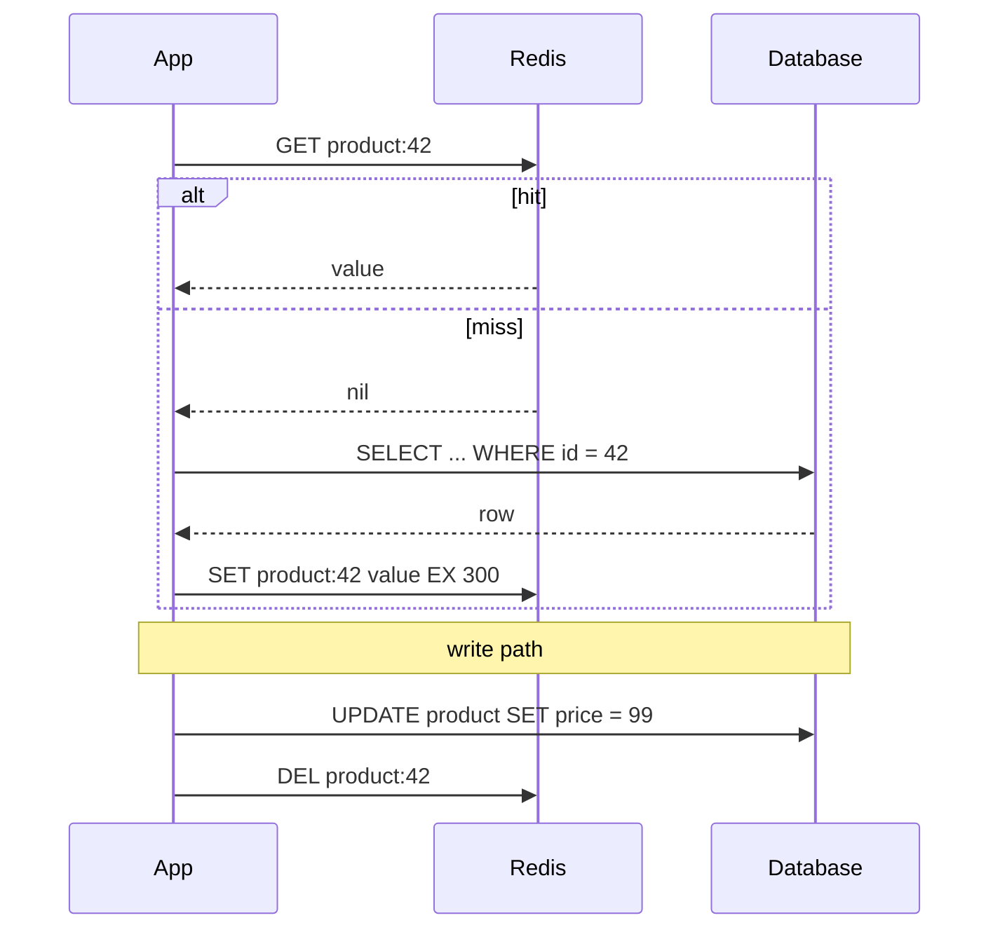
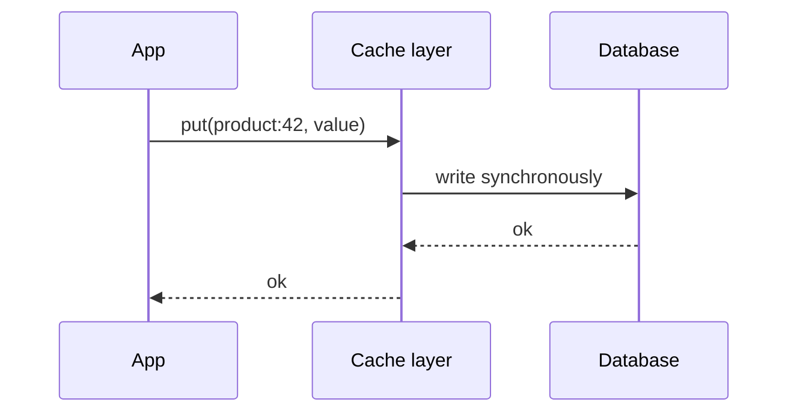
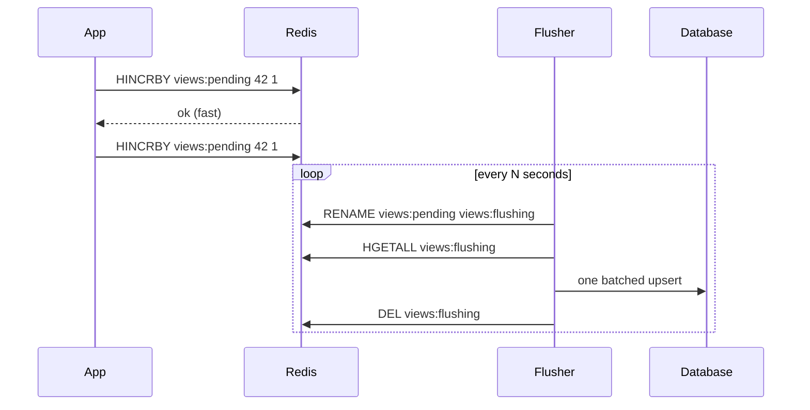
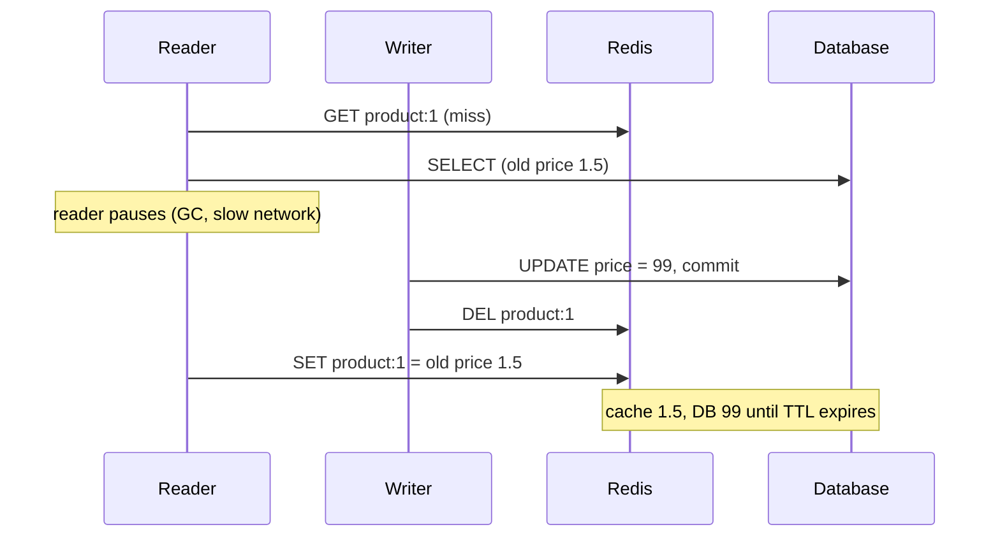

# Caching Patterns: Cache-Aside, Read/Write-Through, Write-Behind

!!! abstract "Key takeaways"
    - **Cache-aside** (lazy loading) is the default: the app reads the cache, loads from the database on a miss and populates the cache with a TTL. On write, it updates the database, then **deletes** the cache entry. It's simple and resilient (the cache can be down), but the first read after a miss is slow and there are race windows.
    - **Read-through / write-through** move that logic into a cache layer or library, so the app talks only to the cache. Write-through keeps the cache fresh on every write, at the cost of write latency and caching data nobody reads.
    - **Write-behind** (write-back) acknowledges writes once they're in the cache and flushes to the database asynchronously in batches. Measured: 20,000 counter updates took **9.3 s** as individual database upserts and **0.28 s** via Redis plus one batched flush, but un-flushed writes are lost if the cache fails.
    - **Delete, don't update, on write**, and set a TTL on everything. Even then, a slow reader can write an old value back after an invalidation. I reproduced this race locally and closed it with a version check in a Lua script.
    - Cache what's **expensive and read often**: a 1M-row aggregate went from **~120 ms to 0.13 ms**, but a primary-key lookup on a nearby database (0.10 ms) was no faster from Redis (0.12 ms).

## Why it matters

"We added Redis" is on many resumes, including mine. The follow-up questions are always the same: which pattern, what happens on a write, how stale can the data get, what happens when Redis goes down, and how you avoid serving wrong data. Choosing a caching pattern is really choosing a **consistency model** and a **failure mode**. That makes it a design decision, not a library setting.

All numbers on this page come from Redis 7.0.15 and PostgreSQL 16 on the same machine, driven from Python while writing this page.

## Core concepts

### Cache-aside (lazy loading)


*Notice that the application owns both paths. The cache only ever holds data someone asked for, and a write simply removes the entry so the next reader reloads it.*

- **Pros:** only requested data is cached. A Redis outage degrades to "slow" rather than "down" if the code falls back to the database. Works with any data store.
- **Cons:** every miss costs three round trips. Cold starts and mass expiry hit the database ([stampedes](04-cache-stampede-penetration-and-avalanche.md)). Staleness is bounded only by the TTL plus your invalidation correctness.

### Read-through

The application asks the cache, and the **cache** (or a caching library acting as one) loads missing entries through a loader you register. Examples include Caffeine's `LoadingCache`, the JCache `CacheLoader`, Spring's `@Cacheable` (which behaves like read-through from the caller's point of view), and DynamoDB Accelerator (DAX). The behaviour equals cache-aside, but the loading logic lives in one place, and libraries can coalesce concurrent misses for the same key.

### Write-through


*Notice that the write isn't acknowledged until both the cache and the database have it, so reads straight after a write see fresh data. The cost is write latency, plus caching values that may never be read.*

Usually combined with read-through. Redis itself doesn't write to your database, so "write-through with Redis" means application code (or a library such as Redis Data Integration or RedisGears) that writes the database and the cache in the same operation. Without a distributed transaction, a failure between the two writes leaves them inconsistent. Pair it with a TTL so mistakes heal themselves.

### Write-behind (write-back)


*Notice that the database sees one write per flush instead of one per event. Everything in `pending` is at risk until it's flushed, so this suits data you can afford to lose or rebuild.*

Measured with 20,000 view events over 500 products:

| Approach | Time |
|---|---|
| One `INSERT … ON CONFLICT DO UPDATE` per event (autocommit) | **9.26 s** |
| `HINCRBY` in Redis (pipelined) | 0.26 s |
| Flush: `RENAME` + `HGETALL` + one batched upsert | 0.017 s |

Use it for counters, metrics, view counts, "last seen" timestamps and leaderboards, where losing a few seconds of updates is acceptable. Avoid it for money, orders or medical records unless the cache layer itself is durable (AOF with `appendfsync always`, replication) and you have reconciliation in place.

### Refresh-ahead

The cache reloads hot entries **before** they expire (Caffeine's `refreshAfterWrite`, or a scheduled job that rewarms known keys), so readers never pay the miss latency. Use it for a small set of hot keys with predictable access, such as reference data and configuration. It wastes work on keys that would not have been read again.

### Comparing the patterns

| Pattern | Who loads on miss | Write path | Freshness after a write | Redis down | Best for |
|---|---|---|---|---|---|
| Cache-aside | App | DB, then delete key | Next read reloads | Fall back to DB | General default |
| Read-through | Cache/library loader | (pairs with any) | As cache-aside | Depends on the library | Centralised loading, coalescing |
| Write-through | Cache/library | Cache + DB synchronously | Immediately fresh | Writes fail or bypass | Read-after-write heavy data |
| Write-behind | Cache/library | Cache now, DB later | Cache fresh, DB lags | **Data loss risk** | Counters, high-write metrics |
| Refresh-ahead | Background refresh | (pairs with any) | Bounded by refresh interval | Serve stale | Hot, predictable keys |

### When caching is worth it

| Read | Measured latency |
|---|---|
| PostgreSQL primary-key lookup (local socket) | **0.10 ms** median |
| Redis `GET` + JSON decode of the same row | **0.12 ms** median |
| PostgreSQL `GROUP BY status` over 1M claims | **115–133 ms** |
| Redis `GET` of the cached aggregate | **0.13 ms** |

A cache pays off when the source is **expensive** (aggregates, joins, remote APIs, cross-region calls), **contended** (the database is the bottleneck, and every hit is load removed), or **far away**. Caching cheap indexed lookups next to an idle database adds a moving part without improving latency. You may still do it to protect the database's capacity, but say that's the reason.

Access skew matters too. With a Zipf-like access pattern over 10,000 products, cache-aside reached an **83% hit ratio** after 20,000 requests while holding only **3,363 keys**. A small cache serves most traffic when popularity is skewed.

## In practice: code & configuration

### Cache-aside in Spring Boot, done carefully

=== "❌ Common mistake"

    ```java
    @Transactional
    public Product updatePrice(long id, BigDecimal price) {
        Product p = repo.findById(id).orElseThrow();
        p.setPrice(price);
        // 1. Cache updated BEFORE the transaction commits: if commit fails,
        //    the cache holds a price the DB never had.
        // 2. Updating (not deleting) races with other writers.
        redis.opsForValue().set("product:" + id, toJson(p));   // and no TTL
        return p;
    }

    public Product get(long id) {
        String json = redis.opsForValue().get("product:" + id); // Redis down → exception → 500
        if (json != null) return fromJson(json);
        Product p = repo.findById(id).orElseThrow();
        redis.opsForValue().set("product:" + id, toJson(p));    // no TTL: stale forever
        return p;
    }
    ```

=== "✅ Better"

    ```java
    private static final Duration TTL = Duration.ofMinutes(5);

    public Product get(long id) {
        String key = "v1:product:" + id;                          // versioned key format
        try {
            String json = redis.opsForValue().get(key);
            if (json != null) return fromJson(json);
        } catch (RedisConnectionFailureException | QueryTimeoutException e) {
            log.warn("cache unavailable, reading DB", e);         // degrade, don't fail
            return repo.findById(id).orElseThrow();
        }
        Product p = repo.findById(id).orElseThrow();
        Duration jittered = TTL.plusSeconds(ThreadLocalRandom.current().nextInt(60)); // avoid mass expiry
        safely(() -> redis.opsForValue().set(key, toJson(p), jittered));
        return p;
    }

    @Transactional
    public void updatePrice(long id, BigDecimal price) {
        repo.updatePrice(id, price);
        // Invalidate only after the DB commit succeeds
        TransactionSynchronizationManager.registerSynchronization(new TransactionSynchronization() {
            @Override public void afterCommit() {
                safely(() -> redis.delete("v1:product:" + id));
            }
        });
    }
    ```

The better version deletes **after commit**, sets a jittered TTL on every entry, tolerates Redis being down on both paths, and versions the key format. (Spring's `@TransactionalEventListener(phase = AFTER_COMMIT)` is a tidier way to do the same.) The [Spring Cache abstraction](05-spring-cache-abstraction-with-redis.md) does much of this declaratively.

### Why delete instead of update: a measured race

Two writers update the same row. The database applies A then B. Their cache writes arrive in the opposite order because A's thread paused (GC or network):

```text
DB:    price=10 (A)  → price=20 (B)       final DB price 20
Cache: SET 20 (B)    → SET 10 (A, late)   final cache price 10
```

Reproduced locally: **database 20.0, cache 10.0**, stale until the TTL. Deleting instead of setting makes both writers' cache operations identical and idempotent, so ordering no longer matters.

### The race that delete doesn't fix


*Notice that the stale value arrives after the invalidation. This is rare (the read must be slower than the whole write), but it happens under load.*

I reproduced this with two threads and events: the final state was **database price 99.0 (version 2), cache price 1.5 (version 1)**. Options, from cheapest to strongest:

1. **Short TTL:** bounds the damage. That's always the baseline.
2. **Delayed double delete:** delete again a few hundred milliseconds after the write. It's cheap but timing-based.
3. **Versioned writes:** the writer records the new version (or `updated_at`) in Redis, and the reader's `SET` is conditional on its version not being older. In my test the Lua guard below rejected the stale `SET` (returned 0, cache stayed empty).
4. **CDC-driven invalidation:** delete keys from the database's change stream (Debezium → Kafka → invalidator), so invalidation follows the commit order. It also catches writes made by other services or by hand.

```lua
-- KEYS[1] = value key, KEYS[2] = latest-version key written by the writer
-- ARGV[1] = value, ARGV[2] = version the reader loaded, ARGV[3] = TTL seconds
local latest = redis.call('GET', KEYS[2])
if latest and tonumber(latest) > tonumber(ARGV[2]) then
  return 0                                  -- reader's data is older: don't cache it
end
redis.call('SET', KEYS[1], ARGV[1], 'EX', ARGV[3])
return 1
```

In Redis Cluster, keep both keys in one slot with a hash tag (`{product:1}` and `{product:1}:ver`).

### Write-behind flusher

```java
@Scheduled(fixedDelay = 5_000)
public void flushViewCounts() {
    // RENAME is atomic: new increments go to a fresh 'pending' hash while we flush
    if (!Boolean.TRUE.equals(redis.hasKey("views:pending"))) return;
    redis.rename("views:pending", "views:flushing");
    Map<Object, Object> counts = redis.opsForHash().entries("views:flushing");
    jdbc.batchUpdate("""
        INSERT INTO view_count(product_id, views) VALUES (?, ?)
        ON CONFLICT (product_id) DO UPDATE SET views = view_count.views + EXCLUDED.views
        """, counts.entrySet(), 500, (ps, e) -> {
            ps.setLong(1, Long.parseLong((String) e.getKey()));
            ps.setLong(2, Long.parseLong((String) e.getValue()));
        });
    redis.delete("views:flushing");    // only after the DB write succeeded
}
```

If the flusher crashes after `RENAME`, `views:flushing` survives and is retried on the next run. Add a check for a leftover `flushing` key at startup, and run only one flusher at a time (a [lock](07-distributed-locks-rate-limiting-and-pub-sub-with-redis.md) or ShedLock). Note that a retry after a partial failure double-counts unless the flush is idempotent (for example, keyed by batch id).

## Real-world usage

- **Reference and lookup data** (drug formularies, country codes, plan types, UI dropdowns): cache-aside or refresh-ahead with long TTLs, plus explicit invalidation when the admin tool changes it. It's a very high hit ratio for very little code.
- **Query-result caching:** expensive aggregates and search pages, with short TTLs and keys that include every query parameter (`search:v2:{hash(params)}`).
- **Facebook's memcache** (NSDI 2013 paper) uses look-aside caching with delete-on-write and **leases** to stop exactly the stale-set race above and to throttle thundering herds.
- **DynamoDB Accelerator (DAX)** is a read-through/write-through cache in front of DynamoDB.
- **Write-behind counters:** view counts, likes and rate statistics are buffered in Redis and flushed in batches.
- **CDC invalidation:** Debezium streams database changes into Kafka, and a consumer deletes or refreshes cache keys, which avoids dual-write bugs in application code.

## Trade-offs & production gotchas

!!! warning "Things that bite in production"
    - **No TTL:** one missed invalidation means stale data forever. Always set a TTL, even with explicit invalidation.
    - **Invalidating before commit:** another reader reloads the old row before the commit and caches it. Invalidate in `afterCommit`.
    - **Dual writes:** writing the DB and the cache as two independent steps without ordering or retries leaves them divergent on partial failure. Prefer delete-after-commit or CDC.
    - **Caching errors and nulls:** decide whether "not found" is cached (short TTL) or not, which is a [penetration](04-cache-stampede-penetration-and-avalanche.md) concern. Never cache exceptions.
    - **Key collisions:** keys must include every parameter that changes the result (tenant, locale, user role, page). Missing the tenant id in a key is a data leak.
    - **Serialization drift:** a deploy changes the class shape, and old cached JSON fails to deserialise. Version the key prefix or tolerate unknown fields.
    - **Cache as a hidden dependency:** if the database can't handle full traffic without the cache, a cache outage becomes a full outage. Know your cold-cache capacity and warm up after deploys.

- **Consistency is eventual by design.** If a flow needs read-your-writes (the user edits their profile and sees it immediately), either read from the database for that user/session right after the write, or use write-through for that entity.
- **Multi-level caches** (Caffeine in-process + Redis) cut latency and Redis load further, but each pod's local cache must also be invalidated, typically via Pub/Sub or a short local TTL.
- **Measure:** hit ratio, miss latency, eviction rate, key count and memory, per cache name. A falling hit ratio is often the first sign of a key-design bug.

## How this connects to my experience

- **Resume bullet (OptumRx):** "Implemented Redis-based caching for frequently accessed queries and UI reference data," in microservices built with "Java, Spring Boot, Kafka, MongoDB, Redis, and GraphQL."
- **How to describe it:** cache-aside for query results and reference data. Reference data (lookups the UI needs on every screen) gets long TTLs and is invalidated or rewarmed when it changes. Query results get shorter TTLs, with keys built from the query parameters. *[confirm: the pattern you used, Spring `@Cacheable` vs hand-written; the TTLs; how invalidation was triggered; whether there was a local Caffeine layer; any measured latency or DB-load improvement — do not quote numbers you don't have]*
- **Talking points:**
    - "Reference data was the easy win: small, read on every page, rarely changed, so it got long TTLs and an explicit refresh when it changed."
    - "On writes I delete after commit rather than update, and everything has a TTL as a safety net."
    - "If Redis was unavailable, reads fell back to MongoDB." *[confirm]*
- **Likely follow-up chain:** "Which caching pattern?" → "What happens on update?" (delete after commit, why not update) → "Can you still serve stale data?" (the reader race, TTL, versioning) → "What if Redis goes down?" (fallback, cold-cache capacity) → "How did you pick TTLs?" ([TTL and eviction](03-ttl-eviction-policies-and-invalidation-strategies.md)) → "What about a cache stampede?" ([page 04](04-cache-stampede-penetration-and-avalanche.md)).

## Interview questions

### Fundamentals

??? question "Q1. Explain cache-aside and its read and write paths."
    **Answer:** Read: check the cache. On a hit, return it. On a miss, read the database, store the result in the cache with a TTL, and return it. Write: update the database, then delete the cache key so the next read reloads fresh data. The application owns the logic, the cache holds only requested data, and the system survives a cache outage by reading the database.

    **Interviewer listens for:** both paths, TTL, delete on write, and the resilience property.

    **Common wrong answer:** "On write you update the cache, then the database." That's the wrong order, and it uses update instead of delete.

??? question "Q2. What's the difference between write-through and write-behind?"
    **Answer:** Write-through writes the cache and the database synchronously before acknowledging, so the cache is always fresh and nothing is lost, but each write pays both latencies. Write-behind acknowledges once the cache has the write and persists to the database later, often batched. Writes become very fast (here 20,000 updates took 0.28 s instead of 9.3 s), but data not yet flushed is lost if the cache fails, and the database lags.

    **Interviewer listens for:** synchronous vs asynchronous, the durability trade-off, and a suitable use case for each.

    **Common wrong answer:** "Write-behind is just a faster write-through." It changes the durability guarantee.

??? question "Q3. Read-through vs cache-aside: what's the difference?"
    **Answer:** In cache-aside the application loads data on a miss. In read-through the cache (or a caching library) calls a registered loader, so the application only talks to the cache. The data flow is the same, but read-through centralises the loading code and lets the library coalesce concurrent misses for one key, which helps against stampedes. Caffeine's `LoadingCache`, JCache loaders and DAX are read-through. Spring's `@Cacheable` looks like read-through to callers.

    **Interviewer listens for:** who owns the loading, and the coalescing benefit.

    **Common wrong answer:** "Redis supports read-through natively." Redis doesn't call your database.

??? question "Q4. Why should every cache entry have a TTL, even with explicit invalidation?"
    **Answer:** Invalidation can fail: a missed code path, a delete that errors after commit, a race that writes an old value back, a direct database fix, or another service writing the same table. A TTL bounds how long any of those mistakes lasts and also limits memory growth. Choose it by how stale the business can tolerate, add jitter to avoid mass expiry, and combine it with explicit deletes for freshness.

    **Interviewer listens for:** the TTL as a safety net and staleness bound, plus jitter.

    **Common wrong answer:** "If invalidation is correct you don't need TTLs."

### Intermediate

??? question "Q5. On a write, should you update the cache or delete it? Why?"
    **Answer:** Delete. With concurrent writers, cache updates can arrive in a different order from the database commits, leaving the cache permanently on an older value (reproduced here: database 20, cache 10). Deletes are idempotent and order-independent. Updating also computes and serialises values that may never be read, and is harder to get right when one entity appears in several cached views. The cost of deleting is one extra miss.

    **Interviewer listens for:** the ordering race, idempotency, and the cost of an extra miss.

    **Common wrong answer:** "Update, because it avoids a miss." True, but it trades correctness for one miss.

??? question "Q6. Should you delete the cache entry before or after the database commit?"
    **Answer:** After. If you delete first, a concurrent reader can miss, read the old committed row and repopulate the cache before your commit, which re-creates the stale entry immediately. If the transaction rolls back, deleting first is harmless, but deleting after commit is still the correct order. In Spring, use `TransactionSynchronization.afterCommit` or `@TransactionalEventListener(phase = AFTER_COMMIT)`. If that delete fails, the TTL limits the damage, and a retry or CDC-based invalidation makes it robust.

    **Interviewer listens for:** the reader-repopulates race, commit awareness, and a fallback for failed deletes.

    **Common wrong answer:** "Before, so nobody reads stale data."

??? question "Q7. Even with delete-after-commit, how can stale data end up in the cache?"
    **Answer:** A reader misses, reads the old row, then stalls (GC, network). Meanwhile a writer commits and deletes the key, and the reader then sets the old value. I reproduced exactly this: database version 2, cache version 1. Mitigations: short TTLs, delayed double delete, versioned conditional sets (a Lua script that refuses to cache data older than the latest version the writer recorded, which rejected the stale set in my test), leases as in Facebook's memcache paper, or CDC-driven invalidation in commit order.

    **Interviewer listens for:** the exact interleaving, and several mitigations with their trade-offs.

    **Common wrong answer:** "Delete-after-commit guarantees consistency."

??? question "Q8. What happens to your service when Redis goes down?"
    **Answer:** With cache-aside done properly, reads catch connection errors and timeouts, fall back to the database and skip the cache write, so the service gets slower rather than failing. Set short Redis command timeouts (around 100–200 ms) and use a circuit breaker so you don't wait on a dead cache. The real risk is the database: if it was sized for a 90% hit ratio, full traffic may overwhelm it, so plan cold-cache capacity, rate-limit or shed load, and consider a local in-process cache as a second tier. With write-behind, an outage can lose buffered writes, so that design needs replication or AOF persistence.

    **Interviewer listens for:** graceful degradation, timeouts and circuit breakers, database capacity, and write-behind loss.

    **Common wrong answer:** "Redis is highly available, so it doesn't go down."

??? question "Q9. How do you decide what to cache?"
    **Answer:** Data that's read far more often than it changes, is expensive to compute or fetch, and can tolerate some staleness. Measure first: here a 1M-row aggregate dropped from about 120 ms to 0.13 ms, but a primary-key lookup on a nearby database was no faster from Redis (0.10 ms vs 0.12 ms). Skewed access gives high hit ratios with small caches (83% with about a third of the keys here). Avoid caching rapidly changing data, highly personalised data with low reuse, or data that must be strongly consistent (balances, inventory at checkout), unless you design for it.

    **Interviewer listens for:** read/write ratio, cost, staleness tolerance, and measurement.

    **Common wrong answer:** "Cache everything to make it faster."

### Senior

??? question "Q10. Design caching for reference data used on every screen of a healthcare portal."
    **Answer:** Reference data (plan types, formulary tiers, dropdown values) is small, read constantly and changed rarely, by admins. Use two tiers: an in-process cache (Caffeine) in each service with a few minutes' TTL, backed by Redis as the shared tier with a longer TTL. Load with read-through and refresh-ahead so users never wait on a miss, and warm it at startup. On admin changes, update the database, then publish an invalidation event (Redis Pub/Sub or Kafka) that clears the Redis key and every pod's local cache. Version the keys so a deploy that changes the shape doesn't read old entries. Expose hit ratio and staleness metrics. This tolerates a Redis outage because the local cache and the database still serve.

    **Interviewer listens for:** a multi-level cache, warm-up and refresh, cross-pod invalidation, versioning, and metrics.

    **Common wrong answer:** "Load it once at startup and keep it forever." Changes then need a redeploy.

??? question "Q11. When would you use write-behind, and how do you make it safe?"
    **Answer:** For high-frequency, low-value or reconstructable writes: counters, views, "last active" timestamps, telemetry. Buffer them in Redis (hash increments or a stream), flush in batches on a schedule, and swap the buffer atomically (`RENAME` to a flushing key) so new writes aren't lost during a flush. Make flushes idempotent (batch ids or upserts that add deltas exactly once), run a single flusher with a lock, recover leftover buffers at startup, and enable Redis replication and AOF if loss matters. For business-critical writes, use a durable log such as Kafka or the transactional outbox, not a cache, as the buffer.

    **Interviewer listens for:** appropriate use cases, atomic swap, idempotency, durability, and the alternative for critical data.

    **Common wrong answer:** using write-behind for orders or payments to "reduce database load".

??? question "Q12. How do you keep caches consistent when several services write the same data?"
    **Answer:** Application-level invalidation breaks down because every writer must remember to delete every affected key. Use change data capture: Debezium reads the database log and publishes row changes to Kafka, and an invalidation consumer maps each change to the affected keys and deletes them. That follows commit order and catches all writers, including manual fixes. Alternatively, one owning service exposes the data and is the only one that caches it, or writers publish domain events that cache owners consume. Keep TTLs as a backstop and monitor invalidation lag.

    **Interviewer listens for:** dual-write problems, CDC, ownership, and the TTL backstop.

    **Common wrong answer:** "Each service deletes the keys it knows about."

??? question "Q13. Compare a local in-process cache with Redis. When do you use each, or both?"
    **Answer:** Local caches (Caffeine) are nanosecond-to-microsecond fast, with no network or serialisation, but each pod has its own copy: memory is multiplied, invalidation across pods needs messaging, and pods can disagree briefly. Redis is shared and consistent across pods, survives restarts and can be large, but costs a network hop and serialisation and is an extra dependency. Use local caches for small, hot, rarely changing data. Use Redis for larger or shared data, cross-pod consistency, and data shared between services. Combine them as L1/L2 for very hot data, with Pub/Sub invalidation and a short L1 TTL.

    **Interviewer listens for:** latency, consistency, memory and invalidation trade-offs, and the L1/L2 design.

    **Common wrong answer:** "Redis is always better because it's distributed."

### Scenario-based

??? question "Q14. After a price change, some users see the old price for up to an hour. Walk through your diagnosis."
    **Answer:** First, what does the price endpoint read, and what's the TTL? An hour suggests the TTL is the only thing fixing it, so invalidation isn't happening. Check whether the write path deletes the right key: the key format may differ (version prefix, locale or currency in the key), or the price is cached inside other entries (product lists, search results) that nobody invalidates. Check whether the delete runs before commit or is swallowed on error, whether the change came from another service or a batch job that doesn't invalidate, whether there's a local cache per pod without cross-pod invalidation, and whether a CDN or browser caches the response. Fix: invalidate after commit for all affected keys (or tag-based or CDC invalidation), shorten TTLs for price-sensitive views, and add a metric or alert on staleness.

    **Interviewer listens for:** a systematic path, key mismatch, derived caches, other writers, multiple cache layers, and a durable fix.

    **Common wrong answer:** "Reduce the TTL to one minute." It hides the bug and raises database load.

??? question "Q15. Your database is at 90% CPU, and someone proposes 'just add Redis'. How do you respond?"
    **Answer:** Start with data: `pg_stat_statements` for the top queries by total time. If a few expensive, read-heavy, cacheable queries dominate (aggregates, reference lookups, hot pages), caching them is a big win. Pick cache-aside with TTLs, invalidate on write, size it from the working set, and measure the hit ratio. If the load is writes, N+1 queries, missing indexes or one bad report, a cache doesn't fix it, and indexes, query fixes, read replicas or batching do. Also consider what happens when the cache is cold or down. If the database can't serve full traffic, you've created a new single point of failure, so keep capacity headroom.

    **Interviewer listens for:** measure first, the read/write profile, alternatives, and cache-down capacity.

    **Common wrong answer:** adding a cache in front of everything without checking what's actually slow.

## Cheat sheet

| Topic | Remember |
|---|---|
| Default | Cache-aside + TTL + delete after commit |
| Read-through | Loader in the cache layer; coalesces misses |
| Write-through | Synchronous cache + DB; fresh reads, slower writes |
| Write-behind | Fast writes, batched flush (9.3 s → 0.28 s here); loss risk |
| Refresh-ahead | Reload hot keys before expiry |
| On write | **Delete**, not update; **after** commit |
| Residual race | Slow reader sets an old value; TTL, double delete, version check, leases, CDC |
| Redis down | Timeouts + fallback + circuit breaker; cold-cache DB capacity |
| Worth caching | Expensive, read-heavy, staleness-tolerant (120 ms → 0.13 ms; PK lookup: no gain) |
| Keys | Include every parameter (tenant!), version prefix |
| Multi-tier | Caffeine L1 + Redis L2, Pub/Sub invalidation |
| Metrics | Hit ratio, miss latency, evictions, memory, staleness |

## Sources
1. [AWS: Caching strategies (lazy loading, write-through, TTL)](https://docs.aws.amazon.com/AmazonElastiCache/latest/dg/Strategies.html) and [Database caching strategies using Redis (whitepaper)](https://docs.aws.amazon.com/whitepapers/latest/database-caching-strategies-using-redis/caching-patterns.html).
2. [Microsoft Azure Architecture Center: Cache-Aside pattern](https://learn.microsoft.com/en-us/azure/architecture/patterns/cache-aside).
3. Nishtala et al., [Scaling Memcache at Facebook](https://www.usenix.org/conference/nsdi13/technical-sessions/presentation/nishtala) (NSDI 2013): look-aside caching, delete on write, leases.
4. [Redis docs: Client-side caching](https://redis.io/docs/latest/develop/reference/client-side-caching/) and [Lua scripting](https://redis.io/docs/latest/develop/interact/programmability/eval-intro/).
5. [Caffeine wiki: Population and refresh](https://github.com/ben-manes/caffeine/wiki/Refresh) and [Amazon DynamoDB Accelerator (DAX)](https://docs.aws.amazon.com/amazondynamodb/latest/developerguide/DAX.html).
6. [Debezium documentation](https://debezium.io/documentation/) (CDC for cache invalidation).
7. [Spring Framework: Transaction-bound events](https://docs.spring.io/spring-framework/reference/data-access/transaction/event.html).
8. Demonstrations on this page: Redis 7.0.15 and PostgreSQL 16 driven from Python while writing this page (latencies, Zipf hit ratio, write-behind batch, both races and the Lua version guard).
