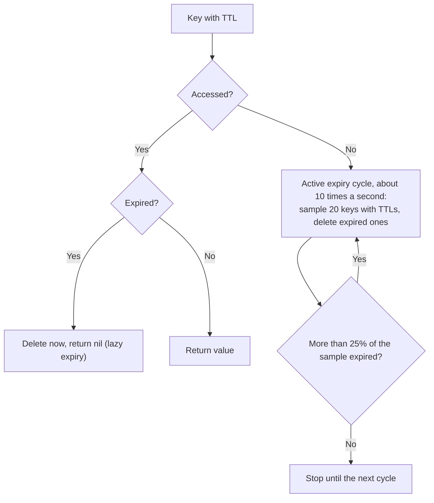
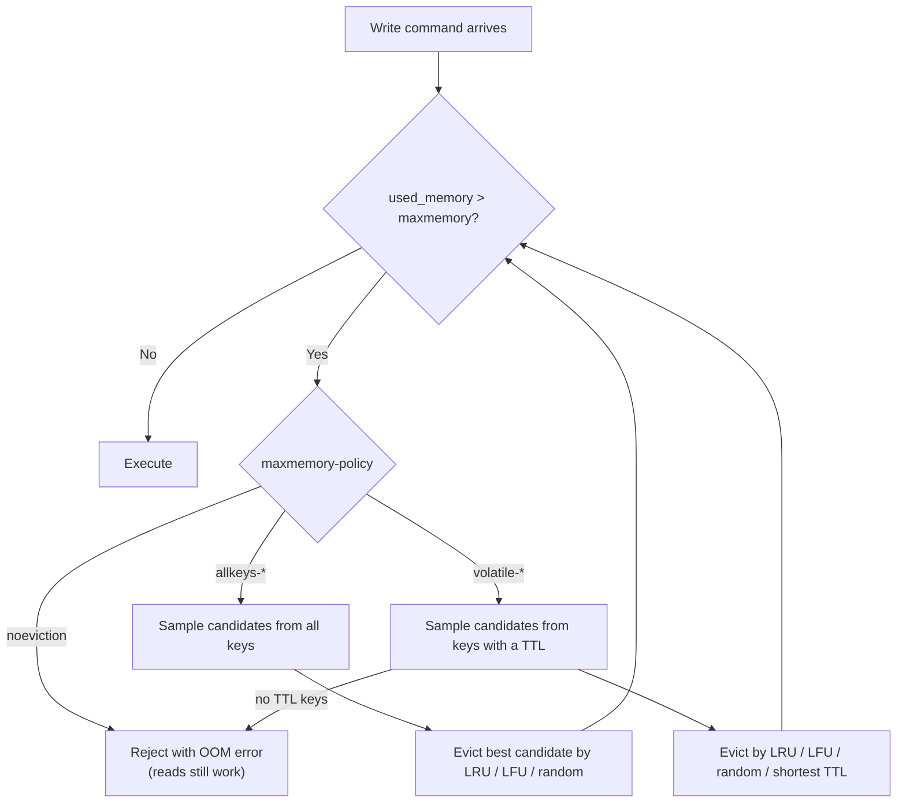

# TTL, Eviction Policies & Invalidation Strategies

!!! abstract "Key takeaways"
    - **Expiry** removes keys whose TTL has passed. It happens lazily when a key is accessed, plus an active background cycle that samples keys with TTLs. Measured: 200,000 never-read keys with a 1-second TTL were all gone within about **1.5 s**.
    - **Eviction** removes keys when `maxmemory` is reached, according to `maxmemory-policy`. The default `noeviction` rejects writes with an OOM error (it failed at key 18,295 of a 20 MB test) while reads keep working. `volatile-*` policies only evict keys **with a TTL**, so with no TTLs they fail just like `noeviction`.
    - For a pure cache use **`allkeys-lru`** or **`allkeys-lfu`**. LFU resists scan pollution: after 40,000 one-off writes, LFU kept **all 5,000** hot keys, LRU kept **162** and random kept 1,178.
    - Redis LRU is **approximate** (samples `maxmemory-samples` keys). With 1 sample it behaved like random eviction. With the default of 5, 99.5% of recently used keys survived.
    - TTL surprises: a plain `SET` **clears** the TTL (use `KEEPTTL`), while `INCR`, `RENAME` and `HSET` keep it. Pick TTLs from business staleness tolerance, add jitter, and combine them with explicit invalidation (delete after commit, versioned keys, events or CDC).

## Why it matters

A cache is only useful if it's both **fresh enough** and **bounded**. TTLs control freshness and memory growth. Eviction decides what happens when memory runs out anyway. Invalidation removes data early when the source changes. Interviewers probe all three: "How did you choose the TTL?", "What happens when Redis is full?", "How do you invalidate when data changes?" Weak answers say "we set a TTL of an hour". Strong answers connect TTLs to business tolerance, know the eviction policy that was configured and why, and explain how invalidation reaches every copy.

All results below come from Redis 7.0.15 with `maxmemory 20mb` and 1 KB values, run while writing this page.

## Core concepts

### Expiry: lazy plus active


*Notice the two mechanisms. Lazy expiry guarantees you never read an expired key. Active expiry reclaims memory for keys nobody reads again, and it keeps going while many keys are expiring, within a CPU time budget.*

- The 20-key/25% figures are the algorithm as the `EXPIRE` docs describe it. Redis 6+ tunes how hard the cycle works with `active-expire-effort` (1–10) and tolerates a smaller share of expired-but-unreclaimed keys.
- A key is **logically** gone the moment its TTL passes. **Memory** is reclaimed by one of the two mechanisms above, so `DBSIZE` can briefly include expired keys.
- Measured: 200,000 keys written with `PX 1000` and never read: 99,161 left at 0.5 s, 2,615 at 1.0 s, 0 at 1.5 s.
- Replicas don't expire keys on their own. They wait for the primary's `DEL` (but they return nil for logically expired keys on reads). AOF and replication receive explicit `DEL`s.
- Mass expiry at the same instant causes CPU spikes in the expiry cycle and, more importantly, a burst of cache misses on the database ([avalanche](04-cache-stampede-penetration-and-avalanche.md)).

### TTL commands and their surprises

| Command | Result (measured) |
|---|---|
| `SET k v EX 100` then `SET k v2` | TTL **cleared** (`TTL` → -1) |
| `SET k v2 KEEPTTL` (6.0+) | TTL kept (100) |
| `INCR k`, `HSET`, `LPUSH` on an existing key | TTL kept |
| `RENAME k k2` | TTL moves with the key |
| `EXPIRE k 50 GT` when the TTL is 100 (7.0+) | Ignored (returns 0): only lengthens |
| `EXPIRE k 60 NX` | Set only if the key has no TTL |
| `TTL missing` / `TTL no-ttl-key` | -2 / -1 |
| `PERSIST k` | Removes a TTL |
| `HEXPIRE h 60 FIELDS 1 f` (7.4+) | Per-field TTL in a hash |
| `GETEX k EX 60` | Read and refresh the TTL (sliding expiry) |

The `SET` behaviour bites code that "updates the value" and assumes the original TTL still applies. The key silently becomes permanent. Always pass `EX` (or `KEEPTTL`) when overwriting cache entries.

### Eviction: what happens at maxmemory


*Notice that eviction only runs when a write needs memory, and `volatile-*` policies can't evict anything that has no TTL.*

| Policy | Evicts from | Chooses | Use when |
|---|---|---|---|
| `noeviction` (default) | Nothing | Writes fail with OOM | Redis is a store (queues, locks, sessions you can't lose) |
| `allkeys-lru` | All keys | Least recently used (approximate) | General-purpose cache |
| `allkeys-lfu` (4.0+) | All keys | Least frequently used, with decay | Stable hot set plus scans or one-off keys |
| `allkeys-random` | All keys | Random | Uniform access |
| `volatile-lru` / `volatile-lfu` | Keys with a TTL | LRU / LFU | Mixed instance: cache keys have TTLs, persistent keys don't |
| `volatile-random` | Keys with a TTL | Random | Rare |
| `volatile-ttl` | Keys with a TTL | Shortest remaining TTL | TTLs encode priority |

Measured at 20 MB:

| Test | Result |
|---|---|
| `noeviction`, writing 1 KB keys | OOM error at key 18,295: "command not allowed when used memory > 'maxmemory'". `GET` still worked |
| `volatile-lru`, no keys have TTLs | Same OOM at key 18,295 |
| `volatile-lru`, 5,000 permanent + 50,000 TTL keys | All 5,000 permanent keys kept, 37,332 TTL keys evicted |

### LRU vs LFU, and why "approximate" matters

Redis doesn't keep a global linked list of keys (that would cost memory per key). Instead, each key stores a 24-bit access clock. On eviction, Redis samples `maxmemory-samples` keys (default 5), adds them to a small pool of good candidates, and evicts the best one. LFU reuses the same 24 bits for a logarithmic access counter (8 bits) plus a decay timestamp, tuned by `lfu-log-factor` and `lfu-decay-time`.

**Scan pollution test:** 5,000 hot keys read 5 times each, then 40,000 one-off keys written (as a batch job or a crawler would):

| Policy | Hot keys still cached |
|---|---|
| `allkeys-lru` | **162 / 5,000** |
| `allkeys-random` | 1,178 / 5,000 |
| `allkeys-lfu` | **5,000 / 5,000** |

LRU only knows "recently touched", so a flood of new keys pushes out the genuinely popular ones. LFU knows they were accessed repeatedly.

{ loading=lazy }
*Watch the left grid fill with one-off keys while the right grid doesn't change: LFU evicts the keys that were only touched once.*

**Sample-size test:** 12,000 keys written, the newest 6,000 read again, then 9,000 more keys written, forcing about 2,750 evictions:

| `maxmemory-samples` | Untouched half surviving | Recently read half surviving |
|---|---|---|
| 1 | 5,152 | 5,149 (no better than random) |
| 5 (default) | 3,303 | **5,971** |
| 10 | 3,257 | 5,994 |

Five samples are already close to true LRU. Raising it to 10 costs a little CPU for a small gain.

## In practice: code & configuration

### Configuring a cache instance

```conf
# redis.conf for a dedicated cache
maxmemory 6gb                 # leave headroom for fork copy-on-write, buffers, fragmentation
maxmemory-policy allkeys-lfu  # or allkeys-lru
maxmemory-samples 5
lazyfree-lazy-eviction yes    # free evicted values in the background
lazyfree-lazy-expire yes
activedefrag yes
```

On ElastiCache and Azure Cache for Redis these are parameter-group settings. ElastiCache's default policy is `volatile-lru`, which means a cache whose keys have no TTLs will start returning OOM errors. Check the policy on every managed instance you inherit.

!!! warning "Don't mix stores and caches casually"
    If one Redis holds both cache entries and data you can't lose (locks, queues, sessions, rate-limit counters), `allkeys-*` may evict the important data, and `noeviction` makes the cache fail writes when full. Either use separate instances (or databases in a cluster-free setup), or use a `volatile-*` policy and make sure **every** cache key has a TTL and nothing important does.

### Setting TTLs correctly

=== "❌ Common mistake"

    ```java
    // Fixed TTL for everything, set at the same moment by a warm-up job
    for (Product p : products) {
        redis.opsForValue().set("product:" + p.id(), toJson(p), Duration.ofHours(1));
    }
    // ... one hour later, every key expires together → DB spike

    // Overwriting loses the TTL entirely
    redis.opsForValue().set("product:" + id, toJson(updated));   // TTL now -1
    ```

=== "✅ Better"

    ```java
    Duration ttlFor(CacheKind kind) {
        Duration base = switch (kind) {
            case REFERENCE_DATA -> Duration.ofHours(6);    // changes rarely, invalidated explicitly
            case PRODUCT        -> Duration.ofMinutes(10); // price changes must show quickly
            case SEARCH_PAGE    -> Duration.ofSeconds(60); // many keys, low reuse
        };
        long jitter = (long) (base.toSeconds() * 0.1 * ThreadLocalRandom.current().nextDouble());
        return base.plusSeconds(jitter);                    // spread expiry by up to 10%
    }

    redis.opsForValue().set(key, toJson(p), ttlFor(CacheKind.PRODUCT));
    ```

**How to choose a TTL:**

1. **Business staleness tolerance:** "How wrong may this be, and for how long?" Prices might allow 5 minutes, reference codes a day, a user's own profile 0 (so invalidate explicitly instead).
2. **Change frequency vs read frequency:** a TTL much shorter than the interval between reads gives a near-zero hit ratio.
3. **Cost of a miss:** expensive loads justify longer TTLs plus explicit invalidation or refresh-ahead.
4. **Memory:** TTLs bound the working set for keys with low reuse.
5. Always **jitter** and measure the hit ratio per cache.

Sliding expiry (refresh the TTL on each read with `GETEX` or `EXPIRE`) keeps hot sessions alive. For cached data it can keep stale data alive indefinitely, so pair it with an absolute maximum age.

### Invalidation strategies

| Strategy | How | Pros | Cons |
|---|---|---|---|
| **TTL only** | Let entries expire | Simplest, self-healing | Stale up to the TTL |
| **Explicit delete** | `DEL` after the DB commit | Fresh quickly | Every writer must know every key; races ([page 02](02-caching-patterns-cache-aside-read-write-through-write-behind.md)) |
| **Versioned keys** | Key includes a version (`catalog:v42:…`); bump the version to invalidate a whole group | O(1) invalidation of many keys | Old keys linger until their TTL |
| **Tag sets** | Keep a set of keys per tag (`tag:product:42` → keys); delete members on change | Invalidate derived views | Extra bookkeeping; the set can go stale |
| **Events / Pub/Sub** | Publish "product 42 changed"; every pod clears L1 + L2 | Reaches local caches | Pub/Sub isn't durable (missed if disconnected) |
| **CDC** | Debezium → Kafka → invalidator deletes keys | All writers covered, commit order | More infrastructure; invalidation lag |
| **Client-side caching** | Redis 6+ `CLIENT TRACKING` sends invalidation messages to clients holding a key | Server-assisted L1 invalidation | Client library support needed |

```java
// Versioned namespace: invalidate every cached catalog page in one command
long v = Optional.ofNullable(redis.opsForValue().get("catalog:version"))
                 .map(Long::parseLong).orElse(1L);
String key = "catalog:v" + v + ":page:" + page + ":" + locale;

// On a catalog import:
redis.opsForValue().increment("catalog:version");   // all old keys are now unreachable and expire by TTL
```

{ loading=lazy }
*Notice that nothing is deleted at bump time. The old keys simply stop being read, which is why they still need a TTL.*

```java
// Tag-based invalidation for derived entries
void cacheSearchPage(String key, String json, List<Long> productIds) {
    redis.opsForValue().set(key, json, Duration.ofMinutes(5));
    for (Long id : productIds) {
        redis.opsForSet().add("tag:product:" + id, key);
        redis.expire("tag:product:" + id, Duration.ofMinutes(10)); // tag outlives entries
    }
}

void onProductChanged(long id) {
    Set<String> keys = redis.opsForSet().members("tag:product:" + id);
    if (keys != null && !keys.isEmpty()) redis.unlink(keys);
    redis.unlink("product:" + id, "tag:product:" + id);
}
```

## Real-world usage

- **CDNs** use the same ideas: `Cache-Control: max-age` is a TTL, `stale-while-revalidate` is refresh-ahead, and surrogate keys/cache tags (Fastly, Cloudflare) are tag-based purges.
- **Session stores** use sliding TTLs (Spring Session refreshes the expiry on access) with an absolute maximum lifetime for security.
- **Reference data** in healthcare or retail is typically long-TTL plus explicit invalidation from the admin tool or a data-load job, often with versioned namespaces for bulk reloads.
- **Facebook TAO and memcache** rely on invalidation messages driven from the database replication stream (the CDC approach) rather than application-level deletes.
- **Managed Redis defaults:** ElastiCache's default `volatile-lru` and Azure's `volatile-lru` mean "only keys with TTLs are evictable", a frequent source of production OOM errors.

## Trade-offs & production gotchas

!!! warning "Common incidents"
    - **OOM with an eviction policy set:** the policy is `volatile-*` and the keys have no TTL, or `maxmemory` is 0 (unlimited) and the OS kills Redis instead.
    - **Synchronized expiry:** a warm-up or bulk load sets the same TTL on millions of keys, so they all miss together an hour later. Jitter TTLs.
    - **Overwrite clears the TTL:** a plain `SET` makes the key permanent. Use `EX` or `KEEPTTL`.
    - **Eviction of important keys:** locks or rate-limit counters evicted under `allkeys-*` cause double processing or unlimited requests. Separate stores from caches.
    - **maxmemory too close to the instance size:** a background save forks, copy-on-write can double memory under heavy writes, and output buffers and fragmentation add more. Leave about 25% headroom.
    - **Eviction storms hide a capacity problem:** a rising `evicted_keys` rate with a falling hit ratio means the working set no longer fits.

- **TTL vs explicit invalidation is not either/or.** Use explicit invalidation for freshness and the TTL as a bound on any mistakes.
- **Longer TTLs raise the hit ratio and the staleness.** Refresh-ahead or invalidation gives you both freshness and long lifetimes, at the cost of more machinery.
- **Monitor:** `INFO stats` (`evicted_keys`, `expired_keys`, `keyspace_hits`/`misses`), `INFO memory` (`used_memory`, `maxmemory`, fragmentation), and the key count with and without TTLs (`INFO keyspace` shows `expires=`).

## How this connects to my experience

- **Resume bullet (OptumRx):** "Implemented Redis-based caching for frequently accessed queries and UI reference data."
- **How to talk about it:** reference data and query results have different freshness needs, so they get different TTLs: reference data long with explicit invalidation when it changes, query results short. Every key has a TTL, with jitter to avoid mass expiry. *[confirm: the TTL values used, the eviction policy and maxmemory configured, managed vs self-hosted Redis, and how reference-data changes triggered invalidation]*
- **Talking points:**
    - "I pick the TTL from the business: how stale can this be? Then I add jitter and explicit invalidation for anything that must change sooner."
    - "For a dedicated cache I'd use `allkeys-lfu` or `allkeys-lru`. I'd check the managed default, because `volatile-lru` with keys lacking TTLs turns into OOM errors."
    - "Locks and rate-limit counters don't belong on an instance that evicts."
- **Likely follow-up chain:** "How did you choose TTLs?" → "What happens when Redis fills up?" (policy and OOM) → "LRU or LFU?" → "How do you invalidate reference data across all pods?" (events, versioned keys) → "How do you stop all keys expiring at once?" (jitter → [stampede](04-cache-stampede-penetration-and-avalanche.md)).

## Interview questions

### Fundamentals

??? question "Q1. How does Redis expire keys?"
    **Answer:** Two mechanisms. Lazy expiry: when a key is accessed, Redis checks its TTL and deletes it if expired, so expired data is never returned. Active expiry: about 10 times per second, Redis samples 20 keys from those with TTLs, deletes the expired ones, and repeats immediately if more than 25% were expired, within a CPU time limit. That reclaims memory for keys nobody reads. Measured: 200k unread keys with a 1-second TTL were all reclaimed within about 1.5 s. Replicas rely on `DEL`s from the primary.

    **Interviewer listens for:** both mechanisms and why both are needed.

    **Common wrong answer:** "Redis deletes each key exactly when its timer fires." There are no per-key timers.

??? question "Q2. What's the difference between expiry and eviction?"
    **Answer:** Expiry removes keys because their TTL passed. It's about freshness and happens regardless of memory. Eviction removes keys because memory reached `maxmemory`, chosen by `maxmemory-policy`, regardless of TTL (for `allkeys-*`). A key can be evicted long before it expires, and with `noeviction` nothing is evicted: writes fail instead.

    **Interviewer listens for:** freshness vs memory pressure, and the policy dependency.

    **Common wrong answer:** using the two words interchangeably.

??? question "Q3. What happens when Redis hits maxmemory with the default policy?"
    **Answer:** The default is `noeviction`: write commands that need memory fail with "OOM command not allowed when used memory > 'maxmemory'", while reads and deletes still work. Measured at key 18,295 in a 20 MB test. Good for a data store that mustn't lose keys, bad for a cache, which should use `allkeys-lru` or `allkeys-lfu`. If `maxmemory` is 0 (unlimited, the default on 64-bit), Redis grows until the OS runs out of memory or swaps.

    **Interviewer listens for:** writes failing vs reads working, and the right policy for a cache.

    **Common wrong answer:** "It evicts the oldest keys automatically."

??? question "Q4. Does SET reset a key's TTL?"
    **Answer:** A plain `SET` replaces the value and **removes** the TTL, so the key becomes permanent (measured: `TTL` returned -1 afterwards). Use `SET … EX/PX` to set a new TTL or `SET … KEEPTTL` (Redis 6+) to keep the old one. Commands that modify a value in place (`INCR`, `APPEND`, `HSET`, `LPUSH`) keep the TTL, and `RENAME` carries it over.

    **Interviewer listens for:** the clearing behaviour, `KEEPTTL`, and in-place commands keeping TTLs.

    **Common wrong answer:** "SET keeps the existing TTL."

### Intermediate

??? question "Q5. allkeys-lru vs volatile-lru: when do you use each?"
    **Answer:** `allkeys-lru` can evict any key and suits an instance used purely as a cache. `volatile-lru` only evicts keys with a TTL, which suits a mixed instance where cache entries have TTLs and other data (configuration, locks) doesn't. The trap: if keys lack TTLs, `volatile-lru` has nothing to evict and fails writes just like `noeviction`. Measured: OOM at the same key count with no TTL keys. With 5,000 permanent and 50,000 TTL keys, every permanent key survived while 37,332 TTL keys were evicted.

    **Interviewer listens for:** the candidate set, the no-TTL trap, and matching the policy to the instance's role.

    **Common wrong answer:** "volatile means it evicts faster."

??? question "Q6. LRU vs LFU: which would you choose for a cache and why?"
    **Answer:** LRU evicts what was touched least recently, while LFU evicts what's used least often, with decay so old popularity fades. LFU is better when there's a stable hot set and occasional scans or one-off keys. Measured: after 40,000 one-off writes, LFU kept all 5,000 hot keys and LRU kept 162. LRU adapts faster when popularity shifts suddenly (yesterday's news), and new keys under LFU start with a small counter, so they're vulnerable at first. I'd default to LFU for API/reference caches with skewed access, and confirm by comparing hit ratios.

    **Interviewer listens for:** the definitions, scan pollution, adaptation trade-off, and measuring.

    **Common wrong answer:** "LRU is always better because it's standard."

??? question "Q7. Is Redis LRU exact? Does it matter?"
    **Answer:** No. Redis samples `maxmemory-samples` keys (default 5) and evicts the best candidate from a small pool, to avoid per-key linked-list overhead. It's close to true LRU: with 5 samples, 99.5% of recently read keys survived a round of evictions in my test, and 10 samples reached 99.9%. With 1 sample it was effectively random. Raise the sample count only if the hit ratio measurably improves, since it costs CPU per eviction.

    **Interviewer listens for:** sampling, the memory trade-off, and that the default is good enough.

    **Common wrong answer:** "Redis keeps a doubly linked list like LinkedHashMap."

??? question "Q8. How do you choose a TTL?"
    **Answer:** From the business's staleness tolerance first (how wrong may this be, and for how long), then from the change frequency, the read frequency and the cost of a miss. Reference data might get hours plus explicit invalidation, prices minutes, search pages seconds. Add random jitter (for example up to 10%) so keys don't expire together. Use explicit invalidation when freshness must beat the TTL. Then measure the hit ratio and staleness and adjust. Avoid sliding TTLs for data caches without a maximum age, or a hot key can stay stale forever.

    **Interviewer listens for:** a business-driven rationale, jitter, combination with invalidation, and measurement.

    **Common wrong answer:** "One hour for everything."

??? question "Q9. What is versioned-key invalidation?"
    **Answer:** Embed a version in the key namespace (`catalog:v42:page:3`) and store the current version in its own key. To invalidate an entire group, such as after a catalog import, increment the version. Readers immediately build new keys and miss, and old keys become unreachable and expire by TTL. It's O(1) regardless of how many keys exist and avoids `SCAN` + `DEL`. Costs: one extra read (cacheable locally for a few seconds), old keys occupying memory until they expire, and a cold-cache burst after each bump, so warm up or stagger.

    **Interviewer listens for:** O(1) group invalidation, the reliance on TTL for clean-up, and the cold-cache effect.

    **Common wrong answer:** "Use `KEYS catalog:*` and delete them."

### Senior

??? question "Q10. How do you invalidate data held in local in-process caches across 30 pods?"
    **Answer:** Options: (1) a short local TTL (seconds), the simplest way to bound staleness; (2) broadcast invalidation events through Redis Pub/Sub or a Kafka topic, where each pod evicts the key on receipt; Pub/Sub isn't durable, so keep the short TTL as a backstop and clear the whole local cache on reconnect; (3) Redis 6+ client-side caching with `CLIENT TRACKING`, where the server tracks which keys a client read and pushes invalidations; (4) versioned namespaces, where pods poll a version key every few seconds. CDC-based invalidators can publish the same events, so all writers are covered.

    **Interviewer listens for:** several mechanisms, durability awareness, and a TTL backstop.

    **Common wrong answer:** "Restart the pods."

??? question "Q11. Why should you avoid putting locks or rate-limit counters on a cache instance with allkeys-lru?"
    **Answer:** Under memory pressure, `allkeys-*` may evict any key, including a lock (so two workers think they hold it) or a rate-limit counter (so a client gets unlimited requests). Those keys are state, not cache. Put them on a separate instance with `noeviction`, or use a `volatile-*` policy and give only cache keys TTLs (locks need TTLs too, so separation is cleaner). Monitor `evicted_keys` to catch pressure early.

    **Interviewer listens for:** cache vs state, the correctness impact, and separation.

    **Common wrong answer:** "Eviction only removes old cache data."

??? question "Q12. Your Redis instance shows a steadily rising evicted_keys rate and a falling hit ratio. What does it mean, and what do you do?"
    **Answer:** The working set no longer fits in `maxmemory`. Check `INFO memory` and the key count, find what grew with `--bigkeys`/`--memkeys` and by sampling key prefixes, and look for keys without TTLs, unbounded collections, low-reuse keys (search pages with high-cardinality parameters) and new features that cache per-user data. Fixes: shorten TTLs or stop caching low-reuse data, compress or slim the values, switch to LFU if scans pollute, and scale memory or shard (cluster). Re-measure the hit ratio afterwards.

    **Interviewer listens for:** working set vs capacity, a diagnostic method, and targeted fixes before scaling.

    **Common wrong answer:** "Raise maxmemory." Sometimes right, but not without knowing what grew.

### Scenario-based

??? question "Q13. At 9:00 every morning the database CPU spikes and Redis misses jump. What's happening, and how do you fix it?"
    **Answer:** Likely synchronized expiry: a warm-up or batch job loads many keys at the same time with the same TTL (for example at 8:00 with a 1-hour TTL), so they all expire together, and the morning traffic peak misses en masse. Confirm with `expired_keys` and the miss rate around 9:00 and by checking key TTLs after the warm-up. Fixes: jittered TTLs, refresh-ahead for hot keys, request coalescing or locks on misses ([stampede](04-cache-stampede-penetration-and-avalanche.md)), staggering the warm-up, or no TTL plus explicit invalidation for reference data.

    **Interviewer listens for:** recognising synchronized expiry, a way to confirm it, and jitter or refresh-ahead.

    **Common wrong answer:** "Scale the database for the morning peak."

??? question "Q14. You inherit an ElastiCache cluster that started returning OOM errors even though 'eviction is configured'. Diagnose it."
    **Answer:** Check `maxmemory-policy`. ElastiCache defaults to `volatile-lru`, which only evicts keys that have a TTL. Run `INFO keyspace`: if `expires` is much smaller than `keys`, most keys are permanent and can't be evicted, so writes fail once memory is full. Find who writes keys without TTLs (a plain `SET` that overwrote and cleared a TTL is a classic). Short-term: switch to `allkeys-lru`/`allkeys-lfu` if the instance is purely a cache, or add TTLs to cache keys. Long-term: separate stateful data and alert on memory usage and evictions. Also check `reserved-memory-percent` and fragmentation, since the usable memory is below the node size.

    **Interviewer listens for:** the volatile-* trap, `INFO keyspace` expires vs keys, the TTL-clearing bug, and separation.

    **Common wrong answer:** "Add a bigger node."

## Cheat sheet

| Topic | Remember |
|---|---|
| Expiry | Lazy (on access) + active (sample 20, repeat if > 25% expired); 200k keys gone in ~1.5 s |
| TTL gotchas | `SET` clears TTL → `KEEPTTL`; `INCR`/`HSET`/`RENAME` keep it; `EXPIRE NX/XX/GT/LT` (7.0+); `HEXPIRE` (7.4+) |
| Return codes | `TTL` -2 missing, -1 no TTL |
| Default policy | `noeviction` → OOM on writes, reads OK (managed services often `volatile-lru`) |
| Cache policy | `allkeys-lfu` (scan-resistant: 5000/5000 vs LRU 162/5000) or `allkeys-lru` |
| volatile-* | Only keys with TTLs; none → OOM |
| Approximate LRU | `maxmemory-samples` 5 ≈ true LRU; 1 ≈ random |
| Headroom | Leave ~25% for fork COW, buffers, fragmentation |
| TTL choice | Staleness tolerance → change/read rate → miss cost; jitter |
| Invalidation | Delete after commit, versioned namespace, tags, Pub/Sub, CDC, `CLIENT TRACKING` |
| State vs cache | Locks and counters on a `noeviction` instance |
| Metrics | `evicted_keys`, `expired_keys`, hits/misses, `expires=` in `INFO keyspace` |

## Sources
1. [Redis docs: Key eviction (policies, approximated LRU, LFU)](https://redis.io/docs/latest/develop/reference/eviction/).
2. [Redis docs: EXPIRE (how Redis expires keys, NX/XX/GT/LT)](https://redis.io/docs/latest/commands/expire/), [SET (KEEPTTL)](https://redis.io/docs/latest/commands/set/) and [HEXPIRE](https://redis.io/docs/latest/commands/hexpire/).
3. [Redis docs: Client-side caching (CLIENT TRACKING)](https://redis.io/docs/latest/develop/reference/client-side-caching/).
4. [Amazon ElastiCache: Redis-specific parameters (maxmemory-policy default, reserved-memory-percent)](https://docs.aws.amazon.com/AmazonElastiCache/latest/dg/ParameterGroups.Engine.html).
5. [Azure Cache for Redis: memory management best practices](https://learn.microsoft.com/en-us/azure/azure-cache-for-redis/cache-best-practices-memory-management).
6. Antirez, [Random notes on improving the Redis LRU algorithm](http://antirez.com/news/109) (sampling pool, LFU design).
7. Bronson et al., [TAO: Facebook's Distributed Data Store for the Social Graph](https://www.usenix.org/conference/atc13/technical-sessions/presentation/bronson) (USENIX ATC 2013).
8. Demonstrations on this page: Redis 7.0.15 with `maxmemory 20mb`, run while writing this page (policies, scan pollution, sample sizes, TTL commands, active expiry).
