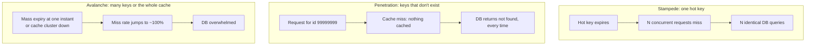
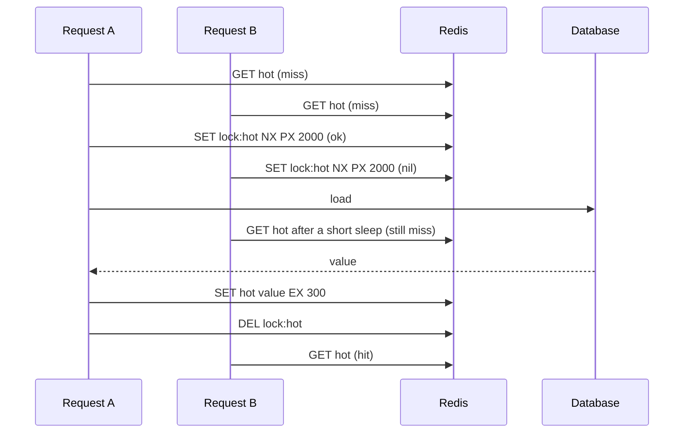
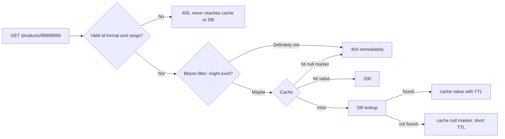

# Cache Stampede, Penetration & Avalanche

!!! abstract "Key takeaways"
    - **Stampede (thundering herd, dog-piling):** a hot key expires and every concurrent request misses and recomputes it. Measured: 200 concurrent requests for one expired key caused **200 database queries**, with a 1.2 s median latency behind a 20-connection pool. A Redis lock or single-flight cut that to **1 query**.
    - **Defences for stampedes:** a mutex on recompute (`SET lock NX PX`), request coalescing (single-flight), **probabilistic early refresh** (XFetch), serve-stale-while-revalidating, and background refresh of known hot keys.
    - **Penetration:** requests for IDs that don't exist always miss and go to the database, whether from bugs or from attacks. **Cache the "not found"** with a short TTL (2,000 requests → 494 queries here), validate inputs, and put a **Bloom filter** in front (0.67% false positives for 100k ids in 128 KB, which matches theory).
    - **Avalanche:** many keys expire at the same moment (10,000 keys loaded together → 10,000 expiries in the same second, versus a peak of 51 per second with 10% jitter), or the cache cluster fails. Defend with **TTL jitter**, staggered warm-up, a replicated cache, local L1 caches, and circuit breakers and rate limits that protect the database.
    - The underlying question is always the same: **what happens to the database when the cache doesn't answer?** Size, rate-limit and degrade for that case.

## Why it matters

A cache usually hides most of the read load. When it suddenly stops hiding that load, the database sees traffic it was never sized for and falls over, often taking the whole service with it. These failure modes come up in system-design interviews ("what happens when a celebrity's profile expires?") and as follow-ups to any resume line about caching. Knowing the names isn't enough. Interviewers want the mechanism, a defence that fits, and its trade-offs.

The simulations below used Redis 7.0.15, PostgreSQL 16 (a `pg_sleep(0.2)` query standing in for a 200 ms load) and a 20-connection pool, driven by 200 Python threads, while writing this page.

## Core concepts

### The three failure modes


*Notice the scale of each. A stampede concentrates load on one query, penetration repeats useless queries, and an avalanche removes the cache entirely. The defences differ accordingly.*

| | Stampede | Penetration | Avalanche |
|---|---|---|---|
| Trigger | One hot key expires or is evicted | Requests for non-existent data | Many keys expire together, or the cache fails |
| Symptom | Spike of identical queries | Steady DB load with a ~0% hit ratio on those keys | Hit ratio collapses across the board |
| Main defences | Lock, single-flight, early refresh, serve-stale | Null caching, Bloom filter, input validation, rate limits | TTL jitter, warm-up, HA cache, L1 cache, circuit breaker |

### Stampede: measured

200 threads requested the same key right after it expired. Each load takes 200 ms, and the database pool has 20 connections:

| Strategy | DB queries | Median latency | Max latency |
|---|---|---|---|
| Naive cache-aside | **200** | 1,173 ms | 2,006 ms |
| Distributed lock (`SET lock:hot 1 NX PX 2000`) + waiters poll | **1** | 2 ms | 348 ms |
| In-process single-flight (one leader, others wait) | **1** | 246 ms | 344 ms |

Without protection, all 200 requests queue for the 20 database connections and recompute the same value ten times over. Other endpoints that need the pool starve too. In a real system with several hundred pods and a slow aggregate query, that's an outage.

{ loading=lazy }
*Watch the database box: the naive version sends it every request, while the lock version sends it one and answers the rest from the refilled cache.*

### Defence 1: a lock around recomputation


*Notice that only the lock holder touches the database. Everyone else waits briefly and re-reads the cache. The lock's TTL guarantees progress if the holder crashes.*

Points to get right: a lock TTL longer than the load time; re-checking the cache after acquiring the lock (another holder may have just filled it); waiters with a bounded wait that fall back to stale data or an error rather than spinning forever; and releasing only your own lock (a token compared in Lua, covered in [distributed locks](07-distributed-locks-rate-limiting-and-pub-sub-with-redis.md)).

### Defence 2: single-flight (request coalescing)

Within one process, concurrent callers for the same key share one in-flight future. Caffeine's `AsyncLoadingCache` and `LoadingCache` do this automatically, and so does Spring's `@Cacheable(sync = true)` per instance. It needs no Redis round trips, but each **pod** still loads once, so 300 pods means up to 300 queries. That's often acceptable, and it combines well with a distributed lock.

### Defence 3: refresh before expiry

- **Probabilistic early expiration (XFetch):** each reader recomputes early with a probability that rises as expiry approaches: recompute if `now − delta × beta × ln(rand()) ≥ expiry`, where `delta` is how long the recompute takes. With heavy traffic, one request refreshes the key a little before it expires and nobody sees a miss. Simulated at 200 requests per second with a 0.2 s load: the first refresh happened on average **0.86 s before expiry** (range 0.35–1.9 s), so the key never actually expired.
- **Stale-while-revalidate:** store the value with a soft expiry inside it and a longer hard TTL. After the soft expiry, one request (holding a lock) refreshes in the background while everyone else keeps getting the slightly stale value. That gives no latency spike and no stampede, at the cost of bounded staleness.
- **Background refresh:** a scheduler rewarms a known list of hot keys (home page, top products, reference data) before they expire, or they never expire and are replaced on change.

### Penetration


*Notice the layers: cheap validation first, a probabilistic filter that never misses real ids, then the cache, which remembers "not found" for a short time.*

Measured: 2,000 requests over about 500 distinct missing ids caused **2,000** database queries without null caching and **494** with a 60-second null marker (one per distinct id). But an attacker who generates random ids never repeats one, so null caching doesn't help against them. That's what the Bloom filter is for:

| Bloom filter test | Result |
|---|---|
| 100,000 real ids, 2²⁰ bits (128 KB), 7 hash functions, stored as a Redis bitmap | 192 KB `MEMORY USAGE` |
| Real ids reported "maybe present" | 100% (no false negatives) |
| 20,000 random non-existent ids reported "maybe present" | 133 = **0.67%** (theory: 0.65%) |

A Bloom filter has no false negatives, so real data is never blocked, and it filters out 99.3% of bogus lookups. Deleting items requires rebuilding the filter or using a counting/cuckoo filter, and the filter must be updated on every insert. Redis 8 (and Redis Stack) include `BF.ADD`/`BF.EXISTS` natively.

{ loading=lazy }
*Notice that one 0 bit is enough to say "definitely absent". A "maybe" can be wrong, because other ids may have set all of its bits.*

### Avalanche

| Experiment | Peak expiries in one second |
|---|---|
| 10,000 keys loaded together with TTL 3,600 s | **10,000** |
| Same keys with TTL 3,600 + random(0..360) s | **51** |

The other kind of avalanche is losing the cache itself: a node failure, a network partition, or a deploy that flushes or renames every key. Defences: a replicated, highly available cache (replicas plus Sentinel or Cluster, multi-AZ on managed services), a local L1 cache that keeps serving the hottest keys, warming the cache before switching traffic, versioning keys gradually, and above all protecting the database with **circuit breakers, bulkheads and rate limits** so a cold cache means degraded service rather than a dead database.

## In practice: code & configuration

### Stampede-safe loading in Spring

=== "❌ Common mistake"

    ```java
    public Dashboard dashboard(String region) {
        String key = "dash:" + region;
        Dashboard d = cache.get(key);
        if (d == null) {
            d = reportRepository.expensiveAggregate(region);    // 2 s query
            cache.put(key, d, Duration.ofMinutes(5));            // same TTL for every region
        }
        return d;
        // When dash:EU expires at peak, every request runs the 2 s query concurrently.
    }
    ```

=== "✅ Better"

    ```java
    private static final Duration SOFT_TTL = Duration.ofMinutes(5);
    private static final Duration HARD_TTL = Duration.ofMinutes(30);

    record Cached<T>(T value, Instant softExpiry) {}

    public Dashboard dashboard(String region) {
        String key = "dash:" + region;
        Cached<Dashboard> c = cache.get(key);
        if (c != null && Instant.now().isBefore(c.softExpiry())) return c.value();  // fresh

        if (c != null) {                         // stale but usable: refresh in background
            refreshAsync(key, region);           // only the lock winner actually reloads
            return c.value();
        }
        return loadWithLock(key, region);        // true miss: one loader, others wait briefly
    }

    private Dashboard loadWithLock(String key, String region) {
        String token = UUID.randomUUID().toString();
        for (int i = 0; i < 50; i++) {
            if (locks.tryAcquire("lock:" + key, token, Duration.ofSeconds(10))) {
                try {
                    Cached<Dashboard> again = cache.get(key);              // re-check
                    if (again != null) return again.value();
                    Dashboard d = reportRepository.expensiveAggregate(region);
                    cache.put(key, new Cached<>(d, Instant.now().plus(jitter(SOFT_TTL))), HARD_TTL);
                    return d;
                } finally {
                    locks.release("lock:" + key, token);                   // compare-and-delete
                }
            }
            sleepQuietly(Duration.ofMillis(50));
            Cached<Dashboard> filled = cache.get(key);
            if (filled != null) return filled.value();
        }
        throw new ServiceUnavailableException("dashboard busy, retry");    // bounded wait
    }
    ```

For in-process coalescing, `@Cacheable(cacheNames = "dash", sync = true)` makes concurrent callers on the same instance wait for one load (see [Spring Cache with Redis](05-spring-cache-abstraction-with-redis.md)). Caffeine's `refreshAfterWrite` implements stale-while-revalidate locally.

### XFetch in a few lines

```java
// Store value with the time it took to compute (deltaMs) and its expiry
boolean shouldRefreshEarly(long expiryEpochMs, long deltaMs, double beta) {
    double r = ThreadLocalRandom.current().nextDouble();          // (0,1)
    long now = System.currentTimeMillis();
    return now - (long) (deltaMs * beta * Math.log(r)) >= expiryEpochMs;  // log(r) < 0
}
```

`beta` > 1 refreshes earlier and more eagerly. `beta` = 1 is the paper's recommended default.

### Null caching and a Bloom filter

```java
private static final String NULL_MARKER = "\u0000NULL";

public Optional<Product> find(long id) {
    if (!productBloom.mightContain(id)) return Optional.empty();       // definitely absent
    String key = "product:" + id;
    String cached = redis.opsForValue().get(key);
    if (NULL_MARKER.equals(cached)) return Optional.empty();           // cached "not found"
    if (cached != null) return Optional.of(fromJson(cached));

    Optional<Product> p = repo.findById(id);
    redis.opsForValue().set(key, p.map(this::toJson).orElse(NULL_MARKER),
            p.isPresent() ? Duration.ofMinutes(10) : Duration.ofSeconds(60)); // short TTL for nulls
    return p;
}

@TransactionalEventListener(phase = TransactionPhase.AFTER_COMMIT)
void onCreated(ProductCreated e) {
    productBloom.put(e.id());                         // keep the filter in step with inserts
    redis.delete("product:" + e.id());                // clear any cached null marker
}
```

The last line matters: if "not found" was cached for an id that's then created, the new item stays invisible until the null marker expires. Delete the marker on create.

## Real-world usage

- **Facebook memcache** uses **leases**: on a miss the cache hands one client a lease token to fill the key, and other clients wait or get slightly stale data. This addresses both stampedes and stale sets (NSDI 2013).
- **CDNs** use request collapsing (one origin fetch per object per edge) and `stale-while-revalidate`/`stale-if-error` headers, which are the HTTP equivalents of single-flight and serve-stale.
- **Varnish and NGINX** have `proxy_cache_lock` and grace mode for the same reasons.
- **Bloom filters** guard storage lookups in Cassandra, HBase and RocksDB (skipping files that can't contain a key), the same idea applied to cache penetration.
- **Flash sales and celebrity posts** are the classic stampede triggers. Teams pre-warm and pin those keys and refresh them in the background rather than relying on TTLs.

## Trade-offs & production gotchas

!!! warning "Getting the defences wrong"
    - **Lock without a TTL:** the holder crashes and the key is never recomputed. Always use `PX`.
    - **Waiters spinning forever:** bound the wait and fall back to stale data or a fast error.
    - **Caching nulls too long:** newly created items look missing. Keep null TTLs short and delete markers on create.
    - **Bloom filter drift:** inserts that bypass the filter cause false negatives, which block real data. Rebuild periodically from the source of truth.
    - **Jitter without enough spread:** 1% jitter on a 1-hour TTL still concentrates expiries. 10–20% is typical.
    - **Single-flight only per pod:** with hundreds of pods, it's still hundreds of loads. Add a distributed lock for very expensive loads.

- **Serve-stale trades freshness for availability.** Good for dashboards and catalogues, but not for balances or entitlements.
- **Locks add latency and Redis round trips** on every miss. Use them for expensive loads, not for cheap primary-key lookups.
- **The database must survive a cold cache.** Load-test with the cache disabled or flushed, and have a rate limiter or bulkhead in front of the database for the cache-down case.
- **Monitor:** misses per key or prefix, lock contention, null-marker hit rate (high means bots or bugs), and the database query rate correlated with cache events.

## How this connects to my experience

- **Resume bullet (OptumRx):** "Implemented Redis-based caching for frequently accessed queries and UI reference data." Also at OptumRx: "Kafka-based async processing with retry mechanisms and DLQ handling" (the same thinking about protecting downstream systems).
- **How to talk about it:** reference data and frequent queries are exactly the hot keys that stampede when they expire at peak time. The defences to describe are TTL jitter, a single loader per key (`@Cacheable(sync = true)` or a Redis lock), and refreshing reference data in the background rather than waiting for expiry. *[confirm which of these you actually implemented; if none, present them as what you would add, not what you did]*
- **Talking points:**
    - "Every cache design question is really: what does the database see when the cache doesn't answer?"
    - "For hot, expensive keys I'd rather serve slightly stale data and refresh in the background than let a thousand requests recompute it."
    - "For lookups by id from the internet, I validate the id, cache not-found briefly, and use a Bloom filter if bots are probing."
- **Likely follow-up chain:** "What's a cache stampede?" → "How would you prevent it?" (lock vs single-flight vs early refresh) → "What if the lock holder dies?" → "What about requests for ids that don't exist?" → "What if Redis itself goes down?" (avalanche, circuit breaker, DB capacity).

## Interview questions

### Fundamentals

??? question "Q1. What is a cache stampede?"
    **Answer:** When a popular key expires (or is evicted), many concurrent requests miss at the same moment, and each one recomputes the value from the database. The database receives a burst of identical expensive queries, connection pools exhaust and latency spikes across the service. Measured: 200 concurrent requests → 200 identical queries, median latency 1.2 s behind a 20-connection pool. Also called thundering herd or dog-piling.

    **Interviewer listens for:** a hot key, concurrency at expiry, duplicate work, and the downstream impact.

    **Common wrong answer:** "When the cache gets too many requests." The cache is fine; the database isn't.

??? question "Q2. What's the difference between cache penetration and a cache avalanche?"
    **Answer:** Penetration: requests for data that doesn't exist, so there's never anything to cache and every request reaches the database. It's caused by bugs, scrapers or attackers using random ids. An avalanche: a large fraction of the cache becomes unavailable at once, either because many keys expire together or because the cache cluster fails, so the overall hit ratio collapses. Penetration affects specific non-existent keys continuously. An avalanche affects everything at once.

    **Interviewer listens for:** distinct causes and distinct defences.

    **Common wrong answer:** treating the terms as synonyms for "lots of misses".

??? question "Q3. How do you prevent keys from expiring at the same time?"
    **Answer:** Add random jitter to TTLs, typically 10–20% of the base. Measured: 10,000 keys loaded together had 10,000 expiries in the same second without jitter and a peak of 51 per second with 10% jitter. Also stagger warm-up jobs, refresh hot keys in the background, and avoid flushing or renaming every key in a deploy at once.

    **Interviewer listens for:** jitter, an amount, and the root cause (synchronized loading).

    **Common wrong answer:** "Use longer TTLs." They expire together later.

??? question "Q4. How does caching 'not found' help, and what's the risk?"
    **Answer:** Storing a null marker for a missing id with a short TTL means repeated requests for that id hit the cache instead of the database (2,000 requests → 494 queries here, one per distinct id). Risks: if the item is created later, it looks missing until the marker expires, so keep the TTL short and delete the marker on create. Attackers using random, never-repeating ids get no benefit from null caching, and each one also costs a cache entry, so combine it with a Bloom filter and rate limits.

    **Interviewer listens for:** the short TTL, invalidation on create, and the random-id limitation.

    **Common wrong answer:** "Cache nulls with the same TTL as values."

### Intermediate

??? question "Q5. How would you implement a lock to prevent a stampede, and what can go wrong?"
    **Answer:** On a miss, try `SET lock:key token NX PX <ttl>`. The winner re-checks the cache, loads from the database, writes the value, and releases the lock with a compare-and-delete Lua script so it never deletes someone else's lock. Losers sleep briefly and re-read the cache, with a bounded number of retries, then fall back to stale data or an error. Pitfalls: no lock TTL (deadlock if the holder dies), a TTL shorter than the load (two loaders), unbounded waiting, deleting another holder's lock, and adding lock overhead to cheap loads. Measured: 200 requests → 1 database query.

    **Interviewer listens for:** NX + PX, re-check, a token-based release, bounded waiting, and a fallback.

    **Common wrong answer:** `SETNX` followed by a separate `EXPIRE`, which isn't atomic: a crash in between leaves a permanent lock.

??? question "Q6. Lock vs single-flight vs probabilistic early refresh: compare them."
    **Answer:** A distributed lock gives one load across all instances but costs Redis round trips and waiting. Single-flight (Caffeine, `@Cacheable(sync = true)`) gives one load per process with no network cost, but N pods still mean N loads. Probabilistic early refresh (XFetch) has some readers refresh before expiry with rising probability, so under steady traffic the key never expires and nobody waits (simulated: refresh about 0.86 s before expiry). It works best for hot keys with known recompute time, and it doesn't help on a cold start. In practice: early refresh or serve-stale for hot keys, plus a lock or single-flight for cold misses.

    **Interviewer listens for:** scope (global vs per process), latency impact, cold vs warm, and combining them.

    **Common wrong answer:** "They're all the same idea."

??? question "Q7. What is stale-while-revalidate, and when would you use it?"
    **Answer:** Store each value with a soft expiry and a longer hard TTL. Before the soft expiry, serve normally. Between soft and hard, serve the stale value immediately and trigger one background refresh (guarded by a lock). After the hard TTL, it's a true miss. Users never wait on recomputation and there's no stampede, at the cost of bounded staleness. Use it for dashboards, catalogues and reference data, not for data that must be current (balances, permissions). HTTP has the same directive in `Cache-Control`.

    **Interviewer listens for:** soft vs hard expiry, a background refresh with a single refresher, and suitable data.

    **Common wrong answer:** "Just never expire the cache." Then nothing refreshes.

??? question "Q8. How does a Bloom filter stop cache penetration? What are its limits?"
    **Answer:** A Bloom filter is a bit array plus k hash functions. On insert, set the k bits. On lookup, if any bit is 0, the item is definitely absent, so return 404 without touching the cache or database. If all bits are 1, the item might exist, so continue normally. There are no false negatives, and the false-positive rate depends on bits per item and k. Measured: 100k ids in 128 KB with k = 7 gave 0.67% false positives, matching the 0.65% theory. Limits: you can't delete from a standard filter (rebuild, or use a counting/cuckoo filter), it must be updated on every insert or real items get blocked, and sizing must anticipate growth.

    **Interviewer listens for:** the definite-no/maybe-yes semantics, sizing, deletion, and keeping it in sync.

    **Common wrong answer:** "It tells you whether the item exists." It can only rule items out.

??? question "Q9. Your cache cluster goes down completely. How do you keep the database alive?"
    **Answer:** Prevent: run a replicated, multi-AZ cache with automatic failover. Survive: short client timeouts plus a circuit breaker so requests don't hang on Redis, a local L1 cache (Caffeine) serving the hottest keys, rate limiting or a bulkhead on database access so only a sustainable query rate passes, load shedding of non-critical endpoints, and serving degraded responses (defaults, stale data from L1). Recover: warm critical keys before reopening traffic, and ramp up gradually. Also know your cold-cache capacity from load tests.

    **Interviewer listens for:** HA, timeouts and breakers, L1, database protection, and controlled warm-up.

    **Common wrong answer:** "Fall back to the database." Without throttling, that's the avalanche.

### Senior

??? question "Q10. A celebrity's profile gets 50,000 reads per second. Design the caching so expiry never causes a spike."
    **Answer:** Treat it as a known hot key. Never let it expire on a TTL: refresh it in the background on change (event-driven) or on a schedule, or use stale-while-revalidate with a single refresher. Replicate it to avoid one hot shard: an in-process L1 cache on every pod with a short TTL (one second absorbs most reads), and optionally several Redis copies (`profile:123:{0..7}` with random reads) or reads from Redis replicas. Detect hot keys automatically (Redis `--hotkeys` with LFU, or client-side metrics) and promote them. Keep a lock on any cold miss as the safety net.

    **Interviewer listens for:** no TTL-driven expiry for hot keys, an L1 cache, key replication or sharding, and hot-key detection.

    **Common wrong answer:** "Give it a longer TTL." It still expires, just less often.

??? question "Q11. How do you test that your system survives a stampede or a cold cache?"
    **Answer:** Load-test scenarios: flush the cache under peak load, expire a hot key under concurrency, and simulate a Redis outage (block the port, or use chaos tools such as Toxiproxy or AWS FIS). Measure database QPS, connection-pool wait time, error rates and p99 latency. Assert that only one load per key happens (query counters in tests, as in the simulation on this page), that circuit breakers open, and that the database stays under its limits. Run game days for full cache failover. Automate the single-key stampede check as a concurrency test in CI.

    **Interviewer listens for:** deliberate failure injection, the metrics that matter, and automation.

    **Common wrong answer:** "We monitor production and react."

??? question "Q12. Explain the XFetch formula and why it works."
    **Answer:** Store the value with its expiry time and `delta`, the time it took to compute. Each read refreshes early if `now − delta × beta × ln(rand()) ≥ expiry`. Since `ln(rand())` is negative, the term adds a random positive "look-ahead". Most reads look a little ahead, a few look far ahead, and the probability of crossing the expiry rises sharply as it approaches. With many readers, one of them refreshes shortly before expiry and the rest keep hitting. Longer recomputes (bigger `delta`) refresh earlier, so the new value is ready in time. `beta` tunes eagerness, and 1 is the recommended default. It needs no locks or coordination. With few readers it degrades gracefully to a normal miss.

    **Interviewer listens for:** the probabilistic look-ahead, scaling by recompute time, no coordination, and behaviour at low traffic.

    **Common wrong answer:** "It refreshes at a fixed percentage of the TTL." That's deterministic, so every node refreshes at once.

### Scenario-based

??? question "Q13. Database CPU spikes every 5 minutes, always on the same report query. Diagnose and fix."
    **Answer:** A 5-minute period matching the TTL points to a stampede on the report's cache key: it expires, and concurrent requests all run the query. Confirm with `pg_stat_statements` (calls per interval), cache-miss logs per key, and the TTL. Fix: a single loader (Redis lock or `sync = true`), stale-while-revalidate or background refresh every 4 minutes so the key never expires under traffic, and TTL jitter if there are many similar keys. Also check that the query itself is reasonable: a materialized view or summary table may help more than any cache trick.

    **Interviewer listens for:** correlating the period with the TTL, confirming with data, a single-loader fix, and fixing the query.

    **Common wrong answer:** "Increase the TTL to an hour." The spike moves to hourly.

??? question "Q14. Logs show thousands of requests per second for product ids that don't exist, from many IPs. What do you do?"
    **Answer:** Short-term: rate-limit at the edge or WAF by IP and pattern, validate the id format and range so obviously invalid ids get a 400, and return 404s cheaply. Cache-level: a Bloom filter of existing ids in front of the cache so random ids never reach Redis or the database (99%+ filtered at 0.67% false positives in my test), plus short-TTL null caching for repeated ids. Long-term: use non-enumerable public ids (UUIDs or opaque ids) if sequential ids invite scraping, add bot detection, and alert on a high null-marker hit rate.

    **Interviewer listens for:** layered defences (edge, validation, Bloom, null cache) and attack-aware design.

    **Common wrong answer:** "Cache the 404s." That doesn't stop random ids.

??? question "Q15. After a deploy that changed the cache key prefix from v1 to v2, the database fell over. What happened, and how should it have been done?"
    **Answer:** Changing the prefix invalidated every key at once: an avalanche, with a 0% hit ratio at full traffic. Better: warm the v2 keys before switching (a job, or dual-write for a while), roll the change out gradually (canary pods read v2 while others read v1), fall back to v1 for compatible data, or make the new code read old keys and translate them. Protect the database with rate limits during the warm-up, and include cache-cold load in deploy testing.

    **Interviewer listens for:** recognising a self-inflicted avalanche, warm-up, gradual rollout, and database protection.

    **Common wrong answer:** "Redis must have crashed."

## Cheat sheet

| Problem | Cause | Defences |
|---|---|---|
| Stampede | Hot key expires under concurrency (200 req → 200 queries) | Lock `NX PX` + re-check (→ 1 query), single-flight / `sync = true`, XFetch, stale-while-revalidate, background refresh |
| Penetration | Non-existent ids | Validate input, null marker with short TTL (2000 → 494), Bloom filter (0.67% FP, 128 KB / 100k), rate limits |
| Avalanche | Mass expiry or cache down | TTL jitter (10,000/s → 51/s), staggered warm-up, HA cache, L1 cache, circuit breaker, DB rate limit |
| Lock rules | | TTL > load time, token + Lua release, bounded wait, fallback |
| XFetch | | `now − delta·beta·ln(rand) ≥ expiry`, beta = 1 |
| Hot key | | Never expire: refresh on change, L1, replicate key |
| Test | | Flush under load, chaos on Redis, count loads per key |

## Sources
1. Vattani, Chierichetti, Lowenstein, [Optimal Probabilistic Cache Stampede Prevention](https://cseweb.ucsd.edu/~avattani/papers/cache_stampede.pdf) (VLDB 2015): the XFetch algorithm.
2. Nishtala et al., [Scaling Memcache at Facebook](https://www.usenix.org/conference/nsdi13/technical-sessions/presentation/nishtala) (NSDI 2013): leases against thundering herds and stale sets.
3. [RFC 5861: HTTP Cache-Control extensions for stale content](https://www.rfc-editor.org/rfc/rfc5861) (stale-while-revalidate, stale-if-error).
4. [Redis docs: Bloom filter](https://redis.io/docs/latest/develop/data-types/probabilistic/bloom-filter/) and [distributed locks](https://redis.io/docs/latest/develop/use/patterns/distributed-locks/).
5. [Spring Framework: @Cacheable synchronized caching](https://docs.spring.io/spring-framework/reference/integration/cache/annotations.html#cache-annotations-cacheable-synchronized) and [Caffeine refresh](https://github.com/ben-manes/caffeine/wiki/Refresh).
6. [AWS: Caching best practices](https://aws.amazon.com/caching/best-practices/) and [NGINX proxy_cache_lock](https://nginx.org/en/docs/http/ngx_http_proxy_module.html#proxy_cache_lock).
7. Bloom, *Space/Time Trade-offs in Hash Coding with Allowable Errors* (CACM 1970).
8. Demonstrations on this page: Redis 7.0.15 and PostgreSQL 16 with 200 concurrent Python threads and a 20-connection pool, run while writing this page.
