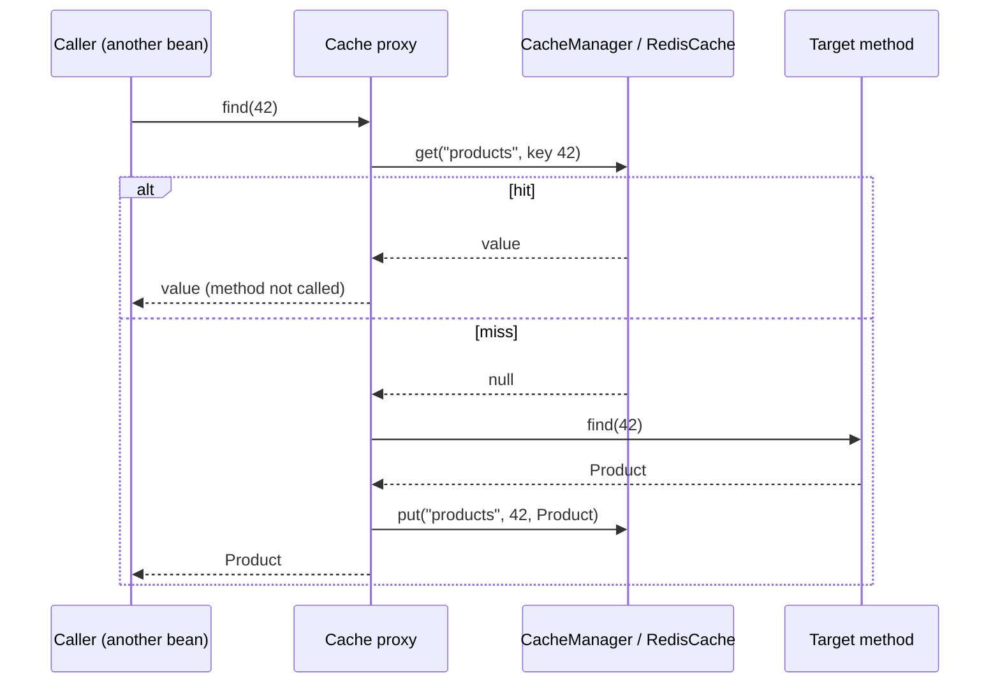
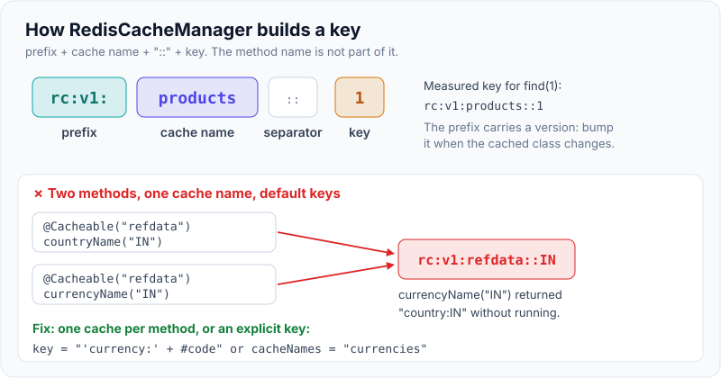

# Spring Cache Abstraction with Redis

!!! abstract "Key takeaways"
    - Spring's cache abstraction is **AOP around methods**: `@Cacheable` checks the cache before the method runs, `@CachePut` always runs it and stores the result, and `@CacheEvict` removes entries. `@EnableCaching` turns it on, and a `CacheManager` (here `RedisCacheManager`) supplies the store.
    - It's a **proxy**, so calling a cached method from the same class (`this.find()`) bypasses the cache. Measured: 2 database calls for 2 calls, and no Redis key. Private and final methods aren't intercepted either.
    - Configure it properly in Spring Boot 3: **per-cache TTLs**, a **versioned key prefix**, **JSON** values instead of JDK serialisation, a decision about **nulls** (`unless = "#result == null"`), **transaction-aware** eviction (a rolled-back update left the entry in place, and a committed one removed it), and a lenient **`CacheErrorHandler`** so a Redis outage falls back to the database (measured: the call succeeded in 333 ms with Redis down).
    - **`sync = true` with Redis didn't coalesce on Spring Data Redis 3.5 by default**: 50 concurrent callers caused 50 loads. With `RedisCacheWriter.lockingRedisCacheWriter(…)` it caused **1** load, but every waiter polled a Redis lock, and the burst took 1.45 s.
    - Know the key rules: the default key is the method's parameters (`SimpleKey`), so two methods that share a cache name and parameters **collide** (measured: `currencyName("IN")` returned `country:IN`). Give each method its own cache or an explicit key.

## Why it matters

Most Spring Boot services that "use Redis caching" do it through these annotations, so interviewers ask about them: how they work, why caching sometimes silently doesn't happen, how to set TTLs, what gets stored in Redis, and how eviction interacts with transactions. They're easy to add and easy to get subtly wrong. The proxy model, key generation and null handling are behind most of the bugs.

Every behaviour on this page was verified with a Spring Boot 3.5.6 / Spring Data Redis 3.5.4 test project against Redis 7.0.15 while writing this page.

## Core concepts

### How it works


*Notice that caching lives in the proxy, not in your method. Anything that doesn't go through the proxy, such as `this.find(42)` from inside the class, never touches the cache.*

`@EnableCaching` registers a `CacheInterceptor` that wraps beans with caching annotations in a proxy (CGLIB subclass by default in Boot). The interceptor evaluates SpEL for keys and conditions, asks the `CacheManager` for the named cache, and calls through to the method only when needed. The abstraction is store-agnostic. The same annotations work with Caffeine, Hazelcast, JCache or Redis.

{ loading=lazy }
*Watch the second call: it never leaves the target object, so the interceptor never sees it.*

### The annotations

| Annotation | Method runs? | Effect | Typical use |
|---|---|---|---|
| `@Cacheable` | Only on a miss | Returns the cached value, or runs and stores the result | Reads |
| `@CachePut` | Always | Stores the return value under the key | Update methods that return the new state |
| `@CacheEvict` | Always | Removes a key (`allEntries = true` clears the cache; `beforeInvocation` controls timing) | Updates and deletes |
| `@Caching` | — | Groups several of the above | Evict from several caches |
| `@CacheConfig` | — | Class-level defaults (cache names, key generator) | Less repetition |

Useful attributes: `key` (SpEL such as `#id`, `#p0`, `#user.id`, `#result.id()` for `@CachePut`), `condition` (evaluated **before** the call: whether to use the cache at all), `unless` (evaluated **after**: whether to skip storing, so it can see `#result`), and `sync` (one loader per key, with caveats below).

### Key generation

| Method signature | Default key (`SimpleKeyGenerator`) |
|---|---|
| `find()` | `SimpleKey.EMPTY` |
| `find(long id)` | `42` |
| `find(String a, int b)` | `SimpleKey [a, 7]` |

The cache **name** isn't part of the generated key, and neither is the **method name**. `RedisCacheManager` prefixes the cache name, so the Redis key is `prefix + cacheName + "::" + key`. Measured: `rc:v1:products::1`. If two methods use the same cache name with the same parameters, they read each other's entries. In the test, `countryName("IN")` and `currencyName("IN")` both used the `refdata` cache, and the second returned `"country:IN"` without running.

{ loading=lazy }
*Notice that nothing in the key says which method stored it. Two methods that share a cache name and arguments share entries.*

### What ends up in Redis

With `RedisSerializer.json()` (Jackson with type information), the stored value was:

```json
{"@class":"kb.App$Product","id":1,"name":"Aspirin","price":["java.math.BigDecimal",5.00]}
```

That's readable and debuggable, but it embeds the **class name**. Renaming or moving the class breaks deserialisation of existing entries, so version the key prefix on such changes. The default `JdkSerializationRedisSerializer` stores opaque bytes, requires `Serializable`, breaks on class changes and is a deserialisation-attack surface. Avoid it.

## In practice: code & configuration

### Spring Boot 3 setup

```xml
<dependency>
  <groupId>org.springframework.boot</groupId>
  <artifactId>spring-boot-starter-cache</artifactId>
</dependency>
<dependency>
  <groupId>org.springframework.boot</groupId>
  <artifactId>spring-boot-starter-data-redis</artifactId>
</dependency>
```

```yaml
spring:
  cache:
    type: redis                  # optional: auto-detected when Redis is on the classpath
  data:
    redis:
      host: redis.internal
      timeout: 200ms             # fail fast so a sick Redis doesn't stall requests
```

```java
@Configuration
@EnableCaching
class CacheConfig {

    @Bean
    RedisCacheConfiguration cacheDefaults() {
        return RedisCacheConfiguration.defaultCacheConfig()
            .entryTtl(Duration.ofMinutes(10))                     // default TTL (Boot's default is none!)
            .disableCachingNullValues()                           // see "nulls" below
            .prefixCacheNameWith("orders-svc:v1:")                // namespace + version
            .serializeValuesWith(RedisSerializationContext.SerializationPair
                .fromSerializer(RedisSerializer.json()));         // JSON, not JDK serialization
    }

    @Bean
    RedisCacheManagerBuilderCustomizer perCacheSettings(RedisCacheConfiguration defaults) {
        return builder -> builder
            .withCacheConfiguration("products", defaults.entryTtl(Duration.ofMinutes(5)))
            .withCacheConfiguration("refdata",  defaults.entryTtl(Duration.ofHours(6)))
            .transactionAware();                                  // put/evict after commit
    }

    @Bean
    CachingConfigurer cachingConfigurer() {
        return new CachingConfigurer() {
            @Override public CacheErrorHandler errorHandler() {
                return new LenientCacheErrorHandler();            // log + carry on to the method
            }
        };
    }
}
```

Measured TTLs: `products` keys had `TTL` 300, `refdata` keys 21,600. Simple TTLs can also come from properties (`spring.cache.redis.time-to-live`, `key-prefix`, `cache-null-values`), but defining a `RedisCacheConfiguration` bean replaces those properties entirely, so pick one style.

Since Spring Data Redis 3.2 you can also compute TTLs per entry with `RedisCacheWriter.TtlFunction` (`entryTtl((key, value) -> …)`), for example to add jitter.

### Using the annotations

```java
@Service
@CacheConfig(cacheNames = "products")
public class ProductService {

    @Cacheable(key = "#id", unless = "#result == null")        // don't cache "not found"
    public Product find(long id) { ... }

    @Transactional
    @CacheEvict(key = "#id")                                    // with transactionAware: after commit
    public void updatePrice(long id, BigDecimal price) { ... }

    @CachePut(key = "#result.id()")                             // refresh the entry with the new state
    public Product rename(long id, String name) { ... }

    @Caching(evict = {
        @CacheEvict(cacheNames = "products", key = "#id"),
        @CacheEvict(cacheNames = "productSearch", allEntries = true)
    })
    public void delete(long id) { ... }
}
```

Verified results:

| Test | Result |
|---|---|
| `find(1)` three times | 1 database call, key `rc:v1:products::1`, TTL 300 |
| `@CachePut rename(2, …)` then `find(2)` | New name returned with 0 database calls |
| `@Transactional @CacheEvict` that **rolls back** | Key still present (eviction deferred and discarded) |
| Same method that **commits** | Key removed |
| `findOrNull(999)` twice with `unless = "#result == null"` | 2 database calls (null not cached) |
| Redis port closed, lenient error handler | Both calls served from the database, 333 ms total |

!!! warning "allEntries = true on Redis"
    `@CacheEvict(allEntries = true)` makes `RedisCache.clear()` find keys by pattern. By default that uses `KEYS`, which [blocks Redis](01-redis-data-structures-and-use-cases.md). Configure `BatchStrategies.scan(1000)` on the cache writer (`RedisCacheWriter.nonLockingRedisCacheWriter(cf, BatchStrategies.scan(1000))`), or use versioned prefixes instead of mass clears.

### The self-invocation trap

=== "❌ Common mistake"

    ```java
    @Service
    public class ProductService {
        @Cacheable("products")
        public Product find(long id) { ... }

        public List<Product> findAll(List<Long> ids) {
            return ids.stream().map(this::find).toList();   // this.find(): proxy bypassed
        }

        @Cacheable("products")
        private Product helper(long id) { ... }             // private: never intercepted
    }
    ```
    Measured: two `findViaThis(1)` calls → **2** database calls and **no** Redis keys.

=== "✅ Better"

    ```java
    @Service
    public class ProductQueries {
        private final ProductService products;              // separate bean = goes through the proxy
        public List<Product> findAll(List<Long> ids) {
            return ids.stream().map(products::find).toList();
        }
    }
    // Or use the Cache API directly for bulk operations:
    // Cache cache = cacheManager.getCache("products"); cache.get(id, Product.class)
    ```

The same rule applies to `@Transactional`, `@Async` and `@Retryable`: one bean calling its own annotated method doesn't go through the proxy. AspectJ weaving (`mode = AdviceMode.ASPECTJ`) avoids it, but splitting the bean is simpler.

### Nulls

- `disableCachingNullValues()` with a method that returns `null`: the put throws `IllegalArgumentException` ("Cache 'products' does not allow 'null' values…"). In my test the lenient `CacheErrorHandler` swallowed it, so the call succeeded silently. Without such a handler the call fails. Always pair it with `unless = "#result == null"`.
- If you **want** to cache "not found" (against [penetration](04-cache-stampede-penetration-and-avalanche.md)), allow nulls (stored as a `NullValue` marker), and give that cache a short TTL.
- `Optional<T>` return types are unwrapped: an empty `Optional` is treated as null.

### sync = true: what it really does with Redis

```java
@Cacheable(cacheNames = "products", key = "#id", sync = true)
public Product findSync(long id) { ... }
```

`sync = true` makes the interceptor call `Cache.get(key, valueLoader)` and leaves "load only once" to the cache implementation. Caffeine coalesces in-process. **Spring Data Redis 3.x delegates to the `RedisCacheWriter`, and the default non-locking writer doesn't coordinate**:

| 50 concurrent first calls for one key | Loads | Time |
|---|---|---|
| `sync = false` | 50 | ~ one load |
| `sync = true`, default (non-locking) writer | **50** | ~ one load |
| `sync = true`, `RedisCacheWriter.lockingRedisCacheWriter(cf)` | **1** | 1.45 s (waiters poll a Redis lock key) |

```java
@Bean
RedisCacheManagerBuilderCustomizer lockingWriter(RedisConnectionFactory cf) {
    // Cross-instance lock per cache (not per key!) during put/get-with-loader
    return b -> b.cacheWriter(RedisCacheWriter.lockingRedisCacheWriter(cf));
}
```

The locking writer uses one lock key **per cache name**, not per key, and holds it during writes, so it serialises all loads into that cache and adds polling latency. Use it only for a few expensive caches. Otherwise use a Caffeine L1 cache (which coalesces per instance), or an explicit per-key lock as shown on the [stampede page](04-cache-stampede-penetration-and-avalanche.md). `sync = true` also can't be combined with `unless` or with multiple caches on one method.

### Two-level caching

```java
@Bean
CacheManager cacheManager(RedisConnectionFactory cf, RedisCacheConfiguration redisDefaults) {
    var caffeine = new CaffeineCacheManager("refdata");
    caffeine.setCaffeine(Caffeine.newBuilder().maximumSize(10_000).expireAfterWrite(Duration.ofMinutes(1)));
    var redis = RedisCacheManager.builder(cf).cacheDefaults(redisDefaults).build();
    // Spring doesn't ship an L1/L2 manager: either route cache names to different managers
    // (CompositeCacheManager = first manager that has the name) or write a small
    // Cache decorator that checks Caffeine, then Redis, and publishes evictions via Pub/Sub.
    return new CompositeCacheManager(caffeine, redis);
}
```

## Real-world usage

- **Reference data and lookups:** `@Cacheable` on a lookup service with a long TTL, plus a `@CacheEvict(allEntries = true)` (with the SCAN strategy) or a version bump from the admin update path.
- **Expensive reads:** search pages and aggregates with short TTLs and explicit keys that include every parameter (`key = "#tenant + ':' + #query.hashCode()"`, or better a stable hash of a normalised query object).
- **Multi-tenant services:** the tenant id must be in the key. A missing tenant in a SpEL key is a cross-tenant data leak.
- **Spring Session** uses Redis independently of the cache abstraction (`@EnableRedisHttpSession`), with its own keys and TTLs.
- **Observability:** with Micrometer, `RedisCacheManager.builder(...).enableStatistics()` exposes hits, misses, puts and evictions per cache name as `cache.gets{result=hit|miss}`.

## Trade-offs & production gotchas

!!! warning "Classic Spring Cache bugs"
    - **Self-invocation and private methods:** no caching, no error. Verify with a test that counts repository calls.
    - **No TTL:** Boot's default Redis cache configuration has no expiry. Set `entryTtl`.
    - **Shared cache names with default keys:** collisions between methods. One cache per method, or explicit keys.
    - **Mutable cached objects:** with a local cache (Caffeine), callers that mutate the returned object change the cached instance. Return immutable records.
    - **Class changes and JSON type info:** old entries fail to deserialise after refactors. Version the prefix.
    - **Eviction before commit:** without `transactionAware()` (or `@TransactionalEventListener`), `@CacheEvict` runs when the method returns, which can be before the transaction commits, so a concurrent reader can re-cache the old row.
    - **Errors propagate by default:** a Redis timeout fails the request unless you configure a `CacheErrorHandler`.
    - **`allEntries = true` uses KEYS by default:** switch the batch strategy to SCAN.

- **Declarative vs explicit:** annotations keep business code clean but hide behaviour (keys, nulls, timing). For complex flows (stampede protection, stale-while-revalidate, versioned writes) use `RedisTemplate` or the `Cache` API directly.
- **Testing:** use Testcontainers Redis (or an embedded server) and assert on repository call counts and Redis keys and TTLs, as this page's tests do.

## How this connects to my experience

- **Resume bullet (OptumRx):** "Implemented Redis-based caching for frequently accessed queries and UI reference data," in "Java, Spring Boot, Kafka, MongoDB, Redis" microservices.
- **How to talk about it:** in a Spring Boot service, the natural implementation is `@EnableCaching` with a `RedisCacheManager`, a TTL per cache name (long for reference data, short for query results), JSON serialisation, and `@CacheEvict` on the update paths. *[confirm: annotations vs `RedisTemplate`; which cache names and TTLs; whether you set an error handler; how reference-data refresh was triggered]*
- **Talking points:**
    - "I configure TTLs per cache, version the prefix and use JSON, because the defaults (no TTL, JDK serialisation) are wrong for production."
    - "I know the proxy trap: a cached method called from the same class isn't cached, so I test with a call counter."
    - "`sync = true` doesn't coalesce across threads with the default Redis cache writer. For expensive keys I use a locking writer, a local Caffeine layer or an explicit lock."
- **Likely follow-up chain:** "How does `@Cacheable` work?" (proxy) → "Why isn't my method being cached?" (self-invocation) → "How do you set different TTLs?" → "What's stored in Redis, and how is it serialised?" → "How do you evict on update, and what about transactions?" → "What happens when Redis is down?" → "How do you stop a stampede with `@Cacheable`?"

## Interview questions

### Fundamentals

??? question "Q1. How does @Cacheable work under the hood?"
    **Answer:** `@EnableCaching` registers a `CacheInterceptor` that Spring applies through AOP proxies to beans with caching annotations. When a caller invokes the method through the proxy, the interceptor builds a key (SpEL or `SimpleKeyGenerator`), looks it up in the named cache from the `CacheManager`, and returns the cached value on a hit without calling the method. On a miss it calls the method and stores the result, unless the `unless` expression says otherwise. The store is pluggable: Redis via `RedisCacheManager`, Caffeine, and so on.

    **Interviewer listens for:** AOP proxy, interceptor, key generation, CacheManager, and the hit/miss flow.

    **Common wrong answer:** "Spring stores the method's result in a HashMap." That's only true for the simple default `ConcurrentMapCacheManager`, not for Redis.

??? question "Q2. Difference between @Cacheable, @CachePut and @CacheEvict?"
    **Answer:** `@Cacheable` skips the method on a hit and caches the result on a miss, so it's for reads. `@CachePut` always runs the method and stores its return value, so it's for updates that return the new state (verified: after `rename()`, `find()` returned the new name with 0 database calls). `@CacheEvict` always runs the method and removes the key (`allEntries` to clear the cache; `beforeInvocation = true` to evict even if the method throws). `@Caching` combines several.

    **Interviewer listens for:** whether the method runs, and the right annotation per operation.

    **Common wrong answer:** using `@Cacheable` on an update method. It skips the update on a hit.

??? question "Q3. Why isn't my @Cacheable method being cached?"
    **Answer:** The most common cause is self-invocation: calling it from another method of the same class bypasses the proxy (verified: 2 calls, 2 database hits, no Redis key). Others: the method is private or final, the bean isn't a Spring bean (created with `new`), `@EnableCaching` is missing, the `condition` is false or `unless` rejects the result, the key differs on each call (an object without stable `equals`/`hashCode`, or a timestamp parameter), or a `CacheErrorHandler` is silently swallowing Redis errors. Fix by moving the cached method to another bean, or by using the `Cache` API.

    **Interviewer listens for:** the proxy and self-invocation first, then the other causes.

    **Common wrong answer:** "Redis must be misconfigured."

??? question "Q4. How do you set different TTLs for different caches with Redis?"
    **Answer:** Define a default `RedisCacheConfiguration` bean (TTL, serialisers, prefix, null handling), then a `RedisCacheManagerBuilderCustomizer` with `withCacheConfiguration("products", defaults.entryTtl(Duration.ofMinutes(5)))` per cache. Verified: `products` keys had TTL 300 s and `refdata` keys 21,600 s. Simple setups can use `spring.cache.redis.time-to-live` for one global TTL. Spring Data Redis 3.2+ also supports a per-entry `TtlFunction` for computed TTLs or jitter. Note that Boot's default Redis cache configuration has no TTL at all.

    **Interviewer listens for:** RedisCacheConfiguration, the builder customizer, and the no-TTL default.

    **Common wrong answer:** "Put a TTL attribute on @Cacheable." There's no such attribute.

### Intermediate

??? question "Q5. What does the default cache key look like, and what can go wrong?"
    **Answer:** `SimpleKeyGenerator`: no parameters → `SimpleKey.EMPTY`, one → the parameter itself, several → `SimpleKey(params…)`. The method name isn't included, so two methods sharing a cache name and parameter values collide. Verified: `currencyName("IN")` returned `country:IN` from `countryName`'s entry. In Redis the full key is `prefix + cacheName::key`, using the key's `toString()`. Fixes: a separate cache name per method, explicit SpEL keys, or a custom `KeyGenerator` that includes the method name. Watch out for parameters without stable `toString`/`equals` and for keys that miss tenant or locale.

    **Interviewer listens for:** SimpleKey, the missing method name, collisions, and tenant safety.

    **Common wrong answer:** "Spring generates a unique key per method automatically."

??? question "Q6. How do you handle nulls with RedisCacheManager?"
    **Answer:** By default, nulls are cached as a `NullValue` marker, which avoids repeated lookups for missing data but needs a short TTL. With `disableCachingNullValues()`, storing a null throws `IllegalArgumentException`, so the method must use `unless = "#result == null"` (verified: two calls → two database calls, nothing cached). In my test a lenient error handler hid the exception, which is a reminder that error handlers can mask configuration bugs. `Optional` results are unwrapped, so an empty `Optional` counts as null.

    **Interviewer listens for:** the NullValue marker, disableCachingNullValues + unless, and the penetration trade-off.

    **Common wrong answer:** "Spring never caches nulls."

??? question "Q7. How does @CacheEvict interact with @Transactional?"
    **Answer:** Without special configuration, the eviction runs when the proxied method returns, and depending on proxy ordering that can be before the transaction commits. A concurrent reader can then re-cache the old committed row, or the eviction happens even though the transaction later rolls back. `RedisCacheManager.builder().transactionAware()` wraps caches in `TransactionAwareCacheDecorator`, which defers puts and evicts until after a successful commit. Verified: with a rollback the key remained, and with a commit it was removed. Alternatively, publish an event and evict in `@TransactionalEventListener(phase = AFTER_COMMIT)`.

    **Interviewer listens for:** timing relative to commit, the transaction-aware decorator, and the AFTER_COMMIT alternative.

    **Common wrong answer:** "Spring handles it automatically."

??? question "Q8. What happens if Redis is down when a @Cacheable method is called?"
    **Answer:** By default the cache exception (`RedisConnectionFailureException`, a timeout) propagates and the request fails, even though the database is fine. Configure a `CacheErrorHandler` through `CachingConfigurer` that logs and ignores get, put and evict errors, so the method runs against the database. Verified: with Redis unreachable, both calls succeeded from the database in 333 ms. Also set a short `spring.data.redis.timeout`, consider a circuit breaker so you don't pay the timeout on every call, and make sure the database can handle the uncached load.

    **Interviewer listens for:** default propagation, CacheErrorHandler, timeouts, and database capacity.

    **Common wrong answer:** "The cache is skipped automatically."

??? question "Q9. Which serialiser should you use for Redis cache values, and why?"
    **Answer:** Not the default JDK serialiser: it requires `Serializable`, produces unreadable bytes, breaks on class changes and is a deserialisation-attack vector. Use JSON (`RedisSerializer.json()`, `GenericJackson2JsonRedisSerializer`), which is readable (verified: `{"@class":"kb.App$Product","id":1,…}`) but embeds class names, so version the prefix when classes move. Alternatively use a typed `Jackson2JsonRedisSerializer<T>` per cache without type info, or a compact binary format (Kryo, protobuf) for large hot values. Keys use the string serialiser.

    **Interviewer listens for:** JDK serialiser problems, JSON with type info, versioning, and alternatives.

    **Common wrong answer:** "Whatever the default is."

### Senior

??? question "Q10. Does @Cacheable(sync = true) prevent a cache stampede with Redis?"
    **Answer:** Not by default on Spring Data Redis 3.x. `sync = true` calls `Cache.get(key, loader)`, and `RedisCache` delegates to the `RedisCacheWriter`. The default non-locking writer simply does a GET, a load and a SET, with no coordination. Verified: 50 concurrent callers → 50 loads. With `RedisCacheWriter.lockingRedisCacheWriter(cf)` it was 1 load, but the locking writer uses one lock per cache name (not per key) and waiters poll it, so 50 callers took 1.45 s, and every put into that cache is serialised. Alternatives: a Caffeine L1 cache in front (coalesces per instance), an explicit per-key Redis lock, or stale-while-revalidate for hot keys. `sync` also can't be combined with `unless`.

    **Interviewer listens for:** what sync delegates to, the measured behaviour, the locking-writer trade-offs, and alternatives.

    **Common wrong answer:** "Yes, sync = true makes it thread-safe across the cluster."

??? question "Q11. How would you implement two-level caching (Caffeine + Redis) in Spring?"
    **Answer:** Spring has no built-in L1/L2 manager. Options: route different cache names to different managers with `CompositeCacheManager` (some caches local only, others Redis only); write a `Cache` decorator whose `get` checks Caffeine, then Redis, populating L1 on an L2 hit, whose `put` writes both, and whose `evict` clears both and publishes an invalidation on Redis Pub/Sub so other pods clear their L1; or use a library such as JetCache. Keep the L1 TTL short as a backstop for missed invalidations, return immutable objects, and expose hit metrics per level.

    **Interviewer listens for:** no built-in support, a decorator design, cross-pod invalidation, and short L1 TTLs.

    **Common wrong answer:** "Just add both CacheManagers and Spring uses both." Spring uses only one per cache name.

??? question "Q12. How do you test caching behaviour?"
    **Answer:** Integration tests with a real Redis (Testcontainers, or a local server as on this page). Assert on the number of repository or DAO calls (call the method twice and expect one load), on the Redis key name and TTL (`getExpire`), on eviction after commit and on non-eviction after rollback, and on behaviour when Redis is unreachable (point the test at a closed port). Unit tests with mocks don't exercise the proxy, so they miss self-invocation and key bugs.

    **Interviewer listens for:** real infrastructure, call counting, TTL and key assertions, and failure tests.

    **Common wrong answer:** "Mock the CacheManager."

### Scenario-based

??? question "Q13. After a release, product pages throw deserialisation errors from the cache. What happened, and how do you fix it and prevent it?"
    **Answer:** The cached values were serialised with the old class shape or name: JSON with `@class` type info and a moved or renamed class, a removed field with strict deserialisation, or JDK serialisation with a changed `serialVersionUID`. The new code can't read old entries. Immediate fix: bump the key prefix (`v1` → `v2`) so the new code ignores old entries, or evict the affected caches (with SCAN, not KEYS), and make the error handler treat deserialisation failures as misses. Prevent it: version prefixes as part of the release when cached types change, configure Jackson with `FAIL_ON_UNKNOWN_PROPERTIES = false`, use cache DTOs that are separate from domain entities, and remember that a prefix bump is a cold cache, so warm up or roll out gradually.

    **Interviewer listens for:** the root cause, a prefix bump, tolerant deserialisation, and awareness of the cold cache.

    **Common wrong answer:** `FLUSHALL` in production.

??? question "Q14. A multi-tenant service occasionally shows one tenant's data to another. Caching was added recently. Where do you look?"
    **Answer:** The cache keys. A `@Cacheable` key that omits the tenant (the default key uses only method parameters, and the tenant often comes from a ThreadLocal or security context rather than a parameter) means tenant A's result is served to tenant B for the same id or query. Check every cached method's key, include the tenant explicitly (`key = "#tenantId + ':' + #id"`, or a custom `KeyGenerator` that reads the tenant context), or use per-tenant cache names or prefixes. Purge the affected caches immediately, treat it as a data incident, and add tests that call the same method under two tenants.

    **Interviewer listens for:** implicit context missing from keys, an immediate purge, a systematic fix, and incident handling.

    **Common wrong answer:** "It must be a Redis bug."

## Cheat sheet

| Topic | Remember |
|---|---|
| Mechanism | `@EnableCaching` → CacheInterceptor via AOP proxy |
| Self-invocation | `this.method()` and private methods: not cached (2 calls → 2 DB hits) |
| Annotations | `@Cacheable` (skip on hit), `@CachePut` (always run + store), `@CacheEvict`, `@Caching`, `@CacheConfig` |
| condition vs unless | `condition` before the call; `unless` after (can use `#result`) |
| Key | `SimpleKey(params)`, no method name → collisions; Redis key `prefix + name::key` |
| TTL | Boot default: none. `RedisCacheConfiguration.entryTtl` + builder customizer per cache; `TtlFunction` (SDR 3.2+) |
| Serialiser | `RedisSerializer.json()`; avoid JDK; class names embedded → version prefix |
| Nulls | Cached as NullValue by default; `disableCachingNullValues` + `unless = "#result == null"` |
| Transactions | `.transactionAware()` → evict after commit (rollback kept the key) |
| Redis down | `CacheErrorHandler` + short timeout (fell back in 333 ms) |
| sync = true | Default Redis writer: no coalescing (50 → 50); locking writer: 1 load, per-cache lock, slow |
| allEntries | Uses KEYS by default → `BatchStrategies.scan(n)` |
| Metrics | `enableStatistics()` → Micrometer cache metrics |

## Sources
1. [Spring Framework reference: Cache abstraction](https://docs.spring.io/spring-framework/reference/integration/cache.html) (annotations, key generation, synchronized caching, proxies).
2. [Spring Boot reference: Caching (Redis)](https://docs.spring.io/spring-boot/reference/io/caching.html) and [cache properties](https://docs.spring.io/spring-boot/appendix/application-properties/index.html#appendix.application-properties.cache).
3. [Spring Data Redis reference: Redis Cache](https://docs.spring.io/spring-data/redis/reference/redis/redis-cache.html) (RedisCacheManager, locking writer, BatchStrategies, TtlFunction, transaction awareness).
4. [Spring Data Redis Javadoc: RedisCacheWriter](https://docs.spring.io/spring-data/redis/docs/current/api/org/springframework/data/redis/cache/RedisCacheWriter.html).
5. [Spring Framework Javadoc: CacheErrorHandler](https://docs.spring.io/spring-framework/docs/current/javadoc-api/org/springframework/cache/interceptor/CacheErrorHandler.html) and [TransactionAwareCacheDecorator](https://docs.spring.io/spring-framework/docs/current/javadoc-api/org/springframework/cache/transaction/TransactionAwareCacheDecorator.html).
6. [Caffeine](https://github.com/ben-manes/caffeine) (local cache and Spring integration).
7. Demonstrations on this page: Spring Boot 3.5.6, Spring Data Redis 3.5.4 and Redis 7.0.15 integration tests written for this page (hits, TTLs, JSON payload, self-invocation, nulls, sync with both writers, transaction-aware eviction, Redis down).
