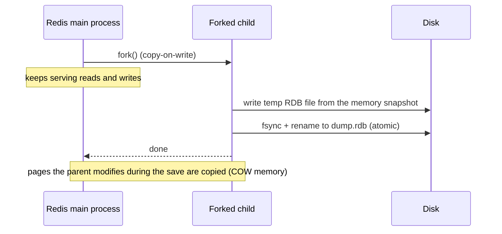
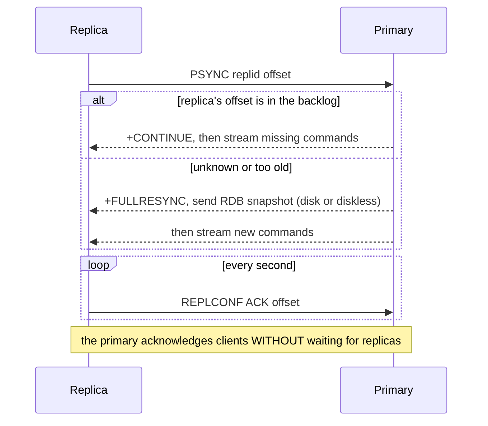
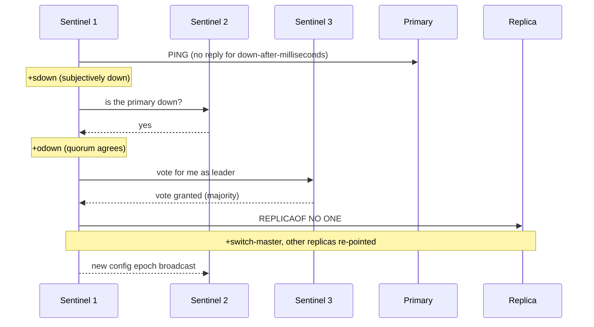
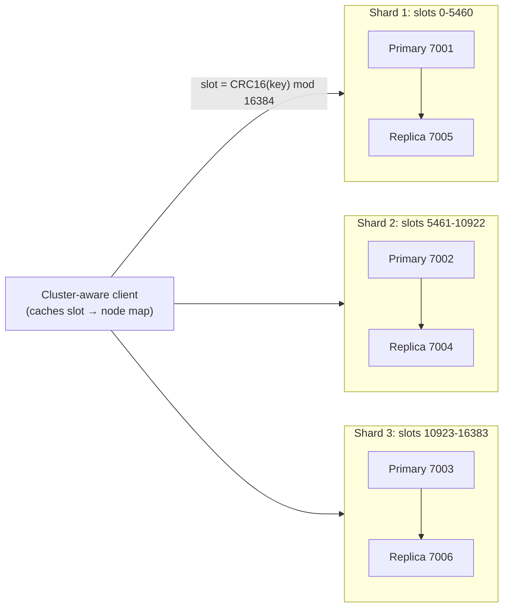

# Persistence (RDB/AOF), Replication, Sentinel & Cluster

!!! abstract "TL;DR"
    - **RDB** = point-in-time snapshots made by a forked child: compact files and fast restarts, but you lose everything since the last snapshot. **AOF** = a log of every write, replayed on restart. Its loss window depends on `appendfsync`: `always` (about 0), `everysec` (about 1 s, the default) or `no` (OS-dependent). Redis 7 uses a hybrid RDB preamble plus an AOF tail, with a multi-part AOF.
    - Measured on one machine: single-client `SET` throughput was **2,879/s** with `appendfsync always` vs **14,055/s** with `everysec`. A 2M-key (352 MB) dataset snapshotted in **4.1 s** (10.6 ms fork) and reloaded in **2.6 s**.
    - **Replication is asynchronous.** A replica can be behind when the primary dies, so acknowledged writes can be lost on failover. `WAIT` and `min-replicas-to-write` narrow the window (measured: writes were rejected with `NOREPLICAS` once the replica lagged), but they don't make Redis strongly consistent.
    - **Sentinel** monitors a primary, agrees it's down (quorum), elects a leader and promotes a replica. Clients ask Sentinel for the current primary. Measured failover: **about 3.4 s** with `down-after-milliseconds 2000`.
    - **Cluster** shards keys over **16,384 slots** (CRC16 mod 16384), with replicas per shard and built-in failover (about 3 s with `cluster-node-timeout 2000`). Clients follow `MOVED`/`ASK` redirects. Multi-key operations need keys in one slot (hash tags `{…}`), otherwise you get a `CROSSSLOT` error.

## Why it matters

Redis started life as a cache, but teams now use it for sessions, rate limits, queues and leaderboards, where losing data or being unavailable matters. Interviewers ask: "If Redis restarts, what do you lose?", "How does Redis fail over?", "Sentinel vs Cluster?", "Can Redis lose acknowledged writes?" Being precise about asynchronous replication and fsync policies separates people who've read the docs from people who've only used `SET`.

All measurements below came from Redis 7.0.15 instances, Sentinels and a 6-node cluster run locally while writing this page. Absolute numbers depend on disk and CPU, so the ratios are what matter.

## Core concepts

### RDB snapshots


*Notice that the fork is the only part that blocks the main thread. The snapshot reflects memory at that instant, and writes during the save cost extra memory through copy-on-write.*

- Triggered by `save <seconds> <changes>` rules, `BGSAVE`, replication full syncs and shutdown.
- **Measured:** 2M keys (352 MB in memory) → a 70 MB RDB file in **4.1 s**. The fork took **10.6 ms**, and the copy-on-write overhead was about 1 MB because nothing was writing. Reload on restart took **2.6 s**.
- Fork time grows with memory size (page tables), typically about 10–20 ms per GB on Linux, much more on some VMs. Disable transparent huge pages, which make copy-on-write copy 2 MB pages.
- **Loss window:** everything since the last successful snapshot, often minutes.

### AOF (append-only file)

Every write command is appended to the AOF buffer. The `appendfsync` setting decides when the file is fsynced:

| `appendfsync` | Durability | Single-client `SET`/s (measured) | 50 clients `SET`/s (measured) |
|---|---|---|---|
| `always` | fsync on every write batch: about 0 loss | **2,879** (p50 0.31 ms) | 43,197 |
| `everysec` (default) | up to ~1 s lost on power failure | **14,055** (p50 0.06 ms) | 91,575 |
| `no` | OS decides (often ~30 s) | 14,588 | 72,150 |

With many clients, `always` recovers some throughput because writes from many clients are fsynced together (group commit). The AOF grows forever, so Redis **rewrites** it in the background (`BGREWRITEAOF`, automatic via `auto-aof-rewrite-percentage`). Since 7.0 the AOF is **multi-part** (a base file plus incremental files, tracked by a manifest), and with `aof-use-rdb-preamble yes` (the default) the base is in RDB format, so restarts load fast and replay only the tail.

### Choosing persistence

| Setup | Restart behaviour | Use for |
|---|---|---|
| None (`save ""`, `appendonly no`) | Starts empty | Pure cache that can be rebuilt |
| RDB only | Loses minutes | Caches you'd like warm after a restart, backups |
| AOF `everysec` (+ RDB preamble) | Loses ≤ ~1 s | Sessions, rate limits, queues |
| AOF `always` | Loses ~nothing on that node | Rarely: throughput cost; prefer a real database |

Persistence protects against **restarts on the same node**. It doesn't protect against losing the node, which is what replication is for. Many production setups disable persistence on the primary for latency and enable it on a replica, with care: a primary restarting with an empty dataset and auto-restart enabled will replicate the **empty** dataset to its replicas.

### Replication


*Notice the last note. Replication is asynchronous, so a client's write is acknowledged before any replica has it. That's the source of possible data loss on failover.*

- Replicas are read-only by default and can serve reads (eventually consistent, possibly stale).
- The **replication backlog** (`repl-backlog-size`) lets a briefly disconnected replica resume with a partial sync. Too small, and every blip causes a full resync (a fork, an RDB transfer and load spikes). Size it for write rate × expected disconnect time.
- **`WAIT numreplicas timeout`** blocks the client until N replicas have acknowledged its writes. It improves durability for specific writes but isn't a transaction: on timeout the write is still applied on the primary.
- **`min-replicas-to-write N` + `min-replicas-max-lag S`**: the primary refuses writes if fewer than N replicas acknowledged within S seconds. Measured: with the only replica paused for more than 2 s, `SET` returned `NOREPLICAS Not enough good replicas to write`. After it resumed, writes succeeded again. This caps how much a partitioned primary can accept and later lose.

### Sentinel: automatic failover


*Notice the two thresholds: the `quorum` decides that the primary is down, but a **majority** of Sentinels must vote to authorise the failover. That's why you need at least three Sentinels on independent machines.*

Measured with three Sentinels, quorum 2 and `down-after-milliseconds 2000`, after freezing the primary: `+sdown` → `+odown (quorum 2/2)` → `+elected-leader` → `+selected-slave` → `+switch-master` in **about 3.4 s**. When the old primary came back, Sentinel reconfigured it as a replica of the new one.

Clients connect to Sentinel first (`SENTINEL get-master-addr-by-name mymaster`) and reconnect when Sentinel publishes `+switch-master`. Lettuce, Jedis and Spring Boot (`spring.data.redis.sentinel.master` / `nodes`) do this for you.

### Redis Cluster: sharding + HA


*Notice that every key belongs to exactly one slot and every slot to one primary. Scaling out means moving slots between nodes, and each shard fails over independently.*

Measured on a local 6-node cluster (3 primaries + 3 replicas):

| Action | Result |
|---|---|
| `CLUSTER KEYSLOT user:42` / `user:43` | 15880 / 11817 (different shards) |
| `CLUSTER KEYSLOT {user:42}:cart` / `{user:42}:profile` | Both **15880** (hash tag) |
| `SET user:43 x` on the wrong node (non-cluster client) | `MOVED 11817 127.0.0.1:7003` |
| Same with `redis-cli -c` (follows redirects) | `OK` |
| `MSET user:42 a user:43 b` | `CROSSSLOT Keys in request don't hash to the same slot` |
| `MSET {user:42}:cart a {user:42}:profile b` | `OK` |
| `kill -9` on the primary for slots 10923–16383 | Replica marked it failing, won the election and became primary about **3 s** later (`cluster-node-timeout 2000`). `cluster_state:ok`, data still readable |

- **`MOVED`**: the slot permanently lives elsewhere, so the client updates its slot map. **`ASK`**: the slot is mid-migration, so try the other node for this request only.
- Nodes gossip over a cluster bus (port + 10000). A primary is marked `FAIL` when a majority of primaries see it unreachable for `cluster-node-timeout`, and then its replicas run an election.
- If a shard loses its primary and all its replicas, by default the whole cluster stops accepting writes (`cluster-require-full-coverage yes`) so it doesn't return partial results silently.
- Only database 0 exists in cluster mode. Pub/Sub messages are broadcast to all nodes (use sharded Pub/Sub, `SPUBLISH`, from 7.0). Lua scripts and transactions must use keys from one slot.

### Sentinel vs Cluster

| | Sentinel | Cluster |
|---|---|---|
| Purpose | HA for **one** dataset | Sharding **and** HA |
| Data size / write throughput | Limited to one primary | Scales across primaries |
| Multi-key ops | Anything | Same slot only (hash tags) |
| Client | Sentinel-aware | Cluster-aware (slot map, redirects) |
| Extra processes | ≥ 3 Sentinels | None (built in) |
| Use when | Data fits on one node, simplicity matters | Data or throughput exceeds one node |

## In practice: code & configuration

### Production-ish redis.conf for a stateful use case

```conf
# Persistence
appendonly yes
appendfsync everysec          # ≤ ~1 s loss, near in-memory throughput
aof-use-rdb-preamble yes      # fast restart
save 3600 1 300 100 60 10000  # also keep RDB snapshots for backups

# Replication safety
repl-backlog-size 256mb       # survive short disconnects with partial resync
min-replicas-to-write 1       # refuse writes if no replica is keeping up...
min-replicas-max-lag 10       # ...within 10 seconds

# Memory and latency
maxmemory 12gb                # headroom on a 16 GB box for fork COW and buffers
```

### Spring Boot client configuration

```yaml
# Sentinel
spring:
  data:
    redis:
      sentinel:
        master: mymaster
        nodes: sentinel-1:26379,sentinel-2:26379,sentinel-3:26379
      lettuce:
        read-from: replica-preferred   # Lettuce 6 / Boot 3: read scaling, eventually consistent
---
# Cluster
spring:
  data:
    redis:
      cluster:
        nodes: redis-0:6379,redis-1:6379,redis-2:6379
        max-redirects: 3
      lettuce:
        cluster:
          refresh:
            adaptive: true             # refresh the slot map on MOVED/ASK and reconnects
            period: 30s
```

=== "❌ Common mistake"

    ```java
    // Assumes a single node: fails in cluster mode with CROSSSLOT
    redis.opsForValue().multiSet(Map.of(
        "cart:42", cartJson,
        "profile:42", profileJson));

    // Treats Redis as the system of record for orders
    redis.opsForHash().putAll("order:" + id, fields);   // async replication, no WAIT
    return ResponseEntity.ok().build();                 // acknowledged, may be lost on failover
    ```

=== "✅ Better"

    ```java
    // Co-locate keys that are used together with a hash tag
    redis.opsForValue().multiSet(Map.of(
        "{user:42}:cart", cartJson,
        "{user:42}:profile", profileJson));

    // Orders go to the database. If Redis must hold critical state, wait for a replica:
    redis.opsForHash().putAll("session:" + id, fields);
    Long acked = redis.execute((RedisCallback<Long>) c ->
        (Long) c.execute("WAIT", "1".getBytes(), "100".getBytes()));
    if (acked == null || acked < 1) log.warn("session {} not yet replicated", id);
    ```

## Real-world usage

- **Amazon ElastiCache / MemoryDB:** ElastiCache runs Redis/Valkey with replicas, Multi-AZ automatic failover (Sentinel-like, managed) and cluster mode. Persistence is limited to snapshots (with AOF unavailable on most modern versions). **MemoryDB** adds a multi-AZ transaction log, so acknowledged writes are durable, which suits Redis as a primary database.
- **Azure Cache for Redis:** Standard (primary/replica), Premium (persistence with RDB/AOF, clustering, geo-replication), and Enterprise tiers with active-active geo-replication (CRDTs).
- **Kubernetes:** the Bitnami Helm charts deploy Sentinel or Cluster topologies on StatefulSets. Operators such as Redis Enterprise or OpsTree handle failover and resharding.
- **Backups:** periodically copy RDB files to object storage (they're consistent snapshots), and test restores.
- Large users (Twitter's timelines, GitHub's job queues historically) ran Redis sharded with replicas, and rebuilt caches from the source of truth rather than relying on Redis durability.

## Trade-offs & production gotchas

!!! warning "Failure modes to know"
    - **Acknowledged writes can be lost:** asynchronous replication + failover = lost tail of writes. Partitions can also create a short-lived split brain where the old primary keeps accepting writes from clients on its side. `min-replicas-to-write` limits this.
    - **Empty primary wipes replicas:** a primary without persistence that restarts automatically comes back empty and replicates emptiness. Disable auto-restart for such nodes, or enable persistence.
    - **Fork latency and memory:** `BGSAVE` and AOF rewrites fork. On large instances that's tens of milliseconds of blocking plus copy-on-write memory. Leave headroom, disable THP, or move persistence to replicas.
    - **Full-resync storms:** a backlog that's too small causes repeated full syncs after network blips, each a fork plus a full transfer.
    - **Cluster multi-key limits:** `MGET`, transactions, Lua and `SUNION` across slots fail with `CROSSSLOT`. Design keys with hash tags up front, without concentrating too much data on one tag.
    - **Stale slot maps:** clients without adaptive topology refresh keep hitting old nodes after a failover or resharding.

- **Durability vs latency:** `appendfsync always` cut single-client throughput by about 5× here. For data that must not be lost, use a database (or MemoryDB), not tuned Redis.
- **Reads from replicas** scale reads but return stale data, the same trade-off as [PostgreSQL replicas](../postgresql-sql/07-partitioning-replication-and-connection-pooling.md).
- **Sentinel quorum placement:** three Sentinels in the same AZ as the primary can't distinguish an AZ failure from a primary failure. Spread them.

## How this connects to my experience

- **Where I used it:** not ★. Redis appears at OptumRx (caching for queries and reference data) and is listed in the skills section. Deployments ran on EKS/AKS. *[confirm: managed (ElastiCache / Azure Cache for Redis) vs self-hosted; cluster mode or primary/replica; whether persistence was enabled]*
- **Talking points:**
    - "For a cache I don't need persistence. I need HA so a node failure doesn't make every request miss at once, which would be an [avalanche](04-cache-stampede-penetration-and-avalanche.md)."
    - "Replication is asynchronous, so I never treat Redis as the system of record for business transactions. Sessions and rate limits can tolerate a second of loss."
    - "In cluster mode I design keys with hash tags for anything used together."
- **Likely follow-up chain:** "What happens to your cache if a Redis node dies?" → "How does failover work?" (Sentinel or managed Multi-AZ) → "Could you lose data?" (async replication) → "Did you use cluster mode?" → "How did keys and multi-key operations work?" (slots, hash tags).

## Interview questions

### Fundamentals

??? question "Q1. Explain RDB vs AOF persistence."
    **Answer:** RDB writes point-in-time snapshots from a forked child process. The files are compact and restarts fast (2M keys reloaded in 2.6 s here), but you lose everything since the last snapshot. AOF logs every write command and replays it on restart. The loss depends on `appendfsync`: `always` about none, `everysec` about 1 s (the default), `no` whatever the OS hasn't flushed. AOF files are larger and get rewritten in the background. Redis 7 combines them: a multi-part AOF whose base is in RDB format plus an incremental command log. Many setups use both: AOF for durability and RDB for backups.

    **Interviewer listens for:** snapshot vs log, loss windows, the fsync options, and the hybrid format.

    **Common wrong answer:** "AOF means Redis never loses data." Not with `everysec`, and not if the node itself is lost.

??? question "Q2. Is Redis replication synchronous or asynchronous? What does that imply?"
    **Answer:** Asynchronous. The primary acknowledges the client, then streams the command to replicas, which report their offsets every second. If the primary fails before a replica receives recent writes, those acknowledged writes are lost when the replica is promoted. `WAIT N timeout` lets a client block until N replicas have its writes, and `min-replicas-to-write`/`min-replicas-max-lag` make the primary refuse writes when replicas fall behind (measured: `NOREPLICAS`). Neither gives strong consistency, because failover can still pick a replica that doesn't have everything.

    **Interviewer listens for:** asynchronous, the loss scenario, and the mitigations with their limits.

    **Common wrong answer:** "Replication guarantees no data loss."

??? question "Q3. What does Redis Sentinel do?"
    **Answer:** Sentinel is a separate process (run at least three) that monitors a primary and its replicas, detects failures, performs automatic failover and acts as a configuration provider for clients. When one Sentinel can't reach the primary for `down-after-milliseconds`, it marks it subjectively down. When `quorum` Sentinels agree, it's objectively down. Then a majority elects a leader Sentinel, which promotes the best replica (by priority, replication offset and run id) and re-points the others. Clients ask Sentinel for the current primary address. Measured failover: about 3.4 s with a 2 s detection threshold.

    **Interviewer listens for:** monitoring, quorum vs majority, promotion, and client discovery.

    **Common wrong answer:** "Sentinel shards the data." That's Cluster.

??? question "Q4. How does Redis Cluster decide which node holds a key?"
    **Answer:** The key is hashed with CRC16, modulo 16,384, to give a slot. Each primary owns a range of slots, and clients cache the slot-to-node map. If a client sends a command to the wrong node, it gets `MOVED <slot> <host:port>` (measured: `MOVED 11817 127.0.0.1:7003`) and updates its map. During resharding a slot can be migrating, and the client gets `ASK` for keys already moved. If a key contains `{…}`, only the part inside the braces is hashed, which is how you co-locate related keys.

    **Interviewer listens for:** CRC16 mod 16384, slot ownership, MOVED/ASK, and hash tags.

    **Common wrong answer:** "Consistent hashing on the full key with virtual nodes." Redis Cluster uses fixed slots.

### Intermediate

??? question "Q5. What's the performance cost of appendfsync always?"
    **Answer:** Each write batch waits for an fsync to disk. Measured on one machine: a single client got 2,879 SET/s with `always` vs 14,055/s with `everysec`, with p50 latency up from 0.06 ms to 0.31 ms. With 50 clients, group commit recovered some of it (43k vs 92k/s). On cloud disks with higher fsync latency the gap is larger. `everysec` is the usual compromise, and if you need zero loss across node failures, you need synchronous replication to durable storage (MemoryDB, or a database) rather than `always` on one node.

    **Interviewer listens for:** fsync per write, measured or estimated magnitude, group commit, and the node-loss caveat.

    **Common wrong answer:** "There's no real difference with SSDs."

??? question "Q6. Why can BGSAVE cause latency spikes?"
    **Answer:** `BGSAVE` (and AOF rewrite, and full syncs for replicas) calls `fork()`. The fork blocks the main thread while page tables are copied, which grows with dataset size (10.6 ms for 352 MB here, much more for tens of GB or on some hypervisors). Afterwards, every page the parent modifies is copied (copy-on-write), raising memory use, and with transparent huge pages enabled each copy is 2 MB. Mitigations: disable THP, leave memory headroom, run persistence on replicas, schedule snapshots off-peak, and monitor `latest_fork_usec`.

    **Interviewer listens for:** fork blocking, copy-on-write memory, THP, and mitigations.

    **Common wrong answer:** "BGSAVE runs in the background, so it has no impact."

??? question "Q7. What happens when a replica disconnects briefly and then reconnects?"
    **Answer:** It sends `PSYNC <replication id> <offset>`. If the primary's replication backlog still contains everything after that offset, the primary replies `+CONTINUE` and streams the missing commands (partial resync). If the backlog was overwritten or the replication id changed, it's a full resync: the primary forks, produces an RDB (to disk or diskless over the socket), sends it, and the replica flushes and loads it. Full syncs are expensive, so size `repl-backlog-size` for write rate × the longest disconnect you want to tolerate. Since Redis 4, replicas promoted by failover keep the replication history (PSYNC2), so other replicas can partially resync with the new primary.

    **Interviewer listens for:** PSYNC, backlog, partial vs full, cost, and sizing.

    **Common wrong answer:** "The replica always copies everything again."

??? question "Q8. Why does MSET with two keys fail in Redis Cluster, and how do you fix it?"
    **Answer:** Multi-key commands require all keys to be in the same hash slot, because a single node must execute them atomically. `user:42` and `user:43` hash to slots 15880 and 11817 on different nodes, so you get `CROSSSLOT`. Fix: give related keys the same hash tag (`{user:42}:cart`, `{user:42}:profile` → both slot 15880, `MSET` OK), or issue separate commands, for example pipelined per node, which clients like Lettuce do for `MGET` across slots, without atomicity. Don't put everything under one tag, or one node becomes hot.

    **Interviewer listens for:** slot requirement, hash tags, non-atomic alternatives, and hot-slot risk.

    **Common wrong answer:** "Use a transaction." It has the same restriction.

??? question "Q9. Sentinel or Cluster: how do you choose?"
    **Answer:** Sentinel gives HA for one dataset that fits on one primary: simple, every command works, and the only extra is three or more Sentinel processes and Sentinel-aware clients. Cluster shards across several primaries when data size or write throughput exceeds one node, with built-in failover per shard. The cost is cluster-aware clients, same-slot restrictions on multi-key operations, transactions and Lua, database 0 only, and more operational complexity (resharding). Start with primary/replica + Sentinel (or managed Multi-AZ), and move to Cluster when one node isn't enough.

    **Interviewer listens for:** HA vs sharding, the constraints, and a sensible default.

    **Common wrong answer:** "Cluster is always better because it's newer."

### Senior

??? question "Q10. Describe how acknowledged writes can be lost in a Redis Sentinel setup during a network partition."
    **Answer:** The primary ends up on the minority side of a partition with some clients. The Sentinels on the majority side mark it objectively down and promote a replica. For a while the old primary still accepts writes from clients that can reach it. When the partition heals, Sentinel turns the old primary into a replica of the new one, and it discards the writes it accepted in isolation. Separately, any writes the old primary acknowledged but hadn't yet replicated before failing are lost. `min-replicas-to-write 1` with `min-replicas-max-lag 10` makes the isolated primary stop accepting writes after about 10 s, bounding the loss window, at the cost of availability when replicas are down. Redis with Sentinel is AP-leaning, not linearizable.

    **Interviewer listens for:** split brain, discarded writes on rejoin, unreplicated tail, and the bounded mitigation.

    **Common wrong answer:** "Sentinel prevents split brain completely."

??? question "Q11. You need Redis to hold user sessions for a high-traffic app across two AZs. Design it."
    **Answer:** Use a primary with a replica in another AZ, plus three Sentinels across three AZs (or managed ElastiCache/Azure with Multi-AZ automatic failover). AOF `everysec` on at least one node so a restart doesn't drop all sessions, with a session TTL on every key. Sentinel-aware Spring Session / Lettuce clients with short timeouts and reconnection. Size memory for sessions × average size with headroom for forks. Accept that up to about a second of session updates can be lost on failover, which means a re-login at worst. Use `min-replicas-to-write` to limit split-brain writes. If data grows beyond one node, use cluster mode with session keys hashed naturally by session id. Monitor replication lag, failovers and memory.

    **Interviewer listens for:** cross-AZ placement, Sentinel quorum placement, persistence choice, TTLs, client behaviour, and explicit loss tolerance.

    **Common wrong answer:** a single Redis node with AOF `always`.

??? question "Q12. How does Redis Cluster fail over a primary?"
    **Answer:** Nodes ping each other over the cluster bus. If a primary doesn't respond within `cluster-node-timeout`, other nodes flag it `PFAIL`, and when a majority of primaries report it, it's marked `FAIL` and the failure is broadcast. Its replicas then start an election, delayed by rank (the replica with the most data goes first, measured: "election delayed 753 ms, rank #0"), and ask the primaries for votes. The winner gets a new config epoch, takes over the slots and announces it. Measured: about 3 s with a 2-second timeout, after which `cluster_state:ok` and the data was readable. If no replica exists, the slots become unavailable, and with `cluster-require-full-coverage yes` the cluster stops serving writes.

    **Interviewer listens for:** gossip, PFAIL → FAIL, the replica election with rank, epochs, and full-coverage behaviour.

    **Common wrong answer:** "Sentinels handle failover in cluster mode." Cluster doesn't use Sentinel.

### Scenario-based

??? question "Q13. After a Redis primary restarted, all the session data on its replicas disappeared too. What happened?"
    **Answer:** The primary ran without persistence (or with a missing or corrupt RDB/AOF) and was restarted automatically by a supervisor or Kubernetes. It came back empty, the replicas reconnected, saw a new replication id, did a full resync and loaded the empty dataset, wiping their copies. Sentinel didn't intervene because the primary was back before `down-after-milliseconds`. Prevent it: enable persistence on the primary, or disable automatic restart of a persistence-less primary so Sentinel fails over to a replica instead, and back up RDB files off-box. Kubernetes operators handle this by restarting the pod as a replica.

    **Interviewer listens for:** the empty-primary resync mechanism and concrete prevention.

    **Common wrong answer:** "Redis must have a bug."

??? question "Q14. Your application gets intermittent MOVED errors and timeouts after an ElastiCache cluster scaled out. What's wrong?"
    **Answer:** Scaling out moved slots to new shards. Clients with a stale slot map keep sending commands to old nodes, getting `MOVED`/`ASK` redirects, and if the client doesn't follow them or refresh its topology, errors and timeouts appear. Check that the client is cluster-aware (Lettuce `RedisClusterClient`, Spring `spring.data.redis.cluster.nodes`), that adaptive topology refresh is enabled (refresh on MOVED/ASK and reconnects, plus periodic refresh), that `max-redirects` is enough, and that you connect through the cluster configuration endpoint rather than a single node's address. Also look for hot slots or large keys that slowed migration.

    **Interviewer listens for:** slot migration, stale topology, client configuration, and the configuration endpoint.

    **Common wrong answer:** "ElastiCache is broken. Roll back the scaling."

## Cheat sheet

| Topic | Remember |
|---|---|
| RDB | Fork + snapshot; compact; loses since last save (2M keys: save 4.1 s, fork 10.6 ms, reload 2.6 s) |
| AOF | Command log; `always` (2.9k/s single client) / `everysec` (14k/s, ≤1 s loss, default) / `no` |
| Redis 7 | Multi-part AOF, RDB preamble |
| Restart risk | Empty primary + auto-restart → wipes replicas |
| Replication | Async; PSYNC partial vs full; backlog sizing |
| Safety knobs | `WAIT N ms`; `min-replicas-to-write` + `min-replicas-max-lag` (→ `NOREPLICAS`) |
| Sentinel | ≥ 3; sdown → odown (quorum) → leader (majority) → promote; ~3.4 s here |
| Cluster | 16,384 slots, CRC16; MOVED / ASK; `{tag}`; CROSSSLOT; DB 0 only; failover ~3 s here |
| Choose | One node enough → replica + Sentinel / Multi-AZ; bigger → Cluster |
| Managed | ElastiCache (snapshots, Multi-AZ), MemoryDB (durable log), Azure Premium/Enterprise |

## Sources
1. [Redis docs: Persistence (RDB, AOF, multi-part AOF)](https://redis.io/docs/latest/operate/oss_and_stack/management/persistence/).
2. [Redis docs: Replication](https://redis.io/docs/latest/operate/oss_and_stack/management/replication/) and [WAIT](https://redis.io/docs/latest/commands/wait/).
3. [Redis docs: High availability with Sentinel](https://redis.io/docs/latest/operate/oss_and_stack/management/sentinel/).
4. [Redis docs: Scaling with Redis Cluster](https://redis.io/docs/latest/operate/oss_and_stack/management/scaling/) and [Cluster specification](https://redis.io/docs/latest/operate/oss_and_stack/reference/cluster-spec/).
5. [Redis docs: Latency diagnosis (fork, THP)](https://redis.io/docs/latest/operate/oss_and_stack/management/optimization/latency/).
6. [Amazon ElastiCache: Replication and Multi-AZ](https://docs.aws.amazon.com/AmazonElastiCache/latest/dg/AutoFailover.html) and [Amazon MemoryDB durability](https://docs.aws.amazon.com/memorydb/latest/devguide/what-is-memorydb.html).
7. [Spring Boot: Redis Sentinel and Cluster properties](https://docs.spring.io/spring-boot/appendix/application-properties/index.html#appendix.application-properties.data) and [Lettuce: Redis Cluster topology refresh](https://redis.github.io/lettuce/ha-sharding/).
8. Demonstrations on this page: Redis 7.0.15 locally (redis-benchmark per fsync policy, 2M-key BGSAVE and reload, three-Sentinel failover, `min-replicas-to-write`, a 6-node cluster with MOVED/CROSSSLOT/hash tags and replica promotion), run while writing this page.
