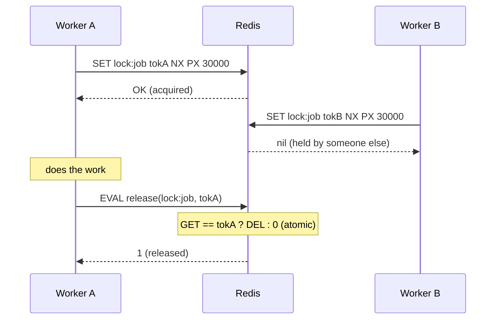
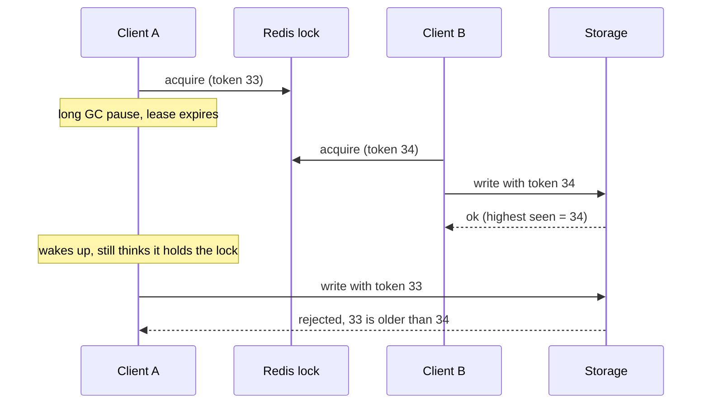
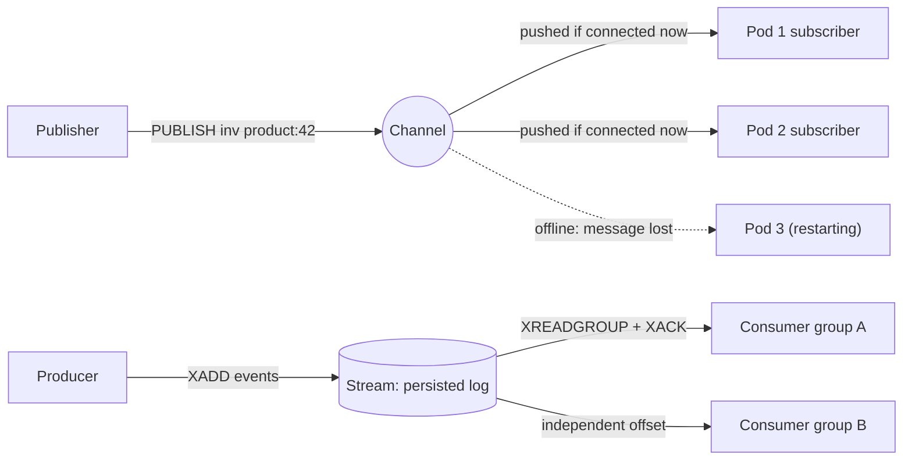

# Distributed Locks, Rate Limiting & Pub/Sub with Redis

!!! abstract "Key takeaways"
    - **Lock** = `SET lock:x <random token> NX PX <ttl>`. **Release** with a Lua compare-and-delete so you only delete your own lock. Measured: a naive `DEL` after the lock had expired deleted the *next* holder's lock, and a third client acquired it while the second was still working.
    - A lock with a TTL is a **lease**: GC pauses or slow I/O can outlive it, leaving two holders. For correctness, pass a **fencing token** (an increasing number from `INCR`) to the protected resource and reject stale tokens (measured: the paused holder's write with token 1 was rejected after token 2 wrote). Redlock (multi-node) doesn't remove this problem. Use locks for **efficiency** (avoid duplicate work) unless the resource checks tokens.
    - **Rate limiting** must be atomic (Lua or single commands). A **fixed window** allowed **20** requests in 90 ms across a window boundary with a limit of 10/s. A **sliding log** and a **token bucket** allowed 10. A token bucket (capacity 10, refill 10/s) allowed 59 of 200 requests over 5 s: the burst plus the refill.
    - **Pub/Sub** is fire-and-forget: `PUBLISH` with no subscribers returned 0 and the message was gone. **Streams** keep messages and support consumer groups. **Keyspace notifications** can signal expiries (an expired event arrived about 0.18 s after a 100 ms TTL), but they're Pub/Sub too, so they aren't reliable.
    - In Spring: Redisson `RLock` (watchdog renewal), Spring Integration `RedisLockRegistry`, **ShedLock** for scheduled jobs, Bucket4j or Resilience4j for rate limits, and `RedisMessageListenerContainer` for Pub/Sub.

## Why it matters

Once Redis is in the stack, teams use it to coordinate services: "only one pod runs this job", "max 100 requests per minute per client", "tell every pod to clear its local cache". These are distributed-systems problems wearing a simple API, and interviewers know where they break: lock expiry under pauses, non-atomic check-then-set, boundary bursts in rate limits and lost messages. Senior candidates are expected to say when a Redis lock is **not** good enough.

All behaviours below were reproduced against Redis 7.0.15 from Python while writing this page.

## Core concepts

### A correct single-instance lock


*Notice the three requirements: acquire and expire in one atomic command (`NX PX`), a unique token per holder, and a release that checks the token atomically.*

```lua
-- release.lua: delete only if we still own the lock
if redis.call('GET', KEYS[1]) == ARGV[1] then
  return redis.call('DEL', KEYS[1])
else
  return 0
end
```

Why each part matters (measured):

| Mistake | What happened |
|---|---|
| `SETNX` then a separate `EXPIRE` | A crash between the two leaves a lock that never expires |
| Release with plain `DEL` | A's lock expired after 300 ms, and B acquired it. A then ran `DEL` and removed **B's** lock, so C acquired it while B was still working |
| Token-checked Lua release | A's release returned 0, and the lock stayed with B |
| No lock around a read-modify-write | 10 threads × 200 increments via `GET`/`SET` → **360** instead of 2,000 |
| With the lock | **2,000**, but about 10× slower (13.7 s vs 1.3 s, mostly polling) |

The last two rows are also a lesson: for a counter, use `INCR`, which is atomic without any lock. Reach for a lock only when the critical section spans several systems.

### Locks are leases: the pause problem and fencing tokens


*Notice that the lock alone can't stop A. Only the resource can, by remembering the highest token it has accepted. This is Martin Kleppmann's fencing-token argument.*

Measured: A acquired with fence 1 and paused past the TTL. B acquired with fence 2 and wrote. A's late write with fence 1 was **rejected**. Get the fence from `INCR fence:<resource>` at acquisition. The resource can be a database row with a `last_fence` column (`UPDATE … WHERE last_fence < :fence`), which is optimistic concurrency.

**Renewal (watchdog):** Redisson extends the lease every `lockWatchdogTimeout / 3` (default 30 s / 3 = 10 s) while the holder's JVM is alive. That shortens the window but doesn't close it: a long GC pause also stops the watchdog thread.

### Redlock

Redlock acquires the same lock on N (typically 5) independent Redis primaries and considers it held if a majority granted it within a time budget. It survives the loss of single nodes, which a single primary with async replication doesn't (failover can lose a lock that hadn't replicated). Kleppmann's critique: it still depends on bounded pauses and clock behaviour, and it provides no fencing token, so it's not safe for correctness-critical mutual exclusion. Antirez's response argues it's fine under its stated assumptions. A balanced interview answer:

- **Efficiency locks** (avoid doing the same work twice; the occasional duplicate is harmless): a single Redis instance with `SET NX PX` is enough.
- **Correctness locks** (a duplicate corrupts data or double-charges): use a system with consensus and fencing, such as ZooKeeper, etcd or a database row lock or unique constraint, or make the operation idempotent so duplicates don't matter.

### Rate limiting algorithms

| Algorithm | Redis implementation | Behaviour | Memory per client |
|---|---|---|---|
| Fixed window | `INCR rl:{user}:{window}` + `EXPIRE` | Simple. Allows up to **2× the limit** across a boundary | 1 counter |
| Sliding log | Sorted set of timestamps; trim + `ZCARD` + `ZADD` in Lua | Exact | One entry per request |
| Sliding window counter | Current + previous window counters, weighted | Close approximation, cheap | 2 counters |
| Token bucket | Hash `{tokens, ts}`; refill on access in Lua | Allows bursts up to capacity, smooth average rate | 2 fields |
| GCRA (generic cell rate) | One timestamp ("theoretical arrival time") | Token-bucket behaviour in one value (redis-cell, Bucket4j) | 1 value |

Measured with a limit of 10 per second and 40 requests bunched into 90 ms around a window boundary (20 just before, 20 just after):

| Algorithm | Allowed |
|---|---|
| Fixed window | **20** (10 in each window) |
| Sliding log | 10 |
| Token bucket (capacity 10, refill 10/s) | 10 |

And 200 requests at 40 per second over 5 s through the token bucket: **59 allowed** (the initial 10 plus about 49 refilled tokens).

### Pub/Sub, Streams and keyspace notifications


*Notice that Pub/Sub keeps nothing: delivery happens only to subscribers connected at that moment. A stream stores entries, and each consumer group tracks its own position and pending acknowledgements.*

| | Pub/Sub | Streams | Keyspace notifications |
|---|---|---|---|
| Persistence | None (measured: `PUBLISH` → 0 receivers, message gone) | Yes (retained until trimmed) | None (Pub/Sub underneath) |
| Delivery | At most once, to connected subscribers | At least once with consumer groups | At most once |
| Replay | No | Yes (by id) | No |
| Fan-out | All subscribers | One group = competing consumers; many groups = fan-out | All subscribers |
| Typical use | Cache-invalidation broadcast, live notifications | Work queues, event logs | React to expiry or changes (best effort) |

Keyspace notifications are off by default (`notify-keyspace-events ""`). With `Ex`, an expiry event for a 100 ms key arrived after about **0.18 s** in my test. Events fire when Redis actually deletes the key (lazily or in the active cycle), not exactly at the TTL, so don't build exact timers on them. Use a sorted set of due times polled by workers instead.

In Redis Cluster, classic Pub/Sub messages are broadcast to every node. Redis 7 **sharded Pub/Sub** (`SPUBLISH`/`SSUBSCRIBE`) routes by channel slot instead.

## In practice: code & configuration

### Locks in Spring

=== "❌ Common mistake"

    ```java
    public void runNightlyBilling() {
        Boolean ok = redis.opsForValue().setIfAbsent("lock:billing", "1");   // no TTL
        if (Boolean.TRUE.equals(ok)) {
            redis.expire("lock:billing", Duration.ofMinutes(10));           // separate command
            try { billing.run(); }                                           // may take 20 min
            finally { redis.delete("lock:billing"); }                       // may delete another holder's lock
        }
    }
    ```

=== "✅ Better"

    ```java
    private static final RedisScript<Long> RELEASE = RedisScript.of("""
        if redis.call('GET', KEYS[1]) == ARGV[1] then return redis.call('DEL', KEYS[1]) else return 0 end
        """, Long.class);

    public void runNightlyBilling() {
        String token = UUID.randomUUID().toString();
        Boolean ok = redis.opsForValue()
            .setIfAbsent("lock:billing", token, Duration.ofMinutes(30));    // SET NX PX, atomic
        if (!Boolean.TRUE.equals(ok)) return;                               // someone else runs it
        long fence = redis.opsForValue().increment("fence:billing");        // monotonic token
        try {
            billing.run(fence);    // writes include the fence: UPDATE ... WHERE last_fence < :fence
        } finally {
            redis.execute(RELEASE, List.of("lock:billing"), token);         // only our own lock
        }
    }
    ```

Libraries that do this well:

```java
// Redisson: reentrant lock with watchdog renewal
RLock lock = redisson.getLock("lock:report:" + reportId);
if (lock.tryLock(0, TimeUnit.SECONDS)) {          // no leaseTime → watchdog renews every 10 s
    try { generate(reportId); } finally { lock.unlock(); }
}

// ShedLock: at most one instance runs a scheduled job
@Scheduled(cron = "0 0 2 * * *")
@SchedulerLock(name = "nightlyBilling", lockAtMostFor = "PT30M", lockAtLeastFor = "PT1M")
public void nightlyBilling() { ... }
```

`lockAtLeastFor` stops a fast job from running again on another pod whose clock is slightly behind. `lockAtMostFor` is the safety TTL if the pod dies.

### Token bucket as an atomic Lua script

```lua
-- KEYS[1] = bucket key; ARGV = capacity, refill per second, now (ms)
local cap, rate, now = tonumber(ARGV[1]), tonumber(ARGV[2]), tonumber(ARGV[3])
local s = redis.call('HMGET', KEYS[1], 'tokens', 'ts')
local tokens = tonumber(s[1]) or cap
local ts = tonumber(s[2]) or now
tokens = math.min(cap, tokens + (now - ts) * rate / 1000)   -- refill since last call
local allowed = 0
if tokens >= 1 then tokens = tokens - 1; allowed = 1 end
redis.call('HSET', KEYS[1], 'tokens', tokens, 'ts', now)
redis.call('PEXPIRE', KEYS[1], math.ceil(cap / rate * 1000) + 1000)  -- idle buckets disappear
return allowed
```

```java
@Component
class RedisRateLimiter {
    private final StringRedisTemplate redis;
    private final RedisScript<Long> script = RedisScript.of(new ClassPathResource("token_bucket.lua"), Long.class);
    RedisRateLimiter(StringRedisTemplate redis) { this.redis = redis; }

    boolean tryAcquire(String clientId, int capacity, int perSecond) {
        Long ok = redis.execute(script, List.of("rl:tb:{" + clientId + "}"),
                String.valueOf(capacity), String.valueOf(perSecond),
                String.valueOf(System.currentTimeMillis()));     // or redis TIME for a single clock
        return ok != null && ok == 1;
    }
}
```

Return `429 Too Many Requests` with `Retry-After` (and optionally `RateLimit-*` headers) when it's denied, as on the [API security page](../api-design/06-api-security-and-rate-limiting.md). Decide what happens when Redis is unavailable: fail open (allow, logging it) for availability, or fail closed for abuse-sensitive endpoints. Bucket4j's Redis integrations (Lettuce, Redisson) implement the same ideas with compare-and-swap.

### Pub/Sub for cache invalidation in Spring

```java
@Configuration
class InvalidationConfig {
    @Bean
    RedisMessageListenerContainer container(RedisConnectionFactory cf, LocalCacheInvalidator inv) {
        var c = new RedisMessageListenerContainer();
        c.setConnectionFactory(cf);
        c.addMessageListener((message, pattern) -> inv.evict(new String(message.getBody())),
                new ChannelTopic("cache:invalidate"));
        return c;
    }
}

// Publisher, after commit:
redis.convertAndSend("cache:invalidate", "product:42");
```

Because Pub/Sub can drop messages (a pod reconnecting, a slow subscriber disconnected by `client-output-buffer-limit pubsub`), keep a short TTL on local caches and clear them entirely after a reconnect.

## Real-world usage

- **Scheduled jobs in Kubernetes:** ShedLock with a Redis or JDBC provider so a `@Scheduled` job runs on one pod, not on every replica.
- **API gateways:** Spring Cloud Gateway's `RedisRateLimiter` is a token bucket in Lua (`replenishRate`, `burstCapacity`). Kong, Envoy and many SaaS APIs use Redis-backed limits too.
- **Stripe** described layered rate limiters (request rate, concurrency, fleet-level load shedding) built on token buckets in Redis.
- **GitHub and others** expose `X-RateLimit-Limit/Remaining/Reset` headers backed by counters like these.
- **Cache invalidation fan-out:** Pub/Sub to clear in-process caches on every pod. Redis 6 client-side caching (`CLIENT TRACKING`) automates it.
- **Correctness-critical coordination** (leader election, schedulers in Kubernetes itself) uses etcd or ZooKeeper leases, not Redis.

## Trade-offs & production gotchas

!!! warning "Classic mistakes"
    - **Non-atomic acquire** (`SETNX` + `EXPIRE`) or **untoken'd release** (`DEL`): orphaned locks or deleting someone else's lock.
    - **TTL shorter than the work:** two holders. Use renewal or a generous TTL, and fencing for correctness.
    - **Locks on an evicting cache instance:** under `allkeys-*` eviction the lock key can disappear ([eviction](03-ttl-eviction-policies-and-invalidation-strategies.md)).
    - **Failover loses locks:** async replication means a newly promoted replica may not have the lock, so another client acquires it.
    - **Busy-wait loops:** tight `SET NX` polling hammers Redis. Back off with jitter, or use Redisson, which waits on Pub/Sub notifications.
    - **Non-atomic rate limiting** (`GET` then `INCR` from the app): races allow bursts. Use Lua or `INCR` first and compare after.
    - **Fixed-window boundary bursts:** up to 2× the limit (measured 20 vs 10). Use a sliding window or token bucket where that matters.
    - **Clock skew in limiters:** if each app server passes its own `now`, skewed clocks distort refills. Use Redis `TIME` inside the script (allowed in Redis 5+ with effects replication) or one clock source.
    - **Pub/Sub as a queue:** lost messages on disconnect or restart. Use Streams or Kafka.

- **Hot keys:** a global limiter key (`rl:global`) or a popular lock concentrates traffic on one shard. Shard counters or use local limiters plus a global budget.
- **Per-client cardinality:** millions of clients × sliding logs = lots of memory. Token buckets or GCRA keep it to a few bytes each.

## How this connects to my experience

- **Where I used it:** not ★. Redis at OptumRx (caching) and Kafka-based retry/DLQ processing. Related themes: API security with OAuth2/PingFederate (where rate limiting sits) and microservices on EKS/AKS where scheduled jobs run on many replicas. *[confirm whether you implemented distributed locks, ShedLock, or Redis/gateway rate limiting; if not, say it's transferable knowledge]*
- **Talking points:**
    - "I use a Redis lock to avoid duplicate work, with `SET NX PX` and a token-checked release. If a duplicate would corrupt data, I make the operation idempotent or use fencing tokens or a database constraint."
    - "For scheduled jobs on multiple pods, ShedLock is the simple answer."
    - "For rate limits I prefer a token bucket in Lua: atomic, allows controlled bursts, and a few bytes per client."
- **Likely follow-up chain:** "How do you make sure a job runs on only one pod?" → "How does the Redis lock work?" → "What if the holder pauses past the TTL?" (fencing) → "Is Redlock safe?" → "How would you implement rate limiting across instances?" (algorithms, atomicity) → "How do pods learn to clear their local caches?" (Pub/Sub and its limits).

## Interview questions

### Fundamentals

??? question "Q1. How do you implement a distributed lock with Redis?"
    **Answer:** Acquire with `SET lock:name <random-token> NX PX <ttl>`, a single atomic command that only sets if absent and always sets an expiry. Do the work. Release with a Lua script that deletes the key only if its value equals your token. The token prevents deleting a lock someone else acquired after yours expired (measured: a naive `DEL` let a third client in while the second was working). Choose a TTL longer than the work, or renew it. Use a library (Redisson, Spring Integration `RedisLockRegistry`, ShedLock) rather than hand-rolling it in production.

    **Interviewer listens for:** NX + PX atomicity, a unique token, a compare-and-delete release, and TTL reasoning.

    **Common wrong answer:** `SETNX` followed by `EXPIRE`, then `DEL` to release.

??? question "Q2. What's wrong with SETNX followed by EXPIRE?"
    **Answer:** It's two commands. If the client crashes, or the connection drops, after `SETNX` succeeds but before `EXPIRE` runs, the lock key has no TTL and nobody can ever acquire the lock again without manual intervention. Since Redis 2.6.12, `SET key value NX PX ms` does both atomically, so `SETNX` + `EXPIRE` is obsolete.

    **Interviewer listens for:** the crash window and the atomic alternative.

    **Common wrong answer:** "Wrap them in MULTI." That works, but `SET NX PX` is the idiomatic answer.

??? question "Q3. Compare fixed-window and token-bucket rate limiting."
    **Answer:** A fixed window counts requests per calendar window (`INCR` + `EXPIRE`). It's simple and cheap, but a client can send the full limit at the end of one window and again at the start of the next: measured 20 allowed in 90 ms against a 10/s limit. A token bucket holds up to `capacity` tokens refilled at `rate`. Each request takes one, so it allows controlled bursts and enforces the average rate smoothly (measured: 10 in the same burst, 59 of 200 over 5 s with capacity 10 and 10/s). Sliding logs are exact but store every request. Sliding-window counters approximate cheaply.

    **Interviewer listens for:** the boundary burst, burst vs average, and the memory trade-offs.

    **Common wrong answer:** "They behave the same."

??? question "Q4. Why is Redis Pub/Sub not suitable as a job queue?"
    **Answer:** Pub/Sub keeps no messages. Delivery goes only to subscribers connected at publish time (measured: `PUBLISH` with no subscribers returned 0 and the message vanished). A subscriber that restarts, disconnects or falls behind (and is disconnected by output-buffer limits) misses messages. There are no acknowledgements, retries or replay, and every subscriber gets every message (no competing consumers). For jobs, use Redis Streams with consumer groups (`XREADGROUP`, `XACK`, `XAUTOCLAIM`), a list-based reliable queue, or Kafka/RabbitMQ/SQS.

    **Interviewer listens for:** no persistence, no acks, fan-out semantics, and the right alternatives.

    **Common wrong answer:** "Pub/Sub guarantees delivery as long as Redis is up."

### Intermediate

??? question "Q5. Your lock's TTL is 30 seconds but the job sometimes takes 60. What do you do?"
    **Answer:** Options: renew the lease while working (Redisson's watchdog extends it every 10 s by default while the JVM is alive, or extend manually with a token-checked `PEXPIRE` script); split the job into smaller units, each with its own lock or checkpoint; or set a TTL well above the worst case, accepting slower recovery if the holder dies. Whatever you choose, make the work idempotent or fenced, because a pause can still outlive renewal. For scheduled jobs, ShedLock's `lockAtMostFor` should exceed the worst-case duration.

    **Interviewer listens for:** renewal, a token-checked extend, idempotency or fencing, and the recovery trade-off.

    **Common wrong answer:** "Set the TTL to infinity." Then a crashed holder blocks everyone forever.

??? question "Q6. What is a fencing token, and why do you need one?"
    **Answer:** A number that increases with every lock acquisition (for example `INCR fence:resource`), passed along with every write to the protected resource. The resource remembers the highest token it has accepted and rejects lower ones. It's needed because a lock with a TTL is a lease: a process paused by GC or a slow network can wake up after its lease expired and another process took over, and both believe they hold the lock. Measured: the paused holder's write with token 1 was rejected after the new holder wrote with token 2. Without fencing, a Redis lock can only promise "usually exclusive".

    **Interviewer listens for:** the lease and pause problem, monotonic tokens, and enforcement at the resource.

    **Common wrong answer:** "Use a longer TTL so it never happens."

??? question "Q7. Why must rate limiting logic run atomically in Redis?"
    **Answer:** Rate limiting is read-decide-write. If the app does `GET count`, compares, then `INCR`, concurrent requests all read the same value and all pass, allowing bursts beyond the limit. Use single atomic commands (`INCR` first, then compare the returned value) or a Lua script that refills, checks and decrements in one step, because Redis executes a script without interleaving. In cluster mode, all of a script's keys must be in one slot (a hash tag on the client id).

    **Interviewer listens for:** the race, INCR-then-compare or Lua, and the cluster slot constraint.

    **Common wrong answer:** "Use a Java synchronized block." That's only per JVM.

??? question "Q8. How do you ensure a @Scheduled job runs on only one of ten pods?"
    **Answer:** ShedLock: annotate with `@SchedulerLock(name, lockAtMostFor, lockAtLeastFor)` and configure a lock provider (Redis, JDBC, Mongo). The first pod to acquire the named lock runs the job, and the others skip it. `lockAtMostFor` is the safety expiry if a pod dies, and `lockAtLeastFor` prevents a quick re-run by another pod with a skewed clock. Alternatives: a Kubernetes CronJob (one pod per schedule), leader election (Spring Cloud Kubernetes, a Kubernetes Lease), or Quartz in clustered JDBC mode. And make the job idempotent anyway.

    **Interviewer listens for:** ShedLock semantics, the two durations, alternatives, and idempotency.

    **Common wrong answer:** "Run the scheduler on only one replica." That's a single point of failure and breaks autoscaling.

??? question "Q9. Can you rely on keyspace expiry notifications to trigger actions at a precise time?"
    **Answer:** No. Expired events fire when Redis actually removes the key, either on access (lazy expiry) or when the active-expiry cycle samples it, so they can arrive after the TTL (about 0.18 s late for a 100 ms key in my test, potentially much later under load). They're delivered over Pub/Sub, so they're lost if the subscriber is disconnected. In a cluster, each node only emits events for its own keys. For delayed jobs, use a sorted set scored by due time that workers poll (`ZRANGEBYSCORE … LIMIT`, then claim atomically), or a real scheduler or queue with delays.

    **Interviewer listens for:** lazy/active expiry timing, Pub/Sub unreliability, and the sorted-set alternative.

    **Common wrong answer:** "Yes, Redis fires the event exactly at expiry."

### Senior

??? question "Q10. Is Redlock safe? When would you use it?"
    **Answer:** Redlock acquires a lock on a majority of N independent Redis primaries within a validity time, so it tolerates individual node failures, which a single primary with async replication doesn't (a failover can lose an unreplicated lock). Kleppmann argued it's unsafe for correctness because it relies on bounded process pauses, network delays and well-behaved clocks, and it provides no fencing token, so a paused client can still act after its lock expired. Antirez countered that the assumptions are reasonable. In practice: for efficiency (avoiding duplicate work), a single Redis lock is usually enough and Redlock adds little. For correctness, use consensus-based coordination with fencing (etcd or ZooKeeper leases, database constraints) or design idempotent operations.

    **Interviewer listens for:** how Redlock works, the critique, and the efficiency vs correctness framing.

    **Common wrong answer:** "Redlock makes Redis locks 100% safe."

??? question "Q11. Design rate limiting for a public API with per-client limits, burst tolerance and multiple gateway instances."
    **Answer:** A token bucket per client in Redis, implemented as one Lua script per request (refill from elapsed time, take a token, store tokens and timestamp, set an idle TTL), keyed by API key or OAuth client id with a hash tag for cluster slots. Capacity sets the allowed burst and the refill rate sets the sustained limit, tiered per plan. Use Redis `TIME` or a consistent clock. Return 429 with `Retry-After` and rate-limit headers. Add a cheap local pre-limiter per instance to absorb abusive floods before they reach Redis, plus a global concurrency limit and load shedding. Decide the policy when Redis is unavailable (fail open with local limits). Monitor rejections per client and the Redis latency of the script.

    **Interviewer listens for:** the algorithm choice, atomicity, keying, clock handling, layered defence, and failure policy.

    **Common wrong answer:** an in-memory counter per gateway instance, which multiplies the limit by the number of instances.

??? question "Q12. How would you broadcast cache invalidations to 50 pods reliably?"
    **Answer:** Redis Pub/Sub is the easy path: each pod subscribes and evicts its local entry on a message. But it's at-most-once, so pods that are disconnected or restarting miss messages. Mitigate with a short local TTL as a backstop and a full local clear after any reconnect. For stronger guarantees, use a Redis Stream or Kafka topic where each pod reads with its own consumer (all pods see all events) and tracks its position, or CDC-driven invalidation. Redis 6 client-side caching (`CLIENT TRACKING`) can push invalidations for keys a client read. Measure invalidation lag and stale reads.

    **Interviewer listens for:** Pub/Sub limits, backstops, durable alternatives, and server-assisted tracking.

    **Common wrong answer:** "Pub/Sub delivers to all pods, so it's reliable."

### Scenario-based

??? question "Q13. A nightly job protected by a Redis lock occasionally runs twice and double-sends emails. Investigate."
    **Answer:** Possible causes: the job takes longer than the lock TTL, so a second pod acquires it (check job duration vs TTL); a GC pause or slow dependency stalled the holder past its lease; a Redis failover lost the lock key because replication is asynchronous; the lock key was evicted (`allkeys-*` policy) or flushed; the release deletes another holder's lock (plain `DEL`); or schedulers on pods with skewed clocks run the job at slightly different times, after the first already finished and released (ShedLock's `lockAtLeastFor` fixes that). Fix the lock (TTL > worst case, renewal, token release, a non-evicting instance), and make sending idempotent: record each sent email id in the database with a unique constraint and skip duplicates. Idempotency is the real fix.

    **Interviewer listens for:** TTL vs duration, pauses, failover, eviction, release bugs, clock skew, and idempotency as the final guard.

    **Common wrong answer:** "Increase the TTL" alone.

??? question "Q14. After adding a fixed-window rate limiter of 100 requests per minute, a partner complains they're throttled even though they average 60 per minute, while another client bursts 200 in a few seconds. Explain and fix."
    **Answer:** A fixed window counts per calendar minute. The partner's traffic is bursty within minutes (for example 120 in the first 20 seconds, then quiet), so they hit 100 early and get throttled despite a low average. Meanwhile the abusive client sends 100 at 0:59 and 100 at 1:00, which is 200 in seconds and allowed because it spans two windows (I measured the same 2× effect). Switch to a token bucket: capacity set to an acceptable burst (say 100), refilled at 100 per minute (about 1.67/s), so averages are respected, bursts are bounded, and window boundaries don't matter. Or use a sliding-window counter. Communicate the limits through headers.

    **Interviewer listens for:** diagnosing both symptoms from the fixed-window semantics, the token-bucket fix, and communication.

    **Common wrong answer:** "Raise the limit for the partner."

## Cheat sheet

| Topic | Remember |
|---|---|
| Acquire | `SET lock:x <token> NX PX <ttl>` (atomic) |
| Release | Lua: `GET == token ? DEL : 0` (naive `DEL` let a third client in) |
| Lease problem | Pauses outlive TTLs → fencing token via `INCR` (stale write rejected) |
| Renewal | Redisson watchdog (30 s / 3); doesn't fix pauses |
| Redlock | Majority of N masters; no fencing; efficiency vs correctness |
| Correctness | etcd/ZooKeeper, DB constraints, idempotency |
| Scheduled jobs | ShedLock `lockAtMostFor` / `lockAtLeastFor` |
| Counters | `INCR`, no lock needed (no lock: 360/2000) |
| Fixed window | `INCR` + `EXPIRE`; 2× boundary burst (20 vs 10) |
| Token bucket | Lua hash `{tokens, ts}`; burst = capacity (59/200 over 5 s) |
| Atomicity | One command or one Lua script; same slot in cluster |
| Pub/Sub | Fire-and-forget (0 receivers → lost); `SPUBLISH` sharded (7.0) |
| Streams | Persisted, consumer groups, `XACK`, replay |
| Keyspace events | `notify-keyspace-events Ex`; late (~0.18 s) and lossy |

## Sources
1. [Redis docs: Distributed locks with Redis (single instance, Redlock)](https://redis.io/docs/latest/develop/use/patterns/distributed-locks/) and [SET](https://redis.io/docs/latest/commands/set/).
2. Martin Kleppmann, [How to do distributed locking](https://martin.kleppmann.com/2016/02/08/how-to-do-distributed-locking.html), and antirez, [Is Redlock safe?](http://antirez.com/news/101).
3. [Redisson: Locks and synchronizers (watchdog)](https://redisson.pro/docs/data-and-services/locks-and-synchronizers/) and [ShedLock](https://github.com/lukas-krecan/ShedLock).
4. [Redis docs: Pub/Sub (including sharded Pub/Sub)](https://redis.io/docs/latest/develop/interact/pubsub/), [Streams](https://redis.io/docs/latest/develop/data-types/streams/) and [Keyspace notifications](https://redis.io/docs/latest/develop/use/keyspace/#keyspace-notifications).
5. [Spring Cloud Gateway: RedisRateLimiter](https://docs.spring.io/spring-cloud-gateway/reference/spring-cloud-gateway-server-webflux/gatewayfilter-factories/requestratelimiter-factory.html) and [Bucket4j](https://bucket4j.com/).
6. Stripe Engineering, [Scaling your API with rate limiters](https://stripe.com/blog/rate-limiters).
7. [IETF draft: RateLimit header fields for HTTP](https://datatracker.ietf.org/doc/draft-ietf-httpapi-ratelimit-headers/).
8. Demonstrations on this page: Redis 7.0.15 from Python, run while writing this page (unsafe vs token release, lock contention, fencing, fixed window vs sliding log vs token bucket, Pub/Sub loss, Streams retention, expiry notifications).
