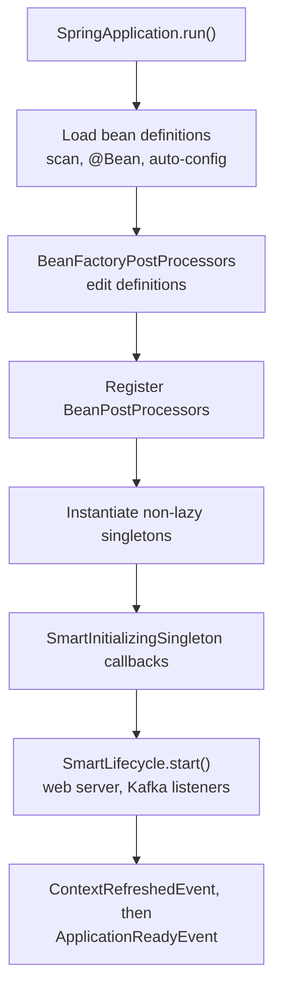
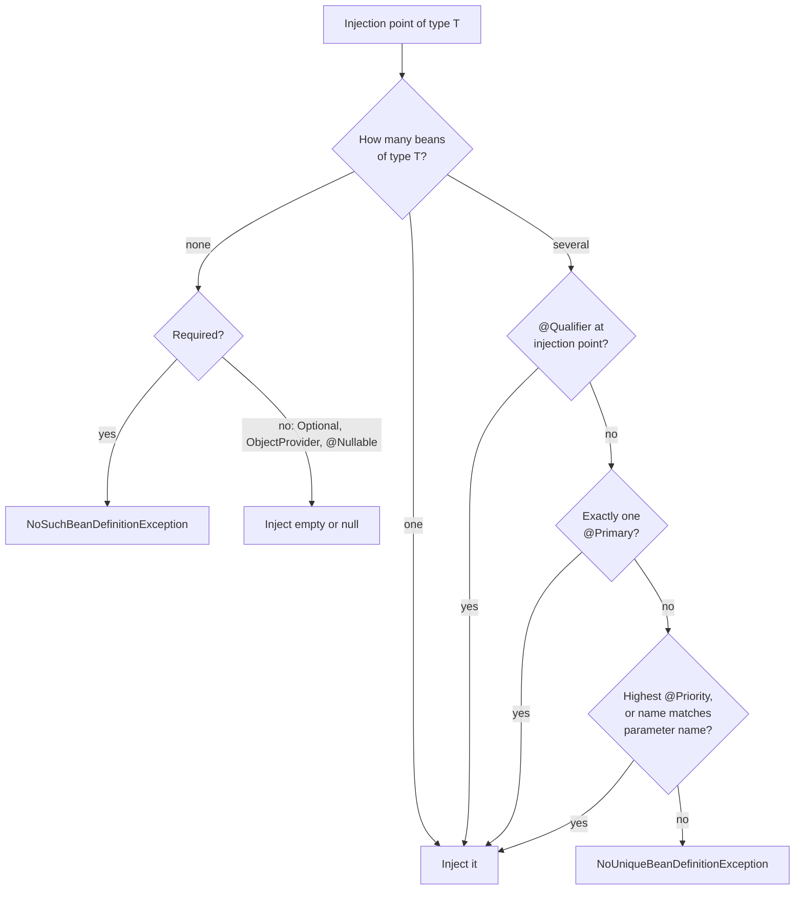
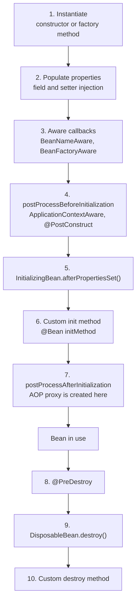
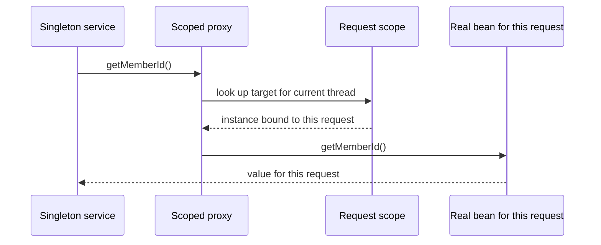

# IoC & Dependency Injection, Bean Scopes & Lifecycle

!!! abstract "Key takeaways"
    - **IoC** means the container, not your code, creates objects and hands them their collaborators. **DI** is how it does that. Prefer **constructor injection**: dependencies are `final`, mandatory, and visible in tests without Spring.
    - The container works in two phases: first it builds **bean definitions** (metadata), then it creates **bean instances**. `BeanFactoryPostProcessor` changes definitions, `BeanPostProcessor` changes instances (this is where AOP proxies are created).
    - Lifecycle order: **constructor → injection → `Aware` callbacks → `@PostConstruct` → `afterPropertiesSet()` → custom init method → proxy wrapping → ready → `@PreDestroy` → `destroy()`**.
    - Default scope is **singleton** (one instance per container, shared by all threads, so keep it stateless). **Prototype** gives a new instance per lookup, and Spring never calls its destroy callbacks.
    - Injecting a shorter-lived bean (prototype, request) into a singleton freezes one instance forever. Fix it with a **scoped proxy**, `ObjectProvider` or `@Lookup`.

## Why it matters

Every other Spring feature sits on top of the container. `@Transactional`, `@Cacheable`, `@Async`, security method checks, auto-configuration and `@ConfigurationProperties` are all implemented as beans, bean post-processors or proxies around beans. If you understand how a bean is defined, created, wired and wrapped, you can explain almost any "why did Spring do that?" question.

Before IoC, a class created its own collaborators with `new` or looked them up from a static registry or JNDI. That made classes hard to test (you cannot swap the real database for a fake), hard to configure per environment, and tightly coupled to concrete implementations. Spring grew out of Rod Johnson's 2002 book *Expert One-on-One J2EE Design and Development* as an answer to that problem.

For a senior or lead role, interviewers go past "what is DI" quickly. They ask about circular dependencies, a prototype bean that behaves like a singleton, state leaking between requests, why `@PostConstruct` code is not transactional, and how shutdown ordering works in Kubernetes. Those are the areas this page prepares.

## Core concepts

### Inversion of Control and dependency injection

**Inversion of Control** is the general principle: the framework calls your code and controls object creation, instead of your code controlling it. **Dependency injection** is one form of IoC: an object declares what it needs, and the container supplies it.

The container is an `ApplicationContext`. It is a `BeanFactory` (which creates and wires beans) plus extras: events, the `Environment` and property sources, message sources, resource loading, and automatic registration of post-processors. In practice you always use an `ApplicationContext`. Know `BeanFactory` as the underlying engine (`DefaultListableBeanFactory`).

### Bean definitions come first, instances second

This two-phase model is the most useful mental model for interviews.

1. **Definition phase.** Spring reads `@Configuration` classes, component scanning results, `@Bean` methods and auto-configuration imports, and registers a `BeanDefinition` for each bean: class, scope, lazy flag, primary flag, init and destroy methods, constructor arguments. No application object exists yet.
2. **`BeanFactoryPostProcessor` runs.** These can add or edit definitions. `ConfigurationClassPostProcessor` is the important one: it processes `@Configuration`, `@ComponentScan`, `@Import` and `@Bean`. Boot's auto-configuration plugs in here (see [Auto-configuration & starters](02-auto-configuration-and-starters.md)).
3. **`BeanPostProcessor`s are registered**, and then all non-lazy singletons are instantiated.


*Notice that definitions are fully known before any application bean exists. That is why conditions such as `@ConditionalOnMissingBean` can work, and why a `BeanFactoryPostProcessor` must never depend on ordinary beans.*

### Three ways to inject

| Style | How | Verdict |
|---|---|---|
| Constructor | Arguments of the constructor | Default choice. Fields can be `final`, the object is never half-built, plain `new` works in unit tests. |
| Setter / method | `@Autowired` on a setter | For genuinely optional or reconfigurable dependencies. |
| Field | `@Autowired` on a private field | Avoid in production code. Hides dependencies, needs reflection, prevents `final`, lets a class grow ten dependencies without anyone noticing. |

Since Spring 4.3, a class with a **single constructor** needs no `@Autowired`. With Lombok, `@RequiredArgsConstructor` on `final` fields gives the same result.

### How Spring picks a bean to inject

Autowiring is **by type first**. When several beans match, Spring narrows the candidates in this order:


*Notice that the name match is only a late fallback. Relying on a parameter being called the same as a bean is fragile, so use `@Qualifier` or `@Primary` to state the intent.*

Useful details:

- The relative order of the last two tie-breakers changed between versions. Up to Spring Framework 6.1 the order is `@Primary` → highest `@Priority` → bean name equals the field or parameter name. From **6.2** the name match is checked **before** `@Priority` (`DefaultListableBeanFactory.determineAutowireCandidate`), and 6.2 also takes a shortcut when the parameter name matches a bean name of the right type. `@Qualifier` and `@Primary` behave the same in both, which is one more reason to rely on them.
- `@Priority` here is `jakarta.annotation.Priority` on the class. `@Order` does **not** pick a single winner; it only sorts collections.
- Injecting `List<T>` or `Map<String, T>` gives **all** beans of that type (the map key is the bean name). Order the list with `@Order` or `Ordered`. This is the natural way to build a strategy pattern.
- `ObjectProvider<T>` is a lazy, optional handle: `getIfAvailable()`, `getIfUnique()`, `stream()`, and `getObject()` to fetch a fresh instance each time.
- Spring Framework 6.2 added **`@Fallback`**, the opposite of `@Primary`: the bean is used only when no other candidate exists.
- Since Spring Framework 6.1, parameter-name matching needs the compiler flag **`-parameters`**. Spring Boot's Maven parent and Gradle plugin set it for you, but a hand-rolled build may not.
- `@Autowired` is processed by `AutowiredAnnotationBeanPostProcessor`. `@Resource` (by name first) and `@Inject` (JSR-330) are also supported. In Boot 3 and later these annotations live in `jakarta.*`, not `javax.*`.

### `@Component` vs `@Bean`, and full vs lite `@Configuration`

`@Component` (and `@Service`, `@Repository`, `@Controller`) marks your own class for scanning. `@Bean` is a factory method, used for classes you do not own or when construction needs logic.

A `@Configuration` class is, by default, **subclassed with CGLIB** so that a call from one `@Bean` method to another returns the existing singleton instead of creating a second object. With `@Configuration(proxyBeanMethods = false)`, or `@Bean` methods inside a plain `@Component` ("lite mode"), the call is an ordinary Java call and creates a new, unmanaged instance. Boot's own auto-configuration uses `proxyBeanMethods = false` for faster startup, and passes dependencies as `@Bean` method parameters instead.

### The lifecycle of a single bean


*Notice that the proxy is created at step 7, after every init callback. Code in `@PostConstruct` therefore runs on the raw object, without transactions, caching or any other advice.*

Points worth saying out loud:

- With constructor injection, steps 1 and 2 collapse into one: the dependencies arrive in the constructor. With field injection, fields are still `null` inside the constructor.
- `@PostConstruct` and `@PreDestroy` are handled by a `BeanPostProcessor` (`CommonAnnotationBeanPostProcessor`). `ApplicationContextAware` is also applied by a post-processor, which is why it runs after `BeanNameAware`.
- For a `@Bean` method, Spring **infers a destroy method**: a public `close()` or `shutdown()` is called automatically. That is how a `DataSource` or an HTTP client gets closed without any annotation. Disable with `@Bean(destroyMethod = "")`.
- Singletons are destroyed in **reverse dependency order**: a bean is destroyed before the beans it depends on.
- After all singletons exist, `SmartInitializingSingleton.afterSingletonsInstantiated()` fires, then `SmartLifecycle.start()` in phase order. Stop runs in reverse phase order. This is the right hook for "start consuming" and "stop consuming" behaviour.

### `BeanFactoryPostProcessor` vs `BeanPostProcessor`

| | `BeanFactoryPostProcessor` | `BeanPostProcessor` |
|---|---|---|
| Works on | Bean **definitions** | Bean **instances** |
| Runs | Once, before any normal bean is created | Around the initialisation of every bean |
| Examples | `ConfigurationClassPostProcessor`, `PropertySourcesPlaceholderConfigurer` | `AutowiredAnnotationBeanPostProcessor`, `CommonAnnotationBeanPostProcessor`, the AOP auto-proxy creator |
| Declare as | `static @Bean` method | `@Component`, or a `static @Bean` method. Keep its dependencies minimal |

A bean that a `BeanPostProcessor` depends on is created early, before all post-processors are registered. Spring logs "is not eligible for getting processed by all BeanPostProcessors" for it, and that bean may silently miss its proxy.

### Bean scopes

| Scope | One instance per | Destroy callbacks | Notes |
|---|---|---|---|
| `singleton` (default) | Container | Yes | Shared across threads. Must be stateless or thread-safe. |
| `prototype` | Lookup or injection point | **No** | Spring hands it over and forgets it. You own the cleanup. |
| `request` | HTTP request | Yes | Web contexts only. |
| `session` | HTTP session | Yes | Must be serialisable if sessions are replicated. |
| `application` | `ServletContext` | Yes | Rarely different from singleton in a Boot app. |
| `websocket` | WebSocket session | Yes | |

Custom scopes exist too: Spring Cloud's `@RefreshScope` rebuilds a bean when configuration is refreshed, and `SimpleThreadScope` ships with Spring but is not registered by default.

Spring's "singleton" means one instance **per container and per bean name**. It is not the Gang of Four singleton (one per class loader). Two `@Bean` methods of the same class give two singletons.

### The scoped-bean injection problem

A singleton is wired once. If it holds a direct reference to a prototype or request-scoped bean, that reference never changes. For a request-scoped bean it is worse: at startup there is no request, so the context fails to start.

The standard fix is a **scoped proxy**. Spring injects a proxy that looks up the real target in the current scope on every method call.


*Notice that the singleton only ever holds the proxy. The real object is resolved per call, from request attributes bound to the current thread.*

`@RequestScope` and `@SessionScope` already set `proxyMode = TARGET_CLASS`. For prototypes, `ObjectProvider<T>.getObject()` or a `@Lookup` method is usually clearer than a proxy, because a prototype proxy creates a new instance on **every method call**.

{ loading=lazy }
*Notice that the directly injected prototype is created only once, at wiring time. Every later call reuses it and sees the earlier callers' data.*

### Circular dependencies and the three-level cache

`A` needs `B` and `B` needs `A`.

- With **constructor injection** this can never be resolved: neither object can be built first. Spring throws `BeanCurrentlyInCreationException` at startup.
- With **field or setter injection** between singletons, Spring can resolve it by exposing an **early reference** to the half-built `A`. `DefaultSingletonBeanRegistry` uses three maps: `singletonObjects` (finished beans), `earlySingletonObjects` (early references already handed out) and `singletonFactories` (factories that produce the early reference, wrapped in a proxy if the bean needs one).

The third level exists for AOP. If `A` will be proxied, `B` must receive the **proxy**, not the raw `A`. The factory lets Spring create that proxy early, and only if someone actually asks for it.

{ loading=lazy }
*Watch A's factory: it is called only when B asks for A, and what it returns (the raw object or the proxy) is the early reference B keeps.*

Since **Spring Boot 2.6, circular references are prohibited by default**. The application fails at startup with a description of the cycle. `spring.main.allow-circular-references=true` restores the old behaviour, but treat it as a migration aid. A cycle means two classes share one responsibility. Extract the shared part into a third bean, or decouple with an event.

### Lazy initialisation and startup

By default all singletons are created at startup, so wiring errors appear at deploy time and not on the first user request. `@Lazy` on a bean delays creation until first use. `@Lazy` on an injection point injects a lazy-resolving proxy. `spring.main.lazy-initialization=true` makes everything lazy: startup is faster, but failures move to runtime and the first request pays the cost.

Newer options: Spring Framework 6.2 can initialise selected beans on a background thread (`@Bean(bootstrap = Bean.Bootstrap.BACKGROUND)`), and Spring Framework 7 (Spring Boot 4) adds `BeanRegistrar` for programmatic registration. With AOT and native images, bean definitions are computed at build time (see [Spring Boot 3.x](10-spring-boot-3-x-jakarta-ee-graalvm-native-image-virtual-thre.md)).

## In practice: code & configuration

### Constructor injection

=== "❌ Common mistake"
    ```java
    @Service
    public class ClaimService {

        @Autowired private ClaimRepository repository;   // hidden dependency, cannot be final
        @Autowired private PricingClient pricingClient;

        private final BigDecimal threshold;

        public ClaimService() {
            // NullPointerException: fields are injected AFTER the constructor returns
            this.threshold = pricingClient.defaultThreshold();
        }
    }
    ```

=== "✅ Correct approach"
    ```java
    @Service
    public class ClaimService {

        private final ClaimRepository repository;        // final: safe publication, immutable wiring
        private final PricingClient pricingClient;

        // Single constructor: no @Autowired needed (Spring 4.3+)
        public ClaimService(ClaimRepository repository, PricingClient pricingClient) {
            this.repository = repository;
            this.pricingClient = pricingClient;
        }
    }

    // Unit test needs no Spring context at all
    var service = new ClaimService(mock(ClaimRepository.class), mock(PricingClient.class));
    ```

### Several beans of one type: qualifier and strategy map

```java
public interface KeyProvider {                            // one implementation per cloud
    CloudType cloud();
    void rotate(String keyId);
}

@Component class AwsKeyProvider   implements KeyProvider { /* ... */ }
@Component class AzureKeyProvider implements KeyProvider { /* ... */ }
@Component class GcpKeyProvider   implements KeyProvider { /* ... */ }

@Service
public class KeyRotationService {

    private final Map<CloudType, KeyProvider> providers;

    // Spring injects ALL KeyProvider beans. Adding a cloud = adding a class, no change here.
    public KeyRotationService(List<KeyProvider> all) {
        this.providers = all.stream()
            .collect(Collectors.toUnmodifiableMap(KeyProvider::cloud, Function.identity()));
    }

    public void rotate(CloudType cloud, String keyId) {
        Optional.ofNullable(providers.get(cloud))
            .orElseThrow(() -> new IllegalArgumentException("Unsupported cloud " + cloud))
            .rotate(keyId);
    }
}
```

When you need exactly one of several beans, name it:

```java
@Configuration(proxyBeanMethods = false)
class UpstreamClientConfig {

    @Bean @Primary                                        // used when nobody asks for a specific one
    RestClient defaultRestClient(RestClient.Builder builder) {
        return builder.build();
    }

    @Bean @Qualifier("pharmacy")                          // builder bean is prototype-scoped: safe to customise
    RestClient pharmacyRestClient(RestClient.Builder builder, UpstreamProperties props) {
        return builder.baseUrl(props.pharmacyUrl()).build();
    }
}

@Service
class PharmacyGateway {
    PharmacyGateway(@Qualifier("pharmacy") RestClient client) { /* ... */ }
}
```

### Prototype or request-scoped bean inside a singleton

=== "❌ Common mistake"
    ```java
    @Component
    @Scope("prototype")
    class ReportBuilder {                                 // holds per-report state
        private final List<String> lines = new ArrayList<>();
        void add(String line) { lines.add(line); }
        String build() { return String.join("\n", lines); }
    }

    @Service
    class ReportService {
        private final ReportBuilder builder;              // injected ONCE at startup

        ReportService(ReportBuilder builder) { this.builder = builder; }

        String report(List<String> rows) {
            rows.forEach(builder::add);                   // every caller shares one builder:
            return builder.build();                       // data from other users leaks in, and it is not thread-safe
        }
    }
    ```

=== "✅ Correct approach"
    ```java
    @Service
    class ReportService {
        private final ObjectProvider<ReportBuilder> builders;

        ReportService(ObjectProvider<ReportBuilder> builders) { this.builders = builders; }

        String report(List<String> rows) {
            ReportBuilder builder = builders.getObject(); // fresh prototype on each call
            rows.forEach(builder::add);
            return builder.build();
        }
    }

    // Request-scoped data: inject directly, Spring injects a scoped proxy
    @Component
    @RequestScope                                         // proxyMode = TARGET_CLASS by default
    class RequestContext {
        private String memberId;
        // getters and setters
    }
    ```

In many cases the simplest fix is to stop using a prototype bean and write `new ReportBuilder()`. A bean with no injected dependencies does not need the container.

### Lifecycle hooks that survive a rolling deployment

```java
@Component
public class OutboxPublisher implements SmartLifecycle {

    private final KafkaTemplate<String, String> kafka;
    private final ExecutorService executor = Executors.newVirtualThreadPerTaskExecutor();
    private volatile boolean running;

    public OutboxPublisher(KafkaTemplate<String, String> kafka) { this.kafka = kafka; }

    @Override public void start() {                       // called after ALL singletons are ready
        running = true;
        executor.submit(this::pollLoop);
    }

    @Override public void stop() {                        // called on shutdown, before beans are destroyed
        running = false;
        executor.shutdown();
        try {
            executor.awaitTermination(20, TimeUnit.SECONDS);   // let in-flight sends finish
        } catch (InterruptedException e) {
            Thread.currentThread().interrupt();
        }
    }

    @Override public boolean isRunning() { return running; }

    // Higher phase = starts later and stops EARLIER, so we stop while Kafka is still usable
    @Override public int getPhase() { return Integer.MAX_VALUE - 100; }

    private void pollLoop() { /* read outbox rows, kafka.send(...) while running */ }
}
```

```yaml
server:
  shutdown: graceful                 # the default since Spring Boot 3.4
spring:
  lifecycle:
    timeout-per-shutdown-phase: 30s  # must be shorter than the pod's terminationGracePeriodSeconds
```

Use `@PostConstruct` for cheap validation and in-memory setup. Do not start threads, open listeners or call remote systems there: other beans may not exist yet, and a failure kills the whole context.

## Real-world usage

- **Netflix** described its move from an in-house, Guice-based stack to Spring Boot as its standard Java framework in the engineering post "Netflix OSS and Spring Boot: Coming Full Circle". A large part of the argument was the maturity of Spring's DI and abstraction model.
- **Every Spring module is built on these extension points.** `@Transactional`, Spring Security method security, Spring Cache and Micrometer's `@Observed` are all applied the same way: a `BeanPostProcessor` (the AOP auto-proxy creator) wraps the bean in a proxy that carries the advice. Spring Cloud's `@RefreshScope` is a custom scope.
- **A common production failure mode: mutable state in a singleton.** A controller or service stores the current user, tenant or member ID in an instance field. It works in single-user testing and leaks data between concurrent requests under load. In healthcare (PHI) and banking this is a reportable privacy incident, not just a bug. The same class of bug appears when a per-request object, such as a GraphQL `DataLoader`, is held by a singleton.
- **Shutdown ordering matters on Kubernetes.** During a rolling update the pod receives `SIGTERM`. Spring stops `SmartLifecycle` beans in phase order (web server stops accepting requests, Kafka listener containers stop polling), then destroys beans. If the destroy order or the timeout is wrong, in-flight requests fail or messages are redelivered.
- **Startup time is a container concern.** Hundreds of eagerly created singletons make slow pods and slow autoscaling. Teams measure with Actuator's `startup` endpoint (`BufferingApplicationStartup`) before reaching for lazy initialisation, AOT or native images.

## Trade-offs & production gotchas

| Option | Pros | Cons | Use when |
|---|---|---|---|
| Constructor injection | Immutable, fails fast, testable with `new`, exposes cycles | Long constructors (which is a useful design smell) | Always, for mandatory dependencies |
| Setter injection | Optional or late dependencies | Object can exist half-configured | Optional collaborators, legacy frameworks |
| Field injection | Short | Hidden dependencies, no `final`, reflection in tests | Test classes only |
| Singleton scope | One instance, no allocation cost | Must be thread-safe | Stateless services, clients, repositories |
| Prototype scope | Fresh state per use | No destroy callback, easy to misuse in singletons | Rarely. Prefer `new` or a factory |
| Request scope + proxy | Per-request state without passing parameters | Fails off the request thread (`@Async`, Kafka listeners, reactive) | Request metadata inside servlet request handling |
| Eager init (default) | Wiring errors at startup | Slower start | Production services |
| Lazy init | Faster start | First-request latency, late failures | Local development, rarely used beans |

!!! warning "Gotchas"
    - **`@PostConstruct` runs before the proxy exists.** `@Transactional`, `@Cacheable` and `@Async` on that method, or on methods it calls on `this`, do nothing. Use an `ApplicationReadyEvent` listener or `ApplicationRunner` that calls the bean through its proxy. See [AOP & proxies](04-aop-and-proxies.md).
    - **Prototype beans are never destroyed by Spring.** A prototype holding a connection or thread pool leaks unless you close it yourself.
    - **Request-scoped beans fail off the request thread** with "No thread-bound request found". The scope is stored in a `ThreadLocal`, so `@Async` methods, `CompletableFuture` pools and Kafka listeners do not see it. Copy the needed values into a plain object and pass it along.
    - **A `BeanFactoryPostProcessor` declared in a non-static `@Bean` method** forces its `@Configuration` class to be created too early, so `@Autowired` and `@Value` in that class are not processed. Declare it `static`.
    - **Calling another `@Bean` method directly** inside a class with `proxyBeanMethods = false` (or a `@Component`) creates a second, unmanaged instance with no lifecycle callbacks.
    - **`@Lazy` to break a cycle** hides the design problem and moves the failure from startup to runtime.
    - **Component scanning starts at the package of the `@SpringBootApplication` class.** A bean in a sibling package is silently not found.

## How this connects to my experience

- **Where I used it:**
    - **Publicis Sapient, OptumRx Meteor:** "Owned the GraphQL Consumer Service end-to-end, acting as the integration layer between 5 upstream systems" and "Designed and developed microservices using Java, Spring Boot, Kafka, MongoDB, Redis, and GraphQL". Five upstream clients, Redis caches and Kafka producers are all singleton beans wired by the container.
    - **Coriolis, CipherTrust Cloud Key Management:** "Developed enterprise key management capabilities supporting AWS, Azure, and GCP environments" and "Built REST APIs using Spring Boot". Multi-cloud support is a natural fit for one interface with several implementations.
    - **Publicis Sapient:** "Established engineering standards around testing, CI/CD, code quality" and "Mentored 5+ engineers through code reviews".
- **Talking points:**
    - In the GraphQL Consumer Service, each upstream system has its own client bean with its own base URL, timeouts and OAuth2 credentials, selected with `@Qualifier` and bound from configuration. *[confirm how the five clients were actually structured]*
    - Per-request data (the caller's token, correlation ID, DataLoaders) must never live in a singleton field, because the service handles many members concurrently and the data is PHI. Explain how the request context was carried: request scope, GraphQL context, or explicit parameters. *[confirm which mechanism was used]*
    - In CCKM, cloud providers were modelled as implementations of a common interface and selected at runtime, so adding a cloud did not change the calling code. *[confirm that the design used injected strategy beans]*
    - As a lead, constructor injection with `final` fields and no field injection is a code-review standard I enforce, because it keeps unit tests free of the Spring context and makes oversized classes visible. *[confirm this was part of the team standards]*
    - Kafka consumers and graceful shutdown on Kubernetes: listener containers stop through the `SmartLifecycle` mechanism before beans are destroyed. *[confirm whether graceful shutdown was explicitly tuned]*
- **Likely follow-up chain:** "Why constructor injection?" → "You have five clients of the same type, how does Spring choose?" → "Where do you keep the logged-in user for a request, and what happens on another thread?" → "What happens on `SIGTERM` during a deployment?" Answer each with the mechanism first (final fields and fail-fast, the type-qualifier-primary-name order, request scope is thread-bound so pass values explicitly, lifecycle phases then destroy callbacks in reverse dependency order), then one sentence from the project.

## Interview questions

### Fundamentals

??? question "Q1. What is the difference between IoC and dependency injection?"
    **Answer:** IoC is the principle that the framework controls object creation and the flow of calls, not your code. Dependency injection is one way to apply it: a class declares its collaborators (as constructor arguments, ideally) and the container supplies them. Other forms of IoC include template methods, event callbacks and service locators. In Spring, the `ApplicationContext` is the IoC container, and it performs DI using bean definitions.

    **Interviewer listens for:** IoC is the broad idea, DI is the mechanism. The benefit is loose coupling and testability, not "fewer `new` keywords".

    **Common wrong answer:** "They are the same thing."

??? question "Q2. Why is constructor injection preferred over field injection?"
    **Answer:** Dependencies can be `final`, so the object is immutable after construction and safely published to other threads. The object can never exist without its mandatory dependencies, so problems fail at startup. A unit test can call `new` with mocks and needs no Spring context or reflection. A long constructor makes a class with too many responsibilities obvious. And constructor cycles are detected immediately instead of being silently resolved.

    **Interviewer listens for:** Immutability, fail-fast, testability without the container, design feedback.

    **Common wrong answer:** "Field injection is deprecated." It is not deprecated, it is discouraged.

??? question "Q3. What is the difference between `BeanFactory` and `ApplicationContext`?"
    **Answer:** `BeanFactory` is the core container: it holds bean definitions, creates beans and resolves dependencies. `ApplicationContext` extends it and adds automatic detection of `BeanPostProcessor` and `BeanFactoryPostProcessor` beans, event publishing, the `Environment` and property sources, internationalised messages, resource loading, and eager creation of singletons at startup. Application code always uses an `ApplicationContext`. Boot picks the concrete type, for example `AnnotationConfigServletWebServerApplicationContext` for a servlet web app.

    **Interviewer listens for:** `ApplicationContext` is a superset, and it instantiates singletons eagerly.

    **Common wrong answer:** "ApplicationContext is a different container that replaced BeanFactory." It extends BeanFactory and adds features.

??? question "Q4. What bean scopes does Spring provide, and what is the default?"
    **Answer:** Singleton is the default: one instance per container per bean name. Prototype creates a new instance for every lookup or injection point. Web-aware scopes are request, session, application and websocket. You can register custom scopes, and Spring Cloud's refresh scope is a well-known example. A Spring singleton is not a JVM-wide singleton, and it is shared by all request threads, so it must be stateless or thread-safe.

    **Interviewer listens for:** "Per container", thread-safety of singletons, and that prototypes are not destroyed by Spring.

    **Common wrong answer:** "Singleton beans are thread-safe." Spring gives no thread-safety guarantee at all.

??? question "Q5. Output prediction: what does this print at startup?"
    ```java
    @Component
    class Demo implements InitializingBean {
        @Autowired private Environment env;

        Demo() { System.out.println("ctor env=" + (env == null ? "null" : "set")); }

        @PostConstruct void init() { System.out.println("postConstruct"); }

        @Override public void afterPropertiesSet() { System.out.println("afterPropertiesSet"); }
    }
    ```
    **Answer:**

    ```text
    ctor env=null
    postConstruct
    afterPropertiesSet
    ```

    Field injection happens after the constructor returns, so `env` is `null` inside it. `@PostConstruct` is invoked by a `BeanPostProcessor` in the before-initialisation step, which runs before `afterPropertiesSet()`. A custom `initMethod` would run third.

    **Interviewer listens for:** The exact order, and the reason: annotation callbacks are post-processor driven.

    **Common wrong answer:** "ctor env=set." Field injection happens after the constructor runs.

### Intermediate

??? question "Q6. Walk me through the lifecycle of a singleton bean."
    **Answer:** The definition is registered first. At instantiation time Spring resolves the constructor and creates the object, then populates fields and setters. Next come the `Aware` callbacks (`BeanNameAware`, `BeanClassLoaderAware`, `BeanFactoryAware`). Then every `BeanPostProcessor.postProcessBeforeInitialization` runs, which is where `ApplicationContextAware` and `@PostConstruct` are handled. Then `InitializingBean.afterPropertiesSet()`, then the custom init method. Then `postProcessAfterInitialization`, where the AOP proxy is created and replaces the bean in the container. On shutdown: `@PreDestroy`, `DisposableBean.destroy()`, then the custom or inferred destroy method, in reverse dependency order across beans.

    **Interviewer listens for:** Proxy creation is after initialisation, and the three init mechanisms have a fixed order.

    **Common wrong answer:** Putting @PostConstruct before dependency injection, or forgetting that proxies are created after init callbacks.

??? question "Q7. `BeanPostProcessor` vs `BeanFactoryPostProcessor`?"
    **Answer:** A `BeanFactoryPostProcessor` runs once, after definitions are loaded and before any normal bean is created. It changes metadata: add definitions, change scope, resolve placeholders. `ConfigurationClassPostProcessor` is the main one. A `BeanPostProcessor` runs for each bean instance, before and after its init callbacks, and may return a different object such as a proxy. `@Autowired`, `@PostConstruct` and AOP are implemented this way. Declare a `BeanFactoryPostProcessor` in a `static @Bean` method so its configuration class is not instantiated too early.

    **Interviewer listens for:** Definitions versus instances, a real example of each, and the `static` detail.

    **Common wrong answer:** "They are the same with different names." One changes definitions before creation; the other wraps or changes instances.

??? question "Q8. There are three beans of type `PaymentGateway`. How does Spring decide which to inject?"
    **Answer:** It finds candidates by type. A `@Qualifier` at the injection point selects the matching bean. Without one, a single `@Primary` bean wins. After that come two late tie-breakers: the highest `@Priority`, and a bean whose name equals the field or parameter name (up to Spring 6.1 priority is checked first, from 6.2 the name match is checked first). If nothing decides it, startup fails with `NoUniqueBeanDefinitionException`. Alternatives: inject `List<PaymentGateway>` or `Map<String, PaymentGateway>` and choose at runtime, or use `ObjectProvider`. Spring 6.2 also has `@Fallback` to mark a bean as the last resort.

    **Interviewer listens for:** By type first, an explicit ordering, and the collection-injection option.

    **Common wrong answer:** "`@Autowired` is by name" or "Spring picks the first one it finds".

??? question "Q9. A singleton depends on a prototype bean. What happens, and how do you get a new instance each time?"
    **Answer:** The prototype is created once, when the singleton is wired, and that one instance is reused forever. Options: inject `ObjectProvider<T>` and call `getObject()` when a new instance is needed, declare an abstract or overridable `@Lookup` method that Spring implements, or use `@Scope(value = "prototype", proxyMode = TARGET_CLASS)`. The proxy option creates a new target on every method call, which is usually not what you want for a stateful object. Often the honest answer is that the class should not be a bean and a plain `new` or a small factory is enough.

    **Interviewer listens for:** Injection happens once, `ObjectProvider` or `@Lookup`, and awareness of the proxy-per-call behaviour.

    **Common wrong answer:** "Spring creates a new prototype each time the singleton uses it."

??? question "Q10. Gotcha: how many `HttpClient` instances exist, and what changes with `proxyBeanMethods = false`?"
    ```java
    @Configuration
    class ClientConfig {
        @Bean HttpClient httpClient() { return HttpClient.newHttpClient(); }
        @Bean PharmacyClient pharmacy() { return new PharmacyClient(httpClient()); }
        @Bean DrugClient drug() { return new DrugClient(httpClient()); }
    }
    ```
    **Answer:** One. A full `@Configuration` class is subclassed with CGLIB, and the calls to `httpClient()` are intercepted and return the singleton from the container. With `@Configuration(proxyBeanMethods = false)`, or if the class were a `@Component`, those are plain Java calls: three instances are created, and two of them are unmanaged (no lifecycle callbacks, no post-processing). The safe style in both modes is to take the dependency as a method parameter: `PharmacyClient pharmacy(HttpClient httpClient)`.

    **Interviewer listens for:** CGLIB interception of `@Bean` methods, lite mode, and parameter injection as the fix.

    **Common wrong answer:** "Three HttpClients, because httpClient() is called three times." In a full @Configuration the calls go through the proxy and return the singleton.

### Senior

??? question "Q11. How does Spring resolve circular dependencies, and why does it need three caches?"
    **Answer:** Only for singletons with field or setter injection. After instantiating `A`, and before populating it, Spring registers an `ObjectFactory` for `A` in `singletonFactories`. While populating `A` it creates `B`, and `B` asks for `A`. Spring calls the factory, gets an early reference, moves it to `earlySingletonObjects`, and injects it into `B`. `B` completes, then `A` completes and moves to `singletonObjects`. Two caches would be enough for raw objects. The factory level exists so that, if `A` needs an AOP proxy, the early reference handed to `B` is the proxy and it is created only when a cycle really occurs. Constructor cycles cannot be resolved because no instance exists to expose. Prototype cycles are not resolved either. Since Boot 2.6, cycles fail startup by default (`spring.main.allow-circular-references=false`), and the right fix is to redesign.

    **Interviewer listens for:** Early reference, the role of the factory for proxies, the Boot 2.6 default, and a design-level fix rather than `@Lazy`.

    **Common wrong answer:** "Spring cannot handle circular dependencies" or "just add `@Lazy`".

??? question "Q12. Why does `@Transactional` on a `@PostConstruct` method not work? What do you do instead?"
    **Answer:** Transactions are applied by a proxy that wraps the bean, and the proxy is created in `postProcessAfterInitialization`, after `@PostConstruct` has run. The init callback is invoked on the raw target, so no advice applies. The same is true for `@Cacheable` and `@Async`. Alternatives: listen for `ApplicationReadyEvent` or implement `ApplicationRunner` in another bean and call the transactional method through the injected (proxied) bean, or use `TransactionTemplate` directly inside the init code. This also keeps slow work out of bean creation.

    **Interviewer listens for:** The lifecycle position of proxy creation, and a working alternative.

    **Common wrong answer:** "Mark the method @Transactional and it works." The init callback runs on the raw bean, before the proxy exists.

??? question "Q13. How do request-scoped beans work when injected into a singleton, and where does this break?"
    **Answer:** Spring injects a scoped proxy (CGLIB by default with `@RequestScope`). On each method call the proxy asks the request scope for the target. The scope reads `RequestContextHolder`, which stores the current request attributes in a `ThreadLocal`, and creates the bean on first use within that request. At the end of the request the bean's destroy callbacks run. It breaks on any thread that is not the request thread: `@Async` executors, `CompletableFuture` pools, scheduled jobs, Kafka listeners and reactive pipelines. There you get "No thread-bound request found". The robust approach is to read the values on the request thread and pass an immutable context object explicitly, or to propagate context deliberately (task decorators, Micrometer context propagation).

    **Interviewer listens for:** Proxy plus thread-bound lookup, the async limitation, explicit passing as the preferred design.

    **Common wrong answer:** "Request scope works in @Async methods." The request context is thread-bound and missing on other threads.

??? question "Q14. What happens inside the container when a pod receives `SIGTERM`?"
    **Answer:** Boot registers a JVM shutdown hook that closes the context. A `ContextClosedEvent` is published. `SmartLifecycle` beans are stopped in descending phase order: with graceful shutdown the web server stops accepting new requests and waits for active ones, and Kafka listener containers stop polling and finish the current records. Each phase has a timeout (`spring.lifecycle.timeout-per-shutdown-phase`, 30 seconds by default). Then singletons are destroyed in reverse dependency order: `@PreDestroy`, `DisposableBean`, inferred `close()` or `shutdown()`. Graceful shutdown is the default from Boot 3.4. Before that you set `server.shutdown=graceful`. The pod's `terminationGracePeriodSeconds` must be longer than the Spring timeouts, and a readiness probe or pre-stop delay is needed so the load balancer stops sending traffic first.

    **Interviewer listens for:** Lifecycle phases before destruction, reverse dependency order, and alignment with Kubernetes settings.

    **Common wrong answer:** "The JVM is killed immediately." Spring stops lifecycle beans and drains requests within the grace period.

### Scenario-based

??? question "Q15. Under load, some users see another user's data in the response. The code passes all tests. Where do you look?"
    **Answer:** First suspect mutable state in a singleton: an instance field in a controller, service or mapper that holds a user ID, a request object, a builder, or a non-thread-safe helper such as `SimpleDateFormat`. Next, a per-request object captured by a singleton: a prototype injected directly, a DataLoader or a cache keyed without the user. Then `ThreadLocal` values that are not cleared on pooled threads. To confirm, review fields of all singleton beans for non-final state and reproduce with a concurrent test using two users. Fix by moving state to local variables or method parameters, or to a request-scoped bean, and add an architecture rule (for example with ArchUnit) that singleton beans have only `final` fields. In healthcare or banking, also follow the incident process, because it is a data exposure.

    **Interviewer listens for:** Singleton thread-safety as the first hypothesis, a way to reproduce, a preventive control.

    **Common wrong answer:** "It is a caching bug in the CDN." Shared mutable state in singletons is the usual cause.

??? question "Q16. After upgrading Spring Boot, the app fails at startup: 'The dependencies of some of the beans in the application context form a cycle'. What do you do?"
    **Answer:** This is the Boot 2.6+ default that prohibits circular references. Short term, to unblock the upgrade, set `spring.main.allow-circular-references=true` and record it as technical debt. Then fix each cycle. Read the cycle printed in the failure analysis. Typical fixes: extract the logic both beans need into a third bean, invert one direction with an application event or an interface owned by the lower layer, or merge the two classes if they are really one responsibility. `@Lazy` on one injection point works but only hides the coupling. Moving to constructor injection across the codebase prevents new cycles, because they then fail immediately.

    **Interviewer listens for:** Knows the cause, separates the temporary flag from the real fix, and treats a cycle as a design smell.

    **Common wrong answer:** Setting allow-circular-references=true permanently and moving on.

??? question "Q17. A service takes 90 seconds to start, so rolling deployments and autoscaling are slow. How do you investigate and improve it?"
    **Answer:** Measure first. Enable `BufferingApplicationStartup` and read the Actuator `startup` endpoint, or use a profiler, to see which beans and phases cost time. Usual causes: remote calls or cache warm-up in constructors and `@PostConstruct`, component scanning over a huge package tree, heavy JPA or Hibernate metamodel building, and unused auto-configurations. Improvements: move warm-up to an `ApplicationReadyEvent` listener or do it asynchronously, mark rarely used heavy beans `@Lazy`, narrow scanning, exclude unneeded auto-configuration, consider background bootstrap for independent heavy beans (Spring 6.2+). Global lazy initialisation is a trade: faster start, but failures and latency move to the first request, so pair it with readiness checks. For a larger step, AOT processing, CDS or a native image. Also check that startup and readiness probes reflect real readiness.

    **Interviewer listens for:** Measurement before tuning, knowing the trade-off of lazy init, lifecycle-aware placement of warm-up.

    **Common wrong answer:** "Turn on lazy initialisation everywhere." It hides the slow beans and moves the cost to the first request.

??? question "Q18. You need to add a fourth cloud provider to a key-management service without touching existing provider code. How do you design it with Spring?"
    **Answer:** Define one interface, for example `KeyProvider`, with a method that says which cloud it supports. Each provider is a `@Component`. The orchestrating service injects `List<KeyProvider>` (or `Map<String, KeyProvider>`) and builds a lookup map in its constructor, failing fast if two providers claim the same cloud. Adding a provider is then one new class and its configuration: open for extension, closed for modification. Provider-specific settings bind through `@ConfigurationProperties`. Providers that are not licensed or configured can be switched off with `@ConditionalOnProperty`. Tests instantiate the service with fake providers through its constructor.

    **Interviewer listens for:** Collection injection as a strategy registry, fail-fast validation, conditional beans, testability.

    **Common wrong answer:** Adding another if/else branch for the new provider in the orchestrating service.

## Cheat sheet

| Concept | Remember |
|---|---|
| IoC vs DI | IoC is the principle, DI is the mechanism |
| Injection style | Constructor, `final` fields, no `@Autowired` needed for a single constructor |
| Resolution order | Type → `@Qualifier` → `@Primary` → `@Priority` → name (6.2+: name before `@Priority`). `@Fallback` since 6.2 |
| All beans of a type | `List<T>`, `Map<String, T>`, `ObjectProvider<T>.stream()` |
| Two phases | Definitions (`BeanFactoryPostProcessor`) then instances (`BeanPostProcessor`) |
| Init order | Constructor → inject → `Aware` → `@PostConstruct` → `afterPropertiesSet` → init method → proxy |
| Destroy order | `@PreDestroy` → `destroy()` → destroy method, reverse dependency order |
| Proxy timing | Created after init, so `@PostConstruct` is not advised |
| Singleton | Per container, shared by threads, keep stateless |
| Prototype | New per lookup, no destroy callback |
| Short-lived in singleton | Scoped proxy, `ObjectProvider`, `@Lookup` |
| Request scope | `ThreadLocal` based, fails on other threads |
| Circular dependency | Constructor: never. Field or setter: three-level cache. Prohibited by default since Boot 2.6 |
| `@Configuration` | Full mode uses CGLIB, `proxyBeanMethods = false` does not |
| Start and stop work | `SmartLifecycle` with phases, not `@PostConstruct` |
| Graceful shutdown | Default since Boot 3.4, `spring.lifecycle.timeout-per-shutdown-phase` |

## Sources

1. [Spring Framework Reference: The IoC Container](https://docs.spring.io/spring-framework/reference/core/beans.html): container, bean definitions, dependency injection styles.
2. [Spring Framework Reference: Bean Scopes](https://docs.spring.io/spring-framework/reference/core/beans/factory-scopes.html): scope list, prototype destruction rule, scoped proxies, method injection.
3. [Spring Framework Reference: Customizing the Nature of a Bean](https://docs.spring.io/spring-framework/reference/core/beans/factory-nature.html): lifecycle callbacks and their order, `Aware` interfaces, `SmartLifecycle` phases.
4. [Spring Framework Reference: Container Extension Points](https://docs.spring.io/spring-framework/reference/core/beans/factory-extension.html): `BeanPostProcessor` and `BeanFactoryPostProcessor`.
5. [Spring Framework Reference: Fine-tuning Annotation-based Autowiring with @Primary or @Fallback](https://docs.spring.io/spring-framework/reference/core/beans/annotation-config/autowired-primary.html): candidate selection.
6. [Spring Boot Reference: SpringApplication](https://docs.spring.io/spring-boot/reference/features/spring-application.html): lazy initialisation, startup tracking, application events and runners.
7. [Spring Boot Reference: Graceful Shutdown](https://docs.spring.io/spring-boot/reference/web/graceful-shutdown.html): shutdown behaviour and the phase timeout.
8. [Spring Framework source: DefaultListableBeanFactory](https://github.com/spring-projects/spring-framework/blob/main/spring-beans/src/main/java/org/springframework/beans/factory/support/DefaultListableBeanFactory.java): `determineAutowireCandidate`, the exact tie-breaker order (primary, name, priority in 6.2+).
9. [Netflix Technology Blog: Netflix OSS and Spring Boot, Coming Full Circle](https://netflixtechblog.com/netflix-oss-and-spring-boot-coming-full-circle-4855947713a0): Netflix's move from its Guice-based stack to Spring Boot.
10. [Spring Boot 2.6 Release Notes](https://github.com/spring-projects/spring-boot/wiki/Spring-Boot-2.6-Release-Notes): circular references prohibited by default.
