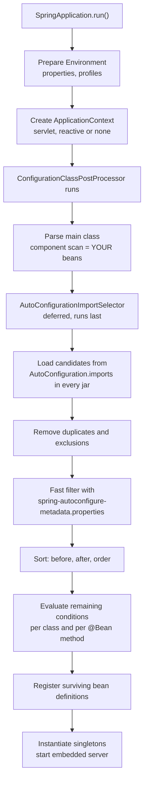
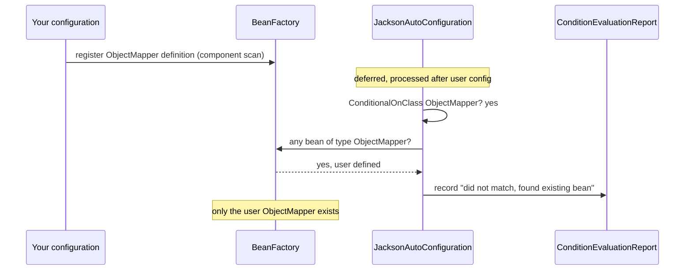

# Auto-configuration & Starters (How Boot Works Internally)

!!! warning "Draft: not yet fact-checked"
    This page was written but its independent review pass has not run yet. Verify version numbers and defaults against the linked sources.


!!! abstract "TL;DR"
    - A **starter** is only a dependency descriptor (a POM with no code). It puts libraries on the classpath. **Auto-configuration** is ordinary `@Configuration` code that reacts to what is on the classpath.
    - `@SpringBootApplication` = `@SpringBootConfiguration` + `@ComponentScan` + `@EnableAutoConfiguration`. The last one imports `AutoConfigurationImportSelector`, which reads candidate class names from `META-INF/spring/org.springframework.boot.autoconfigure.AutoConfiguration.imports` in every jar.
    - Each candidate is guarded by **`@Conditional...` annotations** (`OnClass`, `OnMissingBean`, `OnProperty`, `OnWebApplication`). Most candidates are discarded. Only the matching ones contribute beans.
    - The selector is a **`DeferredImportSelector`**: auto-configurations are processed **after** your own bean definitions. That is why `@ConditionalOnMissingBean` lets your bean win ("back-off").
    - Debug with `--debug` (the condition evaluation report) or `/actuator/conditions`. Switch things off with `exclude` or `spring.autoconfigure.exclude`. `spring.factories` no longer registers auto-configurations since Boot 3.0.

## Why it matters

Before Spring Boot, a Spring MVC + JPA application needed a few hundred lines of setup: a `DispatcherServlet` in `web.xml`, a `DataSource`, an `EntityManagerFactory`, a transaction manager, message converters, a view resolver, and a matching set of library versions that you had to work out by hand. Every team wrote the same code slightly differently, and most production bugs in that layer were version mismatches or a forgotten bean.

Boot solved this with two separate ideas:

1. **Starters** fix the *dependency* problem: one coordinate brings a tested, compatible set of libraries.
2. **Auto-configuration** fixes the *wiring* problem: sensible default beans are registered when the libraries are present, and they step aside when you define your own.

Interviewers at senior level ask about this for a practical reason. When a service fails to start with "Failed to configure a DataSource", or two `ObjectMapper` beans appear, or a bean you expected is silently missing, the person who understands the mechanism fixes it in minutes. "It is magic" is the answer they are screening out.

## Core concepts

### Starter vs auto-configuration: two different things

| | Starter | Auto-configuration |
|---|---|---|
| What it is | A POM that lists dependencies | `@AutoConfiguration` classes with `@Bean` methods |
| Contains code? | No | Yes |
| Where it lives | `spring-boot-starter-*` artifacts | `spring-boot-autoconfigure` (Boot 3.x), or the library's own autoconfigure module |
| Job | Put the right jars on the classpath | Create beans when those jars are present |

`spring-boot-starter-web` in Boot 3.x pulls in `spring-boot-starter` (core, logging, auto-configure, YAML), `spring-boot-starter-json` (Jackson), `spring-boot-starter-tomcat` and `spring-webmvc`. Nothing in the starter says "create a `DispatcherServlet`". That happens because `DispatcherServletAutoConfiguration` sees `DispatcherServlet.class` on the classpath.

The consequence: you get the same auto-configuration if you add the individual libraries by hand, and you get *no* behaviour from a starter whose auto-configuration conditions do not match.

### What `@SpringBootApplication` really does

```java
@SpringBootConfiguration      // a specialised @Configuration, one per application
@EnableAutoConfiguration      // the interesting one
@ComponentScan(excludeFilters = { /* TypeExcludeFilter, AutoConfigurationExcludeFilter */ })
public @interface SpringBootApplication { }
```

`@EnableAutoConfiguration` is itself meta-annotated with:

- `@AutoConfigurationPackage`: records the package of the annotated class as the "base package". Spring Data JPA and entity scanning use it later to know where to look.
- `@Import(AutoConfigurationImportSelector.class)`: the entry point of the whole mechanism.

### The startup flow


*Notice that your component scan (E) happens before auto-configuration (F to L). Everything about "back-off" depends on this order.*

Step by step:

1. **Candidate loading.** `AutoConfigurationImportSelector` uses `ImportCandidates` to read every `META-INF/spring/org.springframework.boot.autoconfigure.AutoConfiguration.imports` file on the classpath. Each file is a plain list of fully qualified class names, one per line. Boot 3.x's own file lists well over a hundred classes.
2. **Exclusions.** Classes named in `exclude` / `excludeName` or in `spring.autoconfigure.exclude` are removed.
3. **Fast filtering.** `AutoConfigurationImportFilter` implementations (`OnClassCondition`, `OnBeanCondition`, `OnWebApplicationCondition`) discard candidates using `META-INF/spring-autoconfigure-metadata.properties`. This file is generated at build time by the `spring-boot-autoconfigure-processor` annotation processor. It lets Boot reject a candidate whose `@ConditionalOnClass` cannot match **without loading the class at all**, which is a large part of why startup stays fast.
4. **Ordering.** Survivors are sorted alphabetically, then by `@AutoConfigureOrder`, then by `@AutoConfiguration(before = ..., after = ...)`.
5. **Condition evaluation.** The remaining configuration classes are parsed. Class-level conditions decide whether the class is used. Method-level conditions decide each `@Bean`.
6. **Recording.** Every decision is written into the `ConditionEvaluationReport`, which is what `--debug` prints.

### Why `DeferredImportSelector` is the key

A normal `ImportSelector` is processed as soon as the importing class is parsed. A `DeferredImportSelector` is held back until **all other `@Configuration` classes have been processed**. So when `JacksonAutoConfiguration` asks "is there already an `ObjectMapper`?", your `@Bean ObjectMapper` definition is already registered and the answer is correct.

This is also why the Spring Boot reference says `@ConditionalOnMissingBean` and `@ConditionalOnBean` should be used **only on auto-configuration classes**. In a normal `@Configuration` class the answer depends on the order in which bean definitions happen to be registered, which you do not control.

### The condition annotations

| Annotation | Matches when | Typical use |
|---|---|---|
| `@ConditionalOnClass` / `OnMissingClass` | A class is (not) on the classpath | "Is the library there?" |
| `@ConditionalOnMissingBean` | No bean of that type (or name) is defined yet | Back-off: user bean wins |
| `@ConditionalOnBean` | A bean of that type already exists | Build on top of another bean |
| `@ConditionalOnSingleCandidate` | Exactly one bean, or one marked `@Primary` | Safe injection of e.g. `DataSource` |
| `@ConditionalOnProperty` | A property has (or lacks) a value | Feature toggles |
| `@ConditionalOnBooleanProperty` | A boolean property is true/false (Boot 3.5+) | Clearer toggles |
| `@ConditionalOnWebApplication` / `OnNotWebApplication` | Context is servlet / reactive / not web | Web-only beans |
| `@ConditionalOnResource` | A resource exists | Config file present |
| `@ConditionalOnExpression` | A SpEL expression is true | Last resort |
| `@ConditionalOnJava` | JVM version in range | Version-specific beans |
| `@ConditionalOnCloudPlatform` | Running on Kubernetes, Cloud Foundry, etc. | Platform probes |
| `@ConditionalOnThreading` | Platform or virtual threads active (Boot 3.2+) | Virtual-thread executors |

All of them are thin wrappers over Spring Framework's `@Conditional(SomeCondition.class)`. A `Condition` is one method: `matches(ConditionContext, AnnotatedTypeMetadata)`.

Conditions run in two phases. `@ConditionalOnClass` and `@ConditionalOnProperty` run in the **parse** phase (cheap: only the classpath and `Environment` are needed). `@ConditionalOnBean` and `@ConditionalOnMissingBean` run in the **register-bean** phase, because they must see the bean definitions collected so far.


*Notice that the auto-configuration never overrides anything. It asks the bean factory first and simply does not register its own bean.*

### How Boot inspects classes that may not exist

`@ConditionalOnClass(DataSource.class)` refers to a class that may be missing at runtime. This works because Spring reads annotations with **ASM bytecode metadata**, not reflection, so the configuration class is never loaded if the condition fails. That is also why auto-configurations put risky types in nested `static` configuration classes: each nested class is loaded only if its own class condition passes. On a `@Bean` *method*, prefer the `name = "com.foo.Bar"` string form, because the method signature of the outer class is loaded by the JVM regardless.

### Properties binding: the other half

Almost every auto-configuration is paired with a `@ConfigurationProperties` class (`ServerProperties`, `DataSourceProperties`, `KafkaProperties`). The auto-configuration creates the bean, and the properties class supplies the tunable values. So there are three levels of customisation, from lightest to heaviest:

1. Set a property (`spring.jackson.serialization.indent-output=true`).
2. Register a **customizer** bean (`Jackson2ObjectMapperBuilderCustomizer`, `WebServerFactoryCustomizer`). The default bean is kept and adjusted.
3. Define your own bean of the type. The default backs off completely.

See [Configuration: properties, profiles, `@ConfigurationProperties`](03-configuration-properties-profiles-configurationproperties.md) for binding rules.

### Version history interviewers ask about

| Version | Change |
|---|---|
| Boot 1.x to 2.6 | Auto-configurations listed in `META-INF/spring.factories` under the `EnableAutoConfiguration` key, loaded by `SpringFactoriesLoader` |
| Boot 2.7 | New `AutoConfiguration.imports` file and `@AutoConfiguration` annotation. Both mechanisms supported |
| Boot 3.0 | `spring.factories` registration of auto-configurations **removed**. Old third-party starters silently stop configuring anything |
| Boot 3.x | AOT processing: conditions can be evaluated at **build time** for native images |
| Boot 4.0 | The single `spring-boot-autoconfigure` jar is split into per-technology modules, with matching starters (for example `spring-boot-starter-webmvc`) |

`spring.factories` still exists in Boot 3 and 4 for other extension points (`ApplicationContextInitializer`, `EnvironmentPostProcessor`, `FailureAnalyzer`). Only auto-configuration registration moved.

`@AutoConfiguration` is `@Configuration(proxyBeanMethods = false)` plus `before`/`after` attributes. With `proxyBeanMethods = false` no CGLIB subclass is created, which is faster and friendly to native images. The cost is that calling one `@Bean` method from another creates a new object, so dependencies must come in as method parameters. See [AOP & proxies](04-aop-and-proxies.md).

## In practice: code & configuration

### Reading a real auto-configuration

A simplified version of what Boot does for Jackson:

```java
@AutoConfiguration                                   // proxyBeanMethods = false
@ConditionalOnClass(ObjectMapper.class)              // only if Jackson is on the classpath
@EnableConfigurationProperties(JacksonProperties.class)
public class JacksonAutoConfiguration {

    @Bean
    @Primary
    @ConditionalOnMissingBean                        // type defaults to the return type: ObjectMapper
    ObjectMapper jacksonObjectMapper(Jackson2ObjectMapperBuilder builder) {
        return builder.createXmlMapper(false).build();
    }
}
```

### Overriding a default: the common mistake

=== "❌ Common mistake"
    ```java
    @Configuration
    class JsonConfig {

        // Replaces Boot's ObjectMapper completely. Boot backs off, so everything Boot
        // would have applied is lost: spring.jackson.* properties, the JavaTime module,
        // Kotlin and parameter-names modules, registered Jackson2ObjectMapperBuilderCustomizers.
        @Bean
        ObjectMapper objectMapper() {
            ObjectMapper mapper = new ObjectMapper();
            mapper.setSerializationInclusion(JsonInclude.Include.NON_NULL);
            return mapper;                 // LocalDate now serialises as an array or fails
        }
    }
    ```

=== "✅ Correct approach"
    ```java
    @Configuration(proxyBeanMethods = false)
    class JsonConfig {

        // Keep Boot's ObjectMapper and adjust it. Properties and modules still apply.
        @Bean
        Jackson2ObjectMapperBuilderCustomizer jsonCustomizer() {
            return builder -> builder
                .serializationInclusion(JsonInclude.Include.NON_NULL)
                .featuresToDisable(SerializationFeature.WRITE_DATES_AS_TIMESTAMPS);
        }
    }
    ```

The rule: **customise before you replace**. Replace only when you really want to own the bean.

### Writing your own starter

A typical platform-team starter: every service gets the same audit publisher without copy-paste. Third-party naming convention is `acme-spring-boot-starter` (the `spring-boot-starter-*` prefix is reserved for official ones).

```java
// module: audit-spring-boot-autoconfigure
@ConfigurationProperties(prefix = "acme.audit")
public record AuditProperties(
        @DefaultValue("true") boolean enabled,
        @DefaultValue("audit-events") String topic) { }
```

```java
@AutoConfiguration(after = KafkaAutoConfiguration.class)      // we need KafkaTemplate defined first
@ConditionalOnClass(KafkaTemplate.class)                      // library present?
@ConditionalOnProperty(prefix = "acme.audit", name = "enabled",
                       havingValue = "true", matchIfMissing = true)   // on by default, can be switched off
@EnableConfigurationProperties(AuditProperties.class)
public class AuditAutoConfiguration {

    @Bean
    @ConditionalOnMissingBean                                 // a service can supply its own publisher
    @ConditionalOnBean(KafkaTemplate.class)                   // only if Kafka was actually configured
    AuditPublisher auditPublisher(KafkaTemplate<String, Object> template,   // injected as a parameter,
                                  AuditProperties props) {                  // not by calling a @Bean method
        return new KafkaAuditPublisher(template, props.topic());
    }
}
```

Register it. The file name must be exact:

```text
# src/main/resources/META-INF/spring/org.springframework.boot.autoconfigure.AutoConfiguration.imports
com.acme.audit.autoconfigure.AuditAutoConfiguration
```

Build setup for the autoconfigure module:

```xml
<!-- Generates spring-autoconfigure-metadata.properties for the fast filter -->
<dependency>
    <groupId>org.springframework.boot</groupId>
    <artifactId>spring-boot-autoconfigure-processor</artifactId>
    <optional>true</optional>
</dependency>
<!-- Generates IDE metadata for acme.audit.* properties -->
<dependency>
    <groupId>org.springframework.boot</groupId>
    <artifactId>spring-boot-configuration-processor</artifactId>
    <optional>true</optional>
</dependency>
<!-- Libraries you only react to are optional: the consumer decides whether to bring them -->
<dependency>
    <groupId>org.springframework.kafka</groupId>
    <artifactId>spring-kafka</artifactId>
    <optional>true</optional>
</dependency>
```

The **starter** module is then an empty jar whose POM depends on the autoconfigure module plus the libraries that should come by default. Small internal starters often merge the two modules into one, which is fine.

### Testing an auto-configuration

`ApplicationContextRunner` builds small contexts quickly, with no web server and no full application:

```java
class AuditAutoConfigurationTest {

    private final ApplicationContextRunner runner = new ApplicationContextRunner()
        .withConfiguration(AutoConfigurations.of(           // preserves auto-config ordering rules
            KafkaAutoConfiguration.class, AuditAutoConfiguration.class));

    @Test
    void createsPublisherByDefault() {
        runner.run(ctx -> assertThat(ctx).hasSingleBean(AuditPublisher.class));
    }

    @Test
    void backsOffWhenUserDefinesOne() {
        runner.withUserConfiguration(CustomPublisherConfig.class)        // user config is registered first
              .run(ctx -> assertThat(ctx).hasSingleBean(AuditPublisher.class)
                                         .hasBean("customPublisher"));
    }

    @Test
    void disabledByProperty() {
        runner.withPropertyValues("acme.audit.enabled=false")
              .run(ctx -> assertThat(ctx).doesNotHaveBean(AuditPublisher.class));
    }

    @Test
    void inactiveWithoutKafkaOnClasspath() {
        runner.withClassLoader(new FilteredClassLoader(KafkaTemplate.class))   // simulate a missing jar
              .run(ctx -> assertThat(ctx).doesNotHaveBean(AuditPublisher.class));
    }
}
```

### Debugging and switching things off

```properties
# Print the condition evaluation report at startup (or run with --debug)
debug=true

# Exclude without touching code. Useful per profile.
spring.autoconfigure.exclude=org.springframework.boot.autoconfigure.jdbc.DataSourceAutoConfiguration
```

```java
@SpringBootApplication(exclude = DataSourceAutoConfiguration.class)   // compile-time safe alternative
public class GatewayApplication { }
```

The report has four parts: **Positive matches**, **Negative matches** (with the exact failing condition), **Exclusions**, and **Unconditional classes**. At runtime the same data is served by the `/actuator/conditions` endpoint (see [Actuator](08-actuator-health-checks-metrics.md)).

## Real-world usage

- **Platform starters are the standard way large organisations enforce consistency.** Netflix's Spring Boot based internal platform is delivered largely as starters and auto-configurations layered on top of open-source Boot, so that service teams get security, telemetry and service discovery by adding a dependency. Banks and healthcare companies do the same for audit logging, PII masking, correlation IDs and OAuth2 resource-server defaults, because a regulator-facing control is easier to defend when it comes from one versioned library than from forty copies.
- **Third-party libraries ship their own auto-configuration**: Spring Cloud, MyBatis, Resilience4j, springdoc-openapi and the Netflix DGS framework all register classes through `AutoConfiguration.imports`.
- **The Boot 3.0 upgrade is a well-known failure mode.** Libraries that only registered through `spring.factories` stopped being configured. There was no error, the beans were simply absent. Teams found it through `NoSuchBeanDefinitionException` or, worse, through a silently missing filter. The condition report shows nothing for such a library, because it is never a candidate.
- **Accidental auto-configuration is the opposite failure mode.** A transitive dependency drags in `spring-jdbc` or H2, and a service that never needed a database fails with "Failed to configure a DataSource" or quietly starts an in-memory database. In regulated domains the more serious version is a security filter chain backing off because someone defined a narrow `SecurityFilterChain` bean and lost the defaults.
- **Startup time and memory**: fewer matching auto-configurations means fewer beans. Teams running many small pods on Kubernetes review the positive matches list and exclude what they do not use.

## Trade-offs & production gotchas

| Option | Pros | Cons | Use when |
|---|---|---|---|
| Rely on auto-configuration | Least code, upgrades bring fixes | Behaviour changes with the classpath, less visible | Default choice |
| Property / customizer | Keeps defaults, small change | Limited to what the customizer exposes | You need to tune, not own |
| Define your own bean | Full control | You lose Boot's defaults and must maintain them on upgrades | Requirements really differ |
| Exclude the auto-configuration | Clear intent, saves startup | Every related bean is gone, including ones you wanted | The feature is unused |
| Custom starter | One place for cross-cutting standards | A shared library is a coupling point, versioning and rollout cost | The same wiring is in 3+ services |
| Explicit `@Import` of plain config | Obvious and explicit | Each service must remember to import it | Small teams, few services |

!!! warning "Gotchas"
    - **Never component-scan an auto-configuration class.** If your starter's package sits under the application's base package, the class is processed as normal configuration, *before* user beans are all known, and `@ConditionalOnMissingBean` gives wrong answers. Keep starters in a separate package and register only through the imports file.
    - **`@ConditionalOnMissingBean` in ordinary `@Configuration` is order-dependent.** It may work today and break after an unrelated refactor.
    - **`@ConditionalOnBean` needs ordering.** If the bean you depend on comes from another auto-configuration, declare `@AutoConfiguration(after = ...)`, otherwise the condition is evaluated before that bean definition exists.
    - **`before`/`after` control the order of bean *definitions*, not bean *creation*.** Creation order follows dependencies and `@DependsOn`.
    - **Back-off is by type.** A `@ConditionalOnMissingBean` on a method returning `ObjectMapper` backs off for any subtype too. If your `@Bean` method declares the return type as an interface or `Object`, the condition may not see the concrete type. Declare the most specific return type.
    - **Native image / AOT freezes conditions at build time.** `@ConditionalOnProperty` and `@Profile` are decided when the image is built, so you cannot flip them at runtime. See [Spring Boot 3.x](10-spring-boot-3-x-jakarta-ee-graalvm-native-image-virtual-thre.md).
    - **Test slices load a different set.** `@WebMvcTest` and `@DataJpaTest` disable full auto-configuration and import a curated list via `@ImportAutoConfiguration`. Your custom starter is not active there unless it is in that list or you import it.
    - **A second `DataSource` switches off more than you expect.** Several auto-configurations use `@ConditionalOnSingleCandidate(DataSource.class)`. With two data sources and no `@Primary`, JPA and transaction manager auto-configuration back off.

## How this connects to my experience

- **Where I used it:**
    - **OptumRx Meteor (Publicis Sapient):** the GraphQL Consumer Service and the other microservices were built on Spring Boot with Kafka, MongoDB, Redis and GraphQL. Each of those is wired by auto-configuration (`KafkaAutoConfiguration`, `MongoAutoConfiguration`, the Redis and Spring for GraphQL auto-configurations) and tuned through `spring.kafka.*`, `spring.data.mongodb.*` and `spring.data.redis.*` properties.
    - **"Established engineering standards around testing, CI/CD, code quality, and deployment practices":** this is the natural place for a shared starter story (common logging, correlation IDs, OAuth2 resource-server defaults, Kafka retry/DLQ configuration). *[confirm whether the team shipped a shared starter or common library, and what was in it]*
    - **CipherTrust Cloud Key Management (Coriolis) and Metasys (Johnson Controls):** REST APIs with Spring Boot and Spring Security, where the default security filter chain backs off as soon as you define your own.
- **Talking points:**
    - "I customise before I replace." For Redis caching I kept Boot's connection factory and supplied my own `RedisCacheConfiguration` / serializer for TTLs and JSON. *[confirm the actual customisation]*
    - For Kafka retry and DLQ handling, Boot auto-configures the `ConcurrentKafkaListenerContainerFactory` and picks up a `CommonErrorHandler` bean if one exists. I supplied the error handler with a `DeadLetterPublishingRecoverer` instead of rebuilding the factory. *[confirm]*
    - With 5 upstream systems behind OAuth2/PingFederate, I had more than one client configuration, so I know where auto-configuration stops (single-candidate conditions) and explicit beans start. *[confirm]*
    - When a bean is missing or duplicated, my first step is the condition evaluation report, not guessing.
    - If no shared starter existed: "We copied common configuration across services. With hindsight I would package it as a starter, and here is how I would design it." This is an honest and strong answer.
- **Likely follow-up chain:** "What does `@SpringBootApplication` do?" → "How does Boot find the auto-configuration classes?" → "How does your bean win over Boot's?" (deferred import + `@ConditionalOnMissingBean`) → "How would you write a starter for your team?" → "What broke or would break on the Boot 3 upgrade?" (`spring.factories` removal, `javax` to `jakarta`).

## Interview questions

### Fundamentals

??? question "Q1. What is the difference between a starter and auto-configuration?"
    **Answer:** A starter is a dependency descriptor: a POM with no code that brings a curated, version-compatible set of libraries. Auto-configuration is code: `@AutoConfiguration` classes that register beans when conditions match, mainly "is this class on the classpath" and "has the user not already defined this bean". The starter makes the conditions true. The auto-configuration does the wiring. You can have either without the other.

    **Interviewer listens for:** the clean separation, and that starters contain no logic.

    **Common wrong answer:** "The starter configures the beans."

??? question "Q2. What does `@SpringBootApplication` consist of?"
    **Answer:** Three annotations. `@SpringBootConfiguration` marks the class as the application's primary `@Configuration`. `@ComponentScan` scans the package of that class and below. `@EnableAutoConfiguration` imports `AutoConfigurationImportSelector` and, through `@AutoConfigurationPackage`, records the base package for things like entity scanning.

    **Interviewer listens for:** that this explains why the main class sits in the root package: classes outside it are not scanned.

??? question "Q3. How does Spring Boot find the auto-configuration classes?"
    **Answer:** `AutoConfigurationImportSelector` reads every `META-INF/spring/org.springframework.boot.autoconfigure.AutoConfiguration.imports` file on the classpath. Each lists fully qualified class names. Before Boot 2.7 the list lived in `META-INF/spring.factories` under the `EnableAutoConfiguration` key. Boot 2.7 supported both, and Boot 3.0 removed the `spring.factories` route for auto-configurations.

    **Interviewer listens for:** the exact mechanism and the version change.

    **Common wrong answer:** "Boot scans the classpath for `@Configuration` classes." It does not scan. It reads a list.

??? question "Q4. How do you see which auto-configurations were applied and why?"
    **Answer:** Start with `--debug` or `debug=true` to print the condition evaluation report: positive matches, negative matches with the failing condition, exclusions and unconditional classes. In a running service, the `/actuator/conditions` endpoint returns the same data. IDE Spring tooling also shows it.

??? question "Q5. How do you disable a specific auto-configuration?"
    **Answer:** `@SpringBootApplication(exclude = X.class)` (or `excludeName` when the class is not on the compile classpath), or the property `spring.autoconfigure.exclude`, which can differ per profile. Many features also have their own toggle property. Removing the dependency is the cleanest fix if the library is not needed at all.

### Intermediate

??? question "Q6. Why does your own bean win over Boot's default? What guarantees the order?"
    **Answer:** Two things together. First, Boot's default bean is annotated `@ConditionalOnMissingBean`. Second, `AutoConfigurationImportSelector` is a `DeferredImportSelector`, so auto-configuration classes are processed only after all user configuration and component scanning have registered their bean definitions. When the condition runs, your definition is already there, so Boot does not register its own.

    **Interviewer listens for:** `DeferredImportSelector`. Most candidates know `@ConditionalOnMissingBean` but not why the timing is safe.

    **Common wrong answer:** "My bean overrides Boot's." Nothing is overridden. Bean definition overriding is disabled by default since Boot 2.1. Boot's bean is never registered.

??? question "Q7. Why should `@ConditionalOnMissingBean` be used only in auto-configuration classes?"
    **Answer:** The condition looks at bean definitions registered *so far*. For auto-configuration that means "all user beans", because of deferred processing and explicit `before`/`after` ordering. In a normal `@Configuration` class the processing order relative to other user configuration is not something you control, so the result can change with a package rename or a new import.

??? question "Q8. `@ConditionalOnClass` refers to a class that might not exist. Why does this not throw `NoClassDefFoundError`?"
    **Answer:** Spring reads the annotation from bytecode with ASM instead of loading the class, so the referenced type is never resolved if it is absent. In addition, Boot's annotation processor writes the class conditions into `spring-autoconfigure-metadata.properties`, so many candidates are rejected without even opening the class file. On `@Bean` methods it is safer to use the `name` attribute or put the method in a nested static configuration class, because loading the outer class resolves its method signatures.

    **Interviewer listens for:** ASM metadata reading, nested configuration classes.

??? question "Q9. What will happen? The application has `spring-boot-starter-data-jpa` on the classpath and no `spring.datasource.*` properties and no embedded database."
    **Answer:** Startup fails with `Failed to configure a DataSource: 'url' attribute is not specified and no embedded datasource could be configured`. `DataSourceAutoConfiguration` matched because the JDBC classes are present, but it found no URL and no H2/HSQL/Derby driver to fall back to. Fixes: supply the properties, exclude `DataSourceAutoConfiguration` (and JPA with it), or remove the dependency. The message comes from a `FailureAnalyzer`, which is why it is readable.

    **Common wrong answer:** "It starts without a database."

??? question "Q10. What is the difference between `@AutoConfiguration` and `@Configuration`?"
    **Answer:** `@AutoConfiguration` (Boot 2.7+) is meta-annotated with `@Configuration(proxyBeanMethods = false)` and adds `before`, `after`, `beforeName`, `afterName` for ordering. It signals that the class is meant to be registered through the imports file and not scanned. With `proxyBeanMethods = false` there is no CGLIB proxy of the class, so inter-bean method calls are not intercepted and dependencies should be method parameters.

### Senior

??? question "Q11. Design a custom starter for your organisation. What are the rules you follow?"
    **Answer:**

    - Two modules (or one for small cases): `xyz-spring-boot-autoconfigure` with the code, `xyz-spring-boot-starter` with the dependencies. Do not use the `spring-boot-starter-` prefix.
    - Register through `AutoConfiguration.imports`. Keep the package outside any application's scan path.
    - Guard everything: `@ConditionalOnClass` for the library, `@ConditionalOnMissingBean` on every bean so services can override, a `@ConditionalOnProperty` kill switch.
    - Expose a typed `@ConfigurationProperties` class with a unique prefix, with the configuration processor for IDE metadata.
    - Mark reacted-to libraries `optional` in the autoconfigure module.
    - Declare ordering with `after`/`before` when using `@ConditionalOnBean`.
    - Test with `ApplicationContextRunner`: default, back-off, disabled, class missing.
    - Version it against a Boot version line and document the compatibility matrix.

    **Interviewer listens for:** overridability, kill switch, tests, and awareness that a shared starter is a coupling point that needs release discipline.

??? question "Q12. How does Boot keep startup fast with well over a hundred candidate auto-configurations?"
    **Answer:** Most candidates are removed cheaply. The `AutoConfigurationImportFilter` step uses pre-computed metadata (`spring-autoconfigure-metadata.properties`) to reject classes whose `@ConditionalOnClass` fails, without loading or parsing them. Survivors are read with ASM, not reflection. `proxyBeanMethods = false` avoids CGLIB subclass generation. Beyond that, Boot offers lazy initialisation, AOT processing (conditions evaluated at build time and bean definitions generated as code), CDS/AppCDS archives and native images.

??? question "Q13. What changes about auto-configuration in a GraalVM native image?"
    **Answer:** AOT processing runs the bean-definition phase at build time. Conditions are evaluated then, and the result is generated source code that registers a fixed set of bean definitions. So the classpath is closed, and conditions based on properties or profiles are frozen at build time: setting `acme.audit.enabled=false` at runtime will not remove the bean. Property *values* bound through `@ConfigurationProperties` still work at runtime. Custom starters also need to contribute runtime hints (`RuntimeHintsRegistrar`) for reflection, resources and proxies.

    **Common wrong answer:** "Native images work the same, just faster."

??? question "Q14. What does `before`/`after` ordering actually control? Can it fix a bean initialisation order problem?"
    **Answer:** It controls the order in which auto-configuration classes are *processed*, which means the order in which bean definitions are registered and conditions evaluated. It matters for `@ConditionalOnBean` / `@ConditionalOnMissingBean` between auto-configurations. It does not control instantiation order. That is decided by injection dependencies, `@DependsOn` and `SmartLifecycle` phases. Using `@AutoConfigureOrder` to fix a runtime ordering bug is a sign of a missing dependency declaration.

### Scenario-based

??? question "Q15. After upgrading a service from Boot 2.7 to 3.x, the beans from an internal shared library disappeared. No error at startup. What happened and how do you prove it?"
    **Answer:** The library registers its auto-configuration only in `META-INF/spring.factories` under the `EnableAutoConfiguration` key. Boot 3.0 ignores that key, so the class is never a candidate. Proof: the class does not appear anywhere in the condition evaluation report, neither positive nor negative. A class that failed a condition would be under negative matches. Fix: add the `AutoConfiguration.imports` file in the library, switch to `@AutoConfiguration`, and add a context-runner test. As a stop-gap the service can `@Import` or `@ImportAutoConfiguration` the class explicitly.

    **Interviewer listens for:** distinguishing "never considered" from "condition failed", and fixing the library and not each consumer.

??? question "Q16. You added a custom `ObjectMapper` bean and now dates in API responses changed format and `spring.jackson.*` properties are ignored. Why?"
    **Answer:** Defining an `ObjectMapper` makes `JacksonAutoConfiguration`'s mapper back off. The bean built with `new ObjectMapper()` has none of Boot's setup: no JavaTime module, no property binding, no customizers. Fix: remove the bean and use a `Jackson2ObjectMapperBuilderCustomizer`, or if a second mapper is truly needed, build it from the injected `Jackson2ObjectMapperBuilder` and do not make it the primary one.

??? question "Q17. A service needs two databases. After adding the second `DataSource` bean, JPA repositories and `@Transactional` stopped working. Explain."
    **Answer:** Once you define a `DataSource`, Boot's own backs off. And several auto-configurations (JPA, `DataSourceTransactionManager`, `JdbcTemplate`) are guarded by `@ConditionalOnSingleCandidate(DataSource.class)`. Two candidates with no `@Primary` means no single candidate, so they back off too. Options: mark one `@Primary` so the auto-configuration applies to it and wire the second explicitly, or configure both stacks by hand (data source, entity manager factory, transaction manager, `@EnableJpaRepositories` with separate base packages). Use `@ConfigurationProperties` on each `DataSource` bean method to keep property binding. Details in [Spring Data](07-spring-data.md) and [Transactions](06-transactions-transactional-propagation-isolation-rollback-ru.md).

??? question "Q18. Your team's starter works in the sample app but in one service its `@ConditionalOnMissingBean` bean is created in addition to the service's own bean, causing `NoUniqueBeanDefinitionException`. What do you check?"
    **Answer:** Three likely causes.

    1. The starter's package is under the service's base package, so the auto-configuration is component-scanned and processed as normal configuration before the service's bean definition is registered.
    2. The service's bean is declared with a wider return type (an interface or `Object`) or comes from a `FactoryBean`, so the type-based condition cannot see it.
    3. The service's bean is defined in another auto-configuration that is ordered after the starter, so an `after` is missing.

    The condition report tells which one: it shows the condition matched and where the class came from. Fix the package or ordering, and add a context-runner test for the case.

    **Interviewer listens for:** a structured diagnosis using the report, not trial and error.

## Cheat sheet

| Concept | Remember |
|---|---|
| Starter | POM only, no code. Puts jars on the classpath |
| Auto-configuration | `@AutoConfiguration` + conditions, registers default beans |
| `@SpringBootApplication` | `@SpringBootConfiguration` + `@ComponentScan` + `@EnableAutoConfiguration` |
| Discovery file | `META-INF/spring/org.springframework.boot.autoconfigure.AutoConfiguration.imports` |
| Old mechanism | `spring.factories`: deprecated in 2.7, removed for auto-config in 3.0 |
| Entry point | `AutoConfigurationImportSelector` (a `DeferredImportSelector`) |
| Why user beans win | Deferred processing + `@ConditionalOnMissingBean` |
| Fast filter | `spring-autoconfigure-metadata.properties` from `spring-boot-autoconfigure-processor` |
| `@AutoConfiguration` | `proxyBeanMethods = false`, plus `before` / `after` |
| Ordering | Affects bean definition order, not creation order |
| Customise | Property → customizer bean → own bean (last resort) |
| Debug | `--debug`, `debug=true`, `/actuator/conditions` |
| Exclude | `exclude = X.class`, `spring.autoconfigure.exclude` |
| Test | `ApplicationContextRunner`, `AutoConfigurations.of`, `FilteredClassLoader` |
| Never | Component-scan an auto-configuration, or use `OnMissingBean` in normal config |
| Native / AOT | Conditions frozen at build time |

## Sources

1. [Spring Boot Reference: Auto-configuration](https://docs.spring.io/spring-boot/reference/using/auto-configuration.html): what it is, how to exclude, the `--debug` report.
2. [Spring Boot Reference: Creating Your Own Auto-configuration](https://docs.spring.io/spring-boot/reference/features/developing-auto-configuration.html): the imports file, condition annotations, ordering, starter naming and module layout, `ApplicationContextRunner`, and the advice to use bean conditions only in auto-configuration classes.
3. [Spring Boot Reference: Build Systems, Starters](https://docs.spring.io/spring-boot/reference/using/build-systems.html#using.build-systems.starters): the list and purpose of official starters.
4. [Spring Boot 2.7 Release Notes](https://github.com/spring-projects/spring-boot/wiki/Spring-Boot-2.7-Release-Notes): introduction of `@AutoConfiguration` and `AutoConfiguration.imports`.
5. [Spring Boot 3.0 Migration Guide](https://github.com/spring-projects/spring-boot/wiki/Spring-Boot-3.0-Migration-Guide): removal of `spring.factories` auto-configuration registration.
6. [Spring Boot 4.0 Migration Guide](https://github.com/spring-projects/spring-boot/wiki/Spring-Boot-4.0-Migration-Guide): modularised auto-configuration and the new starter names.
7. [Spring Boot Reference: Ahead-of-Time Processing](https://docs.spring.io/spring-boot/reference/packaging/aot.html) and [GraalVM Native Images](https://docs.spring.io/spring-boot/reference/packaging/native-image/introducing-graalvm-native-images.html): build-time condition evaluation and the closed-world restrictions.
8. [Spring Framework Javadoc: `DeferredImportSelector`](https://docs.spring.io/spring-framework/docs/current/javadoc-api/org/springframework/context/annotation/DeferredImportSelector.html): why deferred imports run after all other configuration classes.
