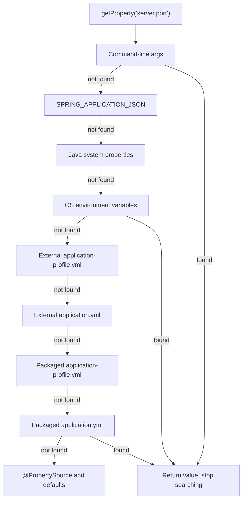
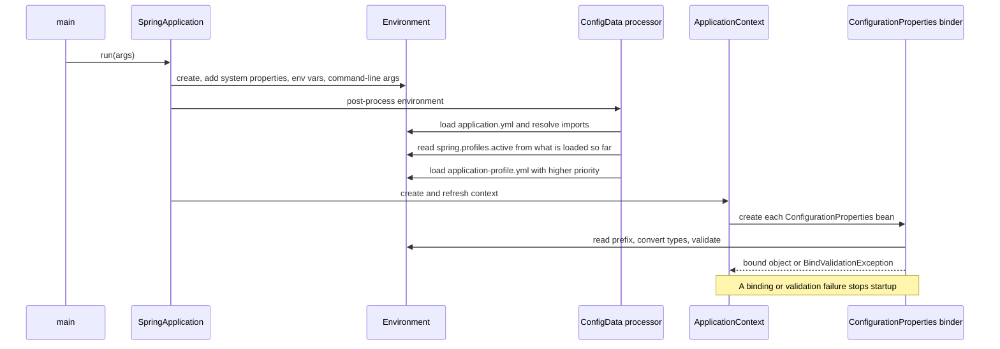

# Configuration: properties, profiles, `@ConfigurationProperties`

!!! abstract "TL;DR"
    - All configuration ends up in one **`Environment`**: an ordered list of **`PropertySource`s**. A lookup walks the list and the **first source that has the key wins**.
    - Rough precedence, highest first: **command-line args → `SPRING_APPLICATION_JSON` → Java system properties → OS environment variables → config files outside the jar → config files inside the jar → `@PropertySource` → defaults**. Profile-specific files beat non-profile files at the same location.
    - **Profiles** are named switches (`dev`, `prod`) that activate extra config documents and `@Profile` beans. With several active profiles, the **last one listed wins**.
    - **`@ConfigurationProperties`** binds a whole prefix into a typed object (ideally an immutable **record**), with relaxed binding, type conversion (`Duration`, `DataSize`), `@Validated` fail-fast checks and IDE metadata. Use `@Value` only for a one-off value.
    - **Build one artifact, configure it from outside.** Secrets never go into the jar or git: inject them through environment variables, mounted files (`configtree:`) or a secret store.

## Why it matters

The same jar must run on a laptop, in CI, in a test cluster and in production. Only the configuration changes: URLs, credentials, timeouts, feature switches. This is factor III of the Twelve-Factor App ("store config in the environment").

Before Spring Boot, teams did this with XML placeholders, Maven filtering that built a different artifact per environment, or hand-written `Properties` loaders. Each approach had the same weakness: nobody could say with confidence which value was live in production.

Spring Boot gives one model with clear rules. Interviewers like this topic because it separates people who "add a line to `application.yml`" from people who can debug *why production is using the wrong value*. For a lead, it also touches secret handling, deployment design and safe rollouts.

## Core concepts

### The `Environment` and `PropertySource`

The `Environment` holds two things:

1. **Profiles**: which named groups are active.
2. **Properties**: a `MutablePropertySources` list. Each `PropertySource` is a named key-value source (a file, the env vars, the command line).

`environment.getProperty("server.port")` asks each source in order and returns the first hit. So "overriding" is not merging values into a file. It is simply **putting a source earlier in the list**.

This happens very early, before any bean exists. `SpringApplication` creates the `Environment`, then `EnvironmentPostProcessor`s (including `ConfigDataEnvironmentPostProcessor`, which loads `application.*` files) fill it. Only then is the `ApplicationContext` created. That is why [auto-configuration](02-auto-configuration-and-starters.md) conditions such as `@ConditionalOnProperty` can read properties.

### Precedence order

From highest priority to lowest (the common ones):

| # | Source | Example |
|---|---|---|
| 1 | Test sources: `@TestPropertySource`, `@DynamicPropertySource`, `@SpringBootTest(properties=...)` | Testcontainers port |
| 2 | Command-line arguments | `--server.port=9000` |
| 3 | `SPRING_APPLICATION_JSON` (inline JSON in an env var or system property) | `{"app":{"x":1}}` |
| 4 | Servlet init params, JNDI | legacy app servers |
| 5 | Java system properties | `-Dserver.port=9000` |
| 6 | OS environment variables | `SERVER_PORT=9000` |
| 7 | `random.*` values | `${random.uuid}` |
| 8 | Config data files (`application.yml` and friends), see below | |
| 9 | `@PropertySource` on `@Configuration` classes | |
| 10 | `SpringApplication.setDefaultProperties` | |

Inside item 8, config data files are ordered like this (highest first):

1. Profile-specific files **outside** the jar (`application-prod.yml`)
2. Application files **outside** the jar (`application.yml`)
3. Profile-specific files **inside** the jar
4. Application files **inside** the jar


*Notice that the lookup stops at the first source that has the key. A value in `application.yml` is only a default: anything closer to the deployment (env var, command line) silently beats it.*

The design idea: **the closer a source is to the running process, the higher its priority.** Developers ship defaults in the jar. Operators override them at deploy time without rebuilding.

### Where Boot looks for config files

By default Boot searches these locations, and later ones override earlier ones:

1. `classpath:/`
2. `classpath:/config/`
3. `file:./` (the working directory)
4. `file:./config/`
5. `file:./config/*/` (direct child directories)

Useful properties:

- `spring.config.name`: change the base name from `application`.
- `spring.config.location`: **replace** the default locations.
- `spring.config.additional-location`: **add** locations (they take priority over the defaults).
- `spring.config.import`: pull in more config data from inside a file. Imported values beat the file that imports them.

`spring.config.import` (added in Boot 2.4) is the modern extension point. Prefixes select a loader:

```yaml
spring:
  config:
    import:
      - "optional:file:./local-overrides.yml"       # optional: do not fail if missing
      - "optional:configtree:/run/secrets/"          # each file name = key, file content = value
      - "optional:configserver:http://config:8888"   # Spring Cloud Config
      - "aws-secretsmanager:/prod/claims-service"    # Spring Cloud AWS
```

Without `optional:`, a missing import fails startup. That is usually what you want in production.

`configtree:` fits Kubernetes well. A mounted Secret appears as a directory where each file is one key, so `/run/secrets/db/password` becomes the property `db.password`.

### Properties vs YAML

Both produce the same flat keys. YAML is easier to read for nested structures. Things to know:

- One file can contain several **documents**, separated by `---` in YAML or `#---` in `.properties`. They are processed top to bottom, so later documents override earlier ones.
- **`@PropertySource` cannot load YAML** out of the box. It only understands `.properties` (and XML).
- If both `application.properties` and `application.yml` exist in the same place, `.properties` wins. Pick one format per project.
- **Maps merge key by key across sources. Lists do not.** A list defined in a higher-priority source replaces the whole lower-priority list.

### Profiles

A profile is a label. Activating it does two things:

1. Loads `application-{profile}.yml` and any document marked `spring.config.activate.on-profile: {profile}`.
2. Registers beans annotated `@Profile("{profile}")`. `@Profile` accepts expressions: `@Profile("prod & !eu")`, `@Profile("dev | test")`.

Ways to activate: `spring.profiles.active=prod` (property, `--` argument, or the `SPRING_PROFILES_ACTIVE` env var), or `SpringApplication.setAdditionalProfiles`. If nothing is active, the profile named `default` is used, so `application-default.yml` is loaded.

Rules interviewers probe:

- **Last wins.** With `spring.profiles.active=dev,local`, a key present in both files takes its value from `application-local.yml`.
- `spring.profiles.active` follows normal precedence. A command-line value **replaces** the one in `application.yml`.
- `spring.profiles.include` **adds** profiles on top of the active ones, whatever the source.
- `spring.profiles.group.production=proddb,prodmq` lets one name switch on several.
- Since Boot 2.4, `spring.profiles.active`, `include` and `group` are **not allowed inside a profile-specific file or document**. A document cannot both be conditional on a profile and change which profiles are active. Boot fails with `InvalidConfigDataPropertyException`.
- The old `spring.profiles: prod` key inside a document was replaced by `spring.config.activate.on-profile: prod`.


*Notice that profiles are decided while the environment is still being built, before any bean exists. That is why a profile-specific document cannot change the set of active profiles, and why bad configuration fails at startup rather than at the first request.*

### `@Value`: simple injection

```java
@Value("${claims.upstream.timeout:2s}") Duration timeout;   // placeholder with a default
@Value("#{T(java.lang.Runtime).getRuntime().availableProcessors()}") int cores;  // SpEL
```

`${...}` is a property placeholder. `#{...}` is a SpEL expression. `@Value` is processed by a `BeanPostProcessor` (see [bean lifecycle](01-ioc-and-dependency-injection-bean-scopes-and-lifecycle.md)), so it does not work in `static` fields or in objects you create with `new`. A missing key without a default fails startup with "Could not resolve placeholder".

### `@ConfigurationProperties`: type-safe binding

Instead of spreading `@Value` strings across classes, bind one prefix to one object:

| | `@ConfigurationProperties` | `@Value` |
|---|---|---|
| Relaxed binding | Yes | Limited (use kebab-case in the placeholder) |
| Nested objects, lists, maps | Yes | No (awkward) |
| Validation (JSR 380) | Yes, at startup | No |
| IDE metadata and auto-complete | Yes | No |
| SpEL | No | Yes |
| Immutable (constructor or record) | Yes | Constructor injection only |

**How it gets registered.** One of:

- `@EnableConfigurationProperties(ClaimsProperties.class)` on a configuration class.
- `@ConfigurationPropertiesScan` on the application class.
- `@Component` on the class (only for mutable JavaBean style).
- `@ConfigurationProperties` on a `@Bean` method, to bind onto a third-party type.

**How it binds.** `ConfigurationPropertiesBindingPostProcessor` uses the `Binder` API. Two styles:

- **JavaBean binding**: default constructor plus setters. Mutable.
- **Constructor binding**: values are passed to the constructor. Since Boot 3.0, a class or record with a **single parameterised constructor** is constructor-bound automatically. `@ConstructorBinding` is only needed to choose between several constructors. Use `@DefaultValue` for defaults.

**Relaxed binding.** These all bind to the field `apiKey` under prefix `claims.upstream`:

| Source | Form |
|---|---|
| YAML or properties (recommended) | `claims.upstream.api-key` |
| camelCase | `claims.upstream.apiKey` |
| underscore | `claims.upstream.api_key` |
| Environment variable (canonical) | `CLAIMS_UPSTREAM_APIKEY` |
| Environment variable (legacy form, also accepted) | `CLAIMS_UPSTREAM_API_KEY` |

The documented environment variable rule: replace `.` with `_`, **remove** `-`, upper-case everything. List elements use numbers: `claims.hosts[0]` becomes `CLAIMS_HOSTS_0`. The `prefix` in the annotation itself must be kebab-case.

The binder's `SystemEnvironmentPropertyMapper` also tries a **legacy form where `-` becomes `_`**. That is why `SPRING_DATASOURCE_DRIVER_CLASS_NAME` works for `spring.datasource.driver-class-name`. It works because the binder starts from the known property name `api-key` and generates both candidate env var names. It cannot work the other way round: an underscore that has no matching dash in the property name (`TIME_OUT` for a field `timeout`) is read as a new path segment, and map keys containing dashes cannot be recovered from an env var. Prefer the canonical form in your own manifests.

**Conversion.** `Duration` (`500ms`, `2s`, `PT2S`), `DataSize` (`10MB`), `Period`, enums (case-insensitive), collections and maps work out of the box. A bare number for a `Duration` means milliseconds unless you add `@DurationUnit`.

**Validation.** Add `@Validated` to the class and constraint annotations to the fields. Put `@Valid` on nested objects so validation goes into them. A violation throws `BindValidationException` and the app does not start. `spring-boot-starter-validation` must be on the classpath.

**Metadata.** Add `spring-boot-configuration-processor` as an annotation processor. It generates `META-INF/spring-configuration-metadata.json`, which gives IDE auto-complete and documentation for your own keys.

## In practice: code & configuration

=== "❌ Common mistake"
    ```java
    @Service
    class ClaimsClient {
        @Value("${claims.upstream.url}")           // same string repeated in other classes
        private String url;

        @Value("${claims.upstream.timeout}")       // "2" ... seconds? millis? nobody knows
        private int timeout;

        @Value("${claims.upstream.apiKey}")        // typo-prone, no validation, hard to test
        private String apiKey;

        private final RestClient client = RestClient.builder()
            .baseUrl(url)                          // BUG: url is still null here,
            .build();                              // field injection runs after construction
    }
    ```

=== "✅ Correct approach"
    ```java
    @ConfigurationProperties(prefix = "claims.upstream")   // one prefix, one type
    @Validated                                             // validate at startup
    public record ClaimsUpstreamProperties(
            @NotNull URI url,
            @NotBlank String apiKey,
            @DefaultValue("2s") Duration timeout,          // typed, with a unit
            @DefaultValue("3") @Min(0) @Max(5) int maxRetries,
            @Valid @DefaultValue Pool pool) {              // @Valid to validate nested values

        public record Pool(@DefaultValue("50") @Positive int maxConnections) {}
    }

    @Service
    class ClaimsClient {
        private final RestClient client;

        ClaimsClient(ClaimsUpstreamProperties props, RestClient.Builder builder) {
            this.client = builder                          // properties are ready in the constructor
                .baseUrl(props.url().toString())
                .defaultHeader("X-Api-Key", props.apiKey())
                .build();
        }
    }

    @SpringBootApplication
    @ConfigurationPropertiesScan                           // registers the record as a bean
    public class ClaimsApplication {
        public static void main(String[] args) {
            SpringApplication.run(ClaimsApplication.class, args);
        }
    }
    ```

A single multi-document `application.yml` with safe defaults and per-profile overrides:

```yaml
spring:
  application:
    name: claims-service
  profiles:
    group:
      prod: [prod-kafka, json-logs]        # activating "prod" also activates these
claims:
  upstream:
    url: http://localhost:8089              # safe local default
    timeout: 2s
    api-key: ${CLAIMS_API_KEY:dev-only-key} # placeholder with a fallback
---
spring:
  config:
    activate:
      on-profile: prod                      # this document applies only in prod
    import: "configtree:/run/secrets/"      # fails startup if the mount is missing
claims:
  upstream:
    url: https://claims.internal.example.com
    timeout: 800ms
    api-key: ${claims-api-key}              # no default in prod: fail fast if absent
```

Supplying values from Kubernetes without rebuilding the image:

```yaml
containers:
  - name: claims-service
    image: registry.example.com/claims-service:1.42.0   # same image in every environment
    env:
      - name: SPRING_PROFILES_ACTIVE
        value: prod
      - name: CLAIMS_UPSTREAM_MAXRETRIES                # binds to claims.upstream.max-retries
        value: "2"
    volumeMounts:
      - name: secrets
        mountPath: /run/secrets                         # read by configtree:
        readOnly: true
```

Profile-specific beans and a test that binds only the properties:

```java
@Configuration
class NotificationConfig {
    @Bean @Profile("!prod")                               // any environment except prod
    NotificationSender loggingSender() { return new LoggingSender(); }

    @Bean @Profile("prod")
    NotificationSender smsSender(SmsProperties p) { return new SmsSender(p); }
}

class ClaimsUpstreamPropertiesTest {
    private final ApplicationContextRunner runner = new ApplicationContextRunner()
        .withUserConfiguration(Config.class);

    @Test
    void failsFastWhenRetriesOutOfRange() {
        runner.withPropertyValues(
                "claims.upstream.url=http://x", "claims.upstream.api-key=k",
                "claims.upstream.max-retries=9")
            .run(ctx -> assertThat(ctx).hasFailed());    // startup fails, not the first request
    }

    @EnableConfigurationProperties(ClaimsUpstreamProperties.class)
    static class Config {}
}
```

!!! tip "Prefer a property over a profile for behaviour"
    `@ConditionalOnProperty("claims.sms.enabled")` is easier to reason about and to test than `@Profile("prod")`. Keep profiles for *selecting values per environment*. Use properties for *switching features*.

## Real-world usage

- **Twelve-Factor and containers.** The common practice on Kubernetes is one immutable image promoted through environments, with values from ConfigMaps (env vars or mounted files) and Secrets. Boot's precedence order was designed for exactly this.
- **Central config.** Spring Cloud Config Server (Git-backed), HashiCorp Vault, AWS Parameter Store and Secrets Manager, and Azure App Configuration all plug in through `spring.config.import`. Netflix open-sourced Archaius for dynamic properties long before this, which shows how early large microservice estates needed runtime-tunable config.
- **Runtime refresh.** With Spring Cloud, an `EnvironmentChangeEvent` (for example after `/actuator/refresh`) re-binds mutable `@ConfigurationProperties` beans. Beans marked `@RefreshScope` are re-created on next use. Immutable, constructor-bound properties need `@RefreshScope` or a restart. Many teams prefer a rolling restart because it is simpler and auditable.
- **Incidents.** Configuration is a leading cause of outages across the industry. The Knight Capital loss in 2012, described in the SEC's order, involved new code deployed to only some servers and an old flag being reused. It is the classic argument for consistent, versioned, validated configuration. A second well-known failure class is leaking secrets through an exposed Actuator `/env` or `/heapdump` endpoint (see [Actuator](08-actuator-health-checks-metrics.md)).
- **Healthcare and banking.** Credentials, encryption keys and connection strings for systems holding patient or payment data must not live in source control or images. Auditors (HIPAA, PCI DSS) expect secrets in a managed store with rotation and access logs, and a clear record of who changed which setting and when.

## Trade-offs & production gotchas

| Option | Pros | Cons | Use when |
|---|---|---|---|
| Files inside the jar | Versioned with code, reviewed in PRs | Change needs a rebuild; never for secrets | Defaults and non-secret settings |
| Environment variables | Universal, simple on Kubernetes | Flat names, visible to the process and in dumps, need a restart | Per-environment overrides |
| Mounted files with `configtree:` | Good for secrets, no env exposure | Read at startup unless you add reload logic | Kubernetes Secrets |
| Config server or secret store | Central, audited, rotation, refresh | Extra dependency at startup; needs a failure strategy | Many services, regulated domains |
| Profiles | One switch selects a whole set | Profile sprawl, hidden combinations, prod-only code paths | Environment selection only |
| `@Value` | Quick, supports SpEL | Scattered strings, no validation or grouping | A single isolated value |
| `@ConfigurationProperties` | Typed, validated, testable, documented | A little more code | Any group of related settings |

!!! warning "Gotchas"
    - **Env var naming.** The documented form for `claims.upstream.api-key` is `CLAIMS_UPSTREAM_APIKEY` (dashes removed). `CLAIMS_UPSTREAM_API_KEY` also binds, through the binder's legacy mapping, but only because the property name really contains a dash there. An underscore in the wrong place (`CLAIMS_UPSTREAM_TIME_OUT` for `timeout`) means `time.out`, matches nothing and is silently ignored. Map keys with dashes or dots cannot be expressed reliably as env vars.
    - **Unknown keys are ignored by default** (`ignoreUnknownFields = true`). A typo such as `time-out` does not fail. The default is used instead. Validation with `@NotNull` only catches missing mandatory values.
    - **Lists are replaced, not merged.** Overriding one element of a list from a profile file drops the others.
    - **A stray env var beats your file.** `SERVER_PORT` set on the host or in a base image overrides `application.yml`. Check `/actuator/env` or `/actuator/configprops` to see the winning source.
    - **Since Boot 3.0, `/actuator/env` and `/actuator/configprops` mask every value by default** (`show-values: never`). Do not switch to `always` in production.
    - **`@PropertySource` is loaded late** (during configuration class parsing), so it cannot set things needed earlier, such as `logging.*` or `spring.main.*`, and it does not read YAML.
    - **YAML types.** Unquoted `on`, `off`, `yes`, `no` can be read as booleans, and a number with a leading zero may be read as octal. Quote such values.
    - **`@Value` in a `static` field or on a bean created with `new`** stays `null`, with no error.
    - **`spring.config.location` replaces the defaults.** If you set it, your packaged `application.yml` is no longer read. Use `additional-location` to add.
    - **No SpEL in `@ConfigurationProperties`.** `#{...}` expressions in a value are not evaluated during binding, and the `prefix` must be a literal. Only `${...}` placeholders are resolved.

## How this connects to my experience

- **Where I used it:**
    - **Publicis Sapient, OptumRx Meteor:** "Designed and developed microservices using Java, Spring Boot, Kafka, MongoDB, Redis, and GraphQL" and "Established engineering standards around testing, CI/CD, code quality, and deployment practices." Every one of those integrations (Kafka brokers, MongoDB URI, Redis, PingFederate OAuth2 endpoints, 5 upstream systems) is environment-specific configuration.
    - **Deloitte, ConvergeHealth Data Asset Explorer:** "implemented security controls using IAM, KMS, and Secrets Manager" and Terraform-provisioned infrastructure. This is the secrets-outside-the-artifact story.
    - **Coriolis, CCKM:** "Built REST APIs using Spring Boot and automated deployments through GitLab CI/CD pipelines."
- **Talking points:**
    - In the GraphQL Consumer Service, each of the 5 upstream clients had its own typed properties (base URL, timeouts, retry limits) bound with `@ConfigurationProperties` and validated at startup, so a bad value failed the deployment and not a member's request. *[confirm that typed properties and validation were used]*
    - One image promoted across environments, with per-environment values and secrets injected by the platform (Kubernetes ConfigMaps and Secrets, or a vault). *[confirm the actual mechanism and secret store at OptumRx]*
    - At Deloitte, database and API credentials came from AWS Secrets Manager with KMS encryption, with IAM roles deciding which service could read which secret. *[confirm whether the app read secrets through Spring Cloud AWS, the SDK, or ECS/EKS injection]*
    - As a lead, I set the standard: no secrets in git, kebab-case keys, one properties class per integration, defaults safe for local, and production values that must be supplied explicitly. *[confirm which of these were written standards]*
- **Likely follow-up chain:** "How do you manage config across environments?" → "What is the precedence order, and how do you find which source won?" (answer with the list, then `/actuator/env` and `configprops`) → "Where do secrets live and how are they rotated?" (secret store, mounted or imported, restart or refresh) → "How do you change a timeout in production without a redeploy?" (config server plus refresh, or ConfigMap change plus rolling restart, and why the second is often safer).

## Interview questions

### Fundamentals

??? question "Q1. What is the Spring `Environment`, and what is a `PropertySource`?"
    **Answer:** The `Environment` is the abstraction for two things: active profiles and properties. Properties live in an ordered list of `PropertySource` objects, each a named key-value source such as the command line, env vars or a file. A lookup walks the list and returns the first match, so order is precedence.

    **Interviewer listens for:** "ordered list, first match wins", and that it is built before the application context.

    **Common wrong answer:** "Spring merges all the property files into one big file."

??? question "Q2. Give the precedence order of the common property sources."
    **Answer:** Highest first: test property sources, command-line arguments, `SPRING_APPLICATION_JSON`, Java system properties, OS environment variables, config files outside the jar (profile-specific above plain), config files inside the jar (profile-specific above plain), `@PropertySource`, then default properties.

    **Interviewer listens for:** the principle "closer to the deployment wins" and env vars beating files.

    **Common wrong answer:** "`application.yml` overrides environment variables because it is more specific."

??? question "Q3. `@Value` vs `@ConfigurationProperties`: when do you use each?"
    **Answer:** `@Value` injects a single value and supports SpEL. `@ConfigurationProperties` binds a whole prefix into a typed object, with relaxed binding, nested structures, validation, IDE metadata and easy testing. Use `@ConfigurationProperties` for any group of related settings and `@Value` only for a one-off.

    **Interviewer listens for:** validation at startup, immutability with records, a single place for each key.

    **Common wrong answer:** "@Value is deprecated." It is fine for single values; typed properties are better for groups.

??? question "Q4. What is a profile and how do you activate one?"
    **Answer:** A named logical group that activates extra config (`application-{profile}.yml` or documents with `spring.config.activate.on-profile`) and beans marked `@Profile`. Activate with `spring.profiles.active` as a property, `--spring.profiles.active=prod`, or the `SPRING_PROFILES_ACTIVE` env var. If none is active, `default` is used.

    **Common wrong answer:** "Profiles are a Maven feature" (Maven profiles are a separate build-time concept).

    **Interviewer listens for:** named config groups, profile files and on-profile documents, activation methods.

??? question "Q5. What is relaxed binding? Which env var sets `claims.upstream.api-key`?"
    **Answer:** Boot matches different naming styles to the same property: kebab-case, camelCase, underscore and upper-case env var form. For env vars the documented rule is: replace dots with underscores, remove dashes, upper-case. So the canonical answer is `CLAIMS_UPSTREAM_APIKEY`. In practice `CLAIMS_UPSTREAM_API_KEY` also binds, because the binder tries a legacy form in which dashes become underscores (the same reason `SPRING_DATASOURCE_DRIVER_CLASS_NAME` works).

    **Interviewer listens for:** "dashes are removed" as the documented rule, and ideally awareness that the underscore form is tolerated for dashed names only.

    **Common wrong answer:** "Env vars must match the property name exactly", or claiming that `CLAIMS_UPSTREAM_API_KEY` is silently ignored. It is not. What is ignored is an underscore with no matching dash, such as `TIME_OUT` for `timeout`.

### Intermediate

??? question "Q6. Output prediction: which port is used?"
    Packaged `application.yml` has `server.port: 8080`. Packaged `application-prod.yml` has `server.port: 9090`. The container sets `SPRING_PROFILES_ACTIVE=prod` and `SERVER_PORT=7070`. The start command is `java -jar app.jar --server.port=6060`.

    **Answer:** **6060.** Command-line arguments beat env vars, which beat any config file. Remove the argument and it is 7070. Remove the env var too and it is 9090.

    **Interviewer listens for:** walking the order calmly rather than guessing.

    **Common wrong answer:** "9090, because the prod profile file wins." Environment variables beat packaged files.

??? question "Q7. `spring.profiles.active=dev,local`. Both `application-dev.yml` and `application-local.yml` define `app.url`. Which wins?"
    **Answer:** `local`. Profile-specific files follow a last-wins rule in the order the profiles are listed. Both still beat plain `application.yml`.

    **Interviewer listens for:** last listed profile wins, both beat the base file.

    **Common wrong answer:** "dev, because it is listed first."

??? question "Q8. How does constructor binding work in Boot 3, and why prefer it?"
    **Answer:** If a `@ConfigurationProperties` class or record has exactly one parameterised constructor, Boot binds through it. `@ConstructorBinding` is needed only to pick between several constructors. Defaults come from `@DefaultValue`. The result is immutable, so nobody can change configuration at runtime, and the object is always fully initialised. Such a class must be registered with `@EnableConfigurationProperties` or `@ConfigurationPropertiesScan`, not `@Component`.

    **Interviewer listens for:** records, immutability, the Boot 2.x versus 3.x difference (in 2.x the annotation was required at type or constructor level).

    **Common wrong answer:** "You always need @ConstructorBinding in Boot 3." Only with several constructors.

??? question "Q9. How do you make the application fail at startup when configuration is wrong?"
    **Answer:** Put `@Validated` on the properties class with constraints such as `@NotBlank`, `@Min`, `@Positive`, and `@Valid` on nested objects. Add `spring-boot-starter-validation`. Binding then throws `BindValidationException` and the context does not start. Also avoid defaults for mandatory production values, and do not mark critical imports as `optional:`.

    **Common wrong answer:** "I null-check the value in the service method." That fails at the first request, possibly hours after deployment.

    **Interviewer listens for:** @Validated + constraints, fail at startup, validation starter.

??? question "Q10. What changed in config file processing in Spring Boot 2.4?"
    **Answer:** The `ConfigData` API replaced the old `ConfigFileApplicationListener`. It introduced `spring.config.import`, `spring.config.activate.on-profile` (replacing `spring.profiles`), `spring.profiles.group`, `configtree:` and the `optional:` prefix. Documents are processed in a simple order, and profile-specific documents may no longer set `spring.profiles.active` or `include`.

    **Interviewer listens for:** awareness that old blog posts using `spring.profiles` or `bootstrap.yml` describe the legacy model.

    **Common wrong answer:** "Nothing important changed." spring.profiles inside files stopped working the old way.

??? question "Q11. Gotcha: base `application.yml` has `app.hosts: [a, b, c]`. `application-prod.yml` has `app.hosts: [x]`. What is the list in prod? What if these were maps?"
    **Answer:** The list is `[x]`. A list from a higher-priority source replaces the lower one completely. Maps are different: entries are merged key by key, with the higher-priority source winning on conflicts.

    **Interviewer listens for:** lists are replaced, maps are merged.

    **Common wrong answer:** "[a, b, c, x]."

### Senior

??? question "Q12. Walk me through what happens between `main` and a bound `@ConfigurationProperties` bean."
    **Answer:** `SpringApplication.run` creates the `Environment` and adds system properties, env vars and command-line args. `EnvironmentPostProcessor`s run. `ConfigDataEnvironmentPostProcessor` loads `application.*`, resolves imports, works out active profiles, then loads profile-specific documents. The context is created. `@EnableConfigurationProperties` or the scan registers bean definitions. When each bean is created, the `Binder` reads `ConfigurationPropertySource`s, applies relaxed name matching, converts types through the `ConversionService`, then runs validation. Constructor-bound types are instantiated by the binder itself. JavaBean types are bound by `ConfigurationPropertiesBindingPostProcessor` after instantiation.

    **Interviewer listens for:** environment before context, post-processors, the `Binder`, and that conditions in [auto-configuration](02-auto-configuration-and-starters.md) rely on this order.

    **Common wrong answer:** "Properties are read when the bean is created from application.yml directly."

??? question "Q13. How do you manage secrets for Spring Boot services in a regulated environment?"
    **Answer:** Secrets never go into git, the jar or the image. Store them in a managed secret store (Vault, AWS Secrets Manager, Azure Key Vault) with encryption, access control per workload identity, rotation and audit logs. Deliver them through `spring.config.import`, mounted files read by `configtree:`, or the platform's CSI driver. Keep Actuator values masked, restrict `/env` and `/heapdump`, and never log properties objects that contain secrets. Plan rotation: either short-lived credentials or a rolling restart on change.

    **Interviewer listens for:** least privilege, rotation, audit, and the leak paths (logs, Actuator, heap dumps, env vars in crash output).

    **Common wrong answer:** "We encrypt the password and keep it in `application-prod.yml`" without saying where the decryption key lives.

??? question "Q14. How can configuration change at runtime without a redeploy, and what are the risks?"
    **Answer:** With Spring Cloud, a refresh publishes an `EnvironmentChangeEvent`. Mutable `@ConfigurationProperties` beans are re-bound, and `@RefreshScope` beans are destroyed and lazily re-created. Immutable properties need `@RefreshScope`. Risks: values copied into other objects at construction time (a connection pool, a `RestClient`) do not change, instances may refresh at different moments, and a bad value reaches all instances at once with no canary. Alternatives: change the ConfigMap and do a rolling restart, or use a feature-flag system for true runtime switches.

    **Interviewer listens for:** knowing that refresh does not rebuild everything, and a preference for gradual, reversible rollout.

    **Common wrong answer:** "Refresh is safe for any bean." Rebuilding stateful beans mid-traffic can drop work.

??? question "Q15. A team has 9 profiles and code full of `@Profile(\"prod\")`. What is wrong and how do you fix it?"
    **Answer:** Profile sprawl hides combinations nobody tests, and `@Profile("prod")` beans mean production runs code that no lower environment ever ran. Fix: keep one small profile per environment purely for values, move behaviour switches to explicit properties with `@ConditionalOnProperty`, externalise per-environment values to the platform, use profile groups for convenience, and make lower environments as production-like as possible.

    **Interviewer listens for:** dev/prod parity, testability, feature toggles as properties.

    **Common wrong answer:** "Add a tenth profile for the new case."

### Scenario-based

??? question "Q16. Production is using the wrong database URL although `application-prod.yml` is correct. How do you debug it?"
    **Answer:** Assume a higher-priority source is winning.

    1. Check the startup log line `The following 1 profile is active: "prod"` (older versions: "The following profiles are active") to confirm `prod` is really active.
    2. Look at `/actuator/env/spring.datasource.url`. It shows the value's origin (file and line, or `systemEnvironment`). Values are masked by default, but the source is still visible.
    3. Inspect the pod spec for `SPRING_DATASOURCE_URL`, `SPRING_APPLICATION_JSON`, command-line args, or an external `config/` directory.
    4. Check whether `spring.config.location` replaced the default locations.
    5. Check for a typo in the key or wrong YAML indentation, which makes it a different key.

    **Interviewer listens for:** a method based on precedence, and use of Actuator origin tracking instead of trial and error.

    **Common wrong answer:** "The YAML is wrong." A higher-priority source (env var, config server, secret) is overriding it.

??? question "Q17. After a deployment, a timeout you set to 800ms is not applied. The key in the ConfigMap is `CLAIMS_UPSTREAM_TIME_OUT`. Why?"
    **Answer:** The field is `timeout`, so the env var must be `CLAIMS_UPSTREAM_TIMEOUT`. `TIME_OUT` maps to `claims.upstream.time.out`, which matches nothing, and unknown properties are ignored by default, so the default of 2s is used without any error. Fix the name. To prevent a repeat, log effective non-secret config at startup, add a test with `ApplicationContextRunner`, and consider `ignoreUnknownFields = false` for properties that come only from files.

    **Interviewer listens for:** silent-ignore behaviour and a prevention step, not only the fix.

    **Common wrong answer:** "Spring does not read environment variables in Kubernetes."

??? question "Q18. You must ship one Docker image to dev, QA and prod, in two regions, with different Kafka brokers and credentials. Design the configuration."
    **Answer:** Package only safe defaults and structure in `application.yml`. Define typed, validated `@ConfigurationProperties` per integration. Activate a profile per environment with `SPRING_PROFILES_ACTIVE` for non-secret values that are stable, or supply everything through ConfigMaps. Region-specific values come from env vars set by the deployment tooling (Helm or Terraform). Secrets come from a secret store, mounted and read with `configtree:` or imported. No `optional:` on mandatory production imports, so a missing secret fails the rollout, and readiness probes stop traffic reaching a broken pod. Config changes go through pull requests and are rolled out gradually.

    **Interviewer listens for:** build once, fail fast, secrets separated from config, auditability.

    **Common wrong answer:** Building one image per environment with the config baked in.

## Cheat sheet

| Concept | Remember |
|---|---|
| `Environment` | Profiles plus an ordered list of `PropertySource`s. First match wins |
| Precedence | Args → `SPRING_APPLICATION_JSON` → system props → env vars → external files → packaged files → `@PropertySource` → defaults |
| Profile files | Profile-specific beats plain at the same level. Several profiles: last wins |
| Default locations | `classpath:/`, `classpath:/config/`, `file:./`, `file:./config/`, `file:./config/*/` |
| `spring.config.location` | Replaces defaults. `additional-location` adds |
| `spring.config.import` | `optional:`, `file:`, `configtree:`, `configserver:`, secret stores. Missing non-optional import fails startup |
| Profile documents | `spring.config.activate.on-profile`. Cannot set `spring.profiles.active` or `include` there |
| Profile groups | `spring.profiles.group.prod=a,b` |
| `@Profile` | Expressions: `&`, `|`, `!`. Default profile is `default` |
| Env var mapping | `.` to `_`, drop `-`, upper-case. `my.api-key` is `MY_APIKEY` (legacy `MY_API_KEY` also binds). Lists: `MY_HOSTS_0` |
| Constructor binding | Automatic with a single constructor (Boot 3). Records plus `@DefaultValue` |
| Registration | `@EnableConfigurationProperties` or `@ConfigurationPropertiesScan` |
| Validation | `@Validated` on the class, `@Valid` on nested, starter-validation on classpath |
| Unknown keys | Ignored by default. Typos fail silently |
| Lists vs maps | Lists replaced whole. Maps merged |
| `@Value` | `${key:default}` placeholder, `#{...}` SpEL. Not for static fields |
| YAML | Not supported by `@PropertySource`. Quote `on`, `off`, `yes`, `no` |
| Actuator | `/env` and `/configprops` show origin. Values masked by default since Boot 3.0 |
| Refresh | Spring Cloud re-binds mutable properties. Immutable ones need `@RefreshScope` or a restart |

## Sources

1. [Spring Boot Reference: Externalized Configuration](https://docs.spring.io/spring-boot/reference/features/external-config.html): property source order, config file locations, `spring.config.import`, config trees, relaxed binding, constructor binding, validation, `@Value` comparison.
2. [Spring Boot Reference: Profiles](https://docs.spring.io/spring-boot/reference/features/profiles.html): activation, `include`, profile groups, restrictions in profile-specific documents.
3. [Spring Framework Reference: Environment Abstraction](https://docs.spring.io/spring-framework/reference/core/beans/environment.html): `Environment`, `PropertySource`, `@Profile` expressions, `@PropertySource`.
4. [Spring Boot Config Data Migration Guide](https://github.com/spring-projects/spring-boot/wiki/Spring-Boot-Config-Data-Migration-Guide): what changed in Boot 2.4 (`on-profile`, imports, multi-document rules).
5. [Spring Boot 3.0 Migration Guide](https://github.com/spring-projects/spring-boot/wiki/Spring-Boot-3.0-Migration-Guide): `@ConstructorBinding` no longer needed at type level, Actuator value sanitisation defaults.
6. [Spring Boot Reference: Configuration Metadata and the Annotation Processor](https://docs.spring.io/spring-boot/specification/configuration-metadata/annotation-processor.html): `spring-boot-configuration-processor` and generated metadata.
7. [The Twelve-Factor App: III. Config](https://12factor.net/config): why configuration is kept outside the build artifact.
8. [Spring Cloud Commons Reference: Environment Changes and Refresh Scope](https://docs.spring.io/spring-cloud-commons/reference/spring-cloud-commons/application-context-services.html): re-binding of `@ConfigurationProperties` and `@RefreshScope` behaviour.
