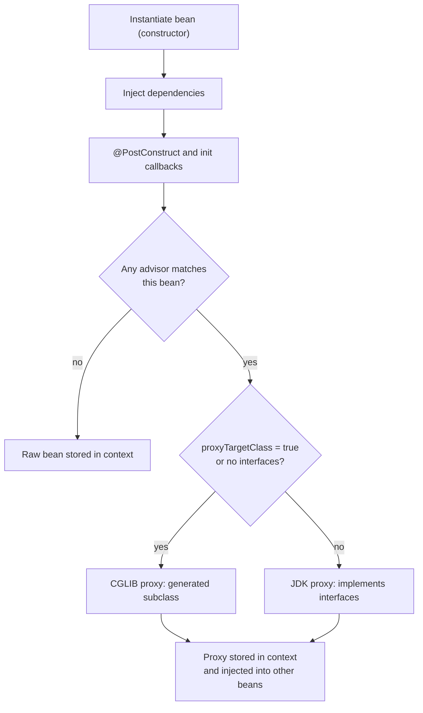
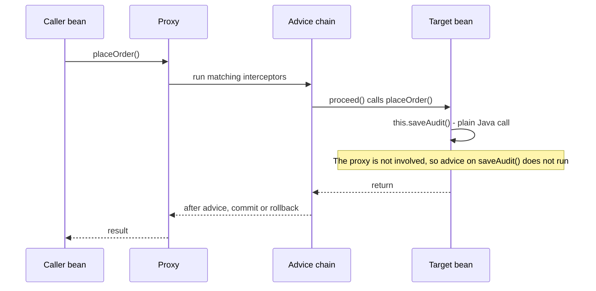

# AOP & Proxies (JDK vs CGLIB, Self-Invocation Pitfall)

!!! warning "Draft: not yet fact-checked"
    This page was written but its independent review pass has not run yet. Verify version numbers and defaults against the linked sources.


!!! abstract "TL;DR"
    - Spring AOP is **proxy-based**: the container hands callers a wrapper object, and advice runs only when a call **goes through that wrapper**. `@Transactional`, `@Cacheable`, `@Async`, `@PreAuthorize`, `@Retryable` and `@Observed` all work this way.
    - **JDK dynamic proxy** = implements the bean's interfaces (interface-based). **CGLIB proxy** = a runtime-generated **subclass** of the bean (class-based). Spring Framework picks JDK when an interface exists; **Spring Boot defaults to CGLIB** (`spring.aop.proxy-target-class=true`).
    - **Self-invocation** (`this.other()`) never touches the proxy, so the annotation on `other()` is silently ignored. Fix it by moving the method to another bean; self-injection, `TransactionTemplate` or AspectJ weaving are the fallbacks.
    - CGLIB cannot advise **`final` classes, `final` methods or `private` methods**. A `final` method on a CGLIB proxy runs on the proxy instance itself, whose fields are `null`.
    - Proxies are created by a **`BeanPostProcessor`** after initialisation, so advice is not active in constructors or `@PostConstruct`.

## Why it matters

Some logic is needed everywhere but belongs nowhere: transactions, security checks, caching, retries, metrics, audit logging. These are **cross-cutting concerns**. Without AOP, every service method repeats the same `try / begin / commit / rollback / finally` code, and one forgotten copy becomes a production bug.

AOP (aspect-oriented programming) lets you write that logic once and declare *where* it applies. In Spring you rarely write aspects yourself, but you use them all day: almost every "magic" annotation is an aspect applied through a proxy.

That is why interviewers love this topic. The questions "why did my `@Transactional` not start a transaction?" and "why is my `@Cacheable` not caching?" have the same answer, and that answer shows whether you understand what Spring does or only what annotations to type. For transaction semantics themselves see [Transactions](06-transactions-transactional-propagation-isolation-rollback-ru.md). This page covers the mechanism underneath.

## Core concepts

### Vocabulary

| Term | Meaning | Example |
|---|---|---|
| **Aspect** | A class holding cross-cutting logic | `AuditAspect` |
| **Join point** | A point in program execution. In Spring AOP it is always a **method execution** on a Spring bean | `OrderService.place()` being called |
| **Pointcut** | An expression that selects join points | `@annotation(Audited)` |
| **Advice** | The code that runs at a join point | `@Around`, `@Before`, `@AfterReturning`, `@AfterThrowing`, `@After` |
| **Target** | The real bean instance | your `OrderService` object |
| **Proxy** | The wrapper the container gives to callers | `OrderService$$SpringCGLIB$$0` |
| **Weaving** | Linking aspects to targets | Spring: at runtime via proxies. AspectJ: at compile or load time via bytecode |

Spring uses AspectJ's **annotations and pointcut language** (`@Aspect`, `execution(...)`), but not AspectJ's weaver. This is a common confusion: `@EnableAspectJAutoProxy` still means runtime proxies.

### How a proxy gets created

Proxy creation is part of the bean lifecycle (see [IoC & bean lifecycle](01-ioc-and-dependency-injection-bean-scopes-and-lifecycle.md)). A `BeanPostProcessor` called `AnnotationAwareAspectJAutoProxyCreator` inspects every bean after initialisation. If any advisor (an aspect's pointcut plus advice, or a built-in one such as the transaction advisor) matches the bean, it returns a proxy **instead of** the bean. The proxy is what goes into the singleton cache and gets injected everywhere.


*Notice that the proxy is created after `@PostConstruct` runs, and that other beans receive the proxy while the target only ever holds a plain `this` reference to itself.*

Two details worth knowing:

- With a **circular dependency**, Spring may need the proxy earlier. The same post-processor creates it through `getEarlyBeanReference`, so the early reference is still the proxy and not the raw bean.
- In Spring Boot the auto-proxy creator is registered by `AopAutoConfiguration` (see [Auto-configuration](02-auto-configuration-and-starters.md)). You do not need `@EnableAspectJAutoProxy` yourself.

### JDK dynamic proxy vs CGLIB

**JDK dynamic proxy** (`java.lang.reflect.Proxy`) generates a class at runtime that implements a given list of interfaces and forwards every call to an `InvocationHandler`. The proxy is a *sibling* of your class: it shares the interfaces but is not an instance of your class.

**CGLIB proxy** generates a *subclass* of your class at runtime and overrides every overridable method to call an interceptor. The proxy *is* an instance of your class. Spring ships its own repackaged CGLIB (`org.springframework.cglib`), and proxy class names look like `OrderService$$SpringCGLIB$$0`.

| | JDK dynamic proxy | CGLIB proxy |
|---|---|---|
| Mechanism | Implements the bean's interfaces | Subclasses the bean's class |
| Needs an interface | Yes | No |
| `proxy instanceof OrderServiceImpl` | `false` | `true` |
| Inject by concrete class | Fails (`BeanNotOfRequiredTypeException`) | Works |
| What can be advised | Methods declared on the proxied interfaces | Any non-final, non-private method visible to the subclass |
| `final` class | Fine | Cannot be proxied (startup error) |
| `final` method | Fine (if on the interface) | Not advised, and runs on the proxy instance |
| Constructor | Target is constructed normally | Proxy instance is created with Objenesis, so the constructor is **not** run a second time |
| Default in | Plain Spring Framework when the bean has an interface | Spring Boot (since 2.0) |

**Defaults, precisely:**

- **Spring Framework:** if the target implements at least one interface, use a JDK proxy; otherwise use CGLIB.
- **Spring Boot:** `spring.aop.proxy-target-class=true` by default, so beans get CGLIB proxies even when they implement interfaces. Boot made this change to avoid confusing injection failures when someone injects the concrete class. Set the property to `false` to get the framework behaviour back.
- **Spring Framework 7 / Boot 4:** `@Proxyable(INTERFACES)` or `@Proxyable(TARGET_CLASS)` on a `@Component` class or `@Bean` method overrides the global default for one bean.

Performance is not a reason to choose one over the other on modern JVMs. The difference is negligible next to the I/O the advised method usually does. Choose based on design constraints: interfaces, `final`, and how beans are injected.

### What happens on a call

When a call reaches the proxy, Spring builds a chain of interceptors that match this method and runs them like a filter chain. Each one calls `proceed()` to move inward, and the last `proceed()` invokes the real method on the target.


*Notice that the only arrow passing through the advice chain is the first one. The call from the target to itself is an ordinary method call on `this` and never returns to the proxy.*

### The self-invocation pitfall

This is the single most asked AOP question. Inside the target, `saveAudit()` means `this.saveAudit()`, and `this` is the raw object, not the proxy. So annotations on `saveAudit()` do nothing when it is called from another method of the same class.

Many people expect CGLIB to solve this, since the proxy is a subclass and subclasses override methods. It does not. Spring's CGLIB proxy **delegates to a separate target instance**. It does not call `super.method()` on itself. So once execution is inside the target, `this` is the target, and the overridden methods on the proxy are out of the picture.

Fixes, in the order the Spring documentation recommends them:

1. **Refactor so the call crosses a bean boundary.** Move the advised method to another bean. This is usually also the better design.
2. **Inject a self reference** (the proxy of the same bean) and call through it.
3. **`AopContext.currentProxy()`** with `exposeProxy = true`. It couples your code to Spring AOP and relies on a thread-local. Treat it as a last resort.
4. **Avoid the proxy altogether:** use `TransactionTemplate` for programmatic transactions, or switch to **AspectJ weaving** (`@EnableTransactionManagement(mode = AdviceMode.ASPECTJ)`), which changes the bytecode of the class itself and therefore handles self-invocation, private methods and non-bean objects.

### Advice types and ordering

- `@Before` runs before the method. It cannot stop the call except by throwing.
- `@AfterReturning` runs on normal return and can see the return value.
- `@AfterThrowing` runs when an exception leaves the method.
- `@After` runs in both cases, like `finally`.
- `@Around` wraps the call. It decides whether and when to call `proceed()`, can change arguments and the return value, and can swallow or translate exceptions. It is the most powerful advice, so use the weakest advice that does the job.

**Across aspects**, order is set by `@Order` or `Ordered`. A **lower value means higher precedence**: that aspect runs first on the way in and last on the way out, so it is the outermost wrapper. Without an explicit order, the order is undefined.

**Within one aspect class** (since Spring 5.2.7) advice on the same join point runs in a fixed precedence: `@Around`, `@Before`, `@After`, `@AfterReturning`, `@AfterThrowing`. In practice `@After` is invoked after `@AfterReturning` or `@AfterThrowing`, because it follows "finally" semantics.

Ordering matters for built-in aspects too. A retry aspect must sit **outside** the transaction aspect so each attempt gets a fresh transaction. A security aspect should sit outside a cache aspect so a cache hit is never served to an unauthorised caller.

### Spring AOP vs full AspectJ

| | Spring AOP (proxies) | AspectJ (compile-time or load-time weaving) |
|---|---|---|
| How | Runtime wrapper object | Bytecode of the class is modified |
| Join points | Method execution on Spring beans only | Method call and execution, constructors, field access, static methods |
| Self-invocation | Not intercepted | Intercepted |
| Private or final methods | Not advised | Advised |
| Objects created with `new` | Not advised | Advised |
| Setup | None in Spring Boot | `ajc` compiler plugin or a Java agent |
| Use when | Almost always | You truly need the cases above and accept the build complexity |

## In practice: code & configuration

### A custom aspect

```java
@Target(ElementType.METHOD)
@Retention(RetentionPolicy.RUNTIME)            // must be RUNTIME or the pointcut cannot see it
public @interface Audited {
    String action();
}

@Aspect
@Component                                      // an aspect must itself be a Spring bean
@Order(Ordered.HIGHEST_PRECEDENCE + 10)         // outermost: audit even when security or tx advice fails
class AuditAspect {

    private static final Logger log = LoggerFactory.getLogger(AuditAspect.class);
    private final AuditPublisher publisher;

    AuditAspect(AuditPublisher publisher) {
        this.publisher = publisher;
    }

    // Binding the annotation as a parameter is type-safe and narrows the pointcut to annotated methods only
    @Around("@annotation(audited)")
    Object audit(ProceedingJoinPoint pjp, Audited audited) throws Throwable {
        long start = System.nanoTime();
        String outcome = "SUCCESS";
        try {
            return pjp.proceed();               // forgetting this silently skips the real method
        } catch (Throwable ex) {
            outcome = "FAILURE";
            throw ex;                           // rethrow: never swallow, or @Transactional will not roll back
        } finally {
            long ms = Duration.ofNanos(System.nanoTime() - start).toMillis();
            // Log identifiers only. Arguments may hold PHI or PII, so never log pjp.getArgs() blindly
            publisher.publish(audited.action(), pjp.getSignature().toShortString(), outcome, ms);
            log.debug("audit action={} outcome={} tookMs={}", audited.action(), outcome, ms);
        }
    }
}
```

Useful pointcut designators:

```java
@Pointcut("execution(public * com.acme.claims..service.*.*(..))")  // by method signature
void serviceLayer() {}

@Pointcut("within(@org.springframework.stereotype.Service *)")     // any method in a @Service class
void inService() {}

@Pointcut("@annotation(com.acme.audit.Audited)")                   // method carries the annotation
void audited() {}

@Pointcut("serviceLayer() && !audited()")                          // pointcuts compose with && || !
void unauditedService() {}
```

Keep pointcuts narrow. A broad pointcut such as `execution(* *(..))` makes Spring try to proxy infrastructure beans, slows startup and can fail on `final` classes from libraries.

### The self-invocation bug and its fixes

=== "❌ Common mistake"
    ```java
    @Service
    class ClaimService {

        private final ClaimRepository claims;
        private final AuditRepository audits;

        ClaimService(ClaimRepository claims, AuditRepository audits) {
            this.claims = claims;
            this.audits = audits;
        }

        @Transactional
        public void submit(Claim claim) {
            claims.save(claim);
            saveAudit(claim);                    // this.saveAudit(): bypasses the proxy
            throw new IllegalStateException("downstream validation failed");
        }

        // Intention: the audit row must survive even if submit() rolls back.
        // Reality: REQUIRES_NEW is ignored. The audit joins the outer tx and is rolled back with it.
        @Transactional(propagation = Propagation.REQUIRES_NEW)
        public void saveAudit(Claim claim) {
            audits.save(AuditEntry.attempted(claim.id()));
        }
    }
    ```

=== "✅ Correct approach"
    ```java
    @Service
    class ClaimService {

        private final ClaimRepository claims;
        private final ClaimAuditService auditService;   // a different bean, so we hold its proxy

        ClaimService(ClaimRepository claims, ClaimAuditService auditService) {
            this.claims = claims;
            this.auditService = auditService;
        }

        @Transactional
        public void submit(Claim claim) {
            auditService.saveAudit(claim);       // crosses a bean boundary: advice runs, new tx commits
            claims.save(claim);
            throw new IllegalStateException("downstream validation failed");
        }
    }

    @Service
    class ClaimAuditService {

        private final AuditRepository audits;

        ClaimAuditService(AuditRepository audits) {
            this.audits = audits;
        }

        @Transactional(propagation = Propagation.REQUIRES_NEW)
        public void saveAudit(Claim claim) {
            audits.save(AuditEntry.attempted(claim.id()));
        }
    }
    ```

When a refactor is not practical, these also work:

```java
// Option A: programmatic transaction. No proxy needed, the boundary is explicit in the code.
@Service
class ClaimService {
    private final TransactionTemplate requiresNew;

    ClaimService(PlatformTransactionManager txManager) {
        this.requiresNew = new TransactionTemplate(txManager);
        this.requiresNew.setPropagationBehavior(TransactionDefinition.PROPAGATION_REQUIRES_NEW);
    }

    private void saveAudit(Claim claim) {
        requiresNew.executeWithoutResult(status -> audits.save(AuditEntry.attempted(claim.id())));
    }
}

// Option B: self-injection. @Lazy gives a lazy proxy and avoids a circular reference to itself.
@Service
class ReportService {
    private final ReportService self;

    ReportService(@Lazy ReportService self) {
        this.self = self;
    }

    public Report build(String id) {
        return self.loadCached(id);              // goes through the proxy, so @Cacheable applies
    }

    @Cacheable("reports")
    public Report loadCached(String id) { /* expensive call */ return null; }
}

// Option C: AopContext. Needs @EnableAspectJAutoProxy(exposeProxy = true). Last resort.
((ReportService) AopContext.currentProxy()).loadCached(id);
```

### Checking and configuring the proxy

```java
AopUtils.isAopProxy(bean);                 // true for either proxy type
AopUtils.isCglibProxy(bean);               // true for class-based proxies
AopUtils.isJdkDynamicProxy(bean);
AopUtils.getTargetClass(bean);             // the real class, useful in logs and tests
AopProxyUtils.ultimateTargetClass(bean);   // unwraps nested proxies
```

```yaml
spring:
  aop:
    proxy-target-class: true    # Boot default. false = JDK proxies where interfaces exist
```

A stack trace tells you a lot. Frames such as `CglibAopProxy$DynamicAdvisedInterceptor.intercept` and `TransactionInterceptor.invoke` prove the call went through the proxy. If those frames are missing between the caller and your method, the advice was bypassed.

## Real-world usage

- **Spring itself** is the biggest user. `@Transactional` (`TransactionInterceptor`), `@Cacheable` (`CacheInterceptor`), `@Async`, method security (`@PreAuthorize`), `@Validated` method validation, and Micrometer's `@Observed` and `@Timed` are all advice applied through proxies. `@Configuration` classes are CGLIB-enhanced too (a related but separate mechanism), which is how calling one `@Bean` method from another returns the same singleton.
- **Resilience libraries** such as Resilience4j (`@CircuitBreaker`, `@Retry`, `@RateLimiter`) and Spring Retry (`@Retryable`) are Spring AOP aspects. The self-invocation limit applies to them in exactly the same way, and aspect order decides whether the retry wraps the circuit breaker or the other way round.
- **Typical incident pattern.** The most common real failures are silent ones: data is partly committed because a `@Transactional` method was called internally, a cache has a zero hit rate because `@Cacheable` was called from the same class, or an `@Async` method blocks the request thread. Nothing throws, so these are usually found in production through data inconsistencies or latency graphs and not in code review.
- **Healthcare and banking.** Audit trails ("who accessed which member's record") and method-level authorisation are natural AOP use cases, because they must apply uniformly and must not depend on each developer remembering them. The two rules that matter in regulated systems: never log raw arguments (they contain PHI or PII), and never rely on a proxy for a security check on a method that can be reached by an internal call. A `@PreAuthorize` method called from inside its own class is an authorisation bypass.
- **GraalVM native image.** A native image cannot generate classes at runtime. Spring's AOT processing creates the CGLIB proxy classes at build time and registers JDK proxy hints, so proxies must be known at build time. See [Spring Boot 3.x](10-spring-boot-3-x-jakarta-ee-graalvm-native-image-virtual-thre.md).

## Trade-offs & production gotchas

| Option | Pros | Cons | Use when |
|---|---|---|---|
| CGLIB proxy (Boot default) | No interface needed; inject by class or interface | No `final` classes or methods; subclass generation; advice only on overridable methods | Default choice in Spring Boot |
| JDK dynamic proxy | Plain JDK feature; enforces programming to interfaces; `final` classes are fine | Only interface methods advised; injecting the concrete class fails | Interface-first codebases, or a bean that must stay `final` |
| Self-injection or `AopContext` | Small change, keeps code in one class | Hides a design smell; couples code to the proxy model | Tactical fix when a refactor is too costly |
| Programmatic (`TransactionTemplate`, `CacheManager`, `RetryTemplate`) | Explicit, works anywhere, easy to unit test | More code; cross-cutting logic leaks into business code | Fine-grained boundaries inside one method |
| AspectJ weaving | Handles self-invocation, private methods, non-bean objects | Build or agent setup, harder debugging, team must understand it | A real need that proxies cannot meet |

!!! warning "Gotcha: `final` methods on a CGLIB proxy"
    A `final` method cannot be overridden, so the call is not delegated to the target. It runs **on the proxy instance**. That instance was created with Objenesis without running the constructor, so its injected fields are `null`, and you get a confusing `NullPointerException` inside a method that "obviously" has its dependencies. Kotlin classes are `final` by default, which is why Spring projects in Kotlin use the `kotlin-spring` (all-open) compiler plugin.

!!! warning "Gotcha: private, static and non-bean code"
    Annotations on `private` methods are ignored by proxies without any error. Since Spring 6.0, `protected` and package-visible methods can be transactional with class-based proxies, but `private` never works. Static methods and objects you create with `new` are never advised, because the container never had a chance to wrap them.

!!! warning "Gotcha: advice is not active during initialisation"
    The proxy is created after `@PostConstruct`. Calling a `@Transactional` or `@Cacheable` method from a constructor or `@PostConstruct` runs it without advice. Use an `ApplicationReadyEvent` listener or an `ApplicationRunner` that calls **another** bean.

!!! warning "Gotcha: swallowing exceptions in `@Around`"
    An `@Around` advice that catches an exception and returns a default hides the failure from every aspect outside it. If it sits inside the transaction aspect, the transaction commits. Also, an advice returning `null` for a method with a primitive return type causes an `AopInvocationException`.

!!! warning "Gotcha: JDK proxy and injection by class"
    With `proxy-target-class=false`, `@Autowired OrderServiceImpl service` fails with `BeanNotOfRequiredTypeException`, because the proxy implements `OrderService` but is not an `OrderServiceImpl`. Inject the interface.

!!! tip "Testing"
    A unit test that does `new ClaimService(...)` has no proxy, so no advice runs and the self-invocation bug is invisible. Tests that check transactional, caching or security behaviour need a Spring context (`@SpringBootTest` or a slice), and should assert the outcome (row committed, cache hit, access denied).

## How this connects to my experience

- **Where I used it:**
    - **Publicis Sapient, OptumRx Meteor:** "Implemented Redis-based caching for frequently accessed queries and UI reference data." If this used Spring's cache abstraction (`@Cacheable`) *[confirm]*, it is proxy-based, and the self-invocation rule decides whether a lookup is cached.
    - **Publicis Sapient, OptumRx Meteor:** "Designed and developed microservices using Java, Spring Boot, Kafka, MongoDB, Redis, and GraphQL" and "Designed Kafka-based event-driven workflows with retry and DLQ handling." `@Transactional` on MongoDB writes and any annotation-based retry are AOP advice *[confirm which of these were used]*.
    - **Publicis Sapient, OptumRx Meteor:** "Built secure enterprise APIs using OAuth2, PingFederate, and Active Directory integration." Method-level checks with `@PreAuthorize` are proxies *[confirm whether method security was used, or only URL-level rules]*.
    - **Johnson Controls, Metasys:** "Implemented Spring Security authorization controls and API security mechanisms." Method security is the classic AOP example *[confirm]*.
    - **Publicis Sapient:** "Established engineering standards around testing, CI/CD, code quality." A code-review rule such as "no internal calls to annotated methods" fits here *[confirm]*.
- **Talking points:**
    - "In the GraphQL Consumer Service we cached reference data in Redis. A rule I enforce in reviews is that a cached or transactional method must be called from another bean, because annotations work through proxies and an internal call skips them." *[confirm this matches how the caching was built]*
    - "For audit and access logging in a healthcare system I prefer an aspect with a custom annotation, so the behaviour is uniform, and I log identifiers only, never method arguments, because they may hold PHI."
    - "I think about aspect order explicitly: security outside cache, retry outside transaction. Getting it wrong means serving cached data to the wrong user or retrying inside a transaction that is already marked rollback-only."
    - "I have not needed AspectJ weaving in production. Restructuring beans or using `TransactionTemplate` solved the cases I met." *[confirm]*
- **Likely follow-up chain:**
    - *"How does `@Cacheable` work?"* → A `BeanPostProcessor` wraps the bean in a proxy. `CacheInterceptor` builds the key, checks the cache, and only calls `proceed()` on a miss.
    - *"So what if you call it from the same class?"* → It is `this.method()`, the proxy is bypassed, and the method runs every time. Move it to a separate bean, or call the `CacheManager` directly.
    - *"JDK or CGLIB in your service?"* → Spring Boot defaults to CGLIB, so a subclass proxy even when there is an interface. That means no `final` classes or methods on advised beans.
    - *"How would you prove the proxy is in play?"* → Check `AopUtils.isAopProxy`, look for `CglibAopProxy` and the interceptor in the stack trace, and write an integration test that asserts a second call does not hit the upstream.

## Interview questions

### Fundamentals

??? question "Q1. What is AOP, and what problem does it solve in Spring?"
    **Answer:** AOP separates cross-cutting concerns (transactions, security, caching, logging, metrics, retries) from business logic. You write the concern once as an aspect and declare with a pointcut where it applies. Spring implements it with runtime proxies: the container wraps the bean, and the wrapper runs the advice before, after or around the real method. Most Spring annotations such as `@Transactional`, `@Cacheable`, `@Async` and `@PreAuthorize` are built on this.

    **Interviewer listens for:** "cross-cutting concern", "proxy-based", and real examples from Spring itself, not only logging.

    **Common wrong answer:** "AOP is for logging." Logging is the textbook example, but the important uses are transactions, security and caching.

??? question "Q2. Explain aspect, join point, pointcut, advice and weaving."
    **Answer:** An **aspect** is the module containing cross-cutting logic. A **join point** is a point in execution where logic can be attached; in Spring AOP it is always a method execution on a bean. A **pointcut** is the expression selecting join points. **Advice** is the code that runs there (`@Before`, `@AfterReturning`, `@AfterThrowing`, `@After`, `@Around`). **Weaving** is how aspects are linked to targets: Spring does it at runtime by creating proxies, AspectJ does it at compile time or load time by changing bytecode.

    **Interviewer listens for:** That Spring AOP supports only method-execution join points on Spring beans.

??? question "Q3. What is the difference between a JDK dynamic proxy and a CGLIB proxy?"
    **Answer:** A JDK dynamic proxy is a runtime class that implements the bean's interfaces and forwards calls to an `InvocationHandler`. It needs at least one interface and can only advise interface methods. A CGLIB proxy is a runtime-generated subclass of the bean's class. It needs no interface, but it cannot proxy `final` classes and cannot advise `final` or `private` methods. With JDK proxies the proxy is not an instance of the implementation class; with CGLIB it is.

    **Interviewer listens for:** interface vs subclass, the `final` limitation, and the effect on injection by type.

    **Common wrong answer:** "CGLIB is slower, so avoid it." The performance difference is not meaningful today.

??? question "Q4. Which proxy type does Spring use by default?"
    **Answer:** It depends on what "Spring" means. **Spring Framework** uses a JDK proxy when the bean implements at least one interface and CGLIB otherwise. **Spring Boot** sets `spring.aop.proxy-target-class=true` by default (since Boot 2.0), so you get CGLIB proxies even for beans with interfaces. In Spring Framework 7 you can also override per bean with `@Proxyable`.

    **Interviewer listens for:** The distinction between the framework default and the Boot default. Most candidates only know one.

    **Common wrong answer:** "JDK if there is an interface" stated as the behaviour of a Spring Boot application.

??? question "Q5. What are the advice types, and when would you use `@Around`?"
    **Answer:** `@Before` runs before the method. `@AfterReturning` runs on normal return and can read the result. `@AfterThrowing` runs on an exception. `@After` runs in both cases, like `finally`. `@Around` wraps the whole call and controls whether `proceed()` is called, with which arguments, and what is returned. Use `@Around` when you need state shared before and after (timing), or need to change the flow (caching, retry, transactions). Otherwise use the least powerful advice, because it is harder to get wrong.

    **Interviewer listens for:** `proceed()`, and the "least powerful advice" principle.

### Intermediate

??? question "Q6. What is the self-invocation problem?"
    **Answer:** Advice only runs when a call passes through the proxy. When a method in a bean calls another method of the same bean, the call is `this.method()`, and `this` is the raw target, not the proxy. So any annotation on the second method (`@Transactional`, `@Cacheable`, `@Async`, `@PreAuthorize`, `@Retryable`) is silently ignored. Fixes: move the method to another bean (preferred), inject a self reference and call through it, use `AopContext.currentProxy()` with `exposeProxy=true`, use a programmatic API such as `TransactionTemplate`, or use AspectJ weaving.

    **Interviewer listens for:** The reason (`this` is not the proxy), several fixes, and a stated preference for refactoring.

    **Common wrong answer:** "Make the method public" or "use CGLIB". Neither helps.

??? question "Q7. A CGLIB proxy is a subclass that overrides my methods. Why does self-invocation still bypass it?"
    **Answer:** Because Spring's CGLIB proxy does not run your logic on itself with `super.method()`. It holds a reference to a **separate target instance** and delegates to it after running the interceptor chain. Once execution is inside the target instance, `this` refers to the target, whose methods are the original ones. The overridden versions live on the proxy object, which is no longer involved.

    **Interviewer listens for:** "two objects: proxy and target" and "delegation, not inheritance-based dispatch". This separates people who memorised the rule from people who understand it.

    **Common wrong answer:** "With CGLIB self-invocation works because of polymorphism."

??? question "Q8. Predict the output. `ReportService` has `@Cacheable(\"r\") public Report load(String id)` which prints `LOAD`, and `public Report build(String id) { return load(id); }`. A controller calls `build(\"1\")` twice, then `load(\"1\")` twice."
    **Answer:** `LOAD` is printed **three** times. Both `build` calls reach `load` through `this`, so the cache is bypassed and nothing is stored: two prints. The first direct `load("1")` goes through the proxy, misses the cache, prints `LOAD` and stores the result. The second direct call is a cache hit and prints nothing.

    **Interviewer listens for:** That the internal calls neither read **nor populate** the cache.

    **Common wrong answer:** "Once", assuming the first call cached the value.

??? question "Q9. Why does `@Transactional` on a private method do nothing? What about protected methods?"
    **Answer:** A JDK proxy only exposes interface methods, which are public. A CGLIB proxy works by overriding, and a private method cannot be overridden, so there is nothing to intercept. Spring gives no error; the annotation is just ignored. Since Spring 6.0, `protected` and package-visible methods can be transactional with class-based proxies. In any case a private method can only be called from inside the class, so it would be a self-invocation anyway.

    **Interviewer listens for:** The override mechanics, the 6.0 change, and the link to self-invocation.

??? question "Q10. How is the order of multiple aspects decided? Why does it matter?"
    **Answer:** Across aspects, by `@Order` or the `Ordered` interface. A lower value means higher precedence: that aspect is outermost, so it runs first on the way in and last on the way out. Without explicit order the result is undefined. Inside one aspect class, advice on the same join point follows a fixed precedence: `@Around`, `@Before`, `@After`, `@AfterReturning`, `@AfterThrowing`. It matters for correctness. Retry must wrap the transaction so each attempt gets a new transaction. Security must wrap caching so a cached result is not returned to an unauthorised caller.

    **Interviewer listens for:** "lower value = outermost" and a concrete example where wrong order causes a bug.

??? question "Q11. When exactly is the proxy created? Why does a `@Transactional` method called from `@PostConstruct` not run in a transaction?"
    **Answer:** A `BeanPostProcessor` (`AnnotationAwareAspectJAutoProxyCreator`) creates the proxy in `postProcessAfterInitialization`, after dependency injection and after init callbacks such as `@PostConstruct`. During `@PostConstruct` only the raw bean exists, and the call is a self-invocation anyway. The Spring docs say explicitly not to rely on transactional behaviour in initialisation code. Run start-up work from an `ApplicationRunner` or an `ApplicationReadyEvent` listener that calls another bean.

    **Interviewer listens for:** The bean lifecycle order and a correct alternative.

### Senior

??? question "Q12. When would you choose AspectJ weaving over Spring AOP?"
    **Answer:** When proxies cannot reach the join point: advice on self-invoked or private methods, on objects not managed by Spring (for example domain objects created with `new`, using `@Configurable`), on constructors or field access. AspectJ modifies the class bytecode at compile time (`ajc`) or load time (Java agent), so there is no proxy and no self-invocation issue. The costs are a more complex build or JVM setup, harder debugging, and less obvious behaviour for the team. I would first try restructuring beans or a programmatic API, and use AspectJ only for a clear need.

    **Interviewer listens for:** Concrete capabilities, the operational cost, and a pragmatic default.

??? question "Q13. A bean has a `final` method and is CGLIB-proxied. What happens when the method is called through the proxy?"
    **Answer:** The proxy subclass cannot override a `final` method, so the call is not intercepted and is not delegated to the target. It executes on the proxy object itself. That object was instantiated with Objenesis without calling the constructor, so its fields, including injected dependencies, are `null`. The result is usually a `NullPointerException` on a dependency that is clearly set in the constructor. The fix is to remove `final`, or use an interface with a JDK proxy. A `final` class fails earlier, at startup, because it cannot be subclassed at all.

    **Interviewer listens for:** "runs on the proxy instance", "Objenesis, constructor not called", and the Kotlin all-open link as a bonus.

    **Common wrong answer:** "The method just runs without advice." That is only half of it; the missing state is the dangerous part.

??? question "Q14. How do proxies interact with GraalVM native images?"
    **Answer:** A native image has a closed world and cannot generate classes at runtime. Spring's AOT engine runs at build time, works out which beans need proxies, generates the CGLIB subclasses as real classes, and registers reflection and JDK-proxy hints. Consequences: beans and conditions are fixed at build time, and anything that creates a proxy dynamically outside what AOT can see needs explicit `RuntimeHints` (for example `hints.proxies().registerJdkProxy(...)`).

    **Interviewer listens for:** Build-time generation, closed-world assumption, runtime hints.

??? question "Q15. How would you design method-level audit logging for a regulated healthcare service?"
    **Answer:** A custom `@Audited(action = ...)` annotation and an `@Around` aspect that records who (from the security context), what action, which resource identifier, the outcome and the duration. Design decisions: (1) never log arguments wholesale, extract only approved identifiers, because they may be PHI; (2) give the aspect a high precedence so denied and failed attempts are audited too; (3) decide whether the audit must survive a business rollback, and if so write it in a separate transaction or publish it as an event after the outcome is known; (4) rethrow exceptions unchanged; (5) add an architecture test (for example ArchUnit) that fails the build when an annotated method is private, final or called from inside its own class; (6) cover it with an integration test, since a unit test has no proxy.

    **Interviewer listens for:** Data protection, aspect ordering, failure paths, and guarding against the silent-bypass cases.

### Scenario-based

??? question "Q16. After a release, a method marked `@Async` blocks the HTTP request thread. How do you investigate?"
    **Answer:** `@Async` is proxy-based, so I check the usual bypasses. (1) Is it called from the same class? Then it is a self-invocation and runs on the caller's thread. (2) Is the method private or final, or is the object created with `new` and not a Spring bean? (3) Is `@EnableAsync` present? (4) I log the thread name inside the method and look at the stack trace: if `AsyncExecutionInterceptor` is missing, the proxy was not used. The fix is normally to move the async method to its own bean. I would add an integration test asserting that the method runs on an executor thread.

    **Interviewer listens for:** A systematic list of proxy-bypass causes and a way to prove the diagnosis from evidence.

??? question "Q17. A team turns on `spring.aop.proxy-target-class=false` and the app fails to start with `BeanNotOfRequiredTypeException`. Why?"
    **Answer:** With JDK proxies the proxy implements the bean's interfaces but is not an instance of the implementation class. Somewhere a bean is injected by its concrete type, for example `@Autowired PaymentServiceImpl`, and the container holds a `com.sun.proxy`/`jdk.proxy` object that is only a `PaymentService`. Fix it by injecting the interface, or keep class-based proxies for that bean (globally, or with `@Proxyable(TARGET_CLASS)` in Spring Framework 7). This exact confusion is why Spring Boot defaults to CGLIB.

    **Interviewer listens for:** "proxy is a sibling, not a subclass" and the history behind the Boot default.

??? question "Q18. In production, an order row is committed even though the method threw an exception. The method has `@Transactional`. What do you check?"
    **Answer:** First, whether a transaction existed at all. Proxy bypass causes: the method is called from another method in the same class that is not transactional, it is private or final, or the object is not a Spring bean. In those cases each repository call runs in its own auto-committed transaction. Second, if the proxy is in play, rollback rules: by default only unchecked exceptions and `Error` trigger rollback, so a checked exception commits unless `rollbackFor` is set. Third, an inner aspect or a `try/catch` that swallows the exception, so the transaction interceptor never sees it. I would confirm with transaction debug logging (`org.springframework.transaction.interceptor=TRACE`) and by checking the stack trace for `TransactionInterceptor`. Details of rollback rules are on the [Transactions](06-transactions-transactional-propagation-isolation-rollback-ru.md) page.

    **Interviewer listens for:** Separating "no transaction" from "transaction did not roll back", and using logs to tell them apart.

    **Common wrong answer:** Jumping straight to isolation levels or the database.

## Cheat sheet

| Concept | Remember |
|---|---|
| Spring AOP model | Runtime proxies; method execution on Spring beans only |
| JDK proxy | Implements interfaces; not an instance of the impl class |
| CGLIB proxy | Generated subclass; delegates to a separate target instance |
| Framework default | JDK if the bean has an interface, else CGLIB |
| Boot default | CGLIB (`spring.aop.proxy-target-class=true`) |
| Per-bean override | `@Proxyable` (Spring Framework 7+) |
| Self-invocation | `this.method()` skips the proxy, so the annotation is ignored |
| Best fix | Move the advised method to another bean |
| Other fixes | Self-injection, `AopContext.currentProxy()`, `TransactionTemplate`, AspectJ |
| Not advised | `private`, `final`, `static` methods; objects made with `new` |
| `final` on CGLIB | Runs on the proxy instance, fields are `null` |
| Proxy creation | `BeanPostProcessor` after init; not active in `@PostConstruct` |
| Aspect order | `@Order`: lower value = outermost |
| Same-aspect order | `@Around`, `@Before`, `@After`, `@AfterReturning`, `@AfterThrowing` |
| `@Around` rules | Call `proceed()`, rethrow exceptions, never return `null` for primitives |
| Debugging | `AopUtils.isAopProxy`, look for the interceptor in the stack trace |
| Testing | Needs a Spring context; `new Service()` has no proxy |

## Sources

1. [Spring Framework Reference: Proxying Mechanisms](https://docs.spring.io/spring-framework/reference/core/aop/proxying.html): JDK vs CGLIB selection, CGLIB limits (`final`, `private`, visibility), Objenesis, self-invocation and the recommended fixes, `@Proxyable` in 7.0.
2. [Spring Framework Reference: Declaring Advice](https://docs.spring.io/spring-framework/reference/core/aop/ataspectj/advice.html): advice types, `proceed()`, ordering across aspects and within one aspect (since 5.2.7).
3. [Spring Framework Reference: AOP Concepts](https://docs.spring.io/spring-framework/reference/core/aop/introduction-defn.html): terminology, and that Spring AOP supports method-execution join points only.
4. [Spring Framework Reference: Using @Transactional](https://docs.spring.io/spring-framework/reference/data-access/transaction/declarative/annotations.html): method visibility rules (6.0), self-invocation in proxy mode, no reliance on advice in `@PostConstruct`, AspectJ mode.
5. [Spring Framework Reference: Choosing which AOP Declaration Style to Use / Spring AOP or full AspectJ](https://docs.spring.io/spring-framework/reference/core/aop/choosing.html): when proxies are enough and when AspectJ weaving is needed.
6. [Spring Boot Reference: Aspect-Oriented Programming](https://docs.spring.io/spring-boot/reference/features/aop.html): Boot's AOP auto-configuration and the `spring.aop.proxy-target-class` default.
7. [Spring Framework Reference: Ahead of Time Optimizations](https://docs.spring.io/spring-framework/reference/core/aot.html): build-time proxy generation and runtime hints for native images.
