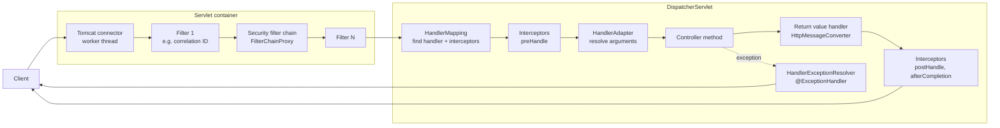
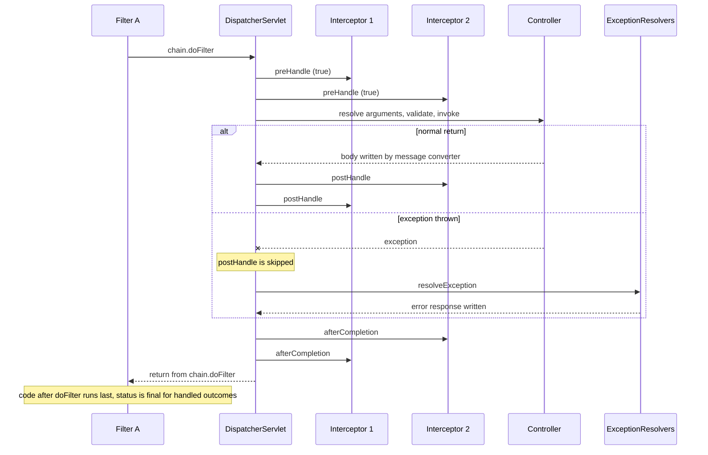

# Spring MVC Request Lifecycle, Filters vs Interceptors, Exception Handling

!!! abstract "TL;DR"
    - A request passes through **two worlds**: the servlet container (**filters**) and then Spring MVC (**`DispatcherServlet`** → `HandlerMapping` → **interceptors** → `HandlerAdapter` → controller).
    - **Filters** are Servlet API, run for *every* request (static files, `/error`, unmapped URLs), can **wrap or replace** the request and response, and know nothing about the controller. **Interceptors** are Spring MVC, run only when a handler was found, and **know the handler method** but should not replace the request/response.
    - Interceptor callbacks: `preHandle` (in order, can short-circuit) → controller → `postHandle` (reverse order, **skipped on exception**) → `afterCompletion` (reverse order, always, only for interceptors whose `preHandle` returned `true`).
    - `@ExceptionHandler` / `@RestControllerAdvice` only catch exceptions thrown **inside `DispatcherServlet`** (controller, argument resolution, interceptors). An exception thrown in a **filter** never reaches them. It goes to the container's error path and Boot's `/error` (`BasicErrorController`).
    - Resolver order: `ExceptionHandlerExceptionResolver` → `ResponseStatusExceptionResolver` → `DefaultHandlerExceptionResolver`. Modern error bodies use **`ProblemDetail` (RFC 9457)** via `ResponseEntityExceptionHandler`.

## Why it matters

Almost every cross-cutting feature of a web service (authentication, correlation IDs, logging, rate limiting, tenant resolution, error format) is attached somewhere on the request path. Picking the wrong hook creates bugs that are hard to see: an error response with a different JSON shape, a `401` that returns HTML, an MDC value leaking between users, a metric that is never recorded for failed requests.

Before Spring MVC, each servlet parsed parameters, called business code and wrote the response by hand. Spring MVC applies the **Front Controller** pattern: one servlet (`DispatcherServlet`) receives everything and delegates each step to a pluggable strategy. Knowing those strategies and their order is what lets you answer "where would you put X?" with a reason, which is exactly what senior interviews probe.

## Core concepts

### The two layers

1. **Servlet container layer** (Tomcat, Jetty, Undertow). Tomcat accepts the connection, parses HTTP, picks a worker thread (platform thread from a pool of 200 by default, or a virtual thread when `spring.threads.virtual.enabled=true`), builds the `FilterChain` and calls it. The last element of the chain is the servlet.
2. **Spring MVC layer.** The servlet is `DispatcherServlet`, mapped to `/` by Spring Boot. Everything Spring MVC does happens inside its `doDispatch()` method.


*Notice that filters sit outside `DispatcherServlet`, so anything they throw is invisible to `@ExceptionHandler`, while interceptors and the controller sit inside it.*

### Inside DispatcherServlet.doDispatch()

For each request `DispatcherServlet` does the following, in this order:

1. **Multipart check.** If the request is multipart, wrap it using `MultipartResolver`.
2. **Find the handler.** Ask each `HandlerMapping` in order. For annotated controllers that is `RequestMappingHandlerMapping`, which matches path, HTTP method, `consumes`, `produces`, params and headers. The result is a **`HandlerExecutionChain`**: the handler (a `HandlerMethod`) plus the interceptors that apply to this path.
3. **No handler?** Since Spring Framework 6.1 a `NoHandlerFoundException` or `NoResourceFoundException` is raised and resolved to `404` like any other exception. (Before 6.1 the servlet called `sendError(404)` directly unless you set `throwExceptionIfNoHandlerFound`.)
4. **Pick a `HandlerAdapter`.** `RequestMappingHandlerAdapter` knows how to invoke a `@RequestMapping` method.
5. **`preHandle`** on each interceptor, in order. If one returns `false`, processing stops and that interceptor is responsible for the response.
6. **Invoke the handler.**
    - `HandlerMethodArgumentResolver`s build each parameter: `@PathVariable`, `@RequestParam`, `@RequestHeader`, and `@RequestBody` (which uses an **`HttpMessageConverter`**, usually Jackson, selected by `Content-Type`).
    - Data binding, type conversion and `@Valid` validation happen here, before your method body runs.
    - Your method runs.
    - `HandlerMethodReturnValueHandler`s process the result. For `@ResponseBody` / `ResponseEntity`, content negotiation picks a converter from the `Accept` header and **the body is written to the response here**.
7. **`postHandle`** on interceptors, in reverse order. Skipped if an exception was thrown.
8. **Process the result.** If an exception was thrown, run the `HandlerExceptionResolver` chain. If there is a `ModelAndView` (server-side views), resolve the view through `ViewResolver` and render it. For REST there is no view.
9. **`afterCompletion`** on interceptors, in reverse order, with the exception (if it was not resolved).

!!! tip "The one sentence version"
    `HandlerMapping` decides **who** handles it, `HandlerAdapter` decides **how** to call it, `HttpMessageConverter` decides **how bytes become objects and back**, `HandlerExceptionResolver` decides **what an exception looks like on the wire**.

### Filters

A `jakarta.servlet.Filter` has one method that matters: `doFilter(request, response, chain)`. Code before `chain.doFilter(...)` runs on the way in, code after it runs on the way out, and not calling it short-circuits the request.

Key properties:

- **Container-managed, but Spring-aware in Boot.** Any `Filter` bean is registered automatically for `/*`. Use `FilterRegistrationBean` to set URL patterns, order or dispatcher types, or to *disable* auto-registration of a filter bean.
- **Can wrap request and response.** This is the only place you can substitute an `HttpServletRequestWrapper` (cached body, extra headers) or a response wrapper (compression, body capture). Everything downstream sees the wrapper.
- **Ordering** through `@Order`, `Ordered` or `FilterRegistrationBean.setOrder`. Lower value runs first. The Spring Security chain is registered at order `-100` by default (`spring.security.filter.order`), so a filter that must run before security needs a lower number.
- **Dispatcher types.** One HTTP request can enter the chain more than once: `REQUEST`, then `ERROR` (forward to `/error`), `ASYNC` (resume after `DeferredResult`/`Callable`), `FORWARD`, `INCLUDE`. **`OncePerRequestFilter`** guarantees a single execution per request and, by default, skips `ASYNC` and `ERROR` dispatches.

**Spring Security lives here.** The container sees one filter, `DelegatingFilterProxy`, which delegates to the `FilterChainProxy` bean, which runs the matching `SecurityFilterChain` (about 15 filters: CSRF, bearer token authentication, `ExceptionTranslationFilter`, `AuthorizationFilter`...). This is why a rejected JWT never reaches your controller advice.

### Interceptors

A `HandlerInterceptor` is a Spring MVC concept registered through `WebMvcConfigurer.addInterceptors`, with `addPathPatterns` / `excludePathPatterns`.

| Callback | When | Typical use |
|---|---|---|
| `preHandle(req, res, handler)` | After handler lookup, before argument resolution | Check an annotation on the handler method, resolve tenant, start a timer. Return `false` to stop. |
| `postHandle(req, res, handler, mav)` | After the controller returned normally, before view rendering | Add model attributes for server-side views. |
| `afterCompletion(req, res, handler, ex)` | After everything, success or failure | Cleanup, timing, audit. |

What makes interceptors different from filters is the `handler` argument. You can cast it to `HandlerMethod` and read annotations (`handlerMethod.getMethodAnnotation(RateLimited.class)`), which a filter cannot do because the handler has not been chosen yet.

!!! warning "postHandle is too late for REST responses"
    With `@ResponseBody` or `ResponseEntity`, the `HttpMessageConverter` writes and may commit the response **inside** the handler adapter, before `postHandle`. Adding a header in `postHandle` silently does nothing. Use **`ResponseBodyAdvice`** (declared on a `@ControllerAdvice`) to change the body or headers before they are written, or set headers in a filter before `chain.doFilter`.

### The full sequence, including order


*Notice that `postHandle` and `afterCompletion` run in reverse order, that `postHandle` disappears on the exception path, and that the filter is the only place that runs for every outcome. It sees the final status whenever the response was produced inside the chain. If an exception escapes the chain, the container sets `500` only afterwards.*

### Exception handling

When the controller, an argument resolver, a message converter or an interceptor throws, `DispatcherServlet` catches it and asks the `HandlerExceptionResolver` chain. The default chain, in order:

1. **`ExceptionHandlerExceptionResolver`**: finds an `@ExceptionHandler` method. It looks **in the controller first**, then in `@ControllerAdvice` beans in `@Order` order. Within one class the **closest match in the exception type hierarchy** wins. It also matches against the exception's causes, so a wrapped exception can still be handled.
2. **`ResponseStatusExceptionResolver`**: handles exceptions annotated with `@ResponseStatus` and `ResponseStatusException`.
3. **`DefaultHandlerExceptionResolver`**: maps Spring's own exceptions to status codes (`HttpRequestMethodNotSupportedException` → 405, `HttpMediaTypeNotSupportedException` → 415, `HttpMessageNotReadableException` → 400, `MethodArgumentNotValidException` → 400, and so on).

If **no resolver** handles it, the exception leaves `DispatcherServlet`, the container marks the request as failed and does an **`ERROR` dispatch** to the error page. Spring Boot registers `/error`, served by **`BasicErrorController`**, which produces the familiar `{timestamp, status, error, path}` JSON (or the "Whitelabel" HTML page for browsers). The same path is used for `response.sendError(...)` and for exceptions thrown in filters.

**`ProblemDetail` (RFC 9457, which replaced RFC 7807).** Since Spring Framework 6, the standard error body is `application/problem+json` with `type`, `title`, `status`, `detail`, `instance` plus custom properties. Extend **`ResponseEntityExceptionHandler`** in your advice to get this format for all built-in MVC exceptions, or set `spring.mvc.problemdetails.enabled=true` in Boot to register one for you. Spring's own exceptions implement `ErrorResponse`, so they know their status and problem body.

Validation failures to know by name:

| Situation | Exception | Default status |
|---|---|---|
| `@Valid @RequestBody` fails | `MethodArgumentNotValidException` | 400 |
| Constraint directly on `@RequestParam` / `@PathVariable` (Spring 6.1+ built-in method validation) | `HandlerMethodValidationException` | 400 |
| Class-level `@Validated` AOP validation (services, or older controllers) | `ConstraintViolationException` | 500 unless you handle it |
| Malformed JSON | `HttpMessageNotReadableException` | 400 |

Validation itself is covered in [09-validation-rest-clients.md](09-validation-rest-clients.md).

## In practice: code & configuration

### A correlation-ID filter (must wrap everything, so it is a filter)

```java
@Component
@Order(Ordered.HIGHEST_PRECEDENCE)                 // before Spring Security (-100), so 401/403 are also traced
class CorrelationIdFilter extends OncePerRequestFilter {

    private static final Logger log = LoggerFactory.getLogger(CorrelationIdFilter.class);
    private static final String HEADER = "X-Correlation-Id";

    @Override
    protected void doFilterInternal(HttpServletRequest req, HttpServletResponse res, FilterChain chain)
            throws ServletException, IOException {
        String id = Optional.ofNullable(req.getHeader(HEADER))
                .filter(h -> h.matches("[A-Za-z0-9-]{1,64}"))   // never trust a client header blindly (log injection)
                .orElseGet(() -> UUID.randomUUID().toString());
        MDC.put("correlationId", id);
        res.setHeader(HEADER, id);                 // set BEFORE the chain: response is not committed yet
        long start = System.nanoTime();
        boolean escaped = true;
        try {
            chain.doFilter(req, res);
            escaped = false;
        } finally {
            // runs for success, handled errors and unhandled errors.
            // If the exception escaped the chain, getStatus() is still 200 here:
            // Tomcat sets 500 only after the filters have unwound, so report 500 ourselves.
            int status = escaped ? 500 : res.getStatus();
            log.info("{} {} -> {} in {} ms", req.getMethod(), req.getRequestURI(),
                    status, (System.nanoTime() - start) / 1_000_000);
            MDC.remove("correlationId");           // pooled threads are reused: always clean up
        }
    }
}
```

### An annotation-driven interceptor (needs the handler, so it is an interceptor)

```java
@Target(ElementType.METHOD) @Retention(RetentionPolicy.RUNTIME)
@interface AuditAccess { String resource(); }

@Component
class AuditInterceptor implements HandlerInterceptor {

    private final AuditPublisher audit;
    AuditInterceptor(AuditPublisher audit) { this.audit = audit; }

    @Override
    public boolean preHandle(HttpServletRequest req, HttpServletResponse res, Object handler) {
        // handler is ResourceHttpRequestHandler for static files: always check the type
        if (handler instanceof HandlerMethod hm && hm.hasMethodAnnotation(AuditAccess.class)) {
            req.setAttribute("audit.start", Instant.now());
        }
        return true;
    }

    @Override
    public void afterCompletion(HttpServletRequest req, HttpServletResponse res, Object handler, Exception ex) {
        // afterCompletion, not postHandle: must also record failed attempts
        if (handler instanceof HandlerMethod hm) {
            AuditAccess a = hm.getMethodAnnotation(AuditAccess.class);   // null when the method is not annotated
            if (a != null) {
                audit.publish(a.resource(), req.getUserPrincipal(), res.getStatus());
            }
        }
    }
}

@Configuration
class WebConfig implements WebMvcConfigurer {
    private final AuditInterceptor auditInterceptor;
    WebConfig(AuditInterceptor auditInterceptor) { this.auditInterceptor = auditInterceptor; }

    @Override
    public void addInterceptors(InterceptorRegistry registry) {
        registry.addInterceptor(auditInterceptor)
                .addPathPatterns("/api/**")
                .excludePathPatterns("/api/public/**");
    }
}
```

### Global exception handling

=== "❌ Common mistake"
    ```java
    @RestControllerAdvice
    class GlobalErrors {

        // 1. Catch-all swallows everything, including Spring's own 400/404/405 exceptions,
        //    and turns them all into 500.
        // 2. Returns the raw message: leaks SQL, class names, sometimes PHI.
        // 3. No logging: the stack trace is gone.
        @ExceptionHandler(Exception.class)
        ResponseEntity<Map<String, String>> handle(Exception e) {
            return ResponseEntity.status(500).body(Map.of("error", e.getMessage()));
        }
    }

    // And in a filter, expecting the advice above to format this:
    class TenantFilter extends OncePerRequestFilter {
        protected void doFilterInternal(HttpServletRequest rq, HttpServletResponse rs, FilterChain c) {
            if (rq.getHeader("X-Tenant") == null)
                throw new MissingTenantException();   // never reaches @RestControllerAdvice -> generic /error 500
            ...
        }
    }
    ```

=== "✅ Correct approach"
    ```java
    @RestControllerAdvice
    class GlobalErrors extends ResponseEntityExceptionHandler {   // keeps correct 4xx for built-in MVC exceptions

        private static final Logger log = LoggerFactory.getLogger(GlobalErrors.class);

        @ExceptionHandler(MemberNotFoundException.class)          // specific business exception -> specific status
        ProblemDetail notFound(MemberNotFoundException e) {
            ProblemDetail pd = ProblemDetail.forStatusAndDetail(HttpStatus.NOT_FOUND, "Member not found");
            pd.setType(URI.create("https://api.example.com/problems/member-not-found"));
            pd.setProperty("code", "MEMBER_NOT_FOUND");           // stable machine-readable code for clients
            return pd;
        }

        @Override                                                 // customise validation errors, keep the 400
        protected ResponseEntity<Object> handleMethodArgumentNotValid(MethodArgumentNotValidException ex,
                HttpHeaders headers, HttpStatusCode status, WebRequest request) {
            ProblemDetail pd = ex.getBody();
            pd.setProperty("errors", ex.getBindingResult().getFieldErrors().stream()
                    .map(f -> Map.of("field", f.getField(), "message", String.valueOf(f.getDefaultMessage())))
                    .toList());
            return handleExceptionInternal(ex, pd, headers, status, request);
        }

        // True last resort. Caution: with method security (@PreAuthorize) this also catches
        // AccessDeniedException / AuthenticationException and turns a 403/401 into a 500.
        // Add a handler that rethrows them (or maps them to 403/401) if you use method security.
        @ExceptionHandler(Exception.class)
        ProblemDetail unexpected(Exception e) {
            log.error("Unhandled exception", e);                  // full detail goes to logs, with correlation ID from MDC
            return ProblemDetail.forStatusAndDetail(HttpStatus.INTERNAL_SERVER_ERROR,
                    "Unexpected error");                          // nothing internal goes to the client
        }
    }

    // Filter: either write the response yourself, or delegate to the MVC resolvers
    @Component
    class TenantFilter extends OncePerRequestFilter {

        private final HandlerExceptionResolver resolver;

        TenantFilter(@Qualifier("handlerExceptionResolver") HandlerExceptionResolver resolver) {
            this.resolver = resolver;                             // the composite MVC resolver bean
        }

        @Override
        protected void doFilterInternal(HttpServletRequest rq, HttpServletResponse rs, FilterChain chain)
                throws ServletException, IOException {
            if (rq.getHeader("X-Tenant") == null) {
                resolver.resolveException(rq, rs, null, new MissingTenantException()); // same JSON as controllers
                return;                                           // do not continue the chain
            }
            chain.doFilter(rq, rs);
        }
    }
    ```

For Spring Security failures, apply the same idea with a custom `AuthenticationEntryPoint` (401) and `AccessDeniedHandler` (403) that write the same `ProblemDetail` shape.

### Useful properties

```yaml
spring:
  mvc:
    problemdetails:
      enabled: true          # auto-registers a ResponseEntityExceptionHandler producing RFC 9457 bodies
  threads:
    virtual:
      enabled: true          # Boot 3.2+: one virtual thread per request instead of the 200-thread pool
server:
  error:
    include-message: never   # /error fallback must not leak exception messages
    include-stacktrace: never
```

## Real-world usage

- **Spring Security** is the largest real-world filter system: authentication, CSRF, CORS and authorization all run as filters so they can protect *everything*, including static resources and endpoints that do not map to a controller. The Spring reference documentation also says interceptors are not ideal as a security layer, because their path matching can differ from the handler mapping's.
- **Observability.** Spring Boot 3 registers `ServerHttpObservationFilter`, which creates the `http.server.requests` timer and the trace span. It is a filter so that it measures 401s, 404s and error dispatches, not just successful controller calls. See [08-actuator-health-checks-metrics.md](08-actuator-health-checks-metrics.md).
- **API gateways.** Netflix Zuul was built as a chain of pre, routing and post filters. Spring Cloud Gateway uses the same idea with reactive `GatewayFilter`s.
- **Healthcare and banking.** Audit of "who accessed which record" is commonly implemented as an interceptor or aspect driven by an annotation, because it needs to know the business operation. Error handling is a compliance topic there: a catch-all that returns `e.getMessage()` can leak member identifiers or SQL, which is an information disclosure finding under OWASP guidance (improper error handling).
- **Known failure pattern.** A logging filter that reads the request body with `request.getInputStream()` consumes the stream, and every controller then fails with "Required request body is missing". The body is a one-shot stream. The fix is `ContentCachingRequestWrapper` and reading the cache *after* the chain.

## Trade-offs & production gotchas

| Option | Pros | Cons | Use when |
|---|---|---|---|
| **Servlet `Filter`** | Sees every request and the final status. Can wrap request/response. Runs before security if ordered so. | No knowledge of the handler. Exceptions bypass `@ControllerAdvice`. Runs again on ERROR/ASYNC/FORWARD dispatches when mapped to those dispatcher types (Boot maps a plain filter bean to `REQUEST` only, and an `OncePerRequestFilter` to all types but it skips the repeats itself). | Auth, CORS, correlation ID, request/response logging, compression, rate limiting by IP or token. |
| **`HandlerInterceptor`** | Knows the `HandlerMethod` and its annotations. Exceptions go to `@ExceptionHandler`. Path patterns use MVC matching. | Cannot wrap request/response. `postHandle` is useless for `@ResponseBody`. Not called when no handler matches, or for handler mappings it is not registered on (actuator endpoints). | Annotation-driven checks, tenant or locale resolution, per-endpoint audit and timing. |
| **`@ControllerAdvice` (`RequestBodyAdvice` / `ResponseBodyAdvice`)** | Works on the deserialised object, before/after conversion. | Only for message-converter based endpoints. | Response envelopes, field masking, decrypting request bodies. |
| **AOP `@Around` on controllers or services** | Typed arguments and return value. Works on non-web calls too (Kafka listeners, schedulers). | No HTTP context by default. Proxy limits such as self-invocation. See [04-aop-and-proxies.md](04-aop-and-proxies.md). | Logic tied to a business method, not to HTTP. |

!!! warning "Gotcha: errors come in more than one shape"
    A service usually has three independent error producers: `@ControllerAdvice` (inside MVC), Spring Security's entry point and access-denied handler (filters), and Boot's `/error` (everything else). If you only customise the first, clients get three JSON formats. Align all three on `ProblemDetail`.

!!! warning "Gotcha: ThreadLocal state and async"
    MDC, `SecurityContextHolder` and `RequestContextHolder` are thread-bound. With `Callable`, `DeferredResult`, `@Async` or `CompletableFuture`, the work continues on another thread, and `afterCompletion` runs later on yet another thread during the ASYNC dispatch. Implement `AsyncHandlerInterceptor.afterConcurrentHandlingStarted` to clean the first thread, and use context propagation (Micrometer `ContextSnapshot`, `DelegatingSecurityContextExecutor`) for the others.

!!! warning "Gotcha: a Filter bean is registered twice"
    A filter that is a `@Component` **and** added to a `SecurityFilterChain` with `addFilterBefore` runs twice: once in the container chain and once inside Spring Security. Either do not make it a bean, or disable the automatic registration with `FilterRegistrationBean.setEnabled(false)`.

!!! warning "Gotcha: you cannot change a committed response"
    Once the body has been flushed, the status and headers are on the wire. An exception thrown while streaming (for example a Jackson error on a lazy field) cannot become a clean 500 JSON. The client sees a truncated body. Map entities to DTOs before returning, so serialisation cannot fail halfway.

## How this connects to my experience

- **Where I used it:**
    - **Publicis Sapient, OptumRx Meteor:** "Built secure enterprise APIs using OAuth2, PingFederate, and Active Directory integration." Token validation there is a Spring Security filter chain concern, which is the filter layer described on this page. The GraphQL Consumer Service adds a twist worth saying out loud: Spring for GraphQL serves `/graphql` through `DispatcherServlet`, but per-operation cross-cutting logic belongs in a `WebGraphQlInterceptor`, and resolver errors are mapped by `DataFetcherExceptionResolver` / `@GraphQlExceptionHandler`, not by MVC `@ExceptionHandler`. *[confirm which of these the service actually used]*
    - **Coriolis, CCKM:** "Built REST APIs using Spring Boot." A key-management API needs a consistent error contract and must never leak key material or internal details in errors. *[confirm whether a global `@ControllerAdvice` was used and what the error format was]*
    - **Johnson Controls, Metasys:** "Owned JWT-based authentication and SSO implementation end-to-end." A JWT check is the classic custom `OncePerRequestFilter` placed in the security chain. *[confirm custom filter vs resource-server support]*
- **Talking points:**
    - Why authentication is a filter and not an interceptor: it must protect everything, run before handler lookup, and fail fast without touching MVC.
    - How errors were kept consistent across five upstream systems: map upstream failures to a small set of domain exceptions and one error shape, with a correlation ID in every error and log line. *[confirm]*
    - Correlation ID in MDC set in a filter and propagated to Kafka headers, so a request can be followed through retry and DLQ topics. *[confirm]*
    - As a lead: the engineering standard I set for error handling (no catch-all returning `e.getMessage()`, `ProblemDetail`, tests with `MockMvc` for the error paths). *[confirm]*
- **Likely follow-up chain:** "Walk me through a request in Spring MVC" → "Where does Spring Security sit in that?" → "Your JWT filter throws, who formats the 401?" (not `@ControllerAdvice`: `AuthenticationEntryPoint`, or delegate to `HandlerExceptionResolver`) → "How do you keep one error format across security, MVC and GraphQL?" → "How does this change with async or virtual threads?"

## Interview questions

### Fundamentals

??? question "Q1. Walk me through what happens when a request hits a Spring Boot REST endpoint."
    **Answer:** Tomcat accepts the connection and assigns a thread. The request passes through the servlet filter chain (including Spring Security's `FilterChainProxy`). The last element is `DispatcherServlet`. It asks `HandlerMapping` for a `HandlerExecutionChain` (handler method plus interceptors), runs `preHandle`, then `RequestMappingHandlerAdapter` resolves the arguments (path variables, `@RequestBody` through an `HttpMessageConverter`, validation), invokes the method, and writes the return value with a converter chosen by content negotiation. Then `postHandle`, exception resolution if needed, `afterCompletion`, and the stack unwinds back through the filters.

    **Interviewer listens for:** the two layers (container vs MVC), the names `HandlerMapping`, `HandlerAdapter`, `HttpMessageConverter`, and where exceptions are resolved.

    **Common wrong answer:** "The request goes to the controller and Jackson returns JSON", with no mention of filters, handler mapping or adapters.

??? question "Q2. What is the difference between a filter and an interceptor?"
    **Answer:** A filter is part of the Servlet API and runs in the container before `DispatcherServlet`, for every request. It can wrap or replace the request and response and can stop the chain. An interceptor is part of Spring MVC, runs inside `DispatcherServlet` only when a handler was found, receives the handler object (so it can read annotations), and has three callbacks. Exceptions from an interceptor are handled by `@ExceptionHandler`. Exceptions from a filter are not.

    **Interviewer listens for:** handler awareness, wrapping ability, scope (all requests vs mapped handlers), exception handling difference.

    **Common wrong answer:** "Filters are not Spring beans, so you cannot inject into them." In Spring Boot, filter beans are fully managed and injectable.

??? question "Q3. What are the three HandlerInterceptor methods and when is each called?"
    **Answer:** `preHandle` before the handler runs, returning `false` stops processing. `postHandle` after the handler returned normally and before view rendering, not called on exception. `afterCompletion` after the request is complete, always, with the exception if any, but only for interceptors whose `preHandle` returned `true`. `preHandle` runs in registration order, the other two in reverse.

??? question "Q4. What is the difference between @ControllerAdvice and @RestControllerAdvice?"
    **Answer:** `@RestControllerAdvice` is `@ControllerAdvice` plus `@ResponseBody`, so return values of its `@ExceptionHandler` methods are serialised by message converters instead of being treated as view names. Both can be narrowed with `basePackages`, `assignableTypes` or `annotations`, and can also hold `@InitBinder` and `@ModelAttribute` methods.

??? question "Q5. What does DispatcherServlet do when a controller throws an exception?"
    **Answer:** It catches it and runs the `HandlerExceptionResolver` chain: `ExceptionHandlerExceptionResolver` (`@ExceptionHandler` in the controller, then in advices), `ResponseStatusExceptionResolver` (`@ResponseStatus`, `ResponseStatusException`), then `DefaultHandlerExceptionResolver` (standard MVC exceptions to status codes). If none resolves it, the exception propagates to the container, which dispatches to `/error`, served by Boot's `BasicErrorController`.

    **Interviewer listens for:** the order, and the `/error` fallback.

### Intermediate

??? question "Q6. Predict the output. Two interceptors A and B are registered in that order. The controller throws an exception handled by an @ExceptionHandler. Which callbacks run?"
    **Answer:** `A.preHandle`, `B.preHandle`, controller (throws), exception handler writes the response, `B.afterCompletion`, `A.afterCompletion`. No `postHandle` at all. The `ex` argument of `afterCompletion` is `null`, because the exception was resolved.

    **Follow-up variation:** if `B.preHandle` returns `false`, only `A.afterCompletion` runs. The controller and `B.afterCompletion` do not.

    **Common wrong answer:** expecting `postHandle` to run, or expecting `afterCompletion` to receive the handled exception.

??? question "Q7. I throw a custom exception in a filter and my @RestControllerAdvice does not handle it. Why, and how do you fix it?"
    **Answer:** Controller advice is applied by `DispatcherServlet`'s exception resolvers, and the filter runs before the request enters `DispatcherServlet`, so the exception is outside its try/catch. It goes to the container error handling and `/error`. Fixes: write the error response directly in the filter, inject the `handlerExceptionResolver` bean and call `resolveException` so the same advice formats it, move the logic to an interceptor if it does not need to be a filter, or (for Spring Security) configure `AuthenticationEntryPoint` and `AccessDeniedHandler`.

    **Interviewer listens for:** the boundary of `DispatcherServlet`, and at least two fixes.

??? question "Q8. Why can't I add a response header in postHandle for a @RestController?"
    **Answer:** For `@ResponseBody` and `ResponseEntity`, the return value handler writes the body through the message converter inside `HandlerAdapter.handle()`, which is before `postHandle`. The response may already be committed, and headers of a committed response cannot change. Use `ResponseBodyAdvice.beforeBodyWrite`, set the header in `preHandle`, or use a filter.

??? question "Q9. How does Spring pick an @ExceptionHandler when several could match?"
    **Answer:** First by location: methods in the controller that threw win over `@ControllerAdvice` methods. Advices are checked in `@Order` order, and the first advice with a matching method wins, even if a later advice has a more specific one. Within a class, the handler whose declared type is closest to the thrown type in the hierarchy wins. Spring also checks the cause chain, preferring a match on the top-level exception over a match on a cause.

    **Common wrong answer:** "The most specific handler across all advices is chosen." Specificity is evaluated per class, so a catch-all in a high-priority advice can shadow specific handlers in a lower-priority one.

??? question "Q10. What is OncePerRequestFilter and why does it exist?"
    **Answer:** A single HTTP request can be dispatched through the filter chain several times: the initial `REQUEST`, a `FORWARD`, an `ERROR` dispatch to `/error`, or an `ASYNC` dispatch when a `DeferredResult` completes. A plain filter mapped to those dispatcher types would run again. `OncePerRequestFilter` marks the request with an attribute and skips repeat executions. By default it also skips ASYNC and ERROR dispatches (`shouldNotFilterAsyncDispatch` and `shouldNotFilterErrorDispatch` return `true`), which you override when the filter must also apply there.

??? question "Q11. What is ProblemDetail and how do you enable it?"
    **Answer:** `ProblemDetail` is Spring Framework 6's representation of the RFC 9457 (formerly RFC 7807) error body, media type `application/problem+json`, with `type`, `title`, `status`, `detail`, `instance` and extension properties. Return it from `@ExceptionHandler` methods, extend `ResponseEntityExceptionHandler` to get it for built-in MVC exceptions, or set `spring.mvc.problemdetails.enabled=true`. Custom exceptions can extend `ErrorResponseException` to carry their own status and body.

### Senior

??? question "Q12. Where would you implement authentication, and why not in an interceptor?"
    **Answer:** In the filter layer, through Spring Security. Reasons: it must cover every request, including actuator endpoints, other servlets and URLs with no handler, which interceptors registered through `WebMvcConfigurer` never see (they do see static resources, with a `ResourceHttpRequestHandler` as the handler). It should reject before any MVC work such as body parsing. It needs to establish the `SecurityContext` before anything else runs. And interceptor path matching can differ from handler mapping, which has caused authorization bypasses. Fine-grained authorization that depends on the method goes to method security (`@PreAuthorize`), which is AOP, not an interceptor.

    **Interviewer listens for:** defence in depth: URL-level rules in filters, method-level rules with AOP.

??? question "Q13. How does async request processing change the lifecycle?"
    **Answer:** When a controller returns `Callable`, `DeferredResult` or `CompletableFuture`, the request thread calls `startAsync`, the filters and `DispatcherServlet` exit, and the thread is released while the response stays open. `postHandle` and `afterCompletion` are not called at that point. `AsyncHandlerInterceptor.afterConcurrentHandlingStarted` is called instead. When the result is ready, the container performs an `ASYNC` dispatch on another thread: the filter chain runs again (filters extending `OncePerRequestFilter` skip it by default), `DispatcherServlet` resumes with the result, and then `postHandle` and `afterCompletion` run. Consequence: thread-bound state such as MDC must be cleaned on the first thread and restored on the second.

    **Interviewer listens for:** the second dispatch, and the ThreadLocal consequence.

??? question "Q14. What changes on this path with virtual threads in Spring Boot 3.2+?"
    **Answer:** With `spring.threads.virtual.enabled=true` Tomcat handles each request on a new virtual thread instead of a pooled platform thread. The lifecycle is identical, and the blocking style stays, but the 200-thread limit is no longer the concurrency limit. That moves the bottleneck to downstream resources, so you need explicit limits (connection pools, bulkheads, rate limiters). ThreadLocals still work per virtual thread but should stay small, since there can be very many of them. Before Java 24, `synchronized` blocks around blocking I/O pinned the carrier thread. JEP 491 removed that limitation. Details in [10-spring-boot-3-x-jakarta-ee-graalvm-native-image-virtual-thre.md](10-spring-boot-3-x-jakarta-ee-graalvm-native-image-virtual-thre.md).

??? question "Q15. How do you design a consistent error contract for a platform of many microservices?"
    **Answer:** Define one shape (RFC 9457 `ProblemDetail`) with a stable machine-readable `code`, a correlation or trace ID, and no internal details. Ship it as a shared starter that auto-configures the advice (see [02-auto-configuration-and-starters.md](02-auto-configuration-and-starters.md)), the Security entry point and access-denied handler, and the `/error` fallback, so all three producers match. Classify exceptions: client errors (4xx, logged at warn, no stack trace), dependency failures (502/503/504, with `Retry-After` where sensible), bugs (500, logged at error). Translate upstream errors at the client boundary into domain exceptions rather than passing them through. Test the contract with `MockMvc` or contract tests.

    **Interviewer listens for:** security and `/error` covered, not just `@ControllerAdvice`. Log level discipline. No leakage.

### Scenario-based

??? question "Q16. You need to log request and response bodies for a regulated API. How do you do it safely?"
    **Answer:** Use a filter, because only a filter can wrap the request and response. Wrap with `ContentCachingRequestWrapper` and `ContentCachingResponseWrapper`, call the chain, log from the caches afterwards, then call `copyBodyToResponse()` or the client receives an empty body. Cap the cached size, skip binary and multipart content, and mask sensitive fields (PHI, PAN, tokens) before logging, or prefer structured audit events over raw bodies. Do it asynchronously or sample it, since caching bodies costs memory.

    **Common wrong answer:** reading `request.getInputStream()` in the filter or an interceptor, which consumes the body and breaks `@RequestBody`.

??? question "Q17. After a release, clients report that some 401 responses are HTML or have a different JSON shape from other errors. What is going on?"
    **Answer:** The 401 is produced by Spring Security's `ExceptionTranslationFilter` calling the `AuthenticationEntryPoint`, or by the `/error` dispatch, not by the controller advice. A likely cause: a new filter or security configuration changed the entry point, or `/error` is now itself secured, so the error dispatch is rejected and the container default page is returned. Fix by configuring a custom `AuthenticationEntryPoint` and `AccessDeniedHandler` that write the standard `ProblemDetail`, permitting the error dispatch (`dispatcherTypeMatchers(DispatcherType.ERROR).permitAll()`), and adding a test that asserts the 401 and 403 bodies.

??? question "Q18. Users occasionally see another user's ID in log lines. Where do you look?"
    **Answer:** A ThreadLocal (MDC or a custom context holder) is set and not cleared on some path, and the pooled Tomcat thread carries it into the next request. Check for cleanup in `postHandle` (skipped on exceptions) instead of `afterCompletion` or a `finally` block in a filter. Check `preHandle` paths that return `false`, async endpoints where cleanup happens on a different thread, and `@Async` or executor tasks that copy the context and never clear it. The robust pattern is set and clear in the same filter with `try/finally`, plus a task decorator for executors.

    **Interviewer listens for:** thread reuse as the root cause, and `finally`.

## Cheat sheet

| Concept | Remember |
|---|---|
| Front controller | `DispatcherServlet`, mapped to `/`, everything happens in `doDispatch()` |
| `HandlerMapping` | Request → `HandlerExecutionChain` (handler + interceptors) |
| `HandlerAdapter` | Invokes the handler: argument resolvers, validation, return value handlers |
| `HttpMessageConverter` | `@RequestBody` in by `Content-Type`, `@ResponseBody` out by `Accept` |
| Filter | Servlet API, all requests, can wrap request/response, exceptions bypass `@ControllerAdvice` |
| Interceptor | Spring MVC, knows `HandlerMethod`, only when a handler matched |
| Interceptor order | `preHandle` in order, `postHandle` and `afterCompletion` in reverse |
| `postHandle` | Skipped on exception, too late to change a `@ResponseBody` response |
| `afterCompletion` | Always runs (if `preHandle` returned `true`): put cleanup here |
| `OncePerRequestFilter` | One execution per request, skips ASYNC and ERROR dispatch by default |
| Security | `DelegatingFilterProxy` → `FilterChainProxy` → `SecurityFilterChain`, order `-100` |
| Resolver order | `@ExceptionHandler` → `@ResponseStatus` / `ResponseStatusException` → default MVC mapping → `/error` |
| `@ExceptionHandler` lookup | Controller first, then advices by `@Order`, closest type within a class |
| Error body | `ProblemDetail`, RFC 9457, `application/problem+json`, `ResponseEntityExceptionHandler` |
| Validation errors | `MethodArgumentNotValidException` (body), `HandlerMethodValidationException` (params, 6.1+), `ConstraintViolationException` (AOP, 500 by default) |
| 404 since 6.1 | `NoHandlerFoundException` / `NoResourceFoundException` go through the resolvers |
| Body logging | Filter + `ContentCachingRequestWrapper`, never read the stream directly |
| Fallback | `BasicErrorController` at `/error`, also used for filter exceptions and `sendError` |

## Sources

1. [Spring Framework Reference: DispatcherServlet](https://docs.spring.io/spring-framework/reference/web/webmvc/mvc-servlet.html): special bean types, processing sequence, handler mapping and adapters.
2. [Spring Framework Reference: Interception](https://docs.spring.io/spring-framework/reference/web/webmvc/mvc-servlet/handlermapping-interceptor.html): `preHandle` / `postHandle` / `afterCompletion` semantics, the `@ResponseBody` limitation of `postHandle`, and the note that interceptors are not ideal as a security layer.
3. [Spring Framework Reference: Exceptions (HandlerExceptionResolver)](https://docs.spring.io/spring-framework/reference/web/webmvc/mvc-servlet/exceptionhandlers.html): resolver chain and order, container error page.
4. [Spring Framework Reference: @ExceptionHandler](https://docs.spring.io/spring-framework/reference/web/webmvc/mvc-controller/ann-exceptionhandler.html): exception matching, root vs cause, advice ordering.
5. [Spring Framework Reference: Error Responses](https://docs.spring.io/spring-framework/reference/web/webmvc/mvc-ann-rest-exceptions.html): `ProblemDetail`, `ErrorResponse`, `ResponseEntityExceptionHandler`.
6. [Spring Boot Reference: Servlet Web Applications](https://docs.spring.io/spring-boot/reference/web/servlet.html): filter bean registration, `FilterRegistrationBean`, error handling and `BasicErrorController`, `spring.mvc.problemdetails.enabled`.
7. [Spring Security Reference: Servlet Architecture](https://docs.spring.io/spring-security/reference/servlet/architecture.html): `DelegatingFilterProxy`, `FilterChainProxy`, `SecurityFilterChain`, `ExceptionTranslationFilter`.
8. [RFC 9457: Problem Details for HTTP APIs](https://www.rfc-editor.org/rfc/rfc9457.html): the error format, obsoletes RFC 7807.
