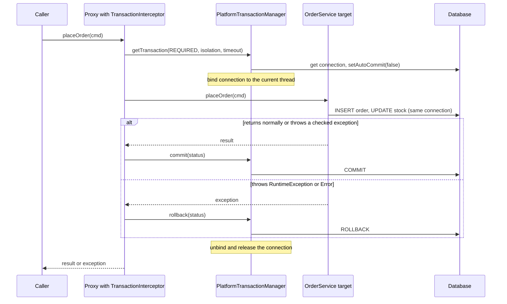
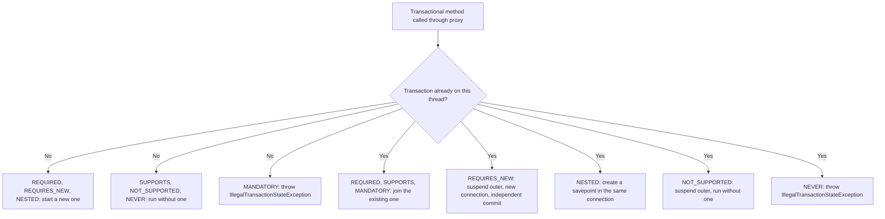

# Transactions: `@Transactional`, propagation, isolation, rollback rules

!!! warning "Draft: not yet fact-checked"
    This page was written but its independent review pass has not run yet. Verify version numbers and defaults against the linked sources.


!!! abstract "TL;DR"
    - `@Transactional` is **AOP around advice**: a proxy asks a `PlatformTransactionManager` to begin, then commits or rolls back after your method returns. No proxy call (self-invocation, private method, object created with `new`) means **no transaction**.
    - Defaults: propagation **`REQUIRED`**, isolation **`DEFAULT`** (whatever the database uses), not read-only, no timeout, rollback on **`RuntimeException` and `Error` only**. Checked exceptions **commit**.
    - **Propagation** answers "what if a transaction already exists?". `REQUIRED` joins it, `REQUIRES_NEW` suspends it and opens a second connection, `NESTED` uses a savepoint.
    - **Isolation** is enforced by the database, not by Spring. PostgreSQL, Oracle and SQL Server default to READ COMMITTED. MySQL InnoDB defaults to REPEATABLE READ.
    - A transaction covers **one resource**. A database write plus a Kafka publish is a dual write. Use the **transactional outbox** or `@TransactionalEventListener(AFTER_COMMIT)` plus idempotent consumers.

## Why it matters

A transaction gives you ACID on a group of statements: all of them happen, or none do. Before Spring, you wrote this by hand: get a connection, `setAutoCommit(false)`, try, commit, catch, rollback, finally close. That code was repeated in every method, and it was tied to one API (JDBC, or JTA, or Hibernate).

Spring solved two problems:

1. **One abstraction** (`PlatformTransactionManager`) over JDBC, JPA, JTA, MongoDB, Kafka and others.
2. **Declarative demarcation**: you say *what* you want with an annotation, and an interceptor does the begin/commit/rollback.

The cost is that the behaviour is invisible. Most transaction bugs in Spring applications are not database bugs. They are "the annotation did nothing" or "it committed when I expected a rollback". Senior interviews test this area hard because it shows whether you know what the framework does on your behalf.

## Core concepts

### How `@Transactional` works internally

Three pieces cooperate:

| Piece | Job |
|---|---|
| `TransactionInterceptor` | The around advice. Reads the annotation attributes, calls the manager, decides commit vs rollback. |
| `PlatformTransactionManager` | Knows how to begin, commit and roll back for one technology (`JpaTransactionManager`, `DataSourceTransactionManager`, `MongoTransactionManager`, `JtaTransactionManager`). |
| `TransactionSynchronizationManager` | Holds the current connection or `EntityManager` in a **`ThreadLocal`**, so every repository call on the same thread uses the same connection. |


*Notice that the commit happens in the proxy after your method returns. Exceptions raised at commit time (constraint violations on flush, optimistic lock failures) surface outside your method body, so a `try/catch` inside the method cannot see them.*

Consequences of this design:

- **The call must go through the proxy.** `this.otherMethod()` bypasses it. See [AOP & proxies](04-aop-and-proxies.md) for JDK vs CGLIB proxies and the self-invocation pitfall.
- **Method visibility.** With class-based (CGLIB) proxies, Spring Framework 6.0+ also honours `protected` and package-visible methods. Before 6.0 only `public` worked. `private` and `final` methods are never intercepted, and nothing warns you.
- **The transaction is tied to a thread.** It does not follow work into `@Async` methods, `CompletableFuture.supplyAsync`, parallel streams or a new virtual thread. Each of those starts with no transaction.
- **Reactive code is different.** WebFlux uses `ReactiveTransactionManager` and carries the transaction in the Reactor context, not a `ThreadLocal`.

### Annotation attributes and defaults

| Attribute | Default | Meaning |
|---|---|---|
| `propagation` | `REQUIRED` | What to do if a transaction already exists |
| `isolation` | `DEFAULT` | Use the database default |
| `readOnly` | `false` | A hint for the driver and ORM |
| `timeout` | `-1` (none) | Seconds before the transaction is marked for rollback |
| `rollbackFor` / `noRollbackFor` | unchecked only | Which exceptions cause rollback |
| `transactionManager` (`value`) | the primary manager | Which manager bean to use |

The annotation can sit on a class (applies to all its methods) or a method (overrides the class). Put it on the concrete class rather than the interface. Spring also understands `jakarta.transaction.Transactional`, which has fewer options.

### Propagation

Propagation is only about one question: when a transactional method is called, **is there already a transaction on this thread, and what should happen?**


*Notice that only `REQUIRES_NEW` produces a second physical transaction. Everything that "joins" shares one connection and one final commit or rollback.*

| Propagation | Existing transaction | No transaction | Typical use |
|---|---|---|---|
| `REQUIRED` | Join | Create | Default for service methods |
| `REQUIRES_NEW` | Suspend, create independent | Create | Audit log, outbox for failures, sequence allocation |
| `NESTED` | Savepoint | Create | Partial rollback of one step in a batch (JDBC) |
| `SUPPORTS` | Join | Run non-transactional | Read helpers that don't care |
| `MANDATORY` | Join | Throw | Repository or helper that must never run alone |
| `NOT_SUPPORTED` | Suspend | Run non-transactional | Long, slow call that must not hold a transaction |
| `NEVER` | Throw | Run non-transactional | Guard for code that must not be in a transaction |

Three details that interviewers push on:

**Logical vs physical transactions.** With `REQUIRED`, each annotated method is a *logical* scope, all mapped onto one *physical* transaction. If an inner scope fails, it marks the shared transaction **rollback-only**. If the outer method then catches the exception and returns normally, the proxy tries to commit, finds the mark, rolls back and throws **`UnexpectedRollbackException`**. The outer caller is told loudly that its "success" was actually a rollback.

**`REQUIRES_NEW` needs two connections.** The outer transaction keeps its connection while it is suspended. If every request thread holds one connection and waits for a second, a small pool deadlocks itself under load. The inner transaction also cannot see the outer one's uncommitted rows, and can block on rows the outer one has locked.

**`NESTED` is savepoints.** It works with `DataSourceTransactionManager` over JDBC. Rolling back the nested scope returns to the savepoint, and the outer transaction continues. Unlike `REQUIRES_NEW`, the nested work still commits or rolls back with the outer transaction. With JPA it is usually not usable: `JpaTransactionManager` does not allow nested transactions by default, and Hibernate's persistence context is not rewound to the savepoint.

### Isolation

Isolation controls what concurrent transactions can see of each other. Spring only passes the level to the connection (`Connection.setTransactionIsolation`). The database enforces it.

| Level | Dirty read | Non-repeatable read | Phantom read |
|---|---|---|---|
| `READ_UNCOMMITTED` | Possible | Possible | Possible |
| `READ_COMMITTED` | Prevented | Possible | Possible |
| `REPEATABLE_READ` | Prevented | Prevented | Possible in the SQL standard |
| `SERIALIZABLE` | Prevented | Prevented | Prevented |

- **Dirty read:** you read a row another transaction has not committed yet.
- **Non-repeatable read:** you read the same row twice and get different values.
- **Phantom read:** you run the same range query twice and get different rows.

Database specifics matter more than the table:

- **PostgreSQL** defaults to READ COMMITTED. READ UNCOMMITTED behaves like READ COMMITTED. Its REPEATABLE READ is snapshot isolation and does not allow phantoms. REPEATABLE READ and SERIALIZABLE can fail with a serialization error, so the application **must retry**.
- **MySQL InnoDB** defaults to REPEATABLE READ.
- **Oracle** and **SQL Server** default to READ COMMITTED.

The anomaly that hurts in practice is the **lost update**: two transactions read a balance of 100, both subtract 10, both write 90. READ COMMITTED does not prevent it. The usual fixes, cheapest first:

1. An atomic statement: `UPDATE account SET balance = balance - 10 WHERE id = ? AND balance >= 10`.
2. **Optimistic locking** with `@Version`: the second writer gets `ObjectOptimisticLockingFailureException` and retries.
3. **Pessimistic locking**: `SELECT ... FOR UPDATE` via `@Lock(LockModeType.PESSIMISTIC_WRITE)`.
4. A higher isolation level plus retry on serialization failure.

Isolation only applies when a transaction is **created**. If a method with `isolation = SERIALIZABLE` joins an existing READ COMMITTED transaction, the setting is ignored unless `validateExistingTransaction` is enabled on the manager, in which case it is rejected.

### Rollback rules

The default comes from EJB conventions: unchecked exceptions are unexpected failures, checked exceptions are expected business outcomes.

- `RuntimeException` and `Error`: **rollback**.
- Checked exception (`IOException`, your own `extends Exception`): **commit**.
- `rollbackFor = Exception.class` changes this for one method. `noRollbackFor` does the opposite.
- Spring Framework 6.2+ lets you change the default globally: `@EnableTransactionManagement(rollbackOn = RollbackOn.ALL_EXCEPTIONS)`.
- An exception that is **caught inside the method** never reaches the proxy, so the proxy commits. To roll back without throwing, call `TransactionAspectSupport.currentTransactionStatus().setRollbackOnly()`.
- Kotlin has no checked exceptions in the language, but a Kotlin function can still throw `IOException`, and Spring still commits. Same trap, harder to see.

### `readOnly` and `timeout`

`readOnly = true` is a **hint**, not a guarantee of no writes. What it buys:

- Hibernate sets the flush mode to `MANUAL`, so there is no dirty checking and no flush at commit. This saves CPU and memory on large reads.
- The JDBC driver gets `Connection.setReadOnly(true)`. Some databases optimise, and a routing `DataSource` can send the work to a **read replica**.

`timeout` is checked when statements are issued (and applied as a query timeout). It does not interrupt a thread that is stuck in an HTTP call.

## In practice: code & configuration

### The two classic bugs

=== "❌ Common mistake"
    ```java
    @Service
    @RequiredArgsConstructor
    public class PaymentService {

        private final PaymentRepository payments;
        private final AuditRepository audits;
        private final GatewayClient gateway;

        public void pay(PaymentCommand cmd) {            // not transactional
            process(cmd);                                // self-invocation: proxy is bypassed, NO transaction
        }

        @Transactional
        public void process(PaymentCommand cmd) {
            payments.save(Payment.pending(cmd));         // each save auto-commits on its own
            try {
                gateway.charge(cmd);                     // slow HTTP call inside the "transaction"
            } catch (GatewayException e) {               // checked exception
                log.error("charge failed", e);           // swallowed: even with a proxy this would COMMIT
            }
            audits.save(Audit.of(cmd));
        }
    }
    ```

=== "✅ Correct approach"
    ```java
    @Service
    @RequiredArgsConstructor
    public class PaymentService {

        private final PaymentTxService tx;               // separate bean, so calls go through its proxy
        private final GatewayClient gateway;

        public void pay(PaymentCommand cmd) throws GatewayException {
            UUID id = tx.createPending(cmd);             // short transaction 1, commits
            GatewayResult result = gateway.charge(cmd);  // remote call with NO connection held
            tx.complete(id, result);                     // short transaction 2
        }
    }

    @Service
    @RequiredArgsConstructor
    class PaymentTxService {

        private final PaymentRepository payments;
        private final AuditRepository audits;

        @Transactional                                   // REQUIRED, rollback on unchecked
        public UUID createPending(PaymentCommand cmd) {
            return payments.save(Payment.pending(cmd)).getId();
        }

        @Transactional(rollbackFor = Exception.class,    // checked exceptions roll back too
                       timeout = 5)                      // fail fast instead of holding locks
        public void complete(UUID id, GatewayResult result) {
            Payment p = payments.findById(id).orElseThrow();
            p.apply(result);                             // managed entity: dirty checking writes it at commit
            audits.save(Audit.of(p));                    // same transaction, all or nothing
        }
    }
    ```

### `REQUIRES_NEW` for an audit record that must survive

```java
@Service
@RequiredArgsConstructor
class AuditService {
    private final AuditRepository audits;

    @Transactional(propagation = Propagation.REQUIRES_NEW)   // own connection, own commit
    public void recordFailure(String ref, String reason) {
        audits.save(Audit.failure(ref, reason));
    }
}

@Service
@RequiredArgsConstructor
class TransferService {
    private final AccountRepository accounts;
    private final AuditService audit;                         // different bean, so the proxy is used

    @Transactional
    public void transfer(TransferCommand cmd) {
        try {
            accounts.debit(cmd.from(), cmd.amount());
            accounts.credit(cmd.to(), cmd.amount());
        } catch (InsufficientFundsException e) {              // RuntimeException
            audit.recordFailure(cmd.ref(), e.getMessage());   // committed even though we roll back
            throw e;                                          // rethrow, so the outer transaction rolls back
        }
    }
}
```

### Programmatic transactions

Use `TransactionTemplate` when the boundary is smaller than a method, or when you need to avoid proxy rules.

```java
@Service
class ReportService {
    private final TransactionTemplate tx;

    ReportService(PlatformTransactionManager tm) {
        this.tx = new TransactionTemplate(tm);
        this.tx.setReadOnly(true);
        this.tx.setTimeout(10);
    }

    Report build(ReportRequest req) {
        var rows = tx.execute(status -> repo.load(req));   // transaction covers only the query
        return renderer.render(rows);                      // slow rendering holds no connection
    }
}
```

### Publish after commit

```java
@Transactional
public Order place(OrderCommand cmd) {
    Order order = orders.save(Order.from(cmd));
    events.publishEvent(new OrderPlaced(order.getId()));   // held until the transaction outcome is known
    return order;
}

@Component
class OrderPlacedPublisher {
    @TransactionalEventListener(phase = TransactionPhase.AFTER_COMMIT)   // AFTER_COMMIT is the default phase
    void on(OrderPlaced event) {
        kafka.send("orders.placed", event.orderId().toString(), event);  // never sent if the transaction rolled back
    }
}
```

This prevents "event sent, database rolled back". It does **not** prevent "database committed, process crashed before sending". For that you need the outbox pattern (see Real-world usage). Also note that in `AFTER_COMMIT` the original transaction is finished, so a database write in the listener needs `REQUIRES_NEW`.

### MongoDB and tests

- **MongoDB:** multi-document transactions need a replica set (or sharded cluster). Spring Boot does **not** create a `MongoTransactionManager` for you. Without that bean, `@Transactional` on a Mongo service does nothing.

    ```java
    @Bean
    MongoTransactionManager transactionManager(MongoDatabaseFactory factory) {
        return new MongoTransactionManager(factory);
    }
    ```

- **Tests:** `@Transactional` on a Spring test rolls back after each test by default. This keeps the database clean, but it can hide bugs: nothing is ever committed, so `AFTER_COMMIT` listeners never fire, and lazy loading works in the test but fails in production where no transaction is open.
- **Debugging:** set `logging.level.org.springframework.transaction.interceptor=TRACE` to see "Getting transaction for" and "Completing transaction for" lines. `TransactionSynchronizationManager.isActualTransactionActive()` tells you if you are really inside one.

Repository transaction defaults (`SimpleJpaRepository` is read-only at class level, with write methods overridden) are covered in [Spring Data](07-spring-data.md).

## Real-world usage

- **Banking and payments.** Money movement uses short local transactions plus optimistic or pessimistic locking, an idempotency key on every request, and an append-only ledger. Audit rows are often written with `REQUIRES_NEW` so a failed attempt is still recorded.
- **Healthcare.** A prescription or claim update and its audit trail must be atomic, because regulators expect a complete record of who changed what. Where the store is MongoDB, teams usually model the aggregate as one document, because a single-document write is already atomic, and keep multi-document transactions for the few cases that need them.
- **Microservices.** Distributed two-phase commit (XA/JTA) is rarely used between services because it couples availability and is slow. The common pattern is the **transactional outbox**: write the business row and an outbox row in one local transaction, then a relay (a poller or change data capture such as Debezium) publishes to Kafka. Consumers are idempotent. Long business flows use **sagas** with compensating actions.
- **Typical incident shape.** A service calls a slow downstream API inside `@Transactional`. Each request holds a database connection for the length of the remote call. The downstream slows down, the HikariCP pool empties, and every endpoint, including unrelated ones, times out waiting for a connection. The fix is always the same: move remote calls outside the transaction.
- **Kafka.** Kafka has its own transactions (`KafkaTransactionManager`) for consume-process-produce exactly-once within Kafka. They do not make a database write and a Kafka send atomic together.

## Trade-offs & production gotchas

| Option | Pros | Cons | Use when |
|---|---|---|---|
| `@Transactional` (declarative) | No boilerplate, consistent, readable | Proxy rules, boundary is the whole method | Default for service methods |
| `TransactionTemplate` (programmatic) | Precise scope, no proxy pitfalls, works in private methods | More code | Mixed slow and fast work in one method |
| `REQUIRES_NEW` | Independent outcome | Second connection, pool exhaustion, lock conflicts with outer | Audit and failure records |
| `NESTED` | Partial rollback on one connection | JDBC only, not for JPA | Batch items where one may fail |
| Higher isolation | Fewer anomalies | Blocking or serialization failures, needs retry | Short, critical invariants |
| Optimistic locking (`@Version`) | No locks held, scales well | Retries on conflict | Low to medium contention |
| Pessimistic locking | No retries, simple reasoning | Blocking, deadlock risk | High contention on a few rows |
| Outbox | Reliable publish, at-least-once | Extra table and relay, duplicates possible | Database change must produce an event |

!!! warning "Gotchas"
    - **Self-invocation, `private`, `final`, or `new`-created objects:** the annotation is silently ignored.
    - **Checked exceptions commit.** Swallowed exceptions commit too.
    - **Catching an inner `REQUIRED` failure** gives `UnexpectedRollbackException` at the outer commit.
    - **Remote calls inside a transaction** hold a connection and locks for the duration. This is the most common cause of pool exhaustion.
    - **`@Async` or a new thread inside a transaction** runs outside it and cannot see uncommitted data.
    - **`@Transactional` on a `@KafkaListener` or `@Scheduled` method works**, but keep the body short. A batch of 500 records in one transaction means long locks and a large rollback.
    - **`spring.jpa.open-in-view` is `true` by default.** The persistence context stays open during view rendering, so lazy loads run after the transaction has ended. Most API services turn it off.
    - **A large `readOnly = false` transaction loading many entities** pays for dirty checking on all of them at flush.
    - **Multiple transaction managers** (for example JPA and Mongo): the one marked `@Primary` wins unless you name another. A method cannot span both atomically.

## How this connects to my experience

- **Where I used it:** the resume does not list transaction management as a bullet, so position this through the systems where it applies.
    - **OptumRx Meteor (Publicis Sapient):** microservices with Spring Boot, Kafka, MongoDB and Redis, and "Kafka-based event-driven workflows with retry and DLQ handling". The transaction question here is consistency between a MongoDB write and a Kafka publish, and what a retry does to a half-finished operation.
    - **ConvergeHealth Data Asset Explorer (Deloitte):** RDS with Liquibase migrations. This is where relational transactions and JPA apply. *[confirm which services used JPA/Hibernate with `@Transactional`]*
    - **CCKM (Coriolis):** key rotation workflows are multi-step operations across a local store and an external KMS or HSM, which is a compensating-action problem, not a single transaction. *[confirm how partial failures in rotation were handled]*
- **Talking points:**
    - "In MongoDB we designed aggregates so that one business change is one document write, which is atomic without a transaction." *[confirm; also confirm whether multi-document transactions and `MongoTransactionManager` were used anywhere]*
    - "A database write and a Kafka publish are a dual write. We relied on retry, DLQ and idempotent consumers to reach consistency." *[confirm whether an outbox or `@TransactionalEventListener` was used, or whether the publish happened after the save with retry]*
    - "As a tech lead I look for three things in code review: remote calls inside `@Transactional`, self-invocation, and swallowed exceptions." This is a review standard you can honestly claim under "established engineering standards" if it matches what you did. *[confirm]*
    - Redis cache writes are outside the database transaction, so evict or update the cache after commit, not before. *[confirm the invalidation approach used]*
- **Likely follow-up chain:** "How does `@Transactional` work?" (proxy, interceptor, manager, thread-bound connection) → "Why did my inner method not start a new transaction?" (self-invocation) → "You save to the database and publish to Kafka. What if the publish fails?" (dual write, outbox, idempotent consumers) → "Why not XA?" (availability coupling, performance, limited broker support) → "How do you make the consumer safe for redelivery?" (idempotency key, upsert, dedupe table).

## Interview questions

### Fundamentals

??? question "Q1. What happens when you call a method annotated with `@Transactional`?"
    **Answer:** The caller holds a proxy, not the real bean. The proxy's `TransactionInterceptor` reads the annotation attributes and asks the `PlatformTransactionManager` for a transaction. For a new one, the manager gets a connection, turns off auto-commit, applies isolation and read-only settings, and binds the connection to the current thread through `TransactionSynchronizationManager`. The target method runs, and every repository call on that thread reuses the bound connection. On normal return the interceptor commits. On an exception it checks the rollback rules and either rolls back or commits, then rethrows. Finally the connection is unbound and returned to the pool.

    **Interviewer listens for:** proxy, interceptor, transaction manager, thread-bound resource, commit happens after the method returns.

    **Common wrong answer:** "Spring adds transaction code into my class." Without AspectJ weaving, your class is unchanged. It is wrapped.

??? question "Q2. What are the default settings of `@Transactional`?"
    **Answer:** Propagation `REQUIRED`, isolation `DEFAULT` (the database default), `readOnly = false`, no timeout, rollback on `RuntimeException` and `Error`, and the primary transaction manager.

    **Interviewer listens for:** that isolation is the database's default, not a fixed Spring value, and that checked exceptions do not roll back.

??? question "Q3. Which exceptions cause a rollback by default? How do you change it?"
    **Answer:** Unchecked exceptions (`RuntimeException` and subclasses) and `Error`. Checked exceptions commit. Change it per method with `rollbackFor` or `noRollbackFor`, or globally in Spring Framework 6.2+ with `@EnableTransactionManagement(rollbackOn = RollbackOn.ALL_EXCEPTIONS)`. To roll back without throwing, call `setRollbackOnly()` on the current `TransactionStatus`.

    **Common wrong answer:** "Any exception rolls back."

??? question "Q4. Explain `REQUIRED` vs `REQUIRES_NEW`."
    **Answer:** `REQUIRED` joins the current transaction or creates one. All joined methods share one connection and one outcome. `REQUIRES_NEW` always starts an independent transaction. If one exists, it is suspended, a second connection is taken from the pool, and the inner transaction commits or rolls back on its own. The outer transaction resumes afterwards and can still roll back without affecting the inner result.

    **Interviewer listens for:** two physical connections, independent commit, pool impact.

??? question "Q5. What are dirty reads, non-repeatable reads and phantom reads, and which isolation level stops each?"
    **Answer:** A dirty read sees uncommitted data, and READ COMMITTED prevents it. A non-repeatable read gets different values for the same row within one transaction, and REPEATABLE READ prevents it. A phantom read gets a different set of rows for the same range query, and SERIALIZABLE prevents it in the SQL standard. Real databases differ: PostgreSQL's REPEATABLE READ is snapshot isolation and already prevents phantoms.

    **Interviewer listens for:** knowing the default of the database you actually use.

### Intermediate

??? question "Q6. Predict the result. `outer()` is called from a controller."
    ```java
    @Service
    class ReportService {
        @Transactional
        public void outer() {
            repo.save(new Row("A"));
            inner();
            throw new IllegalStateException("boom");
        }

        @Transactional(propagation = Propagation.REQUIRES_NEW)
        public void inner() {
            repo.save(new Row("B"));
        }
    }
    ```

    **Answer:** Neither row is saved. `inner()` is called on `this`, so the proxy is bypassed and `REQUIRES_NEW` is ignored. Row B is written in the outer transaction, which rolls back on the `IllegalStateException`. To make B survive, move `inner()` to another bean, or use `TransactionTemplate` with `PROPAGATION_REQUIRES_NEW`.

    **Interviewer listens for:** spotting self-invocation without being prompted.

    **Common wrong answer:** "B is committed, A is rolled back."

??? question "Q7. Predict the result. What does the caller of `outer()` see?"
    ```java
    @Service
    class OuterService {
        @Transactional
        public void outer() {
            repo.save(new Row("A"));
            try {
                innerService.inner();          // another bean, REQUIRED, throws RuntimeException
            } catch (RuntimeException e) {
                log.warn("ignored", e);
            }
        }
    }
    ```

    **Answer:** The caller gets `UnexpectedRollbackException` and row A is not saved. The inner proxy saw the exception leave `inner()` and marked the shared physical transaction rollback-only. `outer()` returned normally, so the outer proxy tried to commit, found the mark, rolled back and threw. If the inner work is truly optional, give it `REQUIRES_NEW` (independent) or `NESTED` (savepoint, JDBC), or stop the exception from crossing the inner proxy.

    **Interviewer listens for:** logical vs physical transaction, rollback-only flag.

    **Common wrong answer:** "A is committed because the exception was caught."

??? question "Q8. `REQUIRES_NEW` vs `NESTED`?"
    **Answer:** `REQUIRES_NEW` is a separate physical transaction on a second connection. It commits independently and stays committed even if the outer transaction rolls back. `NESTED` is a savepoint inside the same physical transaction and connection. The nested part can roll back alone, but if the outer transaction rolls back, the nested work is lost too. `NESTED` needs savepoint support, which in practice means `DataSourceTransactionManager` with JDBC. It is not a good fit for JPA.

??? question "Q9. What does `readOnly = true` actually do?"
    **Answer:** It is a hint. With Hibernate, the flush mode becomes `MANUAL`, so dirty checking and the commit-time flush are skipped. The JDBC connection is flagged read-only, which some databases use to optimise and which a routing `DataSource` can use to pick a read replica. It does not guarantee that writes fail on every database.

    **Common wrong answer:** "It makes the method unable to write."

??? question "Q10. On which methods does `@Transactional` not work?"
    **Answer:** Methods called from the same class (self-invocation), `private` methods, `final` methods or classes with CGLIB proxies, objects not managed by Spring, and methods called during bean construction (for example in `@PostConstruct`, where the proxy may not be in place yet). Non-public methods work only with class-based proxies on Spring 6.0+. It also has no effect when no matching transaction manager exists, such as MongoDB without a `MongoTransactionManager` bean.

### Senior

??? question "Q11. Why is a remote call inside `@Transactional` a problem, and how do you restructure it?"
    **Answer:** The transaction holds a pooled connection, and often row locks, from begin to commit. A 2-second HTTP call turns a 5 ms transaction into a 2-second one. Under load the pool empties and unrelated requests fail waiting for a connection. The transaction timeout does not interrupt a blocked HTTP call. Restructure into: short transaction to record intent (status PENDING), remote call with no transaction, short transaction to record the outcome. Add an idempotency key so the remote call is safe to retry, and a reconciliation job for records stuck in PENDING.

    **Interviewer listens for:** connection pool reasoning, intermediate state, idempotency, recovery path.

??? question "Q12. How do you keep a database write and a Kafka publish consistent?"
    **Answer:** They are two resources, so one local transaction cannot cover both. Publishing inside the transaction risks sending an event for data that rolls back. Publishing after commit risks losing the event if the process dies in between. The reliable solution is the transactional outbox: write the business row and an outbox row in the same transaction, then a relay (a poller or CDC with Debezium) publishes outbox rows to Kafka and marks them sent. Delivery is at-least-once, so consumers must be idempotent. `@TransactionalEventListener(AFTER_COMMIT)` is a lighter option when losing an occasional event is acceptable or is repaired by reconciliation. XA is avoided because it couples availability and performs poorly.

    **Interviewer listens for:** naming the dual-write problem, both failure orders, at-least-once plus idempotency.

    **Common wrong answer:** "Put `@Transactional` on the method and Kafka will roll back too."

??? question "Q13. How do you prevent lost updates on an account balance?"
    **Answer:** First choice is a single atomic `UPDATE ... SET balance = balance - ? WHERE id = ? AND balance >= ?` and check the affected row count. With entities, use `@Version` optimistic locking and retry on `ObjectOptimisticLockingFailureException`, with the retry placed **outside** the transactional method so each attempt gets a fresh transaction. Under heavy contention use `PESSIMISTIC_WRITE` (`SELECT ... FOR UPDATE`) with a lock timeout and a consistent lock order to avoid deadlocks. Raising isolation to SERIALIZABLE also works but needs retry on serialization failures.

    **Interviewer listens for:** READ COMMITTED does not stop lost updates, retry must wrap the transaction, trade-off between optimistic and pessimistic.

??? question "Q14. How do transactions behave with `@Async`, virtual threads and WebFlux?"
    **Answer:** Imperative Spring transactions are bound to a thread through `ThreadLocal`. An `@Async` method or a task submitted to an executor runs on another thread with no transaction, and cannot see the caller's uncommitted changes. Virtual threads behave the same way: one request on one virtual thread works normally, but work forked to other threads is outside the transaction. Reactive code uses `ReactiveTransactionManager` and `TransactionalOperator`, with the transaction carried in the Reactor context, and it needs a reactive driver such as R2DBC or the reactive Mongo driver.

### Scenario-based

??? question "Q15. Production alert: HikariCP reports 'Connection is not available, request timed out'. How do you investigate?"
    **Answer:** Check pool metrics first (active, idle, pending threads, connection usage time) from Actuator and Micrometer (see [Actuator, health checks, metrics](08-actuator-health-checks-metrics.md)). A high usage time means connections are held too long. Take a thread dump and look at what threads holding connections are doing: usually an HTTP call, a slow query, or waiting for a second connection because of `REQUIRES_NEW`. Enable Hikari's `leakDetectionThreshold` to get stack traces of long holders. Then fix the cause: move remote calls out of transactions, add query timeouts, remove nested `REQUIRES_NEW` in hot paths, and check `open-in-view`. Increasing the pool size is a last step, not the first.

    **Interviewer listens for:** a method, not a guess. Metrics, thread dump, leak detection, root cause before tuning.

??? question "Q16. A Kafka consumer saves to the database and the listener is retried after a failure. How do you avoid duplicate or partial data?"
    **Answer:** Make the handler idempotent: use a natural or event ID with a unique constraint or an upsert, or keep a processed-events table written in the same transaction as the business change. Keep one message (or one small batch) per transaction so a failure rolls back cleanly and the offset is not committed. Do not swallow exceptions in the handler, or the transaction commits and the retry logic never runs. After the configured retries, send the record to a DLQ with enough context to replay.

    **Interviewer listens for:** at-least-once delivery, idempotency in the same transaction as the write, interaction between rollback and offset commit.

??? question "Q17. A batch job processes 10,000 records in one `@Transactional` method and is slow and memory hungry. What do you change?"
    **Answer:** One huge transaction holds locks for a long time, grows the persistence context, and loses everything on one failure. Process in chunks (for example 500 to 1,000 records), one transaction per chunk, using `TransactionTemplate` or a separate bean. Enable JDBC batching, and flush and clear the `EntityManager` per chunk. Make the job restartable by recording progress. Decide per-item failure handling: skip and record the bad item rather than fail the chunk, where the business allows it.

    **Common wrong answer:** "Increase the transaction timeout."

## Cheat sheet

| Concept | Remember |
|---|---|
| Mechanism | Proxy → `TransactionInterceptor` → `PlatformTransactionManager` → connection bound to thread |
| Defaults | `REQUIRED`, isolation `DEFAULT`, not read-only, no timeout |
| Rollback | Unchecked and `Error` roll back. Checked commit. `rollbackFor = Exception.class` |
| Self-invocation | `this.method()` skips the proxy. Use another bean or `TransactionTemplate` |
| Visibility | `private` and `final` never work. Non-public needs class proxies on Spring 6.0+ |
| `REQUIRES_NEW` | Second connection, independent commit, pool risk |
| `NESTED` | Savepoint, JDBC only, outcome still tied to outer |
| `UnexpectedRollbackException` | Inner `REQUIRED` failed, outer caught it and tried to commit |
| Isolation defaults | PostgreSQL, Oracle, SQL Server: READ COMMITTED. MySQL InnoDB: REPEATABLE READ |
| Lost update | Atomic `UPDATE`, `@Version`, or `SELECT ... FOR UPDATE` |
| `readOnly` | Hint: no Hibernate flush, replica routing |
| Threads | Transaction does not cross `@Async` or new threads |
| Remote calls | Keep them outside the transaction |
| DB + Kafka | Dual write. Outbox plus idempotent consumers |
| After commit | `@TransactionalEventListener(AFTER_COMMIT)` |
| MongoDB | Needs replica set and an explicit `MongoTransactionManager` bean |
| Debug | `logging.level.org.springframework.transaction.interceptor=TRACE` |

## Sources

1. [Spring Framework: Using @Transactional](https://docs.spring.io/spring-framework/reference/data-access/transaction/declarative/annotations.html): defaults, proxy mode, method visibility, self-invocation.
2. [Spring Framework: Transaction Propagation](https://docs.spring.io/spring-framework/reference/data-access/transaction/declarative/tx-propagation.html): logical vs physical transactions, `REQUIRES_NEW`, `NESTED`, `UnexpectedRollbackException`.
3. [Spring Framework: Rolling Back a Declarative Transaction](https://docs.spring.io/spring-framework/reference/data-access/transaction/declarative/rolling-back.html): default rollback rules and how to change them.
4. [Spring Framework: Transaction-bound Events](https://docs.spring.io/spring-framework/reference/data-access/transaction/event.html): `@TransactionalEventListener` phases.
5. [PostgreSQL: Transaction Isolation](https://www.postgresql.org/docs/current/transaction-iso.html): isolation levels, snapshot behaviour, serialization failures.
6. [Spring Data MongoDB: Sessions & Transactions](https://docs.spring.io/spring-data/mongodb/reference/mongodb/client-session-transactions.html): `MongoTransactionManager` must be declared explicitly.
7. [microservices.io: Transactional Outbox](https://microservices.io/patterns/data/transactional-outbox.html): reliable publish of events with a database change.
8. *Designing Data-Intensive Applications*, Martin Kleppmann, chapter 7 "Transactions": isolation anomalies, lost updates, snapshot isolation.
