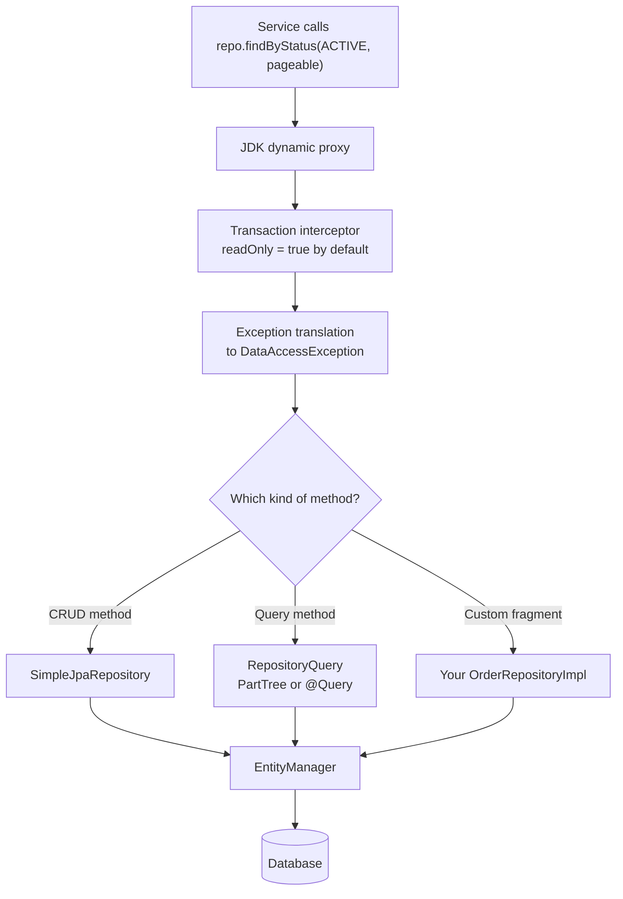
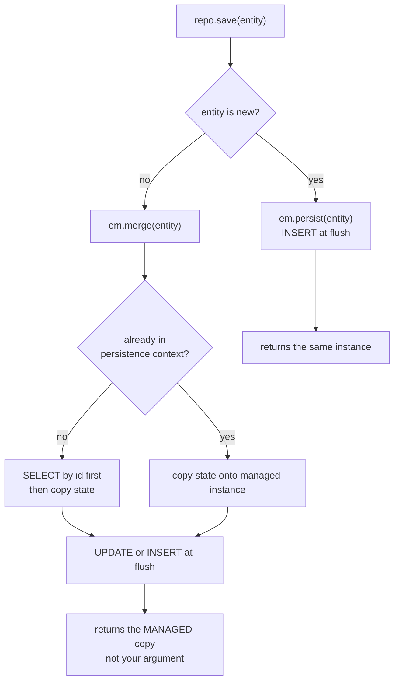
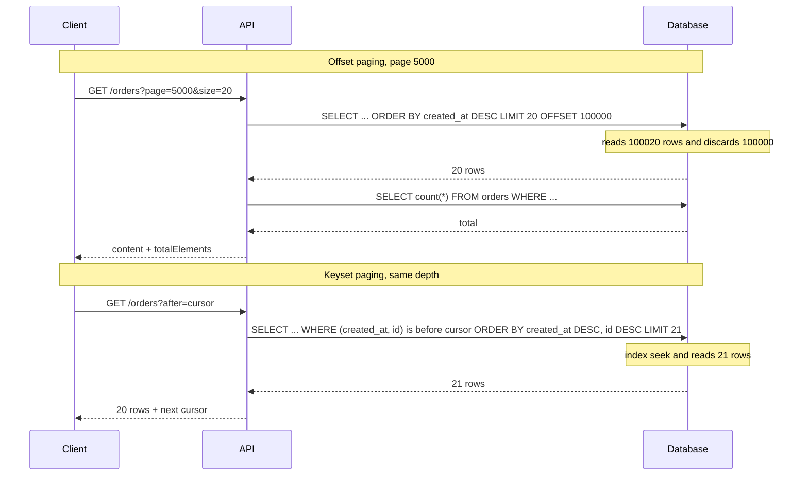

# Spring Data (repositories, projections, pagination)

!!! warning "Draft: not yet fact-checked"
    This page was written but its independent review pass has not run yet. Verify version numbers and defaults against the linked sources.


!!! abstract "TL;DR"
    - A repository is **an interface with no implementation**. At startup Spring Data builds a **JDK proxy** that routes each call to a base class (`SimpleJpaRepository`, `SimpleMongoRepository`), a parsed query method, or your custom fragment.
    - **Derived queries** (`findByStatusAndCreatedAtAfter`) are parsed and validated **at startup**, so a typo fails the boot, not production. Use `@Query` when the method name gets unreadable.
    - **Projections** load fewer columns: closed interface projections and record DTOs narrow the `SELECT`. Open projections (`@Value` SpEL) do **not**.
    - **`Page`** runs an extra **count query**. **`Slice`** fetches `size + 1` rows and skips the count. **Keyset scrolling** (`Window`) avoids deep `OFFSET` cost entirely.
    - The classic production bugs: **N+1 selects**, **paginating a collection `JOIN FETCH` in memory** (HHH000104), `save()` doing an unexpected `SELECT` + `merge`, and unbounded `size` parameters from clients.

## Why it matters

Before Spring Data, every entity needed a hand-written DAO: open a session, build a query, map the result, handle paging, repeat. That code was 90% identical across entities and a steady source of bugs.

Spring Data removes the boilerplate with one idea: **you declare what you want as an interface, the framework generates how**. The same programming model works across JPA, MongoDB, Redis, Elasticsearch, Cassandra and JDBC.

The cost of that convenience is that the SQL is hidden. Senior interviews go straight to the hidden part: "what query does this method run?", "why is this page slow?", "why did `save()` issue a `SELECT`?". You are expected to know what the abstraction does underneath and where it leaks.

## Core concepts

### The repository hierarchy

| Interface | Adds |
|---|---|
| `Repository<T, ID>` | Marker only. Declare just the methods you want to expose |
| `CrudRepository` | `save`, `findById`, `findAll` (returns `Iterable`), `deleteById`, `count`, `existsById` |
| `ListCrudRepository` | Same, but returns `List` (Spring Data 3.0+) |
| `PagingAndSortingRepository` | `findAll(Pageable)`, `findAll(Sort)` |
| `JpaRepository` | `flush`, `saveAndFlush`, `deleteAllInBatch`, `getReferenceById`, Query by Example |
| `MongoRepository` | `insert`, list-returning variants, Query by Example |

!!! warning "Version difference interviewers ask about"
    Since **Spring Data 3.0 (Boot 3)**, `PagingAndSortingRepository` **no longer extends** `CrudRepository`. If you extended only the paging interface, `save()` and `findById()` disappear after the upgrade. `JpaRepository` and `MongoRepository` extend both, so most code is unaffected.

Extending `JpaRepository` exposes store-specific methods to the whole codebase. For a strict domain layer, extend `Repository` and declare only what the aggregate needs. That is a design talking point, not a rule.

### How an interface becomes a bean

There is no generated source code at runtime (in the classic mode). The steps are:

1. `@EnableJpaRepositories` (applied by Boot auto-configuration, see [auto-configuration](02-auto-configuration-and-starters.md)) scans for interfaces extending `Repository`.
2. For each one it registers a `JpaRepositoryFactoryBean`.
3. The factory creates a **JDK dynamic proxy** (see [AOP & proxies](04-aop-and-proxies.md)) whose target is `SimpleJpaRepository`.
4. For every query method it builds a `RepositoryQuery` object using the `QueryLookupStrategy`. The default, `CREATE_IF_NOT_FOUND`, looks for a declared query first (`@Query`, then a named query) and otherwise derives one from the method name.
5. Interceptors are added: exception translation, transactions, and the query-executing interceptor.


*Notice that one proxy dispatches to three different implementations, and that transactions and exception translation wrap all of them without any annotation on your interface.*

Three consequences follow from this design:

- **Fail fast.** A derived query that references a missing property (`findByStatu`) throws at startup, because the method name is parsed against the entity metamodel when the proxy is built.
- **Transactions come for free.** `SimpleJpaRepository` is annotated `@Transactional(readOnly = true)` at class level, and the write methods (`save`, `delete`) override it with a plain `@Transactional`. Your own query methods inherit the read-only setting. Service-level boundaries are still your job; see [transactions](06-transactions-transactional-propagation-isolation-rollback-ru.md).
- **Consistent exceptions.** A JPA `PersistenceException` or a Mongo driver exception becomes a Spring `DataAccessException` subclass (`DataIntegrityViolationException`, `OptimisticLockingFailureException`), so services do not depend on the store.

Spring Data 2025.1 (the train used by Spring Boot 4) adds **AOT repositories**, which generate the query method implementations at build time. That improves startup and makes the queries visible as source. The runtime behaviour is the same.

### Three ways to define a query

**1. Derived from the method name.** The parser splits the name into a subject (`find…By`, `count…By`, `exists…By`, `delete…By`) and a predicate built from property names and keywords (`And`, `Or`, `Between`, `LessThan`, `Like`, `In`, `IsNull`, `OrderBy…Desc`, `IgnoreCase`, `Top10`/`First`).

```java
List<Order> findTop10ByCustomerIdAndStatusOrderByCreatedAtDesc(Long customerId, OrderStatus status);
```

Nested properties are traversed: `findByCustomerAddressCity` resolves `customer.address.city`. Use an underscore (`findByCustomer_AddressCity`) to disambiguate.

**2. Declared with `@Query`.** JPQL by default, `nativeQuery = true` for SQL. For MongoDB, `@Query` takes a JSON filter and `@Aggregation` takes a pipeline.

**3. Programmatic and dynamic.** `Specification` (JPA Criteria), Querydsl predicates, Query by Example, or a custom fragment that uses `EntityManager`/`MongoTemplate` directly. Use these when filters are optional and combined at runtime.

Rule of thumb: derive up to two or three conditions, then switch to `@Query`. A method named `findByAAndBAndCOrDAndEOrderByF` is a code smell.

### What `save()` really does (JPA)


*Notice that the "not new" branch can cost an extra SELECT, and that it returns a different object from the one you passed in.*

How "new" is decided, in order:

1. If the entity implements `Persistable`, its `isNew()` is used.
2. If there is a `@Version` attribute of a wrapper type, the entity is new when the version is `null`.
3. Otherwise the entity is new when the `@Id` is `null` (or `0` for a primitive).

This matters when you **assign IDs yourself** (UUIDs, business keys). The ID is never null, so every `save()` of a new object takes the `merge` path: one `SELECT` that finds nothing, then the `INSERT`. On a bulk import that doubles the round trips. The fixes are a `@Version` field or implementing `Persistable`.

Also remember that a **managed entity does not need `save()`** at all. Inside a transaction, changing a loaded entity is detected by dirty checking and flushed on commit.

### Projections

A projection answers "I need three fields, why load thirty?".

| Type | Looks like | Query narrowed? | Notes |
|---|---|---|---|
| **Closed interface** | `interface OrderSummary { Long getId(); String getStatus(); }` | Yes | Result is a proxy backed by a tuple |
| **Open interface** | Getter with `@Value("#{target.first + ' ' + target.last}")` | **No** | SpEL needs the whole entity, so everything is loaded |
| **Class/record DTO** | `record OrderSummary(Long id, String status)` | Yes | Fields come from constructor parameter names. No proxy. No nested projections |
| **Dynamic** | `<T> List<T> findByStatus(Status s, Class<T> type)` | Depends on `T` | One method, caller picks the shape |

Why projections are faster than "just load the entity":

- Fewer columns over the wire, and index-only scans become possible.
- No managed entities, so **no dirty-checking snapshot** and less persistence-context memory.
- Lazy associations cannot be touched by accident, so no hidden N+1.

Limits to know:

- A projection is **read-only**. You cannot modify and save it.
- With JPA, a **nested** interface projection (a getter that returns another projection of an associated entity) generally stops the column narrowing and adds joins. Check the SQL log before assuming it is optimised.
- With `@Query` JPQL and a DTO, older versions need an explicit constructor expression (`select new com.acme.OrderSummary(o.id, o.status)`). Recent Spring Data JPA versions (3.5+) rewrite a plain multi-select into one for you. Know the explicit form; it always works.
- Native queries work with interface projections if the column aliases match the getter names.

The same projection types work for MongoDB, where a closed projection becomes a field projection (`{ status: 1, total: 1 }`) on the `find` command.

### Pagination: `Page`, `Slice`, `Window`

`Pageable` carries the page number (**zero-based**), size and sort. `PageRequest.of(0, 20, Sort.by("createdAt").descending())` is the usual way to build one. The return type decides how much work the database does.

| Return type | Queries | Knows total? | Good for |
|---|---|---|---|
| `Page<T>` | Data query **+ count query** | Yes | Numbered pagers ("page 3 of 57") |
| `Slice<T>` | One query for `size + 1` rows | No, only `hasNext()` | Infinite scroll, "load more" |
| `List<T>` with `Pageable` | One query for `size` rows | No | Batch jobs, internal chunking |
| `Window<T>` | One query, keyset or offset | No, only `hasNext()` | Deep, stable scrolling over large data |

Small detail worth knowing: `Page` skips the count query when it can work the total out, for example when the first page comes back with fewer rows than the page size.

**Why offset pagination degrades.** `OFFSET 100000 LIMIT 20` makes the database produce and throw away 100,000 rows. Cost grows linearly with page depth. It is also unstable: if a row is inserted while the user is paging, items shift and the user sees a duplicate or misses a row.

**Keyset (seek) pagination** replaces the offset with a predicate on the sort key: "give me 20 rows after `(createdAt, id)` of the last row I saw". With an index on those columns the database jumps straight there, so page 5,000 costs the same as page 1.


*Notice that the offset request pays for every skipped row plus a count, while the keyset request reads a constant 21 rows no matter how deep the user is.*

Keyset rules:

- The sort must be **deterministic**: always add a unique tie-breaker (usually the ID).
- You cannot jump to an arbitrary page, only next/previous.
- The sort columns should be non-null and backed by a composite index in the same order.

Spring Data supports this natively since 3.1 with `Window<T>`, `ScrollPosition.keyset()` and `KeysetScrollPosition`.

### Sorting

`Sort` is type-checked against entity properties, which is a safety feature: a client-supplied `?sort=` value cannot inject SQL because it must resolve to a property path. To sort by a function or raw expression you must opt in with `JpaSort.unsafe(...)`. Still, **whitelist sortable fields** in the API, because sorting by an unindexed column is an easy way for a client to hurt your database.

## In practice: code & configuration

### Repository with derived queries, projections and paging

```java
public interface OrderRepository extends JpaRepository<Order, Long>, OrderRepositoryCustom {

    // Derived query + Slice: one query, LIMIT size+1, no count
    Slice<OrderSummary> findByCustomerIdOrderByCreatedAtDescIdDesc(Long customerId, Pageable pageable);

    // Declared query with an explicit, cheaper count query (no joins needed to count)
    @Query(value = """
            select o from Order o join fetch o.customer
            where o.status = :status
            """,
           countQuery = "select count(o) from Order o where o.status = :status")
    Page<Order> findWithCustomerByStatus(@Param("status") OrderStatus status, Pageable pageable);

    // Dynamic projection: caller chooses the shape
    <T> Optional<T> findById(Long id, Class<T> type);

    // Bulk update: bypasses the persistence context, so clear it afterwards
    @Modifying(clearAutomatically = true, flushAutomatically = true)
    @Query("update Order o set o.status = :to where o.status = :from and o.createdAt < :cutoff")
    int bulkTransition(@Param("from") OrderStatus from, @Param("to") OrderStatus to,
                       @Param("cutoff") Instant cutoff);

    // Keyset scrolling (Spring Data 3.1+)
    Window<OrderSummary> findFirst50ByStatusOrderByCreatedAtDescIdDesc(OrderStatus status,
                                                                       ScrollPosition position);
}

// Record DTO projection: only id, status, total are selected
public record OrderSummary(Long id, OrderStatus status, BigDecimal total) {}
```

### The N+1 mistake, and three fixes

=== "❌ Common mistake"
    ```java
    @Transactional(readOnly = true)
    public List<OrderDto> recentOrders(Long customerId) {
        // 1 query for 50 orders ...
        Page<Order> page = orderRepository.findByCustomerId(customerId, PageRequest.of(0, 50));
        return page.getContent().stream()
            // ... then 1 query PER order for the lazy 'items' collection = 51 queries
            .map(o -> new OrderDto(o.getId(), o.getItems().size(), o.getCustomer().getName()))
            .toList();
    }
    ```

    The "obvious" fix makes it worse:

    ```java
    // Collection JOIN FETCH + Pageable: Hibernate cannot apply LIMIT in SQL because
    // the join multiplies rows. It loads EVERYTHING and pages in memory (warning HHH000104).
    @Query("select o from Order o join fetch o.items where o.customer.id = :id")
    Page<Order> findWithItems(@Param("id") Long id, Pageable pageable);
    ```

=== "✅ Correct approach"
    ```java
    // Option A: don't load entities at all. Project exactly what the screen needs.
    @Query("""
           select new com.acme.orders.OrderRow(o.id, c.name, count(i))
           from Order o join o.customer c left join o.items i
           where c.id = :id
           group by o.id, c.name, o.createdAt
           order by o.createdAt desc
           """)
    Slice<OrderRow> findRows(@Param("id") Long id, Pageable pageable);

    // Option B: need entities? Page the IDs first, then fetch the graph for those IDs.
    @Query("select o.id from Order o where o.customer.id = :id")
    Page<Long> findIds(@Param("id") Long id, Pageable pageable);          // LIMIT applied in SQL

    @EntityGraph(attributePaths = {"items", "customer"})                  // one joined query
    List<Order> findByIdIn(Collection<Long> ids);                         // re-sort in memory

    // Option C: keep lazy loading but batch it (application.yml)
    // spring.jpa.properties.hibernate.default_batch_fetch_size: 50
    // -> 'items' for 50 orders load with one IN (...) query instead of 50
    ```

To-one associations (`customer`) are safe to `JOIN FETCH` with pagination because they do not multiply rows. The problem is only **to-many** fetches.

### Dynamic filters with `Specification`

```java
public interface OrderRepository extends JpaRepository<Order, Long>,
                                         JpaSpecificationExecutor<Order> {}

public final class OrderSpecs {
    public static Specification<Order> hasStatus(OrderStatus s) {
        return (root, query, cb) -> s == null ? null : cb.equal(root.get("status"), s); // null = no filter
    }
    public static Specification<Order> createdAfter(Instant t) {
        return (root, query, cb) -> t == null ? null : cb.greaterThan(root.get("createdAt"), t);
    }
}

// Optional filters compose without string concatenation
Page<Order> page = orderRepository.findAll(
        Specification.where(hasStatus(status)).and(createdAfter(from)), pageable);
```

### Custom fragment for what the interface cannot express

```java
public interface OrderRepositoryCustom {
    List<OrderStats> statsByRegion(LocalDate from, LocalDate to);
}

// Name must be <FragmentInterface>Impl; it is picked up automatically
class OrderRepositoryCustomImpl implements OrderRepositoryCustom {
    private final EntityManager em;
    OrderRepositoryCustomImpl(EntityManager em) { this.em = em; }

    @Override
    public List<OrderStats> statsByRegion(LocalDate from, LocalDate to) {
        return em.createQuery("""
                select new com.acme.orders.OrderStats(o.region, count(o), sum(o.total))
                from Order o where o.orderDate between :from and :to group by o.region
                """, OrderStats.class)
            .setParameter("from", from).setParameter("to", to)
            .getResultList();
    }
}
```

### Exposing pages over REST safely

```java
@Configuration
// Spring Data 3.3+: serialise Page through a stable DTO (PagedModel) instead of PageImpl
@EnableSpringDataWebSupport(pageSerializationMode = PageSerializationMode.VIA_DTO)
class WebConfig {}

@GetMapping("/orders")
PagedModel<OrderSummary> list(
        @RequestParam OrderStatus status,
        @PageableDefault(size = 20, sort = "createdAt", direction = Sort.Direction.DESC) Pageable pageable) {
    return new PagedModel<>(orderService.search(status, pageable));
}
```

```yaml
spring:
  data:
    web:
      pageable:
        default-page-size: 20
        max-page-size: 100        # default is 2000, which is too generous for most APIs
        one-indexed-parameters: false
  jpa:
    open-in-view: false           # default is true; turn it off and fetch what you need explicitly
    properties:
      hibernate.default_batch_fetch_size: 50
```

### MongoDB flavour

```java
public interface ClaimRepository extends MongoRepository<Claim, String> {

    // Closed projection -> find({memberId: ?}, {status: 1, amount: 1})
    Slice<ClaimSummary> findByMemberIdOrderBySubmittedAtDesc(String memberId, Pageable pageable);

    @Query(value = "{ 'status': ?0, 'submittedAt': { $gte: ?1 } }", fields = "{ 'status': 1, 'amount': 1 }")
    List<ClaimSummary> findRecent(String status, Instant since);

    @Aggregation(pipeline = {
        "{ $match: { status: ?0 } }",
        "{ $group: { _id: '$pharmacyId', total: { $sum: '$amount' } } }"
    })
    List<PharmacyTotal> totalsByPharmacy(String status);
}
```

The same rules apply: `skip()` on a large collection walks the skipped documents, so prefer a range query on an indexed field (`_id` or a timestamp) for deep paging. `Page` still issues a separate `count`, which on a filtered collection can be the slowest part of the request.

## Real-world usage

- **Offset pagination is the usual cause of "the last pages time out".** It works in testing with a thousand rows and fails in production with millions. Public APIs at large scale (Stripe, GitHub's GraphQL API, Slack) expose **cursor-based** pagination for this reason. GraphQL's Relay connection model (`first`, `after`, `pageInfo.hasNextPage`) is the same idea and maps naturally onto `Window` or `Slice`.
- **The count query is often more expensive than the data query.** In PostgreSQL, `count(*)` with a filter has to visit every matching row. Teams commonly switch list screens from `Page` to `Slice`, cap the count ("1000+ results"), or cache it.
- **`spring.jpa.open-in-view=true` hides N+1** by keeping the session open through JSON serialisation. It holds a database connection for the whole request, which is a known cause of connection-pool exhaustion under load. Boot logs a warning at startup when it is left at the default.
- **Healthcare and banking relevance.** Projections are a simple data-minimisation tool: a list endpoint that selects only non-sensitive columns cannot leak PHI or account details through an accidentally serialised entity. Auditing support (`@CreatedBy`, `@LastModifiedDate`, `@Version`) gives the who/when trail and lost-update protection that regulated systems require. Stable, deterministic ordering in paged exports matters for reconciliation, because a duplicated or skipped row is a real defect there.
- **Batch jobs** that page with `OFFSET` while also modifying the rows they filter on will skip records, because the result set shifts under them. Keyset paging or always re-reading page 0 fixes it.

## Trade-offs & production gotchas

| Option | Pros | Cons | Use when |
|---|---|---|---|
| Derived query | Zero code, validated at startup | Unreadable beyond 2-3 conditions, no control of joins | Simple lookups |
| `@Query` JPQL | Explicit, portable, validated at startup | Static, string-based | Joins, aggregates, bulk updates |
| Native query | Full SQL power (CTEs, window functions, hints) | Not portable, paging and count need care | Reporting, DB-specific features |
| `Specification` / Querydsl | Composable optional filters, type-safe (Querydsl) | Verbose Criteria API, harder to read the final SQL | Search screens |
| Custom fragment | Anything goes | You own the code and the tests | Complex or performance-critical access |
| `Page` | Total count for UI | Extra count query, offset cost | Small or medium tables, numbered pagers |
| `Slice` | No count | No total, still offset-based | Infinite scroll |
| Keyset `Window` | Constant cost, stable under writes | No random page jump, needs unique sort + index | Large tables, feeds, exports |
| Entity result | Can modify and save, full graph | Dirty-check overhead, N+1 risk | Write use cases |
| Projection / DTO | Fewer columns, no lazy loading, safe to serialise | Read-only, one more type to maintain | Read use cases |

!!! warning "Gotchas"
    - **HHH000104**: `JOIN FETCH` of a collection plus `Pageable` pages **in memory**. Set `hibernate.query.fail_on_pagination_over_collection_fetch=true` so it fails instead of silently loading the table.
    - **`save()` returns the managed instance.** After `merge`, the object you passed in is still detached. Always use the return value.
    - **Derived `deleteBy…` loads the entities first** and deletes them one at a time, so lifecycle callbacks and cascades run. For bulk deletes use `@Modifying @Query("delete …")`, and know that it bypasses cascades and the persistence context.
    - **`@Modifying` queries leave stale entities** in the persistence context. Use `clearAutomatically = true` or you will read old state in the same transaction.
    - **Page numbers are zero-based.** `?page=1` is the second page unless `one-indexed-parameters` is on.
    - **Unstable sort = duplicate rows across pages.** Sorting by a non-unique column (`createdAt`) gives no guaranteed order among ties. Always add the ID as a tie-breaker.
    - **Returning `Page<Entity>` from a controller** couples your API to the JPA model and to the `PageImpl` JSON shape, which Spring does not guarantee to be stable. Return a DTO page via `PagedModel`.
    - **`Stream<T>` query methods** keep a cursor open. Consume them inside a transaction and close them with try-with-resources.
    - **`getReferenceById`** returns a lazy proxy without hitting the database. It is ideal for setting a foreign key, but accessing it outside a transaction throws `LazyInitializationException`, and a missing row only fails later.
    - **`findAll()` on a big table** has no limit. One careless call in an admin endpoint can take the heap down.

!!! tip "Make the SQL visible"
    In tests, log statements and assert on query counts (for example with datasource-proxy or Hibernate statistics). An N+1 regression caught by a failing test is far cheaper than one found by a latency alert.

## How this connects to my experience

- **Where I used it:**
    - **OptumRx Meteor (Publicis Sapient):** "Designed and developed microservices using Java, Spring Boot, Kafka, **MongoDB**, Redis, and GraphQL." Spring Boot plus MongoDB normally means Spring Data MongoDB repositories and `MongoTemplate`. *[confirm which of the two the services used, and for which collections]*
    - **ConvergeHealth Data Asset Explorer (Deloitte):** RDS, DynamoDB, **Elasticsearch-powered search** and **Liquibase** migrations. Search results are a natural pagination story. *[confirm whether data access was Spring Data JPA / Spring Data Elasticsearch or a different client]*
    - **Skills section:** Hibernate and JPA are listed, so questions on `save()`, N+1 and lazy loading are fair game.
- **Talking points:**
    - In the GraphQL Consumer Service, list fields need pagination. Cursor-style paging (GraphQL connections) is the keyset idea, and it is the right default when aggregating 5 upstream systems where totals are expensive or unavailable. *[confirm whether the schema used offset or cursor pagination]*
    - Projections and field selection have the same goal as GraphQL selection sets: fetch only what the consumer asked for. With MongoDB this means field projections so large documents are not pulled for a list view. *[confirm a concrete example]*
    - Redis caching for "frequently accessed queries and UI reference data" pairs with repositories: cache the projection or DTO, never a managed entity. If Spring Data Redis or `@Cacheable` was used on top of repository calls, say so. *[confirm]*
    - As a tech lead setting engineering standards: code review rules such as "no `Page` without a max size", "no entity in API responses", and "check the query log for new repository methods" are concrete, credible examples. *[confirm which of these were actual team standards]*
- **Likely follow-up chain:** "How does a repository interface work without an implementation?" (proxy + `SimpleJpaRepository` + query derivation at startup) → "What does `Page` cost?" (count query + offset scan) → "How would you page 50 million rows?" (keyset on an indexed, unique sort key, `Slice`/`Window`, no count) → "What if the page needs child collections?" (two-step ID paging, `@EntityGraph`, batch fetching, never collection `JOIN FETCH` with `Pageable`).

## Interview questions

### Fundamentals

??? question "Q1. A Spring Data repository is just an interface. Who implements it?"
    **Answer:** Nobody writes the implementation. At startup a repository factory creates a JDK dynamic proxy for the interface. CRUD methods are delegated to a base class (`SimpleJpaRepository` for JPA). Query methods are turned into `RepositoryQuery` objects, either from `@Query` or derived from the method name. Custom methods go to your fragment implementation. The proxy also adds transaction handling and exception translation.

    **Interviewer listens for:** proxy, `SimpleJpaRepository`, query derivation happens at startup, fail-fast validation.

    **Common wrong answer:** "Spring generates a class at compile time." In the classic mode nothing is generated at compile time. (Build-time AOT repositories exist in the newest Spring Data generation, but that is an optimisation, not the default explanation.)

??? question "Q2. What is the difference between `CrudRepository`, `PagingAndSortingRepository` and `JpaRepository`?"
    **Answer:** `CrudRepository` gives basic CRUD and returns `Iterable`. `PagingAndSortingRepository` adds `findAll(Pageable)` and `findAll(Sort)`. `JpaRepository` adds JPA-specific operations (`flush`, `saveAndFlush`, `deleteAllInBatch`, `getReferenceById`) and returns `List`. Since Spring Data 3.0, `PagingAndSortingRepository` no longer extends `CrudRepository`, and `ListCrudRepository` was added for `List` return types.

    **Interviewer listens for:** the 3.0 hierarchy change, and the design point that you can extend plain `Repository` to expose less.

??? question "Q3. `Page` vs `Slice` vs `List` as a return type?"
    **Answer:** `Page` runs the data query plus a count query and knows total elements and total pages. `Slice` fetches one extra row to know whether a next slice exists and never counts. `List` with a `Pageable` just applies limit and offset. Choose `Slice` when the UI does not show totals, because the count is often the expensive part.

    **Common wrong answer:** "`Slice` is faster because it uses keyset pagination." It still uses offset. It only saves the count.

??? question "Q4. What are projections, and which kinds exist?"
    **Answer:** A projection returns a subset of an entity's attributes. Closed interface projections (getters matching property names) and class or record DTOs let Spring Data select only those columns. Open projections use `@Value` with SpEL and need the whole entity, so nothing is saved. Dynamic projections take a `Class<T>` parameter so one method can return different shapes.

    **Interviewer listens for:** closed vs open and the performance difference, read-only nature.

### Intermediate

??? question "Q5. You call `repo.save(order)` on a new entity with a pre-assigned UUID and see a `SELECT` before the `INSERT`. Why?"
    **Answer:** `save()` calls `persist` only when the entity is considered new. Without a `@Version` field or `Persistable`, "new" means the ID is null. A pre-assigned ID makes the entity look existing, so `save()` calls `merge`, which loads the row by ID, finds nothing, and then inserts. Fix it with a `@Version` attribute (null version means new) or by implementing `Persistable.isNew()`, often using a transient flag set in `@PostLoad`/`@PostPersist`.

    **Interviewer listens for:** `persist` vs `merge`, the is-new strategy order, the cost on bulk inserts.

    **Common wrong answer:** "Hibernate always checks whether the row exists before inserting."

??? question "Q6. Output prediction: what does this print?"
    ```java
    @Transactional
    public void rename(Long id) {
        Customer detached = new Customer(id, "Old");   // id exists in DB
        Customer saved = customerRepository.save(detached);
        saved.setName("New");
        System.out.println(detached == saved);
        System.out.println(detached.getName());
    }
    ```

    **Answer:** It prints `false`, then `Old`. The ID is not null, so `save()` calls `merge`, which copies state onto a managed instance and returns that instance. `detached` stays detached. The change to `saved` is flushed at commit (`UPDATE … name = 'New'`) with no second `save()` call, because of dirty checking.

    **Interviewer listens for:** `merge` returns a different object, managed vs detached, dirty checking.

??? question "Q7. Why do you get `HHH000104: firstResult/maxResults specified with collection fetch; applying in memory`?"
    **Answer:** The query fetch-joins a to-many collection and is also paged. A join multiplies parent rows, so a SQL `LIMIT 20` would cut off children and return fewer than 20 parents. Hibernate therefore runs the query **without** a limit, loads the full result and pages in memory. On a large table that is an out-of-memory risk. Fixes: page IDs first and then fetch the graph with `IN`, use `default_batch_fetch_size` with lazy collections, or use a DTO projection. Turn on `hibernate.query.fail_on_pagination_over_collection_fetch` to make it an error.

    **Common wrong answer:** "Add `DISTINCT`." That removes duplicate parents in the result but does not make the limit work in SQL.

??? question "Q8. How do transactions work on repository methods if I never write `@Transactional`?"
    **Answer:** `SimpleJpaRepository` is `@Transactional(readOnly = true)` at class level and its write methods are `@Transactional`. So each repository call runs in its own transaction if none exists, or joins the caller's. That means two repository calls from a non-transactional service are two separate transactions and are not atomic. Declare the boundary on the service method. A `@Modifying` query method you declare yourself inherits the read-only default, so it needs its own `@Transactional` or a transactional caller.

    **Interviewer listens for:** default propagation `REQUIRED`, boundary belongs in the service, the read-only trap on custom modifying queries.

??? question "Q9. What does `@Modifying(clearAutomatically = true)` solve?"
    **Answer:** A JPQL `update` or `delete` goes straight to the database and does not touch entities already loaded in the persistence context. Those entities are now stale, and a later `findById` in the same transaction returns the cached, old state. `clearAutomatically` clears the persistence context after the query. `flushAutomatically` flushes pending changes first so they are not lost by the clear.

??? question "Q10. `findById` vs `getReferenceById`?"
    **Answer:** `findById` runs a `SELECT` (or returns from the first-level cache) and gives an `Optional`. `getReferenceById` returns an uninitialised proxy without any query. Use it to set an association (`order.setCustomer(customerRepo.getReferenceById(id))`) when you only need the foreign key. If the row does not exist, the error appears later, on access or at flush as a constraint violation.

### Senior

??? question "Q11. An endpoint pages through 40 million rows and the last pages take 30 seconds. Diagnose and fix."
    **Answer:** Two costs. First, `OFFSET n` forces the database to read and discard `n` rows, so latency grows with depth. Second, `Page` runs a `count` over the filtered set on every request. Fix: move to keyset pagination on an indexed, unique sort key such as `(created_at, id)`, using `Window` with `ScrollPosition.keyset()` or a hand-written `WHERE (created_at, id) < (:c, :id)` query, and return `Slice`-style "has next" instead of a total. If the product needs a total, cache it, estimate it from statistics, or cap it. Also cap `max-page-size` and restrict sortable fields to indexed columns.

    **Interviewer listens for:** both costs named, composite index matching the sort, tie-breaker, the trade-off of losing random page access, API contract change to a cursor.

    **Common wrong answer:** "Add an index." An index helps the sort but the offset rows are still walked.

??? question "Q12. How would you design the data-access layer for a read-heavy list screen and a write-heavy command path on the same aggregate?"
    **Answer:** Separate them. Writes load the aggregate as entities through a narrow repository, modify it inside a service transaction, and rely on dirty checking and `@Version` for optimistic locking. Reads use projections or DTO queries, often in a separate read-only repository, with `@Transactional(readOnly = true)` and no entity graph. This avoids dirty-check overhead, avoids lazy-loading surprises, and lets read queries be tuned (or moved to a replica or a search index) without touching the domain model. It is a light form of CQRS inside one service.

    **Interviewer listens for:** entities for writes, projections for reads, optimistic locking, `open-in-view` off, room to scale reads separately.

??? question "Q13. What are the limits of the repository abstraction? When do you bypass it?"
    **Answer:** It is strong for aggregate CRUD and simple queries. It is weak for reporting queries, window functions, bulk operations, store-specific features and anything where you need exact control of the SQL or the pipeline. In those cases use a custom fragment with `EntityManager`, `JdbcClient`/`JdbcTemplate`, jOOQ or `MongoTemplate`. Also, the "same API across stores" promise is only at the interface level: transaction semantics, consistency and paging cost differ between a relational database, MongoDB and Elasticsearch, so you cannot swap stores without redesign.

    **Interviewer listens for:** pragmatic mix, awareness that the abstraction leaks, no dogma.

??? question "Q14. Why is `spring.jpa.open-in-view` considered an anti-pattern, and what breaks when you turn it off?"
    **Answer:** With it on, the persistence context stays open until the view is rendered, so lazy associations load during JSON serialisation. That hides N+1 queries, runs them outside any service transaction, and can keep a database connection tied up for the whole request, including slow downstream calls. Turning it off makes those lazy accesses throw `LazyInitializationException`. The fix is to fetch what the response needs inside the service (entity graph, fetch join, or better, a projection) and return DTOs.

    **Interviewer listens for:** connection-pool impact, explicit fetch plans, DTO boundary.

### Scenario-based

??? question "Q15. A nightly job pages through `status = PENDING` rows with `PageRequest.of(page++, 500)`, processes each, and sets them to `DONE`. Half the rows are never processed. Why?"
    **Answer:** The job changes the column it filters on. After page 0 is processed, those 500 rows leave the result set, so the remaining rows shift up. Asking for page 1 then skips the 500 rows that are now on page 0. Fixes: always read page 0 until it is empty, or use keyset paging on the ID (`id > lastSeenId`), which is immune to the shift. For multiple workers add `SELECT … FOR UPDATE SKIP LOCKED` or a claim column.

    **Interviewer listens for:** recognising the moving-window bug quickly, keyset as the robust fix, concurrency follow-through.

??? question "Q16. Users report seeing the same order on page 2 and page 3 of a list sorted by `createdAt`. No data changed. What is wrong?"
    **Answer:** The sort is not deterministic. Many rows share the same `createdAt`, and the database is free to return ties in any order, which can differ between two queries. Add a unique tie-breaker: `Sort.by("createdAt").descending().and(Sort.by("id").descending())`, with a matching composite index. If data does change between requests, offset paging can still duplicate or skip rows, and keyset paging is the complete fix.

??? question "Q17. A list API returns `Page<Customer>` entities directly. Review it."
    **Answer:** Several problems. The API contract is now the JPA model, so a column rename breaks clients. Serialisation walks lazy associations, which causes N+1 or `LazyInitializationException`, and bidirectional links can recurse. Sensitive fields can leak (PHI, account numbers). The JSON shape of `PageImpl` is not a stable contract, and Spring Data 3.3+ logs a warning about it. And the client controls `size` and `sort` with no limits. Fix: return a DTO or projection inside `PagedModel`, cap `max-page-size`, whitelist sort fields, and set `open-in-view=false`.

    **Interviewer listens for:** security and contract thinking, not just performance.

??? question "Q18. Your service uses MongoDB. The team wants `Page` with totals on a collection of 200 million documents. What do you advise?"
    **Answer:** Explain the two costs: `skip` walks skipped documents, and the `count` for a filtered query must scan the matching index range or documents. Propose range-based paging on an indexed field (`_id` or `(submittedAt, _id)`), returning a cursor and `hasNext`. For totals, offer an estimated count for unfiltered views, a capped count, or a pre-aggregated counter maintained on write. Add field projections so list views do not pull full documents, and make sure the filter plus sort is covered by a compound index (equality fields first, then sort, then range).

    **Interviewer listens for:** same pagination principles applied to a document store, index design, negotiating the requirement instead of just implementing it.

## Cheat sheet

| Concept | Remember |
|---|---|
| Repository bean | JDK proxy → `SimpleJpaRepository` / `RepositoryQuery` / custom fragment |
| Query lookup | `CREATE_IF_NOT_FOUND`: declared query first, then derive from the name |
| Validation | Derived and JPQL queries are checked at startup |
| Default transactions | Reads `readOnly = true`, writes `@Transactional`, per call unless a service transaction exists |
| `save()` | New → `persist`. Otherwise `merge` (possible extra `SELECT`), returns the managed copy |
| "Is new?" | `Persistable` → `@Version` null → `@Id` null |
| Closed projection / record DTO | Narrows the `SELECT`, read-only |
| Open projection (`@Value`) | Loads the full entity |
| `Page` | Data + count query. Zero-based page index |
| `Slice` | `size + 1` rows, no count, still offset |
| `Window` + keyset | Constant cost at any depth, needs unique sort + index (3.1+) |
| Collection `JOIN FETCH` + `Pageable` | In-memory paging, HHH000104. Page IDs first |
| N+1 fixes | Projection, `@EntityGraph`, fetch join (to-one), `default_batch_fetch_size` |
| `@Modifying` | Bypasses persistence context. Use `clearAutomatically` |
| `deleteBy…` derived | Loads then deletes one by one. Bulk needs `@Query` |
| Web defaults | Page size 20, max 2000. Lower the max |
| REST response | DTO in `PagedModel` (`VIA_DTO`), never `Page<Entity>` |
| Spring Data 3.0 | `PagingAndSortingRepository` no longer extends `CrudRepository` |

## Sources

1. [Spring Data JPA reference: Core concepts](https://docs.spring.io/spring-data/jpa/reference/repositories/core-concepts.html): repository interface hierarchy and what each level adds.
2. [Spring Data JPA reference: JPA query methods](https://docs.spring.io/spring-data/jpa/reference/jpa/query-methods.html): query lookup strategy, derived-query keywords, `@Query`, `@Modifying`, sorting and `JpaSort.unsafe`.
3. [Spring Data JPA reference: Persisting entities](https://docs.spring.io/spring-data/jpa/reference/jpa/entity-persistence.html): `save()` choosing `persist` vs `merge` and the entity-state detection strategies.
4. [Spring Data JPA reference: Projections](https://docs.spring.io/spring-data/jpa/reference/repositories/projections.html): closed, open, class-based and dynamic projections and their query optimisation.
5. [Spring Data JPA reference: Scrolling](https://docs.spring.io/spring-data/jpa/reference/repositories/scrolling.html): `Window`, `ScrollPosition`, offset vs keyset scrolling.
6. [Spring Data Commons reference: Spring Data extensions (web support)](https://docs.spring.io/spring-data/commons/reference/repositories/core-extensions.html): `Pageable` resolution, `PagedModel` and `pageSerializationMode = VIA_DTO`.
7. [Spring Data JPA reference: Transactionality](https://docs.spring.io/spring-data/jpa/reference/jpa/transactions.html): default read-only transactions on repositories and transactional query methods.
8. [Vlad Mihalcea: Fixing the HHH000104 in-memory pagination warning](https://vladmihalcea.com/fix-hibernate-hhh000104-entity-fetch-pagination-warning-message/): why collection fetch plus pagination pages in memory and how to fix it.
