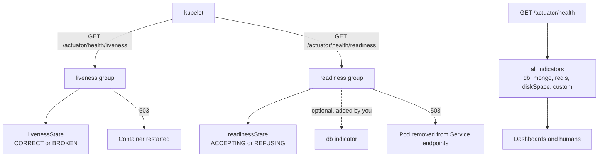
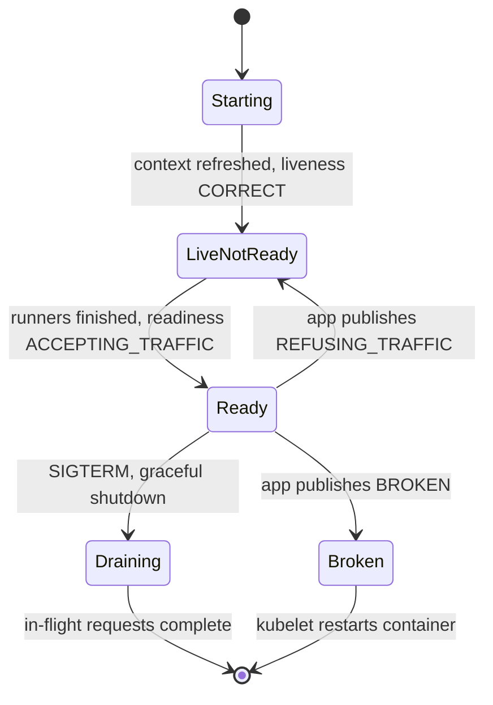
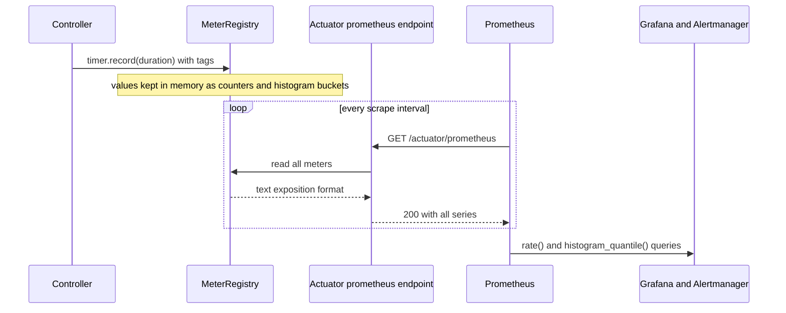

# Actuator, Health Checks & Metrics (Micrometer)

!!! warning "Draft: not yet fact-checked"
    This page was written but its independent review pass has not run yet. Verify version numbers and defaults against the linked sources.


!!! abstract "TL;DR"
    - **Actuator** = production endpoints (`/actuator/health`, `metrics`, `prometheus`, `env`, `loggers`, ...). Over HTTP, **only `health` is exposed by default**. Everything else is opt-in via `management.endpoints.web.exposure.include`.
    - **Health** is a tree of `HealthIndicator`s combined by a `StatusAggregator` (`DOWN` > `OUT_OF_SERVICE` > `UP` > `UNKNOWN`). `DOWN` and `OUT_OF_SERVICE` return **HTTP 503**.
    - **Liveness** = "restart me", **readiness** = "stop sending me traffic". Liveness must **never** check external dependencies, or one database blip restarts the whole fleet.
    - **Micrometer** is "SLF4J for metrics": you code against `MeterRegistry` (`Counter`, `Timer`, `Gauge`, `DistributionSummary`), and a registry dependency ships the data to Prometheus, Datadog, CloudWatch, etc.
    - The two classic production mistakes: **exposing all endpoints unsecured** (`heapdump`, `env`) and **high-cardinality tags** (user ID, raw URL) that blow up the metrics backend.

## Why it matters

Once a service is in production, three questions come up every day:

1. **Is it alive and able to take traffic?** The orchestrator (Kubernetes, a load balancer) needs a machine-readable answer.
2. **How is it behaving?** Request rate, error rate, latency, pool usage, GC pauses, consumer lag.
3. **What is it running with?** Which config, which build, which log levels, and can I change a log level without a redeploy?

Before Actuator, every team wrote its own `/ping` servlet, exported a few JMX beans, and tied the code to one monitoring vendor's client library. Actuator standardises the endpoints, and Micrometer standardises the metrics API so the vendor is a dependency choice and not a code rewrite.

For a Lead role this topic is rarely asked as "what is Actuator?". It appears as "your pods kept restarting during a database failover, why?" or "your Prometheus ran out of memory after a release, what happened?". Both answers live on this page.

## Core concepts

### What Actuator is

`spring-boot-starter-actuator` adds a set of **endpoints**. Each endpoint is a bean annotated with `@Endpoint(id = "...")` with `@ReadOperation`, `@WriteOperation` or `@DeleteOperation` methods. The endpoint is written once and is technology-neutral. Boot then adapts it to HTTP (Spring MVC, WebFlux or Jersey) and to JMX. It is all wired through auto-configuration (see [auto-configuration](02-auto-configuration-and-starters.md)).

An endpoint is usable only when two independent conditions hold:

| Condition | Meaning | Property |
|---|---|---|
| **Enabled / access** | The endpoint bean exists and operations are allowed | `management.endpoint.<id>.access` (`none`, `read-only`, `unrestricted`) from Boot 3.4. Older: `management.endpoint.<id>.enabled` |
| **Exposed** | It is reachable over a given technology | `management.endpoints.web.exposure.include` / `exclude` (and `.jmx.`) |

Defaults worth knowing:

- All endpoints except `shutdown` are enabled, but **only `health` is exposed over HTTP**. (Before Boot 2.5, `info` was exposed too.)
- The base path is `/actuator`. Change it with `management.endpoints.web.base-path`.
- `management.server.port` moves all endpoints to a separate port with its own embedded server context, so the public ingress never routes to them.

Commonly used endpoints:

| Endpoint | Purpose | Risk if public |
|---|---|---|
| `health` | Aggregated health, groups, probes | Low (keep details hidden) |
| `info` | Build, git commit, custom info | Low |
| `metrics` | Drill into one meter by name and tag | Medium |
| `prometheus` | Scrape format for Prometheus | Medium |
| `loggers` | Read **and change** log levels at runtime | High (write operation) |
| `env`, `configprops` | Resolved configuration | High (values are masked by default in Boot 3) |
| `threaddump`, `heapdump` | Diagnostics | **Critical**: a heap dump contains secrets, tokens and patient data in plain memory |
| `shutdown` | Stops the app | Critical (disabled by default) |

### Health: indicators, aggregation, groups

A `HealthIndicator` is a bean with one method, `health()`, which returns a `Health` object: a `Status` plus a details map. Boot auto-configures an indicator for most infrastructure it finds on the classpath and in the context: `db` (DataSource), `mongo`, `redis`, `diskSpace`, `ping`, `rabbit`, `elasticsearch`, and so on. There is **no built-in Kafka indicator**, which surprises people.

The `health` endpoint walks all contributors and combines them with a `StatusAggregator`. The default severity order is:

`DOWN` → `OUT_OF_SERVICE` → `UP` → `UNKNOWN`

The worst status wins. An `HttpCodeStatusMapper` then maps `DOWN` and `OUT_OF_SERVICE` to **503**, and `UP` and `UNKNOWN` to **200**.

By default the response body is only `{"status":"UP"}`. Details are controlled by `management.endpoint.health.show-details` (`never` by default, `when-authorized`, `always`) and `show-components`.

**Health groups** let you publish different subsets under different URLs: `management.endpoint.health.group.<name>.include=db,redis` creates `/actuator/health/<name>`. Each group can have its own `show-details`, status order and HTTP mapping.

### Liveness and readiness

Kubernetes asks two different questions, and mixing them up is the most common real outage in this area.

| Probe | Question | Kubernetes action on failure |
|---|---|---|
| **Liveness** | Is the process in a broken state that only a restart can fix? | Kills and restarts the container |
| **Readiness** | Can this instance serve traffic right now? | Removes the pod from Service endpoints. No restart |
| **Startup** | Has the app finished starting? | Holds off the other two probes until it passes |

Spring Boot models this inside the application as **availability state**:

- `LivenessState`: `CORRECT` or `BROKEN`
- `ReadinessState`: `ACCEPTING_TRAFFIC` or `REFUSING_TRAFFIC`

Boot publishes these states during the lifecycle. Readiness becomes `ACCEPTING_TRAFFIC` only after `ApplicationRunner` and `CommandLineRunner` beans finish, and it flips to `REFUSING_TRAFFIC` when graceful shutdown starts. Your code can change the state by publishing an `AvailabilityChangeEvent`.

Two health groups expose the states: `/actuator/health/liveness` and `/actuator/health/readiness`. They are enabled automatically when Boot detects Kubernetes, or with `management.endpoint.health.probes.enabled=true` (Spring Boot 4 enables them by default). Out of the box each group contains only its own state indicator, so **neither group checks the database unless you add it**.


*Notice that the liveness group has no arrow to any external system. Only the readiness group may include a dependency, and the full `/actuator/health` is for people and dashboards, not for probes.*

Why liveness must stay internal: if the liveness group includes `db` and the database has a 60-second failover, **every** pod fails liveness at the same moment. Kubernetes restarts all of them. They all come back together, open connection pools together, and hit a database that has just recovered. A restart cannot fix a remote database, so the restart only adds damage.

Readiness with dependencies is a judgement call. Include a dependency only if the instance is truly useless without it **and** the failure is local to that instance. If the dependency is shared, all pods go unready together and the Service has zero endpoints. Clients then get connection errors from the ingress instead of a clean, fast 503 or a degraded response from your own code. For shared dependencies, a circuit breaker and fallback are usually a better tool than readiness.


*Notice that there are two ways out of Ready: a temporary step back to "live but not ready", which needs no restart, and Broken, which is the only path that should lead to a restart.*

### Micrometer: the metrics facade

Micrometer gives you one API and many backends. The central type is `MeterRegistry`. Boot auto-configures a `CompositeMeterRegistry` and adds one concrete registry for each `micrometer-registry-*` dependency on the classpath.

A **meter** is identified by a **name plus a set of tags** (key-value pairs). This is the *dimensional* model: one meter name `http.server.requests` with tags `method`, `uri`, `status`, `outcome`, instead of hundreds of hierarchical names like `http.orders.get.200`. Each unique tag combination is a separate time series in the backend.

| Meter | Measures | Example |
|---|---|---|
| `Counter` | A value that only goes up | Orders placed, messages sent to DLQ |
| `Gauge` | A current value that goes up and down, sampled when read | Queue size, pool active connections |
| `Timer` | Count + total time + max of short events, optional histogram | HTTP request latency |
| `DistributionSummary` | Same as Timer but for non-time values | Payload size in bytes |
| `LongTaskTimer` | Duration of tasks still running | Batch job in progress |

Micrometer also handles **naming conventions**. You write `orders.placed` and the Prometheus registry publishes `orders_placed_total`. A timer named `http.server.requests` becomes `http_server_requests_seconds_count`, `_sum`, `_max` and, if histograms are on, `_bucket`.

What Boot instruments for you with no code: JVM memory, GC, threads, class loading, CPU, uptime, Logback event counts, Tomcat, HikariCP, `http.server.requests`, `http.client.requests` (for `RestClient`, `RestTemplate` and `WebClient` built from the auto-configured builders), Spring Data repositories, cache, Kafka clients and more.

### Push vs pull


*Notice that the application only keeps cumulative numbers in memory. Rates and percentiles are computed later in the backend, which is why you can aggregate them across pods.*

Prometheus **pulls**. Datadog, CloudWatch, OTLP and others are **push** registries that publish on a step interval (one minute by default). For push registries Micrometer converts cumulative values to per-step rates before sending.

### Percentiles and histograms

A `Timer` can give you latency percentiles in two ways. The difference is a favourite senior question.

- **Client-side percentiles** (`management.metrics.distribution.percentiles.http.server.requests=0.95,0.99`): each instance computes its own p95 and publishes it as a gauge. You **cannot aggregate** these. The average of ten p99 values is not the fleet p99.
- **Percentile histograms** (`management.metrics.distribution.percentiles-histogram.http.server.requests=true`): each instance publishes bucket counters. The backend sums the buckets across instances and computes the quantile (`histogram_quantile` in PromQL). This is aggregable but creates many more series per tag combination.
- **SLO buckets** (`management.metrics.distribution.slo.http.server.requests=100ms,500ms,1s`): publish only the bucket boundaries you care about. This is cheap and enough for "what fraction of requests finished under 500 ms".

### The Observation API (Boot 3+)

Since Micrometer 1.10 and Spring Boot 3, the framework instruments itself with `Observation` instead of using `Timer` directly. One observation produces **a timer, a long task timer, and a trace span** through pluggable handlers. `ObservationRegistry` is the entry point, and Micrometer Tracing (the replacement for Spring Cloud Sleuth) bridges to OpenTelemetry or Brave. There is more on this on the [Spring Boot 3.x page](10-spring-boot-3-x-jakarta-ee-graalvm-native-image-virtual-thre.md).

There is one cardinality rule built in: an observation has **low-cardinality key values** (they become metric tags and span tags) and **high-cardinality key values** (they go only to the span). This is the right mental model: user IDs belong in traces and logs, not in metric tags.

## In practice: code & configuration

### Baseline configuration

```yaml
management:
  server:
    port: 9090                          # endpoints on a separate port, not routed by the public ingress
  endpoints:
    web:
      exposure:
        include: health,info,prometheus,loggers   # explicit allow-list, never "*"
  endpoint:
    health:
      show-details: when-authorized     # default is "never"
      probes:
        enabled: true                   # /health/liveness and /health/readiness
        add-additional-paths: true      # also serve /livez and /readyz on the MAIN port
      group:
        readiness:
          include: readinessState,db    # only dependencies this instance truly owns
        liveness:
          include: livenessState        # nothing external, ever
  metrics:
    tags:
      application: ${spring.application.name}   # common tag on every meter
    distribution:
      percentiles-histogram:
        http.server.requests: true      # aggregable latency histogram
      slo:
        http.server.requests: 100ms,300ms,1s
server:
  shutdown: graceful                    # default from Boot 3.4
spring:
  lifecycle:
    timeout-per-shutdown-phase: 30s     # keep below terminationGracePeriodSeconds
```

Why `add-additional-paths`: with a separate management port, the probe could succeed while the main connector is broken (for example the request thread pool is exhausted). Serving `/livez` and `/readyz` on the main port makes the probe test the same path real traffic uses.

```yaml
# Kubernetes container spec (fragment)
startupProbe:
  httpGet: { path: /livez, port: 8080 }
  periodSeconds: 5
  failureThreshold: 30                  # up to 150 s to start, then the other probes begin
livenessProbe:
  httpGet: { path: /livez, port: 8080 }
  periodSeconds: 10
  failureThreshold: 3
readinessProbe:
  httpGet: { path: /readyz, port: 8080 }
  periodSeconds: 5
  failureThreshold: 2
```

### A custom health indicator

```java
@Component("claimsApi")                                    // bean name minus "HealthIndicator" suffix = component id
class ClaimsApiHealthIndicator implements HealthIndicator {

    private final RestClient client;
    private final AtomicReference<Cached> last = new AtomicReference<>();

    ClaimsApiHealthIndicator(RestClient.Builder builder) {
        var factory = new JdkClientHttpRequestFactory();
        factory.setReadTimeout(Duration.ofSeconds(1));     // a health check must be fast and bounded
        this.client = builder.baseUrl("https://claims.internal").requestFactory(factory).build();
    }

    @Override
    public Health health() {
        Cached c = last.get();
        if (c != null && c.at().isAfter(Instant.now().minusSeconds(10))) {
            return c.health();                             // cache: probes and dashboards must not hammer the upstream
        }
        Health h = check();
        last.set(new Cached(h, Instant.now()));
        return h;
    }

    private Health check() {
        try {
            client.get().uri("/ping").retrieve().toBodilessEntity();
            return Health.up().build();
        } catch (Exception ex) {
            return Health.down(ex).withDetail("upstream", "claims").build();   // details shown only when authorized
        }
    }

    private record Cached(Health health, Instant at) {}
}
```

This indicator appears in the full `/actuator/health`. It is **not** in the liveness or readiness groups unless you add it to them, which is the behaviour you want.

### Liveness mistake vs correct approach

=== "❌ Common mistake"
    ```yaml
    # One endpoint for everything, and it checks the database, Redis and Mongo.
    livenessProbe:
      httpGet: { path: /actuator/health, port: 8080 }
    readinessProbe:
      httpGet: { path: /actuator/health, port: 8080 }
    ```
    ```yaml
    management:
      endpoint:
        health:
          group:
            liveness:
              include: livenessState,db,redis      # a Redis blip now restarts every pod
    ```

=== "✅ Correct approach"
    ```yaml
    livenessProbe:
      httpGet: { path: /livez, port: 8080 }        # internal state only
    readinessProbe:
      httpGet: { path: /readyz, port: 8080 }       # may include instance-local dependencies
    ```
    ```java
    // Tell the platform explicitly when a restart is the only fix.
    @Component
    class ConsumerWatchdog {
        private final ApplicationEventPublisher events;

        ConsumerWatchdog(ApplicationEventPublisher events) { this.events = events; }

        void onUnrecoverableConsumerFailure(Exception cause) {
            // flips /livez to 503, kubelet restarts the container
            AvailabilityChangeEvent.publish(events, cause, LivenessState.BROKEN);
        }

        void onCacheWarmupStarted() {
            // flips /readyz to 503, pod leaves the load balancer, no restart
            AvailabilityChangeEvent.publish(events, this, ReadinessState.REFUSING_TRAFFIC);
        }
    }
    ```

### Custom metrics

=== "❌ Common mistake"
    ```java
    @Service
    class PrescriptionService {
        private final MeterRegistry registry;
        PrescriptionService(MeterRegistry registry) { this.registry = registry; }

        void refill(String memberId, String rxId) {
            // memberId and rxId are unbounded: one new time series per member per prescription.
            registry.counter("rx.refill", "member", memberId, "rx", rxId).increment();
        }
    }
    ```

=== "✅ Correct approach"
    ```java
    @Service
    class PrescriptionService {
        private final MeterRegistry registry;
        private final Timer upstreamTimer;

        PrescriptionService(MeterRegistry registry, BlockingQueue<Refill> pending) {
            this.registry = registry;
            this.upstreamTimer = Timer.builder("rx.upstream.call")
                .description("Latency of the pharmacy upstream")
                .tag("upstream", "pharmacy")                 // bounded value
                .publishPercentileHistogram()                // aggregable percentiles
                .register(registry);                         // register once, reuse the reference

            // Gauge reads the value on scrape. The registry holds only a WEAK reference to "pending",
            // so the object must be strongly referenced somewhere else (here: it is a Spring bean).
            Gauge.builder("rx.refill.pending", pending, BlockingQueue::size).register(registry);
        }

        Refill refill(RefillRequest request) {
            try {
                Refill result = upstreamTimer.record(() -> callPharmacy(request));
                count(request.channel(), "success");
                return result;
            } catch (RuntimeException ex) {
                count(request.channel(), "failure");
                throw ex;
            }
        }

        private void count(Channel channel, String outcome) {
            // Tags come from small enums. Same tag KEYS on every call (Prometheus requires it).
            // registry.counter(...) is a lookup: it returns the existing meter for the same name and tags.
            registry.counter("rx.refill", "channel", channel.name(), "outcome", outcome).increment();
        }
    }
    ```

Annotation style, when you only need timing around a method:

```java
@Observed(name = "rx.eligibility.check",                    // creates a timer AND a span
          lowCardinalityKeyValues = {"plan.type", "commercial"})
public Eligibility check(String memberId) { ... }
```

`@Observed`, `@Timed` and `@Counted` work through AOP aspects. You need `spring-boot-starter-aop` and, from Boot 3.2, `management.observations.annotations.enabled=true` (before that you declared the `ObservedAspect` / `TimedAspect` beans yourself). Because they are proxies, the **self-invocation pitfall** applies: a call from another method in the same class is not measured (see [AOP & proxies](04-aop-and-proxies.md)).

A guard against cardinality explosions:

```java
@Bean
MeterFilter rxTagLimit() {
    // After 50 distinct "upstream" values on meters starting with "rx.", deny new series.
    return MeterFilter.maximumAllowableTags("rx.", "upstream", 50, MeterFilter.deny());
}
```

### Securing the endpoints

```java
@Bean
@Order(1)
SecurityFilterChain actuatorChain(HttpSecurity http) throws Exception {
    http.securityMatcher(EndpointRequest.toAnyEndpoint())            // only /actuator/**
        .authorizeHttpRequests(auth -> auth
            .requestMatchers(EndpointRequest.to(HealthEndpoint.class, InfoEndpoint.class)).permitAll()
            .requestMatchers(EndpointRequest.to("prometheus")).hasRole("METRICS")
            .anyRequest().hasRole("OPS"))                            // loggers, env, threaddump...
        .httpBasic(Customizer.withDefaults());
    return http.build();
}
```

`EndpointRequest` is better than hard-coded paths because it follows `base-path` and path-mapping changes.

## Real-world usage

- **Kubernetes probes** are the main consumer of health groups. The Spring Boot reference documentation itself warns against putting external systems into liveness and asks you to think carefully before putting shared ones into readiness.
- **Prometheus + Grafana** is the most common pairing with Micrometer. Micrometer came out of the Spring team at Pivotal and carries ideas from Netflix's Spectator and Atlas, where dimensional metrics were used at very large scale.
- **RED and USE dashboards**: Rate, Errors, Duration per endpoint come directly from `http.server.requests`. Utilisation and saturation come from `hikaricp.connections.*`, `tomcat.threads.*`, `jvm.memory.*` and `executor.*`.
- **Security incidents**: exposed Actuator endpoints are a well-known finding in penetration tests and bug bounty reports. A public `/actuator/heapdump` gives an attacker every secret in memory, and `/actuator/env` leaked credentials in Boot 1.x and 2.x setups where masking was weak. **CVE-2022-22947** was remote code execution through the Spring Cloud Gateway actuator endpoint when it was exposed and unsecured.
- **Healthcare and banking**: details in health responses and metric tags are data. A member ID or account number in a tag or in a health detail is PHI or PII stored in a monitoring system that usually has weaker access control and longer retention than the main database. Keep identifiers in audited logs and traces with proper controls, not in tags.
- **Runtime log levels**: `POST /actuator/loggers/com.acme.rx` with `{"configuredLevel":"DEBUG"}` during an incident avoids a redeploy. It is one of the most useful and least known operational features, and one that must be behind authentication.

## Trade-offs & production gotchas

| Option | Pros | Cons | Use when |
|---|---|---|---|
| Same port for Actuator | Simple, probes test the real connector | Must secure with Spring Security and ingress rules | Small services, strong security config |
| Separate `management.server.port` | Network-level isolation, no public route | Probe may pass while the main port is stuck (fix with additional paths) | Most Kubernetes deployments |
| Readiness includes dependency | Traffic stops reaching an instance that cannot work | Shared dependency outage removes all pods at once | Dependency is local to the instance or truly mandatory |
| Readiness without dependencies + circuit breaker | Service stays reachable and degrades gracefully | Callers see errors or fallbacks you must design | Shared dependencies, partial functionality possible |
| Client-side percentiles | Cheap, few series | Cannot be aggregated across instances | Single instance or quick local debugging |
| Percentile histograms | Correct fleet-wide percentiles | Many series per tag combination | SLO-relevant timers only |
| Pull (Prometheus) | Backend controls load, easy to see a dead target | Needs service discovery, weak for short-lived jobs | Long-running services |
| Push (OTLP, Datadog, CloudWatch) | Works for batch and serverless, no inbound port | A silent app looks the same as a dead one | Lambda, jobs, managed SaaS backends |

!!! warning "Gotchas"
    - **`exposure.include: "*"`** copied from a tutorial into production exposes `heapdump`, `env`, `threaddump` and `loggers`. Use an explicit allow-list.
    - **Liveness with external checks** causes fleet-wide restart storms during a dependency outage.
    - **Slow health indicators**: indicators run on the request thread and the probe has a timeout (1 second by default in Kubernetes). One slow upstream check makes the whole health call time out, and the probe fails. Use short timeouts and cache the result.
    - **High-cardinality tags** (user ID, order ID, raw path, exception message) create unbounded time series. Memory grows in the app *and* in Prometheus. Boot protects the built-in `uri` tag by using the path **template** (`/orders/{id}`), not the raw path.
    - **Gauge weak references**: a gauge whose state object is garbage collected reports `NaN`. Never pass a temporary object to `Gauge.builder`.
    - **Different tag keys for one meter name**: the Prometheus registry rejects a second meter with the same name but a different set of tag keys. Always use the same keys, with a value such as `none` where needed.
    - **`max` on a Timer is not all-time max**. It is a decaying maximum over a time window, so it drops back when traffic is quiet.
    - **Counters reset on restart**. Never alert on the raw value. Use `rate()` or `increase()`, which handle resets.
    - **Averages hide problems**. `sum / count` is the mean latency. Alert on p95 or p99 from histograms instead.
    - **Graceful shutdown and probes**: Kubernetes removes the pod from endpoints in parallel with sending `SIGTERM`. Without graceful shutdown (or a short `preStop` sleep) some requests arrive at a closing server.

!!! tip "Endpoint caching"
    `management.endpoint.<id>.cache.time-to-live` caches read operations that take no parameters. Do not rely on it for `health`; cache inside expensive indicators instead.

!!! question "Interview angle: version differences"
    - **Boot 2.x → 3.x**: Sleuth replaced by Micrometer Tracing, the Observation API introduced, `httptrace` renamed to `httpexchanges`, `env` and `configprops` values fully masked by default (`show-values: never`), only `health` exposed over JMX by default.
    - **Boot 3.4**: `management.endpoint.<id>.access` replaces `enabled`, and graceful shutdown becomes the default.
    - **Boot 4.x**: liveness and readiness probes enabled by default, and the health API moved to its own module with new package names. Check the migration guide before quoting package names.

## How this connects to my experience

The resume does not name Actuator or Micrometer, so the honest position is: "standard on every Spring Boot service I owned, here is how I used it". The strongest hooks are below.

- **Where I used it:**
    - **Publicis Sapient, OptumRx Meteor**: owned the GraphQL Consumer Service end-to-end (integration layer between 5 upstream systems), built with Spring Boot, Kafka, MongoDB and Redis, and was responsible for production support and release management. Health checks and metrics are part of owning a service like this. *[confirm: was it on Kubernetes with liveness and readiness probes, and which metrics backend, for example Prometheus/Grafana, Datadog, Dynatrace or Splunk]*
    - **Deloitte, ConvergeHealth Data Asset Explorer**: microservices on ECS and EKS. Load balancer target group health checks and container health checks are the same idea as readiness. *[confirm: whether Actuator health was the ALB health check path and whether CloudWatch was the metrics backend]*
    - **Coriolis, CCKM**: Spring Boot REST APIs deployed through GitLab CI/CD. *[confirm: any health or metrics endpoints used there]*
- **Talking points:**
    - "For an aggregation service in front of 5 upstreams, I kept upstream checks **out of liveness**. One upstream being down should degrade one part of the graph, not restart the pods." *[confirm this matches the real probe configuration]*
    - "Per-upstream latency and error-rate timers with an `upstream` tag are the first dashboard I look at in an incident, because the service is only as fast as its slowest upstream." *[confirm dashboards and alert thresholds]*
    - "For Kafka retry and DLQ flows, the key signals are consumer lag and a DLQ counter tagged by topic and error type. A DLQ rate above zero should alert." *[confirm what was actually alerted on]*
    - "Redis cache hit ratio (`cache.gets` with `result=hit|miss`) shows whether the caching I added is paying off." *[confirm whether cache metrics were enabled]*
    - "In a healthcare system I keep member identifiers out of metric tags and health details, because the monitoring stack is not a PHI store."
    - As a lead: "I made a standard Actuator configuration (allow-listed endpoints, separate port, probe groups) part of the service template so teams do not reinvent it." *[confirm, fits the "established engineering standards" bullet]*
- **Likely follow-up chain:** "How did you monitor the GraphQL service?" → "What was in your readiness probe, and why not the upstreams?" → "An upstream gets slow: what do your metrics show and what alerts fire?" → "How do you get p99 across 10 pods?" → "How did you keep the Actuator endpoints secure?"
    - Answer path: RED metrics per operation and per upstream → readiness holds only local state, upstream failures are handled by timeouts and circuit breakers → upstream timer p99 rises, thread or connection pool gauges saturate, then server-side p99 rises → histogram buckets summed in the backend, not averaged percentiles → allow-list, separate port, Spring Security on the rest.

## Interview questions

### Fundamentals

??? question "Q1. What is Spring Boot Actuator and which endpoints are available by default?"
    **Answer:** Actuator is a starter that adds production endpoints for health, metrics, configuration, loggers, thread dumps and more. Endpoints are written once with `@Endpoint` and exposed over HTTP and JMX. All endpoints except `shutdown` are enabled, but over HTTP only `health` is exposed by default. Others are added with `management.endpoints.web.exposure.include`.

    **Interviewer listens for:** The difference between *enabled* and *exposed*, and that the default is secure.

    **Common wrong answer:** "All endpoints are available at `/actuator` by default." That was closer to Boot 1.x behaviour, with its own sensitivity flags.

??? question "Q2. How does the health endpoint decide the overall status and HTTP code?"
    **Answer:** Each `HealthIndicator` returns a `Status`. A `StatusAggregator` picks the most severe one using the order `DOWN`, `OUT_OF_SERVICE`, `UP`, `UNKNOWN`. An `HttpCodeStatusMapper` maps `DOWN` and `OUT_OF_SERVICE` to 503 and the others to 200. Both the order and the mapping are configurable, and custom statuses can be added.

    **Interviewer listens for:** Worst status wins, 503 for down, and that details are hidden by default (`show-details: never`).

??? question "Q3. What is the difference between liveness and readiness?"
    **Answer:** Liveness says the application's internal state is broken and only a restart can fix it. Kubernetes restarts the container when it fails. Readiness says the instance cannot serve traffic right now. Kubernetes removes it from the Service endpoints but does not restart it. Spring Boot models them as `LivenessState` and `ReadinessState` and exposes them at `/actuator/health/liveness` and `/actuator/health/readiness`.

    **Interviewer listens for:** The different *actions* on failure. That is what drives every design decision.

    **Common wrong answer:** "Liveness checks that the app is up, readiness checks the database." Readiness does not check anything external by default.

??? question "Q4. What is Micrometer and why not use the Prometheus client directly?"
    **Answer:** Micrometer is a vendor-neutral metrics facade. Code depends on `MeterRegistry` and meter types. The backend is chosen by adding a registry dependency. It also handles naming conventions, base units, common tags, filters and rate normalisation for push systems. Using a vendor client directly locks all instrumentation code, including library code, to that vendor. Spring, Hikari, Kafka clients and others already instrument themselves with Micrometer, so you get those metrics for free.

    **Interviewer listens for:** The "SLF4J for metrics" analogy and the dimensional (tags) model.

??? question "Q5. Name the main meter types and when to use each."
    **Answer:** `Counter` for things that only increase (events, errors). `Gauge` for a current value that can go down (queue depth, pool size). `Timer` for short durations, giving count, total time, max and optional histogram. `DistributionSummary` for non-time distributions such as payload size. `LongTaskTimer` for tasks still in progress.

    **Common wrong answer:** Using a gauge for request count, or a counter for something that can decrease. A rule of thumb: if you would compute a rate from it, it is a counter. If you would look at its current value, it is a gauge.

### Intermediate

??? question "Q6. Why should the liveness probe not include a database check?"
    **Answer:** A restart cannot fix a remote dependency. If the database is down for a minute, every pod fails liveness together, Kubernetes restarts them all, in-flight work is lost, and on restart they all open connections at once against a recovering database. The outage becomes longer and wider. Liveness should reflect only unrecoverable internal state such as a deadlock or corrupted local state.

    **Interviewer listens for:** "Cascading restarts" or "restart storm", and the idea that a probe should only trigger an action that can actually help.

??? question "Q7. Should readiness include downstream dependencies?"
    **Answer:** It depends, and the reasoning matters. Include it when the instance is useless without it and the problem can be specific to that instance (its own connection pool, a local cache that must be warm). Be careful with shared dependencies: when they fail, all instances go unready and the Service has no endpoints, so callers get ingress-level errors and you lose the chance to return a controlled 503 or a fallback. For shared dependencies, prefer timeouts, circuit breakers and degraded responses.

    **Interviewer listens for:** A trade-off, not a rule. A mention of partial functionality: a service with 5 upstreams should not go unready because one is down.

??? question "Q8. Client-side percentiles vs percentile histograms. Which do you use for a service with 20 pods?"
    **Answer:** Histograms. Client-side percentiles are computed per instance and published as gauges. Percentiles cannot be averaged, so there is no correct way to get a fleet-wide p99 from them. With `percentiles-histogram`, each pod publishes bucket counters, the backend sums buckets across pods and computes the quantile. The cost is more series, so I turn it on only for timers tied to SLOs, or use `slo` boundaries.

    **Interviewer listens for:** "You cannot average percentiles."

??? question "Q9. Gotcha: what is wrong with this code?"
    ```java
    registry.counter("http.errors", "path", request.getRequestURI(), "user", userId).increment();
    ```
    **Answer:** Both tags are unbounded. The raw URI contains IDs (`/orders/123`, `/orders/124`) and `userId` has one value per user. Each unique combination is a new `Counter` object held in the registry forever and a new time series in the backend. The app's heap grows, the scrape response grows, and Prometheus memory grows until something falls over. Use the route template (`/orders/{id}`) and drop the user tag. Put user IDs in logs or trace attributes.

    **Interviewer listens for:** The word *cardinality* and the fact that the damage is in both the app and the backend.

??? question "Q10. Gotcha: a gauge always shows NaN in Grafana. Why?"
    ```java
    void init(MeterRegistry registry) {
        List<Job> jobs = new ArrayList<>(loadJobs());
        Gauge.builder("jobs.pending", jobs, List::size).register(registry);
    }
    ```
    **Answer:** Micrometer holds the gauge's state object through a **weak reference** so that a gauge never causes a memory leak. Here `jobs` is a local variable. After `init` returns, nothing holds it strongly, it is garbage collected, and the gauge reports `NaN`. Keep the object in a field of a long-lived bean, or use `strongReference(true)` on the builder if that is really the intent.

??? question "Q11. How do `@Timed` and `@Observed` work, and when do they silently not work?"
    **Answer:** They are handled by AOP aspects (`TimedAspect`, `ObservedAspect`), which wrap the bean in a proxy. They do not work when the aspect is not registered (needs the AOP starter and, in Boot 3.2+, `management.observations.annotations.enabled=true`), on self-invocation within the same class, on private methods, or on objects that are not Spring beans. On Spring MVC controllers, requests are already timed by `http.server.requests` without any annotation.

    **Interviewer listens for:** The link to proxies and self-invocation.

### Senior

??? question "Q12. How would you secure Actuator in a regulated environment?"
    **Answer:** In layers:

    1. **Expose the minimum**: an explicit allow-list, usually `health`, `info`, `prometheus`, and `loggers` if operations need it. Never `*`.
    2. **Network isolation**: `management.server.port` on a port that the public ingress does not route, plus a NetworkPolicy that allows only the monitoring namespace and the kubelet.
    3. **Authentication and authorisation**: a dedicated `SecurityFilterChain` with `EndpointRequest`, with health open and everything else role-based. Write operations such as `loggers` need a stricter role.
    4. **Data hygiene**: `show-details: when-authorized`, keep `env` and `configprops` values masked, no identifiers in health details or metric tags.
    5. **Never expose `heapdump`** on a service that handles PHI or card data. If needed, take a dump through controlled operational access and treat the file as sensitive data.
    6. **Audit**: log access to sensitive endpoints.

    **Interviewer listens for:** Defence in depth, and awareness that a heap dump is a data breach.

??? question "Q13. What does the Observation API add over plain timers?"
    **Answer:** One instrumentation point with several outputs. An `Observation` has a start, stop, error and context. Handlers turn it into a timer, a long task timer and a trace span, and can add logging correlation. It separates low-cardinality key values (metric tags) from high-cardinality ones (span attributes only). Spring Framework 6 and Boot 3 instrument HTTP server, HTTP clients, messaging and data access with it, so metric tags and span names are consistent. With exemplars, a latency bucket in a dashboard can link to a trace ID that landed in that bucket.

    **Interviewer listens for:** Metrics and traces from one API, and the low vs high cardinality split.

??? question "Q14. How do you design alerts from these metrics for an API service?"
    **Answer:** Start from symptoms the user feels, then causes.

    - **Symptoms (page someone):** error ratio from `http.server.requests` (`outcome=SERVER_ERROR` over total) and p99 latency from histogram buckets, both measured against an SLO and preferably as a burn rate over two windows.
    - **Saturation (warn):** Hikari `pending` connections above zero for some minutes, Tomcat busy threads near max, heap after GC trending up, Kafka consumer lag growing.
    - **Dependencies:** per-upstream timer error rate and latency, circuit breaker state.
    - **Business:** DLQ counter rate above zero, drop in a key business counter compared with the same time last week.

    Use `rate()` on counters, never raw values. Avoid alerting on averages or on a single pod's health flapping.

    **Interviewer listens for:** RED/USE, SLO thinking, symptom vs cause, and avoiding noisy alerts.

??? question "Q15. How does graceful shutdown interact with readiness?"
    **Answer:** On `SIGTERM`, Boot publishes `ReadinessState.REFUSING_TRAFFIC`, the web server stops accepting new requests, and `SmartLifecycle` beans stop in phases while in-flight requests finish, up to `spring.lifecycle.timeout-per-shutdown-phase`. In Kubernetes the endpoint removal and the `SIGTERM` happen in parallel, so some proxies still send requests for a short time. A small `preStop` sleep gives the network time to converge. `terminationGracePeriodSeconds` must be longer than the preStop sleep plus the shutdown timeout, or the kubelet sends `SIGKILL` mid-request.

    **Interviewer listens for:** The race between endpoint removal and SIGTERM, and the three timeouts that must line up.

### Scenario-based

??? question "Q16. During a 2-minute MongoDB failover, all pods of your service restarted several times and recovery took 15 minutes. What happened and how do you fix it?"
    **Answer:** The liveness probe pointed at `/actuator/health` (or the liveness group included `mongo`). The Mongo indicator went `DOWN`, the endpoint returned 503, and after `failureThreshold` the kubelet restarted every container. Startup needs Mongo too, so pods crash-looped with increasing back-off. When Mongo returned, the back-off delay and the synchronised cold start of all pods extended the outage.

    Fix: point liveness at `/livez` with only `livenessState`. Decide deliberately about readiness. Add a `startupProbe`. Make the application tolerate Mongo being unavailable at startup and at runtime with driver timeouts and retries. Add a dashboard panel for container restarts so this is visible.

    **Interviewer listens for:** Diagnosis from the symptom "all pods at once", and a fix that changes the probe design, not just the thresholds.

??? question "Q17. After a release, Prometheus memory doubled and the service's `/actuator/prometheus` response went from 200 KB to 40 MB. How do you investigate?"
    **Answer:** This is a cardinality explosion. Steps:

    1. Find the meter: in Prometheus, count series by metric name (`topk` over `count by (__name__)`), or look at the scrape output and group by name.
    2. Find the tag: for that metric, count distinct values per label. Usually one label has thousands of values: an ID, a raw URL, an exception message, a tenant.
    3. Find the code: diff the release for new `registry.counter/timer` calls or new tags. A common cause is an HTTP client called with a fully built URL string instead of a URI template, so the `uri` tag of `http.client.requests` holds every distinct URL.
    4. Fix: use URI templates, replace the tag with a bounded one, or remove it.
    5. Guard: add `MeterFilter.maximumAllowableTags` or a deny filter, and add an alert on series count per target.

    **Interviewer listens for:** A method, the `http.client.requests` URI template cause, and a preventive guard.

??? question "Q18. Your service aggregates 5 upstream systems. One upstream is down. What should `/readyz`, `/livez` and `/actuator/health` return?"
    **Answer:** `/livez` returns 200: the process is fine. `/readyz` returns 200: the instance can still serve the parts of the API that do not need that upstream, and taking every pod out of rotation would turn a partial outage into a total one. `/actuator/health` can show the upstream indicator as `DOWN` for humans and dashboards, with an alert on it. I would consider a custom status such as `DEGRADED` mapped to 200 so the overall status is honest without failing anything. The request path handles the failed upstream with a timeout, a circuit breaker, and a partial response (GraphQL can return data plus errors).

    **Interviewer listens for:** Three endpoints with three audiences, and partial availability as a design goal.

??? question "Q19. A security scan reports that `/actuator/heapdump` and `/actuator/env` are reachable from the internet. What do you do, in order?"
    **Answer:**

    1. **Contain now**: block `/actuator/**` at the ingress or WAF, which needs no deploy.
    2. **Assume compromise**: a heap dump contains database passwords, OAuth client secrets, signing keys, session tokens and user data. Check access logs for requests to those paths. Rotate every secret the service holds. Involve security and compliance, because for PHI or banking data this may be a reportable incident.
    3. **Fix properly**: allow-list exposure, move to a management port, add the security filter chain, set `access: none` for `heapdump`.
    4. **Prevent**: put the safe configuration in the shared service template, add a pipeline check or contract test that fails if unexpected Actuator paths return 200 without credentials.

    **Interviewer listens for:** Containment before root cause, secret rotation, and a systemic fix across services.

??? question "Q20. Health checks time out now and then and pods flap between ready and unready, but the application seems fine. What do you look at?"
    **Answer:** Probe timeouts are about the *latency* of the health call. Candidates: a slow indicator in the readiness group (a remote call without a timeout, a DB validation query waiting for a pool connection), request thread pool exhaustion so the probe queues behind real traffic, long GC pauses, or CPU throttling from a low CPU limit. I check which component is slow using the health details, pool and thread metrics, GC pause metrics and container throttling metrics. Fixes: remove or cache slow indicators, set tight timeouts in them, raise `timeoutSeconds` or `failureThreshold` modestly, and fix the actual saturation. A flapping readiness probe under load makes things worse, because the remaining pods take more traffic and then fail too.

    **Interviewer listens for:** That probes share resources with real traffic, and the feedback loop of readiness failures under load.

## Cheat sheet

| Concept | Remember |
|---|---|
| Default exposure | Only `health` over HTTP. `shutdown` disabled |
| Expose | `management.endpoints.web.exposure.include=health,info,prometheus` |
| Enable (3.4+) | `management.endpoint.<id>.access=none|read-only|unrestricted` |
| Status order | `DOWN` > `OUT_OF_SERVICE` > `UP` > `UNKNOWN`. First two give 503 |
| Details | `show-details`: `never` (default), `when-authorized`, `always` |
| Probes | `/actuator/health/liveness`, `/actuator/health/readiness`. `/livez`, `/readyz` on main port with `add-additional-paths` |
| Liveness | Internal state only. Failure means restart |
| Readiness | Failure means no traffic. Add dependencies with care |
| Change state | `AvailabilityChangeEvent.publish(ctx, source, state)` |
| Custom health | Implement `HealthIndicator`. Fast, bounded, cached |
| No Kafka indicator | Write your own or watch consumer lag metrics |
| Meter identity | Name + tags. Each tag combination is one series |
| Meter types | Counter, Gauge, Timer, DistributionSummary, LongTaskTimer |
| Cardinality | Bounded tag values only. IDs go to logs and traces |
| Percentiles | Histograms aggregate. Client-side percentiles do not |
| Gauge | Weak reference to state. `NaN` if collected |
| Counter | Resets on restart. Query with `rate()` |
| Common tags | `management.metrics.tags.application=...` |
| Observation | One API gives timer + span. Low vs high cardinality key values |
| Annotations | `@Timed`, `@Observed` are AOP. Self-invocation is not measured |
| Security | Allow-list, separate port, `EndpointRequest` filter chain, never `heapdump` in public |
| Shutdown | `server.shutdown=graceful`. Grace period > preStop + phase timeout |

## Sources

1. [Spring Boot Reference: Actuator Endpoints](https://docs.spring.io/spring-boot/reference/actuator/endpoints.html): exposure defaults, access control, health indicators, status aggregation, health groups, Kubernetes probes and the guidance on external systems in probes.
2. [Spring Boot Reference: Metrics](https://docs.spring.io/spring-boot/reference/actuator/metrics.html): auto-configured meters, registries, common tags, distribution properties, `MeterFilter` usage.
3. [Spring Boot Reference: Observability](https://docs.spring.io/spring-boot/reference/actuator/observability.html): Observation API, `@Observed` support, common key values.
4. [Spring Boot Reference: Application Availability](https://docs.spring.io/spring-boot/reference/features/spring-application.html#features.spring-application.application-availability): `LivenessState`, `ReadinessState`, `AvailabilityChangeEvent`.
5. [Micrometer Documentation: Concepts](https://docs.micrometer.io/micrometer/reference/concepts.html): meter types, naming, tags, gauges and weak references, timers, histograms and percentiles.
6. [Kubernetes: Liveness, Readiness and Startup Probes](https://kubernetes.io/docs/concepts/configuration/liveness-readiness-startup-probes/): what each probe does and the action taken on failure.
7. [Spring Security Advisory: CVE-2022-22947](https://spring.io/security/cve-2022-22947): code injection through an exposed Spring Cloud Gateway actuator endpoint.
8. [Prometheus: Histograms and Summaries](https://prometheus.io/docs/practices/histograms/): why quantiles cannot be aggregated and histograms can.
