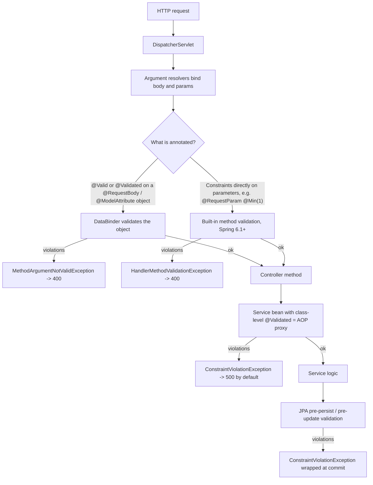
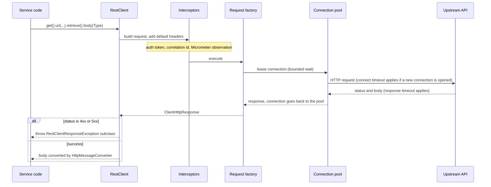

# Validation, REST clients (RestClient, WebClient, Feign)

!!! abstract "TL;DR"
    - **Validation = Jakarta Bean Validation (the spec) + Hibernate Validator (the implementation)**. Since Boot 2.3 it is *not* part of the web starter. You must add `spring-boot-starter-validation`, otherwise the annotations are silently ignored.
    - **Where it runs decides the exception:** `@Valid @RequestBody` → `MethodArgumentNotValidException` (400). Constraints directly on controller parameters (Spring 6.1+) → `HandlerMethodValidationException` (400). `@Validated` on a service class → AOP proxy → `ConstraintViolationException` (500 unless you map it).
    - **Most constraints treat `null` as valid** (`@Size`, `@Email`, `@Pattern`, `@Min`). Add `@NotNull` / `@NotBlank`. Nested objects are validated only if the field has `@Valid`.
    - **RestClient** (Spring 6.1 / Boot 3.2) is the default blocking client. **WebClient** is for reactive stacks, streaming and high fan-out. **`RestTemplate`** is legacy. **OpenFeign** is declarative but feature-complete; new code should prefer Spring's own **HTTP interface clients** (`@HttpExchange`).
    - **Every outbound call needs a connect timeout, a response timeout, a bounded connection pool, and a plan for failure** (retry only idempotent calls, circuit breaker, fallback). Defaults are often "wait forever".

## Why it matters

These two topics sit on the two edges of a service. Validation guards the **inbound** edge: bad data must be rejected before it reaches business logic or the database. REST clients are the **outbound** edge: most production outages in microservices are not bugs in your code but a slow dependency that eats all your threads.

Interviewers use them to separate people who "used the annotation" from people who know what happens underneath. Typical probes: "Why did my `@Min` on a service method do nothing?", "What is the default timeout of your HTTP client?", "RestClient or WebClient, and why?".

Before Bean Validation, each layer hand-wrote `if (x == null) throw ...` checks, and rules drifted between layers. Before `RestClient`, the choice was a 2009-era `RestTemplate` with dozens of overloaded methods, or pulling in the whole reactive stack just to get a fluent API.

## Core concepts

### Bean Validation in one minute

- **Jakarta Validation** is the specification: annotations (`@NotNull`, `@Size`, ...), the `Validator` API, and the rules for groups and cascading. Spring Boot 3.x uses Jakarta Validation 3.0 (package `jakarta.validation`, not `javax.validation`). See [Spring Boot 3.x](10-spring-boot-3-x-jakarta-ee-graalvm-native-image-virtual-thre.md) for the namespace change.
- **Hibernate Validator** is the reference implementation. It has nothing to do with Hibernate ORM beyond the name.
- A **constraint** is an annotation plus a `ConstraintValidator<A, T>` class. Validation produces a set of `ConstraintViolation` objects, each with a property path, a message and the invalid value.
- Spring Boot auto-configures a `LocalValidatorFactoryBean`. It is both a `jakarta.validation.Validator` and a Spring `Validator`, and it plugs in a `SpringConstraintValidatorFactory` so your custom validators can have dependencies injected.

### The three places validation runs

This is the part people get wrong. The same annotation behaves differently depending on who triggers it.


*Notice that the web layer gives you a clean 400 for free, but anything validated by the AOP proxy or by JPA throws `ConstraintViolationException`, which Spring MVC does not map, so the client sees a 500 unless you add a handler.*

**1. Web data binding (`@Valid` on an object argument).** The argument resolver (for example `RequestResponseBodyMethodProcessor`) deserialises the body, then asks the `DataBinder` to validate it. Violations become a `BindingResult`. If your method does not declare a `BindingResult` / `Errors` parameter right after the argument, Spring throws `MethodArgumentNotValidException`.

**2. Controller method validation (Spring Framework 6.1+, Boot 3.2+).** If a controller method has constraint annotations directly on parameters (`@RequestParam @Min(1) int page`, `@PathVariable @Pattern(...) String id`, `@RequestBody List<@Valid Item> items`), Spring MVC now validates them itself and throws `HandlerMethodValidationException`. You no longer need `@Validated` on the controller class. In fact, if you keep the class-level `@Validated`, the old AOP path wins and you are back to `ConstraintViolationException`.

**3. Method validation through AOP (`@Validated` on any bean).** `MethodValidationPostProcessor` wraps the bean in a proxy. The proxy validates parameters and the return value. Because it is a proxy, it has every proxy limitation described in [AOP & proxies](04-aop-and-proxies.md): **self-invocation skips validation**, and `private` methods are never validated.

There is a fourth trigger outside Spring: **JPA lifecycle validation**. If a validator is on the classpath, Hibernate ORM validates entities on persist and update. That is your last line of defence, not your first, because the error arrives late (at flush) and wrapped in a transaction exception.

### `@Valid` vs `@Validated`

| | `@Valid` | `@Validated` |
|---|---|---|
| Comes from | Jakarta Validation (standard) | Spring |
| Validation groups | No | Yes: `@Validated(OnCreate.class)` |
| Cascades into nested fields | **Yes, this is the only way** | No (cannot be placed on fields) |
| On a class | Meaningless | Turns on AOP method validation |
| On a controller argument | Triggers validation | Triggers validation, with groups |

### Null handling, cascading and containers

- `@Size`, `@Email`, `@Pattern`, `@Min`, `@Max`, `@Positive` all return **valid for `null`**. The spec does this so that "required" and "well-formed" are separate decisions.
- `@NotNull` rejects null. `@NotEmpty` rejects null and empty (string, collection, map, array). `@NotBlank` is for `CharSequence` only and also rejects whitespace-only.
- A nested object is validated only when its field has `@Valid`. For collections, put the annotation on the type argument: `List<@Valid LineItem> items`.
- Records work well: put constraints on the record components.

### Groups and cross-field rules

**Groups** let one DTO serve several operations: `id` must be null on create and non-null on update. A constraint with `groups = OnUpdate.class` only runs when that group is requested. A constraint without groups belongs to `Default`, and `Default` is *not* run when you ask only for `OnUpdate`. Many teams skip groups and use separate request records per operation, which is simpler to read.

**Cross-field rules** (`endDate` after `startDate`) need a **class-level constraint**, because a field validator only sees its own value.

### Error responses: `ProblemDetail`

Spring Framework 6 added `ProblemDetail`, the RFC 9457 (formerly RFC 7807) `application/problem+json` body. Set `spring.mvc.problemdetails.enabled=true` or extend `ResponseEntityExceptionHandler` in a `@RestControllerAdvice` and the built-in MVC exceptions are rendered in that format. You then add the field errors as an extension property. The exception-handling flow itself is covered in [Spring MVC request lifecycle](05-spring-mvc-request-lifecycle-filters-vs-interceptors-excepti.md).

### The outbound side: five client options

| Client | Since | Style | I/O model | Status |
|---|---|---|---|---|
| `RestTemplate` | Spring 3.0 | Template methods (`getForObject`, `exchange`) | Blocking | Legacy. In maintenance for years; the Spring team announced with 7.0 that it will be marked `@Deprecated` in 7.1 and removed in 8.0 |
| `RestClient` | Spring 6.1 / Boot 3.2 | Fluent | Blocking | **Default choice for Spring MVC apps** |
| `WebClient` | Spring 5.0 | Fluent, reactive (`Mono` / `Flux`) | Non-blocking | Default for WebFlux, streaming, large fan-out |
| HTTP interface (`@HttpExchange`) | Spring 6.0 | Declarative interface | Whatever backs it | Spring-native replacement for Feign |
| Spring Cloud OpenFeign (`@FeignClient`) | Spring Cloud | Declarative interface | Blocking | Feature-complete: bug fixes only, team recommends HTTP interfaces |

**RestClient is not a new HTTP engine.** It is a new API over the same plumbing `RestTemplate` used: `HttpMessageConverter`s, `ClientHttpRequestInterceptor`s and a `ClientHttpRequestFactory`. You can even build one from an existing template with `RestClient.create(restTemplate)`, which makes migration incremental.

The `ClientHttpRequestFactory` is where the real HTTP library lives. Boot picks one from the classpath: Apache HttpComponents 5, Jetty, Reactor Netty, the JDK `HttpClient`, and finally the old `HttpURLConnection`-based simple factory. The library decides connection pooling, HTTP/2 support and timeout behaviour, so "which client do you use?" really has two answers: the API and the engine.


*Notice that there are three separate places to wait: leasing a connection from the pool, opening the connection, and reading the response. Each one needs its own limit, and `retrieve()` turns 4xx/5xx into exceptions by default.*

### Blocking vs non-blocking, and where virtual threads fit

With a blocking client, the calling thread waits for the response. On a platform-thread Tomcat (200 threads by default), 200 slow upstream calls mean the service is full. `WebClient` solves this with an event loop: a few threads handle thousands of in-flight calls, at the price of reactive code (`Mono`, operators, no `ThreadLocal`, harder stack traces).

Java 21 **virtual threads** change the trade-off. With `spring.threads.virtual.enabled=true`, each request runs on a cheap virtual thread, and a blocking `RestClient` call just parks it. You get most of the scalability with plain imperative code. So the modern rule is: use `WebClient` when you are already reactive, need streaming (SSE, large bodies), or want reactive composition operators. Otherwise use `RestClient`.

!!! warning "Virtual threads remove the thread limit, not the need for limits"
    With platform threads, the Tomcat pool was an accidental bulkhead. With virtual threads nothing stops 50,000 concurrent calls from hitting a slow upstream. Keep a bounded connection pool, timeouts and a bulkhead or rate limiter.

### Declarative clients: HTTP interfaces vs Feign

Both let you write an interface and get an implementation generated as a proxy.

- **OpenFeign** has its own stack: `Contract` (reads Spring MVC annotations), `Encoder` / `Decoder`, `ErrorDecoder`, `RequestInterceptor`, `Retryer`. Spring Cloud wires in service discovery, Spring Cloud LoadBalancer and circuit breakers. In Spring Cloud the default retryer is `Retryer.NEVER_RETRY`.
- **HTTP interfaces** use `@HttpExchange`, `@GetExchange`, `@PostExchange`. `HttpServiceProxyFactory` builds the proxy over an adapter: `RestClientAdapter` or `WebClientAdapter`. All configuration (timeouts, interceptors, error handling, observability) is that of the underlying client, so there is one stack to learn. Spring Framework 7 / Boot 4 add registration by group (`@ImportHttpServices`) so you no longer write one `@Bean` per interface.

## In practice: code & configuration

### Request validation

```java
public record CreateOrderRequest(
        @NotBlank @Size(max = 64) String memberId,
        @NotEmpty List<@Valid LineItem> items,          // @Valid on the element: cascade into each item
        @Valid @NotNull Address shippingAddress,        // without @Valid the Address constraints are ignored
        @Email String contactEmail) {                   // null is allowed here, only the format is checked

    public record LineItem(@NotBlank String sku, @Positive @Max(99) int quantity) {}
    public record Address(@NotBlank String line1, @Pattern(regexp = "\\d{6}") String pinCode) {}
}

@RestController
@RequestMapping("/orders")
class OrderController {                                 // no class-level @Validated needed on 6.1+

    private final OrderService service;
    OrderController(OrderService service) { this.service = service; }

    @PostMapping
    ResponseEntity<OrderResponse> create(@Valid @RequestBody CreateOrderRequest request) {
        return ResponseEntity.status(HttpStatus.CREATED).body(service.create(request));
    }

    @GetMapping
    Page<OrderResponse> list(@RequestParam @Min(0) int page,                 // -> HandlerMethodValidationException
                             @RequestParam @Min(1) @Max(100) int size) {
        return service.list(page, size);
    }
}
```

### One error format for every validation path

```java
@RestControllerAdvice
class ApiExceptionHandler extends ResponseEntityExceptionHandler {

    // Path 1: @Valid @RequestBody
    @Override
    protected ResponseEntity<Object> handleMethodArgumentNotValid(
            MethodArgumentNotValidException ex, HttpHeaders headers, HttpStatusCode status, WebRequest request) {
        Map<String, String> errors = new LinkedHashMap<>();
        ex.getBindingResult().getFieldErrors()
          .forEach(fe -> errors.merge(fe.getField(),
                  String.valueOf(fe.getDefaultMessage()), (a, b) -> a + "; " + b));   // merge() rejects a null value
        ProblemDetail body = ex.getBody();               // already 400 + RFC 9457 shape
        body.setProperty("errors", errors);              // extension member with field-level detail
        return handleExceptionInternal(ex, body, headers, status, request);
    }

    // Path 3: AOP method validation in services. Not mapped by Spring MVC, so map it here.
    @ExceptionHandler(ConstraintViolationException.class)
    ProblemDetail handleConstraintViolation(ConstraintViolationException ex) {
        ProblemDetail body = ProblemDetail.forStatusAndDetail(HttpStatus.BAD_REQUEST, "Validation failed");
        body.setProperty("errors", ex.getConstraintViolations().stream()
            .collect(Collectors.toMap(v -> v.getPropertyPath().toString(),
                                      ConstraintViolation::getMessage, (a, b) -> a + "; " + b)));
        return body;                                     // never echo v.getInvalidValue(): may be PHI or a secret
    }
}
```

Path 2 (`HandlerMethodValidationException`) is handled the same way by overriding `handleHandlerMethodValidationException`.

### Custom and cross-field constraints

```java
@Target(ElementType.TYPE)                                // class-level: the validator sees the whole object
@Retention(RetentionPolicy.RUNTIME)
@Constraint(validatedBy = DateRangeValidator.class)
public @interface ValidDateRange {
    String message() default "endDate must be after startDate";
    Class<?>[] groups() default {};                      // these three members are mandatory by the spec
    Class<? extends Payload>[] payload() default {};
}

class DateRangeValidator implements ConstraintValidator<ValidDateRange, ReportRequest> {
    @Override
    public boolean isValid(ReportRequest r, ConstraintValidatorContext ctx) {
        if (r.startDate() == null || r.endDate() == null) return true;   // leave "required" to @NotNull
        if (r.endDate().isAfter(r.startDate())) return true;
        ctx.disableDefaultConstraintViolation();                         // attach the error to a field
        ctx.buildConstraintViolationWithTemplate(ctx.getDefaultConstraintMessageTemplate())
           .addPropertyNode("endDate").addConstraintViolation();
        return false;
    }
}
```

Validators are created by Spring, so constructor injection works. Keep them fast and side-effect free: a validator that calls a database or a remote API on every request is a hidden latency and availability dependency.

### Fail fast on bad configuration

```java
@Validated                                               // validated at startup, app refuses to start if invalid
@ConfigurationProperties("clients.pharmacy")
public record PharmacyClientProperties(
        @NotNull URI baseUrl,
        @NotNull @DurationMin(millis = 100) Duration connectTimeout,
        @NotNull @DurationMin(millis = 100) Duration readTimeout) {}
```

More on binding in [Configuration properties](03-configuration-properties-profiles-configurationproperties.md).

### Building an outbound client

=== "❌ Common mistake"
    ```java
    @Service
    class PharmacyGateway {
        // Not the auto-configured builder: no metrics, no trace propagation, no shared converters.
        private final RestTemplate rest = new RestTemplate();
        // Default factory: no connect timeout, no read timeout. A hung upstream holds this thread forever.

        Pharmacy find(String id) {
            try {
                return rest.getForObject("http://pharmacy-svc/pharmacies/" + id, Pharmacy.class); // string concat, no encoding
            } catch (Exception e) {
                return null;                              // swallows 404, 500 and timeouts into the same null
            }
        }
    }
    ```

=== "✅ Correct approach"
    ```java
    @Configuration
    @EnableConfigurationProperties(PharmacyClientProperties.class)
    class PharmacyClientConfig {

        @Bean
        RestClient pharmacyRestClient(RestClient.Builder builder,         // Boot's builder: observability + converters
                                      PharmacyClientProperties props) {
            var httpClient = HttpClient.newBuilder()
                    .connectTimeout(props.connectTimeout())               // fail fast if the host is unreachable
                    .version(HttpClient.Version.HTTP_2)
                    .build();
            var factory = new JdkClientHttpRequestFactory(httpClient);
            factory.setReadTimeout(props.readTimeout());                  // upper bound on waiting for the response

            return builder
                    .baseUrl(props.baseUrl().toString())
                    .requestFactory(factory)
                    .defaultHeader(HttpHeaders.ACCEPT, MediaType.APPLICATION_JSON_VALUE)
                    .requestInterceptor((req, body, exec) -> {            // cross-cutting: correlation id
                        String cid = MDC.get("correlationId");
                        if (cid != null) req.getHeaders().set("X-Correlation-Id", cid);
                        return exec.execute(req, body);
                    })
                    .defaultStatusHandler(HttpStatusCode::is5xxServerError, (req, res) -> {
                        throw new UpstreamUnavailableException("pharmacy", res.getStatusCode());
                    })
                    .build();
        }
    }

    @Service
    class PharmacyGateway {
        private final RestClient client;
        PharmacyGateway(RestClient pharmacyRestClient) { this.client = pharmacyRestClient; }

        Optional<Pharmacy> find(String id) {
            return client.get()
                    .uri("/pharmacies/{id}", id)                          // URI template: encoded, and low-cardinality metric tag
                    .exchange((req, res) -> {                             // full control over status handling
                        if (res.getStatusCode().isSameCodeAs(HttpStatus.NOT_FOUND)) return Optional.empty();
                        if (res.getStatusCode().isError()) throw new UpstreamUnavailableException("pharmacy", res.getStatusCode());
                        return Optional.ofNullable(res.bodyTo(Pharmacy.class));
                    });
        }
    }
    ```

Boot 3.4+ also lets you set global defaults in configuration instead of code. The names below are for Boot 3.4 / 3.5 (`spring.http.client.*`, with `spring.http.reactiveclient.*` for `WebClient` from 3.5). Boot 4 renamed them to `spring.http.clients.*` (for example `spring.http.clients.connect-timeout`), so check the version you run. These defaults apply to the auto-detected request factory: a bean that sets its own `requestFactory(...)`, like the one above, must set its own timeouts.

```yaml
spring:
  http:
    client:
      connect-timeout: 1s
      read-timeout: 3s
  threads:
    virtual:
      enabled: true        # blocking RestClient calls park a virtual thread instead of a Tomcat thread
```

### WebClient: parallel fan-out without blocking

```java
@Bean
WebClient upstreamWebClient(WebClient.Builder builder) {
    ConnectionProvider pool = ConnectionProvider.builder("upstream")
            .maxConnections(100)
            .pendingAcquireTimeout(Duration.ofSeconds(2))                  // bounded wait for a pooled connection
            .maxIdleTime(Duration.ofSeconds(30))                           // below the load balancer idle timeout
            .build();
    HttpClient http = HttpClient.create(pool)
            .option(ChannelOption.CONNECT_TIMEOUT_MILLIS, 1_000)
            .responseTimeout(Duration.ofSeconds(3));                       // not set by default
    return builder.clientConnector(new ReactorClientHttpConnector(http)).build();
}

Mono<MemberView> load(String memberId) {
    Mono<Profile> profile = client.get().uri("/profiles/{id}", memberId)
            .retrieve()
            .onStatus(s -> s.value() == 404, r -> Mono.error(new MemberNotFoundException(memberId)))  // only 404; other 4xx/5xx still throw WebClientResponseException
            .bodyToMono(Profile.class);
    Mono<List<Claim>> claims = client.get().uri("/claims?member={id}", memberId)
            .retrieve().bodyToFlux(Claim.class).collectList()
            .timeout(Duration.ofSeconds(2))
            .onErrorReturn(List.of());                                     // optional data: degrade, don't fail
    return Mono.zip(profile, claims, MemberView::new);                     // both calls run concurrently
}
```

Calling `.block()` on the result inside a Spring MVC controller is acceptable. Calling it on a Netty event-loop thread in a WebFlux app throws `IllegalStateException`, and blocking there by other means stalls every request sharing that loop.

### Declarative: HTTP interface vs Feign

```java
// Spring-native. Works over RestClient or WebClient.
@HttpExchange(url = "/pharmacies", accept = MediaType.APPLICATION_JSON_VALUE)
public interface PharmacyApi {
    @GetExchange("/{id}")
    Pharmacy byId(@PathVariable String id);

    @PostExchange("/search")
    List<Pharmacy> search(@RequestBody PharmacySearch criteria);
}

@Bean
PharmacyApi pharmacyApi(RestClient pharmacyRestClient) {
    return HttpServiceProxyFactory
            .builderFor(RestClientAdapter.create(pharmacyRestClient))     // reuses timeouts, interceptors, error handlers
            .build()
            .createClient(PharmacyApi.class);
}
```

```java
// Spring Cloud OpenFeign equivalent (needs @EnableFeignClients).
@FeignClient(name = "pharmacy-svc", configuration = PharmacyFeignConfig.class)
public interface PharmacyFeignApi {
    @GetMapping("/pharmacies/{id}")
    Pharmacy byId(@PathVariable("id") String id);
}

class PharmacyFeignConfig {                                               // not @Configuration: avoid leaking to all clients
    @Bean Request.Options options() {
        return new Request.Options(1, TimeUnit.SECONDS, 3, TimeUnit.SECONDS, true);
    }
    @Bean ErrorDecoder errorDecoder() {
        return (methodKey, response) -> response.status() >= 500
                ? new UpstreamUnavailableException("pharmacy", HttpStatusCode.valueOf(response.status()))
                : new ErrorDecoder.Default().decode(methodKey, response);
    }
}
```

### Resilience around the call

```java
@CircuitBreaker(name = "pharmacy", fallbackMethod = "cached")   // Resilience4j: stop calling a failing upstream
@Retry(name = "pharmacy")                                        // configure: max 2-3 attempts, backoff + jitter, 5xx/IO only
Optional<Pharmacy> find(String id) { return gateway.find(id); }

Optional<Pharmacy> cached(String id, Throwable t) { return cache.get(id); }
```

Rules: retry **only idempotent operations** (GET, PUT, DELETE, or POST with an idempotency key). The total time budget is roughly `attempts x timeout + backoff`, and it must fit inside your own caller's timeout. These annotations are AOP too, so the self-invocation rule applies again.

### Testing

- **Validation:** unit-test custom validators with `Validation.buildDefaultValidatorFactory().getValidator()`. Use `@WebMvcTest` + `MockMvc` to assert the 400 body.
- **Clients:** `@RestClientTest` with `MockRestServiceServer` for `RestClient` / `RestTemplate`. Use WireMock or `MockWebServer` when you need real sockets, for example to prove a timeout actually fires.

## Real-world usage

- **Netflix** popularised the declarative client idea with Feign (plus Ribbon and Hystrix). Feign later moved to the community as OpenFeign, and Hystrix went into maintenance with Resilience4j as the usual replacement. That history is why Spring Cloud OpenFeign is now feature-complete and why Spring built HTTP interfaces into the core framework.
- **Missing timeouts are a classic outage pattern.** Michael Nygard's *Release It!* describes integration points as the number-one killer of systems: one slow dependency holds threads, callers pile up, and the failure spreads upstream. The fix has not changed in fifteen years: timeouts, circuit breakers, bulkheads.
- **Stale pooled connections.** Cloud load balancers and NAT gateways silently drop idle connections (for example, an AWS ALB has a 60-second default idle timeout). If the client pool keeps a connection longer than that, the next request fails with `Connection reset by peer` or `PrematureCloseException`. Set the pool's max idle time lower than the intermediary's idle timeout.
- **Healthcare and banking.** Validation is part of input hardening: OWASP recommends allow-list validation on the server as early as possible. It does not replace output encoding or parameterised queries. Error bodies and logs must not echo rejected values, because those can be PHI, card numbers or credentials. On the outbound side, regulated systems usually need mTLS or OAuth2 client credentials on every call, plus a correlation ID for audit trails.

## Trade-offs & production gotchas

| Option | Pros | Cons | Use when |
|---|---|---|---|
| `RestClient` | Fluent, simple, same infrastructure as `RestTemplate`, great with virtual threads | Blocking: needs virtual threads or a sized pool for high concurrency | Default for Spring MVC services |
| `WebClient` | Non-blocking, streaming, backpressure, rich composition (`zip`, `retryWhen`) | Reactive learning curve, harder debugging, pulls in WebFlux + Reactor Netty | WebFlux apps, SSE or large streams, very high fan-out |
| `RestTemplate` | Everywhere, well known | Legacy API, on a deprecation path | Only existing code. Migrate gradually with `RestClient.create(restTemplate)` |
| HTTP interface | Declarative, part of Spring Framework, one configuration stack | No built-in service discovery or fallback: you compose them | New declarative clients |
| OpenFeign | Declarative, tight Spring Cloud integration, widely deployed | Feature-complete (no new features), separate stack of encoders and interceptors | Existing Spring Cloud estates |

| Validation location | Pros | Cons |
|---|---|---|
| Controller DTO | Earliest rejection, clean 400 | Only protects the HTTP entry point |
| Service method (`@Validated`) | Protects every caller: Kafka listeners, schedulers, GraphQL | Proxy limits, 500 unless mapped |
| Domain constructor / factory | Always enforced, no framework | Hand-written, no standard error format |
| JPA entity | Last line of defence | Late, wrapped exception, DB-coupled |

!!! warning "Validation gotchas"
    - **No starter, no validation.** Without `spring-boot-starter-validation` the annotations compile (if the API jar is present) but nothing enforces them.
    - **Declaring `BindingResult` suppresses the exception.** If the method has a `BindingResult` parameter and you forget to check it, invalid data flows straight in.
    - **Class-level `@Validated` on a controller** switches parameter validation back to the AOP path and gives 500s with `ConstraintViolationException`.
    - **Self-invocation** of a validated service method skips validation, exactly like `@Transactional`.
    - **Groups:** asking for `OnUpdate` alone skips every constraint in the `Default` group.
    - **`@Pattern` with a careless regex** can cause catastrophic backtracking (ReDoS). Pair it with `@Size(max=...)` and keep expressions simple.

!!! warning "REST client gotchas"
    - **Defaults wait forever.** The JDK `HttpClient` and the simple factory have no timeouts by default. Reactor Netty has a 30-second connect timeout but no response timeout. Feign's own defaults are 10 s connect and 60 s read, which is far too long for a request path.
    - **`new RestTemplate()` / `RestClient.create()`** bypass Boot's builder, so you lose Micrometer metrics and trace-context propagation. Inject `RestClient.Builder` (see [Actuator & metrics](08-actuator-health-checks-metrics.md)).
    - **The builder is mutable.** Boot gives you a fresh prototype builder per injection point. If you share one instance, clone it before customising.
    - **URI string concatenation** breaks encoding and creates one metric tag per ID, which blows up metric cardinality. Use URI templates.
    - **`WebClient` buffers at most 256 KB by default.** Larger bodies fail with `DataBufferLimitException`. Raise `maxInMemorySize` or stream.
    - **With `exchange()` you own the response.** `retrieve()` handles status and releases the connection for you.
    - **A Feign configuration class annotated `@Configuration`** inside component scan becomes the default for *all* Feign clients.
    - **Retries multiply load.** Three layers retrying three times each means 27 calls against a service that is already struggling.

## How this connects to my experience

- **Where I used it:**
    - **Publicis Sapient, OptumRx Meteor:** "Owned the GraphQL Consumer Service end-to-end, acting as the integration layer between 5 upstream systems and multiple downstream consumers." An integration layer *is* an HTTP-client problem: five upstreams mean five sets of timeouts, error mappings and failure modes. Which client was used (WebClient, RestTemplate, RestClient or Feign) is not on the resume *[confirm]*.
    - **Same project:** "Built secure enterprise APIs using OAuth2, PingFederate, and Active Directory integration." Outbound calls to upstreams had to carry a token, typically via an interceptor or filter that obtains and caches a client-credentials or relayed user token *[confirm which flow]*.
    - **Coriolis, CCKM:** "Built REST APIs using Spring Boot" for key management across AWS, Azure and GCP. Request validation on key-creation and rotation APIs (algorithm, key size, schedule) is a natural validation story *[confirm specifics]*.
- **Talking points:**
    - "In an aggregation layer, each upstream gets its own client bean with its own timeout, pool and circuit breaker, so one slow system cannot starve the others." State the real timeout values and which upstreams were optional versus mandatory *[confirm]*.
    - "GraphQL validates the shape of a query against the schema, but not business rules. I validated input types with Bean Validation or custom checks and mapped failures to GraphQL errors with a clear classification rather than an HTTP 400" *[confirm approach]*.
    - "Serving 750K+ users in healthcare, error responses never echoed rejected input, because it could be PHI. Field name and rule only." *[confirm this was the actual practice]*
    - "As tech lead I set the standard: inject the Boot builder, always set timeouts, URI templates only, a shared `@RestControllerAdvice` returning `ProblemDetail`" *[confirm what the team standard actually was]*.
- **Likely follow-up chain:**
    1. *"Which HTTP client did the consumer service use and why?"* → Name it, then give the reasoning: blocking vs reactive, team familiarity, GraphQL data fetchers returning `CompletableFuture` / `Mono` for parallel upstream calls.
    2. *"What happened when one of the five upstreams was slow?"* → Per-upstream timeout, circuit breaker, partial GraphQL response (`data` + `errors`) for optional fields, Redis cache as a fallback for reference data *[confirm which of these were actually in place; the resume only states Redis caching for frequent queries and UI reference data]*.
    3. *"How did tokens get to the upstreams?"* → Interceptor / exchange filter, token cached until shortly before expiry, never logged.
    4. *"Would you choose the same today?"* → New build on Boot 3.2+: `RestClient` + virtual threads + HTTP interfaces. Keep `WebClient` only where streaming or reactive composition is needed.

## Interview questions

### Fundamentals

??? question "Q1. What is the difference between `@Valid` and `@Validated`?"
    **Answer:** `@Valid` is the standard Jakarta annotation. It marks something for validation and is the only way to cascade into nested objects and collection elements. `@Validated` is Spring's variant. It adds validation groups, and when placed on a class it turns on method-level validation through an AOP proxy. On a controller argument either one triggers validation; inside a DTO only `@Valid` works.

    **Interviewer listens for:** standard vs Spring, groups, cascading, class-level `@Validated` means a proxy.

    **Common wrong answer:** "They are interchangeable." They overlap only on a controller argument.

??? question "Q2. `@NotNull` vs `@NotEmpty` vs `@NotBlank`, and what does a constraint do with `null`? Predict whether the request below is valid."
    ```java
    record SignupRequest(@Size(min = 8) String password, @Email String email, Address address) {}
    record Address(@NotBlank String city) {}
    // POST body: {"password": null, "email": null, "address": {"city": ""}}
    ```
    **Answer:** `@NotNull`: value is not null (an empty string passes). `@NotEmpty`: not null and size/length greater than zero, for strings, collections, maps and arrays (a string of spaces passes). `@NotBlank`: strings only, not null and at least one non-whitespace character. For a required text field use `@NotBlank`; for a required list use `@NotEmpty`.

    Every other built-in constraint treats `null` as valid, so the request above passes with zero violations (assuming the controller argument has `@Valid`). `@Size` and `@Email` accept `null`, and `address` has no `@Valid`, so `Address.city` is never checked. The fix is `@NotNull @Size(min = 8)`, `@NotBlank @Email`, and `@Valid @NotNull Address`.

    **Interviewer listens for:** which types each supports, the whitespace case, the null-is-valid rule and the missing cascade, both spotted without running the code.

    **Common wrong answer:** "Three violations."

??? question "Q3. I added `@NotBlank` to my DTO and `@Valid` to the controller, but invalid requests still go through. Why?"
    **Answer:** Check in this order:

    1. `spring-boot-starter-validation` is missing: since Boot 2.3 the web starter does not include it.
    2. Wrong import after a Boot 3 migration: `javax.validation` annotations are ignored by a Jakarta validator.
    3. `@Valid` is missing on the argument or on a nested field.
    4. The method declares a `BindingResult` and never checks it.
    5. The constraint is in a group that was not requested.

    **Interviewer listens for:** a systematic checklist, the starter and the `javax` → `jakarta` point.

    **Common wrong answer:** "Validation annotations work without any setup." The starter and @Valid are both needed.

??? question "Q4. What are the options for calling another REST service from Spring Boot, and which do you choose by default?"
    **Answer:** `RestTemplate` (legacy, blocking), `RestClient` (modern blocking, fluent, Spring 6.1+), `WebClient` (reactive, non-blocking), HTTP interface clients (`@HttpExchange`, declarative over either), and Spring Cloud OpenFeign (declarative, feature-complete). Default for a Spring MVC service on Boot 3.2+: `RestClient`, optionally behind an HTTP interface, with virtual threads if concurrency is high. `WebClient` when the app is reactive or needs streaming.

    **Interviewer listens for:** knows `RestClient` exists, knows the status of `RestTemplate` and Feign, gives a reason not just a name.

    **Common wrong answer:** "`RestTemplate` is deprecated, so always use WebClient." It was in maintenance mode for years, and `RestClient` is the intended successor for blocking code.

### Intermediate

??? question "Q5. Which exception do you get for each kind of validation failure, and what HTTP status?"
    **Answer:** `@Valid @RequestBody` / `@ModelAttribute` → `MethodArgumentNotValidException`, 400. Constraints directly on controller parameters with Spring 6.1+ built-in method validation → `HandlerMethodValidationException`, 400. `@Validated` on a class (AOP) → `jakarta.validation.ConstraintViolationException`, which Spring MVC does not map, so 500 unless you add an `@ExceptionHandler`. A body that cannot be parsed at all is `HttpMessageNotReadableException`, 400, and that is not a validation error.

    **Interviewer listens for:** the 500 trap, the 6.1 change, binding vs parsing failure.

    **Common wrong answer:** "All validation failures return 500." The right exception maps to 400 by default.

??? question "Q6. Why does method validation on a service sometimes not run?"
    **Answer:** It is implemented by `MethodValidationPostProcessor`, which wraps the bean in a proxy. It does not run when: the class lacks `@Validated`; the call is a self-invocation (`this.method()` never passes through the proxy); the method is `private` or, with CGLIB, `final`; or the object was created with `new` instead of by the container. Same family of problems as `@Transactional` and `@Cacheable`.

    **Interviewer listens for:** "it's a proxy", link to self-invocation.

    **Common wrong answer:** "@Validated on the method is enough." It must be on the class, and the call must go through the proxy.

??? question "Q7. How do you validate a rule that involves two fields?"
    **Answer:** With a class-level constraint: a custom annotation with `@Target(TYPE)` and a `ConstraintValidator` that receives the whole object. Use `ConstraintValidatorContext` to attach the violation to a specific property so the client knows which field to fix. A quick alternative is an `@AssertTrue` boolean method on the DTO, which is fine for one-off rules but not reusable and reports under the method's property name.

    **Interviewer listens for:** class-level constraint, attaching the error to a field node.

    **Common wrong answer:** "Validate it in the controller with if-statements." A class-level constraint keeps rules reusable.

??? question "Q8. What do `retrieve()` and `exchange()` do differently on `RestClient`?"
    **Answer:** `retrieve()` is the convenient path. It applies status handlers, and by default any 4xx or 5xx throws a `RestClientResponseException` subclass such as `HttpClientErrorException.NotFound`. You customise with `onStatus` or a builder-level `defaultStatusHandler`. `exchange()` hands you the raw request and response so you decide everything, for example mapping 404 to `Optional.empty()`. Status handlers are not applied there. On `WebClient`, the equivalent is `exchangeToMono`, where you must consume or release the body yourself.

    **Interviewer listens for:** default exception behaviour, when to drop down to `exchange`.

    **Common wrong answer:** "exchange() is deprecated." It is for full control, but you must handle the status yourself.

??? question "Q9. What timeouts exist on an HTTP call and what are the defaults?"
    **Answer:** Three waits: **connection acquisition** from the pool, **connect** (TCP + TLS handshake), and **read / response** (waiting for data). Defaults are client-specific and mostly unsafe: JDK `HttpClient` and the `HttpURLConnection` factory have no timeout, Reactor Netty has 30 s connect and no response timeout, Feign has 10 s / 60 s. Set connect low (hundreds of ms to 1-2 s inside a data centre) and set read from the upstream's p99 plus headroom. Also keep the total, including retries, under your own caller's timeout.

    **Interviewer listens for:** three distinct timeouts, "defaults are unsafe", deadline budgeting.

    **Common wrong answer:** "The default is 30 seconds."

??? question "Q10. Why inject `RestClient.Builder` instead of calling `RestClient.create()`?"
    **Answer:** The auto-configured builder is pre-wired by Boot: the application's `HttpMessageConverter`s (same `ObjectMapper` as the server side), the detected request factory, and Micrometer observation, which produces `http.client.requests` metrics and propagates trace headers. `RestClient.create()` has none of that, so calls vanish from traces. The builder bean is prototype-scoped, so each injection gets its own copy to customise.

    **Interviewer listens for:** observability and trace propagation, prototype scope.

    **Common wrong answer:** "They are the same." The builder carries Boot's converters, observation and customisers.

### Senior

??? question "Q11. RestClient with virtual threads or WebClient: how do you decide?"
    **Answer:** Both remove the "one platform thread per in-flight call" limit. Virtual threads keep imperative code, normal stack traces, `ThreadLocal`-based context (MDC, security context) and ordinary debugging. WebClient gives true streaming with backpressure, operators for composition (`zip`, `retryWhen`, `timeout`), and is the only sensible choice inside a WebFlux app. I choose RestClient + virtual threads for request/response services on Java 21+, and WebClient for streaming, SSE, or an already-reactive codebase. Caveats for virtual threads: add explicit concurrency limits, and check for pinning on older JDKs (`synchronized` blocks around I/O pinned the carrier thread before JDK 24).

    **Interviewer listens for:** a trade-off, not a slogan. Mentions backpressure, limits, and that mixing models (blocking calls on an event loop) is the real danger.

    **Common wrong answer:** "WebClient is faster." For a single call it is not; it is about how many concurrent waits you can afford.

??? question "Q12. Feign vs Spring HTTP interface clients. Would you migrate?"
    **Answer:** Both generate a proxy from an annotated interface. Feign brings its own encoder/decoder, interceptor, error-decoder and retry model, plus Spring Cloud integration for discovery and load balancing. HTTP interfaces are part of Spring Framework, sit on `RestClient` or `WebClient`, and so inherit one configuration, one observability path and reactive support. Spring Cloud OpenFeign is feature-complete, so for new services I use HTTP interfaces. For an existing estate I would not do a big-bang rewrite: migrate client by client when it is touched, since the interface shape is nearly identical (`@GetMapping` becomes `@GetExchange`), and re-verify error mapping, timeouts and load-balancer wiring for each.

    **Interviewer listens for:** knows Feign's status, pragmatic migration, what actually differs (error decoding, discovery).

    **Common wrong answer:** "Feign is deprecated, so migrate now." It is in maintenance; migrate when touching the clients.

??? question "Q13. Where should validation live in a layered system?"
    **Answer:** In layers, each with a different job. **Edge DTOs**: syntactic validation (required, length, format) for a fast, friendly 400. **Service or domain**: business invariants that must hold regardless of entry point, because the same service is called by REST, Kafka listeners, GraphQL and batch jobs. I prefer enforcing true invariants in domain constructors so an invalid object cannot exist. **Database constraints**: the final guarantee under concurrency (uniqueness cannot be validated reliably in application code). I avoid validators that call remote services, and I keep one error contract (`ProblemDetail` with field errors) across all paths.

    **Interviewer listens for:** syntactic vs semantic, multiple entry points, uniqueness needs a DB constraint.

    **Common wrong answer:** "Validate in the controller, that's enough."

??? question "Q14. How do you make outbound calls resilient without making things worse?"
    **Answer:** Order of importance:

    1. Timeouts on every wait.
    2. Bounded pools or bulkheads per upstream so one dependency cannot take all resources.
    3. Circuit breaker to fail fast and give the upstream time to recover.
    4. Retries, limited to idempotent operations, 2-3 attempts, exponential backoff with jitter, only on connection errors and 502/503/504, and only at one layer to avoid retry amplification.
    5. A fallback that is honest: cached data or a partial response, not fake success.
    6. Propagate deadlines so a call is not started when the caller has already given up.

    Then measure: client latency histograms, error rates, breaker state, pool pending count.

    **Interviewer listens for:** idempotency, jitter, retry storms, bulkhead, metrics.

    **Common wrong answer:** "Add retries." Retries without timeouts and breakers make outages worse.

### Scenario-based

??? question "Q15. After a deploy, p99 latency of your service jumps and Tomcat threads are exhausted, yet your CPU is idle. What do you check?"
    **Answer:** Idle CPU with exhausted threads means threads are waiting. Take a thread dump: if most are parked in a socket read or waiting to lease a pooled connection, an upstream is slow and the client has no (or too long) timeout, or the pool is too small and has no acquire timeout. Confirm with `http.client.requests` metrics per upstream. Short term: lower timeouts, open the breaker, shed load. Long term: per-upstream pools, bulkheads, fallback. Also check whether the deploy changed the client engine, for example a dependency change that altered which request factory Boot auto-detects and therefore dropped your timeout settings.

    **Interviewer listens for:** thread dump first, distinguishes pool wait from socket read, mentions classpath-driven auto-detection.

    **Common wrong answer:** "Add more Tomcat threads."

??? question "Q16. You see intermittent `Connection reset by peer` on the first call after a quiet period. Why, and how do you fix it?"
    **Answer:** A pooled keep-alive connection was closed by an intermediary (load balancer, NAT gateway, service mesh sidecar) or by the server's keep-alive timeout while it sat idle. The client only discovers this when it writes. Fix: set the pool's max idle time and time-to-live below the intermediary's idle timeout, enable stale-connection eviction or validation, and allow one automatic retry for idempotent requests on connection-level failures. Do not "fix" it by disabling pooling, which trades it for TLS handshake cost on every call.

    **Interviewer listens for:** idle-timeout mismatch, pool eviction settings, safe retry.

    **Common wrong answer:** "The server is buggy." Idle keep-alive connections were closed by an intermediary.

??? question "Q17. An endpoint must call five upstream systems and respond within 800 ms. Design the client side."
    **Answer:** Call them concurrently, not in sequence. With virtual threads: submit five `RestClient` calls to a virtual-thread executor (or structured concurrency) and join with a deadline. Reactive: `Mono.zip` over `WebClient` calls. Give each upstream its own timeout below the overall budget (for example 600 ms), its own pool and breaker. Classify upstreams as mandatory or optional: optional ones degrade to cached or empty data on timeout, mandatory ones fail the request with a clear 502/504. Cache slow-changing reference data in Redis. Propagate auth and the correlation ID through an interceptor. Expose per-upstream latency so you can show which dependency eats the budget.

    **Interviewer listens for:** parallelism, deadline budget, mandatory vs optional, partial responses, isolation per upstream.

    **Common wrong answer:** Five sequential calls with a 30-second default timeout each.

??? question "Q18. One request DTO is used for create and update. `id` must be absent on create and present on update. How do you model it?"
    **Answer:** Option A, validation groups: `@Null(groups = OnCreate.class) @NotNull(groups = OnUpdate.class) Long id`, with `@Validated({OnCreate.class, Default.class})` on the create endpoint so the ungrouped constraints still run. Option B, which I prefer: two small records, `CreateXRequest` and `UpdateXRequest`. It is more explicit, gives a cleaner OpenAPI contract, and avoids the trap where requesting only `OnCreate` silently skips every `Default` constraint. For PATCH with partial bodies, standard validation fits poorly; apply the patch to the current state and validate the result.

    **Interviewer listens for:** groups mechanics including the `Default` trap, and a judgement on readability.

    **Common wrong answer:** "Use two copies of the DTO with duplicated fields."

## Cheat sheet

| Concept | Remember |
|---|---|
| Starter | `spring-boot-starter-validation` is separate from web since Boot 2.3 |
| Packages | `jakarta.validation.*` on Boot 3+, `javax.validation.*` is ignored |
| `@Valid` | Standard, cascades into nested fields and `List<@Valid T>` |
| `@Validated` | Spring, groups, class-level = AOP method validation |
| Null rule | `@Size`, `@Email`, `@Pattern`, `@Min` pass on `null`. Add `@NotNull` / `@NotBlank` |
| Body validation fails | `MethodArgumentNotValidException` → 400 |
| Parameter constraints (6.1+) | `HandlerMethodValidationException` → 400 |
| AOP / JPA validation fails | `ConstraintViolationException` → 500 unless mapped |
| `BindingResult` param | Suppresses the exception: you must check it |
| Cross-field rule | Class-level constraint + `ConstraintValidator` |
| Error body | `ProblemDetail` (RFC 9457), `spring.mvc.problemdetails.enabled=true` |
| `RestClient` | Blocking, fluent, Spring 6.1 / Boot 3.2, reuses `RestTemplate` infrastructure |
| `WebClient` | Non-blocking, Reactor, streaming, 256 KB default buffer |
| `RestTemplate` | Legacy, on a deprecation path. Bridge with `RestClient.create(restTemplate)` |
| HTTP interface | `@HttpExchange` + `HttpServiceProxyFactory` + `RestClientAdapter` / `WebClientAdapter` |
| OpenFeign | `@FeignClient`, feature-complete, defaults 10 s connect / 60 s read |
| `retrieve()` | 4xx/5xx throw by default. Customise with `onStatus` |
| Timeouts | Pool acquire + connect + read. Never rely on defaults |
| Builder | Inject `RestClient.Builder` / `WebClient.Builder` for metrics and tracing |
| Retry | Idempotent only, backoff + jitter, one layer |
| Stale connections | Pool max idle time below load balancer idle timeout |

## Sources

1. [Spring Framework reference: Java Bean Validation](https://docs.spring.io/spring-framework/reference/core/validation/beanvalidation.html): `LocalValidatorFactoryBean`, method validation, `MethodValidationPostProcessor`, custom constraints.
2. [Spring Framework reference: Spring MVC Validation](https://docs.spring.io/spring-framework/reference/web/webmvc/mvc-controller/ann-validation.html): argument validation vs built-in method validation, `MethodArgumentNotValidException` vs `HandlerMethodValidationException`, effect of class-level `@Validated`.
3. [Spring Framework reference: REST Clients](https://docs.spring.io/spring-framework/reference/integration/rest-clients.html): `RestClient`, `WebClient`, `RestTemplate` status, HTTP interface clients, request factories, `retrieve` vs `exchange`.
4. [Spring Boot reference: Calling REST Services](https://docs.spring.io/spring-boot/reference/io/rest-client.html): auto-configured builders, HTTP client detection order, global timeout properties.
5. [Spring Cloud OpenFeign reference](https://docs.spring.io/spring-cloud-openfeign/reference/spring-cloud-openfeign.html): `@FeignClient` configuration, timeouts, feature-complete status and the recommendation to move to HTTP interface clients.
6. [Jakarta Validation specification](https://jakarta.ee/specifications/bean-validation/3.0/jakarta-bean-validation-spec-3.0.html): built-in constraints, null handling, groups, cascading with `@Valid`.
7. [RFC 9457: Problem Details for HTTP APIs](https://www.rfc-editor.org/rfc/rfc9457.html): the `application/problem+json` format behind `ProblemDetail`.
8. [OWASP Input Validation Cheat Sheet](https://cheatsheetseries.owasp.org/cheatsheets/Input_Validation_Cheat_Sheet.html): allow-list validation, server-side enforcement, regex (ReDoS) cautions.
