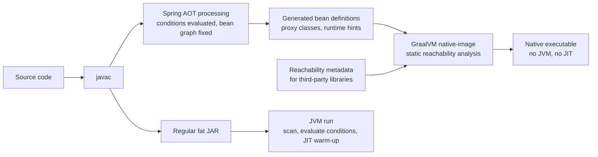
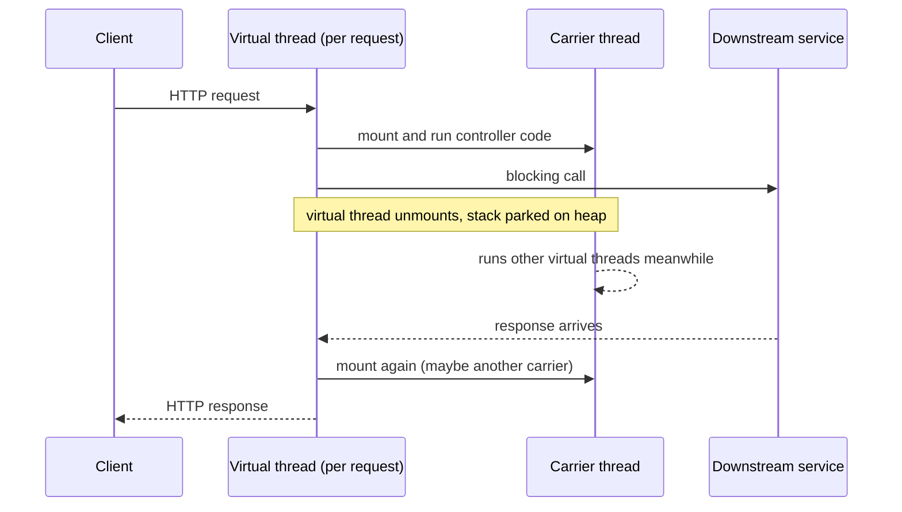
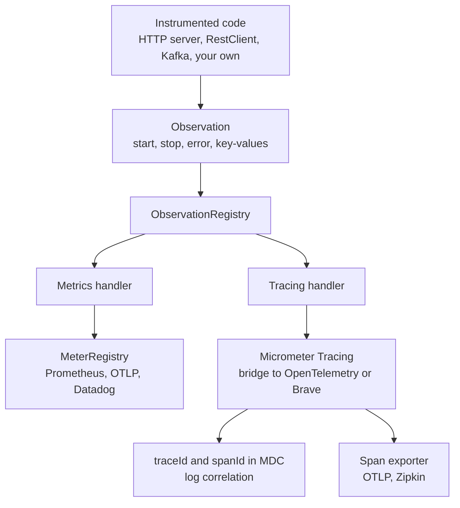

# Spring Boot 3.x: Jakarta EE, GraalVM Native Image, Virtual Threads, Observability

!!! abstract "TL;DR"
    - **Boot 3.0 = Spring Framework 6 + Java 17 baseline + Jakarta EE 9/10.** Every `javax.servlet`, `javax.persistence`, `javax.validation` import becomes `jakarta.*`. JDK packages such as `javax.sql` and `javax.crypto` do **not** change.
    - **Native image** compiles the app ahead of time under a **closed-world assumption**. Spring's **AOT engine** runs at build time, fixes the bean graph, and generates hints for reflection, proxies and resources. You gain fast startup and low memory. You lose runtime flexibility and pay with long builds.
    - **Virtual threads** (Java 21, Boot 3.2+): `spring.threads.virtual.enabled=true` gives one cheap thread per request. Blocking code scales like async code. They do not make CPU work faster and they do not add database connections.
    - **Observability** is built on the **Micrometer Observation API**: instrument once, get a timer metric, a trace span and log correlation. Micrometer Tracing replaces Spring Cloud Sleuth.
    - **Version map:** 3.0 Jakarta, AOT, Observation · 3.1 Testcontainers and Docker Compose support, SSL bundles · 3.2 virtual threads, `RestClient`, `JdbcClient`, CRaC · 3.3 CDS · 3.4 structured logging · 3.5 last 3.x line · 4.0 Spring Framework 7, Jakarta EE 11, Jackson 3.

## Why it matters

Spring Boot 3.0 (November 2022) was the first major version in over four years, and it was a deliberately breaking release. Interviewers use it for two reasons:

1. **Migration experience.** Most enterprise teams have moved, or are moving, from Boot 2.7 to 3.x. A lead engineer is expected to have a plan for that: what breaks, in what order to fix it, and how to de-risk it.
2. **Runtime model choices.** Boot 3.x gives you three different ways to run the same code: a classic JVM with platform threads, a JVM with virtual threads, and a native executable. Each has a different cost profile. Seniors are expected to choose, and to defend the choice with trade-offs.

Each of the four themes solves a concrete problem:

| Theme | Problem it solves |
|---|---|
| Jakarta EE | The `javax.*` namespace was frozen. No new enterprise API features could ship under it. |
| AOT and native image | JVM startup of seconds and hundreds of MB of memory hurt serverless, scale-to-zero and dense container packing. |
| Virtual threads | Thread-per-request with platform threads caps concurrency. Reactive code fixes that but is hard to write, debug and hire for. |
| Observation API | Metrics, traces and logs were instrumented three times with three libraries and inconsistent names. |

## Core concepts

### Jakarta EE: why a package rename broke everything

Oracle donated Java EE to the Eclipse Foundation in 2017, but kept the **Java trademark**. The agreement let Eclipse keep the existing `javax.*` APIs as they were, but not **change** them. So to evolve the specs at all, Jakarta EE 9 renamed every package to `jakarta.*`. It was a "big bang" rename with no functional change.

Spring Framework 6 moved its baseline to Jakarta EE 9+, so Boot 3 did too. That pulls in a whole generation of dependencies:

| Area | Boot 2.7 | Boot 3.x |
|---|---|---|
| Java baseline | 8 | 17 |
| Servlet | `javax.servlet` (Tomcat 9) | `jakarta.servlet` (Tomcat 10.1) |
| JPA | `javax.persistence` (Hibernate 5) | `jakarta.persistence` (Hibernate 6) |
| Validation | `javax.validation` | `jakarta.validation` |
| Security | Spring Security 5.x | Spring Security 6.x |
| Tracing | Spring Cloud Sleuth | Micrometer Tracing |

Three points catch people out:

- **Not every `javax` moves.** `javax.sql.DataSource`, `javax.crypto`, `javax.net.ssl` and `javax.naming` are part of the JDK, not Java EE. They stay.
- **It is binary, not just source.** A third-party JAR compiled against `javax.servlet.Filter` will resolve into your build but fail at runtime with `NoClassDefFoundError` / `ClassNotFoundException`, or simply never be registered. Every transitive dependency needs a Jakarta-compatible version.
- **The rename travels with behaviour changes.** Hibernate 6 changes SQL generation and type mappings. Spring Security 6 removes `WebSecurityConfigurerAdapter` and `antMatchers`. Boot 3 stops matching trailing slashes (`/users/` no longer maps to `/users`). Auto-configurations must be listed in `META-INF/spring/org.springframework.boot.autoconfigure.AutoConfiguration.imports`, not in `spring.factories` (see [auto-configuration](02-auto-configuration-and-starters.md)).

**Migration order that works:** upgrade to Java 17 → upgrade to Boot 2.7 and clear all deprecations (move Security to the component-based `SecurityFilterChain` style while still on 2.7) → add `spring-boot-properties-migrator` → run the OpenRewrite `UpgradeSpringBoot_3_0` recipe for the mechanical rename → fix the libraries that have no Jakarta version → test heavily around JPA queries and security rules.

### AOT and GraalVM native image

A normal Spring Boot start does a lot of work at **runtime**: classpath scanning, evaluating `@Conditional` annotations, parsing `@Configuration` classes, creating CGLIB proxies, reflecting over constructors. This is flexible but slow, and the JIT compiler needs time before the code is fast.

GraalVM `native-image` moves that work to **build time**. It does a static analysis from `main()`, finds all reachable code, and compiles it into one OS-specific executable. There is no JVM, no bytecode interpreter and no JIT at runtime.

The price is the **closed-world assumption**: everything the app will ever use must be known at build time. Anything dynamic is invisible to static analysis unless you declare it:

- reflection, JDK dynamic proxies, resource loading, serialization, JNI
- classes cannot be loaded lazily or generated at runtime

Spring is a very dynamic framework, so Spring 6 added an **AOT engine** to bridge the gap. During the build it starts a special application context up to the bean-definition phase (no beans are instantiated) and then generates:

1. **Java source code** for bean definitions, replacing scanning and `@Configuration` parsing with plain method calls.
2. **Bytecode** for CGLIB proxies (see [AOP & proxies](04-aop-and-proxies.md)), because they cannot be created at runtime.
3. **Runtime hints** (`reflect-config.json` and friends under `META-INF/native-image`) that tell GraalVM what needs reflection, proxies and resources.


*Notice that conditions and the bean graph are decided on the left side, at build time. On the JVM path the same decisions are made on every start.*

The consequences of "the bean graph is fixed at build time":

- `@Profile` and `@ConditionalOnProperty` are evaluated **during the build**. You cannot switch a profile at runtime to get different **beans**. Property **values** can still change at runtime.
- The classpath is fixed. No dropping a JDBC driver in later.
- Java agents and anything that generates bytecode at runtime does not work. Some Mockito features are limited in native tests.

AOT is not only for native images. You can run AOT-processed code on a normal JVM (`-Dspring.aot.enabled=true`) for a smaller startup gain. Two other startup options live on the JVM:

- **CDS / AppCDS** (Boot 3.3+): a class-data-sharing archive lets the JVM skip class loading and verification work. A solid startup improvement with almost no restrictions.
- **CRaC** (Boot 3.2+): checkpoint a warmed-up JVM and restore it in milliseconds. Needs a CRaC-capable JDK and Linux, and you must be careful that the snapshot contains no secrets or open connections.

### Virtual threads

A **platform thread** is a thin wrapper over an OS thread. It reserves around 1 MB of stack and is scheduled by the kernel. Tomcat's default pool is 200 threads, so 200 concurrent requests that are all waiting on a slow downstream fill the pool and the 201st request queues.

A **virtual thread** (JEP 444, final in Java 21) is a thread scheduled by the JVM, not the OS. Its stack lives on the heap and grows as needed. Virtual threads run on a small pool of **carrier** platform threads (a `ForkJoinPool` sized to the CPU count by default). The key behaviour:

- When a virtual thread does a blocking call (socket read, `Thread.sleep`, `ReentrantLock.lock`), the JVM **unmounts** it. Its stack is copied to the heap and the carrier is free to run another virtual thread.
- When the I/O completes, the virtual thread is **mounted** again, possibly on a different carrier, and continues.

So you write simple blocking code, and get the scalability of non-blocking I/O.


*Notice that the carrier thread is never idle while the request waits. The waiting costs a few KB of heap, not an OS thread.*

With `spring.threads.virtual.enabled=true` (Boot 3.2+, Java 21+), Boot switches:

- Tomcat and Jetty request handling to a virtual-thread-per-task executor
- the `applicationTaskExecutor` (`@Async`, MVC async) to a `SimpleAsyncTaskExecutor` that creates virtual threads
- `@Scheduled` to a `SimpleAsyncTaskScheduler`
- Spring Kafka, RabbitMQ and other listener containers to virtual threads

What virtual threads do **not** do:

- They do not speed up **CPU-bound** work. A CPU-heavy task holds its carrier until it finishes.
- They do not remove **downstream limits**. If Hikari has 10 connections, 10,000 virtual threads now queue for 10 connections.
- They should never be **pooled**. They are cheap, so create one per task. Limit concurrency with a `Semaphore`, not with a pool size.

**Pinning.** On JDK 21 a virtual thread that blocks while inside a `synchronized` block, or inside native code, cannot unmount. It pins its carrier. Enough pinned threads and all carriers are stuck. **JEP 491 in JDK 24** removed the `synchronized` limitation, so on JDK 25 LTS this is mostly gone. Native frames still pin.

**ThreadLocal.** Thread locals work on virtual threads, so `SecurityContextHolder`, MDC and `@Transactional` keep working. But a `ThreadLocal` used as a cache of expensive objects becomes a memory problem with a million threads. **Scoped values** (final in Java 25) are the intended replacement.

### Observability: the Observation API

Before Boot 3 you used Micrometer for metrics and Spring Cloud Sleuth for traces. Each library had to be instrumented twice. Boot 3 introduces one abstraction: an **`Observation`**.

An observation is "something that happened, with a name, a start, a stop, maybe an error, and some key-values". You create it once. **`ObservationHandler`s** registered on the `ObservationRegistry` turn it into signals:


*Notice that the code only knows about `Observation`. Metrics, traces and log correlation are all produced by handlers, so swapping the tracing backend needs no code change.*

Key ideas:

- **Low vs high cardinality key-values.** Low cardinality values (`method=GET`, `status=200`, `outcome=SUCCESS`) become **metric tags and span tags**. High cardinality values (`memberId`, full URL) go to **spans only**. Putting a user ID on a metric tag creates one time series per user and can take down your metrics backend.
- **Micrometer Tracing** is a facade. You pick a bridge: `micrometer-tracing-bridge-otel` (OpenTelemetry) or `micrometer-tracing-bridge-brave` (Zipkin Brave).
- **Propagation** uses the **W3C Trace Context** `traceparent` header by default. B3 is available for older Sleuth services.
- **Sampling** defaults to **10%** (`management.tracing.sampling.probability=0.1`). People often think tracing is broken in dev because 9 of 10 requests have no exported trace.
- **Auto-instrumentation** covers Spring MVC and WebFlux servers, `RestClient`, `RestTemplate` and `WebClient` (only when built from the auto-configured **builder**), Spring Kafka (opt-in with `observation-enabled`), Spring Data, Spring Security and more.

Actuator endpoints, health groups and Micrometer meter types are covered in [Actuator, health checks, metrics](08-actuator-health-checks-metrics.md). This page covers only what Boot 3 added on top.

## In practice: code & configuration

### Virtual threads

```yaml
spring:
  threads:
    virtual:
      enabled: true          # Boot 3.2+, needs Java 21+
  main:
    keep-alive: true         # virtual threads are daemon threads, keep the JVM alive
                             # for apps with no web server (e.g. scheduler-only apps)
  datasource:
    hikari:
      maximum-pool-size: 20  # still the real concurrency limit for DB work
```

A typical win is fan-out to several upstream systems from one request:

=== "❌ Common mistake"
    ```java
    @Service
    class MemberSummaryService {

        // Pooling virtual threads: pointless, and the pool size becomes a hidden bottleneck
        private final ExecutorService pool =
            Executors.newFixedThreadPool(50, Thread.ofVirtual().factory());

        private final Map<String, Plan> cache = new HashMap<>();

        // On JDK 21 a blocking HTTP call inside synchronized PINS the carrier thread.
        // With ~8 carriers, 8 slow calls here freeze every virtual thread in the JVM.
        synchronized Plan planFor(String memberId) {
            return cache.computeIfAbsent(memberId, planClient::fetch);
        }
    }
    ```

=== "✅ Correct approach"
    ```java
    @Service
    class MemberSummaryService {

        private final ExecutorService perTask = Executors.newVirtualThreadPerTaskExecutor(); // no pooling
        private final Semaphore pharmacyLimit = new Semaphore(25);   // protect the downstream, not the threads
        private final ReentrantLock lock = new ReentrantLock();      // unmounts cleanly on JDK 21

        MemberSummary summary(String memberId) throws Exception {
            // Plain blocking calls, run concurrently, each on its own virtual thread
            Future<Profile> profile = perTask.submit(() -> profileClient.get(memberId));
            Future<List<Rx>> rx     = perTask.submit(() -> rxClient.list(memberId));
            Future<Pharmacy> ph     = perTask.submit(() -> limited(() -> pharmacyClient.preferred(memberId)));
            return new MemberSummary(profile.get(), rx.get(), ph.get());
        }

        private <T> T limited(Callable<T> call) throws Exception {
            pharmacyLimit.acquire();                 // blocks the virtual thread only, carrier is released
            try { return call.call(); }
            finally { pharmacyLimit.release(); }
        }
    }
    ```

To find pinning on JDK 21, run with `-Djdk.tracePinnedThreads=full` or record the JFR event `jdk.VirtualThreadPinned`. On JDK 24+ the flag is gone because `synchronized` no longer pins.

### Native image

```bash
# Buildpacks: produces a container image with a native executable, no local GraalVM needed
./mvnw -Pnative spring-boot:build-image

# Local executable with GraalVM installed
./mvnw -Pnative native:compile

# Run the test suite inside a native image (catches missing hints)
./mvnw -PnativeTest test
```

Spring infers hints for its own annotations (`@Controller` arguments, `@ConfigurationProperties`, repositories). You add hints only for things Spring cannot see:

=== "❌ Common mistake"
    ```java
    @Service
    class AuditMapper {
        // Works on the JVM. In a native image: ClassNotFoundException, or Jackson cannot see
        // the fields/constructors, because nothing told GraalVM that AuditEvent is used reflectively.
        Object parse(String json, String type) throws Exception {
            Class<?> clazz = Class.forName("com.acme.audit." + type);
            return objectMapper.readValue(json, clazz);
        }
    }

    @Configuration
    @Profile("prod")   // evaluated at BUILD time. Building without the prod profile
    class ProdCacheConfig { /* ... */ }   // means this bean does not exist in the binary
    ```

=== "✅ Correct approach"
    ```java
    @Service
    @RegisterReflectionForBinding({AuditEvent.class, AccessEvent.class})  // fields, getters, constructors
    class AuditMapper { /* ... */ }

    // For anything more specific: resources, proxies, non-binding reflection
    class AuditHints implements RuntimeHintsRegistrar {
        @Override
        public void registerHints(RuntimeHints hints, ClassLoader cl) {
            hints.resources().registerPattern("audit/templates/*.json");
            hints.proxies().registerJdkProxy(AuditSink.class);
        }
    }

    @Configuration
    @ImportRuntimeHints(AuditHints.class)
    class AuditConfig { }
    ```

    ```java
    @Test
    void hintsCoverTemplates() {                     // fast JVM test, no native build needed
        RuntimeHints hints = new RuntimeHints();
        new AuditHints().registerHints(hints, getClass().getClassLoader());
        assertThat(RuntimeHintsPredicates.resource().forResource("audit/templates/access.json"))
            .accepts(hints);
    }
    ```

For profiles, activate the profile for the AOT step itself (the `profiles` setting of the Maven plugin's `process-aot` execution, or the `processAot` task arguments in Gradle), not only at runtime. Or better, select behaviour with property **values** rather than conditional **beans**.

### Observability

```xml
<dependency><groupId>org.springframework.boot</groupId><artifactId>spring-boot-starter-actuator</artifactId></dependency>
<dependency><groupId>io.micrometer</groupId><artifactId>micrometer-tracing-bridge-otel</artifactId></dependency>
<dependency><groupId>io.opentelemetry</groupId><artifactId>opentelemetry-exporter-otlp</artifactId></dependency>
```

```yaml
management:
  tracing:
    sampling:
      probability: 0.1            # default. Use 1.0 locally, keep it low in production
  otlp:
    tracing:
      endpoint: http://otel-collector:4318/v1/traces
  observations:
    annotations:
      enabled: true               # Boot 3.2+: turns on @Observed, @Timed, @Counted (needs spring-boot-starter-aop)
    key-values:
      region: ap-south-1          # low-cardinality tag added to every observation
logging:
  structured:
    format:
      console: ecs                # Boot 3.4+: JSON logs, traceId and spanId included
spring:
  kafka:
    template:
      observation-enabled: true   # Kafka tracing is opt-in
    listener:
      observation-enabled: true
```

A custom observation around a business operation:

```java
@Service
class ClaimPricingService {

    private final ObservationRegistry registry;
    private final RestClient pricingClient;

    ClaimPricingService(ObservationRegistry registry, RestClient.Builder builder) {
        this.registry = registry;
        this.pricingClient = builder.baseUrl("http://pricing").build(); // injected builder = instrumented client
    }

    Price price(Claim claim) {
        return Observation.createNotStarted("claim.pricing", registry)
            .lowCardinalityKeyValue("claim.type", claim.type().name())  // metric tag + span tag
            .highCardinalityKeyValue("claim.id", claim.id())            // span only, never a metric tag
            .observe(() -> pricingClient.post().uri("/price").body(claim)
                .retrieve().body(Price.class));
        // Result: timer "claim.pricing", a span "claim.pricing", errors recorded on both,
        // and traceparent propagated on the outgoing call.
    }
}
```

=== "❌ Common mistake"
    ```java
    // A hand-built client has no observation registry: no client span, no traceparent header.
    // The trace stops at this service and the downstream starts a new, unrelated trace.
    private final RestClient client = RestClient.create("http://pricing");

    @Async
    void notifyAsync(Claim claim) {
        log.info("notifying");   // traceId missing: the context did not cross to the new thread
    }
    ```

=== "✅ Correct approach"
    ```java
    @Bean
    RestClient pricingClient(RestClient.Builder builder) {   // auto-configured builder carries the registry
        return builder.baseUrl("http://pricing").build();
    }

    @Bean
    TaskDecorator contextPropagation() {
        // Copies the observation, MDC and other registered thread locals to @Async threads
        return new ContextPropagatingTaskDecorator();
    }
    ```

For Reactor pipelines set `spring.reactor.context-propagation=auto` so the trace context flows from the Reactor `Context` into thread locals (and so into the MDC).

## Real-world usage

- **Netflix and virtual threads.** Netflix published a case study (*Java 21 Virtual Threads - Dude, Where's My Lock?*) about Spring Boot 3 services on embedded Tomcat that stopped serving traffic while the JVM stayed up. Virtual threads were pinned inside `synchronized` blocks while waiting for a `ReentrantLock`. All carrier threads were pinned, so when the lock was released, the virtual thread next in line to take it had no carrier to run on and nothing made progress. It is the standard reference for why pinning mattered on JDK 21, and why JEP 491 was needed.
- **Native image in serverless.** Native executables are used where cold start dominates: AWS Lambda, Knative and Cloud Run scale-to-zero, CLI tools. On AWS Lambda the main alternative for Java is **SnapStart**, which restores a snapshot of an initialised JVM and needs no native build.
- **Framework competition.** Quarkus and Micronaut were designed around build-time processing from the start. Spring's AOT engine is the answer to that, with the trade-off that Spring's very dynamic model needs more hints.
- **Sleuth migration.** Spring Cloud Sleuth does not work with Boot 3. Its tracing core moved to Micrometer Tracing. Teams that upgraded service by service had to keep **B3 and W3C** propagation compatible during the transition so traces did not split.
- **Healthcare and banking.** Two honest points. First, the Jakarta upgrade is a security matter: Boot 2.7 open-source support ended in 2023, so staying on it means no free CVE patches, which is hard to defend in an audit. Second, observability data is regulated data. A member ID, account number or JWT placed in a span tag, baggage or a log line is PHI or PII leaving your service to a telemetry vendor. Baggage is also forwarded as HTTP headers to every downstream.

## Trade-offs & production gotchas

| Option | Pros | Cons | Use when |
|---|---|---|---|
| JVM + platform threads | Best peak throughput (JIT), simplest, full tooling | Slow startup, high memory, concurrency capped by pool | Default for long-running, CPU-mixed services |
| JVM + virtual threads | High I/O concurrency with blocking code, tiny code change | Pinning on JDK 21, downstream pools become the bottleneck, no gain for CPU work | I/O-heavy services: API aggregation, BFF, GraphQL fan-out |
| WebFlux (reactive) | Backpressure, streaming, mature | Steep learning curve, hard stack traces, needs non-blocking drivers end to end | Streaming, backpressure needs, existing reactive code |
| GraalVM native image | Startup in tens of ms, low RSS, smaller attack surface | Minutes-long builds, closed world, hints, lower peak throughput without PGO, harder debugging | Serverless, scale-to-zero, many small instances |
| JVM + CDS / AOT cache | Noticeably faster startup, almost no restrictions | Extra training-run build step | You want better startup without native constraints |
| CRaC | Near-instant restore of a warm JVM | Linux and CRaC JDK only, snapshot may hold secrets or stale connections | Fast scale-out with full JIT performance |

!!! warning "Gotchas"
    - **`javax` JARs fail silently.** An old servlet filter or JAX-RS client compiled against `javax` may compile fine and then never run. Check `mvn dependency:tree` for `javax.servlet-api` and `javax.persistence-api`.
    - **Trailing slash and security matchers.** After upgrade, `/api/users/` returns 404, and `requestMatchers` rules written for one form of the path may not cover the other. Re-test authorisation rules, do not assume them.
    - **Virtual threads move the bottleneck.** Tomcat no longer limits you at 200, so the database pool, the downstream rate limit or the heap is the next thing to break. Add explicit bulkheads.
    - **`@Scheduled` overlap.** With virtual threads the scheduler is no longer a single thread, so tasks that never overlapped by accident may now run concurrently with each other.
    - **Native: "works on JVM" proves nothing.** Missing hints fail at runtime, in the code path you did not test. Run `nativeTest` in CI and use the GraalVM tracing agent to discover hints for third-party libraries.
    - **Native: profiles are baked in.** `--spring.profiles.active=prod` at runtime changes property values but does not create beans that were excluded at build time.
    - **High-cardinality tags.** One `userId` metric tag can create millions of time series. Use `highCardinalityKeyValue`.
    - **10% sampling.** Missing traces in a test environment is usually sampling, not a bug. Logs still carry `traceId` even for unsampled requests.

## How this connects to my experience

- **Where I used it:**
    - **OptumRx Meteor (Publicis Sapient, Jan 2023 - present):** "Designed and developed microservices using Java, Spring Boot, Kafka, MongoDB, Redis, and GraphQL." The project started just after Boot 3.0 was released, so the services may have been built on 3.x or migrated to it later. The resume does not state the version. *[confirm the Boot and Java versions, and whether you led a 2.7 → 3.x migration]*
    - **GraphQL Consumer Service** integrating **5 upstream systems**: this is the textbook fit for virtual threads (blocking fan-out to several upstreams per request) and for distributed tracing (one request crossing six services). *[confirm whether virtual threads were enabled, or whether it used WebFlux / CompletableFuture]*
    - **Kafka workflows with retry and DLQ:** trace context has to travel in Kafka record headers so a message can be followed through retry topics to the DLQ. *[confirm whether `observation-enabled` or another tracing tool was used]*
    - **Coriolis CCKM (2018 - 2021) and Johnson Controls Metasys (2017 - 2018):** Spring Boot REST APIs at Coriolis, and Spring Security authorization with JWT/SSO at Johnson Controls, both in the `javax` era given the dates (Boot 1.x / 2.x). *[confirm versions]* This gives a credible "before and after" view of the Jakarta and Security 6 changes.
    - **Deloitte ConvergeHealth (2021 - 2023):** AWS Lambda and ECS/EKS. The resume does not say Java ran on Lambda, so use it only as context for cold-start trade-offs. *[confirm Lambda runtime language]*
- **Talking points:**
    - "As tech lead I treat a major framework upgrade as a project: inventory `javax` dependencies, upgrade to the last 2.7 first, automate the rename with OpenRewrite, and put the risk budget into JPA and security regression tests." *[confirm you can back this with a real upgrade]*
    - "For an aggregation layer over 5 upstreams, virtual threads give the concurrency of reactive code with blocking code my whole team can read. The real work is bulkheads per upstream, because Tomcat's thread pool is no longer protecting them."
    - "With 750K+ users in healthcare, I care about what goes into telemetry: only low-cardinality tags on metrics, and no PHI in span tags or baggage."
    - Native image: not on the resume. Be honest: "I have not shipped native images in production. I understand the AOT model and would evaluate it for Lambda-style workloads against SnapStart and CDS."
- **Likely follow-up chain:** "What changed in Boot 3?" → "How did you migrate, what broke?" → "Did you enable virtual threads? What is pinning?" → "With virtual threads, what protects your database and upstreams?" → "How do you trace a request across GraphQL, REST and Kafka?" Answer each with the mechanism first, then one concrete example from the Consumer Service.

## Interview questions

### Fundamentals

??? question "Q1. What are the main changes in Spring Boot 3 compared with 2.x?"
    **Answer:** Java 17 baseline. Spring Framework 6. Jakarta EE 9/10, so `javax.*` enterprise packages become `jakarta.*`, with Tomcat 10, Hibernate 6 and Spring Security 6. First-class AOT processing and GraalVM native image support. The Micrometer Observation API and Micrometer Tracing replacing Sleuth. Also: RFC 7807 problem details, HTTP interface clients, the new `AutoConfiguration.imports` file. Later minors added virtual threads, `RestClient` and `JdbcClient` (3.2), CDS (3.3) and structured logging (3.4).

    **Interviewer listens for:** baseline changes first (Java 17, Jakarta), then features, and awareness that features arrived in different minor versions.

    **Common wrong answer:** "Virtual threads came with Boot 3.0." They need Java 21 and Boot 3.2.

??? question "Q2. Why did `javax` become `jakarta`? Does every `javax` import change?"
    **Answer:** Oracle moved Java EE to the Eclipse Foundation but kept the Java trademark, so the `javax` namespace could not be modified. To evolve the APIs, Jakarta EE 9 renamed the packages. Only the enterprise APIs move (servlet, persistence, validation, annotation, transaction, mail, JMS). JDK packages like `javax.sql`, `javax.crypto` and `javax.net.ssl` stay.

    **Interviewer listens for:** the legal reason, and that a blind find-and-replace is wrong.

    **Common wrong answer:** "It is just a rename, find and replace fixes it." It ignores binary-incompatible third-party JARs and the Hibernate 6 and Security 6 behaviour changes.

??? question "Q3. What is a virtual thread and how is it different from a platform thread?"
    **Answer:** A platform thread maps one-to-one to an OS thread with a large fixed stack, scheduled by the kernel. A virtual thread is scheduled by the JVM onto a small pool of carrier threads, with its stack stored on the heap. When it blocks on I/O it is unmounted and the carrier runs something else. They are cheap enough to create one per task, so you do not pool them.

    **Interviewer listens for:** mount/unmount, carrier threads, "cheap to block", no pooling.

    **Common wrong answer:** "Virtual threads are faster threads." They improve throughput for blocking I/O workloads, not the speed of code.

??? question "Q4. What is the closed-world assumption in GraalVM native image?"
    **Answer:** All code that can run must be known at build time. The builder does reachability analysis from the entry point and drops everything else. Dynamic features (reflection, proxies, resources, serialization, runtime class loading) must be declared through metadata, otherwise they fail at runtime.

    **Interviewer listens for:** build-time analysis, and why Spring needs an AOT step and hints.

    **Common wrong answer:** "Native images run a JIT like the JVM." They are compiled ahead of time with reachability analysis.

??? question "Q5. What is an `Observation` in Micrometer?"
    **Answer:** A single instrumentation of an operation with a name, lifecycle (start, stop, error) and key-values. Handlers on the `ObservationRegistry` convert it into a timer metric, a trace span, and log correlation. You instrument once instead of separately for metrics and tracing.

    **Common wrong answer:** Treating it as only tracing, or as a replacement for `MeterRegistry`. Counters and gauges still use the meter API directly.

    **Interviewer listens for:** one instrumentation point, handlers produce metrics, spans and logs.

### Intermediate

??? question "Q6. What does `spring.threads.virtual.enabled=true` actually change?"
    **Answer:** Tomcat or Jetty handle each request on a new virtual thread. The auto-configured `applicationTaskExecutor` becomes a `SimpleAsyncTaskExecutor` creating virtual threads, so `@Async` uses them. `@Scheduled` uses a `SimpleAsyncTaskScheduler`. Messaging listener containers (Kafka, RabbitMQ and others) use virtual threads. Because virtual threads are daemon threads, non-web apps may need `spring.main.keep-alive=true`. Properties like `server.tomcat.threads.max` and the task executor pool sizes stop having an effect.

    **Interviewer listens for:** more than "Tomcat uses virtual threads", and the lost implicit limit.

    **Common wrong answer:** "It makes CPU-bound code faster." It only helps blocking I/O concurrency.

??? question "Q7. What is pinning? How do you detect and fix it?"
    **Answer:** Pinning is when a blocked virtual thread cannot unmount, so it holds its carrier. On JDK 21 to 23 this happens when blocking inside a `synchronized` block or method, and inside native frames. If all carriers are pinned, the application stalls. Detect it with `-Djdk.tracePinnedThreads` or the JFR `jdk.VirtualThreadPinned` event. Fix by replacing `synchronized` around I/O with `ReentrantLock`, upgrading libraries, or moving to JDK 24+ where JEP 491 lets virtual threads unmount inside `synchronized`.

    **Interviewer listens for:** the JDK version nuance. On Java 25 the `synchronized` case is solved.

    **Common wrong answer:** "Never use `synchronized` with virtual threads." Short critical sections with no blocking inside were always fine.

??? question "Q8. Output prediction. Boot 3.2, Java 21, virtual threads enabled, Hikari pool of 10, default connection timeout. 500 concurrent requests each run a query that takes 4 seconds. What happens?"
    **Answer:** All 500 requests are accepted and each gets its own virtual thread. 10 obtain a connection. 490 wait in Hikari. Each 4-second wave serves 10 requests, so after about 30 seconds (the default `connectionTimeout`) the remaining requests, a large majority, fail with `SQLTransientConnectionException: Connection is not available, request timed out after 30000ms`. With 200 platform threads, 300 requests would have waited in Tomcat's queue instead, and the failure would look different, but the throughput is the same: 2.5 requests per second.

    **Interviewer listens for:** virtual threads do not add database capacity, and the bottleneck moved from the web pool to the connection pool.

    **Common wrong answer:** "All 500 finish in about 4 seconds because virtual threads do not block."

??? question "Q9. What does Spring AOT generate, and what restrictions follow from it?"
    **Answer:** It runs the context up to the bean-definition stage at build time and generates Java source for bean definitions, bytecode for proxies, and runtime hints for reflection, resources, proxies and serialization. Because the bean graph is decided at build time, `@Profile` and `@Conditional...` are evaluated at build time and cannot change beans at runtime, the classpath is fixed, and beans cannot be defined dynamically in ways AOT cannot see.

    **Common wrong answer:** "Native image just compiles the JAR to machine code." It skips the whole AOT and hints story.

    **Interviewer listens for:** build-time bean definitions, fixed conditions, generated proxies and hints.

??? question "Q10. What is the difference between low- and high-cardinality key-values?"
    **Answer:** Low-cardinality values have a small bounded set (HTTP method, status, outcome, exception class). They become metric tags and span tags. High-cardinality values are unbounded (user ID, order ID, raw URL). They go only to spans. A metric time series exists for each unique tag combination, so an unbounded tag multiplies series without limit, which raises cost and can crash the backend. This is also why HTTP server metrics tag the URI **template** (`/members/{id}`), not the raw path.

    **Interviewer listens for:** bounded tag values for metrics vs unbounded values only on spans.

    **Common wrong answer:** "All key-values become metric tags."

### Senior

??? question "Q11. Virtual threads or WebFlux for a new I/O-heavy service?"
    **Answer:** Default to Spring MVC with virtual threads. You keep imperative code, normal stack traces, `ThreadLocal`-based features (security context, MDC, transactions) and blocking drivers like JDBC. Choose WebFlux when you need what reactive streams add beyond concurrency: backpressure, streaming (SSE, large streamed responses), composition operators, or when the codebase and team are already reactive. Virtual threads solve "too many blocked threads". They do not solve "the producer is faster than the consumer".

    **Interviewer listens for:** a decision with reasons, and that the two are not mutually exclusive.

    **Common wrong answer:** "Virtual threads make WebFlux obsolete."

??? question "Q12. When would you choose a native image, and when would you refuse?"
    **Answer:** Choose it when startup time and memory are the dominating cost: serverless functions, scale-to-zero services, CLIs, very dense deployments. Refuse it for long-running, throughput-sensitive services where the JIT wins at peak, for apps with heavy reflection or unsupported libraries, or where the team cannot absorb multi-minute builds and a second test pipeline. Before going native I would try cheaper steps: CDS, AOT on the JVM, lazy initialisation review, or SnapStart/CRaC.

    **Interviewer listens for:** cost-benefit thinking, alternatives, operational cost (build time, debugging, profiling).

    **Common wrong answer:** "Always use native for faster startup." Long-running services lose JIT peak performance.

??? question "Q13. How does trace context cross thread and process boundaries in Boot 3?"
    **Answer:** Across processes, instrumented clients inject the W3C `traceparent` header (HTTP) or record headers (Kafka), and instrumented servers and listeners extract it and continue the trace. Inside a process the current span lives in a thread local. For `@Async` and executors you need a `ContextPropagatingTaskDecorator` or a context-propagating executor wrapper. For Reactor, automatic context propagation copies between the Reactor `Context` and thread locals. Virtual threads created by Spring's instrumented executors follow the same rules, but a raw `Thread.startVirtualThread` does not carry context.

    **Interviewer listens for:** the two separate problems (wire propagation vs in-process propagation) and the builder requirement for clients.

    **Common wrong answer:** "Trace context follows the request automatically everywhere." Thread hops and raw clients drop it.

??? question "Q14. How would you plan a Boot 2.7 to 3.x migration for 30 services?"
    **Answer:**

    1. Inventory: Java version, `javax` dependencies, Sleuth, `WebSecurityConfigurerAdapter`, custom starters using `spring.factories`.
    2. Preparation on 2.7: Java 17, latest 2.7 patch, remove deprecations, move to `SecurityFilterChain` beans. This is shippable and low risk.
    3. Shared libraries and internal starters first, published in a Jakarta version.
    4. Automate the mechanical part with OpenRewrite, use the properties migrator.
    5. Pilot on a low-risk service, write a playbook, then move in waves.
    6. Test focus: JPA queries and ID generation (Hibernate 6), security rules, trailing-slash URLs, serialization, trace propagation between migrated and non-migrated services (keep B3 and W3C compatible).
    7. Canary deployments and a rollback path.

    **Interviewer listens for:** sequencing, shared-library ordering, mixed-fleet compatibility, not just "change the version".

    **Common wrong answer:** "Upgrade all 30 services at once in a single release."

### Scenario-based

??? question "Q15. After enabling virtual threads, the service sometimes stops responding. CPU is near zero, the JVM is up, and a classic thread dump shows only a few idle threads. What do you check?"
    **Answer:** This pattern points to pinned carriers. Classic `jstack` output does not show virtual threads, so take `jcmd <pid> Thread.dump_to_file -format=json <file>` to see them. Look for virtual threads blocked inside `synchronized` frames, often in an older library (a JDBC driver, an HTTP client, a tracing reporter). Confirm with `jdk.VirtualThreadPinned` JFR events. Short term: disable virtual threads or upgrade the offending library. Long term: JDK 24+ or 25, which removes `synchronized` pinning. Also check for pool starvation: all virtual threads waiting on a connection pool whose holders are themselves waiting.

    **Interviewer listens for:** knowing that normal thread dumps hide virtual threads, and a mitigation plus a root fix.

    **Common wrong answer:** "Virtual threads are unstable." Pinned carriers explain the symptoms.

??? question "Q16. The service works on the JVM, but the native image returns `{}` for one REST response and throws `ClassNotFoundException` in another path. Why, and how do you fix and prevent it?"
    **Answer:** Both are missing reachability metadata. Jackson serialises by reflection, and with no reflection hint for that DTO it sees no properties, so it writes an empty object (or fails with a "no properties discovered" error, depending on configuration). The `ClassNotFoundException` comes from `Class.forName` on a class the static analysis never saw. Fix with `@RegisterReflectionForBinding` for DTOs that Spring cannot infer (for example types used only through `Object` or generics), and a `RuntimeHintsRegistrar` for the dynamic class. Prevent it by running the suite with `nativeTest` in CI, testing hints with `RuntimeHintsPredicates`, and running the GraalVM tracing agent against integration tests to discover third-party needs.

    **Interviewer listens for:** missing reflection hints, RuntimeHints or @RegisterReflectionForBinding.

    **Common wrong answer:** "Native image breaks Jackson." It needs hints for reflected DTOs.

??? question "Q17. Traces break between two services: service A shows a trace, service B starts a new one. Logs in B's `@Async` method have no traceId. What are the likely causes?"
    **Answer:** For the broken hop: A's client was created with `new RestTemplate()` or `RestClient.create()` instead of the auto-configured builder, so no header is injected. Or the two services use different propagation formats (B3 on a Sleuth-era service, W3C on the Boot 3 one). Or a gateway strips `traceparent`. For the missing log IDs: the context is a thread local and `@Async` runs on another thread, so add a `ContextPropagatingTaskDecorator`. I would also verify sampling: an unsampled trace is not exported, but IDs should still appear in logs.

    **Interviewer listens for:** a structured list of causes, not a single guess.

    **Common wrong answer:** "The tracing backend dropped spans."

??? question "Q18. Your team wants to put member ID in baggage so every service can log it. This is a healthcare system. What do you say?"
    **Answer:** Baggage is propagated as plain HTTP and message headers to every downstream, including third parties, and often ends up in logs and the telemetry backend. A member ID is PHI when linked to health data. I would push back: propagate an opaque correlation ID or a tokenised reference, keep the member ID inside services that are authorised to hold it, restrict baggage fields with an allow-list, and make sure the telemetry pipeline is in scope for the same access controls and retention rules as application data.

    **Interviewer listens for:** security and compliance judgment, not only knowledge of the API.

    **Common wrong answer:** "Baggage is internal so PHI is fine." It travels to every downstream service and vendor.

## Cheat sheet

| Concept | Remember |
|---|---|
| Boot 3 baseline | Java 17, Spring Framework 6, Jakarta EE 9/10, Tomcat 10.1, Hibernate 6, Security 6 |
| `javax` → `jakarta` | Enterprise APIs only. `javax.sql`, `javax.crypto`, `javax.net.ssl` stay |
| Why the rename | Oracle kept the Java trademark, `javax` could not evolve |
| Migration order | Java 17 → Boot 2.7 clean → shared libs → OpenRewrite → test JPA and security |
| Auto-config registration | `META-INF/spring/...AutoConfiguration.imports`, not `spring.factories` |
| Native image | Closed world, build-time reachability analysis, no JIT |
| Spring AOT | Generates bean definitions, proxies and hints. Conditions and profiles fixed at build time |
| Hints | `@RegisterReflectionForBinding`, `RuntimeHintsRegistrar` + `@ImportRuntimeHints` |
| Native commands | `-Pnative spring-boot:build-image`, `-Pnative native:compile`, `-PnativeTest test` |
| Startup alternatives | CDS (3.3+), CRaC (3.2+), Lambda SnapStart |
| Virtual threads | `spring.threads.virtual.enabled=true`, Boot 3.2+, Java 21+ |
| Good for / not for | Blocking I/O concurrency / CPU-bound work |
| Never | Pool virtual threads. Limit with `Semaphore` |
| Pinning | `synchronized` + blocking on JDK 21 to 23, fixed by JEP 491 in JDK 24. Native frames still pin |
| New bottleneck | DB pool and downstream limits, not Tomcat threads |
| Observation | One instrumentation → timer + span + log correlation |
| Cardinality | Low → metrics and spans. High → spans only |
| Tracing defaults | W3C `traceparent`, sampling 0.1, bridge = OTel or Brave |
| Client tracing | Use the injected `RestClient.Builder` / `WebClient.Builder` |
| Thread hop | `ContextPropagatingTaskDecorator`, Reactor `context-propagation=auto` |
| Boot 4.0 | Spring Framework 7, Jakarta EE 11, Jackson 3, Java 17 minimum still |

## Sources

1. [Spring Boot 3.0 Migration Guide](https://github.com/spring-projects/spring-boot/wiki/Spring-Boot-3.0-Migration-Guide): Jakarta move, Java 17 baseline, trailing slash, auto-configuration registration, properties migrator.
2. [Spring Boot reference: GraalVM Native Images](https://docs.spring.io/spring-boot/reference/packaging/native-image/introducing-graalvm-native-images.html): closed world, AOT processing, build-time conditions and profile restrictions, hints.
3. [Spring Boot reference: Virtual threads](https://docs.spring.io/spring-boot/reference/features/spring-application.html#features.spring-application.virtual-threads): `spring.threads.virtual.enabled`, daemon threads and `keep-alive`, pinning note.
4. [Spring Boot reference: Observability and Tracing](https://docs.spring.io/spring-boot/reference/actuator/observability.html): Observation API, annotations support, common key-values, sampling default, propagation.
5. [JEP 444: Virtual Threads](https://openjdk.org/jeps/444): mount/unmount, carriers, pinning, "do not pool" guidance.
6. [JEP 491: Synchronize Virtual Threads without Pinning](https://openjdk.org/jeps/491): removal of `synchronized` pinning in JDK 24.
7. [Netflix TechBlog: Java 21 Virtual Threads - Dude, Where's My Lock?](https://netflixtechblog.com/java-21-virtual-threads-dude-wheres-my-lock-3052540e231d): production stall caused by pinned carrier threads on Spring Boot 3 with Tomcat.
8. [Spring Framework reference: Ahead of Time Optimizations](https://docs.spring.io/spring-framework/reference/core/aot.html): what the AOT engine generates, `RuntimeHints` API and testing with `RuntimeHintsPredicates`.
