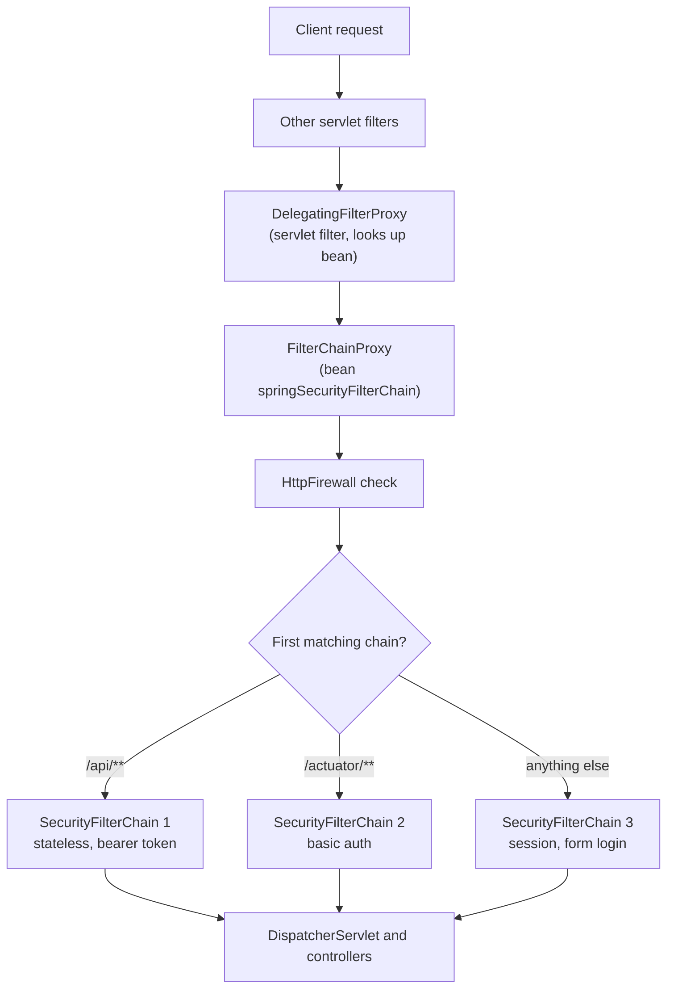
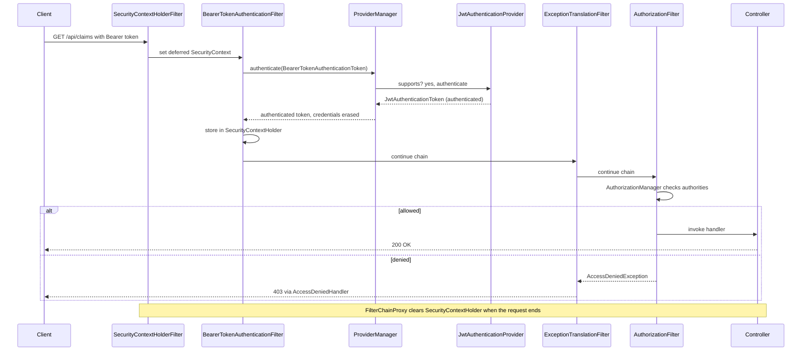

# Spring Security Architecture: Filter Chain, SecurityContext, Authentication Providers

!!! warning "Draft: not yet fact-checked"
    This page was written but its independent review pass has not run yet. Verify version numbers and defaults against the linked sources.


!!! abstract "TL;DR"
    - Spring Security for servlet apps is **a chain of servlet filters**. The container sees one filter (`DelegatingFilterProxy`), which hands over to the `FilterChainProxy` bean, which picks **the first matching `SecurityFilterChain`** and runs its filters in a fixed order.
    - **Authentication** is done by a filter that builds an unauthenticated `Authentication` token and passes it to the `AuthenticationManager` (`ProviderManager`), which loops over `AuthenticationProvider`s until one that `supports()` the token type succeeds or fails.
    - The result lives in the **`SecurityContext`**, held by `SecurityContextHolder` in a **`ThreadLocal`** by default. It is cleared at the end of every request and does **not** follow work onto other threads unless you propagate it.
    - **`ExceptionTranslationFilter`** turns security exceptions into HTTP: not authenticated → `AuthenticationEntryPoint` (401 or redirect), authenticated but not allowed → `AccessDeniedHandler` (403). **`AuthorizationFilter`** is the last filter and makes the allow/deny decision.
    - Version facts interviewers ask: `WebSecurityConfigurerAdapter` was removed in 6.0 (use `SecurityFilterChain` beans), the context is saved **explicitly** since 6.0, and 7.0 removed `and()`, `authorizeRequests()` and `AntPathRequestMatcher`/`MvcRequestMatcher`.

## Why it matters

Every Spring Boot service you have secured, whether with JWT, OAuth2 or SAML, runs on this same machinery. The protocol pages in this section ([JWT](04-jwt-structure-signing-validation-revocation.md), [OAuth2 grants](05-oauth2-roles-and-grant-types.md), resource server config) are all plug-ins to the architecture described here.

Interviewers use this topic to separate "I copied a security config" from "I can debug one". The typical senior questions are all architectural: why does a `permitAll` endpoint return 401, why is the user `null` inside an `@Async` method, why did my custom filter run twice, why 403 instead of 401. You can only answer those if you know the order of filters and where the context lives.

Before Spring Security, servlet applications used container-managed security (`web.xml` constraints, JAAS realms), which tied the app to one server and was hard to extend. Spring Security moved security into the application as ordinary beans, so it is portable, testable and customisable at every step.

## Core concepts

### From the servlet container to Spring beans

A servlet container only knows about `Filter` instances registered with it. It knows nothing about Spring beans. Spring Security bridges this in three layers:

1. **`DelegatingFilterProxy`**: a real servlet filter registered with the container. It does no security work. It looks up a bean by name (`springSecurityFilterChain`) from the `ApplicationContext`, lazily, and delegates to it. This is what lets security filters be Spring beans with dependency injection.
2. **`FilterChainProxy`**: that bean. It is the single entry point for all security. It holds a list of `SecurityFilterChain`s, applies the `HttpFirewall` (rejects suspicious URLs such as encoded slashes or `..;/`), and clears the `SecurityContextHolder` when the request ends.
3. **`SecurityFilterChain`**: a pair of (request matcher, ordered list of security filters). `FilterChainProxy` picks the **first** chain whose matcher matches. Only that one chain runs.

In Spring Boot, auto-configuration registers the `DelegatingFilterProxy` for you with order `-100` (`SecurityProperties.DEFAULT_FILTER_ORDER`), so it runs before most application filters.


*Notice that the container sees only one filter, and that exactly one `SecurityFilterChain` handles a request: the first that matches, not the most specific.*

### The filters inside a chain, in order

The order is fixed by Spring Security, not by the order you write the DSL. The important ones, top to bottom, for a typical application:

| Order | Filter | Job |
|---|---|---|
| 1 | `SecurityContextHolderFilter` | Loads the `SecurityContext` (lazily) from the `SecurityContextRepository` |
| 2 | `HeaderWriterFilter` | Adds security headers (HSTS, `X-Content-Type-Options`, etc.) |
| 3 | `CorsFilter` | Handles preflight before authentication |
| 4 | `CsrfFilter` | Validates the CSRF token on state-changing requests |
| 5 | `LogoutFilter` | Handles the logout URL |
| 6 | Authentication filters | `UsernamePasswordAuthenticationFilter`, `BearerTokenAuthenticationFilter`, `BasicAuthenticationFilter`, OAuth2 login filters |
| 7 | `RequestCacheAwareFilter` | Replays the original request after login |
| 8 | `AnonymousAuthenticationFilter` | If nobody authenticated, sets an `AnonymousAuthenticationToken` |
| 9 | `ExceptionTranslationFilter` | Catches security exceptions thrown **below** it and turns them into 401/403 |
| 10 | `AuthorizationFilter` | Final allow/deny decision using an `AuthorizationManager` |

Two consequences follow directly from this order:

- **Authentication happens before authorization.** A request with a bad token is rejected by the authentication filter even if the URL is `permitAll`, because `permitAll` is only evaluated at step 10.
- **CORS comes before authentication**, because browser preflight (`OPTIONS`) requests carry no credentials. Details are in [Sessions vs tokens; CSRF & CORS](03-sessions-vs-tokens-csrf-and-cors-in-spring.md).

To see the real list for your app, set `logging.level.org.springframework.security=DEBUG` (or `TRACE`). At startup Spring logs every chain and its filters.

### The authentication model

Five types do all the work:

- **`Authentication`**: both the input (credentials, `isAuthenticated() == false`) and the output (principal + authorities, `isAuthenticated() == true`). Examples: `UsernamePasswordAuthenticationToken`, `BearerTokenAuthenticationToken` → `JwtAuthenticationToken`.
- **`AuthenticationManager`**: one method, `authenticate(Authentication)`. It returns a populated `Authentication`, or throws `AuthenticationException`.
- **`ProviderManager`**: the standard `AuthenticationManager`. It holds a list of `AuthenticationProvider`s and an optional **parent** manager used as a fallback.
- **`AuthenticationProvider`**: knows how to verify one kind of credential. It has `supports(Class)` and `authenticate(...)`. Examples: `DaoAuthenticationProvider` (username/password through `UserDetailsService` + `PasswordEncoder`), `JwtAuthenticationProvider` (through `JwtDecoder`), `OpaqueTokenAuthenticationProvider`, LDAP and SAML providers.
- **`GrantedAuthority`**: a string permission such as `ROLE_ADMIN` or `SCOPE_read`.

How `ProviderManager` decides:

1. For each provider, skip it if `supports(token.getClass())` is false.
2. Call `authenticate`. A non-null result means success, and the loop stops.
3. Returning `null` means "I cannot decide", so try the next provider.
4. An `AuthenticationException` is remembered and the loop continues to the next provider. `AccountStatusException` (locked, disabled) and `InternalAuthenticationServiceException` stop immediately.
5. If no provider succeeded, try the parent. If still nothing, throw `ProviderNotFoundException` or the last exception.
6. On success, **erase credentials** (the password is cleared from the token) and publish an `AuthenticationSuccessEvent`.

This is the strategy pattern: the filter knows *how to extract* credentials from HTTP, the provider knows *how to verify* them. That split is why you can support password login, JWT and LDAP in one app without the filters knowing about each other.


*Notice that the authentication filter never verifies the token itself, and that `ExceptionTranslationFilter` sits above `AuthorizationFilter` so it can catch the exception thrown below it.*

### 401 or 403: ExceptionTranslationFilter

`ExceptionTranslationFilter` wraps the rest of the chain in a `try/catch`:

- `AuthenticationException` → call the **`AuthenticationEntryPoint`**. For form login that is a redirect to the login page. For a resource server it is `401` with a `WWW-Authenticate: Bearer` header.
- `AccessDeniedException` and the user is **anonymous** (or remember-me) → also start authentication through the entry point. This is why an unauthenticated call to a protected API returns 401, not 403.
- `AccessDeniedException` and the user is **fully authenticated** → **`AccessDeniedHandler`**, which returns `403`.

One important limit: it only catches exceptions thrown *after* it in the chain. Authentication filters above it (such as `BearerTokenAuthenticationFilter`) handle their own failures by calling the entry point or an `AuthenticationFailureHandler` directly.

### SecurityContext, SecurityContextHolder and storage

`SecurityContextHolder` → `SecurityContext` → `Authentication` → principal, credentials, authorities.

The holder uses a strategy to decide where the context lives:

| Strategy | Behaviour | Use |
|---|---|---|
| `MODE_THREADLOCAL` (default) | One context per thread | Servlet apps |
| `MODE_INHERITABLETHREADLOCAL` | Child threads copy the parent's context at creation | Rarely safe: pooled threads keep the context of whoever created them |
| `MODE_GLOBAL` | One context for the JVM | Standalone desktop clients |

`ThreadLocal` works because the classic servlet model is one thread per request. It also explains the two classic problems: the context is missing on any other thread, and it must be cleared or a pooled thread would carry one user's identity into the next request. `FilterChainProxy` does that clearing in a `finally` block.

Where the context is stored **between** requests is a separate concern, owned by `SecurityContextRepository`:

- `HttpSessionSecurityContextRepository`: in the HTTP session (stateful login).
- `RequestAttributeSecurityContextRepository`: only for the current request, so it survives `FORWARD`/`ERROR` dispatches but nothing else.
- `NullSecurityContextRepository`: stores nothing. Used when the session policy is `STATELESS`.
- The default in 6.x is a `DelegatingSecurityContextRepository` combining the first two.

**What changed in Spring Security 6** (a favourite senior question):

- `SecurityContextPersistenceFilter` was replaced by `SecurityContextHolderFilter`. The old filter saved the context automatically at the end of every request. The new one only **loads** it. Whoever authenticates must **save it explicitly** to the repository. Built-in filters do this. Hand-written login endpoints must do it themselves.
- Loading is **deferred**: the holder gets a `Supplier`, so the session is only read if something actually asks for the context. Requests for public static resources no longer touch the session.
- `AuthorizationFilter` replaced `FilterSecurityInterceptor`, and `AuthorizationManager` replaced the `AccessDecisionManager`/voter model. Authorization rules now apply to **all dispatcher types** (`REQUEST`, `FORWARD`, `ERROR`, `ASYNC`) by default.

### Propagating the context to other threads

Because of the `ThreadLocal`, the context is absent in `@Async` methods, `CompletableFuture.supplyAsync`, parallel streams and custom executors. The supported fixes:

- Wrap the executor: `DelegatingSecurityContextExecutor`, `DelegatingSecurityContextExecutorService`, or `DelegatingSecurityContextAsyncTaskExecutor` for `@Async`. They copy the context when the task is submitted and clear it when the task finishes.
- For a single task: `DelegatingSecurityContextRunnable` / `Callable`.
- Spring MVC `Callable` and `DeferredResult` returns are handled by `WebAsyncManagerIntegrationFilter`.
- Reactive (WebFlux) apps do not use `ThreadLocal` at all. The context travels in the Reactor `Context` and is read with `ReactiveSecurityContextHolder`.
- Virtual threads (Java 21+) still have their own `ThreadLocal`s, so the rule is the same: a new virtual thread starts with an empty context unless you propagate it.

### Multiple filter chains

One app often needs different security for different paths: stateless bearer tokens for `/api/**`, basic auth for `/actuator/**`, sessions for a UI. Define several `SecurityFilterChain` beans, each with a `securityMatcher` and an `@Order`. Rules:

- Lower `@Order` value is checked first. First match wins.
- A chain **without** `securityMatcher` matches every request, so it must be last. Since 6.x Spring fails at startup if an "any request" chain is placed before another chain, because the later chain would be unreachable.
- `securityMatcher` decides **which chain** runs. `authorizeHttpRequests(...requestMatchers...)` decides **what is allowed** inside that chain. Mixing these up is a common bug.

### Version timeline to know

| Version | Change |
|---|---|
| 5.7 | `WebSecurityConfigurerAdapter` deprecated in favour of `SecurityFilterChain` beans |
| 6.0 (Boot 3.0) | Adapter removed, Jakarta namespace, Java 17 baseline, explicit context save, deferred loading, `AuthorizationFilter` on all dispatcher types, `antMatchers`/`mvcMatchers` replaced by `requestMatchers`, `@EnableMethodSecurity` |
| 6.1 | Lambda DSL becomes the recommended style, chained `and()` deprecated |
| 7.0 (Boot 4.0) | `and()` and non-lambda DSL removed, `authorizeRequests()` removed, `AntPathRequestMatcher`/`MvcRequestMatcher` removed in favour of `PathPatternRequestMatcher` |

## In practice: code & configuration

A very common mistake is a hand-written JWT filter. It usually has four bugs at once.

=== "❌ Common mistake"
    ```java
    @Component // (1) Boot ALSO registers every Filter bean with the servlet container,
               //     so this runs twice: once outside security, once inside the chain
    public class JwtFilter extends OncePerRequestFilter {

        @Autowired JwtUtil jwtUtil;

        @Override
        protected void doFilterInternal(HttpServletRequest req, HttpServletResponse res,
                                        FilterChain chain) throws IOException, ServletException {
            String header = req.getHeader("Authorization");
            try {
                String user = jwtUtil.parse(header.substring(7)); // (2) NPE when header is absent
                var auth = new UsernamePasswordAuthenticationToken(user, null, List.of());
                // (3) mutates whatever context object is already there (race across threads)
                SecurityContextHolder.getContext().setAuthentication(auth);
            } catch (Exception e) {
                // (4) swallows the failure: the request continues as anonymous and the
                //     client gets a confusing 403, or a hand-built error with no
                //     WWW-Authenticate header and no AuthenticationEntryPoint
            }
            chain.doFilter(req, res);
        }
    }

    @Configuration
    class SecurityConfig {
        @Bean
        SecurityFilterChain chain(HttpSecurity http, JwtFilter jwtFilter) throws Exception {
            http.csrf(csrf -> csrf.disable())
                .addFilterBefore(jwtFilter, UsernamePasswordAuthenticationFilter.class)
                .authorizeHttpRequests(a -> a.anyRequest().authenticated());
            return http.build(); // session creation left at default: a JSESSIONID may appear
        }
    }
    ```

=== "✅ Correct approach"
    ```java
    @Configuration
    @EnableWebSecurity
    @EnableMethodSecurity
    class SecurityConfig {

        // Chain 1: stateless API. securityMatcher selects WHICH requests use this chain.
        @Bean
        @Order(1)
        SecurityFilterChain api(HttpSecurity http) throws Exception {
            http.securityMatcher("/api/**", "/graphql")
                .authorizeHttpRequests(a -> a
                    .requestMatchers(HttpMethod.GET, "/api/public/**").permitAll()
                    .requestMatchers("/api/admin/**").hasRole("ADMIN")
                    .anyRequest().authenticated())               // deny-by-default for the rest
                // Built-in BearerTokenAuthenticationFilter + JwtAuthenticationProvider:
                // signature, exp, nbf, issuer validated, correct 401 + WWW-Authenticate
                .oauth2ResourceServer(o -> o.jwt(Customizer.withDefaults()))
                // No session, so NullSecurityContextRepository is used
                .sessionManagement(s -> s.sessionCreationPolicy(SessionCreationPolicy.STATELESS))
                // Safe only because no browser cookie carries the credential
                .csrf(csrf -> csrf.disable())
                .exceptionHandling(e -> e
                    .authenticationEntryPoint(new BearerTokenAuthenticationEntryPoint())  // 401
                    .accessDeniedHandler(new BearerTokenAccessDeniedHandler()));          // 403
            return http.build();
        }

        // Chain 2: operations endpoints with different credentials
        @Bean
        @Order(2)
        SecurityFilterChain actuator(HttpSecurity http) throws Exception {
            http.securityMatcher("/actuator/**")
                .authorizeHttpRequests(a -> a
                    .requestMatchers("/actuator/health/**").permitAll()
                    .anyRequest().hasRole("OPS"))
                .httpBasic(Customizer.withDefaults());
            return http.build();
        }

        // Chain 3: no securityMatcher = catch-all, so it must be last. Deny everything else.
        @Bean
        @Order(3)
        SecurityFilterChain fallback(HttpSecurity http) throws Exception {
            http.authorizeHttpRequests(a -> a.anyRequest().denyAll());
            return http.build();
        }
    }
    ```

When you really do need a custom credential (for example an API key from a partner), keep the same split of responsibilities: a thin filter that extracts, a provider that verifies.

```java
// 1. The token type. Unauthenticated when built from the header, authenticated after the provider.
public class ApiKeyAuthenticationToken extends AbstractAuthenticationToken {
    private final String apiKey;
    private final Object principal;

    public ApiKeyAuthenticationToken(String apiKey) {            // unauthenticated
        super(List.of());
        this.apiKey = apiKey; this.principal = null;
    }
    public ApiKeyAuthenticationToken(Object principal,
                                     Collection<? extends GrantedAuthority> authorities) {
        super(authorities);
        this.apiKey = null; this.principal = principal;
        setAuthenticated(true);                                  // only the provider calls this
    }
    @Override public Object getCredentials() { return apiKey; }
    @Override public Object getPrincipal() { return principal; }
}

// 2. The provider: verification logic only, no HTTP.
public class ApiKeyAuthenticationProvider implements AuthenticationProvider {
    private final ApiClientRepository clients;
    public ApiKeyAuthenticationProvider(ApiClientRepository clients) { this.clients = clients; }

    @Override
    public Authentication authenticate(Authentication authentication) {
        String key = (String) authentication.getCredentials();
        ApiClient client = clients.findByKeyHash(Hashing.sha256(key))   // never store raw keys
            .orElseThrow(() -> new BadCredentialsException("Invalid API key"));
        return new ApiKeyAuthenticationToken(client.id(), client.authorities());
    }
    @Override
    public boolean supports(Class<?> type) {                     // ProviderManager routes by type
        return ApiKeyAuthenticationToken.class.isAssignableFrom(type);
    }
}

// 3. The filter: NOT a @Component, created inside the config so Boot does not register it twice.
public class ApiKeyAuthenticationFilter extends OncePerRequestFilter {
    private final AuthenticationManager manager;
    private final AuthenticationEntryPoint entryPoint;
    private final SecurityContextHolderStrategy holder =
        SecurityContextHolder.getContextHolderStrategy();

    public ApiKeyAuthenticationFilter(AuthenticationManager m, AuthenticationEntryPoint e) {
        this.manager = m; this.entryPoint = e;
    }

    @Override
    protected void doFilterInternal(HttpServletRequest req, HttpServletResponse res,
                                    FilterChain chain) throws IOException, ServletException {
        String key = req.getHeader("X-API-Key");
        if (key == null) { chain.doFilter(req, res); return; }  // not ours: let others try
        try {
            Authentication result = manager.authenticate(new ApiKeyAuthenticationToken(key));
            SecurityContext context = holder.createEmptyContext(); // new context, never mutate
            context.setAuthentication(result);
            holder.setContext(context);
            // Stateless: nothing to save. With sessions you would call
            // securityContextRepository.saveContext(context, req, res) here (explicit save).
        } catch (AuthenticationException ex) {
            holder.clearContext();
            entryPoint.commence(req, res, ex);                   // proper 401, stop the chain
            return;
        }
        chain.doFilter(req, res);
    }
}

// 4. Wiring
http.addFilterBefore(
        new ApiKeyAuthenticationFilter(new ProviderManager(apiKeyProvider), entryPoint),
        BasicAuthenticationFilter.class);
```

Propagating the context to `@Async` work:

```java
@Configuration
@EnableAsync
class AsyncConfig {
    @Bean
    AsyncTaskExecutor taskExecutor() {
        var delegate = new ThreadPoolTaskExecutor();
        delegate.setCorePoolSize(8);
        delegate.initialize();
        // Copies the caller's SecurityContext into each task and clears it afterwards
        return new DelegatingSecurityContextAsyncTaskExecutor(delegate);
    }
}
```

## Real-world usage

- **Almost every Spring Boot service** that sits behind an enterprise identity provider uses this exact structure: a gateway or the service itself runs `BearerTokenAuthenticationFilter`, and URL plus method rules decide access. In healthcare and banking this matters for audit: the `Authentication` in the context is the "who" recorded against every access to protected data (PHI under HIPAA, account data under PCI DSS), and `AuthenticationSuccessEvent`/`AuthorizationDeniedEvent` feed audit logs.
- **Deny-by-default** is the pattern auditors and the OWASP guidance ask for: end every chain with `anyRequest().authenticated()` or `denyAll()`. OWASP Top 10 lists Broken Access Control as the number one risk category (2021 edition), and most real findings are missing rules, not broken cryptography.
- **Known failure modes that came from this architecture:**
    - **CVE-2022-31692**: authorization rules could be bypassed through `FORWARD` or `INCLUDE` dispatches in some configurations. This is the background for 6.0 applying authorization to all dispatcher types by default.
    - **CVE-2022-22978**: `RegexRequestMatcher` patterns containing `.` could be bypassed on some servlet containers. Lesson: path matching is security-critical code, prefer the standard matchers.
    - **CVE-2023-34035**: `requestMatchers(String)` could build the wrong matcher when an app has more than one servlet, so rules silently did not apply. Lesson: test your rules with real requests, not by reading the config.
- **Multi-tenant platforms** use `JwtIssuerAuthenticationManagerResolver` (an `AuthenticationManagerResolver`) to choose a different `AuthenticationManager` per token issuer. This is the same provider idea, selected per request.
- **GraphQL services** have one URL (`/graphql`), so URL rules can only say "authenticated". Field-level rules need method security on the data-fetching methods. See [method security](02-authentication-vs-authorization-method-security.md).

## Trade-offs & production gotchas

| Option | Pros | Cons | Use when |
|---|---|---|---|
| Built-in `oauth2ResourceServer` | Correct validation, error responses, key rotation via JWK Set | Assumes standard JWT/opaque tokens | Tokens come from a standard IdP |
| Custom filter + `AuthenticationProvider` | Full control, testable provider | You own every edge case | Non-standard credentials (API keys, legacy headers) |
| Custom filter doing everything | Quick to write | Bypasses entry point, events, credential erasure | Avoid |
| One `SecurityFilterChain` | Simple to reason about | One auth style for all paths | Single-purpose service |
| Multiple chains | Different auth per path group | Ordering bugs, unreachable chains | API + actuator + UI in one app |
| `permitAll()` | Still gets headers, CSRF, context | Filters still run (small cost) | Public endpoints |
| `web.ignoring()` | Zero filter cost | No headers, no context, no firewall-level protections | Almost never. Docs recommend `permitAll` |
| `MODE_THREADLOCAL` + delegating executors | Explicit and safe | Must remember to wrap each executor | Default choice |
| `MODE_INHERITABLETHREADLOCAL` | No wiring | Wrong user on pooled threads | Only with threads created per task |

!!! warning "Gotcha: a Filter bean is registered twice"
    Spring Boot registers every `Filter` bean with the servlet container automatically. If you also add it with `addFilterBefore`, it runs in both places. `OncePerRequestFilter` hides the double execution, but the first run happens **outside** the security chain, before the context is loaded. Either do not make it a bean, or add a `FilterRegistrationBean` with `setEnabled(false)`.

!!! warning "Gotcha: `permitAll` does not skip authentication"
    A request to a `permitAll` URL that carries an expired or malformed bearer token gets **401**. The authentication filter runs first and rejects the bad credential. Clients must not send stale tokens to public endpoints, or the public endpoint needs its own chain without the bearer filter.

!!! warning "Gotcha: manual login without saving the context"
    In 6.x a custom `/login` controller that calls `authenticationManager.authenticate()` and only sets `SecurityContextHolder` works for that one request, then the user is anonymous again. You must call `securityContextRepository.saveContext(...)`.

!!! warning "Gotcha: the error page"
    Since authorization applies to the `ERROR` dispatch, a failure can be forwarded to `/error` and denied again, turning a 404 or 500 into a 401/403 with an empty body. Permit the error dispatch (`dispatcherTypeMatchers(DispatcherType.ERROR).permitAll()`) or permit `/error` when you need the original status.

!!! tip "Debugging in an interview answer"
    Say what you would actually do: enable `org.springframework.security` at `TRACE`, read which chain matched and which filter rejected, and confirm the filter list printed at startup. Never ship `@EnableWebSecurity(debug = true)` to production because it logs request details.

## How this connects to my experience

- **Where I used it:**
    - **Publicis Sapient, OptumRx Meteor:** "Built secure enterprise APIs using OAuth2, PingFederate, and Active Directory integration." The Spring Boot services and the GraphQL Consumer Service validate tokens issued by PingFederate. In architecture terms that is a `SecurityFilterChain` with a bearer-token authentication filter, a JWT or opaque-token `AuthenticationProvider`, and authorities mapped from token claims or AD groups. *[confirm: JWT validated locally via JWK Set, or opaque tokens introspected against PingFederate; and whether validation happened in the service or at a gateway]*
    - **Johnson Controls, Metasys:** "Owned JWT-based authentication and SSO implementation end-to-end" and "Implemented Spring Security authorization controls and API security mechanisms" for user-management microservices. That was 2017–2018, so Spring Security 4/5 with `WebSecurityConfigurerAdapter` and most likely a custom `OncePerRequestFilter` for JWT. *[confirm the exact approach]*
- **Talking points:**
    - Contrast then and now: a hand-written JWT filter at Johnson Controls versus the built-in resource server support in current projects, and why the built-in path is safer (standard validation, proper 401/403 handling, key rotation).
    - GraphQL has a single endpoint, so the filter chain only establishes identity. Authorization for individual queries and fields is done at method level in the Consumer Service. *[confirm how field-level access was enforced]*
    - Mapping AD groups to `GrantedAuthority` with a custom `JwtAuthenticationConverter`, so business roles are not hard-coded to token claim names. *[confirm claim name and mapping]*
    - Context propagation when the Consumer Service calls 5 upstream systems in parallel or publishes to Kafka: the `ThreadLocal` context does not follow the work, so the token or user id must be passed explicitly or the executor wrapped. *[confirm which approach was used]*
- **Likely follow-up chain:** "Walk me through a request hitting your secured API" → "Where exactly is the token validated, which class?" → "What returns 401 versus 403?" → "How does the user identity reach your service layer and your async calls?" → "What changed when you moved to Spring Boot 3?" Answer each with the component name: `FilterChainProxy` → `BearerTokenAuthenticationFilter` → `ProviderManager` → `JwtAuthenticationProvider`/`JwtDecoder` → `SecurityContextHolder` → `ExceptionTranslationFilter` → `AuthorizationFilter`.

## Interview questions

### Fundamentals

??? question "Q1. What happens between a request reaching Tomcat and your controller in a Spring Security app?"
    **Answer:** The container calls its filters. One of them is `DelegatingFilterProxy`, which delegates to the `FilterChainProxy` bean. `FilterChainProxy` applies the `HttpFirewall`, picks the first `SecurityFilterChain` whose matcher fits the request, and runs its filters in order: load the security context, headers, CORS, CSRF, authentication filters, anonymous, exception translation, and finally `AuthorizationFilter`. If authorization passes, the request reaches `DispatcherServlet` and the controller. At the end `FilterChainProxy` clears the `SecurityContextHolder`.

    **Interviewer listens for:** the three layers by name, "first match wins", authentication before authorization, context cleanup.

    **Common wrong answer:** "Spring Security is an interceptor/AOP around controllers." URL security is servlet filters. AOP is only used for method security.

??? question "Q2. Why does DelegatingFilterProxy exist?"
    **Answer:** The servlet container manages filters with its own lifecycle and does not know about Spring beans. `DelegatingFilterProxy` is a plain servlet filter that looks up a bean by name and delegates to it, lazily. This lets the real security filters be Spring beans with dependency injection, and avoids the startup ordering problem where filters must be registered before the application context is ready.

    **Interviewer listens for:** bridging two lifecycles, lazy lookup of `springSecurityFilterChain`.

??? question "Q3. What is the difference between AuthenticationManager, ProviderManager and AuthenticationProvider?"
    **Answer:** `AuthenticationManager` is the API: `authenticate(Authentication)`. `ProviderManager` is the standard implementation, and it delegates to a list of `AuthenticationProvider`s. Each provider verifies one credential type and declares it through `supports()`. `ProviderManager` tries providers in order until one returns an authenticated token, falls back to a parent manager if none can, then erases credentials and publishes an event.

    **Interviewer listens for:** `supports()` routing by token class, the parent manager, credential erasure.

    **Common wrong answer:** "The first provider that fails stops authentication." A `BadCredentialsException` from one provider does not stop the loop. Only account-status and internal-service exceptions do.

??? question "Q4. What is stored in the SecurityContext and where does it live?"
    **Answer:** The `SecurityContext` holds one `Authentication` (principal, credentials, authorities, authenticated flag). During a request it is held by `SecurityContextHolder`, by default in a `ThreadLocal`. Between requests it is stored by a `SecurityContextRepository`: the HTTP session for stateful apps, or nowhere for stateless APIs, where it is rebuilt from the token on every request.

    **Interviewer listens for:** the difference between holder (per thread, per request) and repository (across requests).

??? question "Q5. An unauthenticated user calls a protected endpoint. Do they get 401 or 403, and which component decides?"
    **Answer:** 401 (or a redirect to login). `AnonymousAuthenticationFilter` puts an anonymous token in the context. `AuthorizationFilter` denies and throws `AccessDeniedException`. `ExceptionTranslationFilter` sees that the user is anonymous, so it calls the `AuthenticationEntryPoint` instead of the `AccessDeniedHandler`. A fully authenticated user without the right authority gets 403 from the `AccessDeniedHandler`.

    **Interviewer listens for:** anonymous is a real `Authentication` object, and the anonymous check inside `ExceptionTranslationFilter`.

    **Common wrong answer:** "No token means the authentication filter throws 401." With no credentials at all, the authentication filter just passes the request on.

### Intermediate

??? question "Q6. Output prediction: `/api/public/**` is `permitAll()` in a resource server. A client calls it with an expired JWT. What is the response?"
    **Answer:** **401.** `BearerTokenAuthenticationFilter` runs before `AuthorizationFilter`. It finds a bearer token, authentication fails, and it calls the entry point. The `permitAll` rule is never evaluated. Without any `Authorization` header the same call returns 200. Fixes: the client stops sending tokens to public endpoints, or public paths get their own chain without the bearer filter.

    **Interviewer listens for:** reasoning from filter order rather than guessing.

    **Common wrong answer:** "200, because permitAll skips security."

??? question "Q7. Output prediction: what does this log?"
    ```java
    @GetMapping("/report")
    String report() {
        CompletableFuture.runAsync(() ->
            log.info("user={}", SecurityContextHolder.getContext().getAuthentication()));
        return "started";
    }
    ```
    **Answer:** `user=null`. `runAsync` runs on the common `ForkJoinPool`, a different thread whose `ThreadLocal` has no context, so `getContext()` returns a new empty context. Fix by passing a `DelegatingSecurityContextExecutor` as the executor, wrapping the task in `DelegatingSecurityContextRunnable`, or capturing the `Authentication` in a local variable and passing it explicitly.

    **Interviewer listens for:** `ThreadLocal`, and that `getContext()` never returns null but an empty context.

    **Common wrong answer:** "Set `MODE_INHERITABLETHREADLOCAL`." It does not help here (the pool threads were not created by the request thread) and is dangerous with pools.

??? question "Q8. What changed about SecurityContext persistence in Spring Security 6?"
    **Answer:** `SecurityContextPersistenceFilter` was replaced by `SecurityContextHolderFilter`. The old filter loaded the context eagerly and saved it automatically at the end of each request. The new one loads it lazily through a `Supplier` and never saves. Saving is explicit: the code that authenticates calls `SecurityContextRepository.saveContext`. Benefits: no session read for requests that never need the user, no surprise session writes, and no lost updates when concurrent requests overwrite each other's context. The cost is that custom login code must save the context itself.

    **Interviewer listens for:** "explicit save" and "deferred load", plus the practical migration symptom (user logged out on the next request).

??? question "Q9. Why did my custom filter execute twice per request?"
    **Answer:** It is a Spring bean (`@Component`), so Spring Boot auto-registered it with the servlet container, and it was also added to the security chain with `addFilterBefore`. Fix: do not declare it as a bean, or register a `FilterRegistrationBean` for it with `setEnabled(false)`. `OncePerRequestFilter` prevents the second execution within one dispatch, but then the filter runs at the container position, outside the security chain, which is usually the wrong place.

    **Interviewer listens for:** knowledge of Boot's automatic filter registration.

??? question "Q10. `permitAll()` versus `web.ignoring()`?"
    **Answer:** `permitAll()` keeps the request inside the filter chain. It still gets security headers, CSRF protection, a security context and firewall checks, and the authorization decision is simply "allow". `web.ignoring()` removes the path from Spring Security completely: no filters, no headers, no context. The official guidance is to prefer `permitAll()`. Since deferred context loading, its cost for static resources is small.

    **Common wrong answer:** "They are the same, ignoring is just faster."

### Senior

??? question "Q11. How do you run several authentication mechanisms in one service, for example JWT for partners, basic auth for actuator and session login for a UI?"
    **Answer:** Use several `SecurityFilterChain` beans, each with a `securityMatcher` and an `@Order`, so each path group has exactly one mechanism, its own session policy, CSRF setting and entry point. Put the catch-all chain last. If two mechanisms must share the same paths, put both authentication filters in one chain: each filter ignores requests that do not carry its credential, and `ProviderManager` routes by token type. For multi-issuer JWTs use `AuthenticationManagerResolver` to pick a manager per request.

    **Interviewer listens for:** separation by chain, the ordering rule, per-chain entry points (redirect for a UI, 401 for an API).

    **Common wrong answer:** One chain with `if` statements inside a custom filter.

??? question "Q12. Design a custom authentication mechanism (API key). Which classes do you write and why?"
    **Answer:** Three small pieces. An `Authentication` token class with an unauthenticated and an authenticated form. An `AuthenticationProvider` that verifies the key (hashed lookup, constant-time compare), loads authorities and declares `supports()` for that token class. A filter that extracts the header, calls the `AuthenticationManager`, sets a **new** `SecurityContext` on success, and calls the `AuthenticationEntryPoint` on failure. The filter passes the request through untouched when the header is absent. The split keeps verification testable without HTTP, and keeps events, credential erasure and error handling consistent with the framework.

    **Interviewer listens for:** extraction versus verification, creating an empty context instead of mutating the current one, using the entry point.

??? question "Q13. Why is the SecurityContext a ThreadLocal, and what breaks with reactive code or virtual threads?"
    **Answer:** With one thread per request, a `ThreadLocal` gives any code access to the current user without passing parameters. In WebFlux a request hops between event-loop threads, so a `ThreadLocal` would leak one user's identity into another request. Reactive Spring Security therefore stores the context in the Reactor `Context` and exposes it through `ReactiveSecurityContextHolder`. Virtual threads keep the one-thread-per-request model, so the servlet approach still works, but every new virtual thread you start has an empty context and needs explicit propagation, the same as platform threads.

    **Interviewer listens for:** the leak risk on shared threads, and that virtual threads do not change the propagation rule.

??? question "Q14. Why did Spring Security 6 start applying authorization to all dispatcher types, and what does that break on migration?"
    **Answer:** Previously authorization ran once per request, on the `REQUEST` dispatch. A `FORWARD`, `INCLUDE` or `ERROR` dispatch to another path was not re-checked, which opened bypasses (for example CVE-2022-31692). `AuthorizationFilter` now checks every dispatch. On migration, forwards to views and the `/error` page start being denied, so error responses become empty 401/403s and server-side rendered pages fail. The fix is explicit rules: `dispatcherTypeMatchers(DispatcherType.FORWARD, DispatcherType.ERROR).permitAll()` where that is safe.

    **Interviewer listens for:** the security reason, not only the symptom.

??? question "Q15. How would you prove to an auditor that every endpoint is protected?"
    **Answer:** Deny by default: every chain ends with `anyRequest().authenticated()` or `denyAll()`, and there is a catch-all chain. Add method security as a second layer on sensitive operations. Add tests that enumerate all handler mappings and assert that an unauthenticated call returns 401, plus `@WithMockUser`/JWT tests per role. In production, publish authorization-denied and authentication events to the audit log. Review `permitAll` entries as an explicit allow-list in code review.

    **Interviewer listens for:** defence in depth, automated verification, auditability.

### Scenario-based

??? question "Q16. After upgrading from Spring Boot 2.7 to 3.x, users log in successfully through a custom `/login` REST endpoint but the next request is anonymous. Why?"
    **Answer:** The controller calls `authenticationManager.authenticate()` and sets `SecurityContextHolder`, relying on the old `SecurityContextPersistenceFilter` to save the context to the session at the end of the request. In 6.x nothing saves it automatically. Fix: inject an `HttpSessionSecurityContextRepository` (the same one configured on `HttpSecurity`) and call `saveContext(context, request, response)` after authenticating, and also apply session fixation protection. Setting `requireExplicitSave(false)` restores the old behaviour, but that is a temporary migration switch.

    **Interviewer listens for:** naming the explicit-save change, and choosing the real fix over the compatibility flag.

??? question "Q17. A new `/internal/**` chain was added, but requests to it are still handled by the old rules. What do you check?"
    **Answer:** Chain ordering and matchers. Likely causes: the existing chain has no `securityMatcher`, so it matches everything and has a lower `@Order`, or neither chain has `@Order` and bean ordering is undefined. Another cause is using `requestMatchers` inside `authorizeHttpRequests` when `securityMatcher` was intended. Confirm with TRACE logging, which prints the chain that matched. Fix by giving the specific chain a lower order value and a `securityMatcher`, with the catch-all chain last.

    **Interviewer listens for:** first-match semantics, and `securityMatcher` versus `requestMatchers`.

??? question "Q18. In production, a few requests occasionally run with another user's identity. Where do you look?"
    **Answer:** This is context leakage across threads. Check for: `MODE_INHERITABLETHREADLOCAL` with a thread pool, code that sets `SecurityContextHolder` on a pooled thread (Kafka listener, scheduler, custom executor) without clearing it in `finally`, an `Authentication` or user object cached in a singleton field, and code that mutates a shared context with `getContext().setAuthentication()` instead of creating a new context. Also check anything outside Spring Security that caches per user, such as a response cache whose key lacks the user. Fix by using delegating executors, which clear the context after each task, and by always creating a fresh context. Treat it as a security incident: identify affected requests from logs and report as required.

    **Interviewer listens for:** a systematic list of causes, cleanup in `finally`, and treating it as an incident, not only a bug.

## Cheat sheet

| Concept | Remember |
|---|---|
| `DelegatingFilterProxy` | Servlet filter that looks up the `springSecurityFilterChain` bean |
| `FilterChainProxy` | Single entry point: firewall, first matching chain, clears context |
| `SecurityFilterChain` | Matcher + ordered filters. Catch-all goes last |
| Filter order | Context → headers → CORS → CSRF → authentication → anonymous → `ExceptionTranslationFilter` → `AuthorizationFilter` |
| `ProviderManager` | Loops providers by `supports()`, parent fallback, erases credentials |
| `AuthenticationProvider` | Verifies one credential type (`Dao`, `Jwt`, `OpaqueToken`, LDAP) |
| `SecurityContextHolder` | `ThreadLocal` by default. Not on other threads |
| `SecurityContextRepository` | Storage between requests: session, request attribute or none |
| Spring Security 6 | Explicit save, deferred load, `AuthorizationFilter`, all dispatcher types |
| Spring Security 7 | Lambda DSL only, `PathPatternRequestMatcher`, no `authorizeRequests()` |
| 401 vs 403 | Anonymous → entry point (401). Authenticated but denied → 403 |
| `permitAll` | Still runs authentication. Bad token on a public URL → 401 |
| Custom filter | Not a `@Component`, or disable its `FilterRegistrationBean` |
| Async | `DelegatingSecurityContextAsyncTaskExecutor` / `...Executor` |
| Debug | `logging.level.org.springframework.security=TRACE` |

## Sources

1. [Spring Security Reference: Servlet Architecture](https://docs.spring.io/spring-security/reference/servlet/architecture.html): `DelegatingFilterProxy`, `FilterChainProxy`, `SecurityFilterChain`, filter ordering, `ExceptionTranslationFilter`, registering custom filters.
2. [Spring Security Reference: Servlet Authentication Architecture](https://docs.spring.io/spring-security/reference/servlet/authentication/architecture.html): `SecurityContextHolder`, `Authentication`, `ProviderManager`, `AuthenticationProvider`, `AuthenticationEntryPoint`.
3. [Spring Security Reference: Persisting Authentication](https://docs.spring.io/spring-security/reference/servlet/authentication/persistence.html): `SecurityContextRepository` implementations, `SecurityContextHolderFilter`, explicit save.
4. [Spring Security Reference: Authorize HttpServletRequests](https://docs.spring.io/spring-security/reference/servlet/authorization/authorize-http-requests.html): `AuthorizationFilter`, dispatcher types, `permitAll` versus ignoring.
5. [Spring Security Reference: Concurrency Support](https://docs.spring.io/spring-security/reference/features/integrations/concurrency.html): `DelegatingSecurityContextRunnable` and delegating executors.
6. [Spring Security Reference: Preparing for 7.0](https://docs.spring.io/spring-security/reference/6.5/migration-7/index.html): lambda DSL, `PathPatternRequestMatcher`, removed APIs.
7. [Spring Security advisory: CVE-2022-31692](https://spring.io/security/cve-2022-31692): authorization bypass through forward or include dispatcher types.
8. [OWASP Top 10: A01 Broken Access Control](https://owasp.org/Top10/A01_2021-Broken_Access_Control/): deny-by-default guidance.
