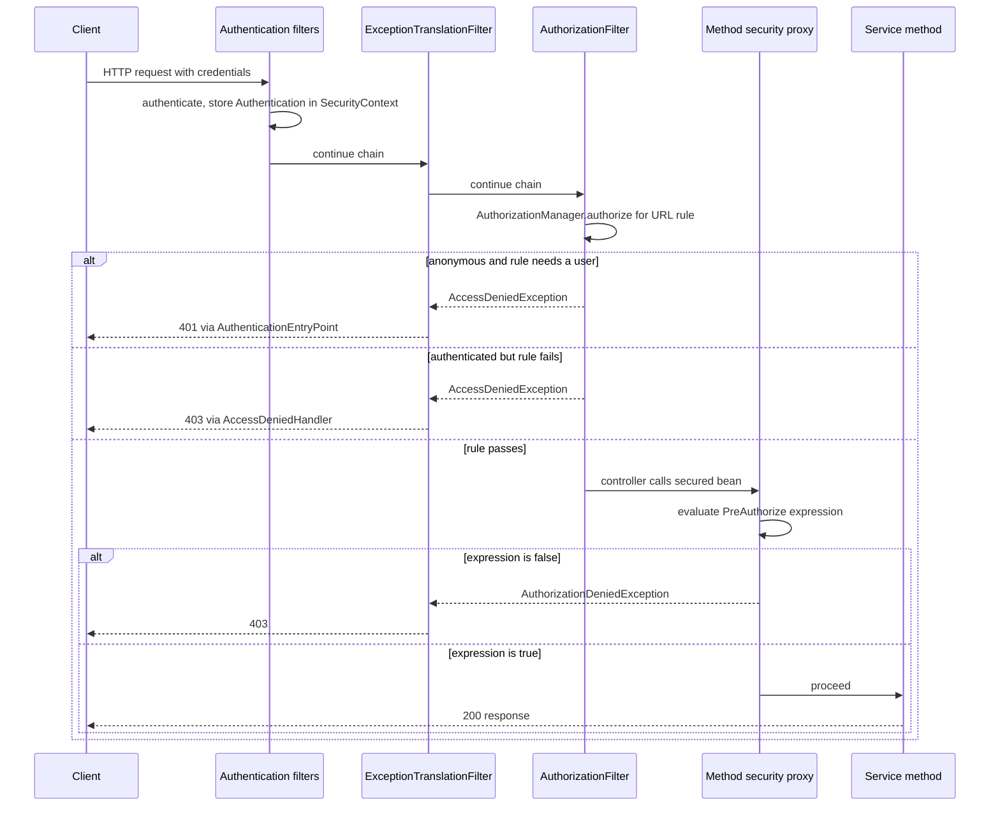
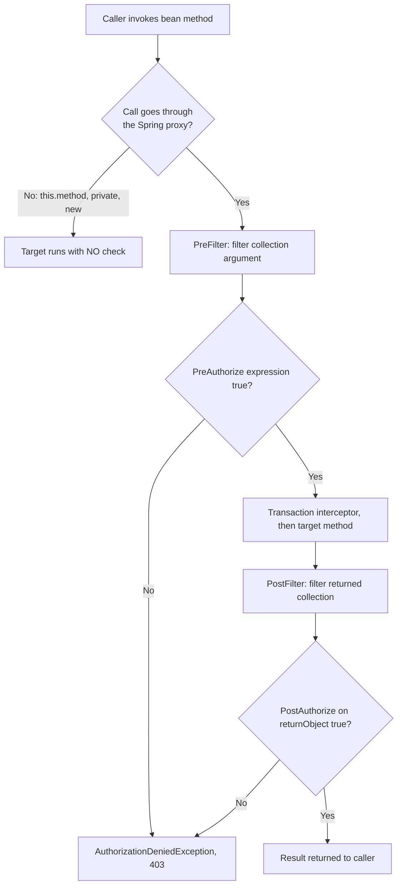

# Authentication vs Authorization; Method Security

!!! abstract "TL;DR"
    - **Authentication (authn)** proves identity and produces an `Authentication` object in the `SecurityContext`. **Authorization (authz)** takes that object and decides *allow or deny* for one request, one method or one object. Failures map to **401** (not authenticated) and **403** (authenticated, not allowed).
    - Spring Security authorizes at two layers: **request level** (`authorizeHttpRequests`, enforced by `AuthorizationFilter`) and **method level** (`@EnableMethodSecurity` + `@PreAuthorize` / `@PostAuthorize` / `@PreFilter` / `@PostFilter`, enforced by Spring AOP interceptors). Both delegate to the same abstraction: `AuthorizationManager`.
    - `hasRole('ADMIN')` checks for the authority `ROLE_ADMIN`. `hasAuthority('SCOPE_read')` checks the exact string. Mixing them up is the most common silent bug.
    - Method security is **proxy based**: self-invocation (`this.method()`), private methods and objects created with `new` are **not** protected.
    - Roles answer "what type of user". They do not answer "is this *your* record". Object-level checks (ownership, tenant) are where real breaches happen (IDOR / BOLA), and method security is the natural place for them.

## Why it matters

Almost every real access-control breach is an *authorization* bug, not an authentication bug. The user logged in correctly, then changed an ID in the URL and read somebody else's data. OWASP ranks **Broken Access Control** as #1 in the Top 10 (2021) and **Broken Object Level Authorization** as #1 in the API Security Top 10 (2023).

Before method security, teams protected applications only with URL patterns. That breaks down for three reasons:

1. **URLs are not the only entry point.** The same service method is called from REST controllers, GraphQL resolvers, Kafka listeners and scheduled jobs.
2. **URL patterns can't see the data.** `/accounts/{id}` says nothing about whether account `id` belongs to the caller.
3. **A single endpoint can hide many operations.** GraphQL exposes everything at `POST /graphql`, so URL rules can only say "must be logged in".

Method security solves this by putting the rule next to the business operation, where the arguments and the return value are visible.

In interviews this topic is used to separate people who "added `@PreAuthorize`" from people who understand why it sometimes does nothing.

## Core concepts

### Two different questions

| | Authentication | Authorization |
|---|---|---|
| Question | Who are you? | Are you allowed to do *this*? |
| Input | Credentials (password, JWT, certificate, SAML assertion) | An `Authentication` + the thing being accessed |
| Output | A trusted `Authentication` (principal + authorities) | Allow or deny |
| Spring component | `AuthenticationManager` → `AuthenticationProvider` | `AuthorizationManager` |
| When | Once per request (stateless) or once per session | On every protected request and method call |
| Failure exception | `AuthenticationException` | `AccessDeniedException` |
| HTTP status | **401** Unauthorized (+ `WWW-Authenticate`) | **403** Forbidden |
| Owner in an OAuth2 world | The identity provider (PingFederate, Entra ID) | Mostly **your service** |

The name "401 Unauthorized" is historical and misleading. It means *unauthenticated*.

Authentication always comes first, because authorization needs an identity to reason about. The filter chain details are in [Spring Security architecture](01-spring-security-architecture-filter-chain-securitycontext-au.md). This page starts where that one ends: there is an `Authentication` in the `SecurityContextHolder`.

### What authentication hands to authorization

An `Authentication` carries three things that authorization uses:

- **Principal:** who it is (`UserDetails`, a `Jwt`, an `OidcUser`).
- **Authorities:** a collection of `GrantedAuthority`, which are just strings such as `ROLE_ADMIN` or `SCOPE_claims.read`.
- **`isAuthenticated()`:** whether it is trusted.

An unauthenticated request is not "no `Authentication`". The `AnonymousAuthenticationFilter` inserts an `AnonymousAuthenticationToken` with the authority `ROLE_ANONYMOUS`. This lets authorization rules treat "nobody" as a normal case, and it decides between 401 and 403 later.

### Roles, authorities and scopes

To Spring Security these are all `GrantedAuthority` strings. The difference is convention:

- **Authority / permission:** a fine-grained right, such as `claims:approve`.
- **Role:** a coarse group of rights. Stored with the prefix `ROLE_`. `hasRole('ADMIN')` adds the prefix for you and looks for `ROLE_ADMIN`.
- **Scope:** an OAuth2 concept. It is what the *client application* was allowed to do on the user's behalf. A Spring resource server maps the JWT `scope` / `scp` claim to authorities with the prefix `SCOPE_` by default.

A scope is a limit on the client, not a statement about the user. A token with scope `prescriptions.read` held by a call-centre agent and by a member means different things. Senior answers always say: *scopes are a ceiling, user permissions still have to be checked.* Token contents are covered in [JWT](04-jwt-structure-signing-validation-revocation.md) and the converter setup in [Resource server configuration](07-resource-server-and-client-configuration-in-spring.md).

### Request-level authorization

`AuthorizationFilter` sits near the end of the security filter chain. It asks an `AuthorizationManager<HttpServletRequest>` built from your `authorizeHttpRequests` rules. Rules are evaluated **in declaration order, first match wins**.


*Notice that the same `AccessDeniedException` becomes 401 or 403 depending on whether the current `Authentication` is anonymous, and that method security is a second, independent gate after the URL gate.*

Things interviewers probe here:

- In Spring Security 6+, `AuthorizationFilter` replaced `FilterSecurityInterceptor`, and `authorizeHttpRequests` replaced `authorizeRequests`. `antMatchers` / `mvcMatchers` became `requestMatchers`.
- From 6.0 the filter runs for **every dispatcher type** (including `FORWARD` and `ERROR`), not only the initial request.
- The 6.x authorization filter defers reading the `SecurityContext` (it takes a `Supplier<Authentication>`), so `permitAll` endpoints don't touch the session.

### Method-level authorization

`@EnableMethodSecurity` registers Spring AOP **advisors**. When a bean has a matching annotation, Spring wraps it in a proxy. The proxy runs a chain of interceptors around the real method.

| Annotation | Runs | Interceptor | Purpose |
|---|---|---|---|
| `@PreFilter` | before | `PreFilterAuthorizationMethodInterceptor` | Remove elements from a collection **argument** |
| `@PreAuthorize` | before | `AuthorizationManagerBeforeMethodInterceptor` | Allow or deny the call |
| `@PostAuthorize` | after | `AuthorizationManagerAfterMethodInterceptor` | Allow or deny based on `returnObject` |
| `@PostFilter` | after | `PostFilterAuthorizationMethodInterceptor` | Remove elements from the returned collection |
| `@Secured`, `@RolesAllowed` | before | same "before" interceptor, different manager | Simple role lists, no SpEL (opt-in flags) |


*Notice that the left exit is the dangerous one: when the call never reaches the proxy, nothing is checked and nothing is logged. Also notice the return path: interceptor orders are PreFilter 100, PreAuthorize 200, PostAuthorize 500, PostFilter 600, so PostFilter is the innermost advice and sees the result before PostAuthorize does.*

Key internals:

- **`@EnableMethodSecurity`** (5.6+, the recommended annotation in 6 and 7, but you still have to declare it) replaces `@EnableGlobalMethodSecurity`, which is deprecated. In 7 the voter-based API behind the old annotation (`AccessDecisionManager`, `AccessDecisionVoter`) survives only in the legacy `spring-security-access` module. `prePostEnabled` is `true` by default. `securedEnabled` and `jsr250Enabled` are `false`.
- The old model was `AccessDecisionManager` + voters + `ConfigAttribute`. The new model is a single functional interface, **`AuthorizationManager<T>`**, whose `authorize(...)` method returns an `AuthorizationResult` (`AuthorizationDecision` is the standard implementation; the older `check(...)` method was deprecated in 6.4 and removed in 7). The same interface is used for requests, methods and messages, and each annotation has its own interceptor bean you can replace.
- A denied check throws **`AuthorizationDeniedException`** (6.3+), a subclass of `AccessDeniedException` that also carries the `AuthorizationResult`.
- Expressions are **SpEL**, evaluated against a `MethodSecurityExpressionRoot`. Available: `authentication`, `principal`, `hasRole`, `hasAnyRole`, `hasAuthority`, `hasAnyAuthority`, `isAuthenticated()`, `permitAll`, `denyAll`, `hasPermission(...)`, method arguments as `#name`, the result as `returnObject`, collection elements as `filterObject`, and any bean as `@beanName`.
- A method **without** an annotation is not checked at all. Method security is "allow by default". Request security can be made "deny by default" with `anyRequest().denyAll()` or `.authenticated()`. This is why you keep both layers.

### RBAC, ABAC and object-level checks

- **RBAC** (role based): `hasRole('PHARMACIST')`. Simple, auditable, but coarse.
- **ABAC** (attribute based): the decision uses attributes of the user, the resource and the context. `#claim.tenantId == authentication.token.claims['tenant']`.
- **Object-level / ownership:** a special, very common case of ABAC. "You may read prescription 123 only if it belongs to you or to a member you manage."

Spring gives three ways to write object-level rules, from simplest to heaviest:

1. Inline SpEL on arguments: `#memberId == authentication.name`.
2. **A bean reference**: `@PreAuthorize("@memberAuthz.canView(authentication, #memberId)")`. Plain Java, unit-testable, the recommended default.
3. `hasPermission(#id, 'Prescription', 'read')` with a custom **`PermissionEvaluator`**, or Spring Security ACL for per-object ACL tables. Powerful, but heavy to operate.

## In practice: code & configuration

### Baseline: both layers on

```java
@Configuration
@EnableWebSecurity
@EnableMethodSecurity                       // prePostEnabled = true by default
class SecurityConfig {

    @Bean
    SecurityFilterChain api(HttpSecurity http) throws Exception {
        return http
            .authorizeHttpRequests(auth -> auth
                .requestMatchers("/actuator/health/**").permitAll()
                .requestMatchers(HttpMethod.GET, "/api/reference/**").hasAuthority("SCOPE_reference.read")
                .requestMatchers("/api/admin/**").hasRole("ADMIN")   // looks for ROLE_ADMIN
                .anyRequest().authenticated())                      // deny-by-default safety net
            .oauth2ResourceServer(rs -> rs.jwt(Customizer.withDefaults()))
            .sessionManagement(s -> s.sessionCreationPolicy(SessionCreationPolicy.STATELESS))
            .build();
    }

    // Lets hasRole('MEMBER') pass for a user that only has ROLE_ADMIN.
    // static: the bean must exist before the method-security infrastructure is built.
    @Bean
    static RoleHierarchy roleHierarchy() {
        return RoleHierarchyImpl.withDefaultRolePrefix()
            .role("ADMIN").implies("AGENT")
            .role("AGENT").implies("MEMBER")
            .build();
    }
}
```

### Object-level rule in a bean

```java
@Component("memberAuthz")
class MemberAuthorization {

    private final CareRelationshipRepository relationships;

    MemberAuthorization(CareRelationshipRepository relationships) {
        this.relationships = relationships;
    }

    /** A member sees their own data. An agent sees members of their own tenant. */
    public boolean canView(Authentication auth, String memberId) {
        if (!(auth.getPrincipal() instanceof Jwt jwt)) {
            return false;                                          // fail closed on unknown principal types
        }
        if (memberId.equals(jwt.getSubject())) {
            return true;
        }
        boolean agent = auth.getAuthorities().stream()
            .anyMatch(a -> a.getAuthority().equals("ROLE_AGENT"));
        return agent && relationships.sameTenant(jwt.getClaimAsString("tenant"), memberId);
    }
}

@Service
class PrescriptionService {

    // Pre-check: we know the owner from the argument, so deny before touching the database.
    @PreAuthorize("@memberAuthz.canView(authentication, #memberId)")
    public List<Prescription> forMember(String memberId) { /* ... */ }

    // Post-check: the owner is only known after loading. Use for READS only.
    @PostAuthorize("@memberAuthz.canView(authentication, returnObject.memberId)")
    public Prescription byId(String prescriptionId) { /* ... */ }
}
```

`#memberId` works only if parameter names are in the bytecode. Since Spring Framework 6.1, that means compiling with **`-parameters`** (`spring-boot-starter-parent` for Maven and the Spring Boot Gradle plugin configure this for you). Otherwise use `@P("memberId")` on the parameter.

### The classic mistake: self-invocation

=== "❌ Common mistake"
    ```java
    @Service
    class ClaimService {

        public void approveAll(List<String> claimIds) {
            // Internal call: 'this' is the raw object, not the proxy.
            // @PreAuthorize below is NEVER evaluated on this path.
            claimIds.forEach(this::approve);
        }

        @PreAuthorize("hasRole('ROLE_SUPERVISOR') and #claimId != null")
        public void approve(String claimId) { /* ... */ }

        @PreAuthorize("hasRole('SUPERVISOR')")
        private void audit(String claimId) { /* private: proxy can't intercept, annotation ignored */ }
    }
    ```

=== "✅ Correct approach"
    ```java
    @Service
    class ClaimService {

        private final ClaimApprover approver;        // a separate bean, so the call crosses a proxy

        ClaimService(ClaimApprover approver) { this.approver = approver; }

        @PreAuthorize("hasRole('SUPERVISOR')")       // secure the public entry point too
        public void approveAll(List<String> claimIds) {
            claimIds.forEach(approver::approve);
        }
    }

    @Service
    class ClaimApprover {

        @PreAuthorize("hasRole('SUPERVISOR') and @claimAuthz.canApprove(authentication, #claimId)")
        public void approve(String claimId) { /* ... */ }
    }
    ```

The rule is the same as for `@Transactional` and `@Cacheable`: the advice lives in the proxy, so only calls that come **from outside the bean** are intercepted. If you truly need to secure internal calls, switch method security to AspectJ weaving (`@EnableMethodSecurity(mode = AdviceMode.ASPECTJ)`), but restructuring the beans is almost always simpler.

### Meta-annotations keep rules consistent

```java
@Target({ElementType.METHOD, ElementType.TYPE})
@Retention(RetentionPolicy.RUNTIME)
@PreAuthorize("hasRole('SUPERVISOR')")
public @interface IsSupervisor {}

@IsSupervisor
public void reopen(String claimId) { /* ... */ }
```

A named annotation is easier to review and to search for than twenty copies of a SpEL string. Since 6.3 meta-annotations can also take parameters through a template defaults bean.

### Filtering and handling denial

```java
// Fine for small lists. For large data, filter in the query instead (see gotchas).
@PostFilter("filterObject.tenantId == authentication.token.claims['tenant']")
public List<Pharmacy> nearby(GeoPoint point) { /* ... */ }

// 6.3+: return a masked value instead of failing the whole response.
// The object must be proxied: a Spring bean, or a returned domain object wrapped via @AuthorizeReturnObject.
@PreAuthorize("hasAuthority('pii:read')")
@HandleAuthorizationDenied(handlerClass = MaskHandler.class)
public String getSsn() { return ssn; }

@Component
class MaskHandler implements MethodAuthorizationDeniedHandler {
    @Override
    public Object handleDeniedInvocation(MethodInvocation invocation, AuthorizationResult result) {
        return "***-**-****";
    }
}
```

### Programmatic check when annotations don't fit

```java
@Component
class ExportJob {

    private final AuthorizationManager<ExportRequest> exportAuthz;   // your own manager bean

    ExportJob(AuthorizationManager<ExportRequest> exportAuthz) { this.exportAuthz = exportAuthz; }

    void run(ExportRequest request) {
        Supplier<Authentication> auth = () -> SecurityContextHolder.getContext().getAuthentication();
        // authorize(...) exists since 6.4. Before that it was check(...), which was removed in 7.
        AuthorizationResult result = exportAuthz.authorize(auth, request);
        if (result != null && !result.isGranted()) {
            throw new AuthorizationDeniedException("export not allowed", result);
        }
        // Shortcut: exportAuthz.verify(auth, request) throws AccessDeniedException for you.
        // ...
    }
}
```

### Testing the rules

```java
@SpringBootTest                                   // method security needs the real proxy, not a plain 'new'
class PrescriptionServiceSecurityTest {

    @Autowired PrescriptionService service;

    @Test
    @WithJwtSubject("member-42")                  // custom @WithSecurityContext: puts a JwtAuthenticationToken in the context
    void memberCannotReadAnotherMembersData() {
        assertThatThrownBy(() -> service.forMember("member-99"))
            .isInstanceOf(AccessDeniedException.class);
    }

    @Test
    @WithJwtSubject("member-42")
    void memberCanReadOwnData() {                 // the positive twin proves the denial above is the ownership rule
        assertThatCode(() -> service.forMember("member-42")).doesNotThrowAnyException();
    }

    @Test
    @WithAnonymousUser                            // AnonymousAuthenticationToken, as in a real unauthenticated request
    void anonymousIsRejected() {
        assertThatThrownBy(() -> service.forMember("member-42"))
            .isInstanceOf(AccessDeniedException.class);
    }
}

// Test support: builds the same Authentication type the resource server builds in production.
@Retention(RetentionPolicy.RUNTIME)
@WithSecurityContext(factory = WithJwtSubjectFactory.class)
@interface WithJwtSubject { String value(); }

class WithJwtSubjectFactory implements WithSecurityContextFactory<WithJwtSubject> {
    @Override
    public SecurityContext createSecurityContext(WithJwtSubject annotation) {
        Jwt jwt = Jwt.withTokenValue("test-token")
            .header("alg", "none")
            .subject(annotation.value())
            .build();
        SecurityContext context = SecurityContextHolder.createEmptyContext();
        context.setAuthentication(new JwtAuthenticationToken(jwt, AuthorityUtils.createAuthorityList("ROLE_MEMBER")));
        return context;
    }
}
```

`@WithMockUser` builds a `UsernamePasswordAuthenticationToken` whose principal is a `User`, not a `Jwt`. With the `canView` bean above, a `@WithMockUser` test would be denied for *every* member ID because of the fail-closed `instanceof Jwt` branch, so the negative test would pass for the wrong reason. That is why the test uses a custom `@WithSecurityContext` annotation (with MockMvc, the `jwt()` request post-processor does the same job). If the `SecurityContext` is completely empty, which happens on a background thread or in a test with no annotation, method security does not see an anonymous user: role-based expressions fail with `AuthenticationCredentialsNotFoundException`. Always write the **negative** test. A security test that only proves the happy path proves nothing.

## Real-world usage

- **Layered checks are the norm.** An API gateway or edge filter validates the token and coarse scopes. Each service re-validates the token and applies role rules at the URL level. Object-level rules live in the service layer, close to the data. See [Service-to-service auth](09-service-to-service-auth.md) for how identity reaches downstream services.
- **GraphQL forces method security.** Everything is `POST /graphql`, so the URL layer can only require authentication. The Spring for GraphQL reference recommends method security on the data-fetching methods or the services behind them. Field-level rules such as "only pharmacists see the prescriber's DEA number" have nowhere else to go.
- **Known failure mode: missing object-level checks.** In 2019 the First American Financial website exposed hundreds of millions of mortgage documents because changing a document number in a URL returned other customers' records (reported by KrebsOnSecurity). In 2022 the Optus breach in Australia involved an internet-facing API that returned customer records without proper access control. Neither was a cryptography failure. Both were access-control failures.
- **Healthcare and banking.** HIPAA's "minimum necessary" standard and its access-control safeguard are, in engineering terms, object-level and field-level authorization requirements. In banking, maker-checker (the approver must differ from the creator) is an ABAC rule: `#payment.createdBy != authentication.name`. Auditors ask to see where each rule is enforced, which is an argument for named meta-annotations and a central authorization bean.
- **Externalised policy.** Larger organisations move rules out of code into a policy engine (Open Policy Agent, AWS Cedar / Verified Permissions) or a relationship-based system modelled on Google's Zanzibar paper (OpenFGA, SpiceDB). In Spring this plugs in as a custom `AuthorizationManager` or a bean called from `@PreAuthorize`.

## Trade-offs & production gotchas

| Option | Pros | Cons | Use when |
|---|---|---|---|
| URL rules (`authorizeHttpRequests`) | Central, deny-by-default, runs before any controller code | Can't see arguments or data, useless for GraphQL operations | Coarse rules: public vs authenticated, admin areas, scopes per path |
| `@PreAuthorize` with roles/authorities | Next to the code, covers every entry point | Allow-by-default, proxy pitfalls, rules scattered | Operation-level RBAC |
| `@PreAuthorize` + authorization bean | Object-level rules in testable Java | Extra lookups per call | Ownership and tenant checks |
| `@PostAuthorize` | Works when the owner is only known after loading | Method has already run, wasted work, unsafe for writes | Single-object reads |
| `@PostFilter` | One line | Loads everything then discards, breaks pagination | Small collections only |
| Query-level filtering (tenant in the `WHERE` clause) | Efficient, correct pagination | Rule lives in the repository layer | Lists and search |
| `PermissionEvaluator` / ACL module | Uniform `hasPermission` model, per-object grants | ACL tables are hard to operate and slow at scale | True per-object sharing (documents, folders) |
| External policy engine (OPA, Cedar, Zanzibar-style) | One policy for many services and languages, auditable | Network hop, new failure mode, policy/data sync | Many teams, regulatory audit, complex relationships |

!!! warning "Gotchas"
    - **Self-invocation, `private` and `final` methods, and objects created with `new`** bypass the proxy. No error, no log line.
    - **`@PostAuthorize` runs after the method.** With default ordering, the method-security interceptors wrap the transaction interceptor, so a denied `@PostAuthorize` is thrown **after the transaction has committed**. Never put it on a method with side effects. If you must, give `@EnableTransactionManagement` a lower order value so the transaction is the outer advice.
    - **`hasRole("ROLE_ADMIN")` in the Java DSL throws** at startup ("should not start with ROLE_"). In a SpEL expression, `hasRole('ROLE_ADMIN')` is tolerated because the prefix is not added twice. `hasAuthority('ADMIN')` when the token holds `ROLE_ADMIN` just returns false.
    - **Scopes are not roles.** With the default JWT converter you get `SCOPE_x` authorities and **no** `ROLE_` authorities. `hasRole('ADMIN')` is always false until you map a roles or groups claim yourself.
    - **`SecurityContext` is thread-bound.** `@Async`, `CompletableFuture.supplyAsync`, parallel streams and Kafka listener threads start with an empty context. Wrap executors with `DelegatingSecurityContextAsyncTaskExecutor` / `DelegatingSecurityContextExecutorService`. In WebFlux use `@EnableReactiveMethodSecurity`, which reads the Reactor context instead.
    - **Method security is allow-by-default.** A new public method without an annotation is open. Counter this with a class-level annotation as the default, and an ArchUnit test that fails the build for unannotated public service methods.
    - **Don't mix models.** Putting the same annotation type on a method from two inherited interfaces is rejected as ambiguous. A method-level annotation overrides the class-level one, it does not combine with it.
    - **Method security on controllers returns 403 after argument binding and validation.** A 400 for a bad body can leak before the 403. Keep the coarse rule at the URL level too.
    - **Hiding in the UI is not authorization.** Removing a button in React changes nothing on the server.

!!! tip "404 or 403?"
    For object-level denials, many APIs return **404** so that an attacker cannot learn which IDs exist. Pick one policy per API and apply it consistently.

## How this connects to my experience

- **Where I used it:**
    - **Johnson Controls, Metasys:** "Implemented Spring Security authorization controls and API security mechanisms" and "owned JWT-based authentication and SSO implementation end-to-end" on the user management microservices. This is the direct claim: authentication (JWT, SSO) and authorization (role/permission checks) on the same service.
    - **Publicis Sapient, OptumRx Meteor:** "Built secure enterprise APIs using OAuth2, PingFederate, and Active Directory integration" and "Owned the GraphQL Consumer Service end-to-end". PingFederate authenticates and issues the token. The service is the place where authorization decisions on that token are made.
- **Talking points:**
    - On Metasys I separated the two concerns: a filter validated the JWT and built the `Authentication`, and authorization rules decided what each user-management operation required. *[confirm: whether JWT validation was a custom filter or a library, whether rules were URL-based, `@PreAuthorize` / `@Secured`, or both, and the role model used, e.g. admin / operator / viewer]*
    - That work was in 2017–18, so it was the Spring Security 4/5 generation, where the standard setup was `@EnableGlobalMethodSecurity` and `WebSecurityConfigurerAdapter`. *[confirm: the actual Spring Security version and whether method security was enabled at all]* I can explain what changed: `@EnableMethodSecurity`, `AuthorizationManager`, `SecurityFilterChain` beans, `authorizeHttpRequests`. Saying this unprompted shows the knowledge is current.
    - On OptumRx the token came from PingFederate, with user and group information originating in Active Directory. Groups or roles in the token were mapped to Spring authorities for access decisions. *[confirm: which claim carried groups/roles, and whether mapping was done with a custom `JwtAuthenticationConverter`]*
    - A GraphQL service has one URL, so URL rules only establish "authenticated". Per-operation rules belong on the `@QueryMapping` methods or the service layer, and member-level data needs an ownership check because this is healthcare data for 750K+ users. *[confirm: how member-level access was actually enforced, in the Consumer Service or delegated to the 5 upstream systems]*
    - As a lead I treat authorization as a review checklist item: every new service method needs a rule and a negative test. *[confirm if this was part of the engineering standards you established]*
- **Likely follow-up chain:**
    1. "What is the difference between authentication and authorization?" → identity vs decision, 401 vs 403, IdP vs service.
    2. "Where did you enforce authorization?" → two layers: URL for coarse rules, method for operation and object rules. Give the Metasys or OptumRx example.
    3. "How does `@PreAuthorize` actually work?" → AOP proxy, interceptor, `AuthorizationManager`, SpEL against the current `Authentication`.
    4. "When does it not work?" → self-invocation, private methods, async threads, missing role mapping from the JWT.
    5. "A user with a valid role reads another member's record. How do you stop that?" → object-level check in an authorization bean, pre-check where possible, tenant filter in the query for lists, negative tests, consistent 404/403.
    6. "How would you scale this across 20 services?" → shared starter with meta-annotations and converter, or an external policy engine. State the trade-off.

## Interview questions

### Fundamentals

??? question "Q1. What is the difference between authentication and authorization?"
    **Answer:** Authentication verifies identity: the caller proves who they are with credentials, and the result is a trusted `Authentication` object holding a principal and authorities. Authorization uses that identity to decide whether one specific action on one specific resource is allowed. Authentication happens first and usually once per request or session. Authorization happens at every protected point. In an OAuth2 setup the identity provider authenticates, but each service still authorizes.

    **Interviewer listens for:** The order, the output of each step, 401 vs 403, and that the IdP does not make your business authorization decisions.

    **Common wrong answer:** "Authentication is login and authorization is roles." It is too shallow. Authorization also covers ownership, tenant and context.

??? question "Q2. When does Spring Security return 401 and when 403?"
    **Answer:** `ExceptionTranslationFilter` handles both. An `AuthenticationException` goes to the `AuthenticationEntryPoint`, which returns 401 (or redirects to login). An `AccessDeniedException` is checked further: if the current `Authentication` is anonymous (or remember-me), it is treated as "not logged in" and also goes to the entry point. Otherwise the `AccessDeniedHandler` returns 403. A resource server with an invalid or expired bearer token returns 401 with a `WWW-Authenticate: Bearer error="invalid_token"` header. A valid token with a missing scope returns 403 with `insufficient_scope`.

    **Interviewer listens for:** That an access-denied for an anonymous user becomes 401, and the names of the two handlers.

??? question "Q3. What is the difference between `hasRole` and `hasAuthority`?"
    **Answer:** Both compare against the `GrantedAuthority` strings. `hasAuthority('X')` looks for exactly `X`. `hasRole('X')` adds the default prefix and looks for `ROLE_X`. So `hasRole('ADMIN')` equals `hasAuthority('ROLE_ADMIN')`. The prefix can be changed with a `GrantedAuthorityDefaults` bean. OAuth2 scopes become `SCOPE_x` authorities, so they need `hasAuthority('SCOPE_x')`.

    **Common wrong answer:** "Roles and authorities are stored in different places." They are the same collection. Only the naming convention differs.

??? question "Q4. Which method security annotations exist and what does each do?"
    **Answer:** `@PreAuthorize` decides before the call. `@PostAuthorize` decides after the call and can inspect `returnObject`. `@PreFilter` removes elements from a collection argument. `@PostFilter` removes elements from the returned collection using `filterObject`. All four support SpEL and are on by default with `@EnableMethodSecurity`. `@Secured` (Spring) and `@RolesAllowed` / `@PermitAll` / `@DenyAll` (JSR-250) only take role names and must be enabled with `securedEnabled = true` or `jsr250Enabled = true`.

    **Interviewer listens for:** That `@PostAuthorize` does not prevent the method from running.

??? question "Q5. What does `@EnableMethodSecurity` do, and how is it different from `@EnableGlobalMethodSecurity`?"
    **Answer:** It registers AOP advisors, one per annotation type, each backed by an `AuthorizationManager`. Differences from the old annotation: pre/post annotations are enabled by default, it uses the `AuthorizationManager` API instead of `AccessDecisionManager` and voters, it follows JSR-250 semantics properly, and each interceptor is a separate bean you can override or reorder. `@EnableGlobalMethodSecurity` is deprecated in 6.x, and in 7 the voter-based Access API it relies on has been moved out to the legacy `spring-security-access` module.

### Intermediate

??? question "Q6. Output prediction. What happens when `process()` is called by a user with only `ROLE_USER`?"
    ```java
    @Service
    class ReportService {
        public void process() { delete(); }

        @PreAuthorize("hasRole('ADMIN')")
        public void delete() { System.out.println("deleted"); }
    }
    ```

    **Answer:** It prints `deleted`. `process()` has no annotation, so the proxy lets it through. Inside the target object, `delete()` is called on `this`, which is the raw object, so the interceptor never runs. Fixes: annotate `process()`, move `delete()` to another bean, or use AspectJ weaving.

    **Interviewer listens for:** The word "proxy", and the link to the identical `@Transactional` problem.

    **Common wrong answer:** "It throws AccessDeniedException."

??? question "Q7. Why would you keep URL rules if you already have method security (or the reverse)?"
    **Answer:** They fail in different ways. URL rules are central and can be deny-by-default with `anyRequest().authenticated()`, and they reject bad requests before any deserialisation or controller code runs. But they can't see method arguments or data, and they miss non-HTTP entry points. Method security covers every caller and can do object-level checks, but it is allow-by-default and has proxy pitfalls. Used together, a forgotten annotation is still covered by the URL rule, and a URL pattern mistake is still covered by the method rule. This is defence in depth.

??? question "Q8. `@PreAuthorize` vs `@PostAuthorize` for an ownership check. Which do you choose?"
    **Answer:** Prefer `@PreAuthorize` whenever the owner can be derived from the arguments or a cheap lookup, because the method does not run for denied callers. Use `@PostAuthorize` only for reads where the owner is known only after loading the object. Never use it on methods that write, send messages or call other systems, because those effects have already happened, and by default even the transaction has already committed when the denial is thrown.

    **Common wrong answer:** "They are equivalent, it is a style choice."

??? question "Q9. How do you write a rule like 'a user can only read their own orders'?"
    **Answer:** Put the logic in a bean and reference it: `@PreAuthorize("@orderAuthz.canRead(authentication, #orderId)")`. The bean loads the minimal ownership data and returns a boolean. It fails closed for unknown principal types. For lists, add the owner or tenant to the query rather than filtering afterwards. For a uniform model across domain types, implement `PermissionEvaluator` and use `hasPermission(#orderId, 'Order', 'read')`. Add a negative test with a different user.

    **Interviewer listens for:** Naming the vulnerability (IDOR / BOLA), and not putting complex logic in a SpEL string.

??? question "Q10. A JWT contains `\"scope\": \"read write\"` and `\"roles\": [\"ADMIN\"]`. With default resource server settings, does `hasRole('ADMIN')` pass?"
    **Answer:** No. The default `JwtGrantedAuthoritiesConverter` reads only `scope` or `scp` and creates `SCOPE_read` and `SCOPE_write`. The `roles` claim is ignored. To use it, configure a `JwtAuthenticationConverter` whose authorities converter reads the `roles` claim with the prefix `ROLE_`, usually combined with the scope converter.

    **Common wrong answer:** "Yes, Spring maps roles automatically." Each IdP uses a different claim name (`roles`, `groups`, `realm_access.roles`), so there is no safe default.

??? question "Q11. Why does `@PreAuthorize(\"#id == authentication.name\")` sometimes fail with a null `#id`?"
    **Answer:** SpEL resolves `#id` from the parameter name. Since Spring Framework 6.1, names come only from the `-parameters` compiler flag, not from debug information. If the class was compiled without it, the name is unknown and the variable is null, so the expression is false and every call is denied. Fix the compiler setting, or annotate the parameter with `@P("id")`. Annotations declared on an interface have the same issue for the interface's parameters.

### Senior

??? question "Q12. Explain the internals: what happens between the caller and the method when `@PreAuthorize` is present?"
    **Answer:** At startup, `@EnableMethodSecurity` registers advisors with pointcuts that match the security annotations. The auto-proxy creator wraps matching beans in a JDK or CGLIB proxy. At call time the proxy builds a `MethodInvocation` and runs the interceptor chain in order: pre-filter, pre-authorize, then other advice such as transactions, then the target, and on the way back post-filter (order 600, innermost) followed by post-authorize (order 500). `AuthorizationManagerBeforeMethodInterceptor` calls `PreAuthorizeAuthorizationManager`, which parses and caches the SpEL expression, creates an evaluation context with a `MethodSecurityExpressionRoot` (via `MethodSecurityExpressionHandler`), and evaluates it with a lazily supplied `Authentication` from the `SecurityContextHolderStrategy`. If the decision is not granted, it publishes an authorization-denied event and throws `AuthorizationDeniedException`. If nothing in between handles it (for example a catch-all `@ExceptionHandler(Exception.class)` in a `@ControllerAdvice`, which would turn it into a 500), it propagates to `ExceptionTranslationFilter`, which returns 403, or 401 for an anonymous caller.

    **Interviewer listens for:** Advisor/pointcut, interceptor order, expression handler, where `Authentication` comes from, and how the exception becomes a status code.

??? question "Q13. How does authorization behave with `@Async`, `CompletableFuture` and reactive code?"
    **Answer:** The default `SecurityContextHolder` strategy is a `ThreadLocal`. A new thread has no context, so a `@PreAuthorize` there sees no authentication and fails with `AuthenticationCredentialsNotFoundException`, or code reading the principal gets null. Options: wrap the executor in `DelegatingSecurityContextAsyncTaskExecutor` so the context is copied per task, resolve the needed identity before going async and pass it as an argument, or do the authorization check before the hand-off. `MODE_INHERITABLETHREADLOCAL` is unsafe with thread pools, because a pooled thread keeps the context of whoever created it. In WebFlux the context lives in the Reactor context and `@EnableReactiveMethodSecurity` reads it from there. Methods must return `Mono` / `Flux` for that to work.

    **Common wrong answer:** "Use `MODE_INHERITABLETHREADLOCAL`." With pools this can leak one user's identity to another user's task.

??? question "Q14. How would you design authorization for a GraphQL service that aggregates several upstream systems?"
    **Answer:** Layer it. (1) URL level: `/graphql` requires a valid token. (2) Operation level: `@PreAuthorize` on `@QueryMapping` / `@MutationMapping` methods or the services they call, using meta-annotations. (3) Object level: an authorization bean that checks the requested member or account against the caller's identity and tenant, applied before upstream calls so denied users cost nothing. (4) Field level for sensitive fields, either a secured `@SchemaMapping` or `@HandleAuthorizationDenied` to mask values. (5) Propagate the user's identity to upstream systems so they can enforce their own rules, rather than calling them with an all-powerful service account. Batch loaders need care: keys in one batch must all be authorised for the same caller, and the loader must be request-scoped. Finally, map authorization errors to GraphQL errors with a `FORBIDDEN` classification rather than failing the whole response.

    **Interviewer listens for:** That URL rules are insufficient, the confused-deputy risk of service accounts, and the DataLoader interaction.

??? question "Q15. RBAC, ABAC, ReBAC. How do you choose, and when do you externalise policy?"
    **Answer:** Start with RBAC for coarse operation rights because it is simple to audit. Add ABAC rules in code for ownership, tenant, amount limits and maker-checker. Consider ReBAC (relationship based, Zanzibar style) when access depends on graphs of relationships, such as sharing, delegation and organisational hierarchies. Externalise to a policy engine when many services in several languages must share one policy, when non-developers must review or change policy, or when audit requires a single decision log. The cost is a network hop on the hot path, a new dependency that must fail closed, and keeping the engine's data in sync. Mitigate with a sidecar or embedded engine and short-lived decision caching.

??? question "Q16. Role explosion: the product now has 60 roles and `@PreAuthorize` strings with eight `or` clauses. What do you do?"
    **Answer:** Stop checking roles in code. Check **permissions** (`claims:approve`) and let roles be a data-level mapping to permissions, resolved when the `Authentication` is built or through a `RoleHierarchy`. Then new roles need no code change. Replace SpEL strings with meta-annotations or one authorization bean per domain. Keep the token small: put role or group names in the token and expand them to permissions in the service, cached, rather than putting hundreds of permissions in a JWT.

### Scenario-based

??? question "Q17. A penetration test shows that user A can fetch `/api/members/B/prescriptions` and get B's data. Every endpoint has `hasRole('MEMBER')`. Walk me through the fix."
    **Answer:** This is broken object-level authorization. The role check passed because A really is a member. Immediate fix: add an ownership check on the service method, `@PreAuthorize("@memberAuthz.canView(authentication, #memberId)")`, comparing the path ID with the token subject or a verified relationship. Then widen it: search for every method that takes a resource ID and audit it, add tenant or owner predicates to list queries, add negative integration tests that call each endpoint as a different user, and decide on 403 vs 404. Longer term: where possible, stop taking the member ID from the client at all and derive it from the token (`/api/me/prescriptions`). Check access logs to see whether the hole was exploited, since in healthcare that may be a reportable incident.

    **Interviewer listens for:** Root cause named correctly, a systemic fix and not only one endpoint, tests, and the incident-response angle.

??? question "Q18. After a refactor, admin-only operations became available to all logged-in users. No security code changed. What do you check?"
    **Answer:** Likely causes, in order: (1) the secured method is now called from another method of the same class, or was made private or final, so the proxy is bypassed. (2) The class is now created with `new` or by a factory instead of being a Spring bean. (3) The annotation stayed on an interface or parent while the method signature changed, so it no longer matches. (4) `@EnableMethodSecurity` was on a configuration class that was removed or is no longer scanned, so all annotations are silently ignored. (5) A matcher such as `requestMatchers("/api/**").authenticated()` was moved above the more specific admin rule, and first match wins. Verify with a test using a non-admin user, and add a build-time guard: an ArchUnit rule plus a test asserting that the bean is an AOP proxy.

??? question "Q19. `GET /claims?page=0&size=20` uses `@PostFilter` to remove other tenants' claims. Users complain pages have 3 or 7 items. Why, and what is the fix?"
    **Answer:** The database returned 20 rows for the page, then `@PostFilter` removed the ones the user may not see. Page sizes and total counts are now wrong, and the service loaded data it should never have read. `@PostFilter` also iterates in memory, so it does not scale. Fix: move the rule into the query. Pass the tenant or owner from the `Authentication` into the repository predicate (Spring Data supports `?#{authentication.name}` style SpEL in `@Query` through the security-data integration, or pass it explicitly). Keep method security for the operation-level check.

??? question "Q20. A Kafka listener calls a service method protected by `@PreAuthorize(\"hasRole('SUPERVISOR')\")` and fails for every message. How do you fix it properly?"
    **Answer:** The listener thread has no `SecurityContext`, because nobody authenticated. Options: (1) Separate the paths. The user-facing method keeps the annotation, and the listener calls an internal method on a bean that is not exposed to user traffic, with the authorization decision made when the event was produced. (2) If the consumer must act as a principal, authenticate the message: carry a verifiable identity (for example a token or signed header), validate it, and set a context for the duration of the handler, clearing it in `finally`. (3) For pure system jobs, run as an explicit system principal with narrowly scoped authorities. What not to do: disable the check or set a hard-coded admin context globally. Whichever option is chosen, record who originally requested the action for the audit trail.

    **Interviewer listens for:** That an event header is untrusted unless verified, and that the context must be cleared on pooled threads.

## Cheat sheet

| Concept | Remember |
|---|---|
| Authn vs authz | Who you are vs what you may do. 401 vs 403 |
| Anonymous + denied | Becomes 401 through `AuthenticationEntryPoint` |
| Request layer | `authorizeHttpRequests` → `AuthorizationFilter`. First match wins. End with `anyRequest().authenticated()` |
| Method layer | `@EnableMethodSecurity` → AOP interceptors → `AuthorizationManager` |
| Defaults | Pre/post annotations on. `@Secured` and JSR-250 off |
| `hasRole('X')` | Looks for `ROLE_X`. `hasAuthority` is the exact string |
| Scopes | `SCOPE_` prefix from `scope` / `scp`. Roles claim needs a custom converter |
| SpEL variables | `authentication`, `principal`, `#arg`, `returnObject`, `filterObject`, `@bean` |
| `#arg` names | Need `-parameters` or `@P` |
| Proxy limits | Self-invocation, private, final, `new` → no check |
| `@PostAuthorize` | Method already ran, transaction already committed. Reads only |
| `@PostFilter` | Small lists only. Breaks pagination. Filter in the query |
| Object-level | `@authzBean.canX(authentication, #id)`. Prevents IDOR / BOLA |
| Threads | Context is `ThreadLocal`. Use `DelegatingSecurityContext*` executors |
| Reactive | `@EnableReactiveMethodSecurity`, Reactor context |
| Denied exception | `AuthorizationDeniedException` (6.3+) extends `AccessDeniedException` |
| Versions | `@EnableGlobalMethodSecurity`, `authorizeRequests`, `antMatchers` are legacy |

## Sources

1. [Spring Security Reference: Method Security](https://docs.spring.io/spring-security/reference/servlet/authorization/method-security.html): annotations, interceptor order, `@EnableMethodSecurity` defaults, meta-annotations, `@HandleAuthorizationDenied`, the `-parameters` requirement and the transaction-ordering note.
2. [Spring Security Reference: Authorize HttpServletRequests](https://docs.spring.io/spring-security/reference/servlet/authorization/authorize-http-requests.html): `AuthorizationFilter`, rule ordering, dispatcher types, `hasRole` vs `hasAuthority`.
3. [Spring Security Reference: Authorization Architecture](https://docs.spring.io/spring-security/reference/servlet/authorization/architecture.html): `GrantedAuthority`, `AuthorizationManager`, `RoleHierarchy`, the legacy `AccessDecisionManager` model.
4. [Spring Security Reference: OAuth 2.0 Resource Server JWT](https://docs.spring.io/spring-security/reference/servlet/oauth2/resource-server/jwt.html): default `SCOPE_` authority mapping and `JwtAuthenticationConverter` customisation.
5. [Spring for GraphQL Reference: Security](https://docs.spring.io/spring-graphql/reference/security.html): why GraphQL needs method-level security behind a single URL.
6. [OWASP Top 10 2021, A01 Broken Access Control](https://owasp.org/Top10/A01_2021-Broken_Access_Control/) and [OWASP API Security Top 10 2023, API1 Broken Object Level Authorization](https://owasp.org/API-Security/editions/2023/en/0xa1-broken-object-level-authorization/): why object-level checks matter.
7. [RFC 6750: Bearer Token Usage](https://www.rfc-editor.org/rfc/rfc6750#section-3.1): `invalid_token` (401) vs `insufficient_scope` (403).
8. [KrebsOnSecurity: First American Financial Corp. Leaked Hundreds of Millions of Title Insurance Records](https://krebsonsecurity.com/2019/05/first-american-financial-corp-leaked-hundreds-of-millions-of-title-insurance-records/): a real-world IDOR incident.
