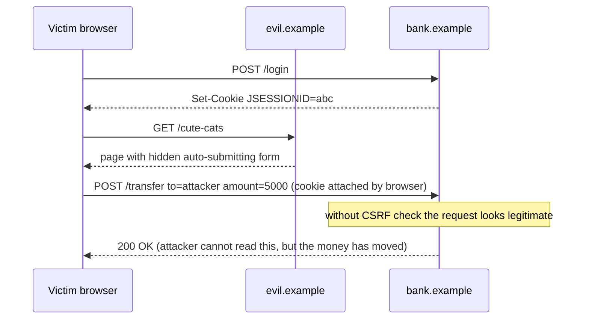
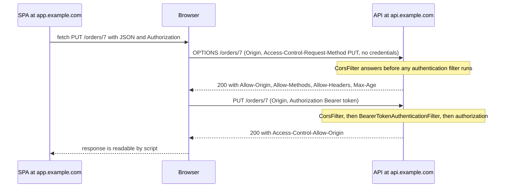

# Sessions vs Tokens; CSRF & CORS in Spring

!!! abstract "TL;DR"
    - **Session** = the server keeps the state and the browser holds an opaque ID in a cookie. **Token** = the client holds a self-contained (or opaque) credential and sends it explicitly in the `Authorization` header.
    - **CSRF exists because browsers attach cookies automatically.** If the credential is a cookie (session cookie *or* a JWT in a cookie), you need CSRF protection. If it is a header the JavaScript adds itself, you don't.
    - **CORS is not a defence, it is a relaxation.** It loosens the browser's same-origin policy so another origin may *read* your responses. It does not stop a request from being sent, and it does nothing against curl or Postman.
    - In Spring Security, CSRF is **on by default** for every method except `GET`, `HEAD`, `TRACE`, `OPTIONS`. CORS must be processed **before** authentication, because preflight `OPTIONS` requests carry no credentials.
    - Senior answer for SPAs: don't keep tokens in `localStorage`. Use a **BFF (backend for frontend)** that holds tokens server-side and gives the browser a `HttpOnly`, `Secure`, `SameSite` session cookie plus CSRF protection.

## Why it matters

HTTP is stateless. After login, every request must prove again who the caller is. There are only two ways to do it: the server remembers you (session), or you carry proof with you (token). Each choice decides how you scale, how you log users out, and which attacks you must defend against.

CSRF and CORS are the two topics candidates most often mix up. A typical weak answer is "we use JWT, so we disabled CSRF and added `@CrossOrigin(\"*\")`". An interviewer for a Lead role wants to hear *why* each setting is safe or unsafe for your exact architecture: where the credential lives, who attaches it, and what the browser does on its own.

This page covers the storage and transport of credentials. For the filter chain itself see [01-spring-security-architecture-filter-chain-securitycontext-au.md](01-spring-security-architecture-filter-chain-securitycontext-au.md). For JWT internals and revocation see [04-jwt-structure-signing-validation-revocation.md](04-jwt-structure-signing-validation-revocation.md).

## Core concepts

### Server-side sessions

1. The user logs in. The server creates an `HttpSession`, stores the `SecurityContext` in it, and returns `Set-Cookie: JSESSIONID=abc` (opaque random ID).
2. The browser sends that cookie **automatically** on every request to that site.
3. The server looks the ID up and restores the `SecurityContext`.

In Spring Security the pieces are:

- `SecurityContextHolderFilter` loads the context at the start of each request through a `SecurityContextRepository`.
- `HttpSessionSecurityContextRepository` reads and writes it under the session attribute `SPRING_SECURITY_CONTEXT`.
- Since Spring Security 6 the context is **saved explicitly** by the authentication filter. The old `SecurityContextPersistenceFilter` that saved automatically at the end of every request is deprecated and no longer in the default chain (`SecurityContextHolderFilter` replaced it). If you write a custom login endpoint, you must call `securityContextRepository.saveContext(...)` yourself, or the user is "logged in" for one request only.
- `SessionCreationPolicy` controls session use: `IF_REQUIRED` (default), `ALWAYS`, `NEVER` (don't create, but use one if it exists), `STATELESS` (never create and never read the context from it).
- **Session fixation protection** is on by default: after login the session ID is changed (`changeSessionId`), so an ID planted by an attacker before login becomes useless.

Sessions are easy to revoke (delete the entry) and keep nothing sensitive in the browser. The cost is server state. With more than one instance you need sticky sessions or a shared store such as **Spring Session with Redis**.

### Tokens

1. The client authenticates (usually through OAuth2, see [05-oauth2-roles-and-grant-types.md](05-oauth2-roles-and-grant-types.md)) and receives an access token.
2. The client sends `Authorization: Bearer <token>` **explicitly** on each call.
3. The API validates the token on every request. A JWT is verified locally by signature and claims. An opaque token is checked by introspection against the authorization server.

In Spring, `BearerTokenAuthenticationFilter` extracts the token, a `JwtDecoder` validates it, and the resulting `Authentication` lives only for that request. No session is needed, so any instance can serve any request.

The cost moves elsewhere: a JWT cannot be "deleted" before it expires, the token is larger than a session ID, and the client must store it somewhere.

### The key distinction: who attaches the credential?

This single question explains CSRF.

| Credential | Attached by | Other sites can make the browser send it? | CSRF risk |
|---|---|---|---|
| Session cookie | Browser, automatically | Yes | **Yes** |
| JWT stored in a cookie | Browser, automatically | Yes | **Yes** |
| HTTP Basic (browser-cached) | Browser, automatically | Yes | **Yes** |
| `Authorization: Bearer` header set by JavaScript | Your code | No, another origin cannot read your token | No |

"Stateless" and "CSRF-safe" are different properties. A JWT in a cookie is stateless and still open to CSRF.

### CSRF: the attack

Cross-Site Request Forgery makes the victim's browser send a state-changing request to a site where the victim is already logged in.


*Notice that the attacker never sees the cookie or the response. The attack works only because the browser attaches the cookie on its own, and the damage is done by the request, not by reading the reply.*

### CSRF: the defences

**1. Synchronizer token (Spring's default).** The server generates a random token, stores it (in the session by default, `HttpSessionCsrfTokenRepository`), and expects it back in a request parameter `_csrf` or a header `X-CSRF-TOKEN`. The attacker's page can make the browser send the cookie, but it cannot read the token because of the same-origin policy.

**2. Double-submit cookie (typical for SPAs).** `CookieCsrfTokenRepository` writes the token to a cookie named `XSRF-TOKEN`. JavaScript on your origin reads it and echoes it in the header `X-XSRF-TOKEN`. The server compares cookie and header. An attacker's origin cannot read your cookie, so it cannot set the header. The cookie must be readable by JavaScript, so use `CookieCsrfTokenRepository.withHttpOnlyFalse()`. This is safe because the CSRF token is not a credential.

**3. `SameSite` cookies.** `SameSite=Lax` (the default in Chromium browsers when the attribute is missing) stops the cookie being sent on cross-site `POST`s and sub-resource requests. `Strict` blocks it on every cross-site request. It is strong defence in depth, but OWASP still recommends token-based protection as the primary control, because `SameSite` is about *site* (registrable domain), not *origin*. A compromised or attacker-controlled sibling subdomain is same-site.

**4. Fetch Metadata / Origin checks.** The server can reject state-changing requests whose `Sec-Fetch-Site` header is `cross-site`, or whose `Origin` is not on an allow list. Useful as an extra layer.

Things worth knowing about Spring Security 6+:

- `CsrfFilter` protects every method except `GET`, `HEAD`, `TRACE`, `OPTIONS`. So **GET endpoints must never change state**.
- A missing or wrong token gives **403 Forbidden** through the `AccessDeniedHandler`, not 401.
- The token is **deferred**: it is only loaded (and a session only created) when something actually reads it. This is why a plain SPA never receives the `XSRF-TOKEN` cookie unless something touches the token on a request.
- The default request handler is `XorCsrfTokenRequestAttributeHandler`. It XORs the token with random bytes on every render, so the value on the page changes each time. This protects against the **BREACH** compression attack. A SPA that reads the raw value from the cookie needs the plain `CsrfTokenRequestAttributeHandler` for header resolution. The Spring docs give a small `SpaCsrfTokenRequestHandler` for 6.x, and Spring Security 7 packages the same setup as `csrf(csrf -> csrf.spa())`.
- Login and logout need CSRF protection too. **Login CSRF** logs the victim into the attacker's account. Logout is `POST /logout` by default for the same reason.
- With `oauth2ResourceServer`, requests that carry a bearer token are **automatically excluded** from CSRF checks. You don't need `csrf.disable()` just to make bearer-token calls work.

### Same-origin policy and CORS

An **origin** is scheme + host + port. `https://app.example.com` and `https://api.example.com` are different origins (but the same *site*).

The **same-origin policy (SOP)** is a browser rule: script from origin A may *send* some requests to origin B, but may not *read* the response. **CORS** (Cross-Origin Resource Sharing) is how server B tells the browser "origin A is allowed to read my responses".

Two request classes:

- **Simple requests**: `GET`, `HEAD`, or `POST` with a content type of `application/x-www-form-urlencoded`, `multipart/form-data` or `text/plain`, and only safelisted headers. The browser sends them immediately and only checks the response headers afterwards. **The server has already processed the request.** This is why CORS does not prevent CSRF.
- **Preflighted requests**: anything else, for example `PUT`, `DELETE`, `Content-Type: application/json`, or an `Authorization` header. The browser first sends `OPTIONS` with `Origin`, `Access-Control-Request-Method` and `Access-Control-Request-Headers`. Only if the answer allows it does the real request go out.


*Notice that the preflight carries no cookie and no `Authorization` header. If the security chain tries to authenticate it, the preflight gets 401 and the browser reports a CORS error even though the CORS rules themselves are correct.*

Response headers you must know:

| Header | Meaning |
|---|---|
| `Access-Control-Allow-Origin` | One exact origin, or `*`. Never a list. |
| `Access-Control-Allow-Credentials: true` | Browser may send cookies / expose the response for credentialed requests. **Not allowed together with `*`.** |
| `Access-Control-Allow-Methods` / `-Headers` | Answer to the preflight. |
| `Access-Control-Expose-Headers` | Response headers the script may read beyond the safelisted ones (for example `Location`, `ETag`). |
| `Access-Control-Max-Age` | How long the browser may cache the preflight. Browsers cap it (Chromium at 2 hours, Firefox at 24 hours). |
| `Vary: Origin` | Needed when the allowed origin is echoed dynamically, so caches don't serve one origin's answer to another. |

In Spring, `http.cors(...)` adds a `CorsFilter` early in the chain, ahead of the authentication filters. It uses a `CorsConfigurationSource` bean. Recent Spring Security versions also apply CORS automatically when a `UrlBasedCorsConfigurationSource` bean is present, but writing `http.cors(...)` explicitly is still the clear and portable choice. Spring refuses the combination `allowCredentials(true)` with `allowedOrigins("*")` and throws an `IllegalArgumentException`. Use explicit origins, or `allowedOriginPatterns` when you really need wildcards on subdomains.

## In practice: code & configuration

### Stateless API with bearer tokens

=== "❌ Common mistake"
    ```java
    @Configuration
    @EnableWebSecurity
    class SecurityConfig {

        @Bean
        SecurityFilterChain api(HttpSecurity http) throws Exception {
            http
                .csrf(csrf -> csrf.disable())            // copied from a tutorial, nobody knows why
                .authorizeHttpRequests(a -> a.anyRequest().authenticated())
                .formLogin(Customizer.withDefaults());   // cookie session + CSRF off = exploitable
            // no .cors(...) here: preflight OPTIONS hits authentication and is rejected (401, or a 302 to /login with form login)
            return http.build();
        }
    }

    @RestController
    @CrossOrigin(origins = "*", allowCredentials = "true")   // rejected by Spring: IllegalArgumentException when the mapping is registered
    class OrderController { /* ... */ }
    ```

=== "✅ Correct approach"
    ```java
    @Configuration
    @EnableWebSecurity
    class SecurityConfig {

        @Bean
        SecurityFilterChain api(HttpSecurity http) throws Exception {
            http
                .securityMatcher("/api/**")
                .cors(Customizer.withDefaults())                    // uses the CorsConfigurationSource bean, runs before auth
                .sessionManagement(s -> s
                    .sessionCreationPolicy(SessionCreationPolicy.STATELESS)) // no JSESSIONID, no context in session
                .csrf(csrf -> csrf.disable())                       // safe ONLY because no cookie credential exists on this chain
                .authorizeHttpRequests(a -> a.anyRequest().authenticated())
                .oauth2ResourceServer(o -> o.jwt(Customizer.withDefaults()));
            return http.build();
        }

        @Bean
        CorsConfigurationSource corsConfigurationSource(
                @Value("${app.cors.allowed-origins}") List<String> origins) {   // per environment, never hard-coded "*"
            var cfg = new CorsConfiguration();
            cfg.setAllowedOrigins(origins);                          // exact origins: scheme + host + port
            cfg.setAllowedMethods(List.of("GET", "POST", "PUT", "DELETE", "PATCH"));
            cfg.setAllowedHeaders(List.of("Authorization", "Content-Type"));
            cfg.setExposedHeaders(List.of("Location"));              // otherwise JS cannot read it
            cfg.setMaxAge(Duration.ofHours(1));                      // cache preflights, fewer OPTIONS round trips
            // allowCredentials stays false: bearer header is not a "credential" in the CORS sense
            var source = new UrlBasedCorsConfigurationSource();
            source.registerCorsConfiguration("/api/**", cfg);
            return source;
        }
    }
    ```

### Cookie session for a SPA (or a BFF) with CSRF kept on

```java
@Bean
SecurityFilterChain web(HttpSecurity http) throws Exception {
    http
        .authorizeHttpRequests(a -> a.anyRequest().authenticated())
        .oauth2Login(Customizer.withDefaults())                     // BFF: tokens stay on the server
        .csrf(csrf -> csrf
            .csrfTokenRepository(CookieCsrfTokenRepository.withHttpOnlyFalse()) // XSRF-TOKEN cookie readable by JS
            .csrfTokenRequestHandler(new SpaCsrfTokenRequestHandler()))         // raw token from header, XOR for rendered forms
        .addFilterAfter(new CsrfCookieFilter(), BasicAuthenticationFilter.class) // forces the deferred token to load
        .sessionManagement(s -> s
            .sessionFixation(f -> f.changeSessionId())              // default, shown for clarity
            .sessionConcurrency(c -> c.maximumSessions(1)))         // optional concurrent-session control
        .logout(l -> l.deleteCookies("JSESSIONID"));                // use your cookie name if you rename it (see YAML below)
    return http.build();
}

/** Loads the deferred token on every request so the XSRF-TOKEN cookie is actually written. */
final class CsrfCookieFilter extends OncePerRequestFilter {
    @Override
    protected void doFilterInternal(HttpServletRequest req, HttpServletResponse res, FilterChain chain)
            throws ServletException, IOException {
        CsrfToken token = (CsrfToken) req.getAttribute("_csrf");
        token.getToken();                                           // touching it triggers the Set-Cookie
        chain.doFilter(req, res);
    }
}
```

`SpaCsrfTokenRequestHandler` is the small class shown in the Spring Security reference (it delegates to the XOR handler for rendering and to the plain handler when the token arrives in a header). On **Spring Security 7** the three CSRF lines and the extra filter collapse into:

```java
http.csrf(csrf -> csrf.spa());
```

Session cookie hardening in `application.yml`:

```yaml
server:
  servlet:
    session:
      timeout: 15m                 # idle timeout
      cookie:
        http-only: true            # JS cannot read it, limits XSS impact
        secure: true               # HTTPS only
        same-site: lax             # use strict if no cross-site entry links are needed
        name: __Host-SESSION       # __Host- prefix: Secure, no Domain, Path=/ (then deleteCookies("__Host-SESSION") on logout)
```

Client side, Axios reads `XSRF-TOKEN` and sends `X-XSRF-TOKEN` automatically for same-origin calls. With `fetch` you copy it yourself:

```typescript
const csrf = document.cookie.match(/(?:^|; )XSRF-TOKEN=([^;]+)/)?.[1];

await fetch("/api/orders", {
  method: "POST",
  credentials: "include",                                   // send the session cookie
  headers: { "Content-Type": "application/json", "X-XSRF-TOKEN": decodeURIComponent(csrf ?? "") },
  body: JSON.stringify(order),
});
```

## Real-world usage

- **Real CSRF incidents.** The 2008 Princeton paper by Zeller and Felten showed working CSRF attacks against ING Direct (moving money out of accounts), YouTube, MetaFilter and The New York Times. It is the reason frameworks now ship CSRF protection switched on.
- **Browser defaults changed the picture.** Chrome made `SameSite=Lax` the default for cookies without the attribute in 2020. That removed a large class of blind CSRF, but frameworks and OWASP still treat tokens as the main control.
- **BFF pattern for SPAs.** The IETF draft "OAuth 2.0 for Browser-Based Applications" recommends a backend for frontend that keeps tokens out of the browser. Spring Cloud Gateway with `oauth2Login` and the `TokenRelay` filter is a common way to build this.
- **Banking and healthcare.** These domains usually require short idle timeouts and immediate logout or revocation. PCI DSS v4.0, for example, requires re-authentication after 15 minutes of inactivity. Server-side sessions, or short-lived access tokens with a server-side refresh token, satisfy this much more easily than long-lived JWTs in the browser.
- **API gateways.** Many organisations handle CORS once at the gateway or ingress. Then the services must *not* add CORS headers again, or the browser sees a duplicated `Access-Control-Allow-Origin` and rejects the response.

## Trade-offs & production gotchas

| Option | Pros | Cons | Use when |
|---|---|---|---|
| Server session + cookie | Instant revocation, small cookie, nothing sensitive in JS | Server state, needs shared store to scale, needs CSRF protection | Server-rendered apps, BFF, admin consoles, banking UIs |
| JWT in `Authorization` header (token in JS memory) | Stateless, no CSRF, works for mobile and service calls | Readable by XSS, lost on refresh, hard to revoke | Service-to-service, mobile, short-lived SPA tokens |
| JWT in `localStorage` | Simple, survives refresh | Any XSS steals a long-lived credential | Avoid for anything sensitive |
| JWT in `HttpOnly` cookie | Not readable by JS, stateless | CSRF is back, cookie size limit (about 4 KB), still hard to revoke | Same-site SPA + API with CSRF tokens in place |
| BFF: session cookie to browser, tokens on server | Tokens never reach the browser, easy logout, refresh handled server-side | Extra component, session store, CSRF protection required | Sensitive SPAs (healthcare, finance) |

!!! warning "Gotchas"
    - **`csrf.disable()` plus any cookie-based login** (form login, `oauth2Login`, remember-me, HTTP Basic in a browser) is a real vulnerability, not a simplification.
    - **CORS errors that are really 401s.** If `CorsFilter` is not ahead of authentication, or `http.cors()` is missing while you only have `@CrossOrigin` on controllers, the preflight is rejected by security before MVC ever sees it.
    - **`@CrossOrigin` or `WebMvcConfigurer.addCorsMappings` alone is not enough** once Spring Security is on the classpath. You still need `http.cors(...)` so the security chain lets preflights through. With no `CorsConfigurationSource` bean, `http.cors(withDefaults())` reuses the Spring MVC CORS configuration.
    - **Reflecting the `Origin` header back** with `Allow-Credentials: true` is the same as having no same-origin policy. Validate against an allow list. Do not allow the origin `null`.
    - **`allowedOrigins("*")` with `allowCredentials(true)`** throws `IllegalArgumentException` in Spring. `allowedOriginPatterns("*")` avoids the exception and is just as dangerous.
    - **`STATELESS` does not disable CSRF** and CSRF being off does not make you stateless. They are separate switches.
    - **`SessionCreationPolicy.STATELESS` breaks `oauth2Login`**, because the authorization request (state, PKCE verifier) is stored in the session between redirect and callback.
    - **Custom login controllers in Spring Security 6+** must save the `SecurityContext` explicitly, otherwise the next request is anonymous.
    - **`SameSite=Strict` on the session cookie** makes users look logged out when they arrive from an email link or an IdP redirect. `Lax` is the usual choice.
    - **`SameSite=None` requires `Secure`.** Needed only when the cookie must travel cross-site (for example an embedded iframe), and then CSRF tokens are mandatory.

!!! tip "One-line rule for interviews"
    Ask "what attaches the credential?" If the browser does, protect against CSRF. If your JavaScript does, protect against XSS. CORS only decides who may read responses.

## How this connects to my experience

- **Where I used it:**
    - **Publicis Sapient, OptumRx Meteor:** "Built secure enterprise APIs using OAuth2, PingFederate, and Active Directory integration" and "Built the ReactJS application from the ground up and established a micro-frontend architecture". A React SPA calling Spring Boot APIs behind an enterprise IdP is exactly where session-vs-token, CSRF and CORS decisions get made.
    - **Johnson Controls, Metasys:** "Built user management microservices and owned JWT-based authentication and SSO implementation end-to-end" and "Implemented Spring Security authorization controls and API security mechanisms".
- **Talking points:**
    - How the React app at OptumRx obtained and sent credentials: bearer token in the `Authorization` header, or a session cookie through a gateway/BFF. *[confirm which model was used and where the token was stored]*
    - Whether the micro-frontends and the GraphQL Consumer Service were on the same origin (behind one gateway, so no CORS) or on separate origins with an allow list per environment. *[confirm]*
    - GraphQL angle: every operation is a `POST /graphql` with `application/json`, so cross-origin calls are always preflighted. A GraphQL endpoint that also accepts `GET` or form content types for mutations reopens CSRF. *[confirm how the endpoint was restricted]*
    - At Johnson Controls, moving from a monolith with server sessions to microservices with JWT: why stateless tokens fit the migration, and how logout and token expiry were handled. *[confirm session-to-JWT was part of the migration and the token lifetime used]*
    - Healthcare context: 750K+ users and protected health information make short idle timeouts and reliable logout a requirement, which shapes the choice. *[confirm the actual timeout policy]*
- **Likely follow-up chain:** "Did your SPA use sessions or tokens?" → "Where was the token stored, and why?" → "Did you disable CSRF? Why is that safe?" → "How was CORS configured across environments?" → "How did logout work across micro-frontends?" Answer each by naming where the credential lives and who attaches it, then the control that follows from that. For SSO logout details see [08-sso-saml-vs-oidc-enterprise-idps.md](08-sso-saml-vs-oidc-enterprise-idps.md).

## Interview questions

### Fundamentals

??? question "Q1. What is the difference between session-based and token-based authentication?"
    **Answer:** With sessions the server stores the authenticated state and the browser holds only an opaque ID in a cookie, sent automatically. With tokens the client holds the credential and sends it explicitly, usually as `Authorization: Bearer`. A JWT is validated locally without a lookup, so the API is stateless. Sessions are easy to revoke and need shared state to scale. Tokens scale easily and are hard to revoke before expiry.

    **Interviewer listens for:** where the state lives, how the credential travels, revocation and scaling consequences.

    **Common wrong answer:** "Sessions are old and insecure, JWT is modern and secure." Neither is more secure by itself. They have different threat models.

??? question "Q2. What is CSRF and why does it work?"
    **Answer:** An attacker's page makes the victim's browser send a state-changing request to a site where the victim is logged in. It works because the browser attaches cookies automatically to requests for that site, whoever triggered them. The attacker does not need to read the response. The defence is something the attacker's origin cannot produce: a CSRF token, backed by `SameSite` cookies and origin checks.

    **Interviewer listens for:** "automatically attached credentials", "state-changing", "attacker cannot read the response".

    **Common wrong answer:** Describing XSS (injected script stealing data) instead of CSRF.

??? question "Q3. What is CORS and what does it protect?"
    **Answer:** Browsers enforce the same-origin policy: script from one origin cannot read responses from another. CORS is a set of response headers through which a server relaxes that rule for chosen origins. It protects *users of browsers* from having their data read by another site's script. It does not protect the server: non-browser clients ignore it, and simple requests are sent before any check.

    **Interviewer listens for:** "enforced by the browser", "relaxation, not a firewall", preflight.

    **Common wrong answer:** "CORS blocks unauthorised clients from calling my API."

??? question "Q4. What is the difference between same-origin and same-site?"
    **Answer:** Origin is scheme + host + port. Site is the registrable domain (eTLD+1) plus scheme. `app.example.com` and `api.example.com` are cross-origin but same-site. CORS and the same-origin policy work on origin. `SameSite` cookies work on site. So a `SameSite=Strict` cookie is still sent from `app.example.com` to `api.example.com`, yet that call still needs CORS headers.

    **Interviewer listens for:** that the two mechanisms use different boundaries, and that a hostile subdomain is same-site.

    **Common wrong answer:** "Same-site and same-origin mean the same." Subdomains are same-site but cross-origin.

??? question "Q5. Which HTTP methods does Spring Security's CSRF protection apply to, and what status is returned on failure?"
    **Answer:** All methods except `GET`, `HEAD`, `TRACE` and `OPTIONS`. A missing or invalid token results in an `AccessDeniedException` handled as **403 Forbidden**. This is why safe methods must never change state.

    **Common wrong answer:** "401 Unauthorized". The user is authenticated. The request is refused.

    **Interviewer listens for:** state-changing methods only, 403 on failure.

### Intermediate

??? question "Q6. When is it safe to disable CSRF in Spring Security?"
    **Answer:** When no credential is attached automatically by the browser on that filter chain: a stateless API that accepts only `Authorization: Bearer` tokens, or a service that is never called by browsers. It is not safe when you use form login, `oauth2Login`, remember-me, a JWT in a cookie, or browser-cached HTTP Basic. Note that with `oauth2ResourceServer`, Spring already skips CSRF for requests that carry a bearer token, so you can often leave CSRF enabled.

    **Interviewer listens for:** reasoning from the credential transport, not from "REST" or "JWT".

    **Common wrong answer:** "REST APIs are stateless, so CSRF does not apply."

??? question "Q7. Why does a preflight request fail with 401 in a Spring Security app, and how do you fix it?"
    **Answer:** The browser sends the preflight `OPTIONS` without cookies or an `Authorization` header. If the security chain evaluates authorization before CORS, it rejects the request, the response has no CORS headers, and the browser reports a CORS error. Fix: enable `http.cors(...)` with a `CorsConfigurationSource` bean so `CorsFilter` runs ahead of the authentication filters and answers the preflight itself.

    **Interviewer listens for:** preflight has no credentials, filter ordering, `http.cors()` rather than only `@CrossOrigin`.

    **Common wrong answer:** `requestMatchers(HttpMethod.OPTIONS, "/**").permitAll()` as the only fix. It lets the request through but does not add the CORS headers by itself.

??? question "Q8. Output prediction: what happens with this configuration?"
    ```java
    cfg.setAllowedOrigins(List.of("*"));
    cfg.setAllowCredentials(true);
    ```

    **Answer:** Spring throws an `IllegalArgumentException` when the configuration is validated (`validateAllowCredentials()`: on the first cross-origin request for a `CorsConfigurationSource`, at startup for `@CrossOrigin` and `addCorsMappings`), saying that `allowedOrigins` cannot contain `*` when `allowCredentials` is true, and suggesting `allowedOriginPatterns`. The CORS spec forbids `Access-Control-Allow-Origin: *` on credentialed requests, so Spring refuses to produce it. The right fix is a list of exact origins.

    **Common wrong answer:** "It works and allows everything." Also wrong: switching to `allowedOriginPatterns("*")` and calling it fixed. That echoes any origin with credentials, which defeats the same-origin policy.

    **Interviewer listens for:** wildcard with credentials is rejected, use allowedOriginPatterns or explicit origins.

??? question "Q9. How does CSRF protection work for a SPA in Spring Security 6?"
    **Answer:** Use `CookieCsrfTokenRepository.withHttpOnlyFalse()`. Spring writes the token to the `XSRF-TOKEN` cookie, the SPA reads it and returns it in the `X-XSRF-TOKEN` header, and `CsrfFilter` compares them. Two details matter in version 6: the token is loaded lazily, so you need something (a small filter) to touch it so the cookie is written, and the default XOR request handler expects a masked token, so a SPA needs a handler that accepts the raw cookie value from the header. Spring Security 7 wraps this up as `csrf.spa()`.

    **Interviewer listens for:** double-submit cookie, why `HttpOnly=false` is acceptable here, deferred token, BREACH/XOR.

    **Common wrong answer:** "Disable CSRF for SPAs." Cookie-based auth still needs CSRF protection.

??? question "Q10. What do the `SessionCreationPolicy` values mean?"
    **Answer:** `ALWAYS` creates a session every time. `IF_REQUIRED` (default) creates one when needed, for example to store the security context. `NEVER` will not create one but uses an existing one. `STATELESS` neither creates one nor reads the security context from it. `STATELESS` only governs Spring Security. Other code can still call `request.getSession()`.

    **Common wrong answer:** Treating `NEVER` and `STATELESS` as the same.

    **Interviewer listens for:** the four policies and that STATELESS still allows a request-scoped context.

### Senior

??? question "Q11. Where should a SPA store its tokens?"
    **Answer:** There is no perfect place in the browser. `localStorage` is readable by any script, so one XSS bug leaks the token. Memory is safer but lost on refresh. A `HttpOnly` cookie hides it from script but brings CSRF back. For sensitive applications the recommended design is a BFF: the backend performs the authorization code flow with PKCE as a confidential client, stores access and refresh tokens server-side, and gives the browser a `HttpOnly`, `Secure`, `SameSite` session cookie with CSRF protection. The BFF attaches the access token when it calls downstream APIs. If tokens must be in the browser, keep access tokens short-lived and in memory, and use refresh token rotation.

    **Interviewer listens for:** XSS vs CSRF trade-off, BFF, short lifetimes, not claiming any option is risk-free.

    **Common wrong answer:** "`localStorage`, because cookies are vulnerable to CSRF." CSRF has a complete, standard defence. Token theft through XSS does not.

??? question "Q12. Does `SameSite=Lax` make CSRF tokens unnecessary?"
    **Answer:** It removes most classic attacks, but not all. `Lax` still sends the cookie on top-level `GET` navigations, so any state-changing `GET` is exposed. It treats all subdomains of the registrable domain as same-site, so a vulnerable or attacker-controlled sibling subdomain can forge requests. Chromium's "Lax by default" also allows a short window after the cookie is set in which top-level cross-site `POST`s still carry it, unless you set `SameSite=Lax` explicitly. OWASP positions `SameSite` as defence in depth next to tokens, not as a replacement.

    **Interviewer listens for:** site vs origin, GET navigation, layered defence.

    **Common wrong answer:** "Yes, SameSite cookies make CSRF tokens obsolete."

??? question "Q13. How do you scale and manage sessions across many instances?"
    **Answer:** Options are sticky sessions at the load balancer (simple, but a node loss logs users out and balancing is uneven), container session replication (chatty, rarely used now), or an external store. Spring Session with Redis replaces the container's `HttpSession` through a filter, so any instance can serve any request and sessions survive deployments. Then tune: idle timeout through TTL, an absolute timeout, concurrent session limits, and deleting sessions by principal name for forced logout. Keep the session small because it is serialised on each change.

    **Interviewer listens for:** trade-offs of each option, Redis availability as a new dependency, forced logout by principal.

    **Common wrong answer:** "Use sticky sessions and you never need anything else."

??? question "Q14. Why does the default CSRF token value change on every request in Spring Security 6, even though the session token is the same?"
    **Answer:** `XorCsrfTokenRequestAttributeHandler` XORs the real token with fresh random bytes and sends both, encoded together. The server reverses it before comparing. Because the rendered value is different in every response, an attacker cannot use the BREACH attack, which guesses secrets in compressed HTTPS responses by watching response sizes over many requests. The stored token is unchanged, so multiple tabs keep working.

    **Interviewer listens for:** BREACH, masking vs rotating, awareness that this broke some SPAs during the 5.x to 6 upgrade.

    **Common wrong answer:** "The server must store every new token." It is the same token masked differently each time (BREACH protection).

### Scenario-based

??? question "Q15. After upgrading to Spring Boot 3, the Angular/React app gets 403 on every POST. GETs work. What do you check?"
    **Answer:** 403 on unsafe methods only points at CSRF. Check, in order: is the `XSRF-TOKEN` cookie present at all (in Spring Security 6 the token is deferred, so nothing writes the cookie unless the token is read), is the client sending `X-XSRF-TOKEN`, and does the server accept the raw value (the default XOR handler does not resolve a raw cookie value). Fix with the SPA configuration from the reference guide, or `csrf.spa()` on Spring Security 7. Turn on `logging.level.org.springframework.security=DEBUG` to see "Invalid CSRF token found". Do not "fix" it with `csrf.disable()` if the app authenticates with a cookie.

    **Interviewer listens for:** a diagnosis path, knowledge of the version 6 changes, refusing the unsafe shortcut.

    **Common wrong answer:** "CORS is blocking POSTs." The pattern points to CSRF.

??? question "Q16. The API works from Postman but the browser shows 'blocked by CORS policy'. Walk through your debugging."
    **Answer:** Postman does not enforce the same-origin policy, so this only tells me the endpoint works. In the browser network tab I look at the preflight `OPTIONS`: its status, and whether `Access-Control-Allow-Origin`, `-Methods` and `-Headers` match the real request. Common causes: preflight rejected with 401/403 because CORS runs after security, origin mismatch (trailing slash, `http` vs `https`, port), a custom header not listed in allowed headers, credentials sent while the server answers `*`, the header added twice by gateway and service, or an error response (500 from a filter or a gateway timeout) that carries no CORS headers so the real error is hidden.

    **Interviewer listens for:** systematic approach, that CORS errors often mask another failure, gateway duplication.

    **Common wrong answer:** "Add @CrossOrigin("*") everywhere."

??? question "Q17. Your team stores a JWT in an HttpOnly cookie and has disabled CSRF 'because we use JWT'. What do you say in the review?"
    **Answer:** The cookie is attached by the browser, so the app is open to CSRF whatever the cookie contains. Options: enable CSRF with `CookieCsrfTokenRepository` and send the header from the SPA, set `SameSite=Lax` or `Strict` plus `Secure` and the `__Host-` prefix, and verify `Origin` or `Sec-Fetch-Site` on unsafe methods. I would also check that no `GET` changes state and that the CORS configuration does not reflect arbitrary origins with credentials.

    **Interviewer listens for:** correcting the reasoning without blame, concrete layered fixes.

    **Common wrong answer:** "JWTs are immune to CSRF." The cookie transport is what makes CSRF possible.

??? question "Q18. A user reports that after logout, their old access token still works for several minutes. Is that a bug? How would you design it for a banking app?"
    **Answer:** With self-contained JWTs it is expected: the resource server validates signature and expiry only, so the token is valid until `exp`. For a banking app I would shorten the access token lifetime to a few minutes, revoke the refresh token at logout, and either keep tokens server-side in a BFF so logout destroys the session, or add a revocation check (a deny list of `jti` in Redis, or opaque tokens with introspection) for high-risk operations. That trades some statelessness for control. Details are in [04-jwt-structure-signing-validation-revocation.md](04-jwt-structure-signing-validation-revocation.md).

    **Interviewer listens for:** understanding that this is the core trade-off of stateless tokens, and proportionate mitigations.

    **Common wrong answer:** "Logout should revoke the JWT instantly." Self-contained JWTs cannot be revoked without extra infrastructure.

## Cheat sheet

| Concept | Remember |
|---|---|
| Session | State on server, opaque ID in cookie, easy revoke, needs shared store |
| Token | State in client, sent in header, stateless, hard to revoke |
| CSRF root cause | Browser attaches the credential automatically |
| CSRF needed? | Cookie or Basic auth in a browser: yes. Bearer header set by JS: no |
| Spring CSRF default | On. Skips `GET`, `HEAD`, `TRACE`, `OPTIONS`. Failure = 403 |
| SPA CSRF | `CookieCsrfTokenRepository.withHttpOnlyFalse()`, `XSRF-TOKEN` → `X-XSRF-TOKEN`. Security 7: `csrf.spa()` |
| Deferred token | Cookie not written until the token is read |
| XOR handler | Masks the token per response against BREACH |
| `SameSite` | Site-level, defence in depth. `None` requires `Secure` |
| SOP vs CORS | SOP blocks reading cross-origin. CORS relaxes it. Browser-only |
| Preflight | `OPTIONS`, no credentials, must be answered before authentication |
| Credentials + CORS | Exact origin only. `*` with `allowCredentials(true)` throws |
| Spring CORS | `http.cors()` + `CorsConfigurationSource` bean. `@CrossOrigin` alone is not enough |
| `STATELESS` | No session for the security context. Breaks `oauth2Login`. Not the same as CSRF off |
| Session fixation | `changeSessionId` on login by default |
| Security 6 context | Saved explicitly through `SecurityContextRepository` |
| SPA best practice | BFF: tokens on server, `HttpOnly` cookie + CSRF in browser |

## Sources

1. [Spring Security Reference: Cross Site Request Forgery (CSRF) for Servlet](https://docs.spring.io/spring-security/reference/servlet/exploits/csrf.html): defaults, deferred tokens, XOR/BREACH handler, SPA configuration and `csrf.spa()`.
2. [Spring Security Reference: CORS](https://docs.spring.io/spring-security/reference/servlet/integrations/cors.html): why CORS must run before Spring Security and how `CorsConfigurationSource` is used.
3. [Spring Security Reference: Authentication Persistence and Session Management](https://docs.spring.io/spring-security/reference/servlet/authentication/session-management.html): explicit context saving in version 6, `SessionCreationPolicy`, session fixation, concurrent sessions.
4. [OWASP Cross-Site Request Forgery Prevention Cheat Sheet](https://cheatsheetseries.owasp.org/cheatsheets/Cross-Site_Request_Forgery_Prevention_Cheat_Sheet.html): synchronizer token, double-submit cookie, `SameSite` and Fetch Metadata as layered defences.
5. [MDN: Cross-Origin Resource Sharing (CORS)](https://developer.mozilla.org/en-US/docs/Web/HTTP/Guides/CORS): simple vs preflighted requests, credentialed requests, header reference, `Max-Age` caps.
6. [MDN: Set-Cookie, SameSite attribute](https://developer.mozilla.org/en-US/docs/Web/HTTP/Reference/Headers/Set-Cookie#samesitesamesite-value): `Strict`, `Lax`, `None` semantics and cookie prefixes.
7. [IETF draft: OAuth 2.0 for Browser-Based Applications](https://datatracker.ietf.org/doc/html/draft-ietf-oauth-browser-based-apps): BFF pattern and token storage guidance for SPAs.
8. [Zeller and Felten, "Cross-Site Request Forgeries: Exploitation and Prevention" (Princeton, 2008), announcement with link to the paper](https://freedom-to-tinker.com/2008/09/29/popular-websites-vulnerable-cross-site-request-forgery-attacks/): the ING Direct, YouTube and New York Times CSRF cases.
