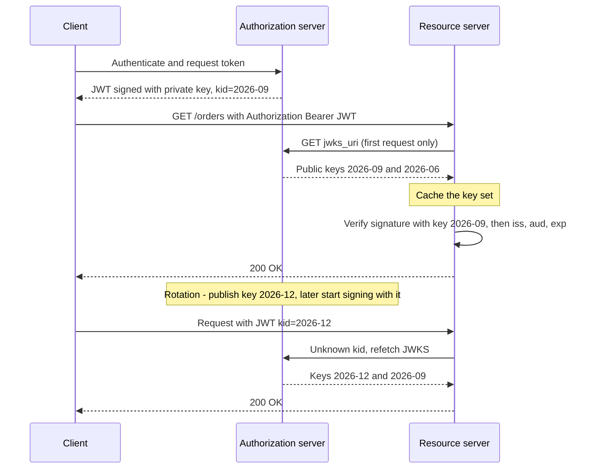
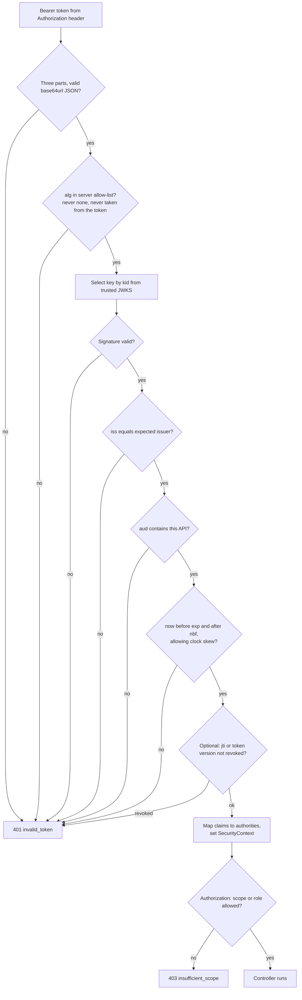

# JWT: Structure, Signing (HS256 vs RS256), Validation, Revocation

!!! abstract "Key takeaways"
    - A JWT is `base64url(header).base64url(payload).base64url(signature)`. It is **signed, not encrypted**: anyone who holds it can read the claims, so never put secrets or sensitive personal data in it.
    - **HS256** is an HMAC with one **shared secret**: every service that can verify can also forge. **RS256/ES256** use a **private key to sign and a public key to verify**, so only the issuer can mint tokens. Use asymmetric signing as soon as more than one party verifies.
    - Validation is more than the signature: pin the **algorithm**, then check `iss`, `aud`, `exp`/`nbf` (with a small clock skew), and the token type. Spring Security checks signature, timestamps and issuer by default. **Audience needs explicit configuration.**
    - Verifiers find the public key through the **JWKS endpoint** and the `kid` header. Key rotation works by publishing the new key before signing with it.
    - A JWT **cannot be un-issued**. Revocation is a trade: short-lived access tokens plus revocable refresh tokens, a `jti` denylist in Redis, a per-user token version, or opaque tokens with introspection.

## Why it matters

Before tokens, a server kept a session in memory or in a shared store, and every request needed a lookup. That works, but it couples every service to the session store. A JWT moves the session state **into the token**: the issuer signs a set of claims, and any service can verify them locally with a key. No network call, no shared store. This is why JWTs became the default access-token format for microservices and for OAuth2 resource servers.

The price is that the token is a **bearer credential that is valid until it expires**. Most of the hard interview questions come from that one fact: how do you choose the signing algorithm, what exactly do you validate, how do you rotate keys, and how do you log a user out.

This page is ★ tied to the resume ("owned JWT-based authentication and SSO implementation end-to-end"), so expect follow-ups three levels deep. Session-versus-token trade-offs live in [Sessions vs tokens; CSRF & CORS](03-sessions-vs-tokens-csrf-and-cors-in-spring.md). How tokens are obtained lives in [OAuth2 roles & grant types](05-oauth2-roles-and-grant-types.md).

## Core concepts

### JWT, JWS, JWE, JWK: the family

| Spec | What it is |
|---|---|
| **JWT** (RFC 7519) | A set of claims as JSON, carried in a JWS or a JWE |
| **JWS** (RFC 7515) | Signed content. This is what people usually mean by "a JWT" |
| **JWE** (RFC 7516) | Encrypted content (five parts instead of three) |
| **JWK / JWKS** (RFC 7517) | A key, or a set of keys, as JSON. Published at `jwks_uri` |
| **JWA** (RFC 7518) | The algorithm names: `HS256`, `RS256`, `ES256`, `PS256`... |

### Structure

```text
eyJhbGciOiJSUzI1NiIsImtpZCI6IjIwMjYtMDkifQ . eyJpc3MiOiJodHRwczovL2lkcC5leGFtcGxlLmNvbSIsInN1YiI6InU0MiJ9 . dBjftJeZ4CVP...
        header (base64url JSON)                              payload (base64url JSON)                           signature
```

```json
// header
{ "alg": "RS256", "kid": "2026-09", "typ": "at+jwt" }

// payload
{
  "iss": "https://idp.example.com",     // who issued it
  "sub": "u42",                         // who it is about
  "aud": "orders-api",                  // who it is for
  "exp": 1790000900,                    // expiry, seconds since epoch
  "nbf": 1790000000,                    // not valid before
  "iat": 1790000000,                    // issued at
  "jti": "9f1c2a7e-...",                // unique token id (used for revocation and replay checks)
  "scope": "orders:read orders:write"   // private claim: what the token allows
}
```

Three facts interviewers check:

1. **Base64url is encoding, not encryption.** Paste a token into any decoder and the claims are readable.
2. **The signature covers the header and the payload.** The signing input is the ASCII string `base64url(header) + "." + base64url(payload)`. Change one character of either and verification fails.
3. **The header is attacker-controlled until the signature is verified.** `alg` and `kid` are hints from an untrusted party. Most historic JWT vulnerabilities come from trusting them.

Registered claims (`iss`, `sub`, `aud`, `exp`, `nbf`, `iat`, `jti`) are all optional in the JWT spec itself. Profiles make them mandatory: RFC 9068 (JWT access tokens) requires `iss`, `exp`, `aud`, `sub`, `client_id`, `iat`, `jti` and the header `typ: at+jwt`.

### Signing: HS256 vs RS256 (and ES256)

**HS256 = HMAC-SHA256.** One secret key. The issuer computes `HMAC(secret, signingInput)`. The verifier recomputes the same HMAC with the same secret and compares. It is a message authentication code, not a true digital signature: there is no way to tell which holder of the secret created the token.

**RS256 = RSASSA-PKCS1-v1_5 with SHA-256.** The issuer hashes the signing input and signs it with the **private key**. Verifiers check it with the **public key**. The public key cannot create signatures, so it can be handed to every service, partner and browser.

**ES256 = ECDSA on curve P-256 with SHA-256.** Same asymmetric model as RS256, with much smaller keys and signatures.

| | HS256 | RS256 | ES256 |
|---|---|---|---|
| Key model | One shared secret | RSA key pair | EC key pair (P-256) |
| Who can mint tokens | **Anyone who can verify** | Only the private-key holder | Only the private-key holder |
| Minimum key size | 256 bits (RFC 7518) | 2048 bits | 256-bit curve |
| Signature size | 32 bytes | 256 bytes (2048-bit key) | 64 bytes |
| Speed | Fastest both ways | Slow sign, fast verify | Fast sign, slower verify than RSA |
| Key distribution | Secret must be copied securely to every verifier | Public key via JWKS | Public key via JWKS |
| Rotation | Coordinated secret change everywhere | Publish new JWK, switch `kid` | Same as RS256 |
| Fits | One service that both issues and verifies | Many verifiers, third parties, any IdP | Same as RS256, when token size matters |

The decision is about **trust boundaries**, not speed. With HS256 across ten microservices, a compromise of the least-secure service gives the attacker the power to forge an admin token for all ten. With RS256, the same compromise leaks only a public key. This is also why OIDC makes RS256 the algorithm every provider must support for ID tokens, and why Spring Security's `NimbusJwtDecoder` trusts **only RS256 by default**.

!!! tip "Say this in the interview"
    "HS256 is fine when the issuer and the verifier are the same process. The moment a second service verifies tokens, I move to RS256 or ES256, because with a shared secret every verifier is also a potential issuer."

### Key distribution: JWKS and `kid`

The issuer publishes its public keys at a **JWKS endpoint** (found via OIDC discovery, see [OpenID Connect](06-openid-connect-id-token-userinfo-discovery.md)). Each key has a `kid`. The token header names the `kid` that signed it. The verifier caches the key set and picks the matching key.


*Notice that the resource server talks to the authorization server only to fetch keys, never per request, and that rotation needs no deployment: an unknown `kid` triggers a refetch of the key set.*

Safe rotation order:

1. **Publish** the new public key in JWKS while still signing with the old one.
2. Wait longer than the verifier cache time, then **switch signing** to the new key.
3. Keep the old public key published until every token it signed has **expired**.
4. **Remove** the old key.

Emergency rotation (private key leaked) skips the waiting: remove the old key at once and accept that every outstanding token fails. That is a forced global logout, which is exactly what you want in that case.

### Validation: the full pipeline


*Notice that no claim is trusted before the signature check passes, that the algorithm comes from server configuration, and that a valid token can still end in 403: validation proves who the caller is, authorization decides what they may do.*

What each check prevents:

| Check | Attack it stops |
|---|---|
| Algorithm allow-list | `alg: none` tokens, and RS256-to-HS256 **algorithm confusion** |
| Signature | Tampering with claims, forged tokens |
| `iss` | Tokens from another tenant, environment or a rogue IdP |
| `aud` | A token issued for service A being **replayed** against service B |
| `exp` / `nbf` | Use of old, stolen or not-yet-valid tokens |
| `typ` (for example `at+jwt`) | An ID token or other JWT type being used as an access token |
| `jti` / version lookup | Use after logout or compromise |

### Revocation: the problem JWT does not solve

A self-contained token is valid because of maths, not because of a server record. Once issued, the issuer cannot take it back. Every revocation design re-introduces some state. The question is how much and where.

| Strategy | How it works | Revocation delay | Cost |
|---|---|---|---|
| **Short TTL + refresh token** | Access token lives 5 to 15 minutes. The refresh token is stored server-side and can be revoked (RFC 7009). | Up to the access-token TTL | Baseline. Always do this. |
| **`jti` denylist** | On logout, store the `jti` in Redis with TTL equal to the token's remaining life. Every request checks it. | Immediate | One Redis lookup per request. Only revoked tokens are stored. |
| **Token version / "not before" per user** | Store `tokenVersion` or `revokedBefore` per user. Token carries `ver` or `iat`. Reject if older. | Immediate, for all of a user's tokens | One lookup per request (cacheable). Good for "log out everywhere" and password change. |
| **Opaque token + introspection** (RFC 7662) | Token is a random string. The resource server asks the authorization server on every request. | Immediate | Network call per request (usually cached for seconds). |
| **Signing-key rotation** | Remove the key. All tokens signed by it die. | Immediate, global | Logs out everyone. Emergency only. |

There is no free option. A denylist check per request is a session lookup under a different name, but it is still cheaper than server sessions, because the list holds only revoked, unexpired tokens and the entries delete themselves.

**Refresh-token rotation with reuse detection** closes the long-lived-token gap: each refresh returns a new refresh token and invalidates the old one. If an old one is presented again, someone has stolen it, so the server revokes the whole token family.

## In practice: code & configuration

### Resource server validation (Spring Boot 3.x / Spring Security 6.x)

```yaml
spring:
  security:
    oauth2:
      resourceserver:
        jwt:
          issuer-uri: https://idp.example.com   # discovery -> jwks_uri, and adds the iss validator
          audiences: orders-api                 # Boot property that adds an aud validator
```

With only `issuer-uri`, Spring Security resolves the JWKS URL from the discovery document, verifies the signature, checks `exp` and `nbf` with a default clock skew of 60 seconds, and checks `iss`. **It does not check `aud` unless you configure it.**

=== "❌ Common mistake"
    ```java
    // Hand-rolled filter: every line here is a real-world vulnerability.
    public Claims parse(String token) {
        String alg = readHeader(token).get("alg");          // trusts attacker-controlled input
        Key key = switch (alg) {
            case "HS256" -> new SecretKeySpec(rsaPublicKeyBytes, "HmacSHA256"); // algorithm confusion:
            case "RS256" -> rsaPublicKey;                    // attacker signs with the PUBLIC key as HMAC secret
            default -> null;                                 // "none" -> null key; vulnerable libraries then skip verification
        };
        return Jwts.parser().setSigningKey(key).parseClaimsJws(token).getBody();
        // Also missing: issuer check, audience check, key rotation, revocation.
    }

    // Token creation in the same codebase:
    private static final String SECRET = "mySecret123";      // short, guessable, committed to git,
                                                             // and shared by every microservice
    ```

=== "✅ Correct approach"
    ```java
    @Configuration
    @EnableMethodSecurity
    class SecurityConfig {

        @Bean
        SecurityFilterChain api(HttpSecurity http) throws Exception {
            return http
                .authorizeHttpRequests(a -> a
                    .requestMatchers("/actuator/health").permitAll()
                    .anyRequest().authenticated())
                .sessionManagement(s -> s.sessionCreationPolicy(SessionCreationPolicy.STATELESS))
                .oauth2ResourceServer(o -> o.jwt(Customizer.withDefaults()))   // BearerTokenAuthenticationFilter
                .build();
        }

        @Bean
        JwtDecoder jwtDecoder(TokenRevocationValidator revocation) {
            String issuer = "https://idp.example.com";

            NimbusJwtDecoder decoder = NimbusJwtDecoder
                .withIssuerLocation(issuer)                          // Spring Security 6.1+. JWKS URL from discovery, cached, refetched on unknown kid
                .jwsAlgorithm(SignatureAlgorithm.RS256)              // allow-list comes from config, never from the token
                .build();

            OAuth2TokenValidator<Jwt> audience = new JwtClaimValidator<List<String>>(
                JwtClaimNames.AUD, aud -> aud != null && aud.contains("orders-api"));   // stops cross-service replay

            decoder.setJwtValidator(new DelegatingOAuth2TokenValidator<>(
                JwtValidators.createDefaultWithIssuer(issuer),       // exp/nbf with 60s skew + iss
                audience,
                revocation));                                        // optional: jti denylist
            return decoder;
        }

        @Bean
        JwtAuthenticationConverter jwtAuthenticationConverter() {
            var authorities = new JwtGrantedAuthoritiesConverter();
            authorities.setAuthoritiesClaimName("roles");            // default reads scope/scp -> SCOPE_xxx
            authorities.setAuthorityPrefix("ROLE_");
            var converter = new JwtAuthenticationConverter();
            converter.setJwtGrantedAuthoritiesConverter(authorities);
            return converter;
        }
    }
    ```

How the filter chain invokes this is covered in [Spring Security architecture](01-spring-security-architecture-filter-chain-securitycontext-au.md). More resource-server options are in [Resource server & client configuration](07-resource-server-and-client-configuration-in-spring.md).

### Revocation with a Redis denylist

```java
@Component
class TokenRevocationValidator implements OAuth2TokenValidator<Jwt> {

    private static final OAuth2Error REVOKED =
        new OAuth2Error(OAuth2ErrorCodes.INVALID_TOKEN, "Token has been revoked", null);

    private final StringRedisTemplate redis;

    TokenRevocationValidator(StringRedisTemplate redis) { this.redis = redis; }

    @Override
    public OAuth2TokenValidatorResult validate(Jwt jwt) {
        // Runs only after the signature is verified, so jti is trustworthy here.
        boolean revoked = Boolean.TRUE.equals(redis.hasKey("revoked:jti:" + jwt.getId()));
        return revoked ? OAuth2TokenValidatorResult.failure(REVOKED)
                       : OAuth2TokenValidatorResult.success();
    }
}

@Service
class LogoutService {
    private final StringRedisTemplate redis;
    LogoutService(StringRedisTemplate redis) { this.redis = redis; }

    void revoke(Jwt jwt) {
        Duration remaining = Duration.between(Instant.now(), jwt.getExpiresAt());
        if (remaining.isPositive()) {
            // TTL = remaining lifetime: the entry removes itself when the token would expire anyway.
            redis.opsForValue().set("revoked:jti:" + jwt.getId(), "1", remaining);
        }
    }
}
```

Decide the failure mode on purpose: if Redis is down, **fail closed** (reject requests) for high-risk APIs, or fail open with an alert for low-risk reads. Say which one you chose and why.

### Issuing tokens yourself (only when no IdP is available)

```java
@Bean
JwtEncoder jwtEncoder(RSAKey rsaKey) {                       // private key loaded from KMS/HSM/Secrets Manager
    return new NimbusJwtEncoder(new ImmutableJWKSet<>(new JWKSet(rsaKey)));
}

String issue(Authentication user) {
    Instant now = Instant.now();
    JwtClaimsSet claims = JwtClaimsSet.builder()
        .issuer("https://auth.example.com")
        .subject(user.getName())
        .audience(List.of("orders-api"))
        .issuedAt(now)
        .expiresAt(now.plus(Duration.ofMinutes(10)))         // short-lived by design
        .id(UUID.randomUUID().toString())                    // jti, needed for the denylist
        .claim("roles", roles(user))                         // keep it small, no personal data
        .build();
    JwsHeader header = JwsHeader.with(SignatureAlgorithm.RS256).keyId(rsaKey.getKeyID()).build();
    return jwtEncoder.encode(JwtEncoderParameters.from(header, claims)).getTokenValue();
}
```

In a new system, prefer a real authorization server (Spring Authorization Server, Keycloak, PingFederate, Entra ID) over a custom token endpoint.

## Real-world usage

- **Every major IdP issues asymmetric JWTs.** Entra ID, Okta, Auth0, Keycloak, PingFederate and Google sign with RS256 by default and publish keys at a JWKS endpoint. Microsoft rotates Entra ID signing keys on its own schedule and tells applications to handle rotation automatically, which is why hardcoding a public key in a service is a production incident waiting to happen.
- **Algorithm confusion and `alg: none` (2015).** Several JWT libraries accepted unsigned tokens or let an attacker switch RS256 to HS256 and sign with the public key as the HMAC secret. RFC 8725 (JWT Best Current Practices) exists largely because of this class of bugs.
- **"Psychic Signatures", CVE-2022-21449.** Java 15 to 18 accepted an ECDSA signature of all zeros as valid, so any ES256 JWT could be forged against an affected JVM. The lesson: the JDK and the JWT library are part of your security boundary, so patch them.
- **Healthcare.** JWT payloads are readable, travel through proxies and end up in logs. Putting member names, dates of birth or diagnosis data in a token is a PHI exposure. Carry an opaque subject id and look the rest up server-side. SMART on FHIR uses signed JWTs for backend-service client authentication.
- **Banking.** Open-banking security profiles such as FAPI ask for PS256 or ES256 rather than RS256, and for **sender-constrained** tokens (mTLS-bound, or DPoP) so that a stolen token is useless without the client's private key. See [Service-to-service auth](09-service-to-service-auth.md).
- **Gateways.** A common pattern is opaque tokens or cookies at the edge and short-lived internal JWTs behind the gateway, so that external revocation is immediate and internal verification stays local.

## Trade-offs & production gotchas

| Option | Pros | Cons | Use when |
|---|---|---|---|
| JWT, local validation | No per-request call, scales horizontally, works across domains | Cannot be revoked without extra state, larger than a session id, claims go stale | Microservices, many verifiers, short TTL acceptable |
| Opaque token + introspection | Immediate revocation, nothing leaks from the token | Authorization server is in the request path, latency and availability coupling | High-risk APIs, public clients, strict logout requirements |
| JWT + `jti` denylist | Immediate revocation, small state | A store lookup per request, store becomes a dependency | Logout and compromise response matter, TTL cannot be very short |
| HS256 | Simple, fast, small | Verifiers can forge, secret distribution and rotation are hard | Single service issues and verifies |
| RS256 / ES256 | Verifiers cannot forge, JWKS rotation | Larger tokens (RSA), private key must be protected | Default for anything distributed |
| JWE (encrypted JWT) | Claims are confidential | Extra key management, bigger, harder to debug | Sensitive claims must travel through untrusted parties |

!!! warning "Gotchas"
    - **Decoding is not validating.** Reading claims from a base64-decoded payload in a gateway or a frontend and acting on them, with no signature check, is the most common real bug.
    - **Audience is not checked by default in Spring Security.** Without it, a token for any API of the same issuer is accepted by your API.
    - **Stale authority.** Roles inside the token stay valid until `exp`, even after an admin removes them. Keep TTLs short or check sensitive permissions at the source.
    - **Token size.** Dozens of roles or groups in claims can exceed header limits (often 8 KB) and cause 431 or 400 errors at proxies. Entra ID handles this with a "groups overage" claim instead of the full list.
    - **Clock skew.** Tokens rejected as "not yet valid" usually mean server clocks have drifted. Fix NTP rather than raising the skew to minutes.
    - **`kid` is input.** Custom key lookups that use `kid` in a file path or SQL query have produced path-traversal and injection bugs. Only match it against a trusted key set.
    - **Tokens in logs and URLs.** Never pass a JWT in a query string, and mask the `Authorization` header in access logs.
    - **Browser storage.** `localStorage` is readable by any injected script. See [Sessions vs tokens; CSRF & CORS](03-sessions-vs-tokens-csrf-and-cors-in-spring.md) for the cookie versus header trade-off.
    - **ID token is not an access token.** An ID token's audience is the client. APIs must reject it. See [OpenID Connect](06-openid-connect-id-token-userinfo-discovery.md).

## How this connects to my experience

- **Where I used it:**
    - **Johnson Controls, Metasys:** "Built user management microservices and owned JWT-based authentication and SSO implementation end-to-end", plus "Implemented Spring Security authorization controls and API security mechanisms". This is the primary story.
    - **Publicis Sapient, OptumRx Meteor:** "Built secure enterprise APIs using OAuth2, PingFederate, and Active Directory integration". Here the IdP issues the tokens and my services act as resource servers that validate them.
    - **Coriolis, CipherTrust Cloud Key Management:** key rotation workflows and HSM integrations. Not JWT work, but it is the same discipline as protecting and rotating a token-signing key.
- **Talking points:**
    - At Metasys I owned the full token lifecycle: login, token issue, validation in each microservice through a Spring Security filter, and SSO across the services split out of the monolith. *[confirm: signing algorithm used (HS256 or RS256), token TTL, whether refresh tokens existed, and how logout was handled]*
    - If the Metasys design used a shared secret, say so honestly and add what I would change today: asymmetric signing, JWKS, short TTL, refresh rotation. Interviewers value the hindsight more than a perfect history. *[confirm]*
    - At OptumRx the tokens come from PingFederate. The services validate signature, issuer, audience and expiry through Spring Security's resource-server support, and map AD groups or scopes to authorities. *[confirm: JWT access tokens validated locally via JWKS, or opaque tokens with introspection, and which claim carries roles/groups]*
    - The GraphQL Consumer Service calls 5 upstream systems, so token propagation matters: forward the user's token, or obtain a service token with client credentials. *[confirm which approach was used]* Details are in [Service-to-service auth](09-service-to-service-auth.md).
    - From CCKM: a signing key belongs in a KMS or HSM, the application asks the HSM to sign and never holds the raw private key, and rotation is an automated, rehearsed workflow.
    - Healthcare angle: no PHI in token claims, because the payload is only encoded.
- **Likely follow-up chain:**
    - "You owned JWT auth end-to-end. Which algorithm did you use and why?" → State the actual choice *[confirm]*, then the principle: shared secret means every verifier can forge, so asymmetric signing for multiple services.
    - "How did a user log out if the token is stateless?" → Short access-token TTL, revoke the refresh token, and a `jti` denylist in Redis with TTL equal to the remaining lifetime when immediate logout was required. Say what Metasys really did *[confirm]* and what the stronger option is.
    - "How do you rotate the signing key without downtime?" → `kid` plus JWKS, publish the new key first, sign later, retire the old key after the longest token lifetime.
    - "What does your service check besides the signature?" → Fixed algorithm, `iss`, `aud`, `exp`/`nbf` with skew, token type, then authorization. Mention that Spring does not check `aud` by default.
    - "What if the token is stolen?" → It works until expiry, so reduce the window (short TTL), detect (refresh reuse detection), contain (denylist), and for high-value APIs bind the token to the client with mTLS or DPoP.

## Interview questions

### Fundamentals

??? question "Q1. What are the three parts of a JWT, and what exactly is signed?"
    **Answer:** Header, payload and signature, each base64url-encoded and joined with dots. The header says how the token is signed (`alg`, `kid`, `typ`). The payload holds the claims. The signature is computed over the exact string `base64url(header) + "." + base64url(payload)`, so both parts are protected against change.

    **Interviewer listens for:** The signature covers the header too. Base64url, not plain base64. This compact form is a JWS.

    **Common wrong answer:** "The payload is encrypted with the secret." It is only encoded.

??? question "Q2. Is a JWT encrypted? Can I put a user's email or SSN in it?"
    **Answer:** A normal JWT (JWS) is signed, not encrypted. Anyone holding the token can decode and read it. The signature gives integrity and authenticity, not confidentiality. Keep claims minimal: an opaque subject id, scopes or roles, and the standard claims. If claims must be confidential, use JWE or an opaque token and look the data up server-side.

    **Interviewer listens for:** Integrity versus confidentiality. Awareness that tokens reach logs, proxies and browser storage. JWE as the encrypted form.

    **Common wrong answer:** "It is safe because it goes over HTTPS." TLS protects the transport only. The token is still stored and logged at both ends.

??? question "Q3. Explain HS256 versus RS256."
    **Answer:** HS256 is an HMAC with one shared secret used for both signing and verifying. RS256 is an RSA signature: private key signs, public key verifies. With HS256 every verifier holds the power to create tokens, so one compromised service compromises the whole system, and the secret must be distributed and rotated in every service. With RS256 only the issuer holds the private key and verifiers fetch the public key from JWKS. HS256 is acceptable when the same service issues and verifies. For multiple services or third parties, use RS256 or ES256.

    **Interviewer listens for:** The trust-boundary argument, not only "symmetric versus asymmetric". Key distribution and rotation. HMAC keys of at least 256 bits.

    **Common wrong answer:** "RS256 is more secure because the key is longer." The point is who is able to forge.

??? question "Q4. What do the claims `iss`, `sub`, `aud`, `exp`, `nbf`, `iat`, `jti` mean?"
    **Answer:** `iss` is the issuer, `sub` the subject (user or client), `aud` the intended recipient or recipients, `exp` the expiry time, `nbf` the time before which the token is not valid, `iat` the issue time, and `jti` a unique id for the token. Times are seconds since the Unix epoch. `aud` may be a string or an array.

    **Interviewer listens for:** `aud` as protection against replay to another service. `jti` used for revocation and replay detection. Seconds, not milliseconds.

    **Common wrong answer:** "aud is the user's audience group." It names the service the token is meant for.

??? question "Q5. Output prediction: an attacker decodes the payload, changes `\"role\":\"user\"` to `\"role\":\"admin\"`, re-encodes it and keeps the old signature. What happens?"
    **Answer:** Verification fails and the resource server returns 401 with `WWW-Authenticate: Bearer error="invalid_token"`. The signature was computed over the original payload bytes, and the attacker cannot produce a new valid signature without the key. This holds only if the server really verifies. A service that merely decodes the payload would accept the change.

    **Interviewer listens for:** 401, not 403. The distinction between decoding and verifying.

    **Common wrong answer:** "The JWT is encrypted, so the attacker cannot change it." It is signed, not encrypted; anyone can read it.

### Intermediate

??? question "Q6. Walk me through everything a resource server must validate."
    **Answer:** In order:

    1. The token parses as a JWS.
    2. The algorithm is one the server has configured, never `none` and never chosen by the token.
    3. The key is picked by `kid` from a trusted key set and the signature verifies.
    4. `iss` equals the expected issuer exactly.
    5. `aud` contains this API.
    6. The current time is before `exp` and not before `nbf`, with a small skew.
    7. Optionally the token type and a revocation check.

    Only then are claims mapped to authorities, and authorization rules decide between 200 and 403.

    **Interviewer listens for:** Algorithm pinning and audience. Order: nothing trusted before the signature check. 401 for invalid token versus 403 for insufficient scope.

    **Common wrong answer:** "Verify the signature and check expiry." It skips issuer and audience, which is how cross-tenant and cross-service token reuse happens.

??? question "Q7. What does Spring Security validate out of the box, and what must you add?"
    **Answer:** With `issuer-uri` configured, `NimbusJwtDecoder` verifies the signature with keys from the discovered JWKS URL, accepts only RS256 unless told otherwise, checks `exp` and `nbf` with a 60-second clock skew (`JwtTimestampValidator`), and checks `iss` (`JwtIssuerValidator`). Audience is not checked by default: add the Boot property `spring.security.oauth2.resourceserver.jwt.audiences` or a `JwtClaimValidator` on `aud`. If you configure only `jwk-set-uri`, the issuer check is not added either. Custom checks such as a `jti` denylist are extra `OAuth2TokenValidator<Jwt>` implementations combined with `DelegatingOAuth2TokenValidator`. Authorities default to `SCOPE_` plus each value of `scope` or `scp`.

    **Interviewer listens for:** Knowing the defaults instead of assuming. `issuer-uri` versus `jwk-set-uri`. `JwtAuthenticationConverter` for custom role claims.

    **Common wrong answer:** "Spring validates audience automatically." You must add an audience validator.

??? question "Q8. Explain the `alg: none` and the RS256-to-HS256 confusion attacks."
    **Answer:** In `alg: none`, the attacker sets the header to say the token is unsigned and removes the signature. A library that honours the header accepts it. In algorithm confusion, the server expects RS256 and holds an RSA public key. The attacker changes the header to HS256 and signs the token with HMAC, using the **public key bytes as the secret**. A library with a generic `verify(token, key)` call reads HS256 from the header, uses the public key as an HMAC secret, and the check passes. The public key is public, so anyone can do this. The fix is the same for both: the verifier fixes the accepted algorithms and the key type in its own configuration and ignores what the token asks for.

    **Interviewer listens for:** The root cause, which is trusting an attacker-controlled header. RFC 8725. That Spring's decoder is built for a specific algorithm set.

    **Common wrong answer:** "Modern libraries are immune, so it does not matter." Pinning the algorithm is still required.

??? question "Q9. What is a JWKS endpoint and how does `kid` enable key rotation?"
    **Answer:** JWKS is a JSON document listing the issuer's current public keys, each with a `kid`. The token header carries the `kid` of the signing key. The verifier caches the set and selects the key by `kid`. To rotate, the issuer adds the new key to the set, later starts signing with it, and removes the old key once all tokens signed with it have expired. A verifier that sees an unknown `kid` refetches the set, so no deployment is needed.

    **Interviewer listens for:** Publish before use. Overlap period equal to at least the maximum token lifetime. Caching, and rate-limiting refetches so that random `kid` values cannot be used to flood the IdP.

    **Common wrong answer:** "We put the public key in application properties." That makes every rotation a coordinated deployment.

??? question "Q10. Access token versus refresh token: why two tokens?"
    **Answer:** They have opposite requirements. The access token is sent on every request to many services, so it should be self-contained and short-lived to limit damage if stolen. The refresh token is sent only to the authorization server, so it can be long-lived, stored server-side and revoked at any time. Refreshing is the moment the server re-checks the user: still active, password not changed, session not revoked. With rotation, each refresh returns a new refresh token and reuse of an old one revokes the family.

    **Interviewer listens for:** Refresh is the revocation checkpoint. Refresh tokens are usually opaque. Reuse detection. Grant details are in [OAuth2 roles & grant types](05-oauth2-roles-and-grant-types.md).

    **Common wrong answer:** "The refresh token is just a longer-lived access token sent to APIs." It goes only to the authorization server.

??? question "Q11. Gotcha: a service returns 401 with \"Jwt used before\" or \"Jwt expired\" for tokens that were issued one second ago. What is wrong?"
    **Answer:** Clock drift between the issuer and the verifier. If the verifier's clock is behind, `nbf` appears to be in the future (Spring's `JwtTimestampValidator` checks `exp` and `nbf`, not `iat`, though other libraries also reject a future `iat`). If it is ahead, `exp` appears to have passed, which hurts most with very short TTLs. Spring allows 60 seconds of skew by default, so the drift is larger than that or the skew was set to zero. Fix time synchronisation on the hosts. Also check that the issuer writes seconds, not milliseconds, into the time claims.

    **Interviewer listens for:** Clock skew as a concept, the default tolerance, and fixing the cause instead of widening the tolerance to minutes.

    **Common wrong answer:** "The IdP issued bad tokens." Clock skew between machines is the usual cause.

### Senior

??? question "Q12. JWTs are stateless. How do you revoke one?"
    **Answer:** You cannot revoke the token itself, so you choose how much state to add back. Baseline: access tokens of 5 to 15 minutes and server-side refresh tokens, so revoking the refresh token ends the session within one TTL. For immediate revocation: a `jti` denylist in Redis with TTL equal to the remaining lifetime, checked by a custom validator. For "log out everywhere" or a password change: a per-user token version or `revokedBefore` timestamp, compared with a claim. For the strictest cases: opaque tokens with introspection. Last resort: rotate the signing key, which invalidates every token. I pick based on how long the business can tolerate a stolen or stale token.

    **Interviewer listens for:** Honest statement that this costs statelessness. TTL-bound denylist entries. Failure mode when the store is down. Matching the mechanism to the risk.

    **Common wrong answer:** "Delete the token on the client." The copy an attacker holds still works.

??? question "Q13. JWT or opaque tokens: how do you decide?"
    **Answer:** JWT gives local validation with no dependency on the authorization server per request, which suits high-throughput internal service calls. The cost is delayed revocation, visible claims and larger tokens. Opaque tokens give immediate revocation and leak nothing, but each validation is a call to the introspection endpoint, so the authorization server's latency and availability become yours. A common hybrid is opaque tokens (or a session cookie) at the public edge and short-lived JWTs minted by the gateway for internal hops. Spring supports both: `oauth2ResourceServer().jwt()` and `.opaqueToken()`.

    **Interviewer listens for:** A decision based on revocation needs, trust boundary and throughput. The hybrid pattern. Caching introspection results trades back some revocation delay.

    **Common wrong answer:** "JWTs are always better because they are stateless." Revocation and data exposure are the trade-offs.

??? question "Q14. How do you store and rotate the signing key in production?"
    **Answer:** The private key lives in a KMS or HSM, not in a config file or a container image. Ideally the application calls a sign operation and never sees the key material. Each key has a `kid`. Rotation is scheduled and automated: generate the new key, publish its public half in JWKS, wait for verifier caches to refresh, switch signing, keep the old public key until the longest-lived token has expired, then remove it. There is also a tested emergency path that removes a key immediately. Verifiers must cache JWKS, refetch on unknown `kid`, and keep working from the cache if the IdP is briefly unreachable.

    **Interviewer listens for:** Separation of signing from application code. Overlap window. Emergency rotation as a global logout. Verifier-side caching and resilience.

    **Common wrong answer:** Keeping the private key in application.yml or a Kubernetes Secret in plain form.

??? question "Q15. A bearer JWT is stolen. What limits the damage, and what would you add for a high-value API?"
    **Answer:** A bearer token works for whoever holds it, so the levers are: short lifetime, narrow audience and scopes so the token is useful in few places, refresh-token rotation with reuse detection to notice theft, and a denylist to cut it off. To make a stolen token useless, **sender-constrain** it: bind it to a client key with mTLS (RFC 8705) or DPoP (RFC 9449). The token then carries a `cnf` claim with a key thumbprint, and the resource server requires proof of possession of that key on each request. Prevention matters too: no tokens in URLs or logs, and careful browser storage.

    **Interviewer listens for:** Bearer versus proof-of-possession. `aud` and scope minimisation as containment. Detection as well as prevention.

    **Common wrong answer:** "Use HTTPS and the token cannot be stolen." Tokens leak from logs, browsers and compromised hosts.

??? question "Q16. Roles are embedded in the JWT. An admin removes a user's role. When does it take effect, and how do you design for it?"
    **Answer:** With plain JWTs, when the current access token expires and the next one is issued, so up to one TTL. Options: keep the TTL short and accept that delay. Put only coarse scopes in the token and check fine-grained permissions against a permission service or cache at request time. Bump the user's token version on role change so existing tokens fail and the client refreshes. Or push a revocation event to services. Choose per operation: a stale read permission for five minutes is usually fine, a stale "approve payment" permission is not.

    **Interviewer listens for:** Token claims are a snapshot. Separating identity (in the token) from fast-changing authorization (looked up). Risk-based choice. See [Authentication vs authorization](02-authentication-vs-authorization-method-security.md).

    **Common wrong answer:** "Immediately, because the token is checked on every request." The JWT still carries the old roles.

### Scenario-based

??? question "Q17. You join a team where 12 microservices share one HS256 secret from a config repo. How do you migrate to RS256 with no downtime?"
    **Answer:** Step 1: stand up the asymmetric key pair and a JWKS endpoint at the issuer. Step 2: release every service with a decoder that accepts **both** token kinds for a while, chosen by server-side logic (for example, try the RS256 decoder for tokens whose `kid` is in the JWKS, otherwise the legacy HS256 decoder), never by blindly following `alg` with one shared key. Add `iss` and `aud` checks at the same time. Step 3: once all services are deployed, switch the issuer to sign with RS256. Step 4: wait for the longest HS256 token lifetime, watch a metric of HS256 validations fall to zero, then remove HS256 support and delete the secret from every repo and secret store. Rotate anything else that secret protected.

    **Interviewer listens for:** Verifiers first, issuer second. A dual-acceptance window with metrics. Avoiding algorithm confusion during the overlap by keeping key types separate. Cleaning up the old secret, including git history.

    **Common wrong answer:** Switching all services to RS256 in one release, which breaks callers holding HS256 tokens.

??? question "Q18. After the IdP rotated its signing key, about half of your pods return 401 for valid tokens. How do you diagnose and prevent it?"
    **Answer:** Half the pods points to per-pod state: some hold a stale JWKS cache. Check the `kid` in a failing token against the keys each pod has, and check whether pods can reach the JWKS URL (egress, proxy, DNS, TLS trust). Likely causes: a hardcoded public key or a custom cache that never refetches on unknown `kid`, the IdP signing with the new key before verifiers' caches could pick it up, or a network policy that blocked the refetch. Short-term fix: restart or refresh the affected pods. Prevention: use the library's JWKS source with refetch on unknown `kid`, ask the IdP team to publish keys ahead of use, alert on JWKS fetch failures, and test rotation in a lower environment.

    **Interviewer listens for:** Reasoning from the "half the pods" symptom. Knowledge of `kid` and cache behaviour. Process fix with the IdP team, not only a restart.

    **Common wrong answer:** "The IdP is broken." Per-pod JWKS caches are stale.

??? question "Q19. A penetration test reports that a token issued for the `reports` service is accepted by the `payments` service. What is the bug and the fix?"
    **Answer:** `payments` does not validate the audience. Both services trust the same issuer, so signature, issuer and expiry all pass. This lets any service that receives a user's token, or any low-privilege client, replay it against a more sensitive API. Fix: the authorization server issues tokens with a specific `aud` per API (or per resource indicator), each resource server requires its own identifier in `aud`, and scopes are specific to the API. In Spring, set `spring.security.oauth2.resourceserver.jwt.audiences` or add a `JwtClaimValidator`. For calls between services, use token exchange to get a new token with the right audience rather than forwarding the original one. See [Service-to-service auth](09-service-to-service-auth.md).

    **Interviewer listens for:** Naming `aud` immediately. Knowing Spring does not enforce it by default. The confused-deputy risk of forwarding tokens.

    **Common wrong answer:** "The tokens are signed, so this is fine." Signature does not say who the token was meant for.

??? question "Q20. Product asks for \"log out from all devices\" that takes effect at once, across 20 services, with JWT access tokens. Design it."
    **Answer:** On the authorization server, revoke all of the user's refresh tokens so no new access tokens can be issued. For the access tokens already out there, keep a per-user `revokedBefore` timestamp (or token version) in Redis. Each service's JWT validator compares the token's `iat` with that value and rejects older tokens. The entry needs to live only as long as the maximum access-token TTL. To avoid 20 services each calling Redis on every request, enforce the check at the gateway, or cache the value locally for a few seconds and push invalidations through a pub/sub or Kafka topic. State the trade-off: this is one small lookup per request and a short propagation delay if a local cache is used. If Redis is unavailable, fail closed for sensitive operations.

    **Interviewer listens for:** Refresh tokens and access tokens handled separately. Per-user marker instead of listing every `jti`. Bounded state through TTL. Where the check runs and what happens on store failure.

    **Common wrong answer:** "Make access tokens valid for 1 minute." It helps, but you still need refresh revocation and a deny list.

## Cheat sheet

| Concept | Remember |
|---|---|
| Structure | `header.payload.signature`, base64url, signed over `header.payload` |
| Confidentiality | None. Signed, not encrypted. JWE if claims must be hidden |
| HS256 | HMAC, one shared secret of at least 256 bits, verifier can forge |
| RS256 | RSA private key signs, public key verifies, 2048 bits or more, 256-byte signature |
| ES256 | ECDSA P-256, 64-byte signature, same trust model as RS256 |
| Algorithm | Fixed by server config. Never `none`. Never taken from the token header |
| JWKS + `kid` | Public keys published by the issuer. Unknown `kid` triggers a refetch |
| Rotation | Publish new key, then sign with it, then retire the old key after max token lifetime |
| Validation order | alg, signature, `iss`, `aud`, `exp`/`nbf`, type, revocation, then authorities |
| Spring defaults | RS256 only, 60s clock skew, `iss` checked with `issuer-uri`, **`aud` not checked** |
| Authorities | `scope`/`scp` become `SCOPE_x`. Customise with `JwtAuthenticationConverter` |
| 401 vs 403 | 401 invalid or missing token. 403 valid token, insufficient scope |
| Revocation | Short TTL + refresh, `jti` denylist with TTL, per-user version, introspection, key rotation |
| Refresh token | Long-lived, server-side, revocable, rotate with reuse detection |
| Stolen token | Short TTL, narrow `aud`/scope, sender-constrain with mTLS or DPoP |
| Payload hygiene | No PHI or PII, keep it small, never in URLs or logs |

## Sources

1. [RFC 7519: JSON Web Token (JWT)](https://datatracker.ietf.org/doc/html/rfc7519): structure, registered claims and their meaning.
2. [RFC 7518: JSON Web Algorithms (JWA)](https://datatracker.ietf.org/doc/html/rfc7518): HS256, RS256 and ES256 definitions and minimum key sizes.
3. [RFC 8725: JSON Web Token Best Current Practices](https://datatracker.ietf.org/doc/html/rfc8725): algorithm verification, `alg: none`, algorithm confusion, audience and type validation.
4. [RFC 9068: JWT Profile for OAuth 2.0 Access Tokens](https://datatracker.ietf.org/doc/html/rfc9068): required claims and the `at+jwt` type for access tokens.
5. [Spring Security Reference: OAuth 2.0 Resource Server JWT](https://docs.spring.io/spring-security/reference/servlet/oauth2/resource-server/jwt.html): `NimbusJwtDecoder`, default validators, clock skew, trusted algorithms, audience validation, authority mapping.
6. [OWASP JSON Web Token Cheat Sheet for Java](https://cheatsheetseries.owasp.org/cheatsheets/JSON_Web_Token_for_Java_Cheat_Sheet.html): common JWT weaknesses, token storage and revocation with a denylist.
7. [RFC 7009: OAuth 2.0 Token Revocation](https://datatracker.ietf.org/doc/html/rfc7009) and [RFC 7662: Token Introspection](https://datatracker.ietf.org/doc/html/rfc7662): the standard revocation and introspection endpoints.
8. [RFC 9449: OAuth 2.0 Demonstrating Proof of Possession (DPoP)](https://datatracker.ietf.org/doc/html/rfc9449): sender-constrained tokens as the answer to bearer-token theft.
